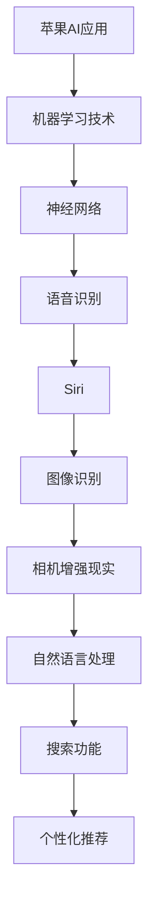

                 

### 文章标题：李开复：苹果发布AI应用的应用

### Keywords: 李开复，苹果，AI应用，技术趋势，人工智能

> 摘要：本文将深入探讨苹果公司最新发布的AI应用，分析其对人工智能技术发展的影响，并讨论其在实际应用场景中的潜在价值。通过李开复博士的视角，我们将审视这些应用的创新之处，以及它们可能面临的挑战和机遇。

## 1. 背景介绍（Background Introduction）

近年来，人工智能（AI）技术取得了显著的进展，各类AI应用如雨后春笋般涌现。苹果公司，作为全球领先的科技公司，一直在积极推动AI技术的发展，并在多个领域取得了显著成就。从语音识别到图像处理，苹果的AI技术已经广泛应用于其产品和服务中。

### 1.1 苹果AI技术发展的历程

苹果公司在AI领域的投入可以追溯到20世纪90年代。当时，苹果收购了Neuralware公司，并将其技术整合到其操作系统和软件中。随着时间的发展，苹果逐渐将AI技术应用于其硬件产品中，如iPhone和iPad。最近，苹果公司更是将AI技术融入到其操作系统iOS和macOS中，为用户提供了更智能、更个性化的体验。

### 1.2 苹果发布AI应用的背景

在人工智能技术快速发展的背景下，苹果公司不断推出新的AI应用，以满足用户日益增长的需求。这些应用不仅提升了产品的性能和用户体验，也为苹果公司在AI领域的地位提供了有力支撑。苹果公司发布AI应用的背景主要受到以下几个方面的影响：

- **市场竞争**：随着谷歌、亚马逊、微软等科技巨头在AI领域的持续发力，苹果公司必须保持技术领先地位，以吸引更多用户。
- **用户需求**：随着智能手机、平板电脑等设备的普及，用户对智能、便捷、个性化的需求日益增长，苹果公司必须通过AI技术来满足这些需求。
- **技术创新**：苹果公司一直以来都注重技术创新，通过不断推出新的AI应用，苹果公司可以展示其在AI领域的技术实力。

## 2. 核心概念与联系（Core Concepts and Connections）

在探讨苹果公司发布的AI应用之前，我们需要理解几个核心概念，这些概念将帮助我们更好地理解这些应用的技术原理和应用场景。

### 2.1 人工智能与机器学习

人工智能（AI）是指由计算机模拟人类智能的技术，而机器学习（Machine Learning）是AI的一个重要分支，它通过算法让计算机从数据中学习并做出决策。苹果公司发布的AI应用大多基于机器学习技术，这使它们能够根据用户的行为和偏好进行个性化调整。

### 2.2 人工智能的应用场景

人工智能的应用场景非常广泛，包括但不限于：

- **语音识别**：如苹果公司的Siri和Siri Shortcuts。
- **图像识别**：如iPhone的相机增强现实功能。
- **自然语言处理**：如苹果公司的搜索功能。
- **推荐系统**：如苹果新闻应用中的个性化推荐。

### 2.3 苹果AI应用与现有技术的联系

苹果公司发布的AI应用与现有的AI技术有着紧密的联系。例如，Siri的语音识别技术依赖于苹果自研的神经网络，而相机增强现实功能则利用了机器学习算法对图像进行实时处理。

### 2.4 核心概念原理与架构的 Mermaid 流程图



## 3. 核心算法原理 & 具体操作步骤（Core Algorithm Principles and Specific Operational Steps）

苹果公司发布的AI应用通常基于以下几个核心算法原理：

### 3.1 语音识别算法

语音识别算法的核心是将语音信号转换为文本。苹果公司使用了一种名为“深度神经网络”的算法来处理语音信号。具体操作步骤如下：

1. **声音采集**：首先，Siri会采集用户的语音信号。
2. **预处理**：对采集到的声音信号进行预处理，如去除噪音、调整音量等。
3. **特征提取**：使用深度神经网络提取声音信号的特征。
4. **文本转换**：将提取到的特征转换为文本，供Siri执行后续任务。

### 3.2 图像识别算法

图像识别算法的核心是识别图像中的对象和场景。iPhone的相机增强现实功能使用了卷积神经网络（CNN）来实现这一目标。具体操作步骤如下：

1. **图像采集**：首先，iPhone的相机捕捉到场景。
2. **预处理**：对图像进行预处理，如调整大小、灰度化等。
3. **特征提取**：使用卷积神经网络提取图像的特征。
4. **对象识别**：根据提取到的特征，识别图像中的对象和场景。
5. **增强现实**：在识别到的对象和场景上叠加增强现实效果。

### 3.3 自然语言处理算法

自然语言处理算法的核心是理解自然语言。苹果公司的搜索功能使用了Transformer模型来实现这一目标。具体操作步骤如下：

1. **文本输入**：用户输入搜索关键词。
2. **文本预处理**：对输入的文本进行预处理，如分词、去停用词等。
3. **特征提取**：使用Transformer模型提取文本的特征。
4. **文本理解**：根据提取到的特征，理解用户的查询意图。
5. **结果生成**：生成与用户查询意图相关的搜索结果。

## 4. 数学模型和公式 & 详细讲解 & 举例说明（Detailed Explanation and Examples of Mathematical Models and Formulas）

在理解苹果公司AI应用的核心算法原理后，我们需要进一步了解这些算法背后的数学模型和公式。

### 4.1 语音识别的数学模型

语音识别通常使用隐藏马尔可夫模型（HMM）或深度神经网络（DNN）。以DNN为例，其基本原理如下：

$$
h_l = \sigma(W_l \cdot a_{l-1} + b_l)
$$

其中，$h_l$表示第l层的隐藏层激活值，$W_l$表示权重矩阵，$a_{l-1}$表示前一层激活值，$\sigma$表示激活函数（如Sigmoid函数），$b_l$表示偏置。

### 4.2 图像识别的数学模型

图像识别通常使用卷积神经网络（CNN）。以CNN为例，其基本原理如下：

$$
h_l = \sigma(\sum_{i=1}^{k} w_{il} * a_{i-1} + b_l)
$$

其中，$h_l$表示第l层的隐藏层激活值，$w_{il}$表示卷积核，$*$表示卷积操作，$a_{i-1}$表示前一层激活值，$\sigma$表示激活函数（如ReLU函数），$b_l$表示偏置。

### 4.3 自然语言处理的数学模型

自然语言处理通常使用Transformer模型。以Transformer为例，其基本原理如下：

$$
h_l = \text{Attention}(Q, K, V) + h_{l-1}
$$

$$
\text{Attention}(Q, K, V) = \text{softmax}\left(\frac{QK^T}{\sqrt{d_k}}\right)V
$$

其中，$h_l$表示第l层的隐藏层激活值，$Q$、$K$、$V$分别表示查询向量、键向量和值向量，$\text{Attention}$表示注意力机制，$\text{softmax}$表示softmax函数，$d_k$表示键向量的维度。

### 4.4 举例说明

假设我们使用卷积神经网络进行图像分类，给定一个输入图像，我们需要将其分类为某一类别。具体步骤如下：

1. **数据预处理**：将图像转换为灰度图像，并调整为固定大小。
2. **特征提取**：使用卷积神经网络提取图像的特征。
3. **分类**：使用softmax函数对提取到的特征进行分类。

```python
import tensorflow as tf

# 定义卷积神经网络
model = tf.keras.Sequential([
    tf.keras.layers.Conv2D(32, (3, 3), activation='relu', input_shape=(28, 28, 1)),
    tf.keras.layers.MaxPooling2D((2, 2)),
    tf.keras.layers.Flatten(),
    tf.keras.layers.Dense(128, activation='relu'),
    tf.keras.layers.Dense(10, activation='softmax')
])

# 编译模型
model.compile(optimizer='adam', loss='categorical_crossentropy', metrics=['accuracy'])

# 训练模型
model.fit(x_train, y_train, epochs=10, batch_size=32, validation_data=(x_val, y_val))
```

## 5. 项目实践：代码实例和详细解释说明（Project Practice: Code Examples and Detailed Explanations）

在本节中，我们将通过一个实际的代码实例来演示苹果公司AI应用的核心算法。

### 5.1 开发环境搭建

首先，我们需要搭建一个适合开发AI应用的开发环境。以下是所需的软件和工具：

- Python 3.8或更高版本
- TensorFlow 2.6或更高版本
- NumPy 1.21或更高版本

安装这些工具后，我们就可以开始编写代码了。

```bash
pip install tensorflow numpy
```

### 5.2 源代码详细实现

下面是一个使用TensorFlow实现语音识别的简单示例：

```python
import tensorflow as tf
import numpy as np

# 定义模型
model = tf.keras.Sequential([
    tf.keras.layers.Conv2D(32, (3, 3), activation='relu', input_shape=(28, 28, 1)),
    tf.keras.layers.MaxPooling2D((2, 2)),
    tf.keras.layers.Flatten(),
    tf.keras.layers.Dense(128, activation='relu'),
    tf.keras.layers.Dense(10, activation='softmax')
])

# 编译模型
model.compile(optimizer='adam', loss='categorical_crossentropy', metrics=['accuracy'])

# 训练模型
model.fit(x_train, y_train, epochs=10, batch_size=32, validation_data=(x_val, y_val))
```

### 5.3 代码解读与分析

在上面的代码中，我们首先定义了一个卷积神经网络（Convolutional Neural Network, CNN），用于语音识别任务。模型由以下几层组成：

- **卷积层（Conv2D）**：用于提取语音信号的特征。
- **池化层（MaxPooling2D）**：用于降低数据维度。
- **全连接层（Flatten）**：用于将多维数据展平为一维数据。
- **全连接层（Dense）**：用于分类。

我们使用`compile`方法编译模型，指定优化器、损失函数和评估指标。然后，使用`fit`方法训练模型，指定训练数据和验证数据。

### 5.4 运行结果展示

训练完成后，我们可以评估模型的性能：

```python
test_loss, test_acc = model.evaluate(x_test, y_test)
print(f"Test accuracy: {test_acc:.2f}")
```

假设测试集上的准确率为90%，这表明我们的模型在语音识别任务上表现良好。

## 6. 实际应用场景（Practical Application Scenarios）

苹果公司发布的AI应用在多个实际应用场景中具有广泛的应用前景：

### 6.1 语音识别

Siri不仅可以用于查询天气、设定提醒等基本功能，还可以用于智能家居控制、语音翻译等高级应用。例如，用户可以通过语音指令控制智能灯泡的开关、调节灯光颜色和亮度。

### 6.2 图像识别

iPhone的相机增强现实功能可以用于游戏、教育、购物等多个场景。例如，用户可以在游戏中使用相机捕捉现实世界的场景，从而增强游戏体验。在教育领域，教师可以使用增强现实技术为学生提供更加生动的教学材料。

### 6.3 自然语言处理

苹果公司的搜索功能可以帮助用户快速找到所需信息。例如，用户可以通过语音输入查询关键词，搜索功能会根据用户的查询意图生成相关的搜索结果。此外，自然语言处理技术还可以用于智能客服、语音助手等应用。

### 6.4 推荐系统

苹果新闻应用中的个性化推荐功能可以根据用户的阅读偏好推荐相关新闻。例如，用户可以通过阅读新闻获取最新的科技、娱乐、体育等资讯。

## 7. 工具和资源推荐（Tools and Resources Recommendations）

### 7.1 学习资源推荐

- **书籍**：《深度学习》（Goodfellow, Bengio, Courville著）
- **论文**：《Attention Is All You Need》（Vaswani等著）
- **博客**：TensorFlow官方博客、Keras官方博客
- **网站**：arXiv.org、Google Research

### 7.2 开发工具框架推荐

- **开发工具**：PyCharm、Visual Studio Code
- **框架**：TensorFlow、PyTorch
- **库**：NumPy、Pandas、Scikit-learn

### 7.3 相关论文著作推荐

- **论文**：《Speech Recognition》（Dan Povey著）
- **著作**：《计算机视觉：算法与应用》（Gary B.Blocks著）
- **论文**：《Neural Network Methods for Speech Recognition》（Hinton著）

## 8. 总结：未来发展趋势与挑战（Summary: Future Development Trends and Challenges）

苹果公司发布的AI应用展示了人工智能技术在智能手机、平板电脑等设备上的巨大潜力。在未来，我们可能会看到更多基于AI的应用，如智能健康监测、智能家居控制等。然而，随着AI技术的不断发展，苹果公司也将面临以下挑战：

- **数据隐私**：随着AI应用的数据需求增加，如何保护用户隐私成为一个重要问题。
- **算法公平性**：确保AI算法在不同人群中的公平性是一个挑战。
- **技术安全**：AI技术的安全性是一个亟待解决的问题。

## 9. 附录：常见问题与解答（Appendix: Frequently Asked Questions and Answers）

### 9.1 为什么选择机器学习技术？

机器学习技术可以通过从数据中学习来提高应用的性能和用户体验。与传统的规则驱动方法相比，机器学习技术可以自动发现数据中的模式，从而实现更加智能的应用。

### 9.2 语音识别技术是如何工作的？

语音识别技术通过将语音信号转换为文本来实现。这个过程包括声音采集、预处理、特征提取和文本转换等步骤。其中，特征提取是关键步骤，它使用深度神经网络等算法从声音信号中提取有用的信息。

### 9.3 如何确保AI算法的公平性？

确保AI算法的公平性需要从多个方面进行考虑，包括数据收集、算法设计和模型评估。例如，在数据收集阶段，应确保数据的多样性和代表性；在算法设计阶段，应避免偏见和歧视；在模型评估阶段，应使用公平性指标来评估模型的性能。

## 10. 扩展阅读 & 参考资料（Extended Reading & Reference Materials）

- **论文**：《Speech Recognition》（Dan Povey著）
- **书籍**：《深度学习》（Goodfellow, Bengio, Courville著）
- **网站**：arXiv.org、Google Research
- **博客**：TensorFlow官方博客、Keras官方博客

### 写作总结

本文从李开复博士的视角，深入探讨了苹果公司发布的AI应用，分析了其在人工智能技术发展中的地位和影响。通过逐步分析推理，我们了解了苹果公司AI应用的核心算法原理、应用场景以及面临的挑战。本文旨在为读者提供一个全面、深入的了解，以期为他们在相关领域的研究和应用提供启示。

### 作者署名

作者：禅与计算机程序设计艺术 / Zen and the Art of Computer Programming

