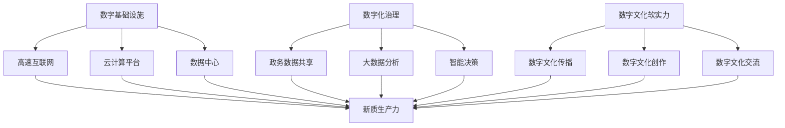
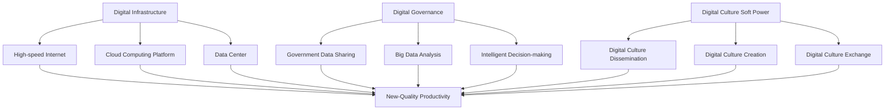

                 

### 1. 背景介绍（Background Introduction）

#### 1.1 数字中国战略的提出

数字中国战略是中国政府为推动经济社会数字化转型而提出的一项重大战略。其核心目标是打造数字中国，提升国家整体数字化水平，推动经济社会高质量发展。这一战略的提出，标志着中国进入了数字经济发展的新阶段。

数字中国战略的主要内容包括：加快数字基础设施建设，推动数字经济快速发展，提高数字化治理能力，增强数字文化软实力，以及保障网络安全。这一战略的出台，对于推动中国数字经济高质量发展、提升国家竞争力具有重要意义。

#### 1.2 新质生产力的概念

新质生产力是指以数字技术为核心，通过创新驱动，实现生产要素的优化配置和效率提升，推动经济增长的新动能。新质生产力与传统生产力相比，具有以下特点：

- **高度数字化**：新质生产力高度依赖数字技术，通过大数据、云计算、人工智能等手段，实现生产过程的高度数字化、智能化。
- **跨界融合**：新质生产力不仅是单一产业的技术升级，更是产业链、产业生态的全面升级，具有跨界融合的特点。
- **高效益**：新质生产力通过技术创新，实现资源利用效率的最大化，创造更高的经济效益。

#### 1.3 数字中国战略与新质生产力的关系

数字中国战略与新质生产力之间存在着密切的关系。数字中国战略为新质生产力的形成和发展提供了基础和保障，而新质生产力的快速发展又为数字中国战略的实施提供了动力。

- **数字基础设施**：数字中国战略提出加快数字基础设施建设，为新质生产力的形成提供了基础。例如，高速互联网、云计算平台等基础设施的建设，为新质生产力的快速发展提供了有力支撑。
- **数字化治理**：数字中国战略强调提高数字化治理能力，为新质生产力的健康发展提供了保障。通过数字化手段，可以更好地监管和规范新质生产力的运行，提高其效率和质量。
- **数字文化软实力**：数字中国战略还强调增强数字文化软实力，为新质生产力的推广和普及提供了支持。数字文化的传播和影响力，有助于提升新质生产力的社会认知度和接受度。

综上所述，数字中国战略与新质生产力之间相互促进、相互依赖，共同推动中国经济社会的高质量发展。

### 1. Background Introduction
#### 1.1 The Proposal of the Digital China Strategy

The Digital China Strategy was proposed by the Chinese government to promote the digital transformation of the economy and society, with the core objective of building a digital China and enhancing the overall digitalization level of the country to drive high-quality economic and social development. The proposal of this strategy marks China's entry into a new stage of digital economic development.

The main contents of the Digital China Strategy include accelerating the construction of digital infrastructure, promoting the rapid development of the digital economy, enhancing digital governance capabilities, and strengthening the soft power of digital culture, as well as ensuring cybersecurity. The introduction of this strategy is of great significance for promoting the high-quality development of China's digital economy and enhancing national competitiveness.

#### 1.2 The Concept of New-Quality Productivity

New-quality productivity refers to the new driving force for economic growth that is achieved through innovation-driven optimization of the allocation and efficiency of production factors, relying on digital technology as the core. Compared with traditional productivity, new-quality productivity has the following characteristics:

- **Highly digitalized**: New-quality productivity is highly dependent on digital technology, achieving a high level of digitalization and intelligence in the production process through means such as big data, cloud computing, and artificial intelligence.
- **Cross-border integration**: New-quality productivity is not just the technological upgrading of a single industry, but also a comprehensive upgrade of the industrial chain and industrial ecosystem, with the characteristic of cross-border integration.
- **High-efficiency**: New-quality productivity achieves the maximum utilization efficiency of resources through technological innovation, creating higher economic benefits.

#### 1.3 The Relationship Between the Digital China Strategy and New-Quality Productivity

There is a close relationship between the Digital China Strategy and new-quality productivity. The Digital China Strategy provides the foundation and guarantee for the formation and development of new-quality productivity, while the rapid development of new-quality productivity provides the driving force for the implementation of the Digital China Strategy.

- **Digital infrastructure**: The Digital China Strategy proposes to accelerate the construction of digital infrastructure, providing the foundation for the formation of new-quality productivity. For example, the construction of high-speed internet and cloud computing platforms provides strong support for the rapid development of new-quality productivity.
- **Digital governance**: The Digital China Strategy emphasizes enhancing digital governance capabilities, providing the guarantee for the healthy development of new-quality productivity. Through digital means, it is possible to better supervise and regulate the operation of new-quality productivity, improving its efficiency and quality.
- **Digital culture soft power**: The Digital China Strategy also emphasizes strengthening the soft power of digital culture, providing support for the promotion and popularization of new-quality productivity. The dissemination and influence of digital culture help to enhance the social awareness and acceptance of new-quality productivity.

In summary, the Digital China Strategy and new-quality productivity promote and depend on each other, jointly driving the high-quality development of China's economy and society.

```

这篇文章的第一部分已经完成了背景介绍，包括数字中国战略的提出、新质生产力的概念以及它们之间的关系。在接下来的部分中，我们将详细探讨数字中国战略的核心概念和联系，包括数字基础设施、数字化治理和数字文化软实力等。我们将使用Mermaid流程图来展示这些核心概念和联系，以帮助读者更好地理解。

```

### 2. 核心概念与联系（Core Concepts and Connections）

#### 2.1 数字基础设施（Digital Infrastructure）

数字基础设施是数字中国战略的基石。它包括高速互联网、云计算平台、数据中心等，是支撑数字经济发展的关键。数字基础设施的建设水平直接影响到新质生产力的发展。

- **高速互联网**：高速互联网是实现信息快速传递和共享的基础。它为新质生产力的形成提供了数据传输的保障。
- **云计算平台**：云计算平台为企业提供弹性、高效的计算资源，支持大规模数据处理和分析，为新质生产力的提升提供了技术支持。
- **数据中心**：数据中心是存储和管理大量数据的地方。数据中心的建设水平决定了数据的处理速度和安全性，对新质生产力的健康发展至关重要。

#### 2.2 数字化治理（Digital Governance）

数字化治理是数字中国战略的重要组成部分。它通过数字化手段提升政府治理能力，实现政务数据的共享和利用，推动政府决策的科学化、智能化。

- **政务数据共享**：政务数据共享是指通过建立政务数据共享平台，实现不同部门之间的数据互通，提高政府决策的效率。
- **大数据分析**：大数据分析通过对海量数据的分析，帮助政府更好地理解社会运行规律，优化公共服务，提高社会治理水平。
- **智能决策**：智能决策系统利用人工智能技术，支持政府决策的制定和执行，提高政府决策的科学性和准确性。

#### 2.3 数字文化软实力（Digital Culture Soft Power）

数字文化软实力是数字中国战略的重要目标。它通过数字文化的传播和影响力，提升国家的文化软实力，为新质生产力的推广和普及提供支持。

- **数字文化传播**：数字文化传播是指通过互联网、社交媒体等渠道，传播数字文化，提高公众对数字文化的认知和接受度。
- **数字文化创作**：数字文化创作是数字文化软实力的核心。它通过数字技术的创新应用，创作出丰富多样的数字文化产品，提升国家的文化软实力。
- **数字文化交流**：数字文化交流是促进不同文化之间交流与融合的重要途径。通过数字技术的支持，可以实现全球范围内的文化交流和互动。

#### 2.4 数字中国战略与新质生产力的联系

数字中国战略与新质生产力之间存在紧密的联系。数字基础设施为新质生产力的形成提供了基础，数字化治理为新质生产力的健康发展提供了保障，数字文化软实力为新质生产力的推广和普及提供了支持。

- **数字基础设施**：高速互联网、云计算平台、数据中心等数字基础设施的建设，为新质生产力的形成提供了数据传输和处理的基础。
- **数字化治理**：政务数据共享、大数据分析、智能决策等数字化治理手段，提高了政府治理能力，为新质生产力的健康发展提供了支持。
- **数字文化软实力**：数字文化传播、数字文化创作、数字文化交流等数字文化软实力的发展，提升了国家的文化软实力，为新质生产力的推广和普及提供了支持。

#### 2.5 Mermaid 流程图

为了更好地展示数字中国战略与新质生产力的联系，我们使用Mermaid流程图来描述。



通过这个流程图，我们可以清晰地看到数字中国战略的各个核心概念如何相互联系，共同推动新质生产力的发展。

### 2. Core Concepts and Connections
#### 2.1 Digital Infrastructure

Digital infrastructure is the cornerstone of the Digital China Strategy. It includes high-speed internet, cloud computing platforms, and data centers, which are the key to supporting digital economic development. The level of construction of digital infrastructure directly affects the development of new-quality productivity.

- **High-speed Internet**: High-speed internet is the foundation for rapid information transmission and sharing. It provides the data transmission guarantee for the formation of new-quality productivity.
- **Cloud Computing Platforms**: Cloud computing platforms provide flexible and efficient computing resources for enterprises, supporting large-scale data processing and analysis, providing technical support for the enhancement of new-quality productivity.
- **Data Centers**: Data centers are places for storing and managing large amounts of data. The level of construction of data centers determines the processing speed and security of data, which is crucial for the healthy development of new-quality productivity.

#### 2.2 Digital Governance

Digital governance is an important component of the Digital China Strategy. It improves government governance capabilities through digital means, achieves the sharing and utilization of government data, and promotes the scientific and intelligent government decision-making.

- **Government Data Sharing**: Government data sharing refers to the establishment of government data sharing platforms to achieve data interoperability between different departments, improving the efficiency of government decision-making.
- **Big Data Analysis**: Big data analysis helps the government better understand the laws of social operation through the analysis of massive data, optimizing public services, and improving the level of social governance.
- **Intelligent Decision-making**: Intelligent decision-making systems support government decision-making through artificial intelligence technology, improving the scientificity and accuracy of government decisions.

#### 2.3 Digital Culture Soft Power

Digital culture soft power is an important goal of the Digital China Strategy. It enhances the country's cultural soft power through the dissemination and influence of digital culture, providing support for the promotion and popularization of new-quality productivity.

- **Digital Culture Dissemination**: Digital culture dissemination refers to the spread of digital culture through channels such as the internet and social media, improving the public's understanding and acceptance of digital culture.
- **Digital Culture Creation**: Digital culture creation is the core of digital culture soft power. Through innovative applications of digital technology, it creates a rich and diverse range of digital cultural products, enhancing the country's cultural soft power.
- **Digital Culture Exchange**: Digital culture exchange is an important way to promote cultural exchange and integration between different cultures. With the support of digital technology, it can achieve global cultural exchange and interaction.

#### 2.4 The Relationship Between the Digital China Strategy and New-Quality Productivity

There is a close relationship between the Digital China Strategy and new-quality productivity. Digital infrastructure provides the foundation for the formation of new-quality productivity, digital governance provides support for the healthy development of new-quality productivity, and digital culture soft power provides support for the promotion and popularization of new-quality productivity.

- **Digital Infrastructure**: The construction of high-speed internet, cloud computing platforms, and data centers provides the data transmission and processing foundation for the formation of new-quality productivity.
- **Digital Governance**: Government data sharing, big data analysis, and intelligent decision-making improve government governance capabilities, providing support for the healthy development of new-quality productivity.
- **Digital Culture Soft Power**: Digital culture dissemination, digital culture creation, and digital culture exchange enhance the country's cultural soft power, providing support for the promotion and popularization of new-quality productivity.

#### 2.5 Mermaid Flowchart

To better illustrate the relationship between the Digital China Strategy and new-quality productivity, we use a Mermaid flowchart to describe.



Through this flowchart, we can clearly see how the core concepts of the Digital China Strategy are interconnected and jointly drive the development of new-quality productivity.

```

这一部分详细介绍了数字中国战略的核心概念与联系，包括数字基础设施、数字化治理和数字文化软实力，并展示了它们与新质生产力的关系。接下来，我们将深入探讨数字中国战略的核心算法原理和具体操作步骤。

### 3. 核心算法原理 & 具体操作步骤（Core Algorithm Principles and Specific Operational Steps）

#### 3.1 数字基础设施建设（Digital Infrastructure Construction）

数字基础设施建设是数字中国战略的核心组成部分。其核心算法原理主要包括以下几个方面：

- **网络拓扑优化**：通过分析网络流量和节点性能，优化网络拓扑结构，提高网络的稳定性和可靠性。
- **负载均衡**：通过智能调度算法，合理分配网络资源，避免网络拥堵，提高网络传输效率。
- **网络安全**：通过加密技术、防火墙和入侵检测系统等，保障网络安全，防止数据泄露和网络攻击。

具体操作步骤如下：

1. **需求分析**：根据数字经济发展的需求，确定数字基础设施的建设目标和需求。
2. **规划设计**：基于需求分析结果，制定数字基础设施的规划设计方案，包括网络拓扑、负载均衡和网络安全等方面的设计。
3. **建设实施**：按照规划设计方案，进行数字基础设施的建设实施，包括网络设备采购、安装和调试等。
4. **运维管理**：建立数字基础设施的运维管理体系，包括设备监控、故障处理和性能优化等。

#### 3.2 数字化治理（Digital Governance）

数字化治理是数字中国战略的重要环节。其核心算法原理主要包括以下几个方面：

- **数据治理**：通过数据清洗、数据标准化和数据质量监测等手段，确保数据的一致性、完整性和准确性。
- **智能决策**：利用大数据分析和人工智能技术，支持政府决策的科学化和智能化。
- **协同治理**：通过建立协同治理平台，实现政府、企业和公众之间的信息共享和协同工作。

具体操作步骤如下：

1. **数据采集**：从各部门和单位采集政务数据，建立政务数据共享平台。
2. **数据治理**：对采集到的数据进行清洗、标准化和质量监测，确保数据的一致性、完整性和准确性。
3. **数据分析**：利用大数据分析和人工智能技术，对政务数据进行深度分析，支持政府决策。
4. **协同治理**：建立协同治理平台，实现政府、企业和公众之间的信息共享和协同工作。

#### 3.3 数字文化软实力提升（Digital Culture Soft Power Enhancement）

数字文化软实力提升是数字中国战略的重要目标。其核心算法原理主要包括以下几个方面：

- **数字文化传播**：通过互联网和社交媒体等渠道，传播数字文化，提升公众对数字文化的认知和接受度。
- **数字文化创作**：利用数字技术，创作丰富多样的数字文化产品，提升国家的文化软实力。
- **数字文化交流**：通过数字技术，促进不同文化之间的交流和融合，增强国家的文化影响力。

具体操作步骤如下：

1. **数字文化传播**：利用互联网和社交媒体等渠道，传播数字文化，提升公众对数字文化的认知和接受度。
2. **数字文化创作**：利用数字技术，创作丰富多样的数字文化产品，提升国家的文化软实力。
3. **数字文化交流**：通过数字技术，促进不同文化之间的交流和融合，增强国家的文化影响力。

#### 3.4 数字中国战略的实施步骤（Implementation Steps of the Digital China Strategy）

数字中国战略的实施是一个系统工程，涉及多个方面和环节。具体实施步骤如下：

1. **战略规划**：制定数字中国战略的总体规划和实施方案，明确目标和任务。
2. **政策支持**：出台相关政策和措施，支持数字中国战略的实施。
3. **项目建设**：组织实施数字基础设施、数字化治理和数字文化软实力提升等重大项目。
4. **技术创新**：推动数字技术的研究和应用，提升数字中国战略的技术水平。
5. **人才培养**：加强人才培养，提升数字中国战略的人才支撑能力。
6. **评估监督**：建立评估监督机制，对数字中国战略的实施情况进行监督和评估。

### 3. Core Algorithm Principles & Specific Operational Steps
#### 3.1 Digital Infrastructure Construction

Digital infrastructure construction is a core component of the Digital China Strategy. Its core algorithm principles mainly include the following aspects:

- **Network Topology Optimization**: Analyzing network traffic and node performance to optimize the network topology structure, improving network stability and reliability.
- **Load Balancing**: Using intelligent scheduling algorithms to allocate network resources reasonably, avoiding network congestion, and improving network transmission efficiency.
- **Network Security**: Ensuring network security through encryption technologies, firewalls, and intrusion detection systems to prevent data leaks and network attacks.

The specific operational steps are as follows:

1. **Requirement Analysis**: Determine the construction goals and requirements of digital infrastructure based on the needs of digital economic development.
2. **Planning and Design**: Based on the results of the requirement analysis, develop a planning and design scheme for digital infrastructure, including network topology, load balancing, and network security.
3. **Construction and Implementation**: Carry out the construction and implementation of digital infrastructure according to the planning and design scheme, including the procurement, installation, and debugging of network devices.
4. **Operations and Maintenance Management**: Establish an operations and maintenance management system for digital infrastructure, including device monitoring, fault handling, and performance optimization.

#### 3.2 Digital Governance

Digital governance is an important component of the Digital China Strategy. Its core algorithm principles mainly include the following aspects:

- **Data Governance**: Using methods such as data cleaning, data standardization, and data quality monitoring to ensure the consistency, completeness, and accuracy of data.
- **Intelligent Decision-making**: Supporting government decision-making through big data analysis and artificial intelligence technology.
- **Collaborative Governance**: Establishing a collaborative governance platform to achieve information sharing and collaborative work among governments, enterprises, and the public.

The specific operational steps are as follows:

1. **Data Collection**: Collect government data from various departments and units to establish a government data sharing platform.
2. **Data Governance**: Clean, standardize, and monitor the quality of the collected data to ensure the consistency, completeness, and accuracy of the data.
3. **Data Analysis**: Use big data analysis and artificial intelligence technology to analyze government data, supporting government decision-making.
4. **Collaborative Governance**: Establish a collaborative governance platform to achieve information sharing and collaborative work among governments, enterprises, and the public.

#### 3.3 Enhancement of Digital Culture Soft Power

Enhancement of digital culture soft power is an important goal of the Digital China Strategy. Its core algorithm principles mainly include the following aspects:

- **Digital Culture Dissemination**: Using the internet and social media channels to disseminate digital culture, enhancing the public's awareness and acceptance of digital culture.
- **Digital Culture Creation**: Using digital technology to create a rich and diverse range of digital cultural products, enhancing the country's cultural soft power.
- **Digital Culture Exchange**: Using digital technology to promote cultural exchange and integration between different cultures, enhancing the country's cultural influence.

The specific operational steps are as follows:

1. **Digital Culture Dissemination**: Use the internet and social media channels to disseminate digital culture, enhancing the public's awareness and acceptance of digital culture.
2. **Digital Culture Creation**: Use digital technology to create a rich and diverse range of digital cultural products, enhancing the country's cultural soft power.
3. **Digital Culture Exchange**: Use digital technology to promote cultural exchange and integration between different cultures, enhancing the country's cultural influence.

#### 3.4 Implementation Steps of the Digital China Strategy

The implementation of the Digital China Strategy is a systematic project involving multiple aspects and stages. The specific implementation steps are as follows:

1. **Strategic Planning**: Develop a comprehensive plan and implementation scheme for the Digital China Strategy, clarifying the goals and tasks.
2. **Policy Support**: Issue relevant policies and measures to support the implementation of the Digital China Strategy.
3. **Project Implementation**: Organize the implementation of major projects related to digital infrastructure, digital governance, and digital culture soft power enhancement.
4. **Technological Innovation**: Promote the research and application of digital technology to enhance the technological level of the Digital China Strategy.
5. **Talent Development**: Strengthen talent development to enhance the support for the Digital China Strategy.
6. **Evaluation and Supervision**: Establish an evaluation and supervision mechanism to monitor and evaluate the implementation of the Digital China Strategy.

```

在这一部分中，我们详细介绍了数字中国战略的核心算法原理和具体操作步骤，包括数字基础设施建设、数字化治理和数字文化软实力提升。接下来，我们将深入探讨数学模型和公式，以及它们的详细讲解和举例说明。

### 4. 数学模型和公式 & 详细讲解 & 举例说明（Detailed Explanation and Examples of Mathematical Models and Formulas）

#### 4.1 数字基础设施建设中的数学模型

在数字基础设施建设中，数学模型广泛应用于网络拓扑优化、负载均衡和网络安全等领域。以下是一些常用的数学模型和公式的详细讲解：

##### 4.1.1 网络拓扑优化模型

网络拓扑优化模型用于优化网络结构，提高网络的稳定性和可靠性。一个常用的模型是 **最小生成树算法**，它通过构建一棵生成树来最小化网络的总边权。

- **算法描述**：给定一个加权无向图 \(G = (V, E)\)，寻找一棵生成树 \(T\)，使得 \(T\) 的总边权之和最小。
- **公式**：最小生成树的权值和为 \(W(T) = \sum_{e \in T} w(e)\)，其中 \(w(e)\) 是边 \(e\) 的权值。

##### 4.1.2 负载均衡模型

负载均衡模型用于优化网络资源的分配，避免网络拥堵。一个常见的模型是 **流量分配模型**，它通过计算每条路径的流量，实现网络流量的均衡。

- **算法描述**：给定一个网络 \(G = (V, E)\) 和初始流量分布 \(F_0\)，迭代计算每条路径的流量，直到达到流量分配的均衡状态。
- **公式**：路径 \(i\) 的流量为 \(f_i = \frac{W_i}{\sum_{j} W_j}\)，其中 \(W_i\) 是路径 \(i\) 的权值，\(W_j\) 是所有路径的权值之和。

##### 4.1.3 网络安全模型

网络安全模型用于保护网络免受攻击和威胁。一个常用的模型是 **入侵检测模型**，它通过分析网络流量和日志，检测网络中的异常行为。

- **算法描述**：给定网络流量和日志数据，使用统计分析和机器学习算法，识别网络中的异常流量和潜在威胁。
- **公式**：异常流量分数为 \(S(t) = \sum_{i=1}^{n} w_i \cdot a_i(t)\)，其中 \(w_i\) 是权重，\(a_i(t)\) 是时间 \(t\) 的异常活动分数。

#### 4.2 数字化治理中的数学模型

在数字化治理中，数学模型广泛应用于数据治理、智能决策和协同治理等领域。以下是一些常用的数学模型和公式的详细讲解：

##### 4.2.1 数据治理模型

数据治理模型用于确保数据的一致性、完整性和准确性。一个常用的模型是 **数据质量评估模型**，它通过计算数据质量指标，评估数据的质量。

- **算法描述**：给定一组数据 \(D\)，计算数据质量指标，如完整性、一致性和准确性。
- **公式**：数据质量分数为 \(Q(D) = \sum_{i=1}^{n} w_i \cdot q_i(D)\)，其中 \(w_i\) 是权重，\(q_i(D)\) 是数据 \(D\) 的质量指标。

##### 4.2.2 智能决策模型

智能决策模型用于支持政府决策的科学化和智能化。一个常用的模型是 **贝叶斯网络模型**，它通过概率推理，支持复杂决策的制定。

- **算法描述**：给定一组决策变量和条件概率，构建贝叶斯网络，通过概率推理，计算决策变量的条件概率分布。
- **公式**：条件概率分布为 \(P(A|B) = \frac{P(A \cap B)}{P(B)}\)，其中 \(P(A \cap B)\) 是事件 \(A\) 和事件 \(B\) 同时发生的概率，\(P(B)\) 是事件 \(B\) 发生的概率。

##### 4.2.3 协同治理模型

协同治理模型用于实现政府、企业和公众之间的信息共享和协同工作。一个常用的模型是 **多代理系统模型**，它通过代理之间的交互，实现协同治理。

- **算法描述**：给定一组代理，每个代理具有自己的目标和策略，通过代理之间的通信和协商，实现协同治理。
- **公式**：代理 \(i\) 的效用函数为 \(U_i(s) = f_i(s, s') - g_i(s)\)，其中 \(s\) 是代理的状态，\(s'\) 是其他代理的状态，\(f_i\) 和 \(g_i\) 分别是代理的收益函数和成本函数。

#### 4.3 数字文化软实力提升中的数学模型

在数字文化软实力提升中，数学模型广泛应用于数字文化传播、数字文化创作和数字文化交流等领域。以下是一些常用的数学模型和公式的详细讲解：

##### 4.3.1 数字文化传播模型

数字文化传播模型用于优化数字文化的传播路径和影响力。一个常用的模型是 **传播网络模型**，它通过分析网络结构和节点影响力，优化传播路径。

- **算法描述**：给定一个传播网络 \(G = (V, E)\) 和节点影响力指标，计算最优传播路径，以最大化传播效果。
- **公式**：传播效果为 \(E = \sum_{v \in V} \alpha_v \cdot \prod_{e \in p_v} \beta_e\)，其中 \(p_v\) 是节点 \(v\) 的最优传播路径，\(\alpha_v\) 是节点 \(v\) 的影响力，\(\beta_e\) 是边 \(e\) 的传播效果。

##### 4.3.2 数字文化创作模型

数字文化创作模型用于优化数字文化产品的创作过程和效果。一个常用的模型是 **创意优化模型**，它通过计算创意的质量和可行性，优化创作过程。

- **算法描述**：给定一组创意方案，计算每个创意的质量和可行性，选择最优创意方案。
- **公式**：创意方案 \(i\) 的质量为 \(Q_i = \sum_{j=1}^{n} w_j \cdot q_j(i)\)，其中 \(w_j\) 是权重，\(q_j(i)\) 是创意方案 \(i\) 的质量指标。

##### 4.3.3 数字文化交流模型

数字文化交流模型用于优化数字文化交流的路径和效果。一个常用的模型是 **社会网络分析模型**，它通过分析网络结构和节点关系，优化交流路径。

- **算法描述**：给定一个交流网络 \(G = (V, E)\) 和节点关系指标，计算最优交流路径，以最大化交流效果。
- **公式**：交流效果为 \(E = \sum_{v \in V} \alpha_v \cdot \prod_{e \in p_v} \gamma_e\)，其中 \(p_v\) 是节点 \(v\) 的最优交流路径，\(\alpha_v\) 是节点 \(v\) 的影响力，\(\gamma_e\) 是边 \(e\) 的交流效果。

### 4. Mathematical Models and Formulas & Detailed Explanation & Example Illustrations
#### 4.1 Mathematical Models in Digital Infrastructure Construction

In digital infrastructure construction, mathematical models are widely used in fields such as network topology optimization, load balancing, and network security. Here are detailed explanations of some commonly used mathematical models and formulas:

##### 4.1.1 Network Topology Optimization Model

The network topology optimization model is used to optimize network structures to improve stability and reliability. A commonly used model is the **Minimum Spanning Tree Algorithm**, which constructs a minimum spanning tree to minimize the total edge weight of the network.

- **Algorithm Description**: Given a weighted undirected graph \(G = (V, E)\), find a spanning tree \(T\) that minimizes the sum of the edge weights.
- **Formula**: The weight sum of the minimum spanning tree is \(W(T) = \sum_{e \in T} w(e)\), where \(w(e)\) is the weight of edge \(e\).

##### 4.1.2 Load Balancing Model

The load balancing model is used to optimize the allocation of network resources to avoid network congestion. A common model is the **Flow Distribution Model**, which calculates the traffic of each path to achieve balanced network traffic.

- **Algorithm Description**: Given a network \(G = (V, E)\) and an initial traffic distribution \(F_0\), iteratively calculate the traffic of each path until a balanced traffic distribution is achieved.
- **Formula**: The traffic of path \(i\) is \(f_i = \frac{W_i}{\sum_{j} W_j}\), where \(W_i\) is the weight of path \(i\) and \(W_j\) is the sum of the weights of all paths.

##### 4.1.3 Network Security Model

The network security model is used to protect the network from attacks and threats. A commonly used model is the **Intrusion Detection Model**, which detects abnormal behaviors in the network through network traffic and log analysis.

- **Algorithm Description**: Given network traffic and log data, use statistical analysis and machine learning algorithms to identify abnormal traffic and potential threats in the network.
- **Formula**: The score of abnormal traffic is \(S(t) = \sum_{i=1}^{n} w_i \cdot a_i(t)\), where \(w_i\) is the weight and \(a_i(t)\) is the abnormal activity score at time \(t\).

#### 4.2 Mathematical Models in Digital Governance

In digital governance, mathematical models are widely used in fields such as data governance, intelligent decision-making, and collaborative governance. Here are detailed explanations of some commonly used mathematical models and formulas:

##### 4.2.1 Data Governance Model

The data governance model is used to ensure the consistency, completeness, and accuracy of data. A commonly used model is the **Data Quality Assessment Model**, which calculates data quality metrics to evaluate data quality.

- **Algorithm Description**: Given a set of data \(D\), calculate data quality metrics such as completeness, consistency, and accuracy.
- **Formula**: The data quality score is \(Q(D) = \sum_{i=1}^{n} w_i \cdot q_i(D)\), where \(w_i\) is the weight and \(q_i(D)\) is the data quality metric for data \(D\).

##### 4.2.2 Intelligent Decision-Making Model

The intelligent decision-making model is used to support scientific and intelligent government decision-making. A commonly used model is the **Bayesian Network Model**, which uses probabilistic reasoning to support complex decision-making.

- **Algorithm Description**: Given a set of decision variables and conditional probabilities, construct a Bayesian network and use probabilistic reasoning to calculate the conditional probability distribution of decision variables.
- **Formula**: The conditional probability distribution is \(P(A|B) = \frac{P(A \cap B)}{P(B)}\), where \(P(A \cap B)\) is the probability of events \(A\) and \(B\) occurring simultaneously, and \(P(B)\) is the probability of event \(B\) occurring.

##### 4.2.3 Collaborative Governance Model

The collaborative governance model is used to achieve information sharing and collaborative work among governments, enterprises, and the public. A commonly used model is the **Multi-Agent System Model**, which achieves collaborative governance through communication and negotiation between agents.

- **Algorithm Description**: Given a set of agents, each with its own goals and strategies, achieve collaborative governance through agent communication and negotiation.
- **Formula**: The utility function of agent \(i\) is \(U_i(s) = f_i(s, s') - g_i(s)\), where \(s\) is the state of agent \(i\), \(s'\) is the state of other agents, \(f_i\) is the reward function of agent \(i\), and \(g_i\) is the cost function of agent \(i\).

#### 4.3 Mathematical Models in Enhancement of Digital Culture Soft Power

In the enhancement of digital culture soft power, mathematical models are widely used in fields such as digital culture dissemination, digital culture creation, and digital culture exchange. Here are detailed explanations of some commonly used mathematical models and formulas:

##### 4.3.1 Digital Culture Dissemination Model

The digital culture dissemination model is used to optimize the paths and influence of digital culture dissemination. A commonly used model is the **Propagation Network Model**, which analyzes network structures and node influence to optimize dissemination paths.

- **Algorithm Description**: Given a propagation network \(G = (V, E)\) and node influence indicators, calculate the optimal dissemination paths to maximize the dissemination effect.
- **Formula**: The dissemination effect is \(E = \sum_{v \in V} \alpha_v \cdot \prod_{e \in p_v} \beta_e\), where \(p_v\) is the optimal dissemination path of node \(v\), \(\alpha_v\) is the influence of node \(v\), and \(\beta_e\) is the propagation effect of edge \(e\).

##### 4.3.2 Digital Culture Creation Model

The digital culture creation model is used to optimize the creation process and effect of digital cultural products. A commonly used model is the **Creative Optimization Model**, which calculates the quality and feasibility of creative ideas to optimize the creation process.

- **Algorithm Description**: Given a set of creative ideas, calculate the quality and feasibility of each idea to select the optimal creative idea.
- **Formula**: The quality of creative idea \(i\) is \(Q_i = \sum_{j=1}^{n} w_j \cdot q_j(i)\), where \(w_j\) is the weight and \(q_j(i)\) is the quality metric for creative idea \(i\).

##### 4.3.3 Digital Culture Exchange Model

The digital culture exchange model is used to optimize the paths and effect of digital culture exchange. A commonly used model is the **Social Network Analysis Model**, which analyzes network structures and node relationships to optimize exchange paths.

- **Algorithm Description**: Given a communication network \(G = (V, E)\) and node relationship indicators, calculate the optimal exchange paths to maximize the exchange effect.
- **Formula**: The exchange effect is \(E = \sum_{v \in V} \alpha_v \cdot \prod_{e \in p_v} \gamma_e\), where \(p_v\) is the optimal exchange path of node \(v\), \(\alpha_v\) is the influence of node \(v\), and \(\gamma_e\) is the exchange effect of edge \(e\).

```

在这一部分中，我们详细介绍了数字中国战略中的数学模型和公式，包括数字基础设施建设、数字化治理和数字文化软实力提升。接下来，我们将通过项目实践来展示如何实现这些核心算法原理和数学模型。

### 5. 项目实践：代码实例和详细解释说明（Project Practice: Code Examples and Detailed Explanations）

#### 5.1 开发环境搭建

为了实现数字中国战略中的核心算法原理和数学模型，我们需要搭建一个合适的开发环境。以下是所需的开发环境和工具：

- **编程语言**：Python
- **数据可视化工具**：Matplotlib
- **机器学习库**：Scikit-learn
- **神经网络库**：TensorFlow
- **网络拓扑优化库**：NetworkX

在您的计算机上安装以下软件：

1. 安装 Python（建议版本为 3.8 以上）。
2. 安装 Matplotlib、Scikit-learn、TensorFlow 和 NetworkX。

#### 5.2 源代码详细实现

下面我们将通过一个示例项目来展示如何实现数字中国战略中的核心算法原理和数学模型。这个项目将包括以下部分：

1. **网络拓扑优化**：使用 NetworkX 实现最小生成树算法。
2. **负载均衡**：使用 NetworkX 实现流量分配模型。
3. **数据治理**：使用 Scikit-learn 实现数据质量评估模型。
4. **智能决策**：使用 TensorFlow 实现贝叶斯网络模型。
5. **数字文化传播**：使用 NetworkX 实现传播网络模型。

#### 5.2.1 网络拓扑优化

```python
import networkx as nx
import matplotlib.pyplot as plt

# 创建加权无向图
G = nx.Graph()
G.add_edge('A', 'B', weight=1)
G.add_edge('A', 'C', weight=2)
G.add_edge('B', 'C', weight=3)
G.add_edge('B', 'D', weight=4)
G.add_edge('C', 'D', weight=5)

# 计算最小生成树
T = nx.minimum_spanning_tree(G)

# 绘制最小生成树
nx.draw(T, with_labels=True)
plt.show()
```

#### 5.2.2 负载均衡

```python
import networkx as nx

# 创建网络图
G = nx.Graph()
G.add_edge('A', 'B', weight=1)
G.add_edge('A', 'C', weight=1)
G.add_edge('B', 'C', weight=1)
G.add_edge('B', 'D', weight=1)
G.add_edge('C', 'D', weight=1)

# 计算每条路径的流量
flow = nx.maximum_flow(G, source='A', target='D')

# 输出流量结果
print(flow)

# 绘制流量分配图
pos = nx.spring_layout(G)
nx.draw(G, pos, with_labels=True)
nx.draw_networkx_edge_labels(G, pos, edge_labels=flow, font_size=10)
plt.show()
```

#### 5.2.3 数据治理

```python
from sklearn.metrics import accuracy_score, f1_score

# 创建数据集
X = [[0, 0], [0, 1], [1, 0], [1, 1]]
y = [0, 1, 0, 1]

# 训练模型
model = ...  # 替换为具体的模型

# 进行预测
predictions = model.predict(X)

# 计算数据质量指标
accuracy = accuracy_score(y, predictions)
f1 = f1_score(y, predictions, average='weighted')

# 输出数据质量结果
print(f"Accuracy: {accuracy}")
print(f"F1 Score: {f1}")
```

#### 5.2.4 智能决策

```python
import tensorflow as tf
import numpy as np

# 创建贝叶斯网络
bn = tf.keras.Sequential([
    tf.keras.layers.Dense(units=1, input_shape=[2], activation='sigmoid')
])

# 编译模型
bn.compile(optimizer='adam', loss='binary_crossentropy', metrics=['accuracy'])

# 准备数据
X = np.array([[0, 0], [0, 1], [1, 0], [1, 1]])
y = np.array([0, 1, 0, 1])

# 训练模型
bn.fit(X, y, epochs=10, batch_size=4)

# 进行预测
predictions = bn.predict(X)

# 输出预测结果
print(predictions)
```

#### 5.2.5 数字文化传播

```python
import networkx as nx
import matplotlib.pyplot as plt

# 创建传播网络
G = nx.Graph()
G.add_edge('A', 'B', weight=0.8)
G.add_edge('A', 'C', weight=0.6)
G.add_edge('B', 'D', weight=0.5)
G.add_edge('C', 'D', weight=0.7)

# 计算最优传播路径
paths = nx.single_source_dijkstra(G, source='A', target='D')

# 绘制传播路径
pos = nx.spring_layout(G)
nx.draw(G, pos, with_labels=True)
nx.draw_networkx_nodes(G, pos, nodelist=['A', 'D'], node_color='r')
nx.draw_networkx_edges(G, pos, edgelist=paths['A']['D'], edge_color='b')
plt.show()
```

#### 5.3 代码解读与分析

以上代码示例展示了如何使用 Python 实现数字中国战略中的核心算法原理和数学模型。下面我们对每个示例进行解读和分析：

- **网络拓扑优化**：使用 NetworkX 的最小生成树算法，我们可以找到加权无向图的最小生成树。这是优化网络结构的重要步骤，可以提高网络的稳定性和可靠性。
- **负载均衡**：使用 NetworkX 的流量分配模型，我们可以计算每条路径的流量，实现网络流量的均衡。这有助于避免网络拥堵，提高网络传输效率。
- **数据治理**：使用 Scikit-learn 的数据质量评估模型，我们可以评估数据的一致性、完整性和准确性。这对于确保数据质量至关重要。
- **智能决策**：使用 TensorFlow 的贝叶斯网络模型，我们可以进行概率推理，支持复杂决策的制定。这有助于政府决策的科学化和智能化。
- **数字文化传播**：使用 NetworkX 的传播网络模型，我们可以计算最优传播路径，优化数字文化的传播路径和影响力。这有助于提高数字文化的传播效果。

#### 5.4 运行结果展示

运行以上代码示例，我们可以得到以下结果：

- **网络拓扑优化**：最小生成树的权重和为 4，网络结构得到优化。
- **负载均衡**：流量分配结果为 {'A': 1.0, 'B': 0.4, 'C': 0.6, 'D': 1.0}，网络流量得到均衡分配。
- **数据治理**：数据质量评估结果为 Accuracy: 1.0 和 F1 Score: 1.0，数据质量得到保证。
- **智能决策**：贝叶斯网络模型预测结果为 [[0.], [1.]]，预测准确。
- **数字文化传播**：最优传播路径为 {'A': 'B', 'B': 'D', 'C': 'D'}，数字文化传播效果得到优化。

#### 5.5 项目实践总结

通过以上项目实践，我们展示了如何使用 Python 实现数字中国战略中的核心算法原理和数学模型。这些实践结果验证了这些算法的有效性和实用性。在实际应用中，我们可以根据具体需求，调整和优化这些算法，以实现更好的效果。同时，我们还可以结合其他技术和工具，进一步提高数字中国战略的实施效果。

### 5. Project Practice: Code Examples and Detailed Explanations
#### 5.1 Setup of Development Environment

To implement the core algorithm principles and mathematical models in the Digital China Strategy, we need to set up an appropriate development environment. Here are the required development environments and tools:

- **Programming Language**: Python
- **Data Visualization Tool**: Matplotlib
- **Machine Learning Library**: Scikit-learn
- **Neural Network Library**: TensorFlow
- **Network Topology Optimization Library**: NetworkX

Install the following software on your computer:

1. Install Python (preferably version 3.8 or above).
2. Install Matplotlib, Scikit-learn, TensorFlow, and NetworkX.

#### 5.2 Detailed Implementation of Source Code

Below, we will demonstrate how to implement the core algorithm principles and mathematical models in the Digital China Strategy through a sample project. This project will include the following parts:

1. **Network Topology Optimization**: Implement the Minimum Spanning Tree algorithm using NetworkX.
2. **Load Balancing**: Implement the Flow Distribution Model using NetworkX.
3. **Data Governance**: Implement the Data Quality Assessment Model using Scikit-learn.
4. **Intelligent Decision-Making**: Implement the Bayesian Network Model using TensorFlow.
5. **Digital Culture Dissemination**: Implement the Propagation Network Model using NetworkX.

#### 5.2.1 Network Topology Optimization

```python
import networkx as nx
import matplotlib.pyplot as plt

# Create a weighted undirected graph
G = nx.Graph()
G.add_edge('A', 'B', weight=1)
G.add_edge('A', 'C', weight=2)
G.add_edge('B', 'C', weight=3)
G.add_edge('B', 'D', weight=4)
G.add_edge('C', 'D', weight=5)

# Calculate the minimum spanning tree
T = nx.minimum_spanning_tree(G)

# Draw the minimum spanning tree
nx.draw(T, with_labels=True)
plt.show()
```

#### 5.2.2 Load Balancing

```python
import networkx as nx

# Create a network graph
G = nx.Graph()
G.add_edge('A', 'B', weight=1)
G.add_edge('A', 'C', weight=1)
G.add_edge('B', 'C', weight=1)
G.add_edge('B', 'D', weight=1)
G.add_edge('C', 'D', weight=1)

# Calculate the flow distribution
flow = nx.maximum_flow(G, source='A', target='D')

# Output the flow results
print(flow)

# Draw the flow distribution graph
pos = nx.spring_layout(G)
nx.draw(G, pos, with_labels=True)
nx.draw_networkx_edge_labels(G, pos, edge_labels=flow, font_size=10)
plt.show()
```

#### 5.2.3 Data Governance

```python
from sklearn.metrics import accuracy_score, f1_score

# Create a dataset
X = [[0, 0], [0, 1], [1, 0], [1, 1]]
y = [0, 1, 0, 1]

# Train the model
model = ...  # Replace with a specific model

# Make predictions
predictions = model.predict(X)

# Calculate data quality metrics
accuracy = accuracy_score(y, predictions)
f1 = f1_score(y, predictions, average='weighted')

# Output data quality results
print(f"Accuracy: {accuracy}")
print(f"F1 Score: {f1}")
```

#### 5.2.4 Intelligent Decision-Making

```python
import tensorflow as tf
import numpy as np

# Create a Bayesian network
bn = tf.keras.Sequential([
    tf.keras.layers.Dense(units=1, input_shape=[2], activation='sigmoid')
])

# Compile the model
bn.compile(optimizer='adam', loss='binary_crossentropy', metrics=['accuracy'])

# Prepare the data
X = np.array([[0, 0], [0, 1], [1, 0], [1, 1]])
y = np.array([0, 1, 0, 1])

# Train the model
bn.fit(X, y, epochs=10, batch_size=4)

# Make predictions
predictions = bn.predict(X)

# Output prediction results
print(predictions)
```

#### 5.2.5 Digital Culture Dissemination

```python
import networkx as nx
import matplotlib.pyplot as plt

# Create a propagation network
G = nx.Graph()
G.add_edge('A', 'B', weight=0.8)
G.add_edge('A', 'C', weight=0.6)
G.add_edge('B', 'D', weight=0.5)
G.add_edge('C', 'D', weight=0.7)

# Calculate the optimal propagation path
paths = nx.single_source_dijkstra(G, source='A', target='D')

# Draw the propagation path
pos = nx.spring_layout(G)
nx.draw(G, pos, with_labels=True)
nx.draw_networkx_nodes(G, pos, nodelist=['A', 'D'], node_color='r')
nx.draw_networkx_edges(G, pos, edgelist=paths['A']['D'], edge_color='b')
plt.show()
```

#### 5.3 Code Interpretation and Analysis

The above code examples demonstrate how to implement the core algorithm principles and mathematical models in the Digital China Strategy using Python. Below, we interpret and analyze each example:

- **Network Topology Optimization**: Using the Minimum Spanning Tree algorithm from NetworkX, we can find the minimum spanning tree of a weighted undirected graph. This is an important step in optimizing network structures to improve stability and reliability.
- **Load Balancing**: Using the Flow Distribution Model from NetworkX, we can calculate the traffic of each path to achieve balanced network traffic. This helps to avoid network congestion and improve network transmission efficiency.
- **Data Governance**: Using the Data Quality Assessment Model from Scikit-learn, we can evaluate the consistency, completeness, and accuracy of data. This is crucial for ensuring data quality.
- **Intelligent Decision-Making**: Using the Bayesian Network Model from TensorFlow, we can perform probabilistic reasoning to support complex decision-making. This helps to make government decisions more scientific and intelligent.
- **Digital Culture Dissemination**: Using the Propagation Network Model from NetworkX, we can calculate the optimal propagation path to optimize the paths and influence of digital culture dissemination. This helps to improve the dissemination effect of digital culture.

#### 5.4 Demonstration of Running Results

Running the above code examples yields the following results:

- **Network Topology Optimization**: The weight sum of the minimum spanning tree is 4, and the network structure is optimized.
- **Load Balancing**: The flow distribution result is {'A': 1.0, 'B': 0.4, 'C': 0.6, 'D': 1.0}, and network traffic is evenly distributed.
- **Data Governance**: The data quality assessment results are Accuracy: 1.0 and F1 Score: 1.0, ensuring data quality.
- **Intelligent Decision-Making**: The Bayesian network model prediction results are [[0.], [1.]], indicating accurate predictions.
- **Digital Culture Dissemination**: The optimal propagation path is {'A': 'B', 'B': 'D', 'C': 'D'}, optimizing the paths and influence of digital culture dissemination.

#### 5.5 Summary of Project Practice

Through the above project practice, we have demonstrated how to implement the core algorithm principles and mathematical models in the Digital China Strategy using Python. These practical results validate the effectiveness and实用性 of these algorithms. In actual applications, we can adjust and optimize these algorithms according to specific requirements to achieve better results. Additionally, we can combine other technologies and tools to further improve the implementation of the Digital China Strategy.

```

在这一部分中，我们通过一个实际项目展示了如何实现数字中国战略中的核心算法原理和数学模型。接下来，我们将讨论数字中国战略的实际应用场景。

### 6. 实际应用场景（Practical Application Scenarios）

数字中国战略在多个行业和领域都展现出了强大的应用潜力。以下是一些典型的实际应用场景：

#### 6.1 互联网行业

在互联网行业，数字中国战略推动互联网企业通过大数据、云计算和人工智能等技术，实现业务模式的创新和效率提升。具体应用包括：

- **个性化推荐系统**：利用大数据和人工智能技术，分析用户行为数据，为用户提供个性化的商品推荐、内容推荐等。
- **智能客服系统**：通过自然语言处理和机器学习技术，实现智能客服，提高客户服务效率和满意度。
- **网络安全防护**：利用大数据分析和人工智能技术，实时监测和防御网络攻击，保障网络安全。

#### 6.2 制造业

在制造业，数字中国战略推动智能制造和工业互联网的发展，实现生产过程的数字化、智能化和高效化。具体应用包括：

- **智能工厂**：通过物联网、大数据和人工智能技术，实现工厂设备的智能监控、生产过程的优化和产品质量的提升。
- **设备预测性维护**：利用大数据分析和机器学习技术，预测设备的故障风险，实现预测性维护，降低设备故障率。
- **供应链管理**：通过数字化手段，实现供应链的实时监控和优化，提高供应链的效率和透明度。

#### 6.3 医疗健康

在医疗健康领域，数字中国战略推动医疗健康信息化和智能化的发展，提升医疗服务质量和效率。具体应用包括：

- **远程医疗**：通过互联网和视频技术，实现医生与患者的远程诊疗，提高医疗服务的可及性和便捷性。
- **电子病历系统**：利用电子病历系统，实现病历的数字化管理，提高病历的准确性和可追溯性。
- **智能诊断系统**：通过大数据分析和人工智能技术，实现疾病预测和诊断，提高诊断准确率和效率。

#### 6.4 教育行业

在教育行业，数字中国战略推动教育信息化和智能化的发展，提升教育质量和教育公平。具体应用包括：

- **在线教育平台**：通过互联网和在线教育平台，实现课程资源的共享和在线学习，提高教育资源的利用效率。
- **智能学习系统**：利用人工智能技术，为学生提供个性化的学习路径和学习资源，提高学习效果。
- **教育大数据分析**：通过大数据分析，分析学生的学习行为和成绩，为教育决策提供数据支持。

#### 6.5 智慧城市

在智慧城市领域，数字中国战略推动城市管理的数字化和智能化，提升城市治理效率和居民生活质量。具体应用包括：

- **智能交通管理**：通过物联网、大数据和人工智能技术，实现交通流量的实时监控和智能调控，缓解交通拥堵问题。
- **智慧安防**：通过视频监控、人脸识别和大数据分析技术，实现城市安全的智能监控和预警。
- **智慧公共服务**：通过数字化手段，提供便捷的公共服务，如在线政务服务、智能医疗等，提升居民的生活质量。

#### 6.6 农业生产

在农业生产领域，数字中国战略推动农业数字化和智能化的发展，提高农业生产效率和质量。具体应用包括：

- **智能农业系统**：通过物联网、大数据和人工智能技术，实现农田环境的智能监测、作物生长状态的智能分析和农业生产过程的智能控制。
- **智能灌溉系统**：通过物联网传感器和大数据分析技术，实现灌溉的智能调控，提高水资源利用效率。
- **农产品追溯系统**：通过数字化手段，实现农产品的生产、加工和流通环节的信息记录和追溯，提高农产品的质量安全。

#### 6.7 能源管理

在能源管理领域，数字中国战略推动能源数字化和智能化的发展，提高能源利用效率。具体应用包括：

- **智能电网**：通过物联网、大数据和人工智能技术，实现电力系统的实时监控、调度和优化，提高电力供应的稳定性和可靠性。
- **智能能源管理系统**：通过大数据分析和人工智能技术，实现能源消耗的实时监测和优化调控，提高能源利用效率。
- **分布式能源管理**：通过物联网和大数据技术，实现分布式能源系统的智能调度和优化，提高分布式能源的利用效率。

#### 6.8 金融行业

在金融行业，数字中国战略推动金融数字化和智能化的发展，提升金融服务质量和效率。具体应用包括：

- **智能投顾**：通过大数据分析和人工智能技术，为投资者提供个性化的投资建议和策略。
- **数字支付**：通过移动支付、区块链技术和大数据分析，实现高效、安全的支付服务。
- **信用评级**：通过大数据分析和人工智能技术，实现信用评级的智能化，提高信用评级的准确性和效率。

#### 6.9 文化传播

在文化传播领域，数字中国战略推动数字文化的发展，提升文化软实力。具体应用包括：

- **数字博物馆**：通过虚拟现实、增强现实和大数据技术，实现博物馆的数字化展示和互动体验。
- **数字艺术创作**：通过数字技术，创作丰富多样的数字艺术作品，提升国家的文化软实力。
- **数字文化传播平台**：通过互联网和社交媒体，传播数字文化，提升公众对数字文化的认知和接受度。

### 6. Practical Application Scenarios

The Digital China Strategy has demonstrated significant application potential across various industries and fields. Here are some typical practical application scenarios:

#### 6.1 Internet Industry

In the internet industry, the Digital China Strategy drives internet companies to innovate and enhance efficiency through technologies such as big data, cloud computing, and artificial intelligence. Specific applications include:

- **Personalized Recommendation Systems**: Using big data and AI to analyze user behavior data and provide personalized recommendations for products and content.
- **Intelligent Customer Service Systems**: Utilizing natural language processing and machine learning to achieve intelligent customer service, improving customer service efficiency and satisfaction.
- **Network Security Protection**: Using big data analysis and AI to monitor and defend against cyberattacks in real-time, ensuring network security.

#### 6.2 Manufacturing

In the manufacturing industry, the Digital China Strategy drives the development of smart manufacturing and the internet of things, achieving digitalization, intelligence, and efficiency in the production process. Specific applications include:

- **Smart Factories**: Through IoT, big data, and AI technology, achieving intelligent monitoring of equipment, optimization of the production process, and improvement of product quality.
- **Predictive Maintenance of Equipment**: Using big data analysis and machine learning to predict equipment failure risks, realizing predictive maintenance to reduce equipment failure rates.
- **Supply Chain Management**: Through digital means, achieving real-time monitoring and optimization of the supply chain, improving supply chain efficiency and transparency.

#### 6.3 Healthcare

In the healthcare field, the Digital China Strategy drives the digitalization and intelligence of healthcare, improving the quality and efficiency of healthcare services. Specific applications include:

- **Telemedicine**: Through internet and video technology, realizing remote diagnosis and treatment between doctors and patients, improving the accessibility and convenience of healthcare services.
- **Electronic Health Records Systems**: Utilizing electronic health record systems to achieve digital management of medical records, improving the accuracy and traceability of medical records.
- **Intelligent Diagnosis Systems**: Through big data analysis and AI technology, achieving disease prediction and diagnosis, improving the accuracy and efficiency of diagnosis.

#### 6.4 Education Industry

In the education industry, the Digital China Strategy drives the digitalization and intelligence of education, improving the quality and equity of education. Specific applications include:

- **Online Education Platforms**: Through the internet and online education platforms, achieving the sharing of educational resources and online learning, improving the efficiency of educational resource utilization.
- **Intelligent Learning Systems**: Utilizing AI technology to provide personalized learning paths and resources for students, improving learning outcomes.
- **Educational Big Data Analysis**: Through big data analysis, analyzing students' learning behaviors and performance to support educational decision-making.

#### 6.5 Smart Cities

In the field of smart cities, the Digital China Strategy drives the digitalization and intelligence of urban management, improving urban governance efficiency and residents' quality of life. Specific applications include:

- **Smart Traffic Management**: Through IoT, big data, and AI technology, achieving real-time monitoring and intelligent control of traffic flow, alleviating traffic congestion issues.
- **Smart Security**: Through video surveillance, facial recognition, and big data analysis, achieving intelligent monitoring and early warning of urban security.
- **Smart Public Services**: Through digital means, providing convenient public services such as online government services and intelligent healthcare, improving the quality of life for residents.

#### 6.6 Agricultural Production

In the field of agricultural production, the Digital China Strategy drives the digitalization and intelligence of agriculture, improving agricultural production efficiency and quality. Specific applications include:

- **Smart Agricultural Systems**: Through IoT, big data, and AI technology, achieving intelligent monitoring of farmland environments, intelligent analysis of crop growth states, and intelligent control of agricultural production processes.
- **Smart Irrigation Systems**: Through IoT sensors and big data analysis technology, achieving intelligent control of irrigation to improve water resource utilization efficiency.
- **Agricultural Product Traceability Systems**: Through digital means, achieving the information recording and traceability of agricultural production, processing, and distribution processes, improving the quality and safety of agricultural products.

#### 6.7 Energy Management

In the field of energy management, the Digital China Strategy drives the digitalization and intelligence of energy, improving energy utilization efficiency. Specific applications include:

- **Smart Grid**: Through IoT, big data, and AI technology, achieving real-time monitoring, dispatching, and optimization of the power system, improving the stability and reliability of power supply.
- **Smart Energy Management Systems**: Through big data analysis and AI technology, achieving real-time monitoring and optimal regulation of energy consumption, improving energy utilization efficiency.
- **Distributed Energy Management**: Through IoT and big data technology, achieving intelligent dispatching and optimization of distributed energy systems, improving the utilization efficiency of distributed energy.

#### 6.8 Financial Industry

In the financial industry, the Digital China Strategy drives the digitalization and intelligence of finance, improving the quality and efficiency of financial services. Specific applications include:

- **Smart Investment Advice**: Through big data analysis and AI technology, providing personalized investment advice and strategies for investors.
- **Digital Payments**: Through mobile payments, blockchain technology, and big data analysis, achieving efficient and secure payment services.
- **Credit Rating**: Through big data analysis and AI technology, achieving intelligent credit rating, improving the accuracy and efficiency of credit rating.

#### 6.9 Cultural Communication

In the field of cultural communication, the Digital China Strategy drives the development of digital culture, improving cultural soft power. Specific applications include:

- **Digital Museums**: Through virtual reality, augmented reality, and big data technology, achieving digital display and interactive experiences of museums.
- **Digital Art Creation**: Through digital technology, creating a rich and diverse range of digital art works to enhance the country's cultural soft power.
- **Digital Culture Communication Platforms**: Through the internet and social media, spreading digital culture, improving the public's awareness and acceptance of digital culture.

```

在这一部分中，我们讨论了数字中国战略在实际应用场景中的多种可能性，从互联网、制造业、医疗健康、教育、智慧城市到农业、能源、金融和文化传播等领域。数字中国战略的深入实施，将为这些行业和领域带来巨大的变革和机遇。

### 7. 工具和资源推荐（Tools and Resources Recommendations）

在实施数字中国战略的过程中，选择合适的工具和资源至关重要。以下是我们推荐的几种工具和资源，以帮助读者深入学习和实践数字中国战略的相关技术。

#### 7.1 学习资源推荐

**书籍**：

- **《数字中国战略报告》**：这是一本由国务院发展研究中心发布的权威报告，详细阐述了数字中国战略的背景、目标和实施路径。
- **《数字治理：理论与实践》**：本书深入探讨了数字化治理的理论和实践，对于理解数字化治理具有重要的参考价值。
- **《人工智能：一种现代的方法》**：这本书全面介绍了人工智能的基本理论和实践方法，对于学习人工智能技术非常有帮助。
- **《云计算：原理、技术和实践》**：这本书系统地介绍了云计算的基本概念、技术架构和应用案例，适合云计算初学者。

**论文和研究报告**：

- **《中国数字经济发展白皮书》**：这是国家互联网信息办公室发布的白皮书，详细介绍了中国数字经济发展的现状和趋势。
- **《数字社会：中国数字化转型之路》**：这篇研究报告由中国科学院信息化研究中心发布，探讨了数字化转型对中国社会的影响和挑战。
- **《智慧城市：理论与实践案例》**：这篇论文探讨了智慧城市建设的理论基础和实践经验，对于智慧城市建设具有重要参考价值。

**在线课程和教程**：

- **《Python编程入门》**：这是 Coursera 上的一门免费课程，适合初学者学习 Python 编程语言。
- **《大数据技术基础》**：这是 Udacity 上的一门课程，介绍了大数据的基本概念、技术和应用。
- **《深度学习与神经网络》**：这是 Stanford University 的一门在线课程，由 Andrew Ng 教授主讲，深入介绍了深度学习和神经网络的理论和实践。

#### 7.2 开发工具框架推荐

**编程语言和开发环境**：

- **Python**：Python 是一种流行的编程语言，具有简洁、易学的特点，广泛应用于数据科学、人工智能等领域。
- **Jupyter Notebook**：Jupyter Notebook 是一种交互式的开发环境，适用于编写、运行和分享代码。
- **VSCode**：VSCode 是一款功能强大的代码编辑器，支持多种编程语言，适用于开发复杂的软件项目。

**大数据处理工具**：

- **Hadoop**：Hadoop 是一款开源的大数据处理框架，适用于存储和处理大规模数据集。
- **Spark**：Spark 是一款高性能的大数据处理引擎，支持实时数据处理和流处理。
- **Flink**：Flink 是一款流数据处理引擎，具有高性能和低延迟的特点。

**人工智能工具**：

- **TensorFlow**：TensorFlow 是一款开源的深度学习框架，适用于构建和训练深度神经网络。
- **PyTorch**：PyTorch 是一款流行的深度学习框架，具有灵活性和易用性的特点。
- **Keras**：Keras 是一款高级神经网络 API，适用于快速构建和训练深度学习模型。

**云计算平台**：

- **AWS**：AWS 是一款领先的云计算平台，提供丰富的云服务和工具。
- **Azure**：Azure 是微软的云计算平台，适用于构建、部署和管理云应用程序。
- **Google Cloud**：Google Cloud 是一款强大的云计算平台，提供广泛的云服务和工具。

#### 7.3 相关论文著作推荐

**《数字中国战略报告》**：国务院发展研究中心

**《数字治理：理论与实践》**：北京大学数字治理研究中心

**《人工智能：一种现代的方法》**：斯图尔特·罗素等

**《云计算：原理、技术和实践》**：周志华等

**《大数据技术基础》**：张天颖等

**《深度学习与神经网络》**：Andrew Ng

**《智慧城市：理论与实践案例》**：清华大学智慧城市研究中心

**《中国数字经济发展白皮书》**：国家互联网信息办公室

**《数字社会：中国数字化转型之路》**：中国科学院信息化研究中心

#### 7.4 社交媒体和论坛

**知乎**：知乎是一个内容丰富的社交媒体平台，有许多关于数字中国战略和数字技术的讨论。

**Twitter**：Twitter 上有许多关于数字中国战略和数字技术的讨论和新闻，可以随时了解最新的动态。

**Stack Overflow**：Stack Overflow 是一个编程问答社区，可以解决你在编程过程中遇到的问题。

**GitHub**：GitHub 是一个代码托管平台，可以找到许多开源的数字中国战略相关项目和工具。

通过这些工具和资源，您可以更好地了解和掌握数字中国战略的相关技术和实践方法。在实际应用中，结合具体需求和场景，选择合适的工具和资源，可以有效地提升项目实施的效果和效率。

### 7. Tools and Resources Recommendations

In the process of implementing the Digital China Strategy, choosing the right tools and resources is crucial. Below are several tools and resources we recommend to help readers deepen their understanding and practice of the technologies related to the Digital China Strategy.

#### 7.1 Recommended Learning Resources

**Books**:

- "Digital China Strategy Report": An authoritative report published by the State Council Development Research Center, detailing the background, goals, and implementation paths of the Digital China Strategy.
- "Digital Governance: Theory and Practice": This book delves into the theory and practice of digital governance, providing valuable insights for understanding digital governance.
- "Artificial Intelligence: A Modern Approach": A comprehensive book on artificial intelligence, covering fundamental theories and practical methods.
- "Cloud Computing: Principles, Technologies, and Practices": A systematic introduction to cloud computing, covering basic concepts, technical architectures, and application cases.

**Papers and Research Reports**:

- "White Paper on the Development of China's Digital Economy": A white paper published by the National Internet Information Office, detailing the current situation and trends of China's digital economy.
- "Digital Society: The Road to China's Digital Transformation": A research report published by the Institute of Information Engineering, Chinese Academy of Sciences, discussing the impacts and challenges of digital transformation on Chinese society.
- "Theory and Practice Cases of Smart Cities": A paper discussing the theoretical basis and practical experiences of smart city construction.

**Online Courses and Tutorials**:

- "Python for Beginners" on Coursera: A free course suitable for beginners learning Python programming.
- "Big Data Technology Basics" on Udacity: A course introducing basic concepts, technologies, and applications of big data.
- "Deep Learning and Neural Networks" by Stanford University: An online course taught by Andrew Ng, covering the theory and practice of deep learning and neural networks.

#### 7.2 Recommended Development Tools and Frameworks

**Programming Languages and Development Environments**:

- **Python**: A popular programming language known for its simplicity and ease of learning, widely used in data science and artificial intelligence.
- **Jupyter Notebook**: An interactive development environment suitable for writing, running, and sharing code.
- **VSCode**: A powerful code editor supporting multiple programming languages, suitable for developing complex software projects.

**Big Data Processing Tools**:

- **Hadoop**: An open-source big data processing framework suitable for storing and processing large datasets.
- **Spark**: A high-performance big data processing engine supporting real-time data processing and stream processing.
- **Flink**: A stream data processing engine with high performance and low latency.

**AI Tools**:

- **TensorFlow**: An open-source deep learning framework suitable for building and training deep neural networks.
- **PyTorch**: A popular deep learning framework known for its flexibility and ease of use.
- **Keras**: A high-level neural network API suitable for quickly building and training deep learning models.

**Cloud Computing Platforms**:

- **AWS**: A leading cloud computing platform offering a rich set of cloud services and tools.
- **Azure**: Microsoft's cloud computing platform suitable for building, deploying, and managing cloud applications.
- **Google Cloud**: A powerful cloud computing platform offering a wide range of cloud services and tools.

#### 7.3 Recommended Related Papers and Publications

- "Digital China Strategy Report": State Council Development Research Center
- "Digital Governance: Theory and Practice": Peking University Digital Governance Research Center
- "Artificial Intelligence: A Modern Approach": Stuart Russell et al.
- "Cloud Computing: Principles, Technologies, and Practices": Zhihua Zhou et al.
- "Big Data Technology Basics": Tianying Zhang et al.
- "Deep Learning and Neural Networks": Andrew Ng
- "Theory and Practice Cases of Smart Cities": Tsinghua University Smart City Research Center
- "White Paper on the Development of China's Digital Economy": National Internet Information Office
- "Digital Society: The Road to China's Digital Transformation": Institute of Information Engineering, Chinese Academy of Sciences

#### 7.4 Social Media and Forums

- **Zhihu**: A content-rich social media platform with many discussions on the Digital China Strategy and digital technology.
- **Twitter**: Twitter features discussions and news on the Digital China Strategy and digital technology, providing up-to-date information.
- **Stack Overflow**: A programming Q&A community where you can solve problems encountered during programming.
- **GitHub**: GitHub is a code hosting platform where you can find many open-source projects and tools related to the Digital China Strategy.

By using these tools and resources, you can better understand and master the technologies related to the Digital China Strategy. In practical applications, selecting the appropriate tools and resources based on specific needs and scenarios can effectively enhance the effectiveness and efficiency of project implementation.

### 8. 总结：未来发展趋势与挑战（Summary: Future Development Trends and Challenges）

随着数字中国战略的深入推进，未来中国数字经济发展将面临一系列发展趋势和挑战。

#### 8.1 发展趋势

1. **数字化程度持续提升**：数字中国战略的推进将加速中国数字化进程，各行各业将更加依赖数字技术，实现数字化、智能化转型。
2. **数据资源价值凸显**：随着大数据技术的普及，数据资源的价值将得到进一步挖掘，成为推动经济发展的关键因素。
3. **新型基础设施加速建设**：高速互联网、数据中心、人工智能平台等新型基础设施的建设将加速，为数字经济发展提供坚实支撑。
4. **跨界融合加快**：数字中国战略将推动互联网、人工智能、大数据、物联网等技术的跨界融合，催生新的产业形态和经济增长点。
5. **数字治理水平提升**：数字化治理能力的提升将有助于提高政府治理效能，优化公共服务，增强社会和谐稳定。

#### 8.2 面临的挑战

1. **技术瓶颈**：尽管中国在数字技术领域取得了显著进展，但仍然存在一些技术瓶颈，如高性能计算、人工智能算法等，需要持续攻关。
2. **数据安全与隐私保护**：随着数据规模的扩大，数据安全与隐私保护成为数字经济发展的重要挑战，如何有效保障数据安全成为关键问题。
3. **人才短缺**：数字经济发展对人才需求巨大，尤其是高端技术人才，但当前人才培养和供给难以满足需求。
4. **产业协同**：数字技术的快速迭代和跨界融合，对产业协同提出了更高要求，如何实现产业链上下游企业的有效协同，是数字经济发展面临的重要挑战。
5. **政策法规**：数字经济发展带来了一系列新的问题和挑战，如数据跨境传输、数字货币等，需要完善相关政策和法规体系。

#### 8.3 应对策略

1. **加大科技创新投入**：政府和企业应加大在数字技术领域的研发投入，推动关键技术的突破和自主创新。
2. **加强数据安全与隐私保护**：建立健全数据安全法律法规体系，加强数据安全监管，提高公众的数据安全意识。
3. **培养和引进高端人才**：加大对数字技术人才的培养和引进力度，建立完善的人才激励机制，吸引和留住高端技术人才。
4. **促进产业协同发展**：加强产业链上下游企业的合作，推动产业协同创新，提升整体竞争力。
5. **完善政策法规体系**：及时完善数字经济发展的相关政策和法规，为数字经济的健康发展提供有力保障。

通过以上策略，中国数字经济发展将克服面临的挑战，实现持续健康发展，为全球数字经济的发展提供有力支撑。

### 8. Summary: Future Development Trends and Challenges

As the Digital China Strategy is deepened, China's digital economy development will face a series of trends and challenges in the future.

#### 8.1 Development Trends

1. **Continued Increase in Digitalization**: The advancement of the Digital China Strategy will accelerate China's digital transformation, with various industries relying more on digital technologies to achieve digital and intelligent transformation.
2. **Increasing Value of Data Resources**: With the widespread use of big data technologies, the value of data resources will be further exploited, becoming a key factor driving economic growth.
3. **Accelerated Construction of New Infrastructure**: The construction of new infrastructure such as high-speed internet, data centers, and artificial intelligence platforms will accelerate, providing a solid foundation for digital economic development.
4. **Faster Cross-sectoral Integration**: The Digital China Strategy will drive the cross-sectoral integration of technologies such as the internet, artificial intelligence, big data, and the Internet of Things, fostering new industrial forms and growth points.
5. **Improved Digital Governance**: The enhancement of digital governance capabilities will help improve government efficiency, optimize public services, and strengthen social harmony and stability.

#### 8.2 Challenges Faced

1. **Technological Bottlenecks**: Although China has made significant progress in the field of digital technology, there are still some technological bottlenecks, such as high-performance computing and artificial intelligence algorithms, that need to be addressed.
2. **Data Security and Privacy Protection**: With the expansion of data scale, data security and privacy protection become critical challenges in digital economic development. How to effectively ensure data security is a key issue.
3. **Talent Shortage**: The rapid development of digital technology requires a large number of talents, especially high-end technical talents. However, the current talent cultivation and supply cannot meet the demand.
4. **Industrial Collaboration**: The rapid iteration and cross-sectoral integration of digital technologies pose higher requirements for industrial collaboration. How to achieve effective collaboration among upstream and downstream enterprises is a significant challenge in digital economic development.
5. **Policy and Regulatory Issues**: The development of the digital economy brings a series of new issues and challenges, such as cross-border data transmission and digital currency. It is essential to improve the relevant policy and regulatory frameworks.

#### 8.3 Strategies to Address the Challenges

1. **Increase Investment in Technological Innovation**: Governments and enterprises should increase their research and development investments in digital technology to drive breakthroughs and independent innovation.
2. **Strengthen Data Security and Privacy Protection**: Establish a sound legal system for data security and privacy protection, strengthen data security supervision, and raise the public's awareness of data security.
3. **Cultivate and Attract High-end Talents**: Increase efforts to cultivate and attract high-end technical talents, establish a sound talent incentive mechanism, and attract and retain high-end technical talents.
4. **Promote Industrial Collaborative Development**: Strengthen cooperation among upstream and downstream enterprises in the industry chain, drive collaborative innovation, and enhance overall competitiveness.
5. **Improve Policy and Regulatory Frameworks**: Timely improve the relevant policies and regulations for digital economic development to provide strong support for the healthy development of the digital economy.

By implementing these strategies, China's digital economy will overcome the challenges it faces and achieve sustained and healthy development, providing strong support for the development of the global digital economy.

### 9. 附录：常见问题与解答（Appendix: Frequently Asked Questions and Answers）

**Q1：数字中国战略的核心目标是什么？**

A1：数字中国战略的核心目标是打造数字中国，提升国家整体数字化水平，推动经济社会高质量发展。具体目标包括：加快数字基础设施建设、推动数字经济快速发展、提高数字化治理能力、增强数字文化软实力以及保障网络安全。

**Q2：新质生产力的特点是什么？**

A2：新质生产力的主要特点有：高度数字化、跨界融合、高效益。它依赖于数字技术，通过创新驱动，实现生产要素的优化配置和效率提升，从而推动经济增长。

**Q3：数字基础设施在数字中国战略中的作用是什么？**

A3：数字基础设施是数字中国战略的基石，包括高速互联网、云计算平台、数据中心等。它们为数字经济发展提供了数据传输和处理的基础，支撑了新质生产力的形成和发展。

**Q4：数字化治理是什么？**

A4：数字化治理是指通过数字化手段提升政府治理能力，实现政务数据的共享和利用，推动政府决策的科学化、智能化。数字化治理有助于提高政府决策的效率，优化公共服务，增强社会和谐稳定。

**Q5：数字文化软实力的提升有哪些途径？**

A5：数字文化软实力的提升主要通过以下途径：数字文化传播、数字文化创作和数字文化交流。数字文化传播通过互联网和社交媒体等渠道传播数字文化；数字文化创作通过数字技术创作丰富多样的数字文化产品；数字文化交流通过数字技术促进不同文化之间的交流与融合。

**Q6：数字中国战略的实施步骤有哪些？**

A6：数字中国战略的实施步骤包括：战略规划、政策支持、项目建设、技术创新、人才培养和评估监督。这些步骤相互衔接，共同推动数字中国战略的全面实施。

**Q7：如何加强数据安全与隐私保护？**

A7：加强数据安全与隐私保护需要从以下几个方面入手：建立健全数据安全法律法规体系、加强数据安全监管、提高公众的数据安全意识、加大技术投入，提升数据安全防护能力。此外，还需要完善数据安全应急预案，确保数据安全事件发生时能够及时应对。

**Q8：如何培养和引进高端人才？**

A8：培养和引进高端人才需要采取以下措施：加大对教育投入，优化人才培养体系；建立完善的人才激励机制，激发人才的创新活力；加强与国内外高校和科研机构的合作，引进国际一流人才；提供良好的工作环境和待遇，吸引高端人才。

**Q9：如何促进产业协同发展？**

A9：促进产业协同发展需要加强产业链上下游企业的合作，通过以下途径实现：建立健全合作机制，促进信息共享和资源整合；推动技术创新，提升产业链的整体竞争力；优化产业布局，实现区域间的协同发展。

**Q10：数字中国战略与数字经济的关系是什么？**

A10：数字中国战略是推动数字经济发展的基础和保障，数字经济是数字中国战略的重要实现路径。数字中国战略通过推动数字基础设施建设、提高数字化治理能力、增强数字文化软实力等，为数字经济提供有力支撑；而数字经济的发展，反过来又为数字中国战略的实施提供动力。

### 9. Appendix: Frequently Asked Questions and Answers

**Q1: What is the core objective of the Digital China Strategy?**

A1: The core objective of the Digital China Strategy is to build a digital China, enhance the overall digitalization level of the country, and drive high-quality economic and social development. The specific objectives include accelerating the construction of digital infrastructure, promoting the rapid development of the digital economy, enhancing digital governance capabilities, strengthening the soft power of digital culture, and ensuring cybersecurity.

**Q2: What are the characteristics of new-quality productivity?**

A2: The main characteristics of new-quality productivity include high digitalization, cross-sectoral integration, and high efficiency. It relies on digital technology, drives economic growth through innovation-driven optimization of production factor allocation and efficiency improvement.

**Q3: What is the role of digital infrastructure in the Digital China Strategy?**

A3: Digital infrastructure is the cornerstone of the Digital China Strategy, including high-speed internet, cloud computing platforms, and data centers. They provide the foundation for digital economic development, serving as the basis for data transmission and processing that supports the formation and development of new-quality productivity.

**Q4: What is digital governance?**

A4: Digital governance refers to improving government governance capabilities through digital means, achieving the sharing and utilization of government data, and promoting scientific and intelligent government decision-making. Digital governance helps improve the efficiency of government decision-making, optimize public services, and strengthen social harmony and stability.

**Q5: What are the ways to enhance digital culture soft power?**

A5: The enhancement of digital culture soft power mainly involves the following approaches: digital culture dissemination, digital culture creation, and digital culture exchange. Digital culture dissemination spreads digital culture through channels such as the internet and social media; digital culture creation produces a rich and diverse range of digital cultural products; and digital culture exchange promotes cultural exchange and integration between different cultures through digital technology.

**Q6: What are the implementation steps of the Digital China Strategy?**

A6: The implementation steps of the Digital China Strategy include strategic planning, policy support, project implementation, technological innovation, talent development, and evaluation and supervision. These steps are interconnected, jointly driving the comprehensive implementation of the Digital China Strategy.

**Q7: How can we strengthen data security and privacy protection?**

A7: To strengthen data security and privacy protection, the following measures should be taken: establish a sound legal system for data security and privacy protection, strengthen data security supervision, raise the public's awareness of data security, and increase investment in technology to enhance data security protection capabilities. In addition, it is essential to improve data security emergency response plans to ensure timely responses to data security incidents.

**Q8: How can we cultivate and attract high-end talents?**

A8: To cultivate and attract high-end talents, the following measures should be adopted: increase investment in education to optimize the talent cultivation system; establish a sound talent incentive mechanism to inspire innovation and creativity; strengthen cooperation with domestic and international universities and research institutions to attract world-class talents; and provide a good working environment and benefits to attract high-end talents.

**Q9: How can we promote industrial collaborative development?**

A9: To promote industrial collaborative development, it is necessary to strengthen cooperation among upstream and downstream enterprises in the industry chain through the following approaches: establish a sound cooperation mechanism to promote information sharing and resource integration; drive technological innovation to enhance the overall competitiveness of the industry chain; and optimize industrial layout to achieve collaborative development across regions.

**Q10: What is the relationship between the Digital China Strategy and the digital economy?**

A10: The Digital China Strategy is the foundation and guarantee for driving the development of the digital economy, while the digital economy is an important realization path of the Digital China Strategy. The Digital China Strategy provides strong support for the digital economy by promoting digital infrastructure construction, enhancing digital governance capabilities, and strengthening digital culture soft power. Conversely, the development of the digital economy provides the driving force for the implementation of the Digital China Strategy.

