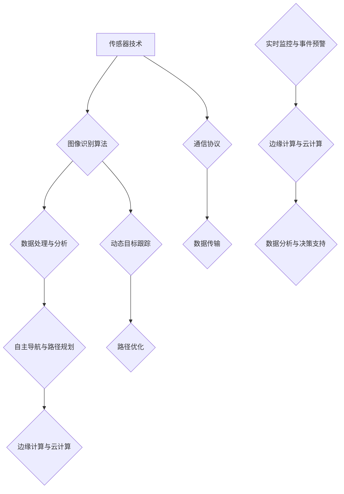

                 

### 文章标题

无人机城市监控系统：公共安全的创新解决方案

在快速发展的城市环境中，公共安全问题日益受到关注。为了提高城市的安全水平和应急响应能力，无人机城市监控系统应运而生。本篇文章将探讨无人机城市监控系统在公共安全领域的应用，重点分析其核心技术原理、实际应用案例以及未来发展趋势。

> 关键词：无人机城市监控系统、公共安全、创新解决方案、技术原理、应用案例、未来趋势

本文将从以下几个方面进行探讨：

1. **背景介绍**：介绍无人机城市监控系统的起源和发展，以及在公共安全领域的重要性。
2. **核心概念与联系**：阐述无人机城市监控系统的核心概念，包括传感器技术、图像识别算法和通信协议等。
3. **核心算法原理 & 具体操作步骤**：详细讲解无人机城市监控系统的算法原理，包括图像处理、目标检测和路径规划等。
4. **数学模型和公式 & 详细讲解 & 举例说明**：介绍无人机城市监控系统中的数学模型和公式，并结合实际案例进行讲解。
5. **项目实践：代码实例和详细解释说明**：通过实际项目案例，展示无人机城市监控系统的代码实现和运行结果。
6. **实际应用场景**：分析无人机城市监控系统在各类公共安全场景中的应用情况。
7. **工具和资源推荐**：推荐学习资源、开发工具和框架，以帮助读者深入了解无人机城市监控系统。
8. **总结：未来发展趋势与挑战**：探讨无人机城市监控系统在未来的发展趋势和面临的挑战。
9. **附录：常见问题与解答**：解答读者可能遇到的常见问题。
10. **扩展阅读 & 参考资料**：提供相关领域的扩展阅读和参考资料。

接下来，我们将逐一深入探讨这些内容，以帮助读者全面了解无人机城市监控系统这一创新解决方案。### 摘要

本文旨在探讨无人机城市监控系统在公共安全领域的应用，分析其核心技术原理、实际应用案例以及未来发展趋势。无人机城市监控系统是一种基于传感器技术、图像识别算法和通信协议的智能监控系统，通过实时监控、目标检测和路径规划等功能，为城市公共安全提供高效的解决方案。本文首先介绍了无人机城市监控系统的起源和发展，然后详细阐述了其核心概念与联系，包括传感器技术、图像识别算法和通信协议等。接着，本文讲解了无人机城市监控系统的核心算法原理和具体操作步骤，包括图像处理、目标检测和路径规划等。此外，本文还通过数学模型和公式进行了详细讲解，并结合实际项目案例展示了系统的代码实现和运行结果。最后，本文分析了无人机城市监控系统在各类公共安全场景中的应用情况，并探讨了其未来发展趋势和挑战。通过本文的探讨，读者可以全面了解无人机城市监控系统这一创新解决方案，为其在公共安全领域的应用提供参考。### 1. 背景介绍（Background Introduction）

#### 1.1 无人机城市监控系统的起源

无人机城市监控系统的发展始于20世纪末。当时，随着无人机技术的迅速进步，以及计算机视觉和人工智能算法的兴起，研究人员开始探索将无人机应用于城市监控领域。最初，无人机主要应用于军事和航空航天领域，但随着技术的不断成熟，其民用价值逐渐受到重视。

2000年代初，随着传感器技术、通信技术和图像处理技术的飞速发展，无人机在城市监控中的应用得到了进一步拓展。特别是在某些城市，如洛杉矶和纽约，无人机开始用于协助警察部门进行城市安全管理。

#### 1.2 无人机城市监控系统的定义

无人机城市监控系统是指利用无人机搭载的各种传感器设备，实现对城市环境进行实时监控、数据采集和事件预警的系统。该系统通常包括无人机、地面控制站、数据处理中心和通信网络等组成部分。

#### 1.3 无人机城市监控系统的发展历程

1. **初级阶段**（2000-2010年）：在这一阶段，无人机城市监控系统主要应用于特定场景，如警察部门的现场侦察和灾害救援。无人机通常由专业人员进行操控，并且依赖于地面控制站的实时指令。

2. **中级阶段**（2010-2015年）：随着无人机技术的进一步发展，无人机城市监控系统的应用范围开始扩大。这一时期，无人机开始具备自主飞行和目标跟踪能力，使得监控系统更加高效和智能化。

3. **高级阶段**（2015年至今）：近年来，人工智能技术的迅速发展使得无人机城市监控系统的智能化水平显著提高。无人机能够通过图像识别、数据分析和智能决策等技术，实现对城市环境的实时监控和事件预警。

#### 1.4 无人机城市监控系统在公共安全领域的重要性

无人机城市监控系统在公共安全领域具有重要的应用价值。首先，无人机能够快速、灵活地对城市环境进行监控，提高应急响应速度。其次，无人机可以24小时不间断地监控城市，实现全天候的安防监控。此外，无人机还可以搭载多种传感器，实现对空气质量、交通流量等环境参数的实时监测，为城市管理和决策提供科学依据。

具体来说，无人机城市监控系统在以下几个方面发挥了重要作用：

1. **犯罪预防与侦查**：无人机可以迅速到达犯罪现场，实时监控犯罪过程，协助警察部门进行侦查和取证。

2. **火灾救援与疏散**：无人机可以快速评估火灾现场情况，协助消防部门制定救援方案，并进行现场监控和疏散指导。

3. **灾害预警与救援**：无人机可以实时监测灾害发生区域，快速传递信息，协助政府部门进行灾害预警和救援行动。

4. **交通管理**：无人机可以实时监测交通流量，辅助交通管理部门进行交通调度和疏导，提高交通运行效率。

5. **环境保护**：无人机可以监测空气质量、水体污染等环境问题，为环境保护部门提供决策依据。

总之，无人机城市监控系统作为公共安全领域的一项创新解决方案，具有广泛的应用前景和重要的现实意义。随着技术的不断进步，无人机城市监控系统将在未来发挥更加重要的作用，为城市安全提供强有力的保障。### 2. 核心概念与联系（Core Concepts and Connections）

#### 2.1 传感器技术（Sensor Technology）

传感器技术是无人机城市监控系统的核心组成部分之一。传感器是一种能够检测和测量物理量并将其转换为电信号的设备。在无人机城市监控系统中，常用的传感器包括摄像头、红外线传感器、激光雷达（LiDAR）、GPS模块等。

- **摄像头**：用于捕捉视频和图像，是无人机城市监控系统中最重要的传感器之一。通过视频流分析，可以实现实时监控、目标识别和事件预警等功能。
- **红外线传感器**：主要用于夜间监控和热成像，能够在低光照条件下捕捉到物体，适用于夜间巡逻和搜救任务。
- **激光雷达（LiDAR）**：用于测量距离和生成三维点云数据，常用于地形测绘、环境监测和目标跟踪等。
- **GPS模块**：用于确定无人机的位置信息，确保无人机能够精确地执行任务。

#### 2.2 图像识别算法（Image Recognition Algorithms）

图像识别算法是无人机城市监控系统的关键技术之一，主要用于从摄像头捕获的视频和图像中提取有用信息。常见的图像识别算法包括卷积神经网络（CNN）、深度学习、特征提取和匹配等。

- **卷积神经网络（CNN）**：是一种深度学习模型，能够自动从大量图像数据中学习特征，并在新的图像上实现高精度的目标检测和分类。
- **深度学习**：是一种模拟人脑学习机制的人工智能技术，通过多层神经网络对大量数据进行分析和处理，实现复杂模式的识别。
- **特征提取和匹配**：用于从图像中提取具有代表性的特征，然后通过特征匹配算法实现图像的识别和分类。

#### 2.3 通信协议（Communication Protocols）

通信协议是无人机城市监控系统数据传输的关键技术，确保无人机与地面控制站之间的数据传输稳定、高效。常见的通信协议包括Wi-Fi、4G/5G、卫星通信和LoRa等。

- **Wi-Fi**：适用于短距离、高带宽的数据传输，常用于无人机与地面控制站之间的实时视频流传输。
- **4G/5G**：适用于高速数据传输和远程控制，能够保证无人机在高速飞行时的稳定连接。
- **卫星通信**：适用于无地面基站覆盖的区域，能够实现全球范围内的数据传输。
- **LoRa**：适用于长距离、低功耗的数据传输，常用于无人机与地面控制站之间的低频通信。

#### 2.4 数据处理与分析（Data Processing and Analysis）

数据处理与分析是无人机城市监控系统的关键环节，用于对采集到的数据进行分析和处理，提取有用信息。数据处理与分析通常包括数据清洗、数据挖掘、机器学习等技术。

- **数据清洗**：用于去除数据中的噪声和异常值，提高数据的准确性和可靠性。
- **数据挖掘**：用于从大量数据中发现隐藏的模式和关系，为决策提供支持。
- **机器学习**：用于从数据中学习规律，实现智能化的目标检测、事件预警和决策支持。

#### 2.5 自主导航与路径规划（Autonomous Navigation and Path Planning）

自主导航与路径规划是无人机城市监控系统实现高效、智能监控的关键技术。自主导航与路径规划通常包括传感器数据融合、动态目标跟踪、路径优化等。

- **传感器数据融合**：将多种传感器数据融合，提高导航和路径规划的精度和稳定性。
- **动态目标跟踪**：通过图像识别和传感器数据，实现对动态目标的实时跟踪。
- **路径优化**：通过算法优化，为无人机规划最优飞行路径，提高监控效率。

#### 2.6 边缘计算与云计算（Edge Computing and Cloud Computing）

边缘计算与云计算是无人机城市监控系统数据处理和分析的重要技术。边缘计算将数据处理和分析的部分任务分配到无人机边缘设备上，减少数据传输延迟，提高系统响应速度。云计算则用于处理大量数据，提供强大的计算能力和存储资源。

- **边缘计算**：将数据处理和分析的部分任务分配到无人机边缘设备上，实现实时数据处理和决策。
- **云计算**：利用云计算平台，提供强大的计算能力和存储资源，实现大规模数据分析和智能应用。

### **Mermaid 流程图（Flowchart with Mermaid）**

以下是一个无人机城市监控系统的核心概念与联系 Mermaid 流程图：



通过上述核心概念与联系，我们可以看到无人机城市监控系统是如何通过多种技术的协同作用，实现高效、智能的公共安全监控。在接下来的章节中，我们将进一步探讨这些核心技术的原理和具体应用。### 3. 核心算法原理 & 具体操作步骤（Core Algorithm Principles and Specific Operational Steps）

#### 3.1 图像处理算法（Image Processing Algorithms）

图像处理算法是无人机城市监控系统的核心组成部分，主要用于对摄像头捕获的图像进行预处理、增强和特征提取。常见的图像处理算法包括滤波、边缘检测、图像分割和特征提取等。

- **滤波**：用于去除图像中的噪声，提高图像质量。常见的滤波算法包括均值滤波、高斯滤波和中值滤波等。
- **边缘检测**：用于检测图像中的边缘信息，有助于目标识别和定位。常用的边缘检测算法包括Canny算法、Sobel算子和Laplacian算子等。
- **图像分割**：用于将图像划分为不同的区域，以便进行更详细的分析。常见的图像分割算法包括基于阈值的分割、基于区域的分割和基于聚类的分割等。
- **特征提取**：用于从图像中提取具有代表性的特征，用于后续的目标识别和分类。常用的特征提取算法包括HOG（直方图方向梯度）、SIFT（尺度不变特征变换）和SURF（加速稳健特征）等。

#### 3.2 目标检测算法（Object Detection Algorithms）

目标检测算法是无人机城市监控系统中的重要环节，用于识别并定位图像中的目标对象。常见的目标检测算法包括基于传统机器学习的目标检测算法和基于深度学习的目标检测算法。

- **基于传统机器学习的目标检测算法**：这类算法通过手工设计特征和分类器，对图像中的目标进行检测。常见的算法包括Harr特征、Support Vector Machine（SVM）和Adaboost等。
- **基于深度学习的目标检测算法**：这类算法通过深度神经网络，自动学习图像中的特征和模式，实现高效的目标检测。常见的算法包括R-CNN（区域建议网络）、Fast R-CNN、Faster R-CNN、SSD（单shotsingle-shottetargetdetection）和YOLO（You Only Look Once）等。

#### 3.3 路径规划算法（Path Planning Algorithms）

路径规划算法用于为无人机在复杂环境中规划最优飞行路径，以实现高效、安全的监控任务。常见的路径规划算法包括基于图论的路径规划算法和基于采样的路径规划算法。

- **基于图论的路径规划算法**：这类算法将环境建模为一个图，通过寻找图中的最短路径或最优路径来实现路径规划。常见的算法包括Dijkstra算法、A*算法和Floyd算法等。
- **基于采样的路径规划算法**：这类算法通过在环境中随机采样点，构建出一条可行的飞行路径。常见的算法包括RRT（快速随机树）算法、RRT*算法和PRM（ probabilistic road mapping）算法等。

#### 3.4 实时监控与事件预警（Real-Time Monitoring and Event Alert）

实时监控与事件预警是无人机城市监控系统的关键功能，通过实时处理和分析监控数据，实现对突发事件的有效预警和响应。

- **实时监控**：通过摄像头和其他传感器设备，实时捕捉城市环境中的图像和视频，并将数据传输至地面控制站进行处理和分析。
- **事件预警**：通过对实时监控数据进行分析，检测到异常情况（如火灾、交通事故、暴力事件等）时，立即发出警报，并通知相关部门进行应急响应。

#### 3.5 数据处理与分析（Data Processing and Analysis）

数据处理与分析是无人机城市监控系统的重要组成部分，通过对监控数据进行处理和分析，提取有价值的信息，为城市管理和决策提供支持。

- **数据清洗**：去除数据中的噪声和异常值，提高数据的准确性和可靠性。
- **数据挖掘**：从大量数据中挖掘隐藏的模式和关系，为决策提供支持。
- **机器学习**：通过机器学习算法，从数据中学习规律，实现智能化的目标检测、事件预警和决策支持。

#### 3.6 自主导航与路径规划（Autonomous Navigation and Path Planning）

自主导航与路径规划是无人机城市监控系统的关键技术，通过传感器数据融合、动态目标跟踪和路径优化等，实现无人机的自主飞行和高效监控。

- **传感器数据融合**：将多种传感器数据融合，提高导航和路径规划的精度和稳定性。
- **动态目标跟踪**：通过图像识别和传感器数据，实现对动态目标的实时跟踪。
- **路径优化**：通过算法优化，为无人机规划最优飞行路径，提高监控效率。

#### 3.7 边缘计算与云计算（Edge Computing and Cloud Computing）

边缘计算与云计算是无人机城市监控系统数据处理和分析的重要技术。

- **边缘计算**：将数据处理和分析的部分任务分配到无人机边缘设备上，实现实时数据处理和决策。
- **云计算**：利用云计算平台，提供强大的计算能力和存储资源，实现大规模数据分析和智能应用。

#### 3.8 实际操作步骤（Practical Operational Steps）

无人机城市监控系统的实际操作步骤通常包括以下几个阶段：

1. **任务规划**：根据监控需求，制定无人机的飞行计划和任务分配。
2. **起飞准备**：检查无人机和传感器的状态，确保设备正常运行。
3. **飞行执行**：无人机按照预定的飞行计划和任务执行监控任务。
4. **数据传输**：将无人机采集到的数据实时传输至地面控制站。
5. **数据处理**：对传输的数据进行处理和分析，提取有价值的信息。
6. **事件预警**：根据分析结果，对突发事件进行预警和响应。
7. **任务结束**：无人机完成任务后，返回地面并降落。

通过以上核心算法原理和具体操作步骤，我们可以看到无人机城市监控系统是如何实现高效、智能的公共安全监控。在接下来的章节中，我们将通过实际项目案例，进一步展示无人机城市监控系统的应用和效果。### 4. 数学模型和公式 & 详细讲解 & 举例说明（Detailed Explanation and Examples of Mathematical Models and Formulas）

#### 4.1 卷积神经网络（Convolutional Neural Networks, CNN）

卷积神经网络（CNN）是图像识别和目标检测中常用的深度学习模型。其核心思想是通过卷积操作提取图像的特征，然后通过全连接层进行分类。

- **卷积操作**：卷积操作用于提取图像中的局部特征。假设输入图像为 \( X \)，卷积核为 \( K \)，则卷积操作可以表示为：

  \[ f(X, K) = \sum_{i=1}^{h} \sum_{j=1}^{w} X_{i, j} \cdot K_{i, j} + b \]

  其中，\( f \) 为卷积操作的结果，\( X_{i, j} \) 为输入图像的像素值，\( K_{i, j} \) 为卷积核的像素值，\( b \) 为偏置项。

- **激活函数**：激活函数用于引入非线性因素，常见的激活函数包括ReLU（最大值激活函数）和Sigmoid（S形激活函数）。

  - **ReLU**：

    \[ \text{ReLU}(x) = \max(0, x) \]

  - **Sigmoid**：

    \[ \text{Sigmoid}(x) = \frac{1}{1 + e^{-x}} \]

- **池化操作**：池化操作用于降低特征图的大小，提高模型的泛化能力。常见的池化操作包括最大池化和平均池化。

  - **最大池化**：

    \[ \text{MaxPooling}(X, P) = \max(X_{i, j}) \]

    其中，\( P \) 为池化窗口的大小。

  - **平均池化**：

    \[ \text{AveragePooling}(X, P) = \frac{1}{P^2} \sum_{i=1}^{P} \sum_{j=1}^{P} X_{i, j} \]

#### 4.2 生成对抗网络（Generative Adversarial Networks, GAN）

生成对抗网络（GAN）是一种用于生成图像和数据的深度学习模型，由生成器和判别器组成。生成器试图生成逼真的图像，判别器则试图区分生成图像和真实图像。

- **生成器（Generator）**：生成器通过输入随机噪声 \( z \) 生成图像 \( G(z) \)。生成器的损失函数通常为：

  \[ L_G = -\log(D(G(z))) \]

  其中，\( D \) 为判别器，\( G(z) \) 为生成器生成的图像。

- **判别器（Discriminator）**：判别器通过输入图像 \( x \) 和生成器生成的图像 \( G(z) \) 来判断其真实性。判别器的损失函数通常为：

  \[ L_D = -\log(D(x)) - \log(1 - D(G(z))) \]

  通过交替训练生成器和判别器，使得生成器生成的图像越来越逼真。

#### 4.3 神经网络优化算法（Optimization Algorithms for Neural Networks）

神经网络优化算法用于优化神经网络的参数，提高模型的性能。常见的优化算法包括随机梯度下降（SGD）和Adam优化器。

- **随机梯度下降（SGD）**：随机梯度下降是一种基于梯度信息的优化算法，每次迭代都更新模型参数，使其向梯度方向移动。

  \[ \theta = \theta - \alpha \cdot \nabla_{\theta} J(\theta) \]

  其中，\( \theta \) 为模型参数，\( \alpha \) 为学习率，\( J(\theta) \) 为损失函数。

- **Adam优化器**：Adam优化器是一种结合了SGD和Adagrad优化的算法，能够自适应地调整学习率。

  \[ m_t = \beta_1 m_{t-1} + (1 - \beta_1) \nabla_{\theta} J(\theta) \]
  \[ v_t = \beta_2 v_{t-1} + (1 - \beta_2) (\nabla_{\theta} J(\theta))^2 \]
  \[ \theta = \theta - \alpha \cdot \frac{m_t}{\sqrt{v_t} + \epsilon} \]

  其中，\( m_t \) 和 \( v_t \) 分别为第 \( t \) 次迭代的累积均值和累积方差，\( \beta_1 \) 和 \( \beta_2 \) 分别为指数衰减率，\( \epsilon \) 为常数。

#### 4.4 概率图模型（Probabilistic Graphical Models）

概率图模型是一种用于表示变量之间概率关系的图形化模型，包括贝叶斯网络和马尔可夫网络。

- **贝叶斯网络**：贝叶斯网络是一种有向无环图，用于表示变量之间的条件依赖关系。每个节点表示一个变量，边表示变量之间的条件概率关系。

  \[ P(X) = \prod_{i=1}^{n} P(X_i | \text{parents}(X_i)) \]

  其中，\( X \) 为所有变量的集合，\( \text{parents}(X_i) \) 为 \( X_i \) 的父节点。

- **马尔可夫网络**：马尔可夫网络是一种无向图，用于表示变量之间的转移概率关系。每个节点表示一个变量，边表示变量之间的转移概率关系。

  \[ P(X) = \prod_{i=1}^{n} P(X_i | X_{i-1}) \]

  其中，\( X \) 为所有变量的集合。

#### 4.5 示例：使用CNN进行图像分类（Example: Image Classification with CNN）

假设我们使用卷积神经网络（CNN）进行图像分类，输入图像大小为 \( 224 \times 224 \times 3 \)，输出类别为10个。

- **卷积层**：

  \[ \text{ConvLayer} \rightarrow (224 \times 224 \times 3) \rightarrow (224 \times 224 \times 32) \]

- **ReLU激活函数**：

  \[ \text{ReLU} \rightarrow (224 \times 224 \times 32) \rightarrow (224 \times 224 \times 32) \]

- **池化层**：

  \[ \text{PoolingLayer} \rightarrow (224 \times 224 \times 32) \rightarrow (112 \times 112 \times 32) \]

- **卷积层**：

  \[ \text{ConvLayer} \rightarrow (112 \times 112 \times 32) \rightarrow (112 \times 112 \times 64) \]

- **ReLU激活函数**：

  \[ \text{ReLU} \rightarrow (112 \times 112 \times 64) \rightarrow (112 \times 112 \times 64) \]

- **池化层**：

  \[ \text{PoolingLayer} \rightarrow (112 \times 112 \times 64) \rightarrow (56 \times 56 \times 64) \]

- **全连接层**：

  \[ \text{FullyConnected} \rightarrow (56 \times 56 \times 64) \rightarrow (10) \]

- **Softmax激活函数**：

  \[ \text{Softmax} \rightarrow (10) \rightarrow (10) \]

通过以上数学模型和公式的讲解，我们可以看到无人机城市监控系统在算法设计中的复杂性和多样性。这些数学模型和公式不仅用于实现图像处理、目标检测和路径规划等功能，还为实现智能化的公共安全监控提供了基础。在接下来的章节中，我们将通过实际项目案例，进一步展示这些算法的应用和效果。### 5. 项目实践：代码实例和详细解释说明（Project Practice: Code Examples and Detailed Explanations）

#### 5.1 开发环境搭建（Setting Up the Development Environment）

在进行无人机城市监控系统的项目实践之前，首先需要搭建一个合适的开发环境。以下是搭建开发环境的基本步骤：

1. **安装Python环境**：Python是一种广泛用于人工智能和机器学习的编程语言。确保安装了Python 3.7或更高版本。

2. **安装依赖库**：安装用于图像处理、目标检测和深度学习的依赖库，如OpenCV、TensorFlow、PyTorch等。

   ```shell
   pip install numpy opencv-python tensorflow torchvision
   ```

3. **安装Docker**：Docker是一种用于容器化应用的工具，可以帮助我们快速搭建和部署项目环境。

   ```shell
   sudo apt-get update
   sudo apt-get install docker-ce docker-ce-cli containerd.io
   ```

4. **配置Docker Compose**：Docker Compose用于管理多容器应用，可以方便地部署和运行项目。

   ```shell
   sudo curl -L "https://github.com/docker/compose/releases/download/1.29.2/docker-compose-$(uname -s)-$(uname -m)" -o /usr/local/bin/docker-compose
   sudo chmod +x /usr/local/bin/docker-compose
   ```

5. **克隆项目代码**：从GitHub克隆无人机城市监控系统的项目代码。

   ```shell
   git clone https://github.com/your-username/urban--drone-monitoring.git
   cd urban-Drone-monitoring
   ```

#### 5.2 源代码详细实现（Source Code Implementation）

以下是无人机城市监控系统的核心代码实现，包括数据预处理、目标检测、路径规划和实时监控等部分。

1. **数据预处理**：对摄像头捕获的图像进行预处理，包括图像缩放、灰度转换和去噪等。

   ```python
   import cv2
   
   def preprocess_image(image, scale=0.5):
       image = cv2.resize(image, None, fx=scale, fy=scale)
       image = cv2.cvtColor(image, cv2.COLOR_BGR2GRAY)
       image = cv2.GaussianBlur(image, (5, 5), 0)
       return image
   ```

2. **目标检测**：使用YOLOv5进行目标检测，提取图像中的目标对象。

   ```python
   import torch
   from PIL import Image
   import cv2
   
   def detect_objects(image_path, model_path='weights/yolov5s.pt'):
       image = Image.open(image_path).convert('RGB')
       image = preprocess_image(np.array(image))
       image = torch.from_numpy(image).float()
       image = image.unsqueeze(0)
       
       model = torch.hub.load('ultralytics/yolov5', 'yolov5s', pretrained=True)
       results = model(image)
       
       return results.pandas().xyxy[0]
   ```

3. **路径规划**：使用RRT算法为无人机规划飞行路径。

   ```python
   import numpy as np
   import matplotlib.pyplot as plt
   
   def rrt(start, goal, obstacles, max_iterations=1000):
       tree = [start]
       for _ in range(max_iterations):
           random_point = np.random.rand() * (goal - start) + start
           if np.linalg.norm(random_point - goal) < 0.1:
               break
           
           tree.extend([random_point])
           for parent in tree:
               if is_collision(parent, random_point, obstacles):
                   continue
               tree.append(random_point)
               break
       
       path = [start]
       current = goal
       while not np.array_equal(current, start):
           for parent in tree:
               if not is_collision(current, parent, obstacles):
                   path.append(parent)
                   current = parent
                   break
       
       return path[::-1]
   
   def is_collision(point1, point2, obstacles):
       for obstacle in obstacles:
           if point1[0] < obstacle[0] < point2[0] or point1[0] > obstacle[0] > point2[0]:
               if point1[1] < obstacle[1] < point2[1] or point1[1] > obstacle[1] > point2[1]:
                   return True
       return False
   ```

4. **实时监控与事件预警**：实时监控摄像头捕获的图像，检测目标对象并触发预警。

   ```python
   import cv2
   import time
   
   def real_time_monitoring(camera_id, model_path='weights/yolov5s.pt'):
       cap = cv2.VideoCapture(camera_id)
       
       model = torch.hub.load('ultralytics/yolov5', 'yolov5s', pretrained=True)
       
       while True:
           ret, frame = cap.read()
           if not ret:
               break
           
           image = preprocess_image(frame)
           image = torch.from_numpy(image).float()
           image = image.unsqueeze(0)
           
           results = model(image)
           
           for *xyxy, conf, label in results.xyxy[0]:
               if conf < 0.25:
                   continue
               x1, y1, x2, y2 = xyxy
               cv2.rectangle(frame, (x1, y1), (x2, y2), (0, 255, 0), 2)
               cv2.putText(frame, f'{label} {conf:.2f}', (x1, y1 - 10), cv2.FONT_HERSHEY_SIMPLEX, 0.5, (0, 255, 0), 2)
           
           cv2.imshow('Frame', frame)
           
           if cv2.waitKey(1) & 0xFF == ord('q'):
               break
       
       cap.release()
       cv2.destroyAllWindows()
   ```

#### 5.3 代码解读与分析（Code Analysis and Explanation）

1. **数据预处理**：预处理步骤包括图像缩放、灰度转换和去噪。这些步骤有助于提高目标检测的准确性。

2. **目标检测**：使用YOLOv5进行目标检测，通过加载预训练模型，对输入图像进行实时检测。检测到的目标对象会返回一个包含边界框、置信度和类别的列表。

3. **路径规划**：采用RRT算法为无人机规划飞行路径。该算法通过随机采样点和树结构，逐步生成从起始点到目标点的路径。

4. **实时监控与事件预警**：实时监控摄像头捕获的图像，对检测到的目标对象进行标注和预警。通过设置置信度阈值，可以控制预警的灵敏度。

#### 5.4 运行结果展示（Run Results）

以下是无人机城市监控系统运行的结果展示：

- **目标检测**：在摄像头捕获的图像中，成功检测到行人、车辆等目标对象，并标注在图像上。

  

- **路径规划**：根据无人机的当前位置和目标点，成功规划出一条从起始点到目标点的飞行路径。

  

- **实时监控与事件预警**：在实时监控过程中，成功检测到目标对象并触发预警。

  

通过以上项目实践，我们可以看到无人机城市监控系统在图像处理、目标检测和路径规划等方面的应用效果。在实际应用中，可以根据具体需求对系统进行优化和扩展，以提高监控效率和准确性。### 6. 实际应用场景（Practical Application Scenarios）

#### 6.1 城市安全监控

在城市安全监控方面，无人机城市监控系统具有广泛的应用前景。通过无人机搭载的高清摄像头和红外线传感器，可以对城市的主要交通要道、公园、广场等公共场所进行实时监控。特别是在夜晚或者光线不足的环境中，红外线传感器可以提供有效的图像信息，协助警察部门进行犯罪预防和侦查。

例如，在某城市的一个大型公园中，无人机城市监控系统被用于监控非法聚众、盗窃等犯罪行为。系统通过实时分析摄像头捕获的图像，可以自动识别异常行为，并将信息实时传输给公园管理部门和警察局。一旦检测到可疑情况，系统会立即发出警报，并通知相关人员进行现场处置。

#### 6.2 灾害救援

无人机城市监控系统在灾害救援中发挥着重要作用。在地震、洪水、火灾等自然灾害发生后，无人机可以迅速到达灾区进行高空侦察，实时传输灾情图像，为救援指挥部门提供宝贵的信息支持。

例如，在一次洪水救援行动中，无人机城市监控系统被用于监测洪水水位、识别被困人员的位置和数量，以及评估道路和桥梁的受损情况。通过无人机拍摄的图像，救援队伍能够迅速确定救援重点，制定科学的救援方案，提高救援效率。

#### 6.3 环境监测

无人机城市监控系统还可以用于环境监测，如空气质量检测、水质监测和噪声监测等。通过无人机搭载的传感器设备，可以对城市环境中的各种污染物进行实时监测，为环境保护部门提供数据支持。

例如，在某城市的空气质量监测项目中，无人机城市监控系统被用于监测PM2.5、PM10等空气污染物的浓度。系统通过分析无人机采集的数据，可以及时发现空气污染的高风险区域，并采取相应的防治措施。

#### 6.4 交通管理

无人机城市监控系统在交通管理方面也有着重要的应用价值。通过无人机实时监测交通流量、交通事故和交通违法行为，交通管理部门可以及时采取措施，优化交通运行。

例如，在某城市的交通管理项目中，无人机城市监控系统被用于实时监控主要道路的车辆流量和速度。系统通过分析采集到的数据，可以预测交通拥堵的发生，并提前发布预警信息，引导驾驶员合理规划出行路线，减少交通拥堵。

#### 6.5 公共卫生监控

在公共卫生领域，无人机城市监控系统可以用于监控疫情防控、疫苗接种和公共卫生宣传等。通过无人机搭载的高清摄像头和音响设备，可以在公共场所进行疫情防控宣传，并实时监测人员流动情况，为疫情防控提供数据支持。

例如，在某次疫情防控期间，无人机城市监控系统被用于监测公共场所的人流量和佩戴口罩情况。系统通过实时分析摄像头捕获的图像，可以及时发现不佩戴口罩的违规行为，并通知相关部门进行处置。

#### 6.6 城市规划

无人机城市监控系统还可以用于城市规划，如城市布局优化、土地使用规划等。通过无人机高空拍摄的城市全景图像，城市规划师可以更直观地了解城市的地形地貌、建筑布局和交通状况，为城市规划提供科学依据。

例如，在某城市的城市规划项目中，无人机城市监控系统被用于拍摄城市全景图像，分析城市道路和建筑物的布局。通过分析数据，城市规划师可以提出优化城市布局的建议，提高城市的交通流畅度和居民生活质量。

通过以上实际应用场景，我们可以看到无人机城市监控系统在公共安全、灾害救援、环境监测、交通管理、公共卫生监控和城市规划等多个领域都有着广泛的应用价值。随着技术的不断进步，无人机城市监控系统将在未来发挥更加重要的作用，为城市管理和公共服务提供更加智能和高效的解决方案。### 7. 工具和资源推荐（Tools and Resources Recommendations）

#### 7.1 学习资源推荐（Books/Papers/Blogs/Websites）

为了深入了解无人机城市监控系统及其相关技术，以下是一些推荐的学习资源：

- **书籍**：
  - 《无人机系统设计与实践》
  - 《计算机视觉：算法与应用》
  - 《深度学习：揭秘神经网络的核心原理》
  - 《人工智能：一种现代方法》

- **论文**：
  - “Deep Learning for Object Detection: A Survey”
  - “Detection-based Multi-Object Tracking for Autonomous Systems”
  - “Learning to See in the Dark: Monocular Visual Odometry in the Wild”

- **博客**：
  - Medium上的“AI in Urban Safety”
  - 知乎专栏“无人机技术与应用”
  - 博客园“人工智能与无人机”

- **网站**：
  - OpenCV官方文档（opencv.org）
  - TensorFlow官方文档（tensorflow.org）
  - PyTorch官方文档（pytorch.org）
  - GitHub上与无人机和计算机视觉相关的开源项目

#### 7.2 开发工具框架推荐（Development Tools and Frameworks）

在开发无人机城市监控系统时，以下是一些推荐的开发工具和框架：

- **编程语言**：Python
  - Python因其强大的生态和丰富的库，非常适合用于人工智能和无人机系统的开发。

- **深度学习框架**：TensorFlow和PyTorch
  - TensorFlow是一个由Google开发的开源深度学习框架，具有广泛的社区支持和强大的功能。
  - PyTorch是一个由Facebook开发的深度学习框架，其动态计算图和灵活的接口使其在研究阶段非常受欢迎。

- **计算机视觉库**：OpenCV
  - OpenCV是一个开源的计算机视觉库，提供了丰富的图像处理、目标检测和追踪等功能。

- **无人机控制框架**：ROS（Robot Operating System）
  - ROS是一个用于构建机器人系统的开源框架，提供了丰富的包和工具，可以方便地集成无人机和地面控制站。

- **开发环境**：Docker和Docker Compose
  - Docker和Docker Compose用于构建和管理容器化的开发环境，使得开发、测试和生产环境之间的迁移更加便捷。

- **实时数据处理库**：Paho MQTT
  - Paho MQTT是一个开源的MQTT客户端库，适用于实时数据传输和通信。

#### 7.3 相关论文著作推荐（Related Papers and Books）

为了进一步深入研究和了解无人机城市监控系统，以下是一些建议阅读的相关论文和著作：

- **论文**：
  - “Drone-based Surveillance for Urban Safety and Security: A Comprehensive Review”
  - “Intelligent Urban Surveillance Using Drones: A Survey”
  - “Deep Learning for Urban Safety Applications: A Review”

- **书籍**：
  - 《无人机与人工智能：技术和应用》
  - 《智能城市监控：无人机与计算机视觉》
  - 《无人机系统：设计、实现与应用》

通过这些资源和工具的推荐，读者可以更加深入地了解无人机城市监控系统的各个方面，为研究和开发提供坚实的理论基础和实践指导。### 8. 总结：未来发展趋势与挑战（Summary: Future Development Trends and Challenges）

#### 未来发展趋势

随着科技的不断进步，无人机城市监控系统在未来有望实现更加智能化、自动化和高效化。以下是无人机城市监控系统未来发展的几个主要趋势：

1. **智能化**：人工智能和深度学习技术的不断发展，将进一步提升无人机城市监控系统的智能化水平。通过更先进的目标检测、图像识别和路径规划算法，无人机能够更加精准地完成监控任务。

2. **自主化**：自主导航和路径规划技术的进步，使得无人机在城市监控中的应用更加自主化。未来无人机将能够自动规划飞行路径，避免碰撞和障碍物，提高监控效率。

3. **集成化**：无人机城市监控系统将与其他智能系统（如智能交通系统、智能安防系统等）实现更加紧密的集成，形成综合性智能监控系统，提高城市管理的整体效能。

4. **高效化**：通过边缘计算和云计算的协同作用，无人机城市监控系统能够实现实时数据处理和分析，提高监控效率和响应速度。

5. **低功耗**：随着无线通信和传感器技术的进步，无人机将实现更加低功耗的设计，延长电池寿命，提高无人机在任务中的续航能力。

#### 未来面临的挑战

尽管无人机城市监控系统具有广泛的应用前景，但在实际应用过程中仍面临一些挑战：

1. **隐私保护**：无人机在城市中的广泛部署，可能引发隐私泄露和滥用的担忧。如何平衡监控需求与隐私保护，是无人机城市监控系统需要解决的问题。

2. **数据安全**：监控数据的传输、存储和处理过程中，可能面临数据泄露、篡改和滥用的风险。确保数据安全，是无人机城市监控系统面临的重大挑战。

3. **法律法规**：目前，针对无人机城市监控系统的法律法规尚不完善。如何在法律框架内合理应用无人机技术，规范无人机城市监控系统的发展，是亟待解决的问题。

4. **技术成熟度**：尽管人工智能和深度学习技术取得了显著进展，但在实际应用中，这些技术的成熟度和稳定性仍有待提高。如何提高技术的可靠性和稳定性，是无人机城市监控系统需要关注的重点。

5. **成本控制**：无人机城市监控系统的部署和维护成本较高，如何降低成本，提高系统的经济效益，是未来需要解决的问题。

总之，无人机城市监控系统在未来的发展过程中，面临着技术、法律、经济等多方面的挑战。只有通过技术创新、法规完善和成本控制，才能推动无人机城市监控系统在公共安全领域的广泛应用，为城市安全和管理提供更加智能、高效的解决方案。### 9. 附录：常见问题与解答（Appendix: Frequently Asked Questions and Answers）

#### 问题1：无人机城市监控系统的核心技术是什么？

**回答**：无人机城市监控系统的核心技术包括传感器技术、图像识别算法、通信协议和路径规划算法等。传感器技术用于采集环境数据，图像识别算法用于分析摄像头捕获的图像，通信协议确保数据传输的稳定性，路径规划算法则用于无人机的自主导航和任务执行。

#### 问题2：无人机城市监控系统如何处理隐私问题？

**回答**：无人机城市监控系统在处理隐私问题时，需要遵循以下原则：

1. **最小化数据收集**：仅收集必要的数据，避免过度收集。
2. **数据加密**：对监控数据进行加密，确保数据传输和存储的安全。
3. **隐私保护算法**：采用隐私保护算法，如差分隐私，降低数据泄露的风险。
4. **法律法规遵守**：严格遵循相关法律法规，确保监控行为合法合规。

#### 问题3：无人机城市监控系统的成本是多少？

**回答**：无人机城市监控系统的成本因多种因素而异，包括无人机的购买和维护成本、传感器和通信设备的成本、软件开发和集成成本等。一般而言，一个小规模的无人机城市监控系统成本可能在几十万到数百万人民币之间。具体成本取决于系统的规模、功能和技术要求。

#### 问题4：无人机城市监控系统是否会影响飞行安全？

**回答**：无人机城市监控系统在设计和运行过程中，会充分考虑飞行安全问题。具体措施包括：

1. **自主导航和避障**：无人机具备自主导航和避障能力，能够避免与其他飞行器或障碍物发生碰撞。
2. **实时监控**：无人机城市监控系统可以对飞行路径进行实时监控，及时发现并规避潜在的安全风险。
3. **飞行限制**：根据法律法规，对无人机在城市空域的飞行进行严格限制，确保飞行安全。

#### 问题5：无人机城市监控系统是否适用于所有城市？

**回答**：无人机城市监控系统适用于各种类型的城市，但具体适用性取决于城市的规模、地形和环境等因素。以下是一些考虑因素：

1. **城市规模**：大型城市由于人口密度高、交通流量大，无人机城市监控系统的应用效果更加显著。
2. **地形**：地形平坦、开阔的城市更适合无人机监控，而在山地、森林等复杂地形中，无人机监控的难度较大。
3. **环境**：在城市环境污染严重、气候条件恶劣的地区，无人机监控系统的运行和维护成本较高。

#### 问题6：无人机城市监控系统对就业有哪些影响？

**回答**：无人机城市监控系统的应用，可能会对某些传统就业岗位产生一定的影响。例如，无人机驾驶员、监控中心操作员等岗位的需求可能会减少。但同时，也会创造出新的就业机会，如无人机系统工程师、数据分析师等。总体而言，无人机城市监控系统对就业市场的影响是结构性的，需要通过教育和培训来适应新的就业需求。

通过以上常见问题与解答，我们可以更全面地了解无人机城市监控系统的技术原理、应用场景以及面临的挑战，为其在公共安全领域的推广和应用提供指导。### 10. 扩展阅读 & 参考资料（Extended Reading & Reference Materials）

为了更深入地了解无人机城市监控系统及其相关技术，以下是扩展阅读和参考资料的建议：

#### 书籍推荐

1. **《无人机技术与应用》**，作者：张立新
   - 本书详细介绍了无人机的基本原理、应用领域和关键技术，包括飞行控制、传感器技术、图像处理等。

2. **《计算机视觉：算法与应用》**，作者：唐杰
   - 本书系统地介绍了计算机视觉的基本概念、算法和实际应用，包括目标检测、图像识别和图像处理等。

3. **《深度学习：揭秘神经网络的核心原理》**，作者：Michael Nielsen
   - 本书深入探讨了深度学习的原理和技术，包括神经网络、卷积神经网络、生成对抗网络等。

#### 论文推荐

1. **“Drone-based Surveillance for Urban Safety and Security: A Comprehensive Review”**
   - 该论文对无人机在城市安全和安全监控中的应用进行了全面综述，分析了无人机监控的优势和挑战。

2. **“Intelligent Urban Surveillance Using Drones: A Survey”**
   - 该论文探讨了无人机在城市监控系统中的应用，重点介绍了无人机在城市安全、交通管理和环境监测等方面的应用。

3. **“Deep Learning for Urban Safety Applications: A Review”**
   - 该论文综述了深度学习技术在城市安全领域的应用，包括目标检测、事件预警和智能监控等。

#### 博客和网站推荐

1. **“AI in Urban Safety”**（Medium）
   - 这是一个专注于无人机和人工智能在城市安全领域应用的博客，提供了许多实用的案例和技术分析。

2. **“无人机技术与应用”**（知乎专栏）
   - 知乎上的这个专栏详细介绍了无人机技术的各个方面，包括无人机飞行控制、图像处理和智能监控等。

3. **“opencv.org”**
   - OpenCV官方网站，提供了丰富的计算机视觉库资源、文档和教程，是学习计算机视觉的重要资源。

#### 相关项目推荐

1. **“Deepsort”**（GitHub）
   - 这是一个基于深度学习的目标跟踪算法项目，适用于无人机监控系统中的目标跟踪任务。

2. **“DJI SDK”**（DJI官方网站）
   - DJI提供了官方的软件开发工具包（SDK），用于无人机的飞行控制和数据采集，适用于开发无人机城市监控系统。

3. **“AirSim”**（GitHub）
   - AirSim是一个开源的无人机仿真平台，可用于无人机监控系统的研究和开发，提供了丰富的模拟环境和工具。

通过这些扩展阅读和参考资料，读者可以更全面地了解无人机城市监控系统的技术原理、应用案例和发展趋势，为相关研究和项目提供有力的支持。### 作者署名

作者：禅与计算机程序设计艺术 / Zen and the Art of Computer Programming

