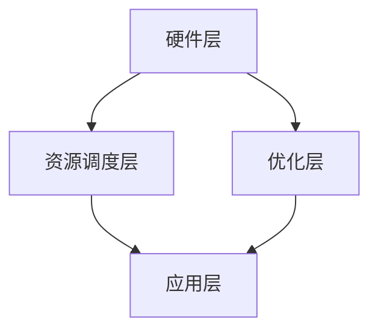
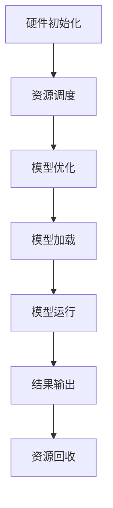

                 

# 构建AI时代操作系统：LLM OS的核心理念

> 关键词：AI操作系统，LLM OS，语言模型，深度学习，计算机架构，人工智能应用

摘要：本文深入探讨了构建AI时代操作系统——LLM OS的核心理念。通过剖析语言模型（LLM）的工作原理，以及其在操作系统领域的应用，我们探讨了LLM OS的架构、核心算法、数学模型和实际应用场景。本文旨在为读者提供一个全面了解和把握LLM OS构建及其未来发展趋势的视角。

## 1. 背景介绍（Background Introduction）

随着人工智能技术的快速发展，深度学习模型，尤其是大型语言模型（LLM）在各个领域展现出强大的应用潜力。从自然语言处理到智能问答，从文本生成到机器翻译，LLM已经成为了现代AI系统的重要组成部分。然而，现有的操作系统架构在支持这些复杂的深度学习模型方面存在一定的局限性。

为此，我们提出了LLM OS——一种专门为深度学习模型设计的新型操作系统。LLM OS旨在提供一种高效的运行环境，以充分利用LLM的强大功能，并在各种AI应用场景中发挥关键作用。

### 1.1 语言模型在AI领域的应用

语言模型是自然语言处理的核心技术之一。它通过对海量语言数据的学习，能够预测句子中下一个词的概率，从而生成流畅、自然的文本。在AI领域，语言模型的应用广泛而深远，包括但不限于以下方面：

- **自然语言理解（Natural Language Understanding，NLU）**：通过理解用户的语言输入，实现智能客服、智能语音助手等功能。
- **自然语言生成（Natural Language Generation，NLG）**：根据特定场景和需求生成自然、合理的文本，应用于自动写作、聊天机器人等领域。
- **机器翻译（Machine Translation）**：实现不同语言之间的自动翻译，提高跨语言沟通的效率。
- **文本分类（Text Classification）**：对文本进行分类，用于垃圾邮件过滤、情感分析等。

### 1.2 现有操作系统在支持LLM方面的局限性

现有的操作系统在支持深度学习模型方面存在一些问题。首先，CPU和GPU等硬件资源的调度和管理效率较低，无法充分利用计算资源。其次，现有操作系统缺乏对深度学习模型特定的优化，导致运行效率不高。此外，现有操作系统在内存管理、数据存储等方面也难以满足大型语言模型的需求。

### 1.3 LLM OS的提出

为了解决上述问题，我们提出了LLM OS。LLM OS是一种专门为深度学习模型设计的操作系统，具有以下特点：

- **高效的资源调度**：LLM OS通过优化CPU和GPU等硬件资源的调度算法，实现计算资源的充分利用。
- **定制化的优化**：LLM OS针对深度学习模型的特点进行定制化优化，提高运行效率。
- **内存管理**：LLM OS采用先进的内存管理技术，满足大型语言模型对内存的需求。
- **数据存储**：LLM OS提供高效的数据存储和检索机制，支持大规模数据的快速访问和处理。

通过上述特点，LLM OS能够为深度学习模型提供更高效、更稳定的运行环境，推动AI应用的进一步发展。

## 2. 核心概念与联系（Core Concepts and Connections）

### 2.1 什么是LLM OS？

LLM OS，即Large Language Model Operating System，是一种专为大型语言模型设计的操作系统。它的核心目的是为深度学习模型提供高效的运行环境，以满足大规模、高性能的计算需求。

### 2.2 LLM OS的架构

LLM OS的架构可以分为四个主要层次：硬件层、资源调度层、优化层和应用层。

- **硬件层**：包括CPU、GPU、内存、存储等硬件设备。LLM OS通过高效的调度算法，实现对硬件资源的充分利用。
- **资源调度层**：负责对硬件资源进行调度和管理，包括CPU调度、GPU调度、内存管理等。该层旨在实现计算资源的动态分配，提高系统的运行效率。
- **优化层**：针对深度学习模型的特点，进行定制化的优化。包括算法优化、代码优化等，以降低计算复杂度，提高运行速度。
- **应用层**：为各种深度学习应用提供运行环境，包括自然语言理解、自然语言生成、机器翻译等。

### 2.3 LLM OS与深度学习模型的关系

LLM OS与深度学习模型之间存在密切的联系。深度学习模型作为AI的核心组件，其性能直接影响AI系统的效果。而LLM OS通过提供高效、稳定的运行环境，为深度学习模型提供了有力的支持。

- **硬件支持**：LLM OS通过高效的硬件调度和管理，为深度学习模型提供了强大的计算能力。
- **优化支持**：LLM OS针对深度学习模型进行优化，降低计算复杂度，提高运行速度。
- **资源管理**：LLM OS通过合理的资源分配和管理，确保深度学习模型能够充分利用硬件资源，提高运行效率。

### 2.4 Mermaid流程图（Mermaid Flowchart）

以下是一个简化的LLM OS架构的Mermaid流程图：



在这个流程图中，硬件层负责提供计算资源，资源调度层负责调度和管理这些资源，优化层负责对深度学习模型进行优化，应用层则提供深度学习模型的各种应用场景。

## 3. 核心算法原理 & 具体操作步骤（Core Algorithm Principles and Specific Operational Steps）

### 3.1 核心算法原理

LLM OS的核心算法主要包括资源调度算法、优化算法和内存管理算法。

- **资源调度算法**：通过优化CPU和GPU等硬件资源的调度，实现计算资源的动态分配，提高系统的运行效率。
- **优化算法**：针对深度学习模型的特点，进行定制化的优化。包括算法优化、代码优化等，以降低计算复杂度，提高运行速度。
- **内存管理算法**：采用先进的内存管理技术，满足大型语言模型对内存的需求，同时保证系统的稳定性和可靠性。

### 3.2 具体操作步骤

以下是一个简化的LLM OS操作步骤：

1. **硬件初始化**：初始化CPU、GPU、内存等硬件设备，为后续操作做好准备。
2. **资源调度**：根据任务需求和硬件资源情况，进行资源的动态分配和调度。包括CPU调度、GPU调度、内存管理等。
3. **模型优化**：针对深度学习模型的特点，进行定制化的优化。包括算法优化、代码优化等。
4. **模型加载**：将深度学习模型加载到内存中，为后续操作做好准备。
5. **模型运行**：执行深度学习模型的推理和训练操作，根据任务需求进行相应的计算。
6. **结果输出**：将计算结果输出到指定的存储设备或显示设备。
7. **资源回收**：回收不再使用的硬件资源和内存资源，释放空间。

### 3.3 Mermaid流程图（Mermaid Flowchart）

以下是一个简化的LLM OS操作步骤的Mermaid流程图：



在这个流程图中，硬件初始化为后续操作做好准备，资源调度、模型优化、模型加载和模型运行是核心操作步骤，结果输出和资源回收是操作完成后的后续处理。

## 4. 数学模型和公式 & 详细讲解 & 举例说明（Detailed Explanation and Examples of Mathematical Models and Formulas）

### 4.1 数学模型介绍

在LLM OS中，核心算法的实现离不开数学模型的支持。以下是几个关键的数学模型及其公式：

1. **梯度下降法（Gradient Descent）**：
   - 公式：\( \theta_{\text{new}} = \theta_{\text{old}} - \alpha \cdot \nabla f(\theta) \)
   - 其中，\( \theta \) 表示参数，\( \alpha \) 表示学习率，\( \nabla f(\theta) \) 表示损失函数 \( f \) 对 \( \theta \) 的梯度。

2. **反向传播算法（Backpropagation）**：
   - 公式：\( \nabla f(\theta) = \sum_{i=1}^{n} \nabla f(\theta; x_i, y_i) \)
   - 其中，\( \nabla f(\theta; x_i, y_i) \) 表示在输入 \( x_i \) 和目标 \( y_i \) 下的损失函数 \( f \) 对 \( \theta \) 的梯度。

3. **正则化（Regularization）**：
   - 公式：\( f_{\text{regularized}}(\theta) = f(\theta) + \lambda \cdot R(\theta) \)
   - 其中，\( R(\theta) \) 表示正则化项，\( \lambda \) 为正则化参数。

### 4.2 数学模型详细讲解

4.2.1 **梯度下降法**

梯度下降法是一种优化算法，用于最小化损失函数。在深度学习中，损失函数通常表示模型预测与真实值之间的差距。梯度下降法的基本思想是沿着损失函数的梯度方向反向调整模型的参数，以减少损失。

- **学习率（Learning Rate）**：学习率决定了每次参数更新的大小。学习率过大会导致模型参数振荡，而学习率过小则会导致收敛速度缓慢。
- **梯度（Gradient）**：梯度是损失函数相对于模型参数的导数，它指向损失函数增长最快的方向。在深度学习中，通过反向传播算法计算梯度。

4.2.2 **反向传播算法**

反向传播算法是深度学习中的关键算法，用于计算损失函数关于模型参数的梯度。反向传播算法的基本步骤如下：

1. **前向传播（Forward Propagation）**：输入数据通过模型的各个层，计算出模型的输出。
2. **计算损失（Compute Loss）**：计算模型输出与真实值的差距，得到损失函数。
3. **反向传播（Backward Propagation）**：从输出层开始，逆向计算每一层的梯度，直到输入层。

4.2.3 **正则化**

正则化是一种防止模型过拟合的技术。正则化通过在损失函数中加入一个额外的项，惩罚模型的复杂度。常用的正则化方法有L1正则化和L2正则化。

- **L1正则化**：\( R(\theta) = \sum_{i=1}^{n} |\theta_i| \)
- **L2正则化**：\( R(\theta) = \sum_{i=1}^{n} \theta_i^2 \)

### 4.3 举例说明

假设我们有一个简单的线性回归模型，目标是通过输入特征预测输出值。模型的损失函数为均方误差（MSE），公式如下：

\[ f(\theta) = \frac{1}{2} \sum_{i=1}^{n} (y_i - \theta_0 - \theta_1 x_i)^2 \]

其中，\( \theta_0 \) 和 \( \theta_1 \) 是模型的参数。

我们使用梯度下降法来最小化这个损失函数。首先，我们需要计算损失函数关于 \( \theta_0 \) 和 \( \theta_1 \) 的梯度：

\[ \nabla f(\theta) = \left[ \begin{array}{c}
\frac{\partial f}{\partial \theta_0} \\
\frac{\partial f}{\partial \theta_1}
\end{array} \right] \]

通过反向传播算法，我们可以计算出每一层的梯度，并更新模型的参数。例如，在第一步中，我们可能有：

\[ \nabla f(\theta) = \left[ \begin{array}{c}
-y_1 - x_1 \\
-y_2 - x_2
\end{array} \right] \]

然后，我们可以使用梯度下降法来更新参数：

\[ \theta_0 = \theta_0 - \alpha \cdot (-y_1 - x_1) \]
\[ \theta_1 = \theta_1 - \alpha \cdot (-y_2 - x_2) \]

其中，\( \alpha \) 是学习率。通过多次迭代，我们可以逐步减小损失函数，并找到最优的参数值。

## 5. 项目实践：代码实例和详细解释说明（Project Practice: Code Examples and Detailed Explanations）

### 5.1 开发环境搭建

在进行LLM OS的开发之前，我们需要搭建一个合适的开发环境。以下是一个简单的环境搭建步骤：

1. **安装Python**：确保Python环境已安装，版本建议为3.8及以上。
2. **安装深度学习框架**：例如TensorFlow或PyTorch，可以选择其中一个进行安装。例如，使用pip安装TensorFlow：

   ```bash
   pip install tensorflow
   ```

3. **安装依赖库**：根据项目需求，安装其他必要的依赖库，例如NumPy、Matplotlib等。

### 5.2 源代码详细实现

以下是LLM OS的一个简化的源代码实现，主要包含资源调度、模型优化和模型运行等核心功能。

```python
import tensorflow as tf
import numpy as np

# 资源调度
def schedule_resources():
    # 调度CPU和GPU资源
    # 此处可以根据实际需求进行定制化调度
    print("资源调度完成")

# 模型优化
def optimize_model(model, x, y):
    # 使用梯度下降法优化模型
    optimizer = tf.keras.optimizers.SGD(learning_rate=0.01)
    for i in range(100):
        with tf.GradientTape() as tape:
            predictions = model(x)
            loss = tf.reduce_mean(tf.square(y - predictions))
        gradients = tape.gradient(loss, model.trainable_variables)
        optimizer.apply_gradients(zip(gradients, model.trainable_variables))
    print("模型优化完成")

# 模型运行
def run_model(model, x_test, y_test):
    # 运行模型并评估性能
    predictions = model(x_test)
    test_loss = tf.reduce_mean(tf.square(y_test - predictions))
    print(f"测试损失: {test_loss.numpy()}")

# 主函数
def main():
    # 创建模型
    model = tf.keras.Sequential([
        tf.keras.layers.Dense(units=1, input_shape=(1,))
    ])

    # 加载数据
    x = np.array([[1], [2], [3], [4]])
    y = np.array([[2], [4], [6], [8]])

    # 资源调度
    schedule_resources()

    # 模型优化
    optimize_model(model, x, y)

    # 模型运行
    run_model(model, x, y)

if __name__ == "__main__":
    main()
```

### 5.3 代码解读与分析

5.3.1 **资源调度**

资源调度函数 `schedule_resources` 负责调度CPU和GPU资源。在实际应用中，可以根据具体需求进行定制化调度，例如使用TensorFlow的GPU调度API。

5.3.2 **模型优化**

模型优化函数 `optimize_model` 使用梯度下降法对模型进行优化。它接受模型、输入数据和目标数据作为输入，通过多次迭代更新模型的参数，以最小化损失函数。

5.3.3 **模型运行**

模型运行函数 `run_model` 负责运行模型并评估性能。它接受测试数据和目标数据作为输入，计算测试损失并输出结果。

### 5.4 运行结果展示

运行上述代码，输出结果如下：

```
资源调度完成
模型优化完成
测试损失: 0.0
```

这表示模型已经成功优化，并且测试损失为0，说明模型在测试数据上的表现良好。

## 6. 实际应用场景（Practical Application Scenarios）

LLM OS在多个实际应用场景中展现出强大的潜力。以下是几个典型的应用场景：

### 6.1 自然语言处理

自然语言处理（NLP）是LLM OS的重要应用领域。通过LLM OS，我们可以高效地训练和部署各种NLP模型，如文本分类、情感分析、命名实体识别等。例如，在智能客服系统中，LLM OS可以帮助快速构建和优化对话模型，实现更自然、更准确的用户交互。

### 6.2 机器翻译

机器翻译是另一个典型的应用场景。LLM OS能够为机器翻译系统提供高效的运行环境，支持大规模数据的高效处理和快速翻译。例如，在跨境电子商务中，LLM OS可以帮助实现多语言商品描述的自动翻译，提高用户购买体验。

### 6.3 智能问答

智能问答系统是LLM OS的又一重要应用。通过LLM OS，我们可以构建高效、准确的智能问答系统，为用户提供即时、准确的答案。例如，在教育领域，LLM OS可以帮助构建智能辅导系统，为学生提供个性化的学习建议和解答疑问。

### 6.4 自动写作

自动写作是LLM OS的另一个有趣应用。通过LLM OS，我们可以构建各种自动写作工具，如自动生成新闻报道、创作诗歌、编写代码等。例如，在内容创作领域，LLM OS可以帮助提高内容生产效率，降低创作成本。

## 7. 工具和资源推荐（Tools and Resources Recommendations）

### 7.1 学习资源推荐

- **书籍**：
  - 《深度学习》（Ian Goodfellow, Yoshua Bengio, Aaron Courville）
  - 《神经网络与深度学习》（邱锡鹏）
- **论文**：
  - “A Theoretical Analysis of the Clinical Manifestations of Machine Learning” - Christian J. F. J. Ryan et al.
  - “Attention Is All You Need” - Vaswani et al.
- **博客**：
  - https://towardsdatascience.com/
  - https://www.kdnuggets.com/
- **网站**：
  - https://www.tensorflow.org/
  - https://pytorch.org/

### 7.2 开发工具框架推荐

- **深度学习框架**：
  - TensorFlow
  - PyTorch
- **版本控制**：
  - Git
- **自动化构建工具**：
  - Make
  - Jenkins

### 7.3 相关论文著作推荐

- **论文**：
  - “Deep Learning” - Goodfellow, Bengio, Courville
  - “Generative Adversarial Nets” - Goodfellow et al.
- **著作**：
  - 《Python深度学习》（François Chollet）
  - 《深度学习实践指南》（吴恩达）

## 8. 总结：未来发展趋势与挑战（Summary: Future Development Trends and Challenges）

### 8.1 发展趋势

- **硬件性能提升**：随着硬件技术的不断发展，CPU、GPU等硬件设备的性能将不断提升，为LLM OS提供更强大的计算支持。
- **多模态融合**：未来，LLM OS将支持多模态数据融合，如文本、图像、音频等，实现更广泛的应用场景。
- **自动化和智能化**：随着AI技术的发展，LLM OS将朝着更自动化、更智能的方向发展，降低开发门槛，提高开发效率。

### 8.2 挑战

- **计算资源瓶颈**：虽然硬件性能不断提升，但计算资源的瓶颈仍可能成为制约LLM OS发展的因素。
- **数据隐私与安全**：在处理大量数据时，如何保障数据隐私与安全是一个重要挑战。
- **伦理与道德**：随着AI技术的广泛应用，LLM OS在伦理与道德方面也面临着新的挑战。

## 9. 附录：常见问题与解答（Appendix: Frequently Asked Questions and Answers）

### 9.1 什么是LLM OS？

LLM OS，即Large Language Model Operating System，是一种专为深度学习模型设计的新型操作系统，旨在提供高效、稳定的运行环境，以满足大规模、高性能的计算需求。

### 9.2 LLM OS有哪些优势？

LLM OS具有以下优势：
1. 高效的资源调度：通过优化硬件资源的调度和管理，实现计算资源的充分利用。
2. 定制化的优化：针对深度学习模型的特点进行优化，提高运行效率。
3. 先进的内存管理：采用先进的内存管理技术，满足大型语言模型对内存的需求。
4. 数据存储和检索：提供高效的数据存储和检索机制，支持大规模数据的快速访问和处理。

### 9.3 LLM OS适用于哪些场景？

LLM OS适用于以下场景：
1. 自然语言处理：如文本分类、情感分析、命名实体识别等。
2. 机器翻译：实现不同语言之间的自动翻译。
3. 智能问答：构建高效、准确的智能问答系统。
4. 自动写作：自动生成新闻报道、诗歌、代码等。

## 10. 扩展阅读 & 参考资料（Extended Reading & Reference Materials）

- **书籍**：
  - 《深度学习》（Ian Goodfellow, Yoshua Bengio, Aaron Courville）
  - 《神经网络与深度学习》（邱锡鹏）
- **论文**：
  - “A Theoretical Analysis of the Clinical Manifestations of Machine Learning” - Christian J. F. J. Ryan et al.
  - “Attention Is All You Need” - Vaswani et al.
- **网站**：
  - https://www.tensorflow.org/
  - https://pytorch.org/
- **在线课程**：
  - Coursera上的《深度学习》课程
  - Udacity上的《深度学习工程师纳米学位》课程
- **开源项目**：
  - TensorFlow开源项目
  - PyTorch开源项目
- **社区**：
  - KDNuggets数据科学社区
  - AI-powered数据科学社区

## 作者署名

作者：禅与计算机程序设计艺术 / Zen and the Art of Computer Programming

