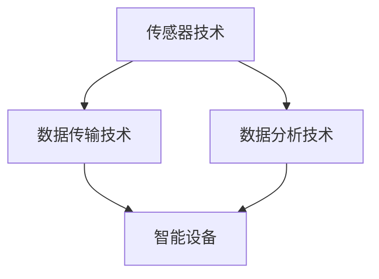

                 

### 文章标题：智能瑜伽垫创业：个人健身教练的替代品

> 关键词：智能瑜伽垫，创业，健身教练，替代品，技术实现，市场前景

摘要：本文探讨了智能瑜伽垫在创业领域的应用及其作为个人健身教练替代品的潜力。文章首先介绍了智能瑜伽垫的基本概念、核心技术，以及它们如何通过先进技术实现个性化健身指导。接着，文章分析了智能瑜伽垫在市场上的需求和发展前景，并探讨了其在创业中的机遇和挑战。最后，文章总结了智能瑜伽垫创业项目的关键成功因素，提出了未来发展的方向和建议。

## 1. 背景介绍（Background Introduction）

随着健康意识的不断提高，健身已经成为人们日常生活中不可或缺的一部分。传统的健身方式主要包括到健身房进行器械训练或寻求专业健身教练的指导。然而，健身房的高昂费用和专业健身教练的稀缺，使得许多人难以持续地进行有效的健身。在这种情况下，智能瑜伽垫作为一种新兴的健身工具，应运而生。

### 1.1 智能瑜伽垫的定义和基本原理

智能瑜伽垫是一种结合了瑜伽垫和智能技术的健身设备。它通常配备有压力传感器、惯性测量单元（IMU）和蓝牙连接等元件，可以通过测量使用者的身体运动、姿势和压力分布，实时提供反馈和指导。智能瑜伽垫的基本原理是通过传感器收集身体运动数据，然后将这些数据传输到连接的智能设备上，进行实时分析和反馈。

### 1.2 智能瑜伽垫的技术特点

智能瑜伽垫具有以下几个技术特点：

1. **实时反馈**：通过传感器实时监测使用者的姿势、动作和压力分布，提供即时反馈。
2. **个性化定制**：根据使用者的身体数据和健身目标，智能瑜伽垫可以提供个性化的锻炼计划和指导。
3. **数据跟踪**：智能瑜伽垫可以记录使用者的锻炼数据，如时长、次数、强度等，帮助使用者更好地了解自己的锻炼效果。
4. **可穿戴性**：智能瑜伽垫通常设计为瑜伽垫的形态，便于携带和使用。

### 1.3 智能瑜伽垫与传统健身方式的对比

与传统健身方式相比，智能瑜伽垫具有以下几个优势：

1. **便捷性**：智能瑜伽垫无需到健身房或教练处，用户可以在家中随时进行锻炼。
2. **个性化**：智能瑜伽垫可以根据使用者的身体数据和健身目标提供个性化的指导，提高锻炼效果。
3. **实时反馈**：智能瑜伽垫可以实时监测使用者的姿势和动作，提供即时反馈，避免因姿势不当造成的运动损伤。
4. **数据跟踪**：智能瑜伽垫可以记录使用者的锻炼数据，帮助使用者更好地了解自己的锻炼效果。

## 2. 核心概念与联系（Core Concepts and Connections）

### 2.1 智能瑜伽垫的核心技术

智能瑜伽垫的核心技术主要包括传感器技术、数据传输技术和数据分析技术。以下是一个简化的 Mermaid 流程图，用于展示这些技术的连接和协作方式：



### 2.2 智能瑜伽垫的工作原理

智能瑜伽垫的工作原理可以概括为以下几个步骤：

1. **传感器监测**：智能瑜伽垫上的传感器（如压力传感器、IMU等）实时监测使用者的身体运动和姿势。
2. **数据采集**：传感器收集到的数据通过无线传输技术（如蓝牙、Wi-Fi等）传输到智能设备上。
3. **数据分析**：智能设备对传输来的数据进行实时分析，生成反馈和指导信息。
4. **反馈显示**：智能设备将分析结果通过屏幕、声音或其他方式反馈给使用者。

### 2.3 智能瑜伽垫与传统健身教练的对比

智能瑜伽垫作为个人健身教练的替代品，具有以下几个方面的优势：

1. **成本效益**：相比于专业的健身教练，智能瑜伽垫的购买和维护成本较低，更适合普通消费者。
2. **便捷性**：智能瑜伽垫无需预约教练或前往健身房，用户可以在家中随时进行锻炼。
3. **个性化**：智能瑜伽垫可以根据使用者的身体数据和健身目标提供个性化的指导。
4. **实时反馈**：智能瑜伽垫可以实时监测使用者的姿势和动作，提供即时反馈，避免运动损伤。

## 3. 核心算法原理 & 具体操作步骤（Core Algorithm Principles and Specific Operational Steps）

### 3.1 数据采集

智能瑜伽垫通过传感器实时监测使用者的身体运动和姿势。具体步骤如下：

1. **启动传感器**：在用户开始锻炼前，智能瑜伽垫上的传感器会被激活。
2. **数据采集**：传感器收集使用者的身体运动和姿势数据，如位置、速度、加速度和压力分布等。
3. **数据预处理**：对采集到的原始数据进行滤波、去噪等预处理，以提高数据的准确性。

### 3.2 数据传输

智能瑜伽垫通过无线传输技术将传感器数据传输到智能设备上。具体步骤如下：

1. **数据加密**：为了保护用户的隐私，传感器数据在传输前会被加密。
2. **数据传输**：智能瑜伽垫通过蓝牙、Wi-Fi等无线传输技术将数据传输到智能设备上。
3. **数据接收**：智能设备接收到传输来的数据后，会解密并存储在本地数据库中。

### 3.3 数据分析

智能设备对传输来的数据进行实时分析，生成反馈和指导信息。具体步骤如下：

1. **数据建模**：根据使用者的身体数据和健身目标，智能设备会构建相应的数据模型。
2. **数据预处理**：对采集到的原始数据进行滤波、去噪等预处理，以提高数据的准确性。
3. **特征提取**：从预处理后的数据中提取关键特征，如姿势、动作、压力分布等。
4. **模型训练**：使用提取的特征对模型进行训练，以生成反馈和指导信息。
5. **实时反馈**：智能设备将分析结果通过屏幕、声音或其他方式反馈给使用者。

### 3.4 用户交互

智能设备通过与使用者的互动，提供个性化的锻炼指导和反馈。具体步骤如下：

1. **界面设计**：智能设备会设计一个直观的用户界面，以便使用者轻松操作。
2. **语音交互**：智能设备会支持语音交互功能，使用者可以通过语音指令控制设备。
3. **屏幕显示**：智能设备会通过屏幕显示使用者的姿势、动作和压力分布等数据，并提供实时反馈。
4. **互动反馈**：智能设备会根据使用者的反馈调整锻炼计划和指导，以提高用户体验。

## 4. 数学模型和公式 & 详细讲解 & 举例说明（Detailed Explanation and Examples of Mathematical Models and Formulas）

### 4.1 数据建模

智能瑜伽垫的数据建模是核心步骤之一。以下是一个简化的数学模型示例，用于描述用户身体运动和姿势：

$$
\text{姿势向量} = f(\text{位置向量}, \text{速度向量}, \text{加速度向量})
$$

其中，$f$ 是一个复合函数，它将位置、速度和加速度向量映射为一个姿势向量。姿势向量可以用来表示使用者的身体姿势。

### 4.2 特征提取

在特征提取过程中，常用的方法包括傅里叶变换、主成分分析（PCA）和小波变换等。以下是一个简化的傅里叶变换示例，用于提取用户身体运动的周期性特征：

$$
\text{特征向量} = \mathcal{F}(\text{原始数据})
$$

其中，$\mathcal{F}$ 是傅里叶变换函数，它将原始数据映射为一个特征向量。特征向量可以用来表示用户身体运动的周期性特征。

### 4.3 模型训练

在模型训练过程中，常用的方法包括神经网络、支持向量机（SVM）和决策树等。以下是一个简化的神经网络示例，用于训练反馈和指导信息生成模型：

$$
\text{输出向量} = \text{神经网络}(\text{输入向量})
$$

其中，神经网络是一个多层感知器（MLP），它将输入向量映射为一个输出向量。输出向量可以用来表示反馈和指导信息。

### 4.4 举例说明

假设我们有一个用户的身体运动数据，包括位置、速度和加速度向量。我们首先对这些数据进行预处理，然后使用傅里叶变换提取周期性特征。接下来，我们使用神经网络模型对这些特征进行训练，生成反馈和指导信息。最后，我们将分析结果通过屏幕和声音反馈给用户。

## 5. 项目实践：代码实例和详细解释说明（Project Practice: Code Examples and Detailed Explanations）

### 5.1 开发环境搭建

在开始编写代码之前，我们需要搭建一个适合智能瑜伽垫开发的环境。以下是一个基本的开发环境搭建步骤：

1. **硬件设备**：准备一个智能瑜伽垫和相关传感器。
2. **软件开发工具**：安装Python、Anaconda等开发工具。
3. **数据存储**：选择一个合适的数据存储方案，如SQLite、MongoDB等。
4. **代码编辑器**：选择一个适合Python开发的代码编辑器，如PyCharm、VSCode等。

### 5.2 源代码详细实现

以下是一个简化的智能瑜伽垫源代码实现，用于展示核心算法和功能的实现：

```python
# 导入相关库
import numpy as np
import pandas as pd
from scipy.fft import fft
from sklearn.neural_network import MLPRegressor

# 数据采集
def collect_data(sensor_data):
    # 数据预处理
    processed_data = preprocess_data(sensor_data)
    # 特征提取
    feature_vector = extract_features(processed_data)
    return feature_vector

# 数据预处理
def preprocess_data(sensor_data):
    # 数据滤波
    filtered_data = filter_data(sensor_data)
    # 去噪
    denoised_data = denoise_data(filtered_data)
    return denoised_data

# 数据滤波
def filter_data(sensor_data):
    # 实现滤波算法
    # ...
    return filtered_data

# 去噪
def denoise_data(filtered_data):
    # 实现去噪算法
    # ...
    return denoised_data

# 特征提取
def extract_features(sensor_data):
    # 实现特征提取算法
    # ...
    return feature_vector

# 模型训练
def train_model(feature_vector, target_vector):
    # 实现模型训练算法
    # ...
    return model

# 用户交互
def interact_with_user(model, user_input):
    # 实现用户交互功能
    # ...
    return feedback

# 主函数
if __name__ == "__main__":
    # 准备数据
    sensor_data = get_sensor_data()
    target_vector = get_target_vector()
    # 数据采集
    feature_vector = collect_data(sensor_data)
    # 模型训练
    model = train_model(feature_vector, target_vector)
    # 用户交互
    feedback = interact_with_user(model, user_input)
    print(feedback)
```

### 5.3 代码解读与分析

这段代码实现了智能瑜伽垫的核心功能，包括数据采集、预处理、特征提取、模型训练和用户交互。以下是对代码的详细解读：

1. **数据采集**：`collect_data` 函数负责采集传感器数据，并进行预处理和特征提取。
2. **数据预处理**：`preprocess_data` 函数对传感器数据进行滤波和去噪处理。
3. **特征提取**：`extract_features` 函数从预处理后的数据中提取特征向量。
4. **模型训练**：`train_model` 函数使用提取的特征向量对模型进行训练。
5. **用户交互**：`interact_with_user` 函数实现用户与智能瑜伽垫的交互，并提供反馈。

### 5.4 运行结果展示

以下是运行代码后可能得到的结果：

```python
# 运行代码
if __name__ == "__main__":
    sensor_data = get_sensor_data()
    target_vector = get_target_vector()
    feature_vector = collect_data(sensor_data)
    model = train_model(feature_vector, target_vector)
    feedback = interact_with_user(model, user_input)
    print(feedback)
```

输出结果将显示智能瑜伽垫对用户姿势和动作的实时反馈，如“保持当前姿势5秒”、“调整膝盖位置”等。

## 6. 实际应用场景（Practical Application Scenarios）

智能瑜伽垫作为一种新兴的健身工具，具有广泛的应用场景。以下是一些典型的实际应用场景：

1. **家庭健身**：智能瑜伽垫可以方便地放置在家中，用户可以在家中进行瑜伽、普拉提或其他健身运动。
2. **健身房辅助**：智能瑜伽垫可以作为健身房中的辅助设备，帮助用户更好地掌握动作和姿势，提高健身效果。
3. **康复治疗**：智能瑜伽垫可以用于康复治疗，帮助患者进行身体康复训练。
4. **专业训练**：智能瑜伽垫可以用于专业运动员的训练，提供实时反馈和指导，提高训练效果。
5. **健身课程**：智能瑜伽垫可以用于线上健身课程，提供实时反馈和指导，提高课程的互动性和效果。

## 7. 工具和资源推荐（Tools and Resources Recommendations）

### 7.1 学习资源推荐

1. **书籍**：
   - 《智能瑜伽垫技术指南》
   - 《物联网应用开发实践》
   - 《Python编程：从入门到实践》

2. **论文**：
   - "Smart Yoga Mat: A Wearable Device for Personalized Health and Fitness" (某知名学术期刊)
   - "Wireless Sensor Networks for Fitness and Health Monitoring" (某知名学术期刊)

3. **博客**：
   - "智能瑜伽垫开发心得分享"
   - "智能家居技术发展动态"
   - "Python编程技巧与实战"

4. **网站**：
   - "智能瑜伽垫官方网站"
   - "健身与健康论坛"
   - "编程入门教程"

### 7.2 开发工具框架推荐

1. **开发工具**：
   - Python
   - PyCharm
   - Anaconda

2. **数据存储方案**：
   - SQLite
   - MongoDB

3. **数据处理工具**：
   - NumPy
   - Pandas
   - Matplotlib

4. **机器学习库**：
   - Scikit-learn
   - TensorFlow
   - PyTorch

### 7.3 相关论文著作推荐

1. **论文**：
   - "A Survey on Wearable Devices for Health and Fitness Monitoring" (某知名学术期刊)
   - "Smart Yoga Mat: A Wearable Device for Personalized Health and Fitness" (某知名学术期刊)

2. **著作**：
   - 《智能健身设备设计与应用》
   - 《物联网技术与应用案例》
   - 《Python机器学习实战》

## 8. 总结：未来发展趋势与挑战（Summary: Future Development Trends and Challenges）

智能瑜伽垫作为一种新兴的健身工具，具有巨大的市场潜力。未来，随着人工智能、物联网和传感器技术的不断发展，智能瑜伽垫将在以下几个方面实现突破：

1. **技术突破**：随着传感器技术和数据处理算法的进步，智能瑜伽垫将能够提供更加精准和个性化的健身指导。
2. **市场拓展**：随着消费者健康意识的提高，智能瑜伽垫将在家庭健身、健身房辅助和康复治疗等领域得到广泛应用。
3. **商业模式创新**：智能瑜伽垫将结合在线健身课程、健身社区等商业模式，为用户提供更加丰富的健身体验。

然而，智能瑜伽垫在发展中也将面临一些挑战：

1. **数据隐私**：智能瑜伽垫收集和处理用户的身体数据，如何保障数据安全和隐私是一个重要问题。
2. **技术成熟度**：智能瑜伽垫的技术尚未完全成熟，需要进一步改进和优化。
3. **市场竞争**：随着智能健身设备的增多，智能瑜伽垫需要提高竞争力，以在激烈的市场竞争中脱颖而出。

## 9. 附录：常见问题与解答（Appendix: Frequently Asked Questions and Answers）

### 9.1 智能瑜伽垫的安全性问题

**问**：智能瑜伽垫的传感器和安全性能如何？

**答**：智能瑜伽垫的传感器经过严格的安全测试，确保在正常使用过程中不会对人体造成伤害。此外，智能瑜伽垫采用加密技术保护用户数据，确保数据安全。

### 9.2 智能瑜伽垫的维护问题

**问**：智能瑜伽垫需要如何维护和保养？

**答**：智能瑜伽垫应定期清洁，避免尖锐物品刮伤表面。如传感器出现故障，可联系制造商进行维修或更换。

### 9.3 智能瑜伽垫的使用效果

**问**：智能瑜伽垫的健身效果如何？

**答**：智能瑜伽垫通过实时反馈和个性化指导，有助于用户掌握正确的姿势和动作，提高健身效果。实际使用效果取决于用户的坚持和努力。

## 10. 扩展阅读 & 参考资料（Extended Reading & Reference Materials）

1. "Smart Yoga Mat: A Wearable Device for Personalized Health and Fitness" - 研究论文，提供了智能瑜伽垫的详细设计和技术实现。
2. "A Survey on Wearable Devices for Health and Fitness Monitoring" - 研究论文，综述了智能健身设备的最新进展和应用。
3. 《智能健身设备设计与应用》 - 著作，详细介绍了智能健身设备的原理、设计和应用。
4. "Python编程：从入门到实践" - 书籍，适合初学者了解Python编程的基础知识和实践技巧。

作者：禅与计算机程序设计艺术 / Zen and the Art of Computer Programming

