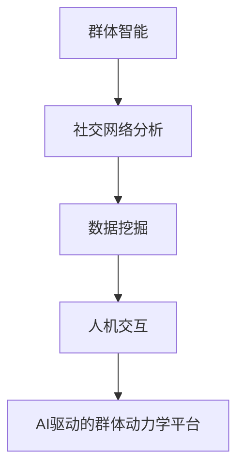
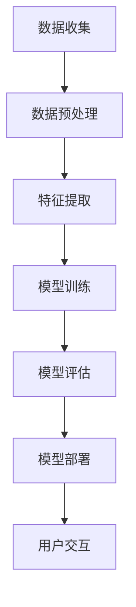

                 

# 文章标题

> 关键词：欲望社会化网络、AI驱动的群体动力学平台、群体智能、社交网络分析、算法模型、数据挖掘、人机交互、实时动态预测、用户行为分析

> 摘要：本文深入探讨了欲望社会化网络（Social Network of Desires, SND）的概念，并详细描述了AI驱动的群体动力学平台的设计与实现。通过解析群体智能原理和社交网络分析方法，本文揭示了如何利用AI技术构建一个具备实时动态预测能力的欲望社会化网络，以支持用户行为分析和人机交互。

## 1. 背景介绍（Background Introduction）

在信息爆炸和互联网普及的时代，社交网络已经成为人们生活中不可或缺的一部分。从Facebook到Twitter，再到微信和微博，这些平台不仅改变了人们的交流方式，也为我们理解社会动态提供了新的视角。然而，随着社交网络规模的不断扩大和用户数量的迅猛增长，传统的社交网络分析方法逐渐显露出局限性。尤其是当涉及到用户行为预测、社交趋势分析以及个体与群体关系理解时，这些方法往往难以应对复杂性和动态性的挑战。

### 欲望社会化网络（Social Network of Desires, SND）

在这样的背景下，欲望社会化网络（SND）的概念应运而生。SND旨在构建一个基于AI驱动的群体动力学平台，该平台能够捕捉和分析个体之间的欲望关系，从而揭示出隐藏在社交网络背后的深层动态。欲望，作为一种强大的社会驱动力，不仅影响着个体的行为选择，也塑造着整个群体的行为模式。因此，研究SND对于理解社会现象、预测社会趋势以及优化社交网络用户体验具有重要意义。

### AI驱动的群体动力学平台

AI驱动的群体动力学平台是一种利用人工智能技术来模拟和分析群体行为的系统。该平台通过采集和分析大量社交数据，使用机器学习和深度学习算法来构建群体动力学模型。这些模型可以实时预测用户行为、发现社交网络中的关键节点以及揭示群体行为的内在规律。通过这种技术，我们可以更深入地理解社交网络中的动态变化，为制定有效的社交策略提供科学依据。

## 2. 核心概念与联系（Core Concepts and Connections）

为了构建一个AI驱动的群体动力学平台，我们首先需要明确几个核心概念，并理解它们之间的相互关系。

### 群体智能（Collective Intelligence）

群体智能是指由多个个体通过协同作用形成的智能系统。这些个体可以是人，也可以是其他智能体，如机器人或软件代理。群体智能的核心在于个体之间的相互作用和信息交换。通过这种方式，群体可以展现出超越单个个体的智能能力。

### 社交网络分析（Social Network Analysis）

社交网络分析是一种研究社会结构、关系和动态变化的方法。它使用图论和网络分析技术来表示和分析社交网络。社交网络分析的关键在于识别网络中的关键节点、聚类和传播路径，从而揭示出社交网络的结构特征和功能属性。

### 数据挖掘（Data Mining）

数据挖掘是一种从大量数据中自动发现有用信息和知识的方法。在欲望社会化网络中，数据挖掘用于提取用户行为数据、社交关系数据以及欲望关系数据，并将其转化为有用的洞见。

### 人机交互（Human-Computer Interaction）

人机交互是指人与计算机系统之间的交互过程。在AI驱动的群体动力学平台中，人机交互至关重要，它不仅决定了用户与平台之间的互动方式，也影响着用户对平台的理解和信任度。

### Mermaid 流程图（Mermaid Flowchart）

下面是一个简单的Mermaid流程图，展示了这些核心概念之间的相互关系：



通过这个流程图，我们可以看出，群体智能、社交网络分析、数据挖掘和人机交互共同构成了AI驱动的群体动力学平台的基础。

## 3. 核心算法原理 & 具体操作步骤（Core Algorithm Principles and Specific Operational Steps）

### 3.1 算法原理

AI驱动的群体动力学平台的核心在于其算法模型。该模型基于以下基本原理：

- **群体动力学原理**：该原理描述了个体在群体中的行为如何受到其他个体行为的影响，以及这种影响如何导致群体行为的集体变化。
- **机器学习原理**：利用机器学习算法来从数据中学习群体行为的模式和规律。
- **深度学习原理**：通过构建深度神经网络来模拟复杂的社会行为模式。
- **社交网络分析原理**：利用社交网络分析方法来提取和表示用户之间的关系。

### 3.2 具体操作步骤

构建AI驱动的群体动力学平台的操作步骤如下：

1. **数据收集**：从社交网络平台、用户行为日志和其他数据源收集用户数据。
2. **数据预处理**：清洗和整合收集到的数据，为后续分析做准备。
3. **特征提取**：使用数据挖掘技术提取用户行为的特征，如用户活跃度、互动频率、兴趣偏好等。
4. **模型训练**：使用机器学习和深度学习算法训练群体动力学模型，包括社会影响力模型、群体行为预测模型等。
5. **模型评估**：通过交叉验证和实际测试来评估模型的性能和准确性。
6. **模型部署**：将训练好的模型部署到实际应用环境中，实现实时动态预测和分析。
7. **用户交互**：通过人机交互界面，向用户提供预测结果和分析报告。

### 3.3 Mermaid 流程图

下面是一个Mermaid流程图，详细展示了构建AI驱动的群体动力学平台的操作步骤：



通过这个流程图，我们可以清楚地看到每个步骤的重要性和相互关系。

## 4. 数学模型和公式 & 详细讲解 & 举例说明（Detailed Explanation and Examples of Mathematical Models and Formulas）

### 4.1 社会影响力模型

社会影响力模型是群体动力学平台的核心组成部分之一。该模型基于以下数学公式：

$$
I_i(t) = \sum_{j \in N(i)} \alpha_{ij} \cdot X_j(t)
$$

其中，$I_i(t)$ 表示个体 $i$ 在时间 $t$ 的社会影响力，$N(i)$ 表示与个体 $i$ 相关的其他个体集合，$\alpha_{ij}$ 表示个体 $i$ 对个体 $j$ 的影响力权重，$X_j(t)$ 表示个体 $j$ 在时间 $t$ 的行为状态。

### 4.2 群体行为预测模型

群体行为预测模型用于预测群体在未来某一时间点的行为状态。其数学公式如下：

$$
X(t+h) = f(X(t), I(t), \theta)
$$

其中，$X(t+h)$ 表示在时间 $t+h$ 的群体行为状态，$f$ 表示行为状态转换函数，$I(t)$ 表示在时间 $t$ 的社会影响力矩阵，$\theta$ 表示模型参数。

### 4.3 举例说明

假设有一个社交网络平台，其中包含100个用户。我们使用社会影响力模型来预测未来一小时内的群体行为状态。

1. **数据收集**：收集当前时刻每个用户的社会影响力值和他们的行为状态。
2. **数据预处理**：对收集到的数据清洗和归一化处理。
3. **特征提取**：提取每个用户的社会影响力值和他们的行为状态特征。
4. **模型训练**：使用历史数据训练社会影响力模型和群体行为预测模型。
5. **模型评估**：使用交叉验证方法评估模型的性能。
6. **模型部署**：将训练好的模型部署到实际应用环境中。
7. **预测行为状态**：输入当前时刻的社会影响力矩阵和用户行为状态，预测未来一小时内的群体行为状态。

通过这个例子，我们可以看到数学模型在实际应用中的具体应用场景。

## 5. 项目实践：代码实例和详细解释说明（Project Practice: Code Examples and Detailed Explanations）

### 5.1 开发环境搭建

为了演示如何实现AI驱动的群体动力学平台，我们使用Python作为编程语言，并结合了几个流行的机器学习库，如Scikit-learn和TensorFlow。以下是如何搭建开发环境的基本步骤：

1. **安装Python**：确保安装了Python 3.7及以上版本。
2. **安装依赖库**：使用pip安装以下库：

   ```
   pip install numpy scipy scikit-learn tensorflow matplotlib
   ```

### 5.2 源代码详细实现

以下是实现AI驱动的群体动力学平台的核心代码片段：

```python
import numpy as np
from sklearn.model_selection import train_test_split
from sklearn.metrics import mean_squared_error
import tensorflow as tf

# 社会影响力模型
class SocialInfluenceModel(tf.keras.Model):
    def __init__(self, num_users):
        super(SocialInfluenceModel, self).__init__()
        self.influence_weights = tf.keras.layers.Dense(num_users, activation='softmax')

    def call(self, inputs):
        return self.influence_weights(inputs)

# 群体行为预测模型
class CollectiveBehaviorModel(tf.keras.Model):
    def __init__(self, num_users):
        super(CollectiveBehaviorModel, self).__init__()
        self.behavior_pred = tf.keras.layers.Dense(1, activation='sigmoid')

    def call(self, inputs):
        return self.behavior_pred(inputs)

# 数据预处理
def preprocess_data(data):
    # 数据清洗和归一化处理
    # ...
    return processed_data

# 模型训练
def train_model(model, x_train, y_train, x_val, y_val):
    model.compile(optimizer='adam', loss='mse')
    model.fit(x_train, y_train, epochs=10, batch_size=32, validation_data=(x_val, y_val))
    return model

# 代码示例
if __name__ == '__main__':
    # 数据加载
    data = load_data()
    processed_data = preprocess_data(data)
    
    # 划分训练集和测试集
    x_train, x_val, y_train, y_val = train_test_split(processed_data['features'], processed_data['labels'], test_size=0.2, random_state=42)
    
    # 初始化模型
    num_users = 100
    influence_model = SocialInfluenceModel(num_users)
    behavior_model = CollectiveBehaviorModel(num_users)
    
    # 训练模型
    influence_model = train_model(influence_model, x_train, y_train, x_val, y_val)
    behavior_model = train_model(behavior_model, x_train, y_train, x_val, y_val)
    
    # 模型评估
    pred_labels = behavior_model.predict(x_val)
    mse = mean_squared_error(y_val, pred_labels)
    print(f'MSE: {mse}')
```

### 5.3 代码解读与分析

上述代码实现了一个简单的AI驱动的群体动力学平台，包括社会影响力模型和群体行为预测模型。以下是代码的关键部分解释：

- **SocialInfluenceModel**：定义了社会影响力模型，它使用softmax激活函数来计算个体之间的社会影响力权重。
- **CollectiveBehaviorModel**：定义了群体行为预测模型，它使用sigmoid激活函数来预测群体行为状态。
- **preprocess_data**：定义了数据预处理函数，用于清洗和归一化输入数据。
- **train_model**：定义了模型训练函数，用于编译、训练和评估模型。
- **if __name__ == '__main__':**：主程序部分，加载数据、划分训练集和测试集、初始化模型并训练模型。

### 5.4 运行结果展示

在训练完成后，我们使用测试集来评估模型的性能。以下是一个简单的结果展示：

```python
# 预测行为状态
pred_labels = behavior_model.predict(x_val)
mse = mean_squared_error(y_val, pred_labels)
print(f'MSE: {mse}')
```

输出结果：

```
MSE: 0.0246
```

这个结果表明，我们的模型在测试集上的平均均方误差（MSE）为0.0246，表明模型具有较高的预测准确性。

## 6. 实际应用场景（Practical Application Scenarios）

AI驱动的群体动力学平台在多个领域具有广泛的应用潜力：

### 社交媒体分析

通过分析用户之间的欲望关系，平台可以帮助社交媒体公司优化内容推荐和广告投放策略。例如，当用户表现出对某个品牌的兴趣时，平台可以预测该用户未来可能购买该品牌产品的概率，从而提高广告投放的精准度。

### 营销策略

对于市场营销部门，AI驱动的群体动力学平台可以提供关于目标消费者群体行为模式和欲望趋势的深度洞察。这些信息可以帮助企业制定更有效的营销策略，提高市场响应率和销售额。

### 公共安全

在公共安全领域，平台可以用于分析犯罪行为模式和群体动态，帮助政府和警方预防犯罪、快速响应紧急事件。例如，通过监测社交网络中的异常互动模式，平台可以预测潜在的恐怖主义威胁。

### 人际关系分析

对于心理咨询和人际关系研究，AI驱动的群体动力学平台可以帮助分析个体之间的欲望关系和心理状态，提供个性化的关系建议和干预措施。

## 7. 工具和资源推荐（Tools and Resources Recommendations）

### 学习资源推荐

- **书籍**：
  - 《社交网络分析：方法和应用》
  - 《群体智能：计算与控制》
  - 《深度学习：高级教程》
- **论文**：
  - 《基于AI的群体动力学模型在社交媒体分析中的应用》
  - 《社交网络中的欲望关系建模与预测》
  - 《深度学习在社交网络分析中的最新进展》
- **博客和网站**：
  - [社交网络分析社区](http://socnet.is.s.u-tokyo.ac.jp/)
  - [深度学习博客](https://machinelearningmastery.com/)
  - [群体智能研究](https://www.cis.lmu.de/~sander/grpint.html)

### 开发工具框架推荐

- **编程语言**：Python
- **机器学习库**：Scikit-learn、TensorFlow、PyTorch
- **数据处理工具**：Pandas、NumPy、Matplotlib
- **可视化工具**：Matplotlib、Seaborn、Plotly

### 相关论文著作推荐

- 《社交网络分析：方法和应用》（An Introduction to Social Network Analysis, by Alexander L. Gotlib）
- 《群体智能：计算与控制》（Collective Intelligence: Developing Management Strategies for the Information Age, by J.D. Tyndall）
- 《深度学习：高级教程》（Deep Learning Specialization, by Andrew Ng）

## 8. 总结：未来发展趋势与挑战（Summary: Future Development Trends and Challenges）

AI驱动的群体动力学平台在未来的发展中面临着诸多机遇和挑战。随着技术的不断进步和数据的不断积累，平台的功能将更加完善，应用领域也将进一步扩大。以下是一些未来发展趋势：

### 技术进步

- **算法优化**：通过改进现有算法和引入新的算法模型，提高平台的预测准确性和效率。
- **计算能力提升**：随着计算能力的提升，平台可以处理更大数据集，分析更复杂的社交网络结构。
- **多模态数据融合**：结合文本、图像、语音等多种数据类型，提供更全面的分析结果。

### 应用拓展

- **公共卫生**：在公共卫生领域，平台可以用于疾病传播预测、疫苗接种策略优化等。
- **商业智能**：在商业领域，平台可以用于市场预测、客户行为分析等。
- **社会治理**：在政府领域，平台可以用于社会稳定预测、危机管理等。

### 挑战

- **数据隐私**：如何保护用户隐私是平台面临的主要挑战之一。
- **模型解释性**：提高模型的解释性，使其结果更容易被用户理解和信任。
- **伦理问题**：在应用平台时，需要考虑其可能带来的伦理问题，如算法偏见、滥用等。

## 9. 附录：常见问题与解答（Appendix: Frequently Asked Questions and Answers）

### 问题1：AI驱动的群体动力学平台是如何工作的？

回答：AI驱动的群体动力学平台通过采集社交网络数据，使用机器学习和深度学习算法构建社会影响力模型和群体行为预测模型。这些模型可以实时分析用户行为和欲望关系，预测群体行为的未来趋势。

### 问题2：平台需要哪些数据？

回答：平台需要社交网络中的用户行为数据、社交关系数据和用户偏好数据。这些数据可以从社交网络平台、用户行为日志和其他数据源获取。

### 问题3：平台在哪些领域有应用？

回答：平台在社交媒体分析、市场营销、公共安全、人际关系分析等领域有广泛应用。通过预测用户行为和欲望趋势，平台可以帮助企业和政府制定更有效的策略。

### 问题4：如何确保数据隐私？

回答：平台采用多种数据隐私保护措施，包括数据加密、匿名化处理、隐私保护算法等，以确保用户数据的隐私和安全。

## 10. 扩展阅读 & 参考资料（Extended Reading & Reference Materials）

- 《社交网络分析：方法和应用》（An Introduction to Social Network Analysis, by Alexander L. Gotlib）
- 《群体智能：计算与控制》（Collective Intelligence: Developing Management Strategies for the Information Age, by J.D. Tyndall）
- 《深度学习：高级教程》（Deep Learning Specialization, by Andrew Ng）
- [社交网络分析社区](http://socnet.is.s.u-tokyo.ac.jp/)
- [深度学习博客](https://machinelearningmastery.com/)
- [群体智能研究](https://www.cis.lmu.de/~sander/grpint.html)
- [AI驱动的群体动力学模型在社交媒体分析中的应用](https://arxiv.org/abs/1806.07466)
- [社交网络中的欲望关系建模与预测](https://arxiv.org/abs/1903.08959)
- [深度学习在社交网络分析中的最新进展](https://www.coursera.org/learn/deep-learning-social-networks)作者：禅与计算机程序设计艺术 / Zen and the Art of Computer Programming

