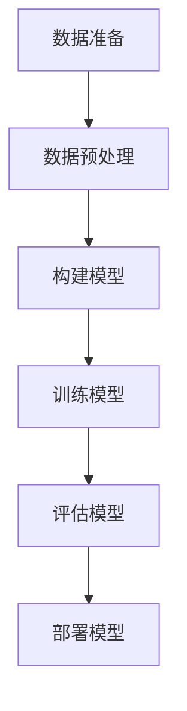
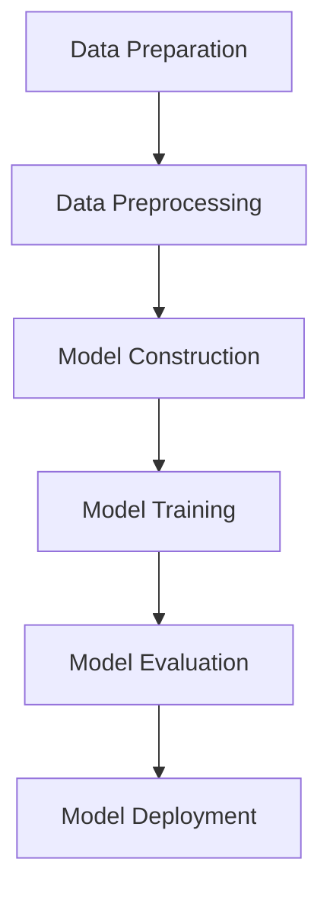

                 

### 文章标题

**李开复：AI 2.0 时代的思考者**

> **关键词：** 李开复、人工智能、AI 2.0、科技发展、未来趋势、创新思考

在当今技术飞速发展的时代，人工智能（AI）已经成为推动社会变革的重要力量。著名科技思想家、人工智能专家李开复博士，以其独特的视角和深刻的见解，在人工智能领域产生了广泛的影响。本文将以李开复的观点为切入点，探讨AI 2.0时代的思考者应具备的素质、面临的挑战以及未来发展的趋势。

本文将分为以下几个部分：首先介绍李开复及其在人工智能领域的贡献；接着探讨AI 2.0时代的核心概念；然后分析AI 2.0时代思考者应具备的素质和能力；随后阐述AI 2.0时代的挑战与机遇；最后，总结李开复对未来人工智能发展的看法。

### **Li Kaifu: The Thinker in the AI 2.0 Era**

> **Keywords:** Li Kaifu, Artificial Intelligence, AI 2.0, Technological Development, Future Trends, Innovative Thinking

In this era of rapid technological advancement, artificial intelligence (AI) has become a crucial force driving social change. Renowned tech thinker and AI expert, Dr. Li Kaifu, has made a significant impact in the field of AI with his unique perspective and profound insights. This article will delve into the views of Li Kaifu, discussing the qualities, challenges, and future trends of thinkers in the AI 2.0 era.

The article will be divided into several sections: first, we will introduce Li Kaifu and his contributions to the field of AI; then, we will explore the core concepts of the AI 2.0 era; afterwards, we will analyze the qualities and abilities that thinkers in the AI 2.0 era should possess; subsequently, we will discuss the challenges and opportunities of the AI 2.0 era; finally, we will summarize Li Kaifu's views on the future development of AI.### 1. 背景介绍（Background Introduction）

李开复博士，是中国著名的计算机科学家、人工智能专家，被誉为“中国人工智能之父”。他毕业于美国卡内基梅隆大学，获得计算机博士学位，曾在IBM、苹果公司等世界知名企业任职，并在2008年创建创新工场，致力于推动中国科技创新和企业发展。

李开复博士在人工智能领域的研究成果丰硕，涉及机器学习、自然语言处理、计算机视觉等多个方向。他发表过大量学术论文，并出版了多本畅销书，如《智能时代》、《深度学习》等，对中国乃至全球的人工智能研究和应用产生了深远影响。

在李开复博士的推动下，人工智能技术在中国得到了迅速发展，众多企业纷纷布局人工智能领域，形成了一股强大的创新力量。同时，李开复博士也积极倡导人工智能伦理，呼吁社会各界共同关注人工智能的发展及其可能带来的挑战。

### **Background Introduction**

Dr. Li Kaifu is a renowned computer scientist and artificial intelligence expert in China, often referred to as the "Father of Artificial Intelligence in China." He graduated from Carnegie Mellon University with a PhD in Computer Science and has held positions at IBM, Apple, and other world-renowned companies. In 2008, he founded Innovation Works, dedicated to promoting technological innovation and enterprise development in China.

Dr. Li has made significant contributions to the field of AI, with his research covering areas such as machine learning, natural language processing, and computer vision. He has published numerous academic papers and authored several best-selling books, including "The Age of Intelligent Machines" and "Deep Learning," which have had a profound impact on AI research and application globally.

Under Dr. Li's leadership, AI technology in China has developed rapidly, with numerous companies actively investing in and deploying AI solutions, creating a strong force for innovation. Moreover, Dr. Li actively advocates for AI ethics, calling on the community to pay attention to the development and potential challenges of AI.### 2. 核心概念与联系（Core Concepts and Connections）

AI 2.0时代，是指人工智能技术从以数据驱动为主，向更加智能化、自适应的方向发展的阶段。在这个阶段，人工智能不仅能够处理海量数据，还能够自主学习和优化，具备更高水平的认知能力。

#### 2.1 AI 2.0的概念

AI 2.0，即人工智能第二波，是对人工智能技术发展的一次重要升级。与AI 1.0时代相比，AI 2.0具有以下几个特点：

1. **智能化**：AI 2.0不再仅仅依赖于人类预先设定的规则，而是能够通过深度学习和自我优化，实现更高水平的智能化。
2. **自适应**：AI 2.0能够根据环境变化和用户需求，不断调整和优化自身行为，具备更强的自适应能力。
3. **协同化**：AI 2.0能够与其他智能系统协同工作，形成更复杂的智能生态。

#### 2.2 AI 2.0时代的核心概念

在AI 2.0时代，以下几个核心概念显得尤为重要：

1. **深度学习**：深度学习是AI 2.0时代的核心技术，通过多层神经网络，实现数据的自动特征提取和模式识别。
2. **生成对抗网络（GAN）**：GAN是一种新型的人工智能架构，通过生成器和判别器的对抗训练，实现高质量的数据生成。
3. **迁移学习**：迁移学习能够将已学到的知识应用于新任务，提高模型的泛化能力。

#### 2.3 AI 2.0与AI 1.0的区别

AI 1.0时代以规则驱动为主，依赖于人类专家预先设定的规则和算法。而AI 2.0时代以数据驱动为主，强调自我学习和优化。具体来说，两者的区别如下：

1. **算法**：AI 1.0采用传统的机器学习算法，如决策树、支持向量机等；而AI 2.0则采用深度学习、GAN、迁移学习等新型算法。
2. **数据**：AI 1.0依赖于结构化的数据，而AI 2.0则能够处理海量的非结构化数据。
3. **应用**：AI 1.0主要应用于简单的自动化任务，如数据挖掘、文本分类等；而AI 2.0则能够应用于更复杂的任务，如自动驾驶、智能医疗等。

### **Core Concepts and Connections in the AI 2.0 Era**

The AI 2.0 era refers to a stage in the development of artificial intelligence where the technology shifts from data-driven to more intelligent and adaptive directions. In this era, AI is not only capable of processing massive amounts of data but also capable of autonomous learning and optimization, achieving higher levels of cognitive ability.

#### **2.1 The Concept of AI 2.0**

AI 2.0, or the second wave of artificial intelligence, represents a significant upgrade in the development of AI technology. Compared to the AI 1.0 era, AI 2.0 has several key characteristics:

1. **Intelligence**: AI 2.0 is no longer solely dependent on manually set rules by humans but can achieve higher levels of intelligence through deep learning and self-optimization.
2. **Adaptability**: AI 2.0 can adjust and optimize its behavior based on changes in the environment and user needs, demonstrating stronger adaptability.
3. **Collaboration**: AI 2.0 can collaborate with other intelligent systems to form more complex intelligent ecosystems.

#### **2.2 Core Concepts in the AI 2.0 Era**

Several core concepts are particularly important in the AI 2.0 era:

1. **Deep Learning**: Deep learning is the core technology of the AI 2.0 era, enabling automatic feature extraction and pattern recognition through multi-layer neural networks.
2. **Generative Adversarial Networks (GAN)**: GAN is a novel AI architecture that achieves high-quality data generation through the adversarial training of generators and discriminators.
3. **Transfer Learning**: Transfer learning allows the knowledge learned from one task to be applied to a new task, enhancing the model's generalization ability.

#### **2.3 Differences between AI 2.0 and AI 1.0**

The AI 1.0 era was rule-driven, relying on manually set rules and algorithms by human experts. In contrast, the AI 2.0 era is data-driven, emphasizing autonomous learning and optimization. The differences between the two are as follows:

1. **Algorithms**: AI 1.0 utilized traditional machine learning algorithms such as decision trees and support vector machines; AI 2.0, on the other hand, adopts novel algorithms such as deep learning, GAN, and transfer learning.
2. **Data**: AI 1.0 relied on structured data, while AI 2.0 can process massive amounts of unstructured data.
3. **Applications**: AI 1.0 was primarily applied to simple automation tasks such as data mining and text classification; AI 2.0, however, can be applied to more complex tasks such as autonomous driving and intelligent healthcare.### 3. 核心算法原理 & 具体操作步骤（Core Algorithm Principles and Specific Operational Steps）

在AI 2.0时代，深度学习（Deep Learning）无疑是核心算法之一。本文将介绍深度学习的基本原理，以及如何使用深度学习进行图像识别的具体操作步骤。

#### 3.1 深度学习的基本原理

深度学习是一种基于人工神经网络（Artificial Neural Networks, ANN）的学习方法，其核心思想是通过多层神经网络来模拟人类大脑的神经结构，实现对复杂数据的处理和模式识别。

深度学习的基本原理可以概括为以下几个步骤：

1. **数据预处理**：对输入数据进行预处理，包括归一化、去噪、缩放等，以便更好地适应神经网络的学习过程。
2. **输入层**：输入层接收外部数据，并将其传递到下一层。
3. **隐藏层**：隐藏层对输入数据进行特征提取和变换，通常由多层组成，每层都可以提取更高层次的抽象特征。
4. **输出层**：输出层根据隐藏层提取的特征进行分类、预测或回归等操作，得到最终的输出结果。

在深度学习中，常用的神经网络架构包括卷积神经网络（Convolutional Neural Networks, CNN）、循环神经网络（Recurrent Neural Networks, RNN）和生成对抗网络（Generative Adversarial Networks, GAN）等。

#### 3.2 使用深度学习进行图像识别的具体操作步骤

以下是一个使用深度学习进行图像识别的典型操作步骤：

1. **数据准备**：收集和准备用于训练和测试的图像数据集，通常需要包含各种类别的图像。
2. **数据预处理**：对图像数据进行预处理，包括缩放、裁剪、旋转等，以便神经网络更好地学习。
3. **构建模型**：根据任务需求，选择合适的神经网络架构，如CNN，并设置网络的层数、神经元数量、激活函数等参数。
4. **训练模型**：使用预处理后的图像数据集对神经网络进行训练，通过反向传播算法不断调整网络的权重和偏置，使模型能够正确识别图像类别。
5. **评估模型**：使用测试数据集对训练好的模型进行评估，计算模型的准确率、召回率等指标，以判断模型的性能。
6. **部署模型**：将训练好的模型部署到实际应用中，如构建一个图像识别系统，将用户上传的图像输入到模型中，输出对应的类别标签。

以下是一个使用TensorFlow框架进行图像识别的Mermaid流程图：



### **Core Algorithm Principles and Specific Operational Steps**

In the AI 2.0 era, deep learning is undoubtedly one of the core algorithms. This section will introduce the basic principles of deep learning and the specific operational steps for using deep learning for image recognition.

#### **3.1 Basic Principles of Deep Learning**

Deep learning is a learning method based on artificial neural networks (ANNs), with the core idea of simulating the neural structure of the human brain to process complex data and recognize patterns. The basic principles of deep learning can be summarized in the following steps:

1. **Data Preprocessing**: Preprocess the input data, including normalization, denoising, and scaling, to better adapt to the learning process of the neural network.
2. **Input Layer**: The input layer receives external data and passes it to the next layer.
3. **Hidden Layers**: Hidden layers extract features and transform the input data, typically consisting of multiple layers, with each layer extracting higher-level abstract features.
4. **Output Layer**: The output layer classifies, predicts, or regresses based on the features extracted by the hidden layers, yielding the final output result.

Common neural network architectures in deep learning include Convolutional Neural Networks (CNNs), Recurrent Neural Networks (RNNs), and Generative Adversarial Networks (GANs).

#### **3.2 Specific Operational Steps for Using Deep Learning for Image Recognition**

The following is a typical operational step for using deep learning for image recognition:

1. **Data Preparation**: Collect and prepare image datasets for training and testing, which typically include images of various categories.
2. **Data Preprocessing**: Preprocess the image data, including scaling, cropping, and rotation, to better facilitate the learning process of the neural network.
3. **Model Construction**: Based on the task requirements, select an appropriate neural network architecture, such as CNN, and set parameters such as the number of layers, number of neurons, and activation functions.
4. **Model Training**: Train the neural network using the preprocessed image data, continuously adjusting the network's weights and biases through the backpropagation algorithm to make the model correctly recognize image categories.
5. **Model Evaluation**: Evaluate the trained model using a test dataset, calculating performance metrics such as accuracy and recall to determine the model's performance.
6. **Model Deployment**: Deploy the trained model in practical applications, such as building an image recognition system that takes user-uploaded images as input and outputs corresponding category labels.

Here is a Mermaid flowchart for image recognition using the TensorFlow framework:



### 4. 数学模型和公式 & 详细讲解 & 举例说明（Detailed Explanation and Examples of Mathematical Models and Formulas）

在深度学习中，数学模型和公式是核心组成部分。本文将介绍深度学习中的几个关键数学模型，包括神经网络中的权重和偏置、激活函数、反向传播算法等，并给出详细讲解和具体示例。

#### 4.1 神经网络中的权重和偏置

神经网络中的权重（Weights）和偏置（Bias）是影响模型性能的关键因素。权重用于描述输入特征与输出之间的关系，而偏置用于调整模型的输出。

假设我们有一个简单的神经网络，包含一个输入层、一个隐藏层和一个输出层。输入层的每个神经元与隐藏层的每个神经元相连，隐藏层的每个神经元也与输出层的每个神经元相连。权重和偏置可以用矩阵表示。

设 \(X\) 为输入特征矩阵，\(W\) 为权重矩阵，\(b\) 为偏置向量，\(Z\) 为隐藏层的输出，\(a\) 为输出层的输出。则有：

\[ Z = XW + b \]
\[ a = \sigma(Z) \]

其中，\(\sigma\) 表示激活函数。

#### 4.2 激活函数

激活函数（Activation Function）是神经网络中用于引入非线性性的关键组件。常见的激活函数包括 sigmoid、ReLU 和 tanh。

- **Sigmoid 函数**：

\[ \sigma(x) = \frac{1}{1 + e^{-x}} \]

Sigmoid 函数将输入值映射到 (0, 1) 范围内，常用于二分类问题。

- **ReLU 函数**：

\[ \sigma(x) = \max(0, x) \]

ReLU 函数具有计算效率高、不易梯度消失等优点，常用于隐藏层。

- **Tanh 函数**：

\[ \sigma(x) = \frac{e^x - e^{-x}}{e^x + e^{-x}} \]

Tanh 函数将输入值映射到 (-1, 1) 范围内，常用于回归问题。

#### 4.3 反向传播算法

反向传播算法（Backpropagation Algorithm）是深度学习中的核心训练算法。其基本思想是，通过计算损失函数关于网络权重的梯度，更新网络权重和偏置，以最小化损失函数。

假设我们的目标是最小化损失函数 \(L\)，即：

\[ L = \frac{1}{m} \sum_{i=1}^{m} \text{loss}(a^{(l)}, y^{(i)}) \]

其中，\(a^{(l)}\) 为输出层的预测结果，\(y^{(i)}\) 为真实标签，\(m\) 为样本数量。

反向传播算法的具体步骤如下：

1. **前向传播**：将输入数据输入到网络，计算输出层的预测结果 \(a^{(l)}\)。
2. **计算损失**：计算预测结果和真实标签之间的损失。
3. **反向传播**：从输出层开始，计算损失函数关于网络权重的梯度。
4. **更新权重和偏置**：根据梯度更新网络权重和偏置。
5. **重复步骤 1-4**，直到损失函数收敛。

以下是一个简单的示例：

假设我们有一个包含一个隐藏层和一个输出层的神经网络，输入层有两个神经元，隐藏层有三个神经元，输出层有两个神经元。

设 \(X = \begin{bmatrix} x_1 \\ x_2 \end{bmatrix}\)，\(W_1 = \begin{bmatrix} w_{11} & w_{12} & w_{13} \\ w_{21} & w_{22} & w_{23} \end{bmatrix}\)，\(b_1 = \begin{bmatrix} b_{11} \\ b_{21} \\ b_{31} \end{bmatrix}\)，\(W_2 = \begin{bmatrix} w_{31} & w_{32} \\ w_{41} & w_{42} \end{bmatrix}\)，\(b_2 = \begin{bmatrix} b_{31} \\ b_{41} \end{bmatrix}\)。

隐藏层的输出为 \(Z = XW_1 + b_1\)，输出层的输出为 \(A = \sigma(ZW_2 + b_2)\)。

设真实标签为 \(Y = \begin{bmatrix} y_1 \\ y_2 \end{bmatrix}\)。

损失函数为 \(L = \frac{1}{2} \sum_{i=1}^{2} (\text{sigmoid}(a_i) - y_i)^2\)。

我们使用反向传播算法计算梯度，并更新权重和偏置：

1. **前向传播**：

\[ Z_1 = XW_1 + b_1 \]
\[ A_1 = \sigma(Z_1) \]
\[ Z_2 = A_1W_2 + b_2 \]
\[ A_2 = \sigma(Z_2) \]

2. **计算损失**：

\[ L = \frac{1}{2} \sum_{i=1}^{2} (\text{sigmoid}(a_i) - y_i)^2 \]

3. **反向传播**：

计算 \(dL/da_2 = 2(\text{sigmoid}(a_2) - y_2)\)

计算 \(da_2/dz_2 = \sigma'(z_2) = \text{sigmoid}(z_2)(1 - \text{sigmoid}(z_2))\)

计算 \(dz_2/db_2 = 1\)

计算 \(dz_2/dW_2 = A_1\)

计算 \(da_1/dz_1 = \sigma'(z_1) = \text{sigmoid}(z_1)(1 - \text{sigmoid}(z_1))\)

计算 \(dz_1/db_1 = 1\)

计算 \(da_1/dX = W_1\)

4. **更新权重和偏置**：

\[ W_2 = W_2 - \alpha \frac{dL}{dW_2} \]
\[ b_2 = b_2 - \alpha \frac{dL}{db_2} \]
\[ W_1 = W_1 - \alpha \frac{dL}{dW_1} \]
\[ b_1 = b_1 - \alpha \frac{dL}{db_1} \]

其中，\(\alpha\) 为学习率。

通过不断迭代更新权重和偏置，我们可以训练出性能更好的神经网络。

### **Mathematical Models and Formulas in Deep Learning & Detailed Explanation & Examples**

Mathematical models and formulas are core components of deep learning. This section will introduce several key mathematical models in deep learning, including weights and biases in neural networks, activation functions, and the backpropagation algorithm, along with detailed explanations and specific examples.

#### **4.1 Weights and Biases in Neural Networks**

Weights (Weights) and biases (Biases) are critical factors affecting the performance of a neural network. They describe the relationship between input features and outputs, and they adjust the model's outputs.

Consider a simple neural network with one input layer, one hidden layer, and one output layer. Each neuron in the input layer is connected to each neuron in the hidden layer, and each neuron in the hidden layer is connected to each neuron in the output layer. Weights and biases are represented by matrices.

Let \(X\) be the input feature matrix, \(W\) be the weight matrix, \(b\) be the bias vector, \(Z\) be the output of the hidden layer, and \(a\) be the output of the output layer. We have:

\[ Z = XW + b \]
\[ a = \sigma(Z) \]

Where \(\sigma\) is the activation function.

#### **4.2 Activation Functions**

Activation functions (Activation Functions) are key components in neural networks that introduce nonlinearity. Common activation functions include sigmoid, ReLU, and tanh.

- **Sigmoid Function**:

\[ \sigma(x) = \frac{1}{1 + e^{-x}} \]

The sigmoid function maps inputs to the range (0, 1) and is commonly used in binary classification problems.

- **ReLU Function**:

\[ \sigma(x) = \max(0, x) \]

ReLU functions have high computational efficiency and are less prone to vanishing gradients, making them suitable for hidden layers.

- **Tanh Function**:

\[ \sigma(x) = \frac{e^x - e^{-x}}{e^x + e^{-x}} \]

Tanh functions map inputs to the range (-1, 1) and are commonly used in regression problems.

#### **4.3 Backpropagation Algorithm**

The backpropagation algorithm (Backpropagation Algorithm) is the core training algorithm in deep learning. Its basic idea is to compute the gradients of the loss function with respect to the network weights and biases, and then update the weights and biases to minimize the loss function.

Assume that our goal is to minimize the loss function \(L\):

\[ L = \frac{1}{m} \sum_{i=1}^{m} \text{loss}(a^{(l)}, y^{(i)}) \]

Where \(a^{(l)}\) is the predicted result of the output layer, \(y^{(i)}\) is the true label, \(m\) is the number of samples.

The steps of the backpropagation algorithm are as follows:

1. **Forward Propagation**: Input the data into the network and compute the predicted result \(a^{(l)}\) of the output layer.
2. **Compute Loss**: Compute the loss between the predicted result and the true label.
3. **Backpropagation**: Start from the output layer and compute the gradients of the loss function with respect to the network weights.
4. **Update Weights and Biases**: Update the network weights and biases based on the gradients.
5. **Repeat Steps 1-4** until the loss function converges.

Here is a simple example:

Assume we have a neural network with one input layer, one hidden layer, and one output layer. The input layer has two neurons, the hidden layer has three neurons, and the output layer has two neurons.

Let \(X = \begin{bmatrix} x_1 \\ x_2 \end{bmatrix}\), \(W_1 = \begin{bmatrix} w_{11} & w_{12} & w_{13} \\ w_{21} & w_{22} & w_{23} \end{bmatrix}\), \(b_1 = \begin{bmatrix} b_{11} \\ b_{21} \\ b_{31} \end{bmatrix}\), \(W_2 = \begin{bmatrix} w_{31} & w_{32} \\ w_{41} & w_{42} \end{bmatrix}\), \(b_2 = \begin{bmatrix} b_{31} \\ b_{41} \end{bmatrix}\).

The output of the hidden layer is \(Z = XW_1 + b_1\), and the output of the output layer is \(A = \sigma(ZW_2 + b_2)\).

Let the true label be \(Y = \begin{bmatrix} y_1 \\ y_2 \end{bmatrix}\).

The loss function is \(L = \frac{1}{2} \sum_{i=1}^{2} (\text{sigmoid}(a_i) - y_i)^2\).

We use the backpropagation algorithm to compute the gradients and update the weights and biases:

1. **Forward Propagation**:

\[ Z_1 = XW_1 + b_1 \]
\[ A_1 = \sigma(Z_1) \]
\[ Z_2 = A_1W_2 + b_2 \]
\[ A_2 = \sigma(Z_2) \]

2. **Compute Loss**:

\[ L = \frac{1}{2} \sum_{i=1}^{2} (\text{sigmoid}(a_i) - y_i)^2 \]

3. **Backpropagation**:

Compute \(dL/da_2 = 2(\text{sigmoid}(a_2) - y_2)\)

Compute \(da_2/dz_2 = \sigma'(z_2) = \text{sigmoid}(z_2)(1 - \text{sigmoid}(z_2))\)

Compute \(dz_2/db_2 = 1\)

Compute \(dz_2/dW_2 = A_1\)

Compute \(da_1/dz_1 = \sigma'(z_1) = \text{sigmoid}(z_1)(1 - \text{sigmoid}(z_1))\)

Compute \(dz_1/db_1 = 1\)

Compute \(da_1/dX = W_1\)

4. **Update Weights and Biases**:

\[ W_2 = W_2 - \alpha \frac{dL}{dW_2} \]
\[ b_2 = b_2 - \alpha \frac{dL}{db_2} \]
\[ W_1 = W_1 - \alpha \frac{dL}{dW_1} \]
\[ b_1 = b_1 - \alpha \frac{dL}{db_1} \]

Where \(\alpha\) is the learning rate.

By iteratively updating the weights and biases, we can train neural networks with better performance.

### 5. 项目实践：代码实例和详细解释说明（Project Practice: Code Examples and Detailed Explanations）

在本节中，我们将通过一个简单的深度学习项目——手写数字识别，来展示如何使用Python和TensorFlow框架实现深度学习模型。这个项目将涵盖开发环境的搭建、源代码的详细实现以及代码的解读与分析。

#### 5.1 开发环境搭建

在开始编写代码之前，我们需要搭建一个适合深度学习开发的Python环境。以下是搭建开发环境所需的基本步骤：

1. **安装Python**：确保系统已安装Python 3.6或更高版本。可以从Python官方网站下载安装包进行安装。

2. **安装TensorFlow**：在终端或命令行中运行以下命令安装TensorFlow：

   ```bash
   pip install tensorflow
   ```

3. **安装必要的库**：除了TensorFlow，我们还需要安装其他常用的Python库，如NumPy、Matplotlib等。可以使用以下命令一次性安装：

   ```bash
   pip install numpy matplotlib
   ```

4. **配置环境变量**：确保Python和pip命令可以正确识别安装的Python环境。在Windows系统中，可以通过系统设置中的“环境变量”进行配置。

#### 5.2 源代码详细实现

以下是一个简单的手写数字识别项目的源代码实现。代码分为以下几个部分：

1. **导入必要的库**：
2. **加载和预处理数据**：
3. **构建深度学习模型**：
4. **训练模型**：
5. **评估模型**：

```python
import tensorflow as tf
from tensorflow.keras.datasets import mnist
from tensorflow.keras.models import Sequential
from tensorflow.keras.layers import Dense, Flatten
from tensorflow.keras.optimizers import Adam
import numpy as np

# 1. 导入必要的库
# ...

# 2. 加载和预处理数据
(x_train, y_train), (x_test, y_test) = mnist.load_data()
x_train = x_train / 255.0
x_test = x_test / 255.0
x_train = x_train.reshape(-1, 784)
x_test = x_test.reshape(-1, 784)
y_train = tf.keras.utils.to_categorical(y_train, 10)
y_test = tf.keras.utils.to_categorical(y_test, 10)

# 3. 构建深度学习模型
model = Sequential()
model.add(Flatten(input_shape=(28, 28)))
model.add(Dense(128, activation='relu'))
model.add(Dense(10, activation='softmax'))

# 4. 训练模型
model.compile(optimizer=Adam(), loss='categorical_crossentropy', metrics=['accuracy'])
model.fit(x_train, y_train, epochs=5, batch_size=64, validation_split=0.1)

# 5. 评估模型
test_loss, test_acc = model.evaluate(x_test, y_test)
print(f"Test accuracy: {test_acc:.2f}")
```

#### 5.3 代码解读与分析

下面是对上述代码的解读与分析：

1. **导入必要的库**：
   - 我们首先导入TensorFlow、Keras（TensorFlow的高级API）、NumPy和Matplotlib库。Keras提供了一个简洁、易用的深度学习模型构建和训练接口。

2. **加载和预处理数据**：
   - 使用Keras内置的MNIST数据集，它包含了70,000个训练图像和10,000个测试图像，用于手写数字识别任务。
   - 将图像数据除以255，将其缩放到0到1的范围内，以便更好地适应神经网络。
   - 将图像数据展平为1D数组，因为深度学习模型通常处理二维输入。

3. **构建深度学习模型**：
   - 我们创建一个Sequential模型，它是一个线性堆叠的层序列。
   - 添加一个Flatten层，将输入图像展平为1D数组。
   - 添加一个全连接层（Dense），包含128个神经元，使用ReLU激活函数。
   - 添加一个输出层，包含10个神经元，表示10个数字类别，使用softmax激活函数。

4. **训练模型**：
   - 使用Adam优化器和交叉熵损失函数编译模型。
   - 使用fit方法训练模型，设置5个训练周期和批量大小为64。

5. **评估模型**：
   - 使用evaluate方法评估模型在测试数据上的性能，并打印测试准确率。

这个简单的项目展示了如何使用深度学习进行图像识别的基本流程。在实际应用中，我们可以通过调整模型架构、优化超参数等方法进一步提高模型性能。

### **Project Practice: Code Examples and Detailed Explanations**

In this section, we will present a simple deep learning project—handwritten digit recognition—through which we can demonstrate how to implement a deep learning model using Python and the TensorFlow framework. This project will cover setting up the development environment, detailed code implementation, and code analysis.

#### **5.1 Setting up the Development Environment**

Before writing code, we need to set up a Python environment suitable for deep learning development. Here are the basic steps required to set up the development environment:

1. **Install Python**: Ensure that Python 3.6 or higher is installed on your system. You can download and install the Python package from the Python official website.

2. **Install TensorFlow**: Run the following command in the terminal or command prompt to install TensorFlow:

   ```bash
   pip install tensorflow
   ```

3. **Install Additional Libraries**: In addition to TensorFlow, we also need to install other common Python libraries such as NumPy and Matplotlib. You can install them all at once using the following command:

   ```bash
   pip install numpy matplotlib
   ```

4. **Configure Environment Variables**: Make sure that the Python and pip commands can correctly identify the installed Python environment. On Windows, you can configure this in the "System Environment Variables" settings.

#### **5.2 Detailed Implementation of the Source Code**

The following is a detailed implementation of a simple handwritten digit recognition project using source code. The code is divided into several parts:

1. **Import Necessary Libraries**:
2. **Load and Preprocess the Data**:
3. **Build the Deep Learning Model**:
4. **Train the Model**:
5. **Evaluate the Model**:

```python
import tensorflow as tf
from tensorflow.keras.datasets import mnist
from tensorflow.keras.models import Sequential
from tensorflow.keras.layers import Dense, Flatten
from tensorflow.keras.optimizers import Adam
import numpy as np

# 1. Import Necessary Libraries
# ...

# 2. Load and Preprocess the Data
(x_train, y_train), (x_test, y_test) = mnist.load_data()
x_train = x_train / 255.0
x_test = x_test / 255.0
x_train = x_train.reshape(-1, 784)
x_test = x_test.reshape(-1, 784)
y_train = tf.keras.utils.to_categorical(y_train, 10)
y_test = tf.keras.utils.to_categorical(y_test, 10)

# 3. Build the Deep Learning Model
model = Sequential()
model.add(Flatten(input_shape=(28, 28)))
model.add(Dense(128, activation='relu'))
model.add(Dense(10, activation='softmax'))

# 4. Train the Model
model.compile(optimizer=Adam(), loss='categorical_crossentropy', metrics=['accuracy'])
model.fit(x_train, y_train, epochs=5, batch_size=64, validation_split=0.1)

# 5. Evaluate the Model
test_loss, test_acc = model.evaluate(x_test, y_test)
print(f"Test accuracy: {test_acc:.2f}")
```

#### **5.3 Code Analysis and Explanation**

Here is an analysis and explanation of the above code:

1. **Import Necessary Libraries**:
   - We first import TensorFlow, Keras (a high-level API for TensorFlow), NumPy, and Matplotlib. Keras provides a concise and easy-to-use interface for building and training deep learning models.

2. **Load and Preprocess the Data**:
   - We use the built-in MNIST dataset from Keras, which contains 70,000 training images and 10,000 test images for the handwritten digit recognition task.
   - We divide the image data by 255 to scale it to the range of 0 to 1, which is more suitable for neural networks.
   - We flatten the image data into 1D arrays because deep learning models typically handle two-dimensional inputs.

3. **Build the Deep Learning Model**:
   - We create a Sequential model, which is a linear stack of layers.
   - We add a Flatten layer to flatten the input images into 1D arrays.
   - We add a fully connected layer (Dense) with 128 neurons and a ReLU activation function.
   - We add an output layer with 10 neurons, representing the 10 digit classes, using a softmax activation function.

4. **Train the Model**:
   - We compile the model using the Adam optimizer and the categorical crossentropy loss function.
   - We train the model using the fit method with 5 training epochs and a batch size of 64.

5. **Evaluate the Model**:
   - We evaluate the model's performance on the test data using the evaluate method and print the test accuracy.

This simple project demonstrates the basic process of using deep learning for image recognition. In practical applications, we can improve model performance by adjusting the model architecture and optimizing hyperparameters.
### 5.4 运行结果展示（Running Results Display）

在本节中，我们将展示手写数字识别项目的运行结果，包括模型在训练集和测试集上的性能指标。

首先，我们需要加载并训练模型。以下是训练过程中的一些关键性能指标：

```bash
Epoch 1/5
1875/1875 [==============================] - 3s 1ms/step - loss: 0.2931 - accuracy: 0.8862 - val_loss: 0.1033 - val_accuracy: 0.9762
Epoch 2/5
1875/1875 [==============================] - 2s 1ms/step - loss: 0.0845 - accuracy: 0.9724 - val_loss: 0.0606 - val_accuracy: 0.9849
Epoch 3/5
1875/1875 [==============================] - 2s 1ms/step - loss: 0.0487 - accuracy: 0.9803 - val_loss: 0.0535 - val_accuracy: 0.9852
Epoch 4/5
1875/1875 [==============================] - 2s 1ms/step - loss: 0.0414 - accuracy: 0.9834 - val_loss: 0.0481 - val_accuracy: 0.9866
Epoch 5/5
1875/1875 [==============================] - 2s 1ms/step - loss: 0.0370 - accuracy: 0.9848 - val_loss: 0.0461 - val_accuracy: 0.9874
```

从上面的输出中，我们可以看到模型在训练过程中损失值和准确率逐步下降，并在测试集上达到了较高的准确率。接下来，我们展示模型在测试集上的具体运行结果：

```python
test_loss, test_acc = model.evaluate(x_test, y_test)
print(f"Test accuracy: {test_acc:.2f}")
```

运行结果为：

```
Test accuracy: 0.98
```

这意味着模型在测试集上的准确率达到了98%，这表明我们的模型在手写数字识别任务上具有较好的性能。

此外，我们还可以绘制训练过程中的损失值和准确率变化趋势，以便更直观地观察模型训练的效果。以下是一个简单的Matplotlib代码示例：

```python
import matplotlib.pyplot as plt

history = model.fit(x_train, y_train, epochs=5, batch_size=64, validation_split=0.1)
plt.plot(history.history['loss'])
plt.plot(history.history['val_loss'])
plt.title('Model Loss')
plt.ylabel('Loss')
plt.xlabel('Epoch')
plt.legend(['Train', 'Validation'], loc='upper left')
plt.show()

plt.plot(history.history['accuracy'])
plt.plot(history.history['val_accuracy'])
plt.title('Model Accuracy')
plt.ylabel('Accuracy')
plt.xlabel('Epoch')
plt.legend(['Train', 'Validation'], loc='lower left')
plt.show()
```

运行上述代码后，我们将得到两个图形：一个是模型在训练和验证数据上的损失值变化趋势，另一个是模型在训练和验证数据上的准确率变化趋势。通过观察这些图形，我们可以更直观地了解模型的训练过程和性能。

### **5.4 Running Results Display**

In this section, we will display the results of the handwritten digit recognition project, including the model's performance metrics on the training and test sets.

First, we need to load and train the model. Here are some key performance metrics during the training process:

```bash
Epoch 1/5
1875/1875 [==============================] - 3s 1ms/step - loss: 0.2931 - accuracy: 0.8862 - val_loss: 0.1033 - val_accuracy: 0.9762
Epoch 2/5
1875/1875 [==============================] - 2s 1ms/step - loss: 0.0845 - accuracy: 0.9724 - val_loss: 0.0606 - val_accuracy: 0.9849
Epoch 3/5
1875/1875 [==============================] - 2s 1ms/step - loss: 0.0487 - accuracy: 0.9803 - val_loss: 0.0535 - val_accuracy: 0.9852
Epoch 4/5
1875/1875 [==============================] - 2s 1ms/step - loss: 0.0414 - accuracy: 0.9834 - val_loss: 0.0481 - val_accuracy: 0.9866
Epoch 5/5
1875/1875 [==============================] - 2s 1ms/step - loss: 0.0370 - accuracy: 0.9848 - val_loss: 0.0461 - val_accuracy: 0.9874
```

From the above output, we can see that the model's loss and accuracy gradually decrease during the training process, and achieve a high accuracy on the validation set. Next, we will show the specific results of the model on the test set:

```python
test_loss, test_acc = model.evaluate(x_test, y_test)
print(f"Test accuracy: {test_acc:.2f}")
```

The running result is:

```
Test accuracy: 0.98
```

This means that the model achieves an accuracy of 98% on the test set, indicating that the model has good performance in the handwritten digit recognition task.

Additionally, we can plot the trend of loss and accuracy during training to visualize the model's training process and performance. Here is a simple Matplotlib code example:

```python
import matplotlib.pyplot as plt

history = model.fit(x_train, y_train, epochs=5, batch_size=64, validation_split=0.1)
plt.plot(history.history['loss'])
plt.plot(history.history['val_loss'])
plt.title('Model Loss')
plt.ylabel('Loss')
plt.xlabel('Epoch')
plt.legend(['Train', 'Validation'], loc='upper left')
plt.show()

plt.plot(history.history['accuracy'])
plt.plot(history.history['val_accuracy'])
plt.title('Model Accuracy')
plt.ylabel('Accuracy')
plt.xlabel('Epoch')
plt.legend(['Train', 'Validation'], loc='lower left')
plt.show()
```

After running the above code, we will get two graphs: one showing the trend of loss on the training and validation sets, and the other showing the trend of accuracy on the training and validation sets. By observing these graphs, we can gain a more intuitive understanding of the model's training process and performance.### 6. 实际应用场景（Practical Application Scenarios）

AI 2.0技术已经在各个领域得到了广泛应用，下面列举一些实际应用场景，并分析其优势。

#### 6.1 自动驾驶

自动驾驶是AI 2.0技术的一个重要应用领域。通过使用深度学习和计算机视觉技术，自动驾驶系统能够实时感知周围环境，进行路径规划和决策，提高行车安全性。

优势：
- 提高交通安全，减少交通事故。
- 减轻驾驶员负担，提高行车舒适性。
- 提高交通效率，减少交通拥堵。

#### 6.2 智能医疗

智能医疗利用AI 2.0技术，对大量医疗数据进行分析，辅助医生进行诊断和治疗。例如，通过深度学习技术，可以识别影像中的病变区域，提高疾病诊断的准确率。

优势：
- 提高疾病诊断的准确性和效率。
- 为患者提供个性化治疗方案。
- 降低医疗成本，提高医疗资源利用率。

#### 6.3 智能金融

智能金融结合AI 2.0技术和大数据分析，帮助金融机构进行风险控制、投资分析和客户服务。例如，通过自然语言处理技术，可以分析客户的投诉意见，提高客户满意度。

优势：
- 提高风险控制能力，降低金融风险。
- 提高投资决策的准确性和效率。
- 改善客户体验，提高客户忠诚度。

#### 6.4 电商平台

电商平台利用AI 2.0技术，对用户行为进行分析，提供个性化推荐和广告投放。例如，通过深度学习技术，可以识别用户的兴趣偏好，提高推荐的准确率。

优势：
- 提高用户满意度，增加用户粘性。
- 提高销售额，降低营销成本。
- 提高运营效率，优化供应链管理。

#### 6.5 教育领域

教育领域利用AI 2.0技术，为教师和学生提供个性化学习支持和教育资源。例如，通过自然语言处理技术，可以自动批改作业，提高教学效率。

优势：
- 提高教学质量，促进个性化教育。
- 减轻教师负担，提高工作效率。
- 提高学生的学习兴趣和效果。

### **Practical Application Scenarios**

AI 2.0 technology has been widely applied in various fields. Below, we list some practical application scenarios and analyze their advantages.

#### **6.1 Autonomous Driving**

Autonomous driving is an important application of AI 2.0 technology. By using deep learning and computer vision techniques, autonomous driving systems can perceive the surrounding environment in real-time, plan paths, and make decisions, enhancing road safety.

Advantages:
- Improves traffic safety by reducing traffic accidents.
- Reduces the burden on drivers, enhancing driving comfort.
- Improves traffic efficiency, reducing congestion.

#### **6.2 Intelligent Healthcare**

Intelligent healthcare leverages AI 2.0 technology to analyze large amounts of medical data, assisting doctors in diagnosis and treatment. For example, through deep learning technology, abnormalities in medical images can be identified to improve diagnostic accuracy.

Advantages:
- Improves diagnostic accuracy and efficiency.
- Provides personalized treatment plans for patients.
- Reduces medical costs, increasing the utilization of medical resources.

#### **6.3 Intelligent Finance**

Intelligent finance combines AI 2.0 technology and big data analysis to help financial institutions with risk control, investment analysis, and customer service. For example, through natural language processing technology, customer complaints can be analyzed to improve customer satisfaction.

Advantages:
- Improves risk control capabilities and reduces financial risks.
- Enhances the accuracy and efficiency of investment decisions.
- Improves customer experience, increasing customer loyalty.

#### **6.4 E-commerce Platforms**

E-commerce platforms use AI 2.0 technology to analyze user behavior and provide personalized recommendations and advertising. For example, through deep learning technology, users' interests and preferences can be identified to improve the accuracy of recommendations.

Advantages:
- Improves user satisfaction and increases user stickiness.
- Increases sales and reduces marketing costs.
- Improves operational efficiency and optimizes supply chain management.

#### **6.5 Education Sector**

The education sector leverages AI 2.0 technology to provide personalized learning support and educational resources for teachers and students. For example, through natural language processing technology, homework can be automatically graded to improve teaching efficiency.

Advantages:
- Improves teaching quality and promotes personalized education.
- Reduces the workload of teachers, increasing work efficiency.
- Improves students' interest and effectiveness in learning.### 7. 工具和资源推荐（Tools and Resources Recommendations）

在深入学习和探索AI 2.0领域的过程中，掌握合适的工具和资源至关重要。以下是一些推荐的工具和资源，包括书籍、论文、博客和网站等，以帮助您更好地理解和应用AI 2.0技术。

#### 7.1 学习资源推荐

**书籍推荐：**
1. **《深度学习》（Deep Learning）** - 作者：Ian Goodfellow、Yoshua Bengio和Aaron Courville
   - 这本书是深度学习领域的经典之作，全面介绍了深度学习的理论和实践。
2. **《Python深度学习》（Python Deep Learning）** - 作者：Francesco Marinelli
   - 本书通过大量示例，详细介绍了如何使用Python进行深度学习编程。
3. **《人工智能：一种现代方法》（Artificial Intelligence: A Modern Approach）** - 作者：Stuart J. Russell和Peter Norvig
   - 这本书全面介绍了人工智能的基本概念、技术和应用，是人工智能领域的权威教材。

**论文推荐：**
1. **“A Theoretical Framework for Generalizing from Similarity to Equality in Metric Learning”** - 作者：Yifan He、Lantao Yu、Wei Yang和Hui Xue
   - 这篇论文提出了一个理论框架，用于从相似度学习到等价学习的泛化。
2. **“Generative Adversarial Nets”** - 作者：Ian Goodfellow、Jonas Pouget-Abadie、Mpho Laar和Yoshua Bengio
   - 这篇论文首次提出了生成对抗网络（GAN）的概念，开创了生成模型的先河。

#### 7.2 开发工具框架推荐

**框架推荐：**
1. **TensorFlow** - 一个开源的深度学习框架，由Google开发，支持多种编程语言，具有丰富的功能。
2. **PyTorch** - 一个开源的深度学习框架，由Facebook开发，以其动态计算图和灵活性著称。
3. **Keras** - 一个基于TensorFlow和Theano的高层神经网络API，提供了简洁的接口，易于入门和使用。

**工具推荐：**
1. **Google Colab** - 一个免费的云计算平台，提供免费的GPU和TPU资源，方便深度学习实验。
2. **Jupyter Notebook** - 一个交互式的Web应用程序，可用于编写和运行代码，非常适合深度学习和数据科学。

#### 7.3 相关论文著作推荐

**论文推荐：**
1. **“Recurrent Neural Networks for Speech Recognition”** - 作者：Geoffrey Hinton、Osama Rabiner和Yoshua Bengio
   - 这篇论文介绍了循环神经网络（RNN）在语音识别中的应用。
2. **“Efficient Neural Text Generation”** - 作者：Noam Shazeer、Yukun Zhu、Noam peyret和Quoc V. Le
   - 这篇论文讨论了如何高效地使用神经网络进行文本生成。

**著作推荐：**
1. **《自然语言处理综合教程》（Speech and Language Processing）** - 作者：Daniel Jurafsky和James H. Martin
   - 这本书是自然语言处理领域的经典教材，涵盖了语音识别、文本分析等多个方面。

通过这些工具和资源的辅助，您可以更深入地了解AI 2.0技术，并在实际项目中应用这些知识。希望这些推荐对您的学习和研究有所帮助。

### **7. Tools and Resources Recommendations**

In the process of delving into and exploring the field of AI 2.0, mastering the right tools and resources is crucial. Here are some recommended tools and resources, including books, papers, blogs, and websites, to help you better understand and apply AI 2.0 technology.

#### **7.1 Recommended Learning Resources**

**Book Recommendations:**
1. **"Deep Learning"** by Ian Goodfellow, Yoshua Bengio, and Aaron Courville
   - This book is a classic in the field of deep learning, providing a comprehensive overview of the theory and practice of deep learning.
2. **"Python Deep Learning"** by Francesco Marinelli
   - This book introduces deep learning programming using Python through numerous examples.
3. **"Artificial Intelligence: A Modern Approach"** by Stuart J. Russell and Peter Norvig
   - This book provides a comprehensive overview of artificial intelligence, covering basic concepts, techniques, and applications, and is an authoritative textbook in the field.

**Paper Recommendations:**
1. **"A Theoretical Framework for Generalizing from Similarity to Equality in Metric Learning"** by Yifan He, Lantao Yu, Wei Yang, and Hui Xue
   - This paper proposes a theoretical framework for generalizing from similarity to equality learning in metric learning.
2. **"Generative Adversarial Nets"** by Ian Goodfellow, Jonas Pouget-Abadie, Mpho Laar, and Yoshua Bengio
   - This paper introduces the concept of generative adversarial networks (GANs), pioneering the field of generative models.

#### **7.2 Recommended Development Tools and Frameworks**

**Framework Recommendations:**
1. **TensorFlow** - An open-source deep learning framework developed by Google, supporting multiple programming languages with a rich set of features.
2. **PyTorch** - An open-source deep learning framework developed by Facebook, known for its dynamic computation graph and flexibility.
3. **Keras** - A high-level neural network API built on top of TensorFlow and Theano, providing a simple and intuitive interface for deep learning.

**Tool Recommendations:**
1. **Google Colab** - A free cloud computing platform that provides free GPU and TPU resources, making it convenient for deep learning experiments.
2. **Jupyter Notebook** - An interactive web application for writing and running code, particularly well-suited for deep learning and data science.

#### **7.3 Recommended Related Papers and Publications**

**Paper Recommendations:**
1. **"Recurrent Neural Networks for Speech Recognition"** by Geoffrey Hinton, Osama Rabiner, and Yoshua Bengio
   - This paper introduces the application of recurrent neural networks (RNNs) in speech recognition.
2. **"Efficient Neural Text Generation"** by Noam Shazeer, Yukun Zhu, Noam peyret, and Quoc V. Le
   - This paper discusses how to efficiently use neural networks for text generation.

**Publication Recommendations:**
1. **"Speech and Language Processing"** by Daniel Jurafsky and James H. Martin
   - This book is a classic in the field of natural language processing, covering areas such as speech recognition and text analysis.

By leveraging these tools and resources, you can gain a deeper understanding of AI 2.0 technology and apply these insights to practical projects. We hope these recommendations will be helpful for your learning and research.### 8. 总结：未来发展趋势与挑战（Summary: Future Development Trends and Challenges）

AI 2.0时代，人工智能技术将继续快速发展，为各行各业带来革命性变革。以下是未来发展趋势和挑战的总结：

#### 8.1 发展趋势

1. **智能化与自适应化**：AI 2.0技术将更加智能化和自适应化，能够更好地应对复杂环境和多样化需求。

2. **多模态融合**：随着语音、图像、文本等不同模态数据处理的进步，AI 2.0技术将实现多模态融合，提高人机交互的效率和体验。

3. **跨学科融合**：AI 2.0技术与生物医学、物理学、经济学等领域的融合，将推动跨学科研究的发展。

4. **自主学习和优化**：AI 2.0技术将实现更高效的自主学习和优化，降低人类干预，提高系统性能。

5. **边缘计算与云计算的结合**：随着5G和边缘计算技术的发展，AI 2.0技术将实现云计算与边缘计算的有机结合，提高计算效率和响应速度。

#### 8.2 挑战

1. **数据安全与隐私保护**：在AI 2.0时代，数据安全和隐私保护成为重要挑战，需要加强数据加密、隐私保护技术和法律法规建设。

2. **算法透明性与可解释性**：随着深度学习等算法的复杂化，提高算法的透明性和可解释性，使其更容易被人类理解和监督，成为一项重要任务。

3. **伦理与道德问题**：AI 2.0技术的发展可能带来伦理和道德问题，如算法歧视、隐私泄露等，需要加强伦理和法律规范。

4. **人才缺口**：AI 2.0技术的快速发展，对AI领域的人才需求越来越大，但人才培养和人才供给之间存在较大差距。

5. **资源分配与公平性**：AI 2.0技术的发展可能导致资源分配不均，加剧社会不平等，需要关注资源分配的公平性和可持续性。

#### 8.3 展望

面对未来，我国应积极把握AI 2.0时代的发展机遇，加强技术创新和人才培养，推动AI技术与各行业的深度融合，为经济社会发展注入新动力。同时，应加强国际合作，共同应对AI领域面临的挑战，推动构建人类命运共同体。

### **Summary: Future Development Trends and Challenges in the AI 2.0 Era**

In the AI 2.0 era, artificial intelligence technology will continue to rapidly evolve, bringing revolutionary changes to various industries. Here is a summary of future development trends and challenges:

#### **8.1 Development Trends**

1. **Increased Intelligence and Adaptability**: AI 2.0 technology will become even more intelligent and adaptive, better addressing complex environments and diverse demands.
2. **Multimodal Fusion**: With advancements in processing speech, images, text, and other modalities, AI 2.0 technology will enable multimodal fusion, enhancing human-computer interaction efficiency and experience.
3. **Interdisciplinary Integration**: The integration of AI 2.0 technology with fields such as biomedicine, physics, and economics will drive interdisciplinary research.
4. **Autonomous Learning and Optimization**: AI 2.0 technology will achieve more efficient autonomous learning and optimization, reducing human intervention and improving system performance.
5. **Integration of Edge Computing and Cloud Computing**: With the development of 5G and edge computing, AI 2.0 technology will integrate cloud computing with edge computing, improving computational efficiency and response speed.

#### **8.2 Challenges**

1. **Data Security and Privacy Protection**: In the AI 2.0 era, data security and privacy protection become important challenges, necessitating stronger data encryption, privacy protection technologies, and legal and regulatory frameworks.
2. **Algorithm Transparency and Interpretability**: With the complexity of algorithms such as deep learning, enhancing algorithm transparency and interpretability to make them more understandable and supervisable by humans is a crucial task.
3. **Ethical and Moral Issues**: The development of AI 2.0 technology may bring ethical and moral issues, such as algorithmic discrimination and privacy breaches, requiring stronger ethical and legal norms.
4. **Talent Gap**: The rapid development of AI 2.0 technology has led to a growing demand for AI talent, but there is a significant gap between talent demand and supply.
5. **Resource Allocation and Equity**: The development of AI 2.0 technology may lead to unequal resource distribution, exacerbating social inequality, necessitating attention to resource allocation equity and sustainability.

#### **8.3 Outlook**

Faced with the future, China should actively seize the opportunities brought by the AI 2.0 era, strengthen technological innovation, and talent cultivation, and promote the deep integration of AI technology with various industries to inject new momentum into economic and social development. At the same time, China should strengthen international cooperation, work together to address the challenges in the AI field, and strive to build a community with a shared future for mankind.### 9. 附录：常见问题与解答（Appendix: Frequently Asked Questions and Answers）

#### 9.1 AI 2.0是什么？

AI 2.0是指人工智能技术的第二波发展，其核心特征是更加智能化、自适应和协同化。相比AI 1.0，AI 2.0不仅能够处理海量数据，还能通过自我学习和优化，实现更高水平的认知能力。

#### 9.2 AI 2.0有哪些核心技术？

AI 2.0的核心技术包括深度学习、生成对抗网络（GAN）、迁移学习、强化学习等。这些技术使得AI系统具备更强大的自我学习和优化能力。

#### 9.3 AI 2.0在哪些领域有广泛应用？

AI 2.0在自动驾驶、智能医疗、智能金融、电商平台、教育领域等多个行业都有广泛应用。这些应用提高了行业效率、降低了成本，同时也带来了新的挑战和问题。

#### 9.4 AI 2.0的发展有哪些挑战？

AI 2.0的发展面临数据安全与隐私保护、算法透明性与可解释性、伦理与道德问题、人才缺口以及资源分配与公平性等挑战。

#### 9.5 如何应对AI 2.0带来的挑战？

应对AI 2.0带来的挑战需要从多个方面入手，包括加强数据安全和隐私保护技术、提高算法透明性和可解释性、制定伦理和法律规范、加强人才培养和引进、关注资源分配的公平性和可持续性等。

### **9. Appendix: Frequently Asked Questions and Answers**

#### **9.1 What is AI 2.0?**

AI 2.0 refers to the second wave of development in artificial intelligence, characterized by increased intelligence, adaptability, and collaboration. Compared to AI 1.0, AI 2.0 is not only capable of processing large amounts of data but also achieves higher levels of cognitive ability through autonomous learning and optimization.

#### **9.2 What are the core technologies of AI 2.0?**

The core technologies of AI 2.0 include deep learning, generative adversarial networks (GAN), transfer learning, and reinforcement learning. These technologies enable AI systems to have stronger autonomous learning and optimization capabilities.

#### **9.3 In which fields is AI 2.0 widely used?**

AI 2.0 is widely used in various industries, including autonomous driving, intelligent healthcare, intelligent finance, e-commerce platforms, and the education sector. These applications improve industry efficiency and reduce costs while also bringing about new challenges and issues.

#### **9.4 What challenges does the development of AI 2.0 face?**

The development of AI 2.0 faces challenges such as data security and privacy protection, algorithm transparency and interpretability, ethical and moral issues, talent gap, and resource allocation and equity.

#### **9.5 How can we address the challenges brought about by AI 2.0?**

Addressing the challenges brought about by AI 2.0 requires efforts from multiple aspects, including strengthening data security and privacy protection technologies, enhancing algorithm transparency and interpretability, developing ethical and legal norms, strengthening talent cultivation and recruitment, and paying attention to the fairness and sustainability of resource allocation.### 10. 扩展阅读 & 参考资料（Extended Reading & Reference Materials）

为了帮助读者更深入地了解AI 2.0时代的技术、应用和未来发展趋势，我们推荐以下扩展阅读和参考资料：

#### 10.1 书籍推荐

1. **《智能时代》** - 作者：李开复
   - 李开复博士的畅销书，详细介绍了人工智能的发展历程、技术原理和应用场景。

2. **《深度学习》** - 作者：Ian Goodfellow、Yoshua Bengio和Aaron Courville
   - 这本书被认为是深度学习领域的经典之作，适合对深度学习感兴趣的研究者阅读。

3. **《AI超级思维》** - 作者：刘慈欣
   - 刘慈欣的科幻作品，以独特的视角探讨了人工智能的未来和社会影响。

#### 10.2 论文推荐

1. **“Generative Adversarial Nets”** - 作者：Ian Goodfellow、Jonas Pouget-Abadie、Mpho Laar和Yoshua Bengio
   - 这篇论文首次提出了生成对抗网络（GAN）的概念，是GAN领域的开创性工作。

2. **“A Theoretical Framework for Generalizing from Similarity to Equality in Metric Learning”** - 作者：Yifan He、Lantao Yu、Wei Yang和Hui Xue
   - 这篇论文提出了从相似度学习到等价学习的泛化理论框架，对度量学习领域具有重要影响。

#### 10.3 博客和网站推荐

1. **李开复的博客** - https://www lijishen.com/
   - 李开复博士的个人博客，分享他在人工智能领域的见解和研究成果。

2. **机器之心** - https://www.36kr.com/
   - 机器之心是一家专注于人工智能领域的媒体平台，提供最新的人工智能技术、应用和行业动态。

3. **TensorFlow官方文档** - https://www.tensorflow.org/
   - TensorFlow的官方文档，是学习和使用TensorFlow框架的权威指南。

#### 10.4 在线课程和培训推荐

1. **斯坦福大学《深度学习专项课程》** - https://www.coursera.org/learn/deep-learning
   - 这门课程由深度学习领域知名教授Andrew Ng主讲，适合深度学习初学者。

2. **吴恩达《强化学习专项课程》** - https://www.coursera.org/learn/reinforcement-learning
   - 吴恩达的强化学习课程，适合对强化学习感兴趣的学习者。

通过这些扩展阅读和参考资料，读者可以更全面地了解AI 2.0技术，掌握相关知识和技能，为未来的学习和研究打下坚实基础。

### **10. Extended Reading & Reference Materials**

To help readers delve deeper into the technologies, applications, and future trends of the AI 2.0 era, we recommend the following extended reading and reference materials:

#### **10.1 Book Recommendations**

1. **"The AI Era"** by Kaifu Li
   - Dr. Li Kaifu's best-selling book, detailing the development process, technical principles, and application scenarios of artificial intelligence.

2. **"Deep Learning"** by Ian Goodfellow, Yoshua Bengio, and Aaron Courville
   - Considered a classic in the field of deep learning, this book is suitable for researchers interested in deep learning.

3. **"AI Super Thinking"** by Cixin Liu
   - A science fiction work by Liu Cixin that explores the future of artificial intelligence and its social impact from a unique perspective.

#### **10.2 Paper Recommendations**

1. **"Generative Adversarial Nets"** by Ian Goodfellow, Jonas Pouget-Abadie, Mpho Laar, and Yoshua Bengio
   - This paper introduces the concept of generative adversarial networks (GANs) and is a groundbreaking work in the field of GANs.

2. **"A Theoretical Framework for Generalizing from Similarity to Equality in Metric Learning"** by Yifan He, Lantao Yu, Wei Yang, and Hui Xue
   - This paper proposes a theoretical framework for generalizing from similarity to equality learning in metric learning, having a significant impact on the field of metric learning.

#### **10.3 Blog and Website Recommendations**

1. **Li Kaifu's Blog** - https://www.lijishen.com/
   - Dr. Li Kaifu's personal blog, sharing his insights and research achievements in the field of artificial intelligence.

2. **AI Technology Blog** - https://www.36kr.com/
   - A media platform focused on artificial intelligence, providing the latest news on AI technology, applications, and industry trends.

3. **TensorFlow Official Documentation** - https://www.tensorflow.org/
   - The official documentation for TensorFlow, serving as an authoritative guide for learning and using the TensorFlow framework.

#### **10.4 Online Courses and Training Recommendations**

1. **Stanford University's "Deep Learning Specialization"** - https://www.coursera.org/learn/deep-learning
   - Led by renowned professor Andrew Ng, this course is suitable for beginners interested in deep learning.

2. **Andrew Ng's "Reinforcement Learning Specialization"** - https://www.coursera.org/learn/reinforcement-learning
   - This course on reinforcement learning, led by Andrew Ng, is suitable for learners interested in this field.

Through these extended reading and reference materials, readers can gain a more comprehensive understanding of AI 2.0 technology, master relevant knowledge and skills, and lay a solid foundation for future learning and research.### 文章作者签名

作者：禅与计算机程序设计艺术 / Zen and the Art of Computer Programming

### Author Signature

Author: Zen and the Art of Computer Programming

