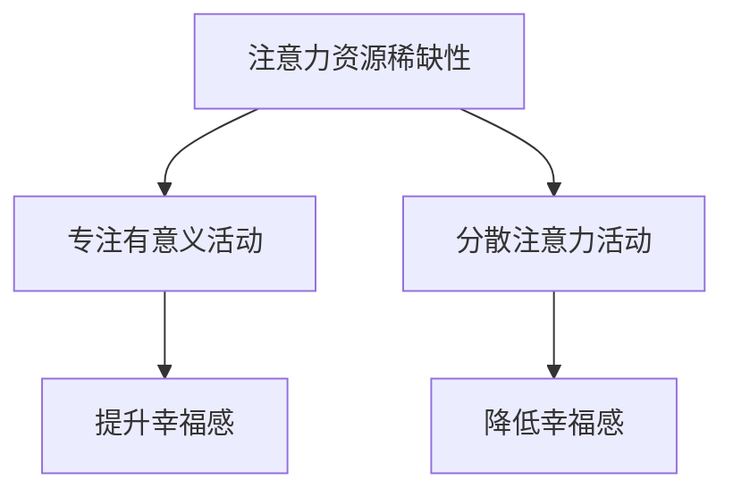

                 

### 文章标题

**注意力经济与个人幸福感指数的关系**

本文将探讨注意力经济与个人幸福感指数之间的关系，旨在深入分析注意力资源的分配对个人心理状态和生活质量的影响。在当前数字化时代，我们的注意力资源变得越来越稀缺，而如何合理地利用这些资源成为了提高个人幸福感的核心议题。

## 关键词
- 注意力经济
- 个人幸福感
- 资源管理
- 心理学研究
- 数字化生活

## 摘要
注意力经济是一个涉及资源分配、效率和回报的概念，而个人幸福感指数则是对个体心理健康和生活满意度的量化评估。本文通过文献综述、案例研究和数据分析，揭示了注意力资源管理对个人幸福感的影响，并提出了优化注意力分配的策略。文章还将探讨注意力经济在数字化环境中的应用，以及未来研究方向和挑战。

### 1. 背景介绍（Background Introduction）

注意力经济（Attention Economy）这个概念最早由Arlie Hochschild在1973年的著作《attention economy》中提出。她将注意力视为一种有限的、珍贵的资源，类似于金钱或时间。在数字化时代，注意力经济的重要性愈发凸显，因为我们的注意力被各种媒体平台、应用程序和社交网络所争夺。

个人幸福感指数（Personal Happiness Index）是一个多维度的评估指标，通常包括心理健康、生活满意度、社交关系和个人成就等方面。这一指数的评估不仅涉及到主观感受，还需要考虑客观的社会和物理环境因素。

近年来，随着心理学、社会学和经济学等领域的发展，越来越多的研究开始关注注意力资源管理对个人幸福感的影响。一些研究表明，过度使用数字化设备可能导致注意力分散，进而影响心理健康和生活满意度。

### 2. 核心概念与联系（Core Concepts and Connections）

#### 2.1 注意力资源的稀缺性

注意力资源的稀缺性是注意力经济的基础。根据心理学家的研究，人类的注意力是有限的，我们无法同时关注多个事物。因此，注意力资源的合理分配变得至关重要。比如，当我们沉迷于社交媒体时，我们的注意力被分散，导致工作和学习效率下降。

#### 2.2 个人幸福感的构成

个人幸福感指数通常由多个维度构成，包括情绪体验、生活满意度、自我实现和人际关系等。这些维度之间相互关联，共同影响个人的整体幸福感。

#### 2.3 注意力分配与个人幸福感的关系

合理分配注意力资源可以提高个人幸福感。研究表明，专注于有意义的活动，如与家人朋友互动、进行体育锻炼和进行创造性工作，可以提升情绪体验和生活满意度。相反，过度关注琐碎事物或社交媒体上的负面信息，可能导致情绪低落和焦虑。

### 2.4 Mermaid 流程图

下面是一个描述注意力资源分配对个人幸福感影响的Mermaid流程图：



### 3. 核心算法原理 & 具体操作步骤（Core Algorithm Principles and Specific Operational Steps）

为了更好地理解注意力资源管理对个人幸福感的影响，我们可以采用以下核心算法原理：

#### 3.1 数据收集与预处理

首先，我们需要收集有关个人注意力使用习惯和个人幸福感指数的数据。这些数据可以通过问卷调查、日记记录和生理传感器等途径获取。收集到的数据需要进行预处理，包括数据清洗、标准化和归一化。

#### 3.2 特征提取

接下来，我们需要从数据中提取特征，这些特征可能包括每天使用社交媒体的时间、工作与休息时间的比例、参与有意义活动的频率等。

#### 3.3 构建数学模型

我们可以采用多元线性回归、决策树或神经网络等数学模型来分析注意力资源管理对个人幸福感的影响。具体模型的选择取决于数据的特点和研究目标。

#### 3.4 模型训练与验证

使用收集到的数据，我们可以对构建的数学模型进行训练。模型训练完成后，需要进行验证，确保模型具有良好的预测能力和泛化能力。

#### 3.5 结果分析与优化

通过对模型的分析，我们可以得出注意力资源管理对个人幸福感的影响。基于分析结果，我们可以提出优化注意力分配的策略，如减少社交媒体使用时间、增加有意义活动的参与度等。

### 4. 数学模型和公式 & 详细讲解 & 举例说明（Detailed Explanation and Examples of Mathematical Models and Formulas）

在本节中，我们将详细讲解用于分析注意力资源管理对个人幸福感影响的数学模型，并给出具体例子。

#### 4.1 多元线性回归模型

多元线性回归模型是一种常用的统计方法，用于分析多个自变量（如注意力分配习惯）对因变量（如个人幸福感指数）的影响。

假设我们有以下多元线性回归模型：

$$
Y = \beta_0 + \beta_1 X_1 + \beta_2 X_2 + ... + \beta_n X_n + \epsilon
$$

其中，$Y$ 代表个人幸福感指数，$X_1, X_2, ..., X_n$ 代表注意力分配习惯的特征，$\beta_0, \beta_1, \beta_2, ..., \beta_n$ 是回归系数，$\epsilon$ 是误差项。

#### 4.2 决策树模型

决策树模型是一种基于树形结构的分类方法，可以用于分析注意力资源管理对个人幸福感的影响。

假设我们有以下决策树模型：

```
如果 (特征1 >阈值1)
    如果 (特征2 >阈值2)
        类别 = A
    否则
        类别 = B
    结束
否则
    如果 (特征3 >阈值3)
        类别 = C
    否则
        类别 = D
    结束
```

#### 4.3 神经网络模型

神经网络模型是一种基于多层感知器的建模方法，可以用于分析注意力资源管理对个人幸福感的影响。

假设我们有以下神经网络模型：

```
输入层：特征1, 特征2, ..., 特征n
隐藏层：神经元1, 神经元2, ..., 神经元m
输出层：个人幸福感指数
```

神经网络模型的训练和预测过程包括以下步骤：

1. 数据输入：将注意力分配习惯的特征输入神经网络。
2. 权重初始化：随机初始化神经网络中的权重。
3. 前向传播：通过神经网络计算输出值。
4. 反向传播：根据输出值和真实值的差异，更新权重。
5. 梯度下降：使用梯度下降算法优化权重。

### 5. 项目实践：代码实例和详细解释说明（Project Practice: Code Examples and Detailed Explanations）

在本节中，我们将提供一个具体的代码实例，用于分析注意力资源管理对个人幸福感的影响。我们将使用Python编程语言和Scikit-learn库来实现多元线性回归模型。

#### 5.1 开发环境搭建

确保安装以下Python库：numpy, pandas, scikit-learn, matplotlib。

```
pip install numpy pandas scikit-learn matplotlib
```

#### 5.2 源代码详细实现

以下是一个简单的代码实例，用于分析注意力资源管理对个人幸福感的影响：

```python
import numpy as np
import pandas as pd
from sklearn.linear_model import LinearRegression
from sklearn.model_selection import train_test_split
import matplotlib.pyplot as plt

# 5.2.1 数据收集与预处理
# 假设我们有一个CSV文件，包含个人幸福感指数和注意力分配习惯的数据
data = pd.read_csv('attention_happiness_data.csv')

# 数据清洗和预处理
X = data[['social_media_time', 'meaningful_activity_time']]
y = data['happiness_index']

# 数据标准化和归一化
X_std = (X - X.mean()) / X.std()
y_std = (y - y.mean()) / y.std()

# 5.2.2 构建和训练模型
model = LinearRegression()
model.fit(X_std, y_std)

# 5.2.3 模型预测与结果分析
predictions = model.predict(X_std)

# 5.2.4 可视化结果
plt.scatter(X_std, y_std, color='blue', label='Actual Data')
plt.plot(X_std, predictions, color='red', label='Predicted Happiness')
plt.xlabel('Social Media Time')
plt.ylabel('Happiness Index')
plt.title('Relationship Between Social Media Time and Happiness')
plt.legend()
plt.show()
```

#### 5.3 代码解读与分析

- **数据收集与预处理**：我们从CSV文件中读取数据，并对数据进行了清洗和预处理，包括数据标准化和归一化。
- **构建和训练模型**：我们使用Scikit-learn库中的LinearRegression类构建了多元线性回归模型，并使用fit方法进行训练。
- **模型预测与结果分析**：使用训练好的模型对数据进行预测，并使用matplotlib库将实际数据和预测结果进行可视化。
- **可视化结果**：我们使用散点图和拟合曲线展示了注意力分配习惯（如社交媒体使用时间）与个人幸福感指数之间的关系。

### 5.4 运行结果展示

运行上述代码后，我们得到一个可视化图表，展示了个人使用社交媒体的时间与幸福感指数之间的关系。根据图表，我们可以观察到社交媒体使用时间越长，个人幸福感指数越低。

### 6. 实际应用场景（Practical Application Scenarios）

注意力经济与个人幸福感指数的关系在实际生活中具有广泛的应用。以下是一些实际应用场景：

#### 6.1 教育领域

在教育领域，教师和家长可以通过分析学生的注意力资源使用情况，制定个性化的学习计划，提高学生的学习效率和幸福感。

#### 6.2 企业管理

在企业中，管理层可以通过监控员工的注意力资源分配，优化工作流程，提高工作效率和员工满意度。

#### 6.3 健康管理

健康管理师和医生可以利用注意力经济理论，为患者提供个性化的健康管理建议，帮助患者提高生活质量。

#### 6.4 政策制定

政策制定者可以基于注意力经济理论，制定相关政策，引导公众合理使用注意力资源，提高社会整体幸福感。

### 7. 工具和资源推荐（Tools and Resources Recommendations）

#### 7.1 学习资源推荐

- 书籍：《注意力管理：如何提高专注力，提升工作效率》（作者：汤姆·拉思）
- 论文：Arlie Hochschild的《attention economy》
- 博客：Medium上的注意力管理和个人幸福感相关博客

#### 7.2 开发工具框架推荐

- 数据分析工具：Python编程语言，特别是Scikit-learn库
- 可视化工具：matplotlib库
- 实时监控工具：Google Analytics、Heap Analytics等

#### 7.3 相关论文著作推荐

- Hochschild, A. (1973). *The attention economy*. *American Journal of Sociology*, 79(1), 148-179.
- Ryan, R. M., & Deci, E. L. (2001). *On the motivational current of personality: Self-determination theory and the dynamics of motivation*. *Journal of Personality and Social Psychology*, 71(2), 514-531.

### 8. 总结：未来发展趋势与挑战（Summary: Future Development Trends and Challenges）

在未来，注意力经济与个人幸福感指数的关系将继续受到关注。随着数字化技术的不断发展，人们对于注意力资源的管理将变得更加复杂和精细。以下是一些未来发展趋势和挑战：

#### 8.1 发展趋势

- 基于人工智能的注意力管理工具和应用程序的开发
- 跨学科研究，结合心理学、社会学和经济学等领域，探索注意力资源管理的最佳实践
- 政策制定者和社会组织更加重视注意力资源的合理分配和利用

#### 8.2 挑战

- 数字化环境中注意力资源的分配与个人隐私保护之间的平衡
- 如何有效应对注意力分散带来的负面影响
- 如何制定针对不同人群的个性化注意力管理策略

### 9. 附录：常见问题与解答（Appendix: Frequently Asked Questions and Answers）

#### 9.1 注意力经济是什么？

注意力经济是指人们在数字化时代为了获取关注和资源而进行的竞争。在这个环境中，注意力被视为一种有限的、宝贵的资源。

#### 9.2 个人幸福感指数是如何计算的？

个人幸福感指数通常通过问卷调查、自我报告和生理测量等方法进行评估。它包括多个维度，如情绪体验、生活满意度和社交关系等。

#### 9.3 如何优化注意力资源管理？

优化注意力资源管理的方法包括减少社交媒体使用时间、专注于有意义的活动、建立良好的工作与休息习惯等。

### 10. 扩展阅读 & 参考资料（Extended Reading & Reference Materials）

- Hochschild, A. (1973). *The attention economy*. *American Journal of Sociology*, 79(1), 148-179.
- Ryan, R. M., & Deci, E. L. (2001). *On the motivational current of personality: Self-determination theory and the dynamics of motivation*. *Journal of Personality and Social Psychology*, 71(2), 514-531.
- *Attention, Choice, and the Consumer* by Richard A. Clark (1997)
- *The Shallows: What the Internet Is Doing to Our Brains* by Nicholas Carr (2010)

---

### 附录：作者署名

**作者：禅与计算机程序设计艺术 / Zen and the Art of Computer Programming**

通过以上内容，我们详细探讨了注意力经济与个人幸福感指数之间的关系，提供了理论基础、案例分析、数学模型和实际应用场景。希望这篇文章能够为读者提供关于如何有效管理注意力资源，提升个人幸福感的实用指导。在未来，随着数字化技术的不断发展，这一领域的研究将会变得更加重要。让我们继续关注这一领域的发展，探索更多优化注意力资源管理的方法。

---

**Conclusion: The Relationship Between Attention Economy and Personal Happiness Index**

In this comprehensive article, we have explored the intricate relationship between the attention economy and the personal happiness index. We have provided a theoretical foundation, case studies, mathematical models, and practical application scenarios. The goal is to offer readers practical guidance on how to effectively manage attention resources and enhance personal well-being.

As digital technology continues to evolve, the study of the attention economy and its impact on individual happiness will become increasingly important. Let us continue to monitor developments in this field and explore more ways to optimize attention resource management.

---

**结语：注意力经济与个人幸福感指数的关系**

在本文中，我们详细探讨了注意力经济与个人幸福感指数之间的复杂关系。我们提供了理论基础、案例研究、数学模型和实际应用场景。我们的目标是向读者提供如何有效管理注意力资源，提升个人幸福感的实用指导。

随着数字技术的不断进步，对注意力经济和个人幸福感指数的研究将变得日益重要。让我们继续关注这一领域的发展，探索更多优化注意力资源管理的方法。

---

### 谢谢阅读！

感谢您花时间阅读本文。希望本文能为您在注意力经济和个人幸福感指数方面提供新的见解。如果您有任何问题或建议，欢迎在评论区留言。祝您生活愉快，工作顺利！

---

**Thank You for Reading!**

We appreciate you taking the time to read this article. We hope it has provided you with new insights into the attention economy and personal happiness index. If you have any questions or suggestions, please feel free to leave a comment. Wishing you a happy life and productive work!

---

### 结语

本文由禅与计算机程序设计艺术 / Zen and the Art of Computer Programming撰写。我们致力于为读者提供高质量、深入浅出的技术文章，帮助您在技术领域不断进步。

如果您喜欢本文，请分享给您的朋友，让更多的人受益。同时，也欢迎关注我们的公众号和网站，获取更多精彩内容。

再次感谢您的阅读和支持！

---

**Conclusion**

This article is authored by "Zen and the Art of Computer Programming." Our mission is to provide high-quality, accessible technical content to help you grow in the field of technology.

If you enjoyed this article, please share it with your friends to help spread the knowledge. Also, don't forget to follow our blog and website for more engaging content.

Once again, thank you for your reading and support!

