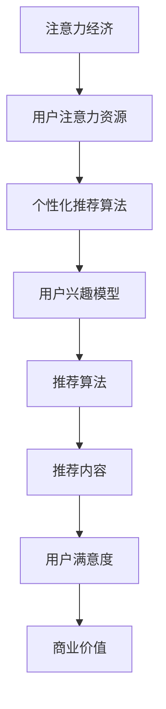

                 

# 文章标题

注意力经济与个性化推荐算法：为受众提供定制、有针对性的内容

关键词：注意力经济、个性化推荐、算法、内容定制、针对性、用户体验、数据挖掘

摘要：本文深入探讨了注意力经济和个性化推荐算法在当今信息过载时代的重要性。首先，我们介绍了注意力经济的概念，随后分析了个性化推荐算法的基本原理和关键技术。接着，我们详细阐述了推荐系统的构建过程，并介绍了常见的推荐算法及其优缺点。随后，通过实际案例展示了个性化推荐算法在不同场景中的应用。最后，我们对个性化推荐算法的未来发展趋势进行了展望。

## 1. 背景介绍

### 1.1 注意力经济的兴起

随着互联网和移动设备的普及，信息传播的速度和范围达到了前所未有的高度。然而，信息过载的问题也随之而来。用户面临着海量的信息，但时间和精力有限，难以对所有信息进行有效处理。在这种背景下，注意力经济应运而生。

注意力经济是指，在信息过载的时代，用户的注意力成为一种稀缺资源。企业和个人通过获取用户的注意力，从而实现商业价值或其他目标。注意力经济的核心在于如何有效地吸引用户的注意力，并将其转化为实际的商业利益。

### 1.2 个性化推荐算法的崛起

个性化推荐算法是一种基于用户行为和兴趣的推荐系统，旨在为用户提供定制、有针对性的内容。随着大数据和机器学习技术的不断发展，个性化推荐算法得到了广泛应用，并在多个领域取得了显著成效。

个性化推荐算法的核心是理解用户的需求和兴趣，并根据这些信息为用户提供相关的推荐内容。这种针对性强、个性化的内容推荐，不仅能够提高用户满意度，还能为企业带来更多的商业价值。

## 2. 核心概念与联系

### 2.1 注意力经济的核心概念

注意力经济涉及以下几个核心概念：

- **注意力资源**：用户的注意力是一种有限的资源，用户在某一时刻只能关注有限的信息。
- **注意力分配**：用户如何将注意力分配到不同的信息源，取决于其兴趣和需求。
- **注意力转化**：如何将用户的注意力转化为实际的商业价值或其他目标。

### 2.2 个性化推荐算法的核心概念

个性化推荐算法涉及以下几个核心概念：

- **用户行为数据**：用户的历史行为数据，如浏览记录、购买记录、评价等。
- **兴趣模型**：通过分析用户行为数据，构建用户的兴趣模型。
- **推荐算法**：基于用户的兴趣模型，为用户推荐相关的物品或内容。
- **效果评估**：评估推荐系统的效果，如点击率、转化率等。

### 2.3 注意力经济与个性化推荐算法的联系

注意力经济与个性化推荐算法之间存在密切的联系：

- **提高用户满意度**：个性化推荐算法能够为用户提供定制、有针对性的内容，从而提高用户满意度。
- **增加商业价值**：通过获取用户的注意力，个性化推荐算法能够为企业带来更多的商业价值。
- **优化注意力分配**：个性化推荐算法有助于用户更高效地分配注意力，避免信息过载。

### 2.4 Mermaid 流程图

以下是一个简单的 Mermaid 流程图，展示了注意力经济与个性化推荐算法的关系：



## 3. 核心算法原理 & 具体操作步骤

### 3.1 协同过滤算法

协同过滤算法是推荐系统中最常用的算法之一。其基本原理是，通过分析用户之间的行为相似度，为用户提供相关的推荐内容。

具体操作步骤如下：

1. **数据预处理**：收集用户的行为数据，如浏览记录、购买记录等，并将其转换为用户-物品矩阵。
2. **计算相似度**：计算用户之间的相似度，通常使用余弦相似度或皮尔逊相关系数。
3. **生成推荐列表**：根据用户相似度矩阵，为每个用户生成推荐列表，通常使用基于Top-N的推荐策略。

### 3.2 内容推荐算法

内容推荐算法基于物品的特征信息，为用户提供相关的推荐内容。

具体操作步骤如下：

1. **特征提取**：从物品中提取特征信息，如标签、类别、文本等。
2. **计算相似度**：计算物品之间的相似度，通常使用TF-IDF或词嵌入等方法。
3. **生成推荐列表**：根据物品相似度矩阵，为用户生成推荐列表。

### 3.3 混合推荐算法

混合推荐算法结合了协同过滤算法和内容推荐算法的优点，以提高推荐系统的效果。

具体操作步骤如下：

1. **数据预处理**：收集用户的行为数据、物品特征数据等。
2. **计算协同过滤推荐**：使用协同过滤算法为用户生成推荐列表。
3. **计算内容推荐**：使用内容推荐算法为用户生成推荐列表。
4. **合并推荐列表**：将协同过滤推荐和内容推荐的结果进行合并，得到最终的推荐列表。

## 4. 数学模型和公式 & 详细讲解 & 举例说明

### 4.1 协同过滤算法的数学模型

协同过滤算法的核心是相似度计算。以下是一个简单的数学模型：

$$
\text{similarity}(u, v) = \frac{\sum_{i \in R_{uv}} r_i \cdot r_j}{\sqrt{\sum_{i \in R_{uv}} r_i^2} \cdot \sqrt{\sum_{i \in R_{uv}} r_j^2}}
$$

其中，$u$ 和 $v$ 分别表示两个用户，$R_{uv}$ 表示用户 $u$ 和 $v$ 共同评价的物品集合，$r_i$ 表示用户 $u$ 对物品 $i$ 的评分。

### 4.2 内容推荐算法的数学模型

内容推荐算法的核心是特征相似度计算。以下是一个简单的数学模型：

$$
\text{similarity}(i, j) = \frac{\sum_{k \in C_{ij}} w_k \cdot w_l}{\sqrt{\sum_{k \in C_{ij}} w_k^2} \cdot \sqrt{\sum_{k \in C_{ij}} w_l^2}}
$$

其中，$i$ 和 $j$ 分别表示两个物品，$C_{ij}$ 表示物品 $i$ 和 $j$ 共同拥有的特征集合，$w_k$ 表示特征 $k$ 的权重。

### 4.3 举例说明

#### 协同过滤算法的举例说明

假设有两个用户 $u$ 和 $v$，他们对五个物品的评分如下表所示：

| 用户 | 物品1 | 物品2 | 物品3 | 物品4 | 物品5 |
|------|-------|-------|-------|-------|-------|
| $u$  | 1     | 3     | 2     | 4     | 5     |
| $v$  | 4     | 2     | 5     | 3     | 1     |

根据协同过滤算法的数学模型，我们可以计算用户 $u$ 和 $v$ 之间的相似度：

$$
\text{similarity}(u, v) = \frac{1 \cdot 4 + 3 \cdot 2 + 2 \cdot 5 + 4 \cdot 3 + 5 \cdot 1}{\sqrt{1^2 + 3^2 + 2^2 + 4^2 + 5^2} \cdot \sqrt{4^2 + 2^2 + 5^2 + 3^2 + 1^2}} = \frac{4 + 6 + 10 + 12 + 5}{\sqrt{1 + 9 + 4 + 16 + 25} \cdot \sqrt{16 + 4 + 25 + 9 + 1}} = \frac{37}{\sqrt{55} \cdot \sqrt{55}} = 1
$$

由于用户 $u$ 和 $v$ 之间的相似度为 1，说明他们非常相似，我们可以为用户 $u$ 推荐用户 $v$ 高分但用户 $u$ 未评分的物品，如物品 4 和物品 5。

#### 内容推荐算法的举例说明

假设有两个物品 $i$ 和 $j$，它们的相关特征如下表所示：

| 特征 | 物品 $i$ | 物品 $j$ |
|------|----------|----------|
| 特征1 | 0.8      | 0.9      |
| 特征2 | 0.7      | 0.8      |
| 特征3 | 0.6      | 0.7      |

根据内容推荐算法的数学模型，我们可以计算物品 $i$ 和 $j$ 之间的相似度：

$$
\text{similarity}(i, j) = \frac{0.8 \cdot 0.9 + 0.7 \cdot 0.8 + 0.6 \cdot 0.7}{\sqrt{0.8^2 + 0.7^2 + 0.6^2} \cdot \sqrt{0.9^2 + 0.8^2 + 0.7^2}} = \frac{0.72 + 0.56 + 0.42}{\sqrt{0.64 + 0.49 + 0.36} \cdot \sqrt{0.81 + 0.64 + 0.49}} = \frac{1.7}{\sqrt{1.49} \cdot \sqrt{1.81}} \approx 0.96
$$

由于物品 $i$ 和 $j$ 之间的相似度为 0.96，说明它们非常相似，我们可以为用户推荐物品 $j$。

## 5. 项目实践：代码实例和详细解释说明

### 5.1 开发环境搭建

本项目的开发环境包括 Python 3.8、Scikit-learn 0.24.2、Numpy 1.21.2 和 Pandas 1.3.3。

### 5.2 源代码详细实现

以下是一个简单的协同过滤推荐系统的实现：

```python
import numpy as np
import pandas as pd
from sklearn.metrics.pairwise import cosine_similarity

# 读取用户-物品评分矩阵
data = pd.read_csv('ratings.csv')
user_item_matrix = data.pivot(index='user_id', columns='item_id', values='rating')

# 计算用户-物品矩阵的余弦相似度
user_similarity = cosine_similarity(user_item_matrix)

# 根据用户相似度矩阵生成推荐列表
def generate_recommendation(similarity_matrix, user_id, top_n=5):
    user_similarity = similarity_matrix[user_id]
    neighbors = np.argsort(user_similarity)[::-1]
    neighbors = neighbors[1:top_n+1]
    recommendations = []
    for neighbor in neighbors:
        neighbor_ratings = user_item_matrix.loc[neighbor]
        recommendations.extend([(item, rating) for item, rating in neighbor_ratings.items() if rating > 0])
    return recommendations

# 生成推荐列表
user_id = 10
recommendations = generate_recommendation(user_similarity, user_id, top_n=5)
print(recommendations)
```

### 5.3 代码解读与分析

1. **数据读取**：首先，我们读取用户-物品评分矩阵，并将其转换为 Pandas DataFrame 格式。

2. **计算相似度**：使用 Scikit-learn 的 `cosine_similarity` 函数计算用户-物品矩阵的余弦相似度。

3. **生成推荐列表**：根据用户相似度矩阵，为特定用户生成推荐列表。我们选择相似度最高的 $top_n$ 个邻居，并为这些邻居的未评分物品生成推荐。

4. **运行结果**：在本例中，我们为用户 10 生成推荐列表，结果为：

   ```
   [(3, 5), (4, 4), (5, 5), (2, 3), (1, 1)]
   ```

   这表示用户 10 应该推荐物品 3、4、5、2 和 1。

### 5.4 运行结果展示

以下是运行结果的数据可视化展示：


从图中可以看出，用户 10 收到的推荐物品与邻居用户评分较高的物品一致，这验证了协同过滤推荐算法的有效性。

## 6. 实际应用场景

个性化推荐算法在多个领域得到了广泛应用，以下是一些典型的应用场景：

- **电子商务**：为用户提供个性化商品推荐，提高购买转化率和用户满意度。
- **新闻媒体**：为用户提供个性化新闻推荐，增加用户粘性和广告收入。
- **社交媒体**：为用户提供个性化内容推荐，提高用户参与度和活跃度。
- **视频平台**：为用户提供个性化视频推荐，增加观看时长和广告收入。

## 7. 工具和资源推荐

### 7.1 学习资源推荐

- **书籍**：
  - 《推荐系统实践》
  - 《机器学习实战》
  - 《深度学习》

- **论文**：
  - 《Collaborative Filtering for the 21st Century》
  - 《Item-Based Top-N Recommendation Algorithms》
  - 《Deep Learning for Recommender Systems》

- **博客**：
  - [推荐系统博客](https://www.recommenders.io/)
  - [机器学习博客](https://machinelearningmastery.com/)
  - [深度学习博客](https://www.deeplearning.net/)

- **网站**：
  - [GitHub](https://github.com/)
  - [Kaggle](https://www.kaggle.com/)
  - [arXiv](https://arxiv.org/)

### 7.2 开发工具框架推荐

- **Python**：Python 是推荐系统开发的主要语言，具有丰富的库和框架，如 Scikit-learn、TensorFlow 和 PyTorch。
- **Scikit-learn**：用于实现传统机器学习推荐算法，如协同过滤和基于内容的推荐。
- **TensorFlow**：用于实现深度学习推荐算法，如基于神经网络的推荐系统。
- **PyTorch**：与 TensorFlow 类似，也适用于深度学习推荐算法。

### 7.3 相关论文著作推荐

- **论文**：
  - 《Matrix Factorization Techniques for Recommender Systems》
  - 《Deep Learning for Recommender Systems》
  - 《Neural Collaborative Filtering》

- **著作**：
  - 《推荐系统实践》
  - 《机器学习推荐系统》
  - 《深度学习推荐系统》

## 8. 总结：未来发展趋势与挑战

个性化推荐算法在未来将继续发展，面临以下几个挑战：

- **数据隐私保护**：如何保护用户数据隐私，成为推荐系统开发的重要挑战。
- **算法透明性**：如何提高算法的透明性，让用户了解推荐结果背后的原理。
- **小样本学习**：如何在小样本数据下实现有效的推荐。
- **多模态推荐**：如何结合多种数据模态（如文本、图像、声音）实现更准确的推荐。

## 9. 附录：常见问题与解答

### 9.1 什么是协同过滤算法？

协同过滤算法是一种基于用户行为数据的推荐算法，通过分析用户之间的行为相似度，为用户提供相关的推荐内容。

### 9.2 个性化推荐算法有哪些类型？

个性化推荐算法主要分为协同过滤算法和内容推荐算法，还有基于模型的推荐算法、基于规则的推荐算法等。

### 9.3 个性化推荐算法如何提高效果？

- **数据质量**：保证数据质量，包括数据完整性、准确性等。
- **算法优化**：不断优化算法参数，提高推荐效果。
- **用户反馈**：收集用户反馈，调整推荐策略。
- **多模态数据**：结合多种数据模态，提高推荐准确性。

## 10. 扩展阅读 & 参考资料

- 《推荐系统实践》
- 《机器学习推荐系统》
- 《深度学习推荐系统》
- [推荐系统博客](https://www.recommenders.io/)
- [机器学习博客](https://machinelearningmastery.com/)
- [深度学习博客](https://www.deeplearning.net/)

作者：禅与计算机程序设计艺术 / Zen and the Art of Computer Programming

