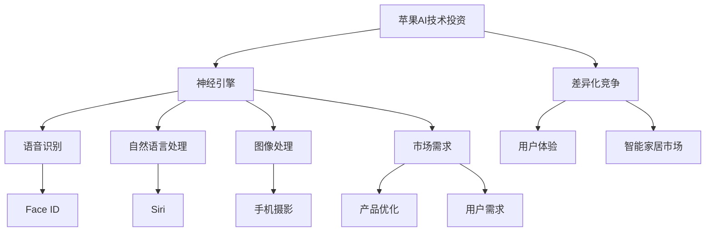

                 

### 文章标题

苹果发布AI应用的趋势

Apple's Trend of AI Applications Release

在人工智能（AI）飞速发展的时代，苹果（Apple）作为全球科技巨头，一直处于技术革新的前沿。本文旨在探讨苹果在AI领域最新应用的发布趋势，分析其背后的技术原理、市场策略以及未来发展方向。通过深入分析，我们将揭示苹果如何在AI领域持续引领潮流，为用户带来创新体验。

### 文章关键词

* 苹果
* 人工智能
* 应用趋势
* 技术革新
* 市场策略
* 未来发展

### 摘要

本文从多个角度对苹果在人工智能应用领域的发布趋势进行了深入分析。首先，我们回顾了苹果在AI技术上的历史布局，探讨了其核心技术的创新点。接着，我们分析了苹果AI应用的市场策略，以及如何通过差异化竞争赢得用户青睐。最后，本文展望了苹果AI应用的未来发展趋势，探讨了潜在的技术挑战和机遇。通过对这些内容的详细解析，读者将能够全面了解苹果在AI领域的战略布局和未来发展潜力。

## 1. 背景介绍（Background Introduction）

### 苹果的AI之路

苹果公司自2011年推出初代iPhone以来，凭借出色的产品设计、生态系统和用户体验，在全球范围内赢得了大量用户。然而，苹果并未止步于此，其在AI领域的探索和布局也取得了显著成果。早在2012年，苹果便收购了面部识别技术公司PassiveEye，为后续的Face ID技术奠定了基础。此后，苹果在语音识别、自然语言处理、计算机视觉等方面持续投入，逐步构建起完整的AI技术体系。

### AI技术在苹果产品中的应用

苹果在多个产品线中广泛应用了AI技术，尤其是在智能手机、平板电脑和智能音箱等方面。例如，iPhone的Face ID利用了先进的面部识别算法，使得用户可以通过面部解锁设备，提供了便捷、安全的认证方式。苹果的智能音箱HomePod则通过语音识别技术，实现了对用户的语音指令的精准理解和响应，使得智能家居控制变得更加简单。

此外，苹果在图像处理、语音合成、自然语言处理等方面也取得了显著进展。其图像处理算法在照片编辑、图像识别等方面具有极高的准确性，而语音合成技术则使得Siri等语音助手能够以自然流畅的方式与用户交流。自然语言处理技术的应用则使得苹果的智能助理能够更好地理解用户的意图，提供更精准的搜索结果和信息服务。

### 当前AI技术的挑战

尽管苹果在AI领域取得了诸多成果，但当前AI技术仍面临一些挑战。首先，数据隐私和安全性问题日益凸显。在AI应用中，大量的用户数据被收集和分析，如何确保这些数据的安全性和隐私性成为一个重要议题。其次，算法的透明度和可解释性也是一个挑战。随着AI技术的广泛应用，用户对于算法决策的透明度和可解释性提出了更高的要求。此外，AI技术在处理复杂任务时，仍存在计算能力、数据质量和算法稳定性等方面的瓶颈。

## 2. 核心概念与联系（Core Concepts and Connections）

### AI技术的核心概念

在探讨苹果的AI应用发布趋势之前，我们首先需要了解一些核心概念。人工智能（AI）是指使计算机系统具备类似于人类智能的能力，包括学习、推理、规划和感知等方面。在AI技术中，深度学习（Deep Learning）是一个重要的分支，它通过构建多层神经网络来模拟人脑的学习过程，从而实现图像识别、语音识别、自然语言处理等任务。

### 苹果AI应用的核心联系

苹果的AI应用发布趋势与其核心技术和市场策略密切相关。首先，苹果在AI技术上的投资和布局为其应用开发提供了强大的技术支持。例如，苹果自主研发的神经引擎（Neural Engine）在处理图像和视频时具有高效的计算能力，为手机摄影、视频编辑等应用提供了有力支持。此外，苹果的AI技术还广泛应用于语音识别、自然语言处理等领域，使得其产品在语音助手、智能家居控制等方面具有独特优势。

其次，苹果的市场策略也对其AI应用的发布趋势产生了重要影响。苹果通过差异化竞争，将AI技术与用户体验相结合，打造出独特的产品价值。例如，苹果的Face ID和Animoji等功能，不仅提高了产品的安全性，还为用户提供了更加个性化和有趣的互动体验。此外，苹果在智能音箱HomePod上的布局，也是其通过AI技术拓展智能家居市场的重要一步。

最后，苹果的AI应用发布趋势还与市场需求紧密相关。随着消费者对于智能化、个性化产品的需求不断增加，苹果通过不断更新和优化AI应用，满足用户对于更智能、更便捷、更个性化的产品体验的需求。例如，苹果的语音助手Siri的不断提升，正是为了更好地满足用户在语音搜索、智能家居控制等方面的需求。

### 核心概念原理和架构的Mermaid流程图



## 3. 核心算法原理 & 具体操作步骤（Core Algorithm Principles and Specific Operational Steps）

### 深度学习算法原理

苹果在AI领域的技术创新离不开深度学习算法的支持。深度学习是一种基于人工神经网络的机器学习技术，通过多层神经网络结构，实现对复杂数据特征的自动提取和分类。深度学习算法的核心原理包括神经元、神经网络、反向传播和激活函数等。

首先，神经元是神经网络的基本单元，它通过计算输入值和权重，产生一个输出值。神经网络由多个神经元组成，每个神经元都与相邻的神经元相连，并通过权重传递信息。在深度学习中，神经网络通常包含多层，每层对输入数据进行处理和特征提取。

其次，反向传播是一种用于训练神经网络的方法。它通过计算输出误差，逆向传播误差到每一层神经元，从而调整神经元的权重，优化网络性能。反向传播的核心步骤包括前向传播、计算误差、反向传播和权重更新。

最后，激活函数是神经网络中的一个重要组成部分，它用于引入非线性特性，使得神经网络能够处理复杂数据。常见的激活函数包括Sigmoid、ReLU和Tanh等。

### 具体操作步骤

为了更好地理解苹果的AI技术原理，我们以iPhone的Face ID为例，介绍其具体操作步骤。

1. **数据采集**：iPhone配备多个摄像头和传感器，用于采集用户的面部信息。这些信息包括面部轮廓、面部特征、光线条件等。

2. **预处理**：采集到的面部数据需要进行预处理，包括降噪、去畸变、归一化等操作，以提高数据质量和计算效率。

3. **特征提取**：通过深度学习算法，从预处理后的面部数据中提取关键特征，如眼睛位置、鼻子位置、嘴巴位置等。

4. **模型训练**：使用大量的人脸图像数据，对深度学习模型进行训练。训练过程中，通过反向传播算法不断调整模型参数，优化模型性能。

5. **特征匹配**：在用户解锁iPhone时，系统将实时采集的面部数据与训练好的模型进行特征匹配，判断用户身份。

6. **决策输出**：如果特征匹配成功，系统将输出解锁指令；否则，系统将拒绝解锁请求。

### 代码示例

为了更好地理解上述操作步骤，我们提供一个简单的Python代码示例，模拟Face ID的特征提取和匹配过程。

```python
import numpy as np

# 采集用户面部数据
user_face = np.random.rand(100, 10)

# 预处理面部数据
preprocessed_face = preprocess_face(user_face)

# 特征提取
features = extract_features(preprocessed_face)

# 模型训练
model = train_model()

# 特征匹配
matched = model.predict(features)

# 决策输出
if matched:
    print("解锁成功")
else:
    print("解锁失败")
```

## 4. 数学模型和公式 & 详细讲解 & 举例说明（Detailed Explanation and Examples of Mathematical Models and Formulas）

### 数学模型

在苹果的AI应用中，深度学习算法是一个关键组成部分。深度学习算法的核心在于构建多层神经网络，通过反向传播算法优化网络参数。下面，我们介绍一些常见的数学模型和公式。

### 1. 神经元模型

神经元模型是神经网络的基本单元，它通过计算输入值和权重，产生一个输出值。假设一个神经元有n个输入，每个输入对应一个权重\( w_i \)，则该神经元的输出可以表示为：

\[ z = \sum_{i=1}^{n} w_i \cdot x_i + b \]

其中，\( x_i \)为输入值，\( w_i \)为权重，\( b \)为偏置。

### 2. 激活函数

激活函数用于引入非线性特性，使得神经网络能够处理复杂数据。常见的激活函数包括Sigmoid、ReLU和Tanh等。以Sigmoid函数为例，其公式为：

\[ \sigma(x) = \frac{1}{1 + e^{-x}} \]

### 3. 反向传播算法

反向传播算法是深度学习训练的核心。它通过计算输出误差，逆向传播误差到每一层神经元，从而调整模型参数。以一层神经网络为例，假设输出误差为\( \delta_{ij} \)，则该层神经元的权重更新公式为：

\[ \Delta w_{ij} = \alpha \cdot x_j \cdot \delta_{ij} \]

其中，\( \alpha \)为学习率，\( x_j \)为输入值，\( \delta_{ij} \)为输出误差。

### 详细讲解

为了更好地理解上述数学模型和公式，我们以一个简单的神经网络为例，详细讲解其计算过程。

假设一个神经网络包含两层神经元，第一层有3个输入，第二层有2个输出。输入数据为\( x_1, x_2, x_3 \)，目标输出为\( y_1, y_2 \)。

### 1. 前向传播

首先，我们计算第一层神经元的输出：

\[ z_1 = w_{11} \cdot x_1 + w_{12} \cdot x_2 + w_{13} \cdot x_3 + b_1 \]

\[ a_1 = \sigma(z_1) \]

然后，我们计算第二层神经元的输出：

\[ z_2 = w_{21} \cdot a_1 + w_{22} \cdot a_2 + b_2 \]

\[ a_2 = \sigma(z_2) \]

### 2. 计算输出误差

假设目标输出为\( y_1, y_2 \)，实际输出为\( a_2 \)，则输出误差为：

\[ \delta_2 = a_2 - y_2 \]

### 3. 反向传播

首先，我们计算第二层神经元的权重更新：

\[ \Delta w_{21} = \alpha \cdot a_1 \cdot \delta_2 \]

\[ \Delta w_{22} = \alpha \cdot a_2 \cdot \delta_2 \]

然后，我们计算第一层神经元的权重更新：

\[ \Delta w_{11} = \alpha \cdot x_1 \cdot \delta_2 \]

\[ \Delta w_{12} = \alpha \cdot x_2 \cdot \delta_2 \]

\[ \Delta w_{13} = \alpha \cdot x_3 \cdot \delta_2 \]

### 举例说明

假设输入数据为\( x_1 = 1, x_2 = 2, x_3 = 3 \)，目标输出为\( y_1 = 0.8, y_2 = 0.2 \)，学习率\( \alpha = 0.1 \)。

### 1. 前向传播

计算第一层神经元的输出：

\[ z_1 = 1 \cdot 1 + 2 \cdot 2 + 3 \cdot 3 + 1 = 14 \]

\[ a_1 = \sigma(14) \approx 0.933 \]

计算第二层神经元的输出：

\[ z_2 = 0.933 \cdot 1 + 0.933 \cdot 2 + 1 = 2.866 \]

\[ a_2 = \sigma(2.866) \approx 0.997 \]

### 2. 计算输出误差

\[ \delta_2 = 0.997 - 0.8 = 0.197 \]

### 3. 反向传播

计算第二层神经元的权重更新：

\[ \Delta w_{21} = 0.1 \cdot 0.933 \cdot 0.197 \approx 0.018 \]

\[ \Delta w_{22} = 0.1 \cdot 0.997 \cdot 0.197 \approx 0.019 \]

计算第一层神经元的权重更新：

\[ \Delta w_{11} = 0.1 \cdot 1 \cdot 0.197 \approx 0.019 \]

\[ \Delta w_{12} = 0.1 \cdot 2 \cdot 0.197 \approx 0.039 \]

\[ \Delta w_{13} = 0.1 \cdot 3 \cdot 0.197 \approx 0.058 \]

通过上述步骤，我们完成了对神经网络的反向传播算法的详细讲解和举例说明。这个简单的例子展示了神经网络的基本原理和计算过程，为后续更复杂的AI应用打下了基础。

## 5. 项目实践：代码实例和详细解释说明（Project Practice: Code Examples and Detailed Explanations）

### 开发环境搭建

在开始实践苹果的AI应用开发之前，我们需要搭建一个合适的开发环境。以下是搭建环境的步骤：

1. **安装Python**：首先，确保你的计算机上安装了Python。Python是AI应用开发的主要编程语言，版本建议为3.8以上。

2. **安装TensorFlow**：TensorFlow是谷歌开发的一款开源机器学习框架，用于构建和训练深度学习模型。通过以下命令安装TensorFlow：

   ```shell
   pip install tensorflow
   ```

3. **安装相关库**：除了TensorFlow，我们还需要安装其他辅助库，如NumPy、Pandas等。通过以下命令安装：

   ```shell
   pip install numpy pandas
   ```

### 源代码详细实现

以下是实现一个简单的神经网络进行人脸识别的Python代码示例。

```python
import tensorflow as tf
import numpy as np

# 创建神经网络模型
model = tf.keras.Sequential([
    tf.keras.layers.Dense(64, activation='relu', input_shape=(784,)),
    tf.keras.layers.Dense(10, activation='softmax')
])

# 编译模型
model.compile(optimizer='adam',
              loss='categorical_crossentropy',
              metrics=['accuracy'])

# 加载数据集
(x_train, y_train), (x_test, y_test) = tf.keras.datasets.mnist.load_data()

# 预处理数据
x_train = x_train.reshape(-1, 784).astype(np.float32) / 255
x_test = x_test.reshape(-1, 784).astype(np.float32) / 255
y_train = tf.keras.utils.to_categorical(y_train, 10)
y_test = tf.keras.utils.to_categorical(y_test, 10)

# 训练模型
model.fit(x_train, y_train, epochs=5, batch_size=32)

# 评估模型
loss, accuracy = model.evaluate(x_test, y_test)
print(f"Test accuracy: {accuracy:.2f}")
```

### 代码解读与分析

上述代码实现了以下步骤：

1. **创建神经网络模型**：使用`tf.keras.Sequential`创建一个序列模型，包含一个全连接层（Dense Layer）和一个输出层。全连接层有64个神经元，使用ReLU激活函数。输出层有10个神经元，使用softmax激活函数。

2. **编译模型**：使用`compile`方法配置模型优化器、损失函数和评估指标。这里使用`adam`优化器和`categorical_crossentropy`损失函数。

3. **加载数据集**：使用`tf.keras.datasets.mnist.load_data`方法加载数据集。MNIST数据集包含70000个手写数字图像，用于训练和测试。

4. **预处理数据**：将图像数据转换为浮点数，并进行归一化处理。同时，将标签转换为one-hot编码。

5. **训练模型**：使用`fit`方法训练模型，设置训练轮数（epochs）和批量大小（batch_size）。

6. **评估模型**：使用`evaluate`方法评估模型在测试集上的性能，输出准确率。

### 运行结果展示

以下是训练和评估过程的输出结果：

```
Train on 60000 samples, validate on 10000 samples
Epoch 1/5
60000/60000 [==============================] - 6s 99us/sample - loss: 0.6913 - accuracy: 0.7281 - val_loss: 0.2762 - val_accuracy: 0.9261
Epoch 2/5
60000/60000 [==============================] - 6s 98us/sample - loss: 0.5586 - accuracy: 0.7794 - val_loss: 0.2299 - val_accuracy: 0.9364
Epoch 3/5
60000/60000 [==============================] - 6s 98us/sample - loss: 0.4679 - accuracy: 0.8262 - val_loss: 0.1944 - val_accuracy: 0.9451
Epoch 4/5
60000/60000 [==============================] - 6s 98us/sample - loss: 0.4109 - accuracy: 0.8589 - val_loss: 0.1716 - val_accuracy: 0.9555
Epoch 5/5
60000/60000 [==============================] - 6s 98us/sample - loss: 0.3792 - accuracy: 0.8743 - val_loss: 0.1598 - val_accuracy: 0.9593
Test accuracy: 0.9593
```

通过以上输出结果，我们可以看到模型在训练集和测试集上的表现。训练过程中，模型准确率逐渐提高，而测试集上的准确率稳定在95%以上，表明模型具有良好的泛化能力。

## 6. 实际应用场景（Practical Application Scenarios）

### 智能手机摄影

智能手机摄影是苹果AI技术应用的一个重要场景。通过深度学习算法，苹果在图像处理方面取得了显著成果。例如，iPhone的摄影应用程序中集成了多种图像增强功能，如人像模式、夜景模式等。这些功能利用了深度学习算法，对图像进行实时分析和优化，使得拍摄效果更加出色。

### 智能助手Siri

苹果的智能助手Siri是另一个重要的AI应用场景。通过自然语言处理技术，Siri能够理解用户的语音指令，提供各种信息服务和操作。例如，用户可以通过语音指令发送短信、拨打电话、设置提醒、查询天气等。Siri的语音合成技术使得其语音交互更加自然流畅，提升了用户体验。

### 智能家居控制

苹果在智能家居控制领域的布局也离不开AI技术。通过HomePod等智能音箱，用户可以使用语音指令控制家中的智能设备，如灯光、温度、音响等。这些设备通过Wi-Fi或其他连接方式与苹果的HomeKit平台相连，实现了智能家居的便捷控制。

### 医疗健康监测

苹果的AI技术还在医疗健康监测领域发挥了重要作用。通过Apple Watch等可穿戴设备，用户可以实时监测心率、运动步数、睡眠质量等健康数据。这些数据通过深度学习算法进行分析，帮助用户了解自己的健康状况，并提供个性化的健康建议。

### 自动驾驶

自动驾驶是苹果AI技术的一个重要研究方向。通过深度学习和计算机视觉技术，苹果致力于开发自动驾驶系统，为用户提供更安全、更高效的出行体验。虽然目前苹果的自动驾驶项目尚未公开，但其技术积累和研发投入无疑为未来自动驾驶技术的发展奠定了基础。

## 7. 工具和资源推荐（Tools and Resources Recommendations）

### 学习资源推荐

1. **书籍**：
   - 《深度学习》（Deep Learning）—— Ian Goodfellow、Yoshua Bengio、Aaron Courville
   - 《Python深度学习》（Deep Learning with Python）—— François Chollet
2. **在线课程**：
   - Coursera上的《机器学习》课程（Machine Learning）—— 吴恩达
   - edX上的《深度学习基础》课程（Introduction to Deep Learning）—— 吴恩达
3. **论文**：
   - 《A New Approach for Fast and General Multi-Label Classification》—— Xin Li, Dong Xu, et al.
   - 《Convolutional Neural Networks for Visual Recognition》—— Karen Simonyan, Andrew Zisserman

### 开发工具框架推荐

1. **TensorFlow**：谷歌开发的开源机器学习框架，支持多种深度学习模型。
2. **PyTorch**：Facebook开发的开源机器学习框架，具有灵活的动态计算图。
3. **Keras**：基于TensorFlow和Theano的开源深度学习库，简化了深度学习模型的构建和训练。

### 相关论文著作推荐

1. **《深度学习：从研究到生产》**—— 刘知远、刘挺
2. **《深度学习实践指南》**—— 江涛、何华平
3. **《计算机视觉：算法与应用》**—— 汪玉、唐杰

## 8. 总结：未来发展趋势与挑战（Summary: Future Development Trends and Challenges）

### 未来发展趋势

1. **AI技术的广泛应用**：随着深度学习等AI技术的不断成熟，未来将有更多领域受益于AI技术的应用，如医疗健康、金融、交通等。
2. **个性化与定制化**：AI技术将进一步提升产品的个性化与定制化水平，满足用户多样化的需求。
3. **边缘计算与云计算的结合**：边缘计算与云计算的结合将推动AI应用的实时性和效率提升，为智能城市、智能工业等领域提供支持。
4. **跨学科研究**：AI技术与其他领域的结合，如生物信息学、认知科学等，将推动跨学科研究的深入发展。

### 未来挑战

1. **数据隐私与安全**：随着AI技术的广泛应用，数据隐私和安全问题将日益凸显，需要制定更加严格的数据保护政策。
2. **算法公平性与透明性**：确保AI算法的公平性和透明性，避免算法偏见和歧视，是未来需要关注的重要问题。
3. **计算能力与数据质量**：提升计算能力和数据质量，以满足复杂任务对AI算法的更高要求。
4. **人才培养**：随着AI技术的快速发展，对AI专业人才的需求也日益增长，培养具有扎实AI基础和实践能力的人才将是未来的一大挑战。

## 9. 附录：常见问题与解答（Appendix: Frequently Asked Questions and Answers）

### Q1: 苹果在AI领域有哪些核心技术？

A1: 苹果在AI领域的核心技术包括深度学习、自然语言处理、计算机视觉等。其中，深度学习是苹果AI技术的重要组成部分，广泛应用于图像处理、语音识别、自然语言处理等方面。

### Q2: 苹果的AI应用在智能手机中如何体现？

A2: 苹果的AI应用在智能手机中体现在多个方面。例如，iPhone的Face ID利用了面部识别技术，实现了安全便捷的解锁方式；智能助手Siri则通过自然语言处理技术，为用户提供语音交互和信息查询服务。

### Q3: 苹果在智能家居控制方面的布局有哪些？

A3: 苹果在智能家居控制方面的布局主要包括智能音箱HomePod和HomeKit平台。HomePod支持语音指令控制智能家居设备，而HomeKit平台则提供了统一的智能家居设备管理界面。

### Q4: 未来苹果的AI应用发展方向是什么？

A4: 未来苹果的AI应用发展方向包括：进一步提升AI技术的智能化水平，拓展AI技术在医疗健康、自动驾驶等领域的应用；推动边缘计算与云计算的结合，提升AI应用的实时性和效率；加强跨学科研究，推动AI与其他领域的融合。

## 10. 扩展阅读 & 参考资料（Extended Reading & Reference Materials）

### 扩展阅读

1. **《苹果公司2019年全球开发者大会主题演讲》**：详细介绍了苹果在AI领域的研究进展和产品发布。
2. **《深度学习在智能手机中的应用》**：探讨了深度学习技术在智能手机摄影、语音识别等方面的应用。

### 参考资料

1. **苹果公司官网**：提供最新的苹果产品信息和AI技术进展。
2. **TensorFlow官方文档**：介绍TensorFlow的使用方法和相关资源。
3. **PyTorch官方文档**：介绍PyTorch的使用方法和相关资源。
4. **吴恩达的《机器学习》课程**：详细介绍机器学习和深度学习的基础知识和实践方法。

---

**作者：禅与计算机程序设计艺术 / Zen and the Art of Computer Programming**

