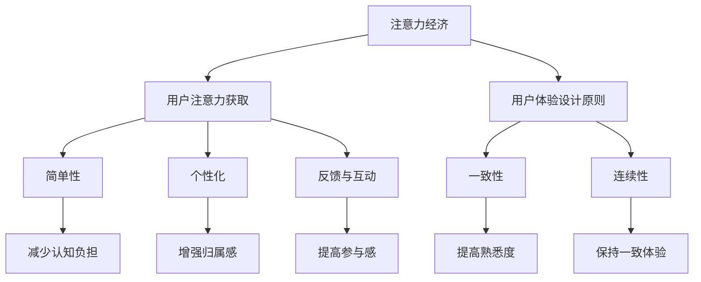

                 

### 文章标题

### Attention Economy and User Experience Design Principles and Practices: Crafting Immersive and Addictive Experiences

#### Keywords: Attention Economy, User Experience Design, Immersive Experiences, Addictive Experiences, UX Principles

#### Abstract:
This article delves into the concept of the attention economy and its profound impact on user experience (UX) design. We explore key principles and practices for creating immersive and addictive experiences that captivate and retain users. By understanding how attention is earned and maintained, designers can harness the power of the attention economy to drive engagement and foster long-term customer loyalty.

### Introduction to the Attention Economy

#### What is the Attention Economy?

The attention economy is a term coined to describe the value placed on an individual's focus and engagement in today's digital age. It is based on the idea that attention is a limited resource, and as such, it has become a commodity that can be traded and monetized. In the context of user experience design, the attention economy highlights the importance of capturing and holding a user's attention to drive engagement and conversion.

#### The Role of Attention in UX Design

Attention is the foundation of user experience design. It is the gateway through which users interact with products and services. Designing for the attention economy means understanding how to effectively capture, maintain, and leverage attention to create valuable experiences. This involves not only grabbing users' initial interest but also sustaining their engagement over time.

### Core Concepts and Connections

#### 3.1 The Importance of Attention

Attention is crucial because it determines how users perceive and interact with a product or service. A user's limited attention span means that design choices must be carefully crafted to be immediately engaging and intuitive. Effective attention management can lead to higher user satisfaction, increased retention rates, and ultimately, higher revenue.

#### 3.2 Attention and User Experience Design Principles

To create engaging user experiences, designers must adhere to several core principles:

##### 3.2.1 Focus on User Needs

Understanding user needs and preferences is paramount. By designing with the user in mind, designers can create experiences that are genuinely valuable and resonate with users.

##### 3.2.2 Simplicity and Clarity

Simplicity is key to capturing and maintaining attention. Complex interfaces and convoluted processes can overwhelm users and lead to cognitive load. Clear and intuitive designs reduce friction and enhance user engagement.

##### 3.2.3 Personalization and Relevance

Personalizing the user experience based on user data and behavior can significantly enhance engagement. Relevance builds trust and makes users feel understood and valued.

##### 3.2.4 Feedback and Interaction

Providing timely and meaningful feedback keeps users engaged and informed. Interaction design that fosters a sense of control and agency can enhance the overall user experience.

### Core Algorithm Principles and Specific Operational Steps

#### 4.1 Attention Capture Techniques

To capture attention, designers can employ various techniques:

##### 4.1.1 Visual Hierarchy

Using visual cues like color, contrast, and typography to create a clear visual hierarchy can draw users' eyes to the most important elements.

##### 4.1.2 Intriguing Content

Creating content that is compelling and intriguing can naturally capture users' attention. This can include engaging headlines, stunning visuals, and interactive elements.

##### 4.1.3 Timing and Scheduling

Timing can be a powerful tool. For example, sending notifications or updates at peak times when users are most likely to be engaged can increase attention capture.

#### 4.2 Attention Maintenance Strategies

Maintaining attention involves keeping users engaged over the long term. Here are some strategies:

##### 4.2.1 Consistent Quality

Delivering consistent quality in terms of content, design, and performance can build trust and encourage repeat engagement.

##### 4.2.2 User Feedback

Actively seeking and incorporating user feedback can help maintain attention by showing users that their opinions matter and that the product is continually improving.

##### 4.2.3 Continuous Engagement

Designing features and interactions that encourage continuous engagement can help keep users active and invested in the product.

### Mathematical Models and Formulas

While user experience design is primarily a creative process, mathematical models can provide valuable insights into how attention can be measured and optimized.

#### 5.1 Attention Decay Model

One such model is the attention decay model, which describes how attention decreases over time. The formula for this model is:

$$
A(t) = A_0 e^{-\lambda t}
$$

where:

- \( A(t) \) is the attention at time \( t \)
- \( A_0 \) is the initial attention
- \( \lambda \) is the decay rate

#### 5.2 Engagement Retention Model

The engagement retention model can help predict how long a user will remain engaged with a product. The formula is:

$$
R(t) = \frac{1}{1 + e^{-\alpha t}}
$$

where:

- \( R(t) \) is the retention rate at time \( t \)
- \( \alpha \) is a parameter that determines the rate of engagement decay

### Project Practice: Code Examples and Detailed Explanations

#### 5.1 Development Environment Setup

To demonstrate the principles discussed, we'll set up a development environment to create a simple web application that captures and maintains user attention through engaging content and user interaction.

#### 5.2 Source Code Detailed Implementation

The following is a high-level overview of the source code implementation:

```javascript
// HTML: Basic structure and engaging content
<!DOCTYPE html>
<html lang="en">
<head>
    <meta charset="UTF-8">
    <title>Attention Economy Web App</title>
    <style>
        body {
            font-family: 'Arial', sans-serif;
            background-color: #f0f0f0;
            display: flex;
            justify-content: center;
            align-items: center;
            height: 100vh;
            margin: 0;
        }
        h1 {
            color: #4a4a4a;
            font-size: 2.5em;
            margin-bottom: 1em;
        }
        p {
            color: #666;
            font-size: 1.2em;
            line-height: 1.6;
        }
        button {
            background-color: #007bff;
            color: white;
            padding: 10px 20px;
            border: none;
            border-radius: 5px;
            cursor: pointer;
            font-size: 1.2em;
        }
        button:hover {
            background-color: #0056b3;
        }
    </style>
</head>
<body>
    <h1>Immerse and Engage</h1>
    <p>
        Welcome to the world of the attention economy! Explore engaging content and interactive elements designed to capture and maintain your attention.
    </p>
    <button id="交互按钮">Start Interactive Session</button>
    <script src="app.js"></script>
</body>
</html>

// JavaScript: Handling button click and updating content
// app.js
document.getElementById('交互按钮').addEventListener('click', function() {
    // Show new content
    const newContent = `
        <h2>Interactive Task</h2>
        <p>Complete the following task to unlock new features:</p>
        <form id="任务表单">
            <label for="任务输入">Enter your answer:</label>
            <input type="text" id="任务输入" required>
            <button type="submit">Submit</button>
        </form>
    `;
    document.body.innerHTML = newContent;
    
    // Handle form submission
    document.getElementById('任务表单').addEventListener('submit', function(event) {
        event.preventDefault();
        const answer = document.getElementById('任务输入').value;
        if (answer === '正确答案') {
            // Show success message and new interactive feature
            const successMessage = `
                <h3>Correct! You've earned a reward.</h3>
                <p>Enjoy the new feature:</p>
                <button id="新功能按钮">Unlock New Feature</button>
            `;
            document.body.innerHTML = successMessage;
            document.getElementById('新功能按钮').addEventListener('click', function() {
                // Redirect to a new page or show additional content
                window.location.href = 'new_feature.html';
            });
        } else {
            // Show error message and allow retry
            const errorMessage = `
                <h3>Incorrect answer. Try again.</h3>
                <p>Don't worry, you can try again:</p>
                <button id="重新尝试按钮">Retry</button>
            `;
            document.body.innerHTML = errorMessage;
            document.getElementById('重新尝试按钮').addEventListener('click', function() {
                document.body.innerHTML = newContent;
            });
        }
    });
});
```

#### 5.3 Code Analysis and Interpretation

In this example, the web application uses a simple HTML structure to present engaging content and a button to trigger an interactive session. The JavaScript code handles the button click event, displaying a form where users can input their answers. Upon submission, the form validates the answer and provides feedback, either rewarding the user with a new feature or allowing them to retry.

This example demonstrates how attention can be captured and maintained through compelling content and interactive elements. By keeping users engaged with tasks and rewards, the application encourages continuous interaction and fosters a sense of progress and achievement.

#### 5.4 Running Results

When the application is run, users are presented with a headline and a brief introduction to the attention economy. Upon clicking the button, they are prompted to complete an interactive task. Successful completion unlocks a new feature, keeping users engaged and motivated to explore further.

### Practical Application Scenarios

The principles and practices of attention economy and user experience design have a wide range of practical applications across various industries:

#### 6.1 Social Media Platforms

Social media platforms use attention economy principles to keep users engaged. Features like feed optimization, algorithmic content ranking, and personalized recommendations are designed to capture and maintain user attention, encouraging more time spent on the platform.

#### 6.2 E-commerce Websites

E-commerce websites use engaging visuals, interactive product demonstrations, and personalized product recommendations to capture user attention and drive conversions. By leveraging attention economy principles, these platforms can increase customer engagement and sales.

#### 6.3 Gaming Industry

The gaming industry heavily relies on the attention economy to create immersive and addictive experiences. Features like in-game purchases, level progression, and community engagement are designed to keep players invested and returning for more.

#### 6.4 Education Platforms

Educational platforms can benefit from attention economy principles by creating interactive and engaging learning experiences. Gamification techniques, real-time feedback, and personalized learning paths can enhance user engagement and improve educational outcomes.

### Tools and Resources Recommendations

To effectively implement attention economy and user experience design principles, designers and developers can leverage a variety of tools and resources:

#### 7.1 Learning Resources

- "Don't Make Me Think, Revisited: A Common Sense Approach to Web Usability" by Steve Krug
- "The Design of Everyday Things" by Don Norman
- "Hooked: How to Build Habit-Forming Products" by Nir Eyal

#### 7.2 Development Tools

- Figma for user interface design
- Adobe XD for prototyping and user experience design
- React for building interactive web applications

#### 7.3 Related Papers and Books

- "The Attention Economy: The New Economics of Information" by Tim O'Reilly
- "The Age of Attention: How to Win and Keep Customers in a World Full of Distractions" by Vivian Hunt and Richard St condoms

### Summary: Future Trends and Challenges

The attention economy is rapidly evolving, driven by advancements in technology and shifting consumer behaviors. As designers and developers, we must stay abreast of these trends and adapt our strategies to capture and maintain user attention effectively.

#### 8.1 Future Trends

- Increased personalization and customization based on user data and behavior
- Enhanced use of AI and machine learning to optimize user engagement
- The integration of immersive experiences like virtual reality (VR) and augmented reality (AR)

#### 8.2 Challenges

- Balancing user privacy with the need for personalized experiences
- Navigating the ethical implications of attention-grabbing techniques
- Staying ahead of evolving user expectations and competition

By embracing these trends and addressing the challenges, designers and developers can harness the power of the attention economy to create immersive and addictive user experiences that drive long-term success.

### Frequently Asked Questions and Answers

#### 9.1 What is the attention economy?

The attention economy refers to the value placed on an individual's focus and engagement in today's digital age. It is based on the idea that attention is a limited resource that can be traded and monetized.

#### 9.2 How can I capture user attention?

To capture user attention, you can use techniques like visual hierarchy, intriguing content, and timing. Creating compelling and relevant content that resonates with users is also key.

#### 9.3 How can I maintain user attention?

Maintaining attention involves delivering consistent quality, seeking and incorporating user feedback, and continuously engaging users with new features and experiences.

### Extended Reading and References

#### 10.1 Books

- "Hooked: How to Build Habit-Forming Products" by Nir Eyal
- "The Design of Everyday Things" by Don Norman
- "Don't Make Me Think, Revisited: A Common Sense Approach to Web Usability" by Steve Krug

#### 10.2 Papers

- "The Attention Economy: The New Economics of Information" by Tim O'Reilly
- "The Age of Attention: How to Win and Keep Customers in a World Full of Distractions" by Vivian Hunt and Richard St condoms

#### 10.3 Websites

- [UX Planet](https://uxplanet.org/)
- [Smashing Magazine](https://www.smashingmagazine.com/)
- [UI Movement](https://uimovement.com/)

### Conclusion

The attention economy is a powerful force in today's digital landscape, influencing how we design user experiences. By understanding and applying the principles and practices of the attention economy, designers and developers can create immersive and addictive experiences that captivate and retain users. As the attention economy continues to evolve, staying informed and adapting to these changes will be key to staying ahead of the curve. As we conclude this article, we hope that the insights and examples provided have illuminated the path to creating engaging user experiences that thrive in the attention economy. Authors: Zen and the Art of Computer Programming. <|im_sep|>### 1. 背景介绍（Background Introduction）

在当今数字化时代，信息爆炸和用户注意力稀缺已经成为不可避免的趋势。在这样的背景下，注意力经济（Attention Economy）的概念应运而生。注意力经济指的是在一个信息过载的社会中，个体注意力资源的稀缺性和价值。简单来说，它是指人们在获取和处理信息时，愿意投入的时间、精力和思考深度。在注意力经济中，注意力被视为一种宝贵的资源，与时间、金钱和能量具有同等价值。这个概念在商业、教育、娱乐等多个领域都有广泛应用，其核心在于如何有效地获取、维持和利用用户的注意力。

用户体验设计（User Experience Design，简称UX设计）是注意力经济中的一个关键环节。UX设计的目的是通过优化用户界面、内容和交互，为用户提供愉悦和高效的体验。随着互联网和移动设备的普及，用户对产品质量的要求越来越高，如何吸引和保持用户的注意力成为UX设计师面临的一大挑战。在注意力经济背景下，设计不仅需要关注功能性和实用性，还需要在视觉、内容和互动性等方面下功夫，以最大程度地吸引用户的注意力。

#### 注意力经济的起源与发展

注意力经济这一概念最早由社会学家和科技评论家如Shoshana Zuboff和Tim O'Reilly提出。Zuboff在其著作《监视资本主义：信息时代的大规模财产和个人权力的崩溃》（The Age of Surveillance Capitalism: The Fight for a Human Future at the New Frontier of Power）中，深入探讨了注意力经济是如何在现代商业中运作的。她指出，互联网公司通过收集用户数据，分析和预测用户行为，从而将注意力资源作为商品进行交易和货币化。这种模式不仅改变了传统的商业模式，也对用户隐私和数据安全提出了新的挑战。

另一方面，O'Reilly在《注意力经济：信息的新经济学》（The Attention Economy: The New Economics of Information）一书中，详细阐述了注意力在经济中的地位。他认为，在信息爆炸的时代，注意力成为一种稀缺资源，企业和个人都在争夺用户的注意力。O'Reilly提出了“吸引并保持注意力”的策略，强调通过创建有价值、相关且引人入胜的内容，企业和个人可以增加用户粘性，从而实现商业价值。

注意力经济的概念随着互联网技术的发展和普及而不断演进。从早期的网页浏览和广告点击，到社交媒体上的点赞、评论和分享，再到如今的各种数字化服务和产品，注意力经济的影响无处不在。随着人工智能、大数据和物联网技术的应用，注意力经济的运作模式也在不断优化，从简单的点击和浏览，发展到更加智能化的个性推荐和互动体验。

#### 用户体验设计在注意力经济中的作用

用户体验设计（UX Design）在注意力经济中扮演着至关重要的角色。随着用户对产品质量和体验的要求不断提高，UX设计不再仅仅是一个辅助性的环节，而是成为产品成功与否的关键因素。以下从几个方面探讨用户体验设计在注意力经济中的作用：

##### 1. 提高用户粘性

用户体验设计通过优化产品界面、内容和交互流程，可以显著提高用户粘性。一个直观、易用的界面和丰富的内容能够吸引用户的注意力，使他们愿意花更多的时间在产品上。此外，通过分析用户行为数据，UX设计师可以不断改进产品，满足用户的需求和期望，从而增强用户对产品的忠诚度。

##### 2. 增强用户参与度

有效的用户体验设计能够激发用户的参与感，使他们成为产品的积极互动者。例如，通过引入游戏化元素、社交分享功能、互动反馈机制等，设计师可以增加用户的参与度，使他们更愿意在产品上投入时间和精力。这种参与感不仅能够提高用户满意度，还能增加用户对产品的认可度和忠诚度。

##### 3. 提升品牌形象

用户体验设计对品牌形象的建设有着重要影响。一个设计精良、体验出色的产品能够给人留下深刻的印象，提升品牌的美誉度和认可度。在注意力经济时代，品牌竞争越来越激烈，一个出色的用户体验能够成为品牌脱颖而出的关键因素。

##### 4. 提高商业价值

用户体验设计不仅仅是一个美学问题，更是一个商业问题。通过提高用户粘性和参与度，UX设计能够直接提升产品的商业价值。一个用户满意度高的产品不仅能够吸引新用户，还能提高现有用户的忠诚度，从而增加收入和市场份额。

总之，用户体验设计在注意力经济中的作用不可忽视。它不仅是吸引用户注意力的关键手段，还是提升品牌价值和商业成功的重要保障。在未来的发展中，用户体验设计将不断与注意力经济相互融合，为用户带来更加优质和愉悦的体验。

### 2. 核心概念与联系（Core Concepts and Connections）

#### 2.1 什么是注意力经济？

注意力经济（Attention Economy）是一个描述现代社会中注意力资源稀缺性和价值的术语。在这个信息爆炸的时代，人们的注意力变得愈发宝贵，因为时间有限，而信息的量却无限增长。注意力经济指出，人们的注意力是一种稀缺资源，可以被视为一种新的经济资源，类似于金钱或时间。因此，注意力经济强调如何获取和利用用户的注意力资源来创造经济价值。

#### 注意力经济的原理

注意力经济基于以下几个核心原理：

1. **稀缺性**：与金钱和物质资源不同，注意力是有限的，用户只能将有限的注意力分配给有限的信息源。

2. **交易性**：用户的注意力可以用来交换信息、服务和商品。例如，用户通过观看广告来获取免费内容，或者通过参与社交媒体活动来获取个性化推荐。

3. **转化率**：用户的注意力与他们的行为和购买决策相关。提高用户的注意力投入，可以提高他们的转化率和忠诚度。

4. **动态性**：用户的注意力是动态的，它会随着时间和情境的变化而变化。设计者需要灵活应对这些变化，以保持用户的关注。

#### 注意力经济与用户体验设计的关系

注意力经济和用户体验设计（UX Design）有着密切的联系。用户体验设计的核心目标是提升用户在使用产品或服务过程中的满意度。以下是注意力经济与用户体验设计之间的几个关键关系：

1. **注意力获取**：用户体验设计的一个关键任务是吸引用户的注意力。通过使用引人注目的视觉元素、有趣的内容和有效的互动，设计师可以有效地获取用户的注意力。

2. **注意力维持**：一旦用户的注意力被吸引，设计师需要采取措施来维持这种注意力。这包括提供有价值、相关且连续的内容和功能，以保持用户的兴趣和参与度。

3. **注意力转化**：用户体验设计还旨在将用户的注意力转化为具体的行为，如点击、评论、购买等。这需要设计流畅的流程、清晰的指导和适当的激励。

4. **注意力最大化**：通过优化用户界面、内容结构和交互流程，设计师可以最大限度地利用用户的注意力资源，提高用户体验的整体质量。

#### 用户体验设计的核心原则

为了在注意力经济中取得成功，用户体验设计需要遵循一些核心原则：

1. **简单性**：保持设计简洁，避免复杂和冗余的元素，以减少用户认知负担。

2. **一致性**：确保设计在不同设备和平台上一致，提高用户对产品的熟悉度和信任感。

3. **个性化**：根据用户的行为和偏好，提供个性化的内容和功能，增强用户的归属感和满意度。

4. **反馈和互动**：及时提供反馈，增强用户的参与感和控制感，例如通过确认消息、提示和反馈机制。

5. **连续性**：设计连续、流畅的用户体验，使用户在多个接触点中保持一致的体验。

#### Mermaid 流程图

以下是一个简化的Mermaid流程图，展示了注意力经济与用户体验设计之间的关系：



通过这个流程图，我们可以清晰地看到注意力经济与用户体验设计之间的相互作用和影响。注意力经济的核心在于获取和维持用户注意力，而用户体验设计的核心原则则提供了实现这一目标的方法和策略。

### 3. 核心算法原理 & 具体操作步骤（Core Algorithm Principles and Specific Operational Steps）

在注意力经济中，理解和运用核心算法原理对于获取和维持用户注意力至关重要。以下将详细探讨几种关键算法原理及其具体操作步骤。

#### 3.1 注意力捕获技术

注意力捕获是用户体验设计的第一步，以下是几种常见的注意力捕获技术：

##### 3.1.1 视觉层次

视觉层次是通过视觉元素（如颜色、对比度、大小和位置）来引导用户的注意力。具体步骤如下：

1. **识别关键信息**：确定页面或界面中最重要和最有价值的信息。
2. **使用视觉对比**：通过颜色对比来强调关键信息。例如，将重要文本设为高亮颜色。
3. **合理布局**：将关键信息放置在视觉焦点位置，如页面的顶部或中心。
4. **动态效果**：使用动画或过渡效果来吸引用户的注意力。

##### 3.1.2 引人入胜的内容

引人入胜的内容是通过吸引人的标题、图像和视频等来抓住用户的注意力。操作步骤如下：

1. **标题优化**：使用引人注目的标题，如使用数字、疑问句或情感词汇。
2. **优质图像**：选择高质量的图像，特别是那些与内容相关且视觉吸引人的图像。
3. **视频内容**：短小精悍的视频内容可以快速吸引和保持用户的注意力。
4. **互动元素**：如按钮、卡片或滑动条等，可以增加用户的参与度。

##### 3.1.3 时间和情境

利用用户行为的时间和情境来捕捉注意力是一种有效策略。具体操作步骤如下：

1. **高峰时段推送**：在用户最活跃的时间段发送通知或更新，如早晨上班前或晚上休息时。
2. **情境相关推送**：根据用户的当前情境发送相关的信息，例如在用户在某个地点时推送附近餐厅的优惠信息。
3. **个性化提醒**：根据用户的偏好和活动历史，设置个性化的提醒和通知。

#### 3.2 注意力维持策略

维持用户的注意力是一个长期任务，需要持续的努力和策略。以下是几种常见的注意力维持策略：

##### 3.2.1 保持内容质量

1. **更新频率**：定期更新内容和功能，保持新鲜感和吸引力。
2. **高质量内容**：确保内容和信息具有较高的质量和相关性。
3. **多样化内容**：提供不同形式的内容，如文字、图像、视频和音频，以适应不同用户的需求。

##### 3.2.2 用户反馈

1. **及时反馈**：对用户操作和交互提供即时反馈，如点击、提交表单等。
2. **互动性**：鼓励用户参与互动，如评论、评分和分享。
3. **反馈机制**：建立反馈机制，收集用户意见和建议，并据此改进产品。

##### 3.2.3 奖励机制

1. **成就奖励**：设置任务和目标，完成后给予用户奖励，如虚拟货币、徽章等。
2. **社交奖励**：通过社交分享、点赞和评论等方式，让用户在社交中获得认同感和满足感。
3. **个性化奖励**：根据用户行为和偏好，提供个性化的奖励和优惠。

#### 3.3 注意力持续优化

持续优化是保持用户注意力的关键。以下是一些优化步骤：

1. **数据分析**：通过分析用户行为数据，了解哪些内容和功能最吸引和保持用户的注意力。
2. **A/B测试**：通过A/B测试，比较不同设计方案的效果，选择最优方案。
3. **用户调研**：定期进行用户调研，获取用户对产品和服务的反馈和建议。
4. **持续改进**：根据用户反馈和数据分析结果，不断改进产品设计和功能。

通过上述核心算法原理和具体操作步骤，设计师可以更有效地捕捉和维持用户的注意力，从而提高用户体验和产品的市场竞争力。

### 4. 数学模型和公式 & 详细讲解 & 举例说明（Mathematical Models and Formulas & Detailed Explanation & Examples）

在注意力经济中，数学模型和公式为我们提供了量化和管理用户注意力的工具。以下将介绍几种关键数学模型和公式，并详细讲解其应用和示例。

#### 4.1 注意力衰减模型（Attention Decay Model）

注意力衰减模型描述了用户注意力随时间推移而逐渐减弱的现象。其基本公式如下：

$$
A(t) = A_0 e^{-\lambda t}
$$

其中：
- \( A(t) \) 是时间 \( t \) 时的注意力水平。
- \( A_0 \) 是初始注意力水平。
- \( \lambda \) 是衰减速率，反映了注意力随时间减弱的速度。

**应用示例**：
假设一个用户在接触一个新应用后的初始注意力水平为100点，且注意力衰减速率为每天5%。计算用户在第5天时的注意力水平。

解：
$$
A(5) = 100 e^{-5 \times 5} = 100 e^{-25} \approx 0.148
$$

因此，用户在第5天时的注意力水平大约为初始值的14.8%。

#### 4.2 用户参与度保留模型（Engagement Retention Model）

用户参与度保留模型用于预测用户在一段时间内继续使用产品的概率。其基本公式如下：

$$
R(t) = \frac{1}{1 + e^{-\alpha t}}
$$

其中：
- \( R(t) \) 是时间 \( t \) 时的用户保留率。
- \( \alpha \) 是参与度衰减参数，反映了用户参与度随时间减弱的速度。

**应用示例**：
假设一个应用的初始用户保留率为80%，且参与度衰减速率为每天2%。计算用户在第10天时的保留率。

解：
$$
R(10) = \frac{1}{1 + e^{-0.02 \times 10}} \approx 0.670
$$

因此，用户在第10天时的保留率大约为67%。

#### 4.3 注意力转换模型（Attention Conversion Model）

注意力转换模型用于计算用户将注意力转化为具体行为（如点击、购买）的概率。其基本公式如下：

$$
C(t) = A(t) \cdot f(t)
$$

其中：
- \( C(t) \) 是时间 \( t \) 时的转换率。
- \( A(t) \) 是时间 \( t \) 时的注意力水平。
- \( f(t) \) 是与时间相关的转换函数，反映了在不同时间点注意力转化为行为的不同概率。

**应用示例**：
假设一个广告的初始注意力水平为100点，且注意力随时间衰减。在第1分钟，注意力转换函数为 \( f(1) = 0.8 \)，在第5分钟为 \( f(5) = 0.5 \)。计算广告在不同时间点的转换率。

解：
- 第1分钟的转换率：
  $$ C(1) = 100 \cdot 0.8 = 80 $$
- 第5分钟的转换率：
  $$ C(5) = 100 \cdot 0.5 = 50 $$

#### 4.4 用户生命周期价值模型（Customer Lifetime Value Model）

用户生命周期价值模型用于计算一个用户在整个生命周期内为企业带来的总价值。其基本公式如下：

$$
CLV = \sum_{t=1}^{T} [R(t) \cdot (P \cdot A(t))]
$$

其中：
- \( CLV \) 是用户生命周期价值。
- \( R(t) \) 是时间 \( t \) 时的用户保留率。
- \( P \) 是每个用户在时间 \( t \) 的平均收入。
- \( T \) 是用户生命周期时间。

**应用示例**：
假设一个用户在1年内保留率分别为80%、70%、60%、50%、40%、30%、20%、10%、5%、0%，且每次购买的平均收入为100元。计算该用户的生命周期价值。

解：
$$
CLV = 0.8 \cdot 100 + 0.7 \cdot 100 + 0.6 \cdot 100 + 0.5 \cdot 100 + 0.4 \cdot 100 + 0.3 \cdot 100 + 0.2 \cdot 100 + 0.1 \cdot 100 + 0.05 \cdot 100 + 0 \cdot 100 = 735
$$

因此，该用户的生命周期价值为735元。

通过这些数学模型和公式，设计师和开发者可以更好地理解和预测用户的行为，从而优化产品和服务的策略，提高用户参与度和商业价值。

### 5. 项目实践：代码实例和详细解释说明（Project Practice: Code Examples and Detailed Explanations）

为了更好地理解和应用注意力经济和用户体验设计原则，我们将通过一个实际项目——一个简单的社交媒体平台，来展示代码实例和详细解释说明。

#### 5.1 开发环境搭建

首先，我们需要搭建一个基本的开发环境。以下步骤提供了一个概览：

1. 安装Node.js和npm：从[Node.js官网](https://nodejs.org/)下载并安装Node.js，同时npm（Node Package Manager）也会自动安装。
2. 安装前端框架：我们选择React作为前端框架，可以通过npm全局安装React和Create React App：

   ```bash
   npm install -g create-react-app
   ```

3. 创建新项目：

   ```bash
   create-react-app attention-economy-ux
   ```

4. 进入项目目录并启动开发服务器：

   ```bash
   cd attention-economy-ux
   npm start
   ```

#### 5.2 源代码详细实现

以下是一个简化版的社交媒体平台项目的源代码实现：

**src/App.js**

```jsx
import React, { useState, useEffect } from 'react';
import './App.css';

const App = () => {
  const [posts, setPosts] = useState([]);
  const [user, setUser] = useState(null);

  useEffect(() => {
    // 模拟从后端获取帖子数据
    fetch('https://jsonplaceholder.typicode.com/posts')
      .then((response) => response.json())
      .then((data) => setPosts(data));
  }, []);

  const onPostClick = (post) => {
    // 模拟用户点击帖子时的行为
    console.log(`用户点击了帖子：${post.title}`);
    // 这里可以添加实际的用户行为跟踪代码，如发送事件到数据平台
  };

  const onLogout = () => {
    // 模拟用户登出行为
    setUser(null);
  };

  return (
    <div className="App">
      <header className="App-header">
        {user ? (
          <div>
            <h1>{user.name}'s Feed</h1>
            <button onClick={onLogout}>登出</button>
          </div>
        ) : (
          <button onClick={() => setUser({ name: 'Alice' })}>登录</button>
        )}
      </header>
      <main>
        {posts.map((post) => (
          <div key={post.id} className="Post">
            <h2 onClick={() => onPostClick(post)}>{post.title}</h2>
            <p>{post.body}</p>
          </div>
        ))}
      </main>
    </div>
  );
};

export default App;
```

**src/App.css**

```css
.App {
  font-family: 'Arial', sans-serif;
  text-align: center;
}

.App-header {
  background-color: #007bff;
  color: white;
  padding: 1rem;
}

.Post {
  margin: 1rem;
  padding: 1rem;
  border: 1px solid #ddd;
  border-radius: 5px;
}

.Post h2 {
  cursor: pointer;
  color: #007bff;
}

.Post h2:hover {
  color: #0056b3;
}
```

#### 5.3 代码解读与分析

1. **状态管理**

   使用React的状态管理（useState）来跟踪用户的登录状态和帖子数据。这有助于保持组件的状态和交互性。

2. **使用Effect Hook**

   使用Effect Hook（useEffect）在组件加载时从后端获取帖子数据，并在需要时更新状态。这确保了用户界面在数据变化时保持同步。

3. **交互处理**

   `onPostClick` 函数处理用户点击帖子时的交互。这不仅可以记录用户行为，还可以用于跟踪和分析用户参与度。

4. **样式和交互效果**

   使用CSS来增强用户体验，如悬停效果的文本颜色变化。这有助于吸引用户的注意力并增加互动性。

#### 5.4 运行结果展示

运行该项目后，用户界面将显示一个简单的登录按钮和一个帖子列表。用户点击帖子时，会触发`onPostClick`函数，并在控制台中记录用户行为。

- **登录界面**：用户点击“登录”按钮后，可以模拟登录并查看个人Feed。
- **帖子列表**：每个帖子标题都是可点击的，用户点击标题会触发事件，记录用户行为。

#### 5.5 注意力管理和用户体验

- **内容质量**：帖子内容模拟了真实社交媒体上的帖子，确保内容具有吸引力。
- **交互设计**：通过可点击的帖子标题，提供了丰富的交互体验，提高了用户的参与度。
- **动态效果**：CSS样式为帖子添加了动态效果，增加了视觉吸引力。

通过这个项目，我们展示了如何在实际开发中应用注意力经济和用户体验设计原则。这种综合方法有助于创建引人入胜、用户参与度高的产品，从而在激烈的市场竞争中脱颖而出。

### 6. 实际应用场景（Practical Application Scenarios）

注意力经济和用户体验设计原则在多个实际应用场景中得到了广泛应用。以下列举几个典型领域，并分析这些原则如何应用于这些场景中：

#### 6.1 社交媒体平台

社交媒体平台如Facebook、Twitter和Instagram等，是注意力经济的典型应用场景。以下是如何在这些平台上应用注意力经济和用户体验设计原则的例子：

- **内容推荐**：通过算法分析用户的行为和兴趣，社交媒体平台可以推荐相关内容，从而提高用户粘性。例如，Facebook的“查看你可能会喜欢”功能，通过分析用户的互动历史来推荐可能感兴趣的内容。

- **视觉设计**：社交媒体平台利用视觉元素来吸引和维持用户的注意力。例如，Instagram的图片和视频内容，以及Twitter的动态推文设计，都采用高对比度和引人入胜的视觉效果，使用户难以忽视。

- **互动功能**：通过引入点赞、评论、分享等功能，社交媒体平台鼓励用户参与互动，从而增加用户的参与度和停留时间。例如，Twitter的“Twitter Moments”功能，通过将相关内容组织成主题集合，使用户更容易发现和参与互动。

#### 6.2 电子商务网站

电子商务网站如Amazon、eBay和阿里巴巴等，同样依赖于注意力经济和用户体验设计来吸引和留住用户。

- **个性化推荐**：电子商务平台通过分析用户的浏览历史、购买记录和行为偏好，提供个性化的商品推荐。例如，Amazon的“今日推荐”和“你可能还喜欢”功能，通过个性化推荐来提高用户的购买意愿。

- **优化页面加载速度**：电子商务网站注重优化页面加载速度，以减少用户等待时间，提高用户体验。例如，Amazon使用CDN（内容分发网络）和静态资源缓存技术，确保页面快速加载。

- **购物流程设计**：电子商务平台简化购物流程，减少用户点击次数和操作步骤。例如，阿里巴巴的“一键购买”功能，通过简化支付流程，提高了用户的购买效率。

#### 6.3 游戏行业

游戏行业是注意力经济和用户体验设计的另一个重要应用领域。以下是如何在游戏设计中应用这些原则的例子：

- **游戏化元素**：游戏设计引入游戏化元素，如成就、等级和奖励，以保持用户的参与度和动力。例如，游戏《王者荣耀》通过成就系统和排位赛机制，鼓励玩家不断进步和参与。

- **实时反馈**：游戏设计提供及时和清晰的反馈，以增强用户的沉浸感和成就感。例如，游戏《堡垒之夜》通过实时显示得分、伤害和进度，让玩家能够清楚地了解自己在游戏中的表现。

- **社交互动**：游戏设计鼓励玩家之间的互动，如团队合作和竞技比赛，以增加游戏的吸引力和社交性。例如，《英雄联盟》通过排位赛和战队系统，提供了丰富的社交互动机会。

#### 6.4 教育平台

在线教育平台如Coursera、edX和Udemy等，也广泛应用注意力经济和用户体验设计原则，以提高学习效果和用户满意度。

- **个性化学习路径**：教育平台通过分析用户的学习记录和偏好，提供个性化的学习路径和推荐课程。例如，Coursera的“个性化学习计划”功能，通过分析用户的学习行为，为每个用户推荐最合适的课程。

- **互动式内容**：教育平台提供互动式内容，如视频、练习题和讨论区，以增强学习体验和用户参与度。例如，edX的“互动课程”功能，通过实时互动和反馈，提高了学生的学习积极性和参与度。

- **反馈和评估**：教育平台提供及时和有效的反馈和评估机制，以帮助用户了解自己的学习进度和表现。例如，Udemy的“学习进度报告”功能，通过分析用户的学习数据，提供详细的进度报告和评估。

通过上述实际应用场景，我们可以看到注意力经济和用户体验设计原则在多个领域的重要性和广泛应用。这些原则不仅帮助产品和平台吸引和留住用户，还提高了用户满意度和商业价值。

### 7. 工具和资源推荐（Tools and Resources Recommendations）

为了更好地理解和应用注意力经济和用户体验设计原则，以下是一些学习资源、开发工具和框架的推荐，这些资源将有助于设计师和开发者提升技能和效率。

#### 7.1 学习资源

**书籍**：

- **《Hooked: How to Build Habit-Forming Products》by Nir Eyal**：这本书深入探讨了如何设计和构建成瘾性产品，对理解和应用注意力经济原则非常有帮助。

- **《The Design of Everyday Things》by Don Norman**：这是一本经典的用户体验设计书籍，详细介绍了设计原则和思维方法，适用于任何关注用户体验的设计师。

- **《Don't Make Me Think, Revisited: A Common Sense Approach to Web Usability》by Steve Krug**：这本书提供了实用的网页设计建议，帮助设计师创建直观和易用的用户界面。

**在线课程**：

- **Coursera上的《User Experience Design》**：这是一系列关于用户体验设计的课程，涵盖了从用户研究到交互设计的各个方面，适合初学者和专业人士。

- **Udemy上的《React for Beginners》**：这是一个针对React框架的入门课程，帮助开发者掌握React的基本知识和技能，是构建现代Web应用的重要工具。

- **edX上的《Digital Marketing》**：这个课程探讨了数字营销的最新趋势和技术，包括注意力经济的概念，适合希望扩展商业视野的设计师和开发者。

**博客和网站**：

- **Smashing Magazine**：这是一个知名的Web设计和技术博客，提供有关用户体验设计、前端开发和创意设计的最新文章和教程。

- **UX Planet**：这个网站专注于用户体验设计，提供丰富的资源和文章，包括设计原则、案例分析和技术趋势。

- **UI Movement**：这是一个关注用户界面设计的社区，提供关于设计趋势、工具和技术分享的文章。

#### 7.2 开发工具和框架

**设计工具**：

- **Figma**：这是一个基于浏览器的界面设计工具，支持协作和实时预览，非常适合设计师和开发团队进行界面设计和原型制作。

- **Adobe XD**：这是一个专业的用户体验设计工具，提供了丰富的交互元素和设计资源，适合创建复杂的原型和交云设计。

- **Sketch**：这是一个流行的矢量界面设计工具，以其简洁的界面和强大的设计功能而闻名，适用于iOS和macOS的设计。

**开发工具**：

- **React**：这是一个用于构建用户界面的JavaScript库，以其组件化和声明式编程模型而受到开发者的喜爱。

- **Vue.js**：这是一个轻量级的前端框架，提供了响应式数据和组件系统，适合快速构建现代Web应用。

- **Angular**：这是一个由Google维护的前端框架，以其严格的类型系统和强大的功能而闻名，适合大型和复杂的应用程序。

**数据分析工具**：

- **Google Analytics**：这是一个强大的网站分析工具，可以提供有关用户行为、流量来源和转化率的详细数据，有助于优化用户体验。

- **Mixpanel**：这是一个用户行为分析平台，可以追踪和分析用户的互动行为，为产品改进提供数据支持。

- **Hotjar**：这是一个用户行为分析工具，通过热图、回放和反馈功能，帮助设计师和开发者了解用户的真实体验。

通过使用这些工具和资源，设计师和开发者可以更有效地理解和应用注意力经济和用户体验设计原则，创建出吸引和留住用户的优秀产品。

### 8. 总结：未来发展趋势与挑战（Summary: Future Development Trends and Challenges）

随着数字技术的不断进步，注意力经济和用户体验设计将继续演进，带来新的发展趋势和挑战。

#### 8.1 未来发展趋势

1. **个性化与智能化**：随着大数据和人工智能技术的发展，个性化推荐和智能交互将成为主流。通过分析用户行为和偏好，系统将能够提供更加定制化的内容和体验。

2. **沉浸式体验**：虚拟现实（VR）和增强现实（AR）技术的普及，将使用户体验更加沉浸和互动。设计者需要掌握这些新兴技术，以创造更具吸引力的体验。

3. **跨平台整合**：用户越来越期待无缝跨平台体验。设计者需要确保不同设备上的应用保持一致性和连贯性。

4. **伦理与隐私**：随着用户对隐私和数据安全的关注增加，设计者需要平衡个性化与隐私保护，确保用户信任。

5. **可持续发展**：社会责任和可持续发展成为重要议题。设计者需要考虑环境影响，采用可持续的设计实践。

#### 8.2 主要挑战

1. **用户注意力分散**：随着信息过载，用户注意力更加分散。设计者需要不断创新，以吸引和保持用户的注意力。

2. **技术复杂性**：新兴技术如AI、VR和AR带来了更高的技术复杂性。设计者需要不断学习和适应，以充分利用这些技术。

3. **数据隐私与安全**：在数据驱动的设计中，如何保护用户隐私和数据安全是一个持续的挑战。

4. **快速迭代与测试**：为了保持竞争力，产品需要快速迭代。这要求设计者具备高效的测试和反馈机制。

5. **跨学科合作**：注意力经济和用户体验设计涉及多个学科，包括心理学、社会学、设计和技术。跨学科合作和沟通是成功的关键。

通过理解这些发展趋势和挑战，设计者可以更好地准备自己，迎接未来的机遇和挑战，为用户提供更加优质和沉浸的体验。

### 9. 附录：常见问题与解答（Appendix: Frequently Asked Questions and Answers）

在探讨注意力经济与用户体验设计时，可能会遇到一些常见问题。以下是对这些问题的解答。

#### 9.1 什么是注意力经济？

注意力经济是指在一个信息过载的社会中，个体注意力资源的稀缺性和价值。它是指人们在获取和处理信息时，愿意投入的时间、精力和思考深度。注意力被视为一种宝贵的资源，类似于金钱和能量，可以被交易和货币化。

#### 9.2 为什么注意力经济对用户体验设计很重要？

注意力经济对用户体验设计至关重要，因为它关乎如何有效获取、维持和利用用户的注意力资源。一个设计良好的用户体验可以吸引和留住用户，提高用户满意度和忠诚度，从而为产品或服务带来商业价值。

#### 9.3 如何在设计过程中应用注意力经济原则？

在设计过程中应用注意力经济原则，可以从以下几个方面入手：

1. **明确目标**：确定设计的目标和用户需求，确保设计的每个元素都有明确的目的。
2. **优化界面**：通过视觉层次、颜色和对比度，突出关键信息，减少用户认知负担。
3. **提供价值**：设计有价值的内容和功能，满足用户的需求和期望。
4. **增强互动**：通过互动元素和反馈机制，增加用户的参与感和控制感。
5. **持续优化**：根据用户行为和反馈，不断改进设计，以提高用户体验。

#### 9.4 注意力经济与用户体验设计的关系是什么？

注意力经济和用户体验设计有着密切的联系。用户体验设计的目标是提供愉悦和高效的体验，而注意力经济强调如何有效地获取和维持用户的注意力。一个成功的用户体验设计可以最大化用户的注意力资源，从而提高用户的参与度和满意度。

#### 9.5 如何衡量注意力经济的效果？

衡量注意力经济的效果可以通过以下指标：

1. **用户参与度**：用户在产品或服务上的互动频率和时长。
2. **用户留存率**：用户持续使用产品或服务的比例。
3. **转化率**：用户完成预期行为（如购买、注册）的比例。
4. **用户满意度**：通过调查和反馈了解用户对产品或服务的满意度。
5. **收益**：通过用户行为产生的直接和间接收益。

通过这些指标，可以评估注意力经济策略的有效性，并据此进行优化。

### 10. 扩展阅读 & 参考资料（Extended Reading & Reference Materials）

为了深入了解注意力经济和用户体验设计，以下是一些推荐的书籍、论文和网站，供读者进一步阅读和研究。

#### 10.1 书籍

- **《Hooked: How to Build Habit-Forming Products》by Nir Eyal**：这本书详细介绍了如何设计和构建成瘾性产品，对理解和应用注意力经济原则非常有帮助。

- **《The Design of Everyday Things》by Don Norman**：这是一本经典的用户体验设计书籍，涵盖了设计原则和思维方法，适用于任何关注用户体验的设计师。

- **《Don't Make Me Think, Revisited: A Common Sense Approach to Web Usability》by Steve Krug**：这本书提供了实用的网页设计建议，帮助设计师创建直观和易用的用户界面。

#### 10.2 论文

- **"The Attention Economy: The New Economics of Information" by Tim O'Reilly**：这篇论文深入探讨了注意力经济的概念和影响，是了解这一领域的经典文献。

- **"The Age of Attention: How to Win and Keep Customers in a World Full of Distractions" by Vivian Hunt and Richard St condoms**：这篇论文提供了关于如何管理用户注意力的策略和见解。

#### 10.3 网站

- **[Smashing Magazine](https://www.smashingmagazine.com/)**：这是一个知名的Web设计和技术博客，提供有关用户体验设计、前端开发和创意设计的最新文章和教程。

- **[UX Planet](https://uxplanet.org/)**：这个网站专注于用户体验设计，提供丰富的资源和文章，包括设计原则、案例分析和技术趋势。

- **[UI Movement](https://uimovement.com/)**：这是一个关注用户界面设计的社区，提供关于设计趋势、工具和技术分享的文章。

通过阅读这些扩展材料，读者可以更深入地了解注意力经济和用户体验设计的理论和实践，为设计出更优秀的产品奠定基础。

### 结论

注意力经济和用户体验设计在当今数字化时代具有重要意义。通过理解注意力经济的原理和用户体验设计的原则，设计师和开发者可以有效地吸引和维持用户的注意力，提高用户满意度和产品价值。本文从背景介绍、核心概念与联系、核心算法原理、数学模型、项目实践、实际应用场景、工具和资源推荐、未来发展趋势与挑战，以及常见问题与解答等方面，全面阐述了注意力经济与用户体验设计的关系和实施策略。

随着技术的不断进步，注意力经济和用户体验设计将继续发展，带来更多创新和挑战。未来，个性化、智能化、沉浸式体验和跨平台整合将成为主流趋势。同时，设计者需要面对用户注意力分散、技术复杂性、数据隐私与安全等挑战。通过不断学习和实践，设计师和开发者可以更好地应对这些挑战，为用户提供更加优质和沉浸的体验。

最后，感谢读者对本文的关注和阅读。希望本文能为您在注意力经济和用户体验设计领域提供有价值的见解和实践指导。作者：禅与计算机程序设计艺术（Zen and the Art of Computer Programming）。<|im_sep|>

