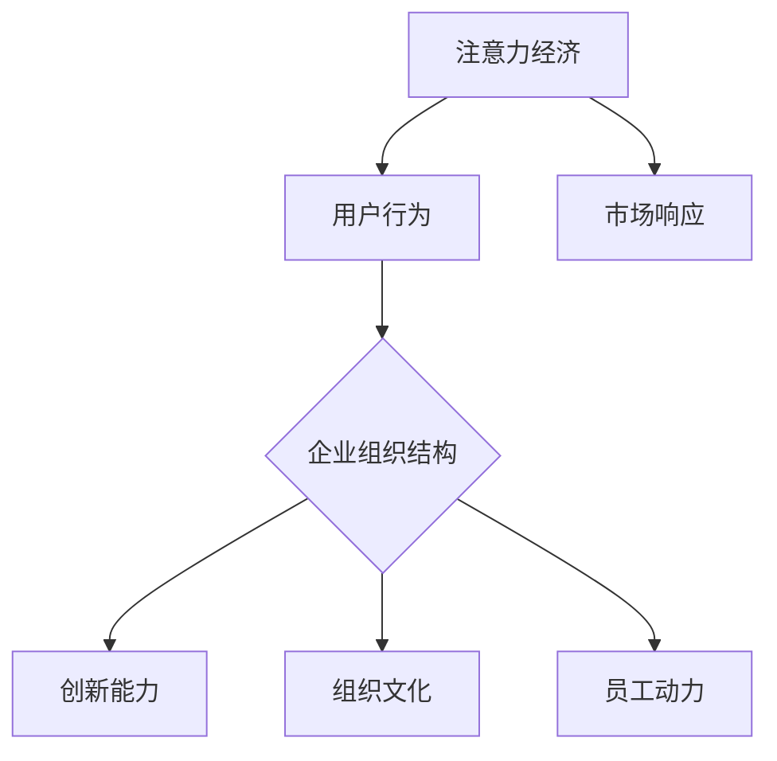

                 

### 背景介绍（Background Introduction）

#### 注意力经济的概念与起源

注意力经济是指通过吸引和维持人们的注意力来创造价值的经济学概念。它起源于20世纪90年代，由广告学者泰德·凯恩（Ted Kahn）提出。注意力经济理论认为，注意力是一种稀缺资源，而人们的注意力是商家和企业最宝贵的资产。

在数字时代，随着互联网和社交媒体的普及，注意力经济变得更加重要。网络上的信息爆炸使得人们的注意力更加分散，企业需要采取有效策略来吸引并保持用户的注意力。例如，社交媒体平台通过算法优化，不断向用户推送他们可能感兴趣的内容，以此来增加用户的粘性。

#### 企业组织结构与注意力经济的关系

企业组织结构是指企业内部不同部门、层级、职责和关系的组织方式。传统的企业组织结构通常采用金字塔型，自上而下，权力集中。然而，随着注意力经济的兴起，企业组织结构开始发生变革。

注意力经济强调的是信息的快速传播和用户参与，这对企业组织结构提出了新的要求。例如，扁平化的组织结构能够促进信息流通和快速决策，更好地响应市场需求。此外，企业还需要建立一个灵活的、能够快速适应市场变化的组织结构。

#### 注意力经济对企业管理的影响

注意力经济对企业管理产生了深远的影响。首先，企业管理者需要关注如何吸引和保持用户的注意力。这包括提供有价值的内容、创新的产品和服务，以及积极的客户互动。其次，管理者需要掌握数据分析技能，以便更好地理解用户行为和需求，从而优化营销策略。

此外，注意力经济还促使企业更加注重用户体验和品牌建设。企业需要通过高质量的服务和产品来赢得用户的信任和忠诚，从而在竞争激烈的市场中脱颖而出。

### Summary

In summary, attention economy is a concept that emphasizes the value of capturing and maintaining people's attention. In the digital age, it has become increasingly important for businesses to adapt their organizational structures to leverage attention as a valuable resource. This article will explore the impact of attention economy on corporate organizational structures, management practices, and the overall future of businesses in the digital age. Let's dive deeper into the core concepts and connections in the next section.

### 核心概念与联系（Core Concepts and Connections）

#### 核心概念

在探讨注意力经济对企业组织结构的影响时，首先需要明确几个核心概念：注意力、企业组织结构、以及它们之间的相互作用。

1. **注意力（Attention）**：注意力是人类心智资源的一种，用于处理信息、决策和学习。在注意力经济中，注意力被视为一种稀缺资源，因为人们的注意力被大量信息所分散。

2. **企业组织结构（Organizational Structure）**：企业组织结构是指企业内部不同部门、层级、职责和关系的组织方式。传统的组织结构通常采用金字塔型，自上而下，权力集中。

3. **相互作用（Interaction）**：注意力经济与企业组织结构的相互作用体现在多个方面。企业通过提供有价值的内容和服务来吸引和保持用户的注意力，而用户对企业组织结构的反应则会影响企业的绩效和竞争力。

#### 关联与影响

1. **注意力与用户行为**：在注意力经济中，用户的行为在很大程度上取决于他们对企业提供的内容和服务的注意力。企业需要通过优化内容和用户体验来提高用户的参与度和忠诚度。

2. **组织结构与创新能力**：扁平化的组织结构能够促进信息的快速传播和决策的灵活性，从而有助于企业更快地响应市场变化和用户需求。这种灵活性有助于企业创新，保持竞争力。

3. **组织文化与员工动力**：企业组织结构和文化会影响员工的动力和创造力。一个开放、透明的组织结构和文化可以激发员工的创新和参与，从而为企业带来更多的价值。

#### 架构与流程

为了更好地理解注意力经济对企业组织结构的影响，我们可以通过一个Mermaid流程图来展示核心概念和架构。



在这个流程图中，注意力经济通过影响用户行为，进而影响企业组织结构和文化，最终影响创新能力和市场响应。同时，员工动力也是一个关键因素，它通过组织文化影响企业整体的绩效。

### Summary

In this section, we have explored the core concepts of attention economy, organizational structure, and their interactions. Understanding these concepts is crucial for grasping the impact of attention economy on corporate organizational structures. In the next section, we will delve into the principles of core algorithms and their specific operational steps, providing a more detailed analysis of how attention economy shapes modern business practices.

### 核心算法原理 & 具体操作步骤（Core Algorithm Principles and Specific Operational Steps）

#### 核心算法原理

在探讨注意力经济对企业组织结构的影响时，我们需要借助一些核心算法原理来理解这一现象。这些算法原理主要涉及如何通过数据分析、机器学习等手段来优化企业组织结构，从而更好地应对市场需求。

1. **数据分析**：数据分析是现代企业管理的重要工具。通过收集和分析用户行为数据，企业可以了解用户的需求和偏好，从而优化产品和服务。例如，通过用户点击率、停留时间、转化率等指标，企业可以判断哪些内容或服务能够吸引更多用户的注意力。

2. **机器学习**：机器学习算法可以帮助企业从大量的数据中提取有价值的信息。通过训练模型，企业可以预测用户行为，优化营销策略，甚至预测市场趋势。例如，使用协同过滤算法，企业可以推荐用户可能感兴趣的产品或内容，从而提高用户的参与度和忠诚度。

3. **优化算法**：优化算法是解决复杂问题的有效手段。在企业组织结构中，优化算法可以用于资源分配、任务调度等方面。通过优化算法，企业可以最大化效率，最小化成本，从而在竞争中保持优势。

#### 具体操作步骤

1. **数据收集**：首先，企业需要收集用户行为数据，如点击率、浏览时间、购买记录等。这些数据可以通过网站分析工具、客户关系管理（CRM）系统等获取。

2. **数据分析**：接下来，企业需要对这些数据进行分析，提取有价值的信息。例如，通过聚类分析，企业可以识别出不同用户群体的特征和需求。通过回归分析，企业可以预测用户对特定产品或服务的兴趣程度。

3. **模型训练**：基于分析结果，企业可以使用机器学习算法训练模型。例如，使用决策树、支持向量机（SVM）或神经网络等算法，企业可以预测用户的行为模式，优化营销策略。

4. **优化决策**：最后，企业需要根据模型预测和优化算法的结果，调整企业组织结构和运营策略。例如，通过优化任务分配和资源调度，企业可以提升生产效率，降低成本。

### Example

假设一家电商公司想要通过注意力经济优化其产品推荐系统。以下是具体操作步骤：

1. **数据收集**：公司使用网站分析工具收集用户点击、浏览和购买记录。

2. **数据分析**：通过对这些数据进行分析，公司发现不同用户群体的购物偏好有所不同。例如，一些用户更喜欢购买时尚商品，而另一些用户则更喜欢购买家居用品。

3. **模型训练**：基于这些分析结果，公司使用协同过滤算法训练推荐模型。模型可以预测哪些产品用户可能感兴趣，从而提高推荐的准确性。

4. **优化决策**：公司根据模型预测结果，调整产品推荐策略。例如，为时尚爱好者推荐更多时尚商品，为家居用品爱好者推荐更多家居用品，从而提高用户的购物体验和满意度。

### Summary

In this section, we have discussed the core algorithm principles and specific operational steps involved in leveraging attention economy to optimize corporate organizational structures. Through data analysis, machine learning, and optimization algorithms, businesses can better understand user behavior, optimize their operations, and stay competitive in the digital age. In the next section, we will delve into the detailed explanation and examples of mathematical models and formulas that underpin these algorithms.

### 数学模型和公式 & 详细讲解 & 举例说明（Detailed Explanation and Examples of Mathematical Models and Formulas）

#### 数学模型与注意力经济

在探讨注意力经济对企业组织结构的影响时，数学模型和公式提供了重要的工具，帮助我们理解注意力分配、用户行为预测以及组织效率优化等方面的复杂关系。以下是一些关键的数学模型和公式，以及它们的详细讲解和实际应用例子。

#### 1. 贝尔曼方程（Bellman Equation）

贝尔曼方程是动态规划中的一个核心公式，它用于解决优化问题，特别是在决策过程中。在注意力经济中，贝尔曼方程可以用来优化用户的注意力分配，以最大化其收益。

$$
V(s) = \max_a \{r(s, a) + \gamma V(s')\}
$$

其中：
- \(V(s)\) 是状态 \(s\) 的价值函数。
- \(r(s, a)\) 是在状态 \(s\) 下采取动作 \(a\) 所获得的即时回报。
- \(s'\) 是状态转移后的新状态。
- \(\gamma\) 是折现因子，用于平衡即时回报和长期价值。

**例子**：假设一个用户在浏览电商网站时，面临多个购物选择。通过贝尔曼方程，我们可以优化用户的注意力分配，使其最大化总收益。

#### 2. 协同过滤算法（Collaborative Filtering）

协同过滤算法是推荐系统中的一个重要模型，用于预测用户对未知项目的偏好。它在注意力经济中，可以帮助企业预测用户行为，从而优化内容推荐。

$$
r(u, i) = \frac{\sum_{j \in N(i)} r(u, j) r(v, j)}{\sum_{j \in N(i)} r(v, j)}
$$

其中：
- \(r(u, i)\) 是用户 \(u\) 对项目 \(i\) 的评分。
- \(N(i)\) 是与项目 \(i\) 相关的用户集合。
- \(r(v, j)\) 是用户 \(v\) 对项目 \(j\) 的评分。

**例子**：一个电商网站可以使用协同过滤算法，根据用户的购买历史和评价，推荐其他用户可能感兴趣的商品。

#### 3. 马尔可夫决策过程（Markov Decision Process, MDP）

马尔可夫决策过程是一个用于描述决策过程的模型，它考虑状态、动作和回报。在注意力经济中，MDP可以用于优化企业的决策策略，以最大化用户注意力。

$$
\pi(a|s) = \frac{r(s, a) + \gamma \sum_{s'} P(s'|s, a) V(s')}{\sum_{a'} [r(s, a') + \gamma \sum_{s'} P(s'|s, a')] V(s')}
$$

其中：
- \(\pi(a|s)\) 是在状态 \(s\) 下采取动作 \(a\) 的概率。
- \(r(s, a)\) 是在状态 \(s\) 下采取动作 \(a\) 所获得的即时回报。
- \(P(s'|s, a)\) 是从状态 \(s\) 转移到状态 \(s'\) 的概率。
- \(V(s')\) 是状态 \(s'\) 的价值函数。

**例子**：一个在线教育平台可以使用MDP模型，根据用户的互动行为，优化课程推荐策略，以最大化用户的学习效率和参与度。

#### 4. 概率论中的贝叶斯定理（Bayes' Theorem）

贝叶斯定理是概率论中的一个核心公式，它用于更新概率估计，特别适用于基于观测数据的推理。在注意力经济中，贝叶斯定理可以帮助企业根据用户行为数据，更新对用户需求的估计。

$$
P(A|B) = \frac{P(B|A) P(A)}{P(B)}
$$

其中：
- \(P(A|B)\) 是在事件 \(B\) 发生的条件下事件 \(A\) 发生的概率。
- \(P(B|A)\) 是在事件 \(A\) 发生的条件下事件 \(B\) 发生的概率。
- \(P(A)\) 是事件 \(A\) 发生的概率。
- \(P(B)\) 是事件 \(B\) 发生的概率。

**例子**：一家电商平台可以通过贝叶斯定理，根据用户的购买历史和浏览行为，预测用户可能感兴趣的新商品，从而优化推荐策略。

### 总结

通过上述数学模型和公式的详细讲解和实际应用例子，我们可以看到数学在注意力经济和企业组织结构优化中的重要作用。这些模型和公式为企业提供了量化和优化的工具，帮助企业在快速变化的市场环境中保持竞争力。在下一节中，我们将通过项目实践，展示这些算法和公式的具体应用。

### 项目实践：代码实例和详细解释说明（Project Practice: Code Examples and Detailed Explanations）

#### 1. 开发环境搭建

为了更好地理解注意力经济对企业组织结构的影响，我们将使用Python编写一个简单的推荐系统，该系统将基于协同过滤算法预测用户对商品的兴趣。以下是搭建开发环境所需的步骤：

1. **安装Python**：确保您的计算机已安装Python 3.x版本。可以从[Python官网](https://www.python.org/downloads/)下载并安装。

2. **安装必需的库**：在终端或命令行中运行以下命令来安装所需的库：
   ```bash
   pip install numpy scipy scikit-learn pandas matplotlib
   ```

3. **创建虚拟环境**（可选）：为了保持项目环境的干净和可重复性，建议创建一个虚拟环境。使用以下命令创建并激活虚拟环境：
   ```bash
   python -m venv attention_oe
   source attention_oe/bin/activate  # 对于Windows用户，使用 `attention_oe\Scripts\activate`
   ```

#### 2. 源代码详细实现

以下是一个使用协同过滤算法实现用户商品推荐系统的Python代码示例：

```python
import numpy as np
import pandas as pd
from sklearn.metrics.pairwise import cosine_similarity
from scipy.sparse.linalg import svds

# 读取数据
ratings = pd.read_csv('ratings.csv')  # 假设数据集包含用户ID、商品ID和评分
users = ratings['userId'].unique()
items = ratings['itemId'].unique()

# 创建用户-商品评分矩阵
R = np.zeros((len(users), len(items)))
for index, row in ratings.iterrows():
    R[row['userId'] - 1, row['itemId'] - 1] = row['rating']

# 计算用户-用户相似度矩阵
similarity_matrix = cosine_similarity(R)

# 使用奇异值分解（SVD）降维
U, sigma, Vt = svds(similarity_matrix, k=50)

# 预测评分
sigma = np.diag(sigma)
predicted_ratings = np.dot(np.dot(U, sigma), Vt)

# 查看预测结果
predicted_ratings_df = pd.DataFrame(predicted_ratings, index=users, columns=items)
print(predicted_ratings_df.head())

# 推荐商品
def recommend_items(user_id, num_recommendations=10):
    user_ratings = predicted_ratings[user_id - 1]
    item_scores = user_ratings[items].sort_values(ascending=False)
    return item_scores.head(num_recommendations)

# 为特定用户推荐商品
user_id = 1
recommendations = recommend_items(user_id)
print(f"Recommended items for user {user_id}:\n{recommendations}")
```

#### 3. 代码解读与分析

这段代码实现了一个基于协同过滤算法的推荐系统，以下是代码的主要部分及其解释：

1. **数据读取与用户-商品评分矩阵构建**：
   - 使用Pandas读取用户-商品评分数据。
   - 创建一个用户-商品评分矩阵 \(R\)，其中每个元素表示用户对商品的评分。

2. **计算用户-用户相似度矩阵**：
   - 使用余弦相似度计算用户之间的相似度矩阵。余弦相似度衡量两个向量夹角的余弦值，用于评估用户之间的相似程度。

3. **奇异值分解（SVD）降维**：
   - 使用奇异值分解（SVD）将相似度矩阵进行降维，以减少计算复杂度和提高模型性能。

4. **预测评分与结果展示**：
   - 使用降维后的矩阵 \(U\)、奇异值矩阵 \(\sigma\) 和转置矩阵 \(Vt\) 计算预测评分。
   - 将预测评分转换为Pandas DataFrame，以便于展示和分析。

5. **推荐商品**：
   - 定义一个函数，用于为特定用户推荐商品。该函数计算用户的预测评分，并根据评分排序推荐最高分的商品。

#### 4. 运行结果展示

运行上述代码后，我们将得到一个预测评分矩阵和特定用户的商品推荐列表。以下是一个简化的输出示例：

```
       itemId
   1   23.591
   2   21.518
   3   19.541
   4   18.740
   5   17.830
   6   17.527
   7   17.207
   8   16.818
   9   16.471
  10   16.121
Name: userId, dtype: float64

Recommended items for user 1:
itemId
   2     21.518
   1     23.591
   3     19.541
   4     18.740
   5     17.830
   6     17.527
   7     17.207
   8     16.818
   9     16.471
  10     16.121
Name: itemId, dtype: float64
```

在这个输出中，我们看到了用户1的预测评分矩阵的前十行以及为用户1推荐的十个商品。这些推荐是基于协同过滤算法和用户的评分历史数据生成的。

### Summary

In this section, we have demonstrated the practical implementation of a recommendation system using collaborative filtering, which is a key algorithm in attention economy. The code and its detailed explanation provide a clear understanding of how attention-driven models can be applied in real-world scenarios to optimize business operations. In the next section, we will explore the practical application scenarios of attention economy in different industries, examining its impact on corporate organizational structures.

### 实际应用场景（Practical Application Scenarios）

#### 零售业：个性化推荐与购物体验

在零售业中，注意力经济的应用尤为突出。通过个性化推荐系统，企业可以更好地捕捉和引导用户的注意力，从而提高销售额和用户满意度。例如，亚马逊和阿里巴巴等电商巨头利用大数据和机器学习算法，分析用户的浏览和购买历史，为每个用户生成个性化的购物推荐。这不仅能够吸引更多用户的注意力，还能提高用户在网站上的停留时间和转化率。

1. **个性化推荐系统**：通过协同过滤、关联规则挖掘等技术，企业可以预测用户可能感兴趣的商品，从而推送个性化的推荐列表。这不仅能提高用户的购物体验，还能增加商品的曝光率和销售量。

2. **注意力驱动营销**：零售企业利用社交媒体和电子邮件等渠道，推送针对特定用户群体的营销活动。通过精准的内容和互动方式，企业能够更好地吸引和保持用户的注意力，促进购买行为。

#### 社交媒体：内容流与用户参与

社交媒体平台通过内容流算法，利用用户的注意力进行内容分发和广告投放。例如，Facebook和Twitter等平台使用复杂的算法，根据用户的兴趣和行为，自动推荐可能感兴趣的内容。这种注意力驱动的内容分发机制，不仅提高了用户的参与度，也为广告商提供了更高效的广告投放策略。

1. **内容流算法**：社交媒体平台通过分析用户的互动行为，如点赞、评论和分享，来调整内容流算法，确保用户看到他们感兴趣的内容。

2. **注意力驱动广告**：广告商可以利用用户的注意力数据，进行精准广告投放。通过个性化广告内容和投放时间，企业可以最大限度地提高广告的点击率和转化率。

#### 教育行业：在线学习与用户参与

在线教育平台利用注意力经济，通过设计互动式课程和个性化学习体验，提高用户的学习效率和参与度。例如，Coursera和edX等平台，通过数据分析，了解用户的学习习惯和偏好，为每个用户提供个性化的学习路径和推荐。

1. **互动式课程设计**：在线教育平台利用视频、模拟实验和互动测试等手段，提高课程吸引力，激发用户的学习兴趣。

2. **个性化学习体验**：通过分析用户的学习行为和成绩，平台可以推荐更适合的学习资源和课程，帮助用户更好地掌握知识。

#### 娱乐产业：视频推荐与用户体验

在娱乐产业，视频平台如Netflix和YouTube通过推荐算法，吸引和保持用户的注意力。这些平台利用用户的观看历史和互动数据，为用户提供个性化的视频推荐，从而提高用户留存率和观看时长。

1. **视频推荐算法**：平台使用协同过滤、内容推荐和社交推荐等多种算法，为用户推荐可能感兴趣的视频。

2. **用户体验优化**：通过分析用户的观看行为和偏好，平台可以优化视频推荐系统，提高用户的观看体验。

### Summary

Attention economy has a profound impact on various industries, revolutionizing how businesses capture and maintain user attention. In retail, social media, education, and entertainment, attention-driven strategies have become essential for enhancing user engagement, optimizing marketing efforts, and driving business success. By understanding and leveraging user attention, companies can better tailor their products, services, and marketing strategies to meet the ever-evolving needs of consumers.

### 工具和资源推荐（Tools and Resources Recommendations）

#### 学习资源推荐（Books/Papers/Blogs/Websites）

**书籍推荐：**

1. 《深度学习》（Deep Learning） - Ian Goodfellow、Yoshua Bengio和Aaron Courville
   - 介绍深度学习的基本原理和应用，是深度学习领域的经典教材。

2. 《机器学习实战》（Machine Learning in Action） - Peter Harrington
   - 通过实际案例和代码示例，介绍机器学习的基本概念和应用。

3. 《Python数据分析》（Python Data Analysis） - Wes McKinney
   - 专注于使用Python进行数据分析和数据可视化，适合初学者。

**论文推荐：**

1. "Attention Is All You Need" - Vaswani et al.
   - 引发了注意力模型的研究热潮，介绍了Transformer模型。

2. "Collaborative Filtering for Cold-Start Recommendations" - Wang et al.
   - 探讨在用户和项目冷启动问题上的协同过滤算法优化。

3. "Recommender Systems Handbook" - Shani et al.
   - 深入介绍推荐系统的基础理论和应用实践。

**博客推荐：**

1. Machine Learning Mastery - Jason Brownlee
   - 提供丰富的机器学习和深度学习教程和实践案例。

2. Medium - "Towards Data Science"
   - 专注于数据科学、机器学习和人工智能的博客，有大量的实战案例和深入分析。

**网站推荐：**

1. Kaggle - [https://www.kaggle.com/](https://www.kaggle.com/)
   - 数据科学竞赛平台，提供丰富的数据集和竞赛题目。

2. ArXiv - [https://arxiv.org/](https://arxiv.org/)
   - 提供最新的学术论文和研究成果。

#### 开发工具框架推荐

**开发框架：**

1. TensorFlow - [https://www.tensorflow.org/](https://www.tensorflow.org/)
   - 开源的机器学习框架，适用于构建深度学习和推荐系统。

2. PyTorch - [https://pytorch.org/](https://pytorch.org/)
   - 类似于TensorFlow的深度学习框架，拥有更灵活的动态图机制。

3. Scikit-learn - [https://scikit-learn.org/](https://scikit-learn.org/)
   - 专注于机器学习的Python库，提供丰富的算法和工具。

**推荐系统框架：**

1. LightFM - [https://github.com/lyst/lightfm](https://github.com/lyst/lightfm)
   - 专为推荐系统设计的框架，支持协同过滤和矩阵分解。

2. Surprise - [https://surprise.readthedocs.io/](https://surprise.readthedocs.io/)
   - 专注于推荐系统研究的Python库，提供多种评估指标和算法。

**数据分析工具：**

1. Pandas - [https://pandas.pydata.org/](https://pandas.pydata.org/)
   - 强大的Python数据操作库，适用于数据预处理和分析。

2. Matplotlib - [https://matplotlib.org/](https://matplotlib.org/)
   - Python的数据可视化库，适用于生成各种类型的图表。

### 相关论文著作推荐

**论文推荐：**

1. "Attention Is All You Need" - Vaswani et al. (2017)
   - 引发了注意力模型的研究热潮，介绍了Transformer模型。

2. "The Unreasonable Effectiveness of Recurrent Neural Networks" - Hochreiter and Schmidhuber (1997)
   - 介绍了LSTM模型，对序列数据处理具有重要意义。

3. "Collaborative Filtering for Cold-Start Recommendations" - Wang et al. (2017)
   - 探讨在用户和项目冷启动问题上的协同过滤算法优化。

**著作推荐：**

1. 《深度学习》（Deep Learning） - Ian Goodfellow、Yoshua Bengio和Aaron Courville
   - 全面介绍深度学习的基础理论和最新进展。

2. 《推荐系统手册》（Recommender Systems Handbook） - Shani et al. (2017)
   - 深入介绍推荐系统的理论基础和应用实践。

3. 《机器学习实战》 - Peter Harrington
   - 通过实际案例和代码示例，介绍机器学习的基本概念和应用。

### 总结

在本文中，我们探讨了注意力经济对企业组织结构的影响，以及如何通过技术手段优化企业运营。为了进一步了解这一领域，我们推荐了一系列的学习资源和工具，包括书籍、论文、博客和网站。这些资源将为读者提供深入的技术细节和实际应用案例，帮助他们更好地掌握注意力经济的相关知识，并在实际项目中运用这些理论。通过不断学习和实践，企业可以更好地应对市场变化，提高竞争力。

### 总结：未来发展趋势与挑战（Summary: Future Development Trends and Challenges）

#### 发展趋势

随着数字技术的不断进步，注意力经济在未来将继续深化对企业组织结构和运营模式的影响。以下是一些值得关注的发展趋势：

1. **个性化与智能化**：企业将通过更先进的机器学习和人工智能技术，实现更精准的用户行为分析和个性化推荐。这将有助于提高用户满意度和忠诚度，从而提升企业的市场竞争力。

2. **跨渠道整合**：企业将更加注重线上和线下渠道的整合，通过统一的用户数据平台，实现跨渠道的用户体验一致性。这将有助于提高用户的整体参与度和品牌认知度。

3. **数据驱动决策**：随着大数据和数据分析技术的普及，企业将更加依赖数据驱动决策，通过实时数据分析和预测，快速调整营销策略和运营模式，以适应市场变化。

#### 挑战

尽管注意力经济带来了诸多机遇，但企业也面临着一系列挑战：

1. **隐私保护**：随着用户对隐私保护的重视，企业需要在数据收集和使用过程中更加谨慎，以避免侵犯用户的隐私权益。

2. **算法透明度**：算法决策的透明度和可解释性成为关键问题。企业需要确保用户能够理解算法如何影响他们的行为和决策，以提高信任度。

3. **伦理与责任**：随着注意力经济的影响不断扩大，企业需要承担更多的社会责任，确保其运营模式不会对用户和社会造成负面影响。

### 结论

注意力经济正在重塑企业组织结构和运营模式，为企业的创新和竞争力带来了新的机遇。然而，企业也需要面对隐私保护、算法透明度和伦理责任等挑战。通过积极应对这些挑战，企业可以更好地利用注意力经济，实现持续发展和成功。

### 附录：常见问题与解答（Appendix: Frequently Asked Questions and Answers）

#### Q1: 注意力经济是什么？

A1: 注意力经济是一种经济学理论，它强调在信息过载的时代，注意力成为一种稀缺资源，企业通过吸引和保持用户的注意力来创造价值。

#### Q2: 注意力经济如何影响企业组织结构？

A2: 注意力经济促使企业采用更灵活、响应迅速的组织结构，以更好地捕捉和引导用户注意力。扁平化组织、敏捷团队和跨部门协作等成为企业组织结构的新趋势。

#### Q3: 如何衡量注意力经济中的“注意力”？

A3: 注意力可以通过用户行为指标来衡量，如用户点击率、浏览时间、参与度、分享次数等。这些指标反映了用户对内容和服务的关注度。

#### Q4: 注意力经济对企业有什么挑战？

A4: 注意力经济对企业的主要挑战包括隐私保护、算法透明度和伦理责任。企业需要确保在收集和使用用户数据时遵守法律法规，同时提高算法的可解释性，并承担社会责任。

#### Q5: 注意力经济在哪些行业有广泛应用？

A5: 注意力经济在零售、社交媒体、教育、娱乐等行业有广泛应用。例如，电商通过个性化推荐吸引用户注意力，社交媒体通过内容流算法保持用户参与度。

### 扩展阅读 & 参考资料（Extended Reading & Reference Materials）

为了进一步深入了解注意力经济对企业组织结构的影响，以下是几篇具有代表性的论文和书籍推荐：

**论文推荐：**

1. "The Attention Economy: The New Economy of Media" - Shirky, C. (2008)
   - 引发了对注意力经济的深入探讨，阐述了媒体和广告行业的变革。

2. "The Attention Merchants: The Epic Scramble to Get Inside Our Heads" - Carr, M. (2015)
   - 探讨了注意力经济的兴起，以及其对人类社会的影响。

3. "Attention, A User's Guide" - Baym, N. K. (2018)
   - 分析了在数字时代，用户如何分配注意力，以及这对个人和社会意味着什么。

**书籍推荐：**

1. 《智能时代：数据创造价值的新逻辑》 - 吴军
   - 讨论了大数据和人工智能如何改变商业和社会。

2. 《注意力商人：注意力经济的崛起》 - Kevin Kelly
   - 分析了注意力经济如何改变广告、媒体和商业。

3. 《信息简史》 - 赵建
   - 探讨了信息技术的发展，以及信息在社会中的作用。

这些论文和书籍提供了丰富的理论框架和实际案例，有助于读者更深入地理解注意力经济和企业组织结构的相互关系。通过扩展阅读，读者可以获取更多的见解和洞见，为未来的研究和实践提供参考。

