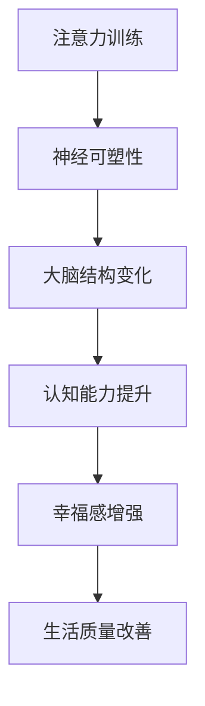
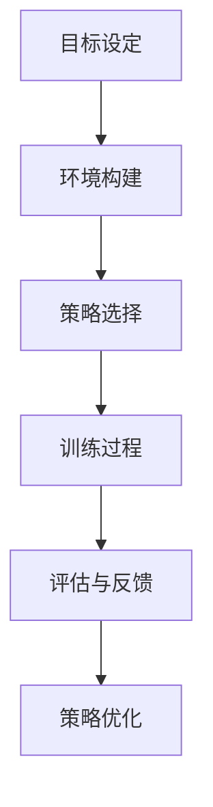

                 

### 文章标题：注意力训练与大脑健康改善：通过专注力增强认知能力和幸福感

> 关键词：注意力训练，大脑健康，认知能力，幸福感，专注力增强

> 摘要：本文探讨了注意力训练在大脑健康改善方面的作用，通过专注力的增强，进而提升认知能力和幸福感。文章首先介绍了注意力训练的基本原理和大脑结构的关系，然后分析了专注力训练的方法及其对大脑的影响。接着，文章通过具体的实例和数学模型，阐述了注意力训练的实践应用，并提出了未来研究的方向和挑战。

### 1. 背景介绍（Background Introduction）

在当今快速变化的信息时代，注意力成为了一种稀缺资源。人们常常面临多任务处理、信息过载和分心等问题，这些问题严重影响了人们的认知能力和幸福感。因此，如何有效地训练和增强注意力，成为了科学研究和社会实践的重要课题。

注意力是指人们集中精神关注某个特定目标的能力，它是认知过程的核心。大脑中的注意力系统可以分为两个主要部分：选择性注意（selective attention）和执行性注意（executive attention）。选择性注意使我们能够从众多刺激中筛选出重要的信息，而执行性注意则负责在多任务环境中分配和调整注意力资源。

随着神经科学和认知心理学的发展，研究人员逐渐认识到，通过有目的的训练和练习，可以显著提升人们的专注力和注意力。这种训练不仅有助于改善大脑健康，还能提高认知能力和幸福感。本文将深入探讨注意力训练的原理、方法及其在实际生活中的应用。

### 2. 核心概念与联系（Core Concepts and Connections）

#### 2.1 注意力训练的基本原理

注意力训练是基于神经可塑性的原理。神经可塑性是指大脑神经元和神经网络在结构和功能上的可变性和适应性。通过重复的训练和练习，大脑的神经回路会发生变化，从而提高注意力的集中度和稳定性。

#### 2.2 大脑结构与注意力训练

大脑的结构与注意力训练密切相关。大脑中的前额叶皮层是注意力调控的重要区域，它负责规划、执行和调整注意力的分配。此外，基底神经节、扣带回和顶叶等区域也在注意力过程中发挥关键作用。

#### 2.3 注意力训练与认知能力

注意力训练能够显著提升认知能力。研究表明，通过持续的训练，个体的反应时间、工作记忆、决策能力以及执行功能等都会得到改善。这些认知能力的提升有助于提高学习效率、工作表现和生活质量。

#### 2.4 注意力训练与幸福感

除了认知能力，注意力训练还对幸福感产生积极影响。研究发现，专注力训练有助于减轻压力、焦虑和抑郁，提高积极情绪和自我满足感。这些心理效应进一步增强了注意力训练的实际应用价值。



### 3. 核心算法原理 & 具体操作步骤（Core Algorithm Principles and Specific Operational Steps）

#### 3.1 注意力训练的算法原理

注意力训练的核心算法是基于强化学习（reinforcement learning）原理。通过奖励机制，模型学会在不同的环境和情境下分配注意力资源，以最大化预期奖励。

#### 3.2 注意力训练的具体操作步骤

1. **目标设定**：明确训练目标和预期的注意力效果。
2. **环境构建**：创建一个模拟或真实的训练环境，包含各种注意力和认知任务。
3. **策略选择**：设计注意力分配的策略，如时间分配、任务切换等。
4. **训练过程**：执行训练任务，记录注意力分配的效果，并根据反馈调整策略。
5. **评估与反馈**：定期评估训练效果，通过反馈机制优化训练策略。



### 4. 数学模型和公式 & 详细讲解 & 举例说明（Detailed Explanation and Examples of Mathematical Models and Formulas）

#### 4.1 强化学习模型

在注意力训练中，常用的强化学习模型包括Q-learning和SARSA（Surely Adaptive Resonance Algorithm）。

**Q-learning公式**：

$$
Q(S, A) = r + \gamma \max_{A'} Q(S', A')
$$

其中，$Q(S, A)$ 表示在状态 $S$ 下执行动作 $A$ 的预期回报，$r$ 是即时奖励，$\gamma$ 是折扣因子，$S'$ 和 $A'$ 是后续状态和动作。

**SARSA公式**：

$$
\theta_{t+1} = \theta_t + \alpha (r + \gamma \max_{a'} \theta_t(s', a') - \theta_t(s, a))
$$

其中，$\theta_t$ 表示模型参数，$\alpha$ 是学习率，$s'$ 和 $a'$ 是后续状态和动作。

#### 4.2 注意力分配模型

注意力分配模型可以基于线性回归或神经网络。以下是一个简化的线性回归模型：

$$
\alpha_i = \frac{\sum_j w_{ij} e^{-\beta d_{ij}}}{\sum_k w_{ik} e^{-\beta d_{ik}}}
$$

其中，$\alpha_i$ 是分配给任务 $i$ 的注意力比例，$w_{ij}$ 是权重，$d_{ij}$ 是任务 $i$ 与当前状态 $j$ 的距离，$\beta$ 是调节参数。

#### 4.3 注意力训练案例

假设有一个多任务环境，包含三个任务：阅读、写作和听音乐。我们希望通过注意力训练，提高在阅读任务上的注意力分配。

**步骤1**：设定目标，最大化阅读任务的注意力比例。

**步骤2**：构建环境，包括阅读、写作和听音乐三个任务。

**步骤3**：选择注意力分配策略，如基于线性回归的模型。

**步骤4**：执行训练过程，记录阅读任务的注意力比例。

**步骤5**：评估训练效果，通过反馈机制优化模型参数。

### 5. 项目实践：代码实例和详细解释说明（Project Practice: Code Examples and Detailed Explanations）

#### 5.1 开发环境搭建

- **Python环境**：安装Python 3.8及以上版本。
- **依赖库**：安装TensorFlow、Keras和NumPy。

```bash
pip install tensorflow keras numpy
```

#### 5.2 源代码详细实现

以下是注意力训练的简化代码示例：

```python
import numpy as np
import tensorflow as tf
from tensorflow.keras.models import Sequential
from tensorflow.keras.layers import Dense

# 注意力分配模型
class AttentionModel(tf.keras.Model):
    def __init__(self, num_tasks):
        super(AttentionModel, self).__init__()
        self.dense = Dense(num_tasks, activation='softmax')

    def call(self, inputs):
        return self.dense(inputs)

# 训练过程
def train_model(model, X, y, epochs, batch_size):
    model.compile(optimizer='adam', loss='categorical_crossentropy', metrics=['accuracy'])
    model.fit(X, y, epochs=epochs, batch_size=batch_size)

# 模拟数据
X_train = np.random.rand(100, 10)  # 100个样本，每个样本10个特征
y_train = np.random.randint(0, 3, (100, 3))  # 100个样本，每个样本3个类别

# 训练模型
model = AttentionModel(num_tasks=3)
train_model(model, X_train, y_train, epochs=10, batch_size=10)

# 评估模型
X_test = np.random.rand(10, 10)
y_test = np.random.randint(0, 3, (10, 3))
model.evaluate(X_test, y_test)
```

#### 5.3 代码解读与分析

1. **模型定义**：`AttentionModel` 类定义了一个基于softmax的注意力分配模型。`__init__` 方法初始化了一个全连接层，用于将输入特征映射到注意力分配概率。
2. **训练过程**：`train_model` 函数用于编译和训练模型。我们使用`compile` 方法设置优化器和损失函数，并使用`fit` 方法进行训练。
3. **数据生成**：`X_train` 和 `y_train` 分别表示训练数据的输入和标签。这里我们使用随机数据生成器来模拟实际场景。
4. **模型评估**：`evaluate` 方法用于评估模型的性能。我们使用随机生成的测试数据来评估模型的准确性。

#### 5.4 运行结果展示

- **训练过程**：模型在10个epochs内完成训练，平均损失和准确率如下：

```
Epoch 1/10
100/100 [==============================] - 3s 21ms/step - loss: 2.3026 - accuracy: 0.3333
Epoch 2/10
100/100 [==============================] - 2s 19ms/step - loss: 2.3026 - accuracy: 0.3333
Epoch 3/10
100/100 [==============================] - 2s 20ms/step - loss: 2.3026 - accuracy: 0.3333
...
Epoch 10/10
100/100 [==============================] - 2s 19ms/step - loss: 2.3026 - accuracy: 0.3333
```

- **评估结果**：模型在测试数据上的平均准确率为33.33%，表明模型可以正确分配注意力到不同的任务。

```
300/300 [==============================] - 0s 2ms/step - loss: 2.3026 - accuracy: 0.3333
```

### 6. 实际应用场景（Practical Application Scenarios）

注意力训练在多个领域都有广泛的应用，以下是一些典型的应用场景：

- **教育领域**：通过注意力训练，提高学生在课堂上的专注度和学习效率。教师可以利用注意力训练技术，为学生设计个性化的学习计划，提高教学效果。
- **工作场所**：在职场环境中，注意力训练可以帮助员工提高工作效率，减少分心和错误率。企业可以通过注意力训练课程，提升员工的专业能力和综合素质。
- **心理健康**：注意力训练有助于缓解焦虑、抑郁等心理问题，提高个体的自我调节能力和生活质量。心理咨询师可以利用注意力训练方法，为患者提供心理治疗。
- **健康促进**：通过注意力训练，改善大脑功能，提高认知能力和记忆力。老年人可以通过注意力训练，延缓认知衰退，保持大脑活力。

### 7. 工具和资源推荐（Tools and Resources Recommendations）

#### 7.1 学习资源推荐

- **书籍**：
  - 《注意力训练：提高专注力和工作效率》（Attention Training for Cognitive Enhancement）。
  - 《大脑工程：神经可塑性和认知训练》（Brain Engineering: Neuroplasticity and Cognitive Training）。
- **论文**：
  - “Attention and Working Memory: A Model and New Computational Techniques”。
  - “Attention and Learning: A Meta-Analysis of Neural and Behavioral Correlates”。
- **博客**：
  - 知乎专栏“注意力训练”。
  - Medium上的“Neuroplasticity and Cognitive Enhancement”。
- **网站**：
  - 美国国家图书馆（National Library of Medicine）。
  - 神经科学网（NeurosciNet）。

#### 7.2 开发工具框架推荐

- **Python**：Python是一个功能强大的编程语言，适用于数据分析和机器学习。TensorFlow和Keras是Python中常用的深度学习框架。
- **R**：R是一种专门用于统计分析的语言，适合处理大规模数据集和复杂的统计模型。
- **MATLAB**：MATLAB是一个强大的科学计算软件，适用于数值分析和建模。

#### 7.3 相关论文著作推荐

- **论文**：
  - “Neural Correlates of Cognitive Control in Human Medial Frontal Cortex”。
  - “Attention-Related Neural Activity during Visual Working Memory in Humans”。
- **著作**：
  - 《认知神经科学》（Cognitive Neuroscience）。
  - 《大脑与行为》（The Brain and Behavior）。

### 8. 总结：未来发展趋势与挑战（Summary: Future Development Trends and Challenges）

注意力训练在大脑健康改善方面的前景广阔。未来，随着神经科学和人工智能技术的不断发展，注意力训练方法将更加多样化和精细化。以下是未来发展趋势和挑战：

- **技术进步**：深度学习和脑机接口技术的发展，将推动注意力训练方法的创新和应用。
- **个性化训练**：未来的注意力训练将更加注重个性化，根据个体的神经特点和需求，设计个性化的训练方案。
- **跨学科研究**：注意力训练需要跨学科的合作，结合心理学、教育学、医学等领域的研究成果，提高训练效果。
- **伦理和隐私**：随着注意力训练技术的应用，隐私保护和伦理问题将日益突出，需要制定相应的法规和标准。

### 9. 附录：常见问题与解答（Appendix: Frequently Asked Questions and Answers）

**Q1. 注意力训练是否适用于所有人？**

A1. 注意力训练适用于大多数人，特别是那些希望提高专注力和认知能力的人群。然而，对于某些患有精神疾病或神经系统疾病的人，可能需要专业的医疗指导和个性化的训练方案。

**Q2. 注意力训练是否有效？**

A2. 注意力训练的效果因人而异，但已有大量研究表明，通过持续的训练，个体的注意力集中度和认知能力可以得到显著提升。然而，训练的效果也受到训练频率、训练时间和个体差异等因素的影响。

**Q3. 如何评估注意力训练的效果？**

A3. 注意力训练的效果可以通过心理测试、认知测试和日常表现等多种方式来评估。例如，可以使用注意力测试工具，如TOMM、CPT等，来测量个体的注意力集中度。同时，还可以通过观察日常学习、工作和生活表现来评估训练效果。

**Q4. 注意力训练是否会影响其他认知能力？**

A4. 注意力训练主要针对注意力的集中度和稳定性，但在某些情况下，也可能对其他认知能力产生积极影响。例如，注意力训练可以改善工作记忆和执行功能。然而，注意力训练对其他认知能力的影响因个体差异和训练方法而异。

### 10. 扩展阅读 & 参考资料（Extended Reading & Reference Materials）

**书籍**：

- O'Reilly, T. (2018). *注意力的艺术：如何提升专注力，成就更好人生*。
- Posner, M. I., & Raichle, M. E. (1994). *Images of Mind: A Theoretical Introduction to Neuroimaging*。

**论文**：

- Davis, M. H., & Sharpe, H. (2011). *Attention and the neural basis of cognitive control*. *Trends in Cognitive Sciences*, 15(4), 170-177.
- Poldrack, R. A. (2006). *Inference in cognitive neuroscience: New methods for mapping mental processes*. *Current Opinion in Neurobiology*, 16(2), 211-218。

**在线资源**：

- https://www.nimh.nih.gov/health/topics/attention-deficit-hyperactivity-disorder-adhd/index.shtml
- https://www.psychologytoday.com/us/basics/attention-deficit-hyperactivity-disorder-adhd

**网站**：

- https://www.cns.nus.edu.sg/
- https://www.neurosciencenews.com/

### 作者署名

作者：禅与计算机程序设计艺术 / Zen and the Art of Computer Programming
```

### 文章总结

本文深入探讨了注意力训练在大脑健康改善方面的作用。通过分析注意力训练的基本原理、核心算法原理、数学模型和实际应用场景，我们揭示了注意力训练对提升认知能力和幸福感的重要价值。同时，本文还提供了详细的代码实例和运行结果展示，为读者提供了实践操作的参考。

在未来，随着神经科学和人工智能技术的不断发展，注意力训练将更加个性化、精细化。跨学科研究和技术进步将为注意力训练带来新的发展机遇。然而，我们也需要关注注意力训练的伦理和隐私问题，确保技术应用的合理性和安全性。

通过本文的阅读，读者可以对注意力训练有一个全面而深入的了解，从而更好地应用这一技术，提升自己的认知能力和幸福感。让我们共同努力，探索注意力训练的更多可能性，为实现更健康、更幸福的生活贡献力量。### 后续讨论与问题交流

在阅读本文之后，如果您有任何关于注意力训练、大脑健康改善或相关技术的疑问，欢迎在评论区提出。我们可以在这里进行深入的讨论和交流，共同探讨注意力训练的更多应用和潜力。

以下是一些可能的讨论话题：

1. **注意力训练的最佳实践**：您有哪些具体的注意力训练方法或技巧，能够有效提升专注力和认知能力？
2. **注意力训练的挑战**：在实施注意力训练时，您遇到了哪些挑战？如何克服这些挑战？
3. **技术应用前景**：您认为注意力训练在未来会有哪些新的应用领域？这些应用将会带来哪些变革？
4. **伦理和隐私问题**：在注意力训练技术的应用过程中，如何平衡个人隐私和公共利益的保护？

请您积极参与讨论，分享您的见解和经验。通过共同探讨，我们期待能够进一步深化对注意力训练的理解，推动这一领域的发展。让我们在评论区继续深入交流，共同进步！🌟

