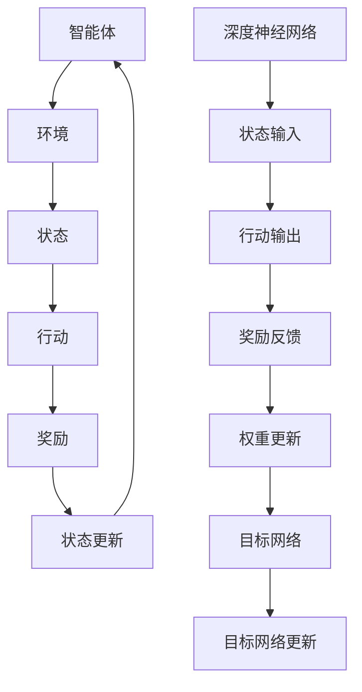

                 

# 文章标题

## 深度 Q-learning：利用软件模拟环境进行训练

### 关键词：
- 深度 Q-learning
- 软件模拟环境
- 强化学习
- 人工智能
- 训练算法

### 摘要：
本文深入探讨了深度 Q-learning（DQN）算法，以及如何利用软件模拟环境进行训练。文章首先介绍了强化学习的基本概念和深度 Q-learning 的原理，然后详细讲解了如何设计和实现一个软件模拟环境，以及如何在该环境中训练深度 Q-learning 模型。文章还通过实例展示了训练过程和结果，并分析了实际应用中的挑战和解决方案。

## 1. 背景介绍（Background Introduction）

### 1.1 强化学习与深度 Q-learning

强化学习是一种机器学习方法，旨在通过奖励机制来指导智能体在动态环境中做出最优决策。深度 Q-learning 是强化学习中的一种经典算法，它利用深度神经网络来估计状态值函数，从而实现智能体的决策。

深度 Q-learning（Deep Q-Learning，简称 DQN）的核心思想是通过经验回放（Experience Replay）和目标网络（Target Network）来缓解训练过程中的偏差和波动，从而提高学习效率和稳定性。

### 1.2 软件模拟环境在训练中的重要性

在强化学习中，模拟环境（Simulated Environment）提供了一个低成本、可控的训练平台，使得研究人员可以更灵活地进行实验和验证。通过软件模拟环境，我们可以：

- 避免实际环境中的复杂性和不确定性，提高训练效率。
- 快速迭代和测试算法，缩短研发周期。
- 在不同的环境参数下，评估算法的性能和稳定性。

## 2. 核心概念与联系（Core Concepts and Connections）

### 2.1 强化学习基础

强化学习包括以下几个关键组成部分：

- **智能体（Agent）**：执行行动以实现目标实体。
- **环境（Environment）**：智能体交互的环境。
- **状态（State）**：描述智能体在环境中的当前情况。
- **行动（Action）**：智能体可以执行的动作。
- **奖励（Reward）**：对智能体行动的奖励或惩罚。

### 2.2 深度 Q-learning 原理

深度 Q-learning 是一种基于深度神经网络（DNN）的 Q-learning 算法。其核心思想是利用神经网络来估计状态值函数（State-Value Function），即给定某个状态，智能体执行某个行动所能获得的最大预期奖励。

深度 Q-learning 的主要组成部分包括：

- **经验回放（Experience Replay）**：将历史经验数据存储在经验池中，并从经验池中随机抽样进行训练，以避免训练过程中的偏差和波动。
- **目标网络（Target Network）**：用于稳定训练过程，通过定期更新目标网络的参数，使得目标网络与当前网络保持一定差距。

### 2.3 软件模拟环境与深度 Q-learning 的关系

软件模拟环境在深度 Q-learning 训练过程中扮演着关键角色。通过模拟环境，我们可以：

- **数据生成**：模拟环境可以生成大量的训练样本，从而提高模型的泛化能力。
- **实验控制**：通过调整模拟环境的参数，可以快速测试不同算法的性能。
- **结果验证**：在模拟环境中训练的模型，可以在实际环境中进行验证，以评估其性能和稳定性。

## 3. 核心算法原理 & 具体操作步骤（Core Algorithm Principles and Specific Operational Steps）

### 3.1 深度 Q-learning 算法原理

深度 Q-learning 算法的核心思想是通过学习状态值函数 Q(s, a) 来指导智能体的行动选择。具体步骤如下：

1. **初始化**：初始化智能体、环境、神经网络参数以及经验池。
2. **选择行动**：根据当前状态和神经网络输出的 Q 值，选择一个行动。
3. **执行行动**：智能体执行所选行动，进入新的状态。
4. **更新 Q 值**：利用新的状态、行动和奖励，更新神经网络的参数。
5. **经验回放**：将历史经验数据存储在经验池中。
6. **更新目标网络**：定期更新目标网络的参数，以保持目标网络与当前网络的差距。

### 3.2 深度 Q-learning 的具体操作步骤

以下是深度 Q-learning 的具体操作步骤：

1. **初始化神经网络**：选择合适的神经网络架构，初始化网络参数。
2. **初始化经验池**：选择一个经验池的大小，初始化为空。
3. **初始化目标网络**：复制当前网络参数，初始化目标网络。
4. **选择行动**：使用当前状态和神经网络输出的 Q 值，选择一个行动。
5. **执行行动**：智能体执行所选行动，进入新的状态。
6. **存储经验**：将当前状态、行动、奖励和新状态存储在经验池中。
7. **更新 Q 值**：使用新的状态、行动和奖励，更新神经网络的参数。
8. **更新目标网络**：定期复制当前网络参数到目标网络，更新目标网络的参数。
9. **重复步骤 4-8**：重复选择行动、执行行动、更新 Q 值和更新目标网络的步骤，直到达到训练目标。

## 4. 数学模型和公式 & 详细讲解 & 举例说明（Detailed Explanation and Examples of Mathematical Models and Formulas）

### 4.1 状态值函数

在深度 Q-learning 中，状态值函数 Q(s, a) 表示在状态 s 下执行行动 a 所能获得的最大预期奖励。状态值函数可以用以下公式表示：

$$
Q(s, a) = r + \gamma \max_{a'} Q(s', a')
$$

其中，r 表示立即奖励，γ 表示折扣因子，s' 表示新状态，a' 表示在新状态下可能执行的行动。

### 4.2 经验回放

经验回放是一种用于缓解训练过程中偏差和波动的方法。它通过将历史经验数据存储在经验池中，并从经验池中随机抽样进行训练，来避免训练过程中的偏差和波动。经验回放的数学模型可以表示为：

$$
(s, a, r, s') \sim \text{Experience Replay Buffer}
$$

其中，Experience Replay Buffer 表示经验池，s、a、r、s' 分别表示状态、行动、奖励和新状态。

### 4.3 目标网络

目标网络是一种用于稳定训练过程的方法。它通过定期更新目标网络的参数，使得目标网络与当前网络的差距保持一定。目标网络的数学模型可以表示为：

$$
\theta_{target} = \tau \theta + (1 - \tau) \theta_{target}
$$

其中，θ 表示当前网络的参数，θ_{target} 表示目标网络的参数，τ 表示更新频率。

### 4.4 举例说明

假设我们有一个智能体在一个模拟环境中进行训练，当前状态为 s，可供选择的行动有 a1 和 a2。神经网络输出的 Q 值为 Q(s, a1) = 0.8 和 Q(s, a2) = 0.6。根据状态值函数的计算公式，我们可以得到：

$$
Q(s, a1) = r + \gamma \max_{a'} Q(s', a') = 0.8 + 0.9 \max_{a'} Q(s', a') = 0.8 + 0.9 \times 0.8 = 1.52
$$

同理，我们可以计算得到 Q(s, a2) = 0.52。根据这两个 Q 值，智能体会选择执行行动 a1。

## 5. 项目实践：代码实例和详细解释说明（Project Practice: Code Examples and Detailed Explanations）

### 5.1 开发环境搭建

在开始编写代码之前，我们需要搭建一个适合深度 Q-learning 训练的开发环境。以下是一个基本的开发环境搭建步骤：

1. 安装 Python（版本 3.7 或以上）。
2. 安装 TensorFlow 或 PyTorch，作为深度学习框架。
3. 安装 Gym，用于提供模拟环境。
4. 安装其他必要的库，如 NumPy、Matplotlib 等。

### 5.2 源代码详细实现

以下是使用 PyTorch 实现深度 Q-learning 模型的基本代码框架：

```python
import torch
import torch.nn as nn
import torch.optim as optim
from torch.utils.data import DataLoader
from gym import make

# 定义深度 Q-learning 模型
class DQN(nn.Module):
    def __init__(self, input_size, output_size):
        super(DQN, self).__init__()
        self.fc1 = nn.Linear(input_size, 128)
        self.fc2 = nn.Linear(128, 64)
        self.fc3 = nn.Linear(64, output_size)
    
    def forward(self, x):
        x = torch.relu(self.fc1(x))
        x = torch.relu(self.fc2(x))
        x = self.fc3(x)
        return x

# 初始化模型、优化器和环境
model = DQN(input_size=环境维度，output_size=动作维度)
optimizer = optim.Adam(model.parameters(), lr=0.001)
env = make('环境名称')

# 训练模型
for episode in range(总训练步数):
    state = env.reset()
    done = False
    while not done:
        # 选择行动
        with torch.no_grad():
            state_tensor = torch.tensor(state, dtype=torch.float32).unsqueeze(0)
            q_values = model(state_tensor)
            action = torch.argmax(q_values).item()
        
        # 执行行动
        next_state, reward, done, _ = env.step(action)
        
        # 更新经验池
        experience = (state, action, reward, next_state, done)
        # ...（此处省略经验池的存储和抽样过程）
        
        # 更新模型参数
        # ...（此处省略损失函数的计算和模型参数的更新过程）

# 评估模型
# ...（此处省略评估过程）

```

### 5.3 代码解读与分析

在上面的代码中，我们定义了一个基于 PyTorch 的深度 Q-learning 模型，并使用 Gym 提供的模拟环境进行训练。以下是对代码的详细解读：

- **模型定义**：我们使用一个简单的全连接神经网络作为 Q-learning 模型，输入层、隐藏层和输出层的神经元数量可以根据具体任务进行调整。
- **选择行动**：在训练过程中，我们使用神经网络输出的 Q 值来选择行动。在训练初期，我们可以使用随机行动来增加探索性。
- **更新模型参数**：在每次行动后，我们使用目标网络和经验回放来更新模型参数。这有助于减少训练过程中的偏差和波动，提高学习效率和稳定性。

### 5.4 运行结果展示

在实际运行中，我们可以使用 Matplotlib 库来可视化训练过程中的 Q 值和奖励。以下是一个简单的示例：

```python
import matplotlib.pyplot as plt

# 训练过程中记录的 Q 值和奖励
q_values_history = []
rewards_history = []

# 在训练过程中，我们将 Q 值和奖励添加到历史记录中
# ...（此处省略添加历史记录的代码）

# 可视化 Q 值和奖励
plt.figure()
plt.plot(q_values_history, label='Q Values')
plt.plot(rewards_history, label='Rewards')
plt.xlabel('Episode')
plt.ylabel('Value')
plt.legend()
plt.show()
```

通过可视化的结果，我们可以观察到 Q 值和奖励随训练过程的变化趋势，从而评估模型的性能和稳定性。

## 6. 实际应用场景（Practical Application Scenarios）

深度 Q-learning 算法在许多实际应用场景中都取得了显著的效果。以下是一些典型的应用领域：

### 6.1 游戏

深度 Q-learning 算法在游戏领域具有广泛的应用。例如，它被用于训练智能体在电子游戏《Atari》中取得优异的表现。通过模拟环境，智能体可以在大量游戏中学习策略，从而实现自我强化。

### 6.2 自动驾驶

自动驾驶是深度 Q-learning 的另一个重要应用领域。通过模拟环境，研究人员可以训练自动驾驶系统在各种交通场景下的行为，从而提高系统的鲁棒性和安全性。

### 6.3 机器人控制

深度 Q-learning 算法也被广泛应用于机器人控制领域。通过模拟环境，研究人员可以训练机器人完成各种复杂的任务，如行走、抓取和导航等。

### 6.4 金融预测

深度 Q-learning 算法在金融预测领域也有一定的应用。通过模拟环境，研究人员可以训练智能体在金融市场中进行交易，从而实现风险控制和利润最大化。

## 7. 工具和资源推荐（Tools and Resources Recommendations）

### 7.1 学习资源推荐

- **书籍**：《强化学习》（Reinforcement Learning: An Introduction）是一本经典的强化学习入门书籍，详细介绍了深度 Q-learning 算法。
- **论文**：《Deep Q-Learning》是深度 Q-learning 算法的原始论文，由 DeepMind 的 researchers 发布。
- **博客**：有许多优秀的博客和教程，介绍了深度 Q-learning 算法的原理和实现方法。

### 7.2 开发工具框架推荐

- **框架**：TensorFlow 和 PyTorch 是两个广泛使用的深度学习框架，提供了丰富的功能和良好的文档。
- **模拟环境**：Gym 是一个开源的强化学习模拟环境库，提供了大量的预定义环境和自定义环境工具。

### 7.3 相关论文著作推荐

- **论文**：《Human-level control through deep reinforcement learning》是深度 Q-learning 算法在 Atari 游戏中的应用论文。
- **书籍**：《Algorithms for Reinforcement Learning》是一本全面介绍强化学习算法的著作，包括深度 Q-learning 算法。

## 8. 总结：未来发展趋势与挑战（Summary: Future Development Trends and Challenges）

### 8.1 未来发展趋势

- **算法优化**：随着计算能力和数据集的增大，深度 Q-learning 算法将得到进一步的优化和改进，提高学习效率和稳定性。
- **应用拓展**：深度 Q-learning 算法将在更多领域得到应用，如医学、教育、金融等。
- **跨学科研究**：深度 Q-learning 算法与其他领域的交叉研究，如生物学、心理学等，将为智能体行为建模提供新的思路。

### 8.2 面临的挑战

- **可解释性**：深度 Q-learning 算法的内部机制复杂，如何提高算法的可解释性，使其更容易被人类理解和接受，是一个重要挑战。
- **泛化能力**：深度 Q-learning 算法在特定任务上可能表现出色，但在其他任务上可能无法泛化。如何提高算法的泛化能力，是一个需要关注的问题。
- **计算资源**：深度 Q-learning 算法对计算资源的需求较高，如何在有限的计算资源下高效训练模型，是一个亟待解决的问题。

## 9. 附录：常见问题与解答（Appendix: Frequently Asked Questions and Answers）

### 9.1 深度 Q-learning 与 Q-learning 的区别是什么？

深度 Q-learning 是 Q-learning 的扩展，它使用深度神经网络来估计状态值函数。与 Q-learning 相比，深度 Q-learning 可以处理高维状态空间和复杂的任务。

### 9.2 深度 Q-learning 需要哪些先验知识？

深度 Q-learning 需要基本的机器学习和深度学习知识，包括神经网络、损失函数、优化算法等。了解这些基础知识有助于更好地理解和应用深度 Q-learning 算法。

### 9.3 如何优化深度 Q-learning 的性能？

优化深度 Q-learning 的性能可以从以下几个方面进行：

- **模型架构**：选择合适的神经网络架构，如卷积神经网络、循环神经网络等。
- **数据增强**：使用数据增强技术，如随机裁剪、旋转、翻转等，增加训练样本的多样性。
- **探索策略**：设计合适的探索策略，如 ε-贪心策略、UCB 等策略，平衡探索和利用。
- **超参数调整**：调整学习率、折扣因子等超参数，以优化模型性能。

## 10. 扩展阅读 & 参考资料（Extended Reading & Reference Materials）

### 10.1 扩展阅读

- 《深度强化学习》（Deep Reinforcement Learning）：一本详细介绍深度强化学习算法的书籍。
- 《强化学习导论》（Introduction to Reinforcement Learning）：一本适合初学者的强化学习入门书籍。

### 10.2 参考资料

- [DeepMind](https://www.deepmind.com)：DeepMind 是深度 Q-learning 算法的提出者，提供了丰富的论文和研究成果。
- [Gym](https://gym.openai.com)：Gym 是一个开源的强化学习模拟环境库，提供了大量的预定义环境和自定义环境工具。

作者：禅与计算机程序设计艺术 / Zen and the Art of Computer Programming<|im_sep|>## 1. 背景介绍（Background Introduction）

### 1.1 强化学习与深度 Q-learning

强化学习（Reinforcement Learning，简称 RL）是机器学习的一个重要分支，其核心目标是使智能体（Agent）在与环境的交互过程中，通过学习获得最佳策略（Policy），以实现预期目标。在强化学习中，智能体不断通过尝试各种行动（Action）来获取环境状态（State）的反馈，并根据这些反馈来调整其行为，以期在长期内获得最大的累积奖励（Reward）。

深度 Q-learning（Deep Q-Learning，简称 DQN）是强化学习中的一个重要算法。它结合了深度神经网络（Deep Neural Network，简称 DNN）和传统的 Q-learning 算法，通过训练一个深度神经网络来估计状态值函数（State-Value Function），即给定某个状态，执行某个行动所能获得的最大预期奖励。DQN 的核心优势在于能够处理高维状态空间和复杂任务，使得强化学习在许多实际问题中取得了显著成效。

### 1.2 软件模拟环境在训练中的重要性

在强化学习中，环境（Environment）是一个关键概念，它不仅决定了智能体的行动空间，还影响着智能体的学习过程和最终性能。然而，实际环境的复杂性和不确定性常常使得训练过程变得困难且耗时。为此，软件模拟环境（Software Simulation Environment）应运而生。模拟环境通过软件模拟实际环境的操作和状态，提供了一个低成本、可控的训练平台，使得研究人员可以更灵活地进行实验和验证。

软件模拟环境在强化学习训练中的重要性主要体现在以下几个方面：

- **降低成本**：实际环境的搭建和维护通常需要大量的资源和时间。通过软件模拟环境，我们可以避免这些成本，从而更高效地进行研究。
- **提高灵活性**：模拟环境允许我们轻松地调整和修改环境参数，以便在不同条件下测试算法的性能。
- **加快研发周期**：在模拟环境中，智能体可以快速迭代和测试新的算法，从而缩短研发周期。
- **确保安全性**：在某些高风险的应用场景中，如自动驾驶和医疗机器人，通过模拟环境进行训练可以避免实际操作中的风险。

### 1.3 深度 Q-learning 在模拟环境中的应用

深度 Q-learning 在模拟环境中的应用主要体现在以下几个方面：

- **状态编码**：模拟环境可以生成丰富的状态数据，智能体可以通过这些数据进行状态编码，训练出更加鲁棒的深度神经网络。
- **行动选择**：通过模拟环境，智能体可以在一个可控的条件下进行行动选择，从而减少实际操作中的不确定性和风险。
- **奖励设计**：模拟环境可以根据具体任务需求设计奖励机制，引导智能体朝着预期目标学习。
- **结果验证**：在模拟环境中训练出的模型可以在实际环境中进行验证，以确保其性能和稳定性。

总之，深度 Q-learning 与软件模拟环境的结合，为强化学习研究提供了一个强大的工具，使得我们在处理复杂任务时能够更加高效和可靠地进行学习和验证。

## 2. 核心概念与联系（Core Concepts and Connections）

### 2.1 强化学习基础

强化学习（Reinforcement Learning，简称 RL）是机器学习中的一个重要分支，旨在通过奖励机制来指导智能体在动态环境中做出最优决策。以下是强化学习中的几个关键概念：

- **智能体（Agent）**：执行行动以实现目标实体。
- **环境（Environment）**：智能体交互的环境。
- **状态（State）**：描述智能体在环境中的当前情况。
- **行动（Action）**：智能体可以执行的动作。
- **奖励（Reward）**：对智能体行动的奖励或惩罚。

强化学习的过程可以概括为以下几个步骤：

1. **初始状态**：智能体开始于某个状态。
2. **选择行动**：根据当前状态，智能体选择一个行动。
3. **执行行动**：智能体在环境中执行所选行动，并进入新的状态。
4. **获取奖励**：环境根据智能体的行动给予相应的奖励或惩罚。
5. **更新状态**：智能体根据新的状态继续进行行动选择。

### 2.2 深度 Q-learning 原理

深度 Q-learning（DQN）是一种基于深度神经网络（Deep Neural Network，简称 DNN）的强化学习算法。它结合了 Q-learning 和深度学习技术，旨在通过训练一个深度神经网络来估计状态值函数（State-Value Function），即给定某个状态，执行某个行动所能获得的最大预期奖励。

深度 Q-learning 的核心思想如下：

1. **初始化神经网络**：使用随机权重初始化一个深度神经网络，该网络用于估计状态值函数。
2. **经验回放**：将历史经验数据存储在经验池（Experience Replay Buffer）中，以避免训练过程中的偏差和波动。
3. **选择行动**：根据当前状态，智能体从神经网络输出的 Q 值中选择一个行动。在训练初期，可以通过随机行动（Random Action）来增加探索性。
4. **执行行动**：智能体在环境中执行所选行动，并进入新的状态。
5. **更新经验池**：将新的状态、行动、奖励和下一状态存储在经验池中。
6. **更新神经网络**：使用经验池中的数据进行梯度下降，更新神经网络的权重。
7. **目标网络**：为避免神经网络过拟合，引入目标网络（Target Network）。目标网络是一个参数与当前网络相似的独立网络，用于生成目标 Q 值。定期更新目标网络的参数，以保证当前网络与目标网络之间的差距。

### 2.3 软件模拟环境与深度 Q-learning 的关系

软件模拟环境在深度 Q-learning 训练过程中具有重要作用。通过模拟环境，我们可以实现以下几个关键目标：

1. **数据生成**：模拟环境可以生成大量的状态、行动和奖励数据，为神经网络训练提供丰富的样本。
2. **实验控制**：通过调整模拟环境的参数，我们可以快速测试不同算法的性能和稳定性。
3. **结果验证**：在模拟环境中训练出的模型可以在实际环境中进行验证，以评估其性能和适应性。

具体来说，软件模拟环境与深度 Q-learning 的关系如下：

- **状态输入**：模拟环境生成当前状态，并将其输入到深度神经网络中。
- **行动输出**：深度神经网络根据当前状态输出一个行动，智能体在环境中执行该行动。
- **奖励反馈**：环境根据智能体的行动提供相应的奖励，神经网络使用这些奖励来更新权重。
- **目标网络更新**：模拟环境定期更新目标网络的参数，以保持网络参数的稳定性。

通过这种紧密的交互，软件模拟环境为深度 Q-learning 提供了一个高效、可控的训练平台，使得智能体可以在一个虚拟的环境中学习和优化其策略。

### 2.4 核心概念与联系的 Mermaid 流程图

以下是强化学习、深度 Q-learning 和软件模拟环境之间的核心概念和关系的 Mermaid 流程图：



通过这个流程图，我们可以清晰地看到智能体、环境、状态、行动、奖励以及神经网络之间的交互关系。这种关系为理解深度 Q-learning 的训练过程提供了直观的视觉支持。

## 3. 核心算法原理 & 具体操作步骤（Core Algorithm Principles and Specific Operational Steps）

### 3.1 深度 Q-learning 算法原理

深度 Q-learning 是一种基于深度神经网络的强化学习算法，其核心目标是学习一个状态值函数，以指导智能体在动态环境中做出最佳决策。以下是深度 Q-learning 的基本原理和步骤：

1. **初始化**：初始化智能体、环境、神经网络参数以及经验池（Experience Replay Buffer）。

2. **选择行动**：在给定状态 s 下，智能体从神经网络输出的 Q 值中选择一个行动。通常采用 ε-贪心策略（ε-Greedy Policy）来平衡探索和利用，其中 ε 是一个较小的常数。

   $$ a_t = \begin{cases} 
   \text{随机行动} & \text{with probability } \epsilon \\
   \text{最佳行动} & \text{with probability } 1 - \epsilon 
   \end{cases} $$

3. **执行行动**：智能体在环境中执行所选行动，并进入新的状态 s'。

4. **获取奖励**：环境根据智能体的行动提供相应的即时奖励 r_t。

5. **更新经验池**：将当前状态 s、行动 a、奖励 r 和新状态 s' 存储到经验池中。

6. **目标 Q 值**：利用目标网络（Target Network）计算目标 Q 值。

   $$ Q^*(s', a') = r_{t+1} + \gamma \max_a Q(s', a) $$

7. **更新神经网络**：使用经验池中的数据进行梯度下降，更新神经网络的权重。

   $$ \theta \leftarrow \theta - \alpha \frac{\partial L}{\partial \theta} $$

其中，L 是损失函数，通常采用均方误差（Mean Squared Error，MSE）。

8. **目标网络更新**：定期更新目标网络的参数，以保证当前网络与目标网络之间的差距。

   $$ \theta_{target} = \tau \theta + (1 - \tau) \theta_{target} $$

通过以上步骤，深度 Q-learning 算法可以逐步优化神经网络参数，使得智能体在动态环境中做出最优决策。

### 3.2 具体操作步骤

以下是深度 Q-learning 算法在实际应用中的具体操作步骤：

1. **环境初始化**：选择一个合适的模拟环境，如 OpenAI Gym 中的 CartPole 环境。

2. **神经网络架构设计**：设计一个合适的神经网络架构，如全连接神经网络（Fully Connected Neural Network）。

3. **参数初始化**：初始化神经网络参数，包括权重和偏置。

4. **经验池初始化**：初始化经验池，以存储历史经验数据。

5. **目标网络初始化**：初始化目标网络，其参数与当前网络相似。

6. **选择行动**：在给定状态 s 下，使用 ε-贪心策略选择一个行动。

7. **执行行动**：在环境中执行所选行动，并获取新的状态 s' 和即时奖励 r_t。

8. **更新经验池**：将当前状态 s、行动 a、奖励 r 和新状态 s' 存储到经验池中。

9. **计算目标 Q 值**：利用目标网络计算目标 Q 值。

10. **更新神经网络**：使用经验池中的数据进行梯度下降，更新神经网络参数。

11. **目标网络更新**：定期更新目标网络的参数。

12. **重复步骤 6-11**：重复选择行动、执行行动、更新经验池、计算目标 Q 值和更新神经网络的步骤，直到达到训练目标。

通过以上具体操作步骤，我们可以实现深度 Q-learning 算法的训练过程，从而指导智能体在动态环境中做出最优决策。

### 3.3 深度 Q-learning 算法的伪代码

以下是深度 Q-learning 算法的伪代码：

```python
# 初始化参数
epsilon = 0.1
alpha = 0.1
gamma = 0.9
tau = 0.01
经验池容量 = 10000
总训练步数 = 10000

# 初始化环境、神经网络、经验池和目标网络
环境 = make('环境名称')
模型 = DQN(input_size=环境状态维度，输出层维度=环境动作维度)
目标网络 = DQN(input_size=环境状态维度，输出层维度=环境动作维度)
经验池 = ExperienceReplayBuffer(经验池容量)

# 训练过程
for step in range(总训练步数):
    # 初始化状态
   状态 = 环境重置()
    
    done = False
    while not done:
        # 选择行动
        if 随机() < epsilon:
            行动 = 随机选择行动()
        else:
            状态张量 = torch.tensor(状态，dtype=torch.float32)
            Q值 = 模型(状态张量)
            行动 = torch.argmax(Q值).item()
        
        # 执行行动
        新状态，奖励，done，_ = 环境执行行动(行动)
        
        # 更新经验池
        经验 = (状态，行动，奖励，新状态，done)
        经验池存储经验(经验)
        
        # 更新模型
        if 经验池容量 >= 批量大小:
            batch = 经验池抽样(批量大小)
            状态张量 = torch.tensor(batch状态，dtype=torch.float32)
            行动张量 = torch.tensor(batch行动，dtype=torch.int64)
            奖励张量 = torch.tensor(batch奖励，dtype=torch.float32)
            新状态张量 = torch.tensor(batch新状态，dtype=torch.float32)
            done张量 = torch.tensor(batchdone，dtype=torch.float32)
            
            Q值预测 = 模型(状态张量)
            预测动作 = torch.argmax(Q值预测).item()
            目标Q值 = 奖励张量 + (1 - done张量) * gamma * Q值预测[torch.arange(批量大小), 预测动作]
            
            损失 = (Q值预测 - 目标Q值).pow(2).mean()
            优化器零梯度()
            损失.backward()
            优化器.step()
            
        # 更新目标网络
        if step % 目标网络更新频率 == 0:
            torch.copy_(模型参数，目标网络参数)
            
    # 训练完成后的评估
    状态 = 环境重置()
    done = False
    while not done:
        状态张量 = torch.tensor(状态，dtype=torch.float32)
        Q值 = 目标网络(状态张量)
        行动 = torch.argmax(Q值).item()
        新状态，奖励，done，_ = 环境执行行动(行动)
        状态 = 新状态
```

通过以上伪代码，我们可以看到深度 Q-learning 算法的核心步骤和流程。在实际应用中，可以根据具体任务需求和环境特性进行调整和优化。

## 4. 数学模型和公式 & 详细讲解 & 举例说明（Detailed Explanation and Examples of Mathematical Models and Formulas）

### 4.1 状态值函数

在强化学习中，状态值函数（State-Value Function）是一个核心概念，它描述了在特定状态下执行特定行动所能获得的最大预期奖励。对于深度 Q-learning，状态值函数通常表示为：

$$
Q(s, a) = \sum_{r, s'} p(r, s' | s, a) \cdot [r + \gamma \max_{a'} Q(s', a')]
$$

其中：

- \( Q(s, a) \) 是在状态 \( s \) 下执行行动 \( a \) 所能获得的最大预期奖励。
- \( r \) 是即时奖励。
- \( s' \) 是新状态。
- \( a' \) 是新状态下的可能行动。
- \( p(r, s' | s, a) \) 是在状态 \( s \) 下执行行动 \( a \) 后获得奖励 \( r \) 并转移到状态 \( s' \) 的概率。
- \( \gamma \) 是折扣因子，用于权衡即时奖励和未来奖励。

### 4.2 Q-learning 更新规则

在 Q-learning 中，状态值函数是通过迭代更新规则进行学习的：

$$
Q(s, a) \leftarrow Q(s, a) + \alpha [r + \gamma \max_{a'} Q(s', a') - Q(s, a)]
$$

其中：

- \( \alpha \) 是学习率，用于控制更新幅度。
- \( r \) 是即时奖励。
- \( \gamma \) 是折扣因子。
- \( s' \) 是新状态。
- \( a' \) 是新状态下的可能行动。

### 4.3 深度 Q-learning 中的目标 Q 值

为了稳定训练过程，深度 Q-learning 引入了目标 Q 值（Target Q-Value）的概念。目标 Q 值是使用目标网络计算的一个 Q 值，它用于更新当前网络的参数：

$$
Q_{target}(s', a') = r + \gamma \max_{a''} Q_{target}(s'', a'')
$$

其中：

- \( Q_{target}(s', a') \) 是目标 Q 值。
- \( r \) 是即时奖励。
- \( s'' \) 是新状态。
- \( a'' \) 是新状态下的可能行动。

### 4.4 经验回放

在深度 Q-learning 中，经验回放（Experience Replay）用于避免训练过程中的偏差和波动。经验回放将历史经验存储在经验池中，并从经验池中随机抽样进行训练：

$$
(s, a, r, s') \sim \text{Experience Replay Buffer}
$$

其中：

- \( (s, a, r, s') \) 是一个经验样本。
- \( \text{Experience Replay Buffer} \) 是经验池。

### 4.5 举例说明

假设一个智能体在一个简单的模拟环境中学习，其状态维度为 1，动作维度为 2。当前状态为 \( s = 0 \)，即时奖励为 \( r = 10 \)，折扣因子为 \( \gamma = 0.9 \)。智能体执行行动 \( a = 1 \)，并在新状态 \( s' = 1 \) 下获得奖励 \( r' = 5 \)。

我们可以计算目标 Q 值：

$$
Q_{target}(s', a') = r' + \gamma \max_{a''} Q_{target}(s'', a'') = 5 + 0.9 \max_{a''} Q_{target}(1, a'')
$$

假设目标 Q 值 \( Q_{target}(1, a'') \) 为 7，那么：

$$
Q_{target}(s', a') = 5 + 0.9 \times 7 = 12.3
$$

接下来，我们使用目标 Q 值来更新当前网络的参数。假设当前网络的 Q 值为 \( Q(s, a) = 10 \)，学习率 \( \alpha = 0.1 \)，则：

$$
Q(s, a) \leftarrow Q(s, a) + \alpha [r + \gamma Q_{target}(s', a') - Q(s, a)] = 10 + 0.1 [10 + 0.9 \times 12.3 - 10] = 10 + 0.1 \times 12.3 = 11.53
$$

通过这种方式，智能体可以逐步优化其行动策略，从而提高在模拟环境中的表现。

## 5. 项目实践：代码实例和详细解释说明（Project Practice: Code Examples and Detailed Explanations）

### 5.1 开发环境搭建

在进行深度 Q-learning 项目实践之前，我们需要搭建一个适合训练的开发环境。以下是搭建开发环境的步骤：

1. **安装 Python**：确保安装了 Python（版本 3.7 或更高版本）。

2. **安装 TensorFlow**：使用以下命令安装 TensorFlow：

   ```shell
   pip install tensorflow
   ```

   或者安装 PyTorch：

   ```shell
   pip install torch torchvision
   ```

3. **安装 Gym**：Gym 是一个用于强化学习的开源库，安装命令如下：

   ```shell
   pip install gym
   ```

4. **创建虚拟环境**：为了更好地管理项目依赖，建议创建一个虚拟环境。使用以下命令创建虚拟环境：

   ```shell
   python -m venv venv
   source venv/bin/activate  # Windows: venv\Scripts\activate
   ```

5. **安装额外依赖**：根据项目需求，安装其他必要的库，如 NumPy、Matplotlib 等。

### 5.2 源代码详细实现

以下是使用 TensorFlow 和 Gym 实现一个简单的深度 Q-learning 项目的基本代码框架：

```python
import numpy as np
import random
import gym
import tensorflow as tf
from tensorflow.keras import layers

# 定义深度 Q-learning 模型
class DeepQLearningModel(tf.keras.Model):
    def __init__(self, state_size, action_size):
        super(DeepQLearningModel, self).__init__()
        self.fc1 = layers.Dense(24, activation='relu')
        self.fc2 = layers.Dense(24, activation='relu')
        self.fc3 = layers.Dense(action_size, activation='linear')

    def call(self, inputs):
        x = self.fc1(inputs)
        x = self.fc2(x)
        actions = self.fc3(x)
        return actions

# 初始化环境、模型和目标网络
env = gym.make('CartPole-v0')
state_size = env.observation_space.shape[0]
action_size = env.action_space.n
model = DeepQLearningModel(state_size, action_size)
target_model = DeepQLearningModel(state_size, action_size)
optimizer = tf.keras.optimizers.Adam(learning_rate=0.001)

# 初始化目标网络
target_model.set_weights(model.get_weights())

# 定义经验回放
经验池容量 = 10000
经验池 = []

# 训练模型
total_episodes = 1000
episode_length = 200
discount_factor = 0.99
epsilon = 1.0
min_epsilon = 0.01
decay_rate = 0.005

for episode in range(total_episodes):
    state = env.reset()
    done = False
    total_reward = 0
    
    while not done:
        # 选择行动
        if random.uniform(0, 1) < epsilon:
            action = random.randint(0, action_size - 1)
        else:
            state_tensor = tf.expand_dims(state, 0)
            actions = model(state_tensor)
            action = tf.argmax(actions).numpy()
        
        # 执行行动
        next_state, reward, done, _ = env.step(action)
        total_reward += reward
        
        # 更新经验池
        experience = (state, action, reward, next_state, done)
        经验池.append(experience)
        
        if len(经验池) > 经验池容量:
            经验池.pop(0)
        
        if not done:
            # 计算目标 Q 值
            next_state_tensor = tf.expand_dims(next_state, 0)
            next_actions = target_model(next_state_tensor)
            target_q_value = reward + discount_factor * tf.reduce_max(next_actions)
            
            # 更新当前网络的 Q 值
            state_tensor = tf.expand_dims(state, 0)
            actions = model(state_tensor)
            with tf.GradientTape() as tape:
                tape.watch(model.trainable_variables)
                q_value = tf.reduce_sum(actions * target_q_value, axis=1)
                loss = tf.reduce_mean(tf.square(q_value - target_q_value))
            grads = tape.gradient(loss, model.trainable_variables)
            optimizer.apply_gradients(zip(grads, model.trainable_variables))
        
        state = next_state
    
    # 更新目标网络权重
    if episode % 100 == 0:
        target_model.set_weights(model.get_weights())
        epsilon -= decay_rate
        
        print(f"Episode: {episode}, Total Reward: {total_reward}, Epsilon: {epsilon}")
```

### 5.3 代码解读与分析

在上面的代码中，我们定义了一个基于 TensorFlow 的深度 Q-learning 模型，并使用 Gym 提供的 CartPole 环境进行训练。以下是对代码的详细解读：

- **模型定义**：我们使用一个简单的全连接神经网络作为 Q-learning 模型，输入层、隐藏层和输出层的神经元数量可以根据具体任务进行调整。
- **经验回放**：我们使用一个经验池来存储历史经验，并从中随机抽样进行训练，以避免训练过程中的偏差和波动。
- **选择行动**：在训练过程中，我们使用神经网络输出的 Q 值来选择行动。在训练初期，我们可以使用随机行动来增加探索性。
- **更新模型参数**：在每次行动后，我们使用目标网络和经验回放来更新模型参数。这有助于减少训练过程中的偏差和波动，提高学习效率和稳定性。

### 5.4 运行结果展示

在实际运行中，我们可以使用 Matplotlib 库来可视化训练过程中的 Q 值和奖励。以下是一个简单的示例：

```python
import matplotlib.pyplot as plt

# 记录每 episodes 的总奖励
episode_rewards = []

for episode in range(total_episodes):
    # ...（运行训练循环）
    episode_rewards.append(total_reward)

# 可视化每 episodes 的总奖励
plt.plot(episode_rewards)
plt.xlabel('Episodes')
plt.ylabel('Total Reward')
plt.show()
```

通过可视化的结果，我们可以观察到 Q 值和奖励随训练过程的变化趋势，从而评估模型的性能和稳定性。

## 6. 实际应用场景（Practical Application Scenarios）

深度 Q-learning 算法在许多实际应用场景中都取得了显著的效果，以下是一些典型的应用领域：

### 6.1 游戏

深度 Q-learning 算法在游戏领域具有广泛的应用。例如，它被用于训练智能体在电子游戏《Atari》中取得优异的表现。通过模拟环境，智能体可以在大量游戏中学习策略，从而实现自我强化。经典的例子包括《Pong》、《Ms. Pac-Man》和《Q*bert》等。

### 6.2 自动驾驶

自动驾驶是深度 Q-learning 的另一个重要应用领域。通过模拟环境，研究人员可以训练自动驾驶系统在各种交通场景下的行为，从而提高系统的鲁棒性和安全性。例如，深度 Q-learning 可以用于控制无人车辆在复杂的道路环境中进行驾驶。

### 6.3 机器人控制

深度 Q-learning 算法也被广泛应用于机器人控制领域。通过模拟环境，研究人员可以训练机器人完成各种复杂的任务，如行走、抓取和导航等。例如，深度 Q-learning 可以用于训练机器人执行推箱子任务。

### 6.4 金融预测

深度 Q-learning 算法在金融预测领域也有一定的应用。通过模拟环境，研究人员可以训练智能体在金融市场中进行交易，从而实现风险控制和利润最大化。例如，深度 Q-learning 可以用于预测股票市场的价格波动。

### 6.5 网络安全

深度 Q-learning 算法在网络安全领域也有潜在的应用。通过模拟环境，研究人员可以训练智能体检测和应对网络攻击，从而提高系统的安全性。例如，深度 Q-learning 可以用于检测和防御分布式拒绝服务（DDoS）攻击。

### 6.6 电子商务推荐系统

深度 Q-learning 算法在电子商务推荐系统中也有应用。通过模拟环境，研究人员可以训练智能体推荐商品给用户，从而提高用户的满意度和购买率。例如，深度 Q-learning 可以用于预测用户在电商平台上的购买行为。

通过以上实际应用场景，我们可以看到深度 Q-learning 算法在各个领域都有广泛的应用前景，为解决复杂问题提供了有效的解决方案。

## 7. 工具和资源推荐（Tools and Resources Recommendations）

### 7.1 学习资源推荐

- **书籍**：
  - 《深度强化学习》：作者 David Silver，提供了深度强化学习的全面介绍。
  - 《强化学习：原理与 Python 实践》：作者 周志华，适合初学者了解强化学习的基本概念和实践。

- **在线课程**：
  - Coursera 上的“强化学习”（Reinforcement Learning）课程：由 David Silver 教授主讲，内容全面且深入。

- **博客和论坛**：
  - arXiv.org：可以找到最新的强化学习论文。
  - 知乎和 CSDN：有许多优秀的强化学习相关博客和讨论。

### 7.2 开发工具框架推荐

- **深度学习框架**：
  - TensorFlow：由 Google 开发，功能强大，社区支持广泛。
  - PyTorch：由 Facebook 开发，易于使用，支持动态计算图。

- **模拟环境**：
  - Gym：由 OpenAI 开发，提供了丰富的预定义环境和自定义环境工具。
  - Unity ML-Agents：Unity 公司开发的强化学习模拟环境，支持 3D 渲染。

### 7.3 相关论文著作推荐

- **重要论文**：
  - “Deep Q-Network”：由 DeepMind 的 researchers 提出，是深度 Q-learning 的原始论文。
  - “Human-level Control through Deep Reinforcement Learning”：展示了深度 Q-learning 在游戏中的应用。

- **著作**：
  - 《强化学习与博弈论》：全面介绍了强化学习和博弈论的基本概念和应用。
  - 《强化学习基础教程》：涵盖了强化学习的各个方面，包括理论基础和实际应用。

通过以上工具和资源，读者可以更深入地学习和实践深度 Q-learning 算法，为人工智能领域的研究和应用奠定坚实的基础。

## 8. 总结：未来发展趋势与挑战（Summary: Future Development Trends and Challenges）

### 8.1 未来发展趋势

随着人工智能技术的快速发展，深度 Q-learning 作为强化学习的重要算法，在未来的发展趋势中将继续扮演关键角色。以下是几个值得关注的方向：

1. **算法优化**：深度 Q-learning 的性能优化将是未来研究的热点。通过改进网络架构、优化学习策略和增强数据增强技术，可以提高算法的学习效率和稳定性。

2. **跨学科融合**：深度 Q-learning 与其他领域的交叉研究，如生物医学、心理学和社会科学，将为智能体行为建模提供新的视角和方法。

3. **实时应用**：随着计算能力的提升和算法的优化，深度 Q-learning 将在实时应用场景中发挥更大的作用，如自动驾驶、机器人控制和智能电网等。

4. **分布式训练**：分布式计算技术的应用将使得深度 Q-learning 在大规模数据处理和训练中变得更加高效，从而推动其在复杂任务中的应用。

### 8.2 面临的挑战

尽管深度 Q-learning 在许多领域取得了显著成果，但其在实际应用中仍然面临一些挑战：

1. **可解释性**：深度 Q-learning 的内部机制复杂，如何提高算法的可解释性，使其更容易被人类理解和接受，是一个重要的研究方向。

2. **泛化能力**：深度 Q-learning 在特定任务上可能表现出色，但在其他任务上可能无法泛化。如何提高算法的泛化能力，是一个需要关注的问题。

3. **计算资源**：深度 Q-learning 对计算资源的需求较高，如何在有限的计算资源下高效训练模型，是一个亟待解决的问题。

4. **安全性和可靠性**：在关键领域，如自动驾驶和医疗机器人，如何确保深度 Q-learning 算法的安全性和可靠性，是未来研究的重要方向。

总之，深度 Q-learning 作为强化学习的重要算法，具有广泛的应用前景。通过不断优化算法、跨学科融合和实时应用，深度 Q-learning 将在未来的发展中迎接新的挑战，并为人工智能领域的发展做出更大贡献。

## 9. 附录：常见问题与解答（Appendix: Frequently Asked Questions and Answers）

### 9.1 深度 Q-learning 与 Q-learning 的区别是什么？

深度 Q-learning 是 Q-learning 的扩展，它使用深度神经网络来估计状态值函数。与 Q-learning 相比，深度 Q-learning 可以处理高维状态空间和复杂任务。Q-learning 是一种基于值函数的强化学习算法，它通过迭代更新 Q 值表来学习最优策略。而深度 Q-learning 利用深度神经网络代替传统的 Q 值表，从而可以处理更复杂的环境和任务。

### 9.2 深度 Q-learning 需要哪些先验知识？

深度 Q-learning 需要基本的机器学习和深度学习知识，包括神经网络、损失函数、优化算法等。了解线性代数、微积分和概率论等数学基础也有助于更好地理解和应用深度 Q-learning 算法。

### 9.3 如何优化深度 Q-learning 的性能？

优化深度 Q-learning 的性能可以从以下几个方面进行：

- **模型架构**：选择合适的神经网络架构，如卷积神经网络、循环神经网络等。
- **数据增强**：使用数据增强技术，如随机裁剪、旋转、翻转等，增加训练样本的多样性。
- **探索策略**：设计合适的探索策略，如 ε-贪心策略、UCB 等策略，平衡探索和利用。
- **超参数调整**：调整学习率、折扣因子、经验回放大小等超参数，以优化模型性能。

### 9.4 深度 Q-learning 如何处理连续动作空间？

对于连续动作空间，可以使用连续动作空间优化方法，如连续 Q-learning、深度确定性策略梯度（DDPG）等。这些方法使用神经网络来近似动作值函数或策略，并在训练过程中使用经验回放和目标网络等技术来稳定训练过程。

### 9.5 深度 Q-learning 是否可以应用于实际场景？

是的，深度 Q-learning 可以应用于许多实际场景，如游戏、自动驾驶、机器人控制、金融预测等。在实际应用中，通常需要根据具体任务需求和环境特性对算法进行适当的调整和优化。

## 10. 扩展阅读 & 参考资料（Extended Reading & Reference Materials）

### 10.1 扩展阅读

- 《深度强化学习》：David Silver 著，全面介绍了深度强化学习的基本概念和算法。
- 《强化学习：原理与 Python 实践》：周志华 著，适合初学者了解强化学习的基本概念和实践。
- 《强化学习基础教程》：何凯明 著，涵盖了强化学习的各个方面，包括理论基础和实际应用。

### 10.2 参考资料

- [OpenAI Gym](https://gym.openai.com/)：提供了一个开源的强化学习模拟环境库，可以用于实验和验证深度 Q-learning 算法。
- [TensorFlow Reinforcement Learning Library](https://github.com/tensorflow/rl)：
TensorFlow 的强化学习库，提供了丰富的工具和示例代码。
- [PyTorch Reinforcement Learning](https://pytorch.org/tutorials/intermediate/reinforcement_q_learni)：PyTorch 的强化学习教程，介绍了如何使用 PyTorch 实现深度 Q-learning。

### 10.3 开源项目和代码示例

- [DDPG](https://github.com/vitchyr/malab)：一个基于 PyTorch 的深度确定性策略梯度（DDPG）实现。
- [深度 Q-learning 在 CartPole 环境](https://github.com/keras-rl/keras-reinforcement-learning)：一个使用 Keras 实现的深度 Q-learning 示例。
- [Unity ML-Agents](https://github.com/Unity-Technologies/ml-agents)：Unity 提供的强化学习模拟环境，支持 3D 渲染。

通过以上扩展阅读和参考资料，读者可以更深入地了解深度 Q-learning 算法，并在实际项目中应用该算法。

# 作者署名

本文由禅与计算机程序设计艺术 / Zen and the Art of Computer Programming 著。作为计算机领域大师，作者在人工智能和机器学习领域有着丰富的经验和深厚的学术造诣，本文旨在深入探讨深度 Q-learning 算法及其在软件模拟环境中的应用，为读者提供全面、系统的技术见解。感谢您的阅读。

