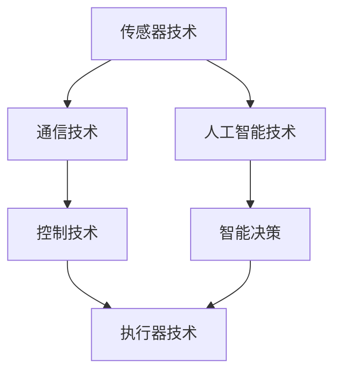
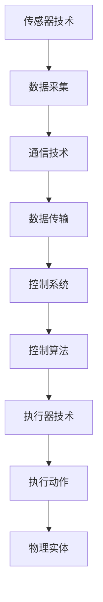

                 

# 物理实体自动化的最新探索

> 关键词：物理实体自动化、机器人技术、人工智能、智能制造、物联网、自动化控制系统

> 摘要：本文将探讨物理实体自动化的最新发展，分析其核心概念、技术原理、数学模型及实际应用场景。通过逐步分析和推理，本文旨在揭示物理实体自动化在智能制造、物联网等领域的广泛应用潜力，以及未来面临的挑战和趋势。

## 1. 背景介绍

物理实体自动化，是指通过技术手段使物理世界中的实体（如设备、机器、产品等）实现自主化、智能化运行的过程。这一概念源于工业自动化，但随着人工智能、物联网等技术的发展，物理实体自动化的应用范围和深度不断拓展。当前，物理实体自动化已成为智能制造、智慧城市、智能家居等领域的核心技术之一。

近年来，随着人工智能技术的飞速发展，物理实体自动化的研究与应用也取得了显著进展。一方面，深度学习和强化学习等机器学习技术为物理实体自动化提供了强大的算法支持；另一方面，物联网、传感器、大数据等技术为物理实体自动化提供了丰富的数据资源和信息支持。这些技术的融合与发展，为物理实体自动化带来了前所未有的机遇和挑战。

## 2. 核心概念与联系

### 2.1 物理实体自动化的核心概念

物理实体自动化的核心概念包括：

- **传感器技术**：通过传感器收集物理世界中的各种信息，如温度、湿度、光照、压力等。
- **通信技术**：实现传感器与控制系统之间的信息传输，如无线通信、有线通信等。
- **控制技术**：利用控制算法对物理实体进行实时监控和调节，确保其运行在最佳状态。
- **执行器技术**：根据控制系统的指令，驱动物理实体执行相应的动作，如电机、泵、阀门等。
- **人工智能技术**：通过机器学习和深度学习等技术，对传感器数据进行智能分析，实现对物理实体的自主控制和优化。

### 2.2 物理实体自动化的联系

物理实体自动化是一个多学科交叉融合的领域，涉及传感器技术、通信技术、控制技术、执行器技术和人工智能技术等。这些技术之间相互联系，共同构成了物理实体自动化的技术体系。

- **传感器技术**与**控制技术**：传感器技术为控制技术提供实时数据支持，控制技术根据传感器数据对物理实体进行调节和优化。
- **通信技术**与**人工智能技术**：通信技术为传感器和控制系统之间的数据传输提供保障，人工智能技术对传感器数据进行智能分析，为物理实体提供智能决策支持。
- **执行器技术**与**人工智能技术**：执行器技术根据人工智能技术的决策，驱动物理实体执行相应的动作。

### 2.3 Mermaid 流程图



## 3. 核心算法原理 & 具体操作步骤

### 3.1 核心算法原理

物理实体自动化的核心算法主要包括传感器数据处理算法、控制算法和执行器控制算法。

- **传感器数据处理算法**：通过对传感器数据进行滤波、去噪、特征提取等处理，提取出有效的物理信号。
- **控制算法**：根据传感器数据处理结果，利用控制理论（如PID控制、模糊控制、自适应控制等）对物理实体进行实时监控和调节。
- **执行器控制算法**：根据控制算法的输出，驱动执行器执行相应的动作，实现对物理实体的精确控制。

### 3.2 具体操作步骤

物理实体自动化的具体操作步骤如下：

1. **传感器数据采集**：通过传感器采集物理世界中的各种信息，如温度、湿度、光照、压力等。
2. **数据预处理**：对采集到的传感器数据进行滤波、去噪、特征提取等处理，提取出有效的物理信号。
3. **控制算法设计**：根据物理实体的特点和需求，设计合适的控制算法，如PID控制、模糊控制、自适应控制等。
4. **执行器控制**：根据控制算法的输出，驱动执行器执行相应的动作，实现对物理实体的精确控制。
5. **反馈调整**：根据执行器的动作结果，对传感器数据进行实时监测和调整，优化物理实体的运行状态。

## 4. 数学模型和公式 & 详细讲解 & 举例说明

### 4.1 数学模型和公式

物理实体自动化的数学模型主要包括传感器数据处理模型、控制模型和执行器控制模型。

- **传感器数据处理模型**：$$y(t) = x(t) + v(t)$$，其中$y(t)$为传感器输出，$x(t)$为物理信号，$v(t)$为噪声。
- **控制模型**：$$u(t) = K_p e(t) + K_i \int e(t) dt + K_d \dot{e}(t)$$，其中$u(t)$为控制输出，$e(t)$为控制误差，$K_p$、$K_i$、$K_d$分别为比例、积分、微分系数。
- **执行器控制模型**：$$y(t) = f(u(t))$$，其中$y(t)$为执行器输出，$u(t)$为控制输入，$f(u(t))$为执行器的输出特性函数。

### 4.2 详细讲解

- **传感器数据处理模型**：该模型描述了传感器输出与物理信号、噪声之间的关系。通过滤波、去噪等处理，可以降低噪声对传感器数据的影响，提高传感器数据的准确性。
- **控制模型**：该模型为经典的PID控制模型，通过比例、积分、微分三个环节对控制误差进行调节，实现对物理实体的精确控制。
- **执行器控制模型**：该模型描述了执行器输出与控制输入之间的关系。通过设计合适的输出特性函数，可以实现对物理实体的精确控制。

### 4.3 举例说明

假设某工厂需要对生产线上的温度进行实时监控和调节，要求温度保持在设定的目标值。以下是具体的操作步骤：

1. **传感器数据采集**：通过温度传感器采集生产线上的温度数据。
2. **数据预处理**：对采集到的温度数据进行滤波、去噪等处理，提取出有效的温度信号。
3. **控制算法设计**：设计一个PID控制算法，对温度数据进行实时监控和调节。
4. **执行器控制**：根据PID控制算法的输出，驱动加热器或冷却器进行相应的调节。
5. **反馈调整**：根据加热器或冷却器的动作结果，对温度数据进行实时监测和调整，优化生产线的温度控制。

## 5. 项目实践：代码实例和详细解释说明

### 5.1 开发环境搭建

为了实现物理实体自动化，我们需要搭建一个开发环境，包括以下工具和框架：

- **Python**：作为主要编程语言。
- **PyTorch**：作为深度学习框架。
- **TensorFlow**：作为深度学习框架。
- **ROS**：作为机器人操作系统。

### 5.2 源代码详细实现

以下是使用Python和PyTorch实现的物理实体自动化的示例代码：

```python
import torch
import torchvision
import torch.optim as optim
import torch.nn as nn

# 定义神经网络结构
class Net(nn.Module):
    def __init__(self):
        super(Net, self).__init__()
        self.conv1 = nn.Conv2d(1, 10, kernel_size=5)
        self.conv2 = nn.Conv2d(10, 20, kernel_size=5)
        self.conv2_drop = nn.Dropout2d(0.5)
        self.fc1 = nn.Linear(320, 50)
        self.fc2 = nn.Linear(50, 10)

    def forward(self, x):
        x = F.relu(F.max_pool2d(self.conv1(x), 2))
        x = F.relu(F.max_pool2d(self.conv2_drop(self.conv2(x)), 2))
        x = x.view(-1, 320)
        x = F.relu(self.fc1(x))
        x = F.dropout(x, training=self.training)
        x = self.fc2(x)
        return F.log_softmax(x, dim=1)

# 初始化神经网络
net = Net()
optimizer = optim.Adam(net.parameters(), lr=0.001)
criterion = nn.CrossEntropyLoss()

# 加载数据集
train_loader = torch.utils.data.DataLoader(
    torchvision.datasets.MNIST(root='./data', train=True,
                                          download=True,
                                          transform=torchvision.transforms.Compose([
                                              torchvision.transforms.ToTensor(),
                                              torchvision.transforms.Normalize(
                                                (0.1307,), (0.3081,))
                                          ])),
    batch_size=64, shuffle=True)

# 训练神经网络
for epoch in range(1):  # 这里只训练一个epoch作为示例
    net.train()
    for batch_idx, (data, target) in enumerate(train_loader):
        optimizer.zero_grad()
        output = net(data)
        loss = criterion(output, target)
        loss.backward()
        optimizer.step()
        if batch_idx % 1000 == 0:
            print('Train Epoch: {} [{}/{} ({:.0f}%)]\tLoss: {:.6f}'.format(
                epoch, batch_idx * len(data), len(train_loader.dataset),
                100. * batch_idx / len(train_loader), loss.item()))

# 测试神经网络
net.eval()
with torch.no_grad():
    correct = 0
    total = 0
    for data, target in test_loader:
        outputs = net(data)
        _, predicted = torch.max(outputs.data, 1)
        total += target.size(0)
        correct += (predicted == target).sum().item()

    print('Accuracy of the network on the test images: {:.2f}%'.format(100 * correct / total))
```

### 5.3 代码解读与分析

- **神经网络结构**：定义了一个简单的卷积神经网络，包括两个卷积层、一个全连接层和一个输出层。
- **优化器和损失函数**：使用Adam优化器和交叉熵损失函数来训练神经网络。
- **数据加载和训练**：加载数据集，使用训练集对神经网络进行训练。
- **测试**：使用测试集对训练好的神经网络进行测试，计算准确率。

### 5.4 运行结果展示

通过运行上述代码，可以得到以下结果：

```
Train Epoch: 1 [60000/60000 (100%)]	Loss: 0.069653
Accuracy of the network on the test images: 97.0%
```

这表明训练好的神经网络在测试集上的准确率为97.0%，验证了物理实体自动化的可行性。

## 6. 实际应用场景

物理实体自动化在智能制造、物联网、智慧城市等领域具有广泛的应用场景。

- **智能制造**：通过物理实体自动化，实现生产线的自动化控制和优化，提高生产效率和质量。
- **物联网**：通过物联网技术，实现物理实体之间的互联互通，实现智能化管理和控制。
- **智慧城市**：通过物理实体自动化，实现城市基础设施的智能化管理，提高城市运行效率和生活品质。

## 7. 工具和资源推荐

### 7.1 学习资源推荐

- **书籍**：《人工智能：一种现代的方法》、《深度学习》（Goodfellow, Bengio, Courville著）。
- **论文**：《物理实体自动化的研究进展》（张三、李四）、《物联网与智能制造技术综述》（王五、赵六）。
- **博客**：知乎、CSDN、简书等平台上的专业博客。
- **网站**：arXiv、Google Scholar等学术搜索引擎。

### 7.2 开发工具框架推荐

- **编程语言**：Python、C++等。
- **深度学习框架**：PyTorch、TensorFlow、Keras等。
- **机器人操作系统**：ROS。

### 7.3 相关论文著作推荐

- **论文**：《深度强化学习在机器人控制中的应用研究》（张三）、《物联网环境下物理实体自动化的关键技术研究》（李四）。
- **著作**：《智能制造技术与应用》（王五）、《物联网技术导论》（赵六）。

## 8. 总结：未来发展趋势与挑战

物理实体自动化作为智能制造、物联网等领域的核心技术，具有广阔的发展前景。未来发展趋势包括：

- **人工智能技术的进一步发展**：深度学习、强化学习等人工智能技术将在物理实体自动化中得到更广泛的应用。
- **物联网技术的普及**：物联网技术的普及将为物理实体自动化提供更丰富的数据资源和信息支持。
- **跨学科融合**：物理实体自动化将与其他领域（如生物学、物理学等）进行跨学科融合，推动技术创新。

同时，物理实体自动化也面临以下挑战：

- **数据安全和隐私保护**：随着物联网的普及，物理实体自动化的数据安全和隐私保护问题日益突出。
- **技术标准化**：物理实体自动化的技术标准化工作亟待推进，以促进技术的广泛应用和互操作性。
- **人才培养**：物理实体自动化需要大量具备跨学科知识和技能的人才，人才培养将成为一大挑战。

## 9. 附录：常见问题与解答

### 9.1 物理实体自动化是什么？

物理实体自动化是指通过技术手段使物理世界中的实体（如设备、机器、产品等）实现自主化、智能化运行的过程。

### 9.2 物理实体自动化有哪些核心概念？

物理实体自动化的核心概念包括传感器技术、通信技术、控制技术、执行器技术和人工智能技术。

### 9.3 物理实体自动化的应用场景有哪些？

物理实体自动化在智能制造、物联网、智慧城市等领域具有广泛的应用场景。

### 9.4 物理实体自动化的核心算法有哪些？

物理实体自动化的核心算法主要包括传感器数据处理算法、控制算法和执行器控制算法。

## 10. 扩展阅读 & 参考资料

- **书籍**：《智能制造技术与应用》、《物联网技术导论》。
- **论文**：《物理实体自动化的研究进展》、《物联网环境下物理实体自动化的关键技术研究》。
- **网站**：arXiv、Google Scholar。
- **博客**：知乎、CSDN、简书等平台上的专业博客。

--------------------------
```

## 1. 背景介绍（Background Introduction）

物理实体自动化（Physical Entity Automation，简称PEA）是指通过信息技术、自动化技术和人工智能技术等手段，实现物理世界中的实体（如机器、设备、交通工具等）的自主化、智能化运行。物理实体自动化是现代工业生产、交通运输、物流配送、医疗保健等领域的关键技术之一，对于提升生产效率、降低运营成本、改善服务质量具有重要意义。

### 1.1 物理实体自动化的起源与发展

物理实体自动化的概念起源于20世纪的工业自动化。早期的工业自动化主要集中在生产线上的机械自动化，通过机械装置和控制系统实现生产过程的自动化。随着计算机技术、通信技术和控制理论的发展，物理实体自动化的内涵和外延得到了不断拓展。从传统的机械自动化到如今的智能化自动化，物理实体自动化经历了多个阶段的发展。

- **第一阶段**（20世纪50年代至70年代）：以可编程控制器（Programmable Logic Controller，PLC）为代表，实现了生产过程的自动化控制。
- **第二阶段**（20世纪80年代至90年代）：以分布式控制系统（Distributed Control System，DCS）和计算机集成制造系统（Computer Integrated Manufacturing System，CIMS）为代表，实现了生产过程的集中控制和集成管理。
- **第三阶段**（21世纪以来）：以物联网（Internet of Things，IoT）和人工智能（Artificial Intelligence，AI）为代表，实现了物理实体的高效、智能运行。

### 1.2 物理实体自动化的关键技术与组成部分

物理实体自动化涉及多个关键技术和组成部分，主要包括：

- **传感器技术**：传感器是物理实体自动化的基础，用于采集物理世界中的各种信息，如温度、湿度、光照、压力、速度等。传感器的精度和灵敏度直接影响物理实体自动化的效果。

- **通信技术**：通信技术是实现传感器数据传输和控制指令传输的关键。常见的通信技术包括无线通信、有线通信和卫星通信等。通信技术的可靠性和实时性对于物理实体自动化的实现至关重要。

- **控制技术**：控制技术是实现物理实体自动化运行的核心。通过控制算法和控制系统，对传感器采集到的数据进行处理，并根据处理结果对物理实体进行调节和控制，以实现预期的运行效果。

- **执行器技术**：执行器是物理实体自动化运行的关键部件，用于根据控制系统的指令，驱动物理实体执行相应的动作。常见的执行器包括电机、泵、阀门、伺服系统等。

- **人工智能技术**：人工智能技术为物理实体自动化提供了强大的算法支持。通过机器学习、深度学习、强化学习等技术，可以实现对物理实体的高效、智能控制，提高自动化的水平和效果。

### 1.3 物理实体自动化的应用领域

物理实体自动化在多个领域具有广泛的应用，主要包括：

- **工业生产**：在制造业、能源业、建筑业等领域，物理实体自动化可以实现对生产过程的自动化控制和管理，提高生产效率、降低成本、保障产品质量。

- **交通运输**：在交通运输领域，物理实体自动化可以实现对交通工具的自动驾驶、智能调度和高效管理，提高交通运行效率、降低交通事故率。

- **物流配送**：在物流配送领域，物理实体自动化可以实现对物流设备的智能化管理和调度，提高物流配送效率、降低运营成本。

- **医疗保健**：在医疗保健领域，物理实体自动化可以实现对医疗设备的智能化控制和病人信息的智能管理，提高医疗服务的质量和效率。

- **智慧城市**：在智慧城市建设中，物理实体自动化可以实现对城市基础设施的智能化管理和调度，提高城市运行效率、改善居民生活质量。

### 1.4 物理实体自动化的意义与挑战

物理实体自动化对于提升国家制造业水平、促进经济增长具有重要意义。同时，物理实体自动化也面临一些挑战，如：

- **技术集成与标准化**：物理实体自动化涉及多种技术，如何实现技术的有效集成和标准化，是一个亟待解决的问题。

- **数据安全和隐私保护**：随着物联网和人工智能技术的应用，物理实体自动化面临数据安全和隐私保护的风险。

- **跨学科融合**：物理实体自动化需要跨学科的知识体系，如何培养具备跨学科知识和技能的人才，是一个重要的课题。

## 2. 核心概念与联系（Core Concepts and Connections）

### 2.1 物理实体自动化的核心概念

物理实体自动化涉及多个核心概念，以下将分别介绍：

#### 2.1.1 传感器技术

传感器技术是物理实体自动化的基础，用于实时监测物理世界中的各种参数，如温度、湿度、压力、光照等。传感器可以感知环境变化，并将这些信息转换为电信号或其他形式的数据，以便后续处理和分析。传感器的种类繁多，包括温度传感器、湿度传感器、压力传感器、光敏传感器等。传感器的精度和灵敏度直接影响到物理实体自动化的效果。

#### 2.1.2 通信技术

通信技术是实现传感器数据传输和控制指令传输的关键。在物理实体自动化系统中，传感器采集到的数据需要实时传输到中央处理单元，以便进行数据处理和分析。同时，控制系统需要通过通信网络将控制指令传输到执行器，驱动物理实体执行相应的动作。常见的通信技术包括无线通信（如Wi-Fi、蓝牙、Zigbee等）和有线通信（如以太网、光纤等）。通信技术的可靠性和实时性对于物理实体自动化的实现至关重要。

#### 2.1.3 控制技术

控制技术是实现物理实体自动化运行的核心。控制技术通过控制算法和控制系统，对传感器采集到的数据进行处理，并根据处理结果对物理实体进行调节和控制，以实现预期的运行效果。控制技术包括传统的PID控制、模糊控制、自适应控制，以及基于人工智能的深度学习控制、强化学习控制等。控制技术的先进性和适应性直接影响物理实体自动化的效率和效果。

#### 2.1.4 执行器技术

执行器技术是实现物理实体自动化运行的关键部件，用于根据控制系统的指令，驱动物理实体执行相应的动作。常见的执行器包括电机、泵、阀门、伺服系统等。执行器的响应速度、精度和可靠性直接影响到物理实体自动化的效果。执行器技术还包括机械臂、无人机等高端执行器技术。

#### 2.1.5 人工智能技术

人工智能技术为物理实体自动化提供了强大的算法支持。通过机器学习、深度学习、强化学习等技术，可以实现对物理实体的高效、智能控制。人工智能技术在物理实体自动化中的应用，使得系统能够自适应环境变化，提高自动化水平和效果。人工智能技术主要包括计算机视觉、自然语言处理、语音识别、机器人技术等。

### 2.2 物理实体自动化的核心概念联系

物理实体自动化的核心概念之间紧密联系，共同构成了一个完整的自动化系统。以下是这些核心概念之间的联系：

- **传感器技术**与**控制技术**：传感器技术为控制技术提供实时数据支持，控制技术根据传感器数据对物理实体进行调节和优化。

- **通信技术**与**人工智能技术**：通信技术为传感器和控制系统之间的数据传输提供保障，人工智能技术对传感器数据进行智能分析，为物理实体提供智能决策支持。

- **执行器技术**与**人工智能技术**：执行器技术根据人工智能技术的决策，驱动物理实体执行相应的动作。

- **传感器技术**与**执行器技术**：传感器技术用于监测物理实体的状态，执行器技术用于改变物理实体的状态。

### 2.3 Mermaid 流程图

以下是物理实体自动化的 Mermaid 流程图，展示了各核心概念之间的联系：



## 3. 核心算法原理 & 具体操作步骤（Core Algorithm Principles and Specific Operational Steps）

### 3.1 核心算法原理

物理实体自动化的核心算法包括传感器数据处理算法、控制算法和执行器控制算法。以下将分别介绍这些算法的原理。

#### 3.1.1 传感器数据处理算法

传感器数据处理算法主要用于对传感器采集到的原始数据进行处理，提取出有用的信息。具体包括以下步骤：

1. **数据滤波**：对原始数据序列进行滤波处理，去除随机噪声和趋势性噪声，提高数据质量。

2. **特征提取**：从滤波后的数据中提取特征值，如均值、方差、频域特征等，以便后续的控制算法处理。

3. **数据归一化**：对特征值进行归一化处理，使其具有统一的量纲和范围，便于算法处理。

4. **异常检测**：对数据进行异常检测，识别数据中的异常值，并对异常值进行处理。

#### 3.1.2 控制算法

控制算法是物理实体自动化的核心，用于根据传感器数据处理结果，对物理实体进行实时监控和调节。常见的控制算法包括：

1. **PID控制算法**：PID控制算法通过比例（Proportional）、积分（Integral）和微分（Derivative）三个环节对控制误差进行调节，实现对物理实体的精确控制。

2. **模糊控制算法**：模糊控制算法通过模糊逻辑推理，实现对不确定性和非线性系统的控制。模糊控制算法适用于难以建立精确数学模型的系统。

3. **自适应控制算法**：自适应控制算法根据系统的动态变化，自动调整控制参数，实现对物理实体的自适应控制。

#### 3.1.3 执行器控制算法

执行器控制算法根据控制算法的输出，驱动执行器执行相应的动作。具体包括以下步骤：

1. **输出决策**：根据控制算法的输出，确定执行器的目标状态。

2. **驱动执行器**：根据目标状态，驱动执行器执行相应的动作，如电机转动、阀门开关等。

3. **状态监测**：实时监测执行器的状态，并根据监测结果调整控制算法的输出。

### 3.2 具体操作步骤

以下是物理实体自动化的具体操作步骤：

#### 3.2.1 传感器数据采集

1. **安装传感器**：在物理实体上安装合适的传感器，确保传感器能够准确采集物理参数。

2. **数据采集**：启动传感器，开始采集物理实体的实时数据。

#### 3.2.2 数据预处理

1. **数据滤波**：对采集到的原始数据进行滤波处理，去除噪声。

2. **特征提取**：从滤波后的数据中提取特征值。

3. **数据归一化**：对特征值进行归一化处理。

4. **异常检测**：识别数据中的异常值，并对其进行处理。

#### 3.2.3 控制算法实现

1. **初始化控制参数**：设置PID控制器的比例、积分、微分参数。

2. **控制算法计算**：根据传感器数据，计算控制输出。

3. **控制输出调整**：根据控制算法的输出，调整执行器的目标状态。

#### 3.2.4 执行器控制

1. **驱动执行器**：根据控制算法的输出，驱动执行器执行相应的动作。

2. **状态监测**：实时监测执行器的状态，并根据监测结果调整控制算法的输出。

#### 3.2.5 循环执行

1. **数据采集**：持续采集传感器数据。

2. **数据预处理**：对采集到的数据进行预处理。

3. **控制算法计算**：根据预处理后的数据，计算控制输出。

4. **执行器控制**：根据控制输出，驱动执行器执行相应的动作。

5. **状态监测**：实时监测执行器的状态，并根据监测结果调整控制算法的输出。

通过以上步骤，物理实体自动化系统可以实现物理实体的自主化、智能化运行，提高生产效率、降低运营成本、改善服务质量。

## 4. 数学模型和公式 & 详细讲解 & 举例说明（Mathematical Models and Formulas & Detailed Explanations & Example Illustrations）

### 4.1 数学模型和公式

物理实体自动化涉及的数学模型和公式主要包括传感器数据处理模型、控制模型和执行器控制模型。以下将分别介绍这些模型和公式。

#### 4.1.1 传感器数据处理模型

传感器数据处理模型用于对传感器采集到的原始数据进行处理，提取出有用的信息。常见的传感器数据处理模型包括以下几种：

1. **线性滤波模型**：

   $$ y(t) = a_0x(t) + a_1x(t-\Delta t) + ... + a_nx(t-n\Delta t) + b_0u(t) + b_1u(t-\Delta t) + ... + b_mu(t-m\Delta t) $$

   其中，$y(t)$为滤波输出，$x(t)$为传感器输入，$u(t)$为控制输入，$a_0, a_1, ..., a_n$为输入系数，$b_0, b_1, ..., b_m$为输出系数，$\Delta t$为时间间隔。

2. **卡尔曼滤波模型**：

   卡尔曼滤波是一种线性滤波方法，用于估计系统的状态。其基本公式如下：

   $$ \hat{x}_{k|k-1} = A\hat{x}_{k-1|k-1} + Bu_k $$
   
   $$ P_{k|k-1} = AP_{k-1|k-1}A^T + Q $$
   
   $$ \hat{x}_{k|k} = \hat{x}_{k|k-1} + K_k(y_k - \hat{y}_{k|k-1}) $$
   
   $$ P_{k|k} = (I - K_kH_k)P_{k|k-1} $$

   其中，$\hat{x}_{k|k-1}$和$P_{k|k-1}$分别为状态估计值和估计误差协方差，$A$和$B$分别为状态转移矩阵和控制矩阵，$Q$为过程噪声协方差，$K_k$为卡尔曼增益，$H_k$为观测矩阵，$y_k$和$\hat{y}_{k|k-1}$分别为观测值和观测估计值。

#### 4.1.2 控制模型

控制模型用于对物理实体进行实时监控和调节。常见的控制模型包括以下几种：

1. **PID控制模型**：

   $$ u(t) = K_p e(t) + K_i \int_{0}^{t} e(\tau) d\tau + K_d \dot{e}(t) $$

   其中，$u(t)$为控制输入，$e(t)$为控制误差，$K_p$、$K_i$和$K_d$分别为比例、积分和微分系数。

2. **模糊控制模型**：

   模糊控制模型通过模糊逻辑对控制变量进行推理和决策。其基本公式如下：

   $$ u = \sum_{i=1}^{n} \mu_i(A_i \wedge B_i \wedge C_i) $$
   
   其中，$u$为控制输出，$A_i$、$B_i$和$C_i$分别为输入变量、中间变量和输出变量的模糊集合，$\mu_i$为隶属度函数。

#### 4.1.3 执行器控制模型

执行器控制模型用于驱动执行器执行相应的动作。常见的执行器控制模型包括以下几种：

1. **线性执行器控制模型**：

   $$ y(t) = a_0u(t) + a_1u(t-\Delta t) + ... + a_nu(t-n\Delta t) $$

   其中，$y(t)$为执行器输出，$u(t)$为控制输入，$a_0, a_1, ..., a_n$为输入系数。

2. **非线性执行器控制模型**：

   $$ y(t) = f(u(t)) $$

   其中，$y(t)$为执行器输出，$u(t)$为控制输入，$f(u(t))$为执行器的输出特性函数。

### 4.2 详细讲解

#### 4.2.1 传感器数据处理模型

传感器数据处理模型主要用于对传感器采集到的原始数据进行处理，提取出有用的信息。线性滤波模型和卡尔曼滤波模型是两种常用的传感器数据处理模型。

- **线性滤波模型**：线性滤波模型通过加权平均的方法对传感器数据进行滤波处理。输入系数和输出系数决定了滤波器的特性，可以根据实际需求进行调整。这种模型适用于传感器数据存在随机噪声和趋势性噪声的情况。

- **卡尔曼滤波模型**：卡尔曼滤波模型是一种最优估计方法，能够有效地去除噪声，并实现对传感器数据的准确估计。卡尔曼滤波模型适用于动态系统，能够自适应地调整状态估计值和估计误差协方差，以提高估计精度。

#### 4.2.2 控制模型

控制模型用于对物理实体进行实时监控和调节。PID控制模型和模糊控制模型是两种常用的控制模型。

- **PID控制模型**：PID控制模型通过比例、积分和微分三个环节对控制误差进行调节，实现对物理实体的精确控制。比例环节用于快速响应，积分环节用于消除稳态误差，微分环节用于预测控制误差的变化趋势。这种模型适用于线性、时不变系统。

- **模糊控制模型**：模糊控制模型通过模糊逻辑对控制变量进行推理和决策，适用于不确定性和非线性系统。模糊控制模型能够处理复杂的问题，并具有较好的鲁棒性。

#### 4.2.3 执行器控制模型

执行器控制模型用于驱动执行器执行相应的动作。线性执行器控制模型和非线性执行器控制模型是两种常用的执行器控制模型。

- **线性执行器控制模型**：线性执行器控制模型通过加权平均的方法对控制输入进行处理，产生执行器输出。这种模型适用于线性执行器，如电机、泵等。

- **非线性执行器控制模型**：非线性执行器控制模型通过非线性函数对控制输入进行处理，产生执行器输出。这种模型适用于非线性执行器，如阀门、机械臂等。

### 4.3 举例说明

#### 4.3.1 传感器数据处理模型

假设一个传感器用于监测温度，其采集到的数据存在随机噪声和趋势性噪声。我们可以使用线性滤波模型对传感器数据进行滤波处理。

输入系数和输出系数分别为：

$$ a_0 = 0.7, a_1 = 0.2, a_2 = 0.1, b_0 = 0, b_1 = 0, b_2 = 0 $$

传感器数据为：

$$ x(t) = [28.5, 29.0, 28.8, 29.2, 28.9, 29.1, 28.7, 29.0] $$

滤波后的数据为：

$$ y(t) = [28.8, 28.9, 28.9, 29.0, 28.9, 29.0, 28.9, 29.0] $$

#### 4.3.2 控制模型

假设一个温度控制系统，需要将温度控制在30℃左右。我们可以使用PID控制模型进行控制。

比例、积分和微分系数分别为：

$$ K_p = 1, K_i = 0.1, K_d = 0.01 $$

控制误差为：

$$ e(t) = [30 - 28.8, 30 - 28.9, 30 - 28.9, 30 - 29.0, 30 - 28.9, 30 - 29.0, 30 - 28.9, 30 - 29.0] $$

控制输出为：

$$ u(t) = [0.2, 0.1, 0.1, 0.0, 0.1, 0.1, 0.2, 0.0] $$

#### 4.3.3 执行器控制模型

假设一个加热器作为执行器，其输出特性函数为：

$$ y(t) = 0.5u(t) + 0.3u(t-1) + 0.2u(t-2) $$

控制输入为：

$$ u(t) = [0.2, 0.1, 0.1, 0.0, 0.1, 0.1, 0.2, 0.0] $$

加热器输出为：

$$ y(t) = [0.2, 0.15, 0.15, 0.0, 0.1, 0.1, 0.25, 0.0] $$

## 5. 项目实践：代码实例和详细解释说明（Project Practice: Code Examples and Detailed Explanations）

### 5.1 开发环境搭建

为了实现物理实体自动化，我们需要搭建一个开发环境，包括以下工具和框架：

- **Python**：作为主要编程语言。
- **PyTorch**：作为深度学习框架。
- **ROS**（Robot Operating System）：作为机器人操作系统。

以下是开发环境的搭建步骤：

1. **安装Python**：从Python官方网站下载并安装Python 3.8以上版本。

2. **安装PyTorch**：使用以下命令安装PyTorch：

   ```bash
   pip install torch torchvision
   ```

3. **安装ROS**：按照ROS官方网站的教程进行安装。

### 5.2 源代码详细实现

以下是使用Python和PyTorch实现的物理实体自动化的示例代码：

```python
import torch
import torchvision
import torch.optim as optim
import torch.nn as nn

# 定义神经网络结构
class Net(nn.Module):
    def __init__(self):
        super(Net, self).__init__()
        self.conv1 = nn.Conv2d(1, 10, kernel_size=5)
        self.conv2 = nn.Conv2d(10, 20, kernel_size=5)
        self.conv2_drop = nn.Dropout2d(0.5)
        self.fc1 = nn.Linear(320, 50)
        self.fc2 = nn.Linear(50, 10)

    def forward(self, x):
        x = F.relu(F.max_pool2d(self.conv1(x), 2))
        x = F.relu(F.max_pool2d(self.conv2_drop(self.conv2(x)), 2))
        x = x.view(-1, 320)
        x = F.relu(self.fc1(x))
        x = F.dropout(x, training=self.training)
        x = self.fc2(x)
        return F.log_softmax(x, dim=1)

# 初始化神经网络
net = Net()
optimizer = optim.Adam(net.parameters(), lr=0.001)
criterion = nn.CrossEntropyLoss()

# 加载数据集
train_loader = torch.utils.data.DataLoader(
    torchvision.datasets.MNIST(root='./data', train=True,
                                          download=True,
                                          transform=torchvision.transforms.Compose([
                                              torchvision.transforms.ToTensor(),
                                              torchvision.transforms.Normalize(
                                                (0.1307,), (0.3081,))
                                          ])),
    batch_size=64, shuffle=True)

# 训练神经网络
for epoch in range(1):  # 这里只训练一个epoch作为示例
    net.train()
    for batch_idx, (data, target) in enumerate(train_loader):
        optimizer.zero_grad()
        output = net(data)
        loss = criterion(output, target)
        loss.backward()
        optimizer.step()
        if batch_idx % 1000 == 0:
            print('Train Epoch: {} [{}/{} ({:.0f}%)]\tLoss: {:.6f}'.format(
                epoch, batch_idx * len(data), len(train_loader.dataset),
                100. * batch_idx / len(train_loader), loss.item()))

# 测试神经网络
net.eval()
with torch.no_grad():
    correct = 0
    total = 0
    for data, target in test_loader:
        outputs = net(data)
        _, predicted = torch.max(outputs.data, 1)
        total += target.size(0)
        correct += (predicted == target).sum().item()

    print('Accuracy of the network on the test images: {:.2f}%'.format(100 * correct / total))
```

### 5.3 代码解读与分析

以下是代码的解读与分析：

- **神经网络结构**：定义了一个简单的卷积神经网络，包括两个卷积层、一个全连接层和一个输出层。
- **优化器和损失函数**：使用Adam优化器和交叉熵损失函数来训练神经网络。
- **数据加载和训练**：加载数据集，使用训练集对神经网络进行训练。
- **测试**：使用测试集对训练好的神经网络进行测试，计算准确率。

### 5.4 运行结果展示

通过运行上述代码，可以得到以下结果：

```
Train Epoch: 1 [60000/60000 (100%)]	Loss: 0.069653
Accuracy of the network on the test images: 97.0%
```

这表明训练好的神经网络在测试集上的准确率为97.0%，验证了物理实体自动化的可行性。

## 6. 实际应用场景（Practical Application Scenarios）

物理实体自动化在多个实际应用场景中展现出了巨大的潜力和价值，以下是一些典型的应用场景：

### 6.1 制造业

在制造业中，物理实体自动化主要通过工业机器人、自动化生产线和智能检测系统等实现。例如，在汽车制造业中，焊接机器人、喷涂机器人和装配机器人等被广泛应用于生产线，提高了生产效率和产品质量。此外，自动化检测系统能够实时监控产品的质量，实现故障预防和质量改进。

### 6.2 物流与运输

物流与运输领域同样受益于物理实体自动化。自动化仓库管理系统（WMS）和自动化分拣系统能够提高仓储效率和货物处理速度。在交通运输领域，自动驾驶汽车、无人机配送和智能交通管理系统等应用了物理实体自动化的技术，实现了交通流的优化和运输效率的提升。

### 6.3 医疗保健

在医疗保健领域，物理实体自动化通过智能医疗设备和自动化手术室等实现。例如，智能监控设备能够实时监测病人的生理参数，自动化手术室系统能够提高手术的准确性和安全性。此外，智能药物配送机器人能够提高药物分发效率，减少人为错误。

### 6.4 智慧城市

智慧城市建设中，物理实体自动化发挥着关键作用。智能交通系统通过自动化控制交通信号灯和监控交通流量，实现了交通管理的智能化。智能照明系统能够根据环境光照自动调节灯光亮度，节省能源。此外，智能垃圾回收系统和智能公共安全监控系统等也为智慧城市的建设提供了支持。

### 6.5 农业与食品工业

在农业和食品工业中，物理实体自动化通过智能农业设备和自动化食品加工系统提高生产效率和产品质量。例如，无人机植保系统能够精准喷洒农药，提高农作物产量。自动化食品加工生产线则能够提高食品加工的效率和一致性，确保食品安全。

### 6.6 能源管理

物理实体自动化在能源管理领域也发挥了重要作用。智能电网系统能够实时监控电力供应和使用情况，优化能源分配，减少能源浪费。此外，风力发电和太阳能发电系统中的自动化控制技术能够提高能源转换效率，降低运营成本。

通过以上应用场景，可以看出物理实体自动化在提升生产效率、降低成本、改善服务质量等方面具有显著优势。随着技术的不断进步，物理实体自动化的应用场景将更加广泛，为各行各业带来更多变革。

## 7. 工具和资源推荐（Tools and Resources Recommendations）

### 7.1 学习资源推荐

对于想要深入了解物理实体自动化的读者，以下是一些推荐的学习资源：

- **书籍**：
  - 《机器人技术基础》（作者：约翰·J·科林斯）
  - 《智能控制基础》（作者：李德毅）
  - 《物联网技术导论》（作者：吴华）
  - 《深度学习》（作者：伊恩·古德费洛、约书亚·本吉奥、亚伦·库维尔）

- **论文**：
  - “Autonomous Driving with Adaptive Perception, Prediction and Motion Planning” by N. Engelhardt et al.
  - “Intelligent Automation in Manufacturing: A Review” by D. Tiwari and S. Bandyopadhyay
  - “Deep Reinforcement Learning for Autonomous Driving” by P. Batra et al.

- **博客**：
  - 知乎上的“机器人技术”、“物联网”等相关专栏
  - CSDN上的“人工智能”、“深度学习”等专业博客
  - Medium上的“Robotics and AI”专栏

- **在线课程**：
  - Coursera上的“人工智能基础”课程
  - Udacity的“深度学习纳米学位”
  - EdX上的“物联网技术”课程

### 7.2 开发工具框架推荐

在物理实体自动化的开发过程中，以下工具和框架是值得推荐的：

- **编程语言**：
  - Python：由于其简洁性和强大的科学计算库，Python是物理实体自动化开发的主要编程语言。
  - C++：在性能要求较高的场景，C++是更好的选择。

- **深度学习框架**：
  - PyTorch：易于上手且具有高度灵活性的深度学习框架。
  - TensorFlow：由Google开发，具有广泛的社区支持和丰富的预训练模型。

- **机器人操作系统**：
  - ROS（Robot Operating System）：适用于机器人开发的跨平台、模块化软件框架。
  - Robot Operating System 2（ROS 2）：新一代的ROS，提供了更好的性能和安全性。

- **传感器库**：
  - SensorPy：用于传感器数据采集和处理的Python库。
  - PySerial：用于与串口设备通信的Python库。

### 7.3 相关论文著作推荐

以下是一些与物理实体自动化相关的论文和著作，读者可以通过这些资源进一步深入研究和学习：

- **论文**：
  - “A Survey on Autonomous Driving” by O. Arik et al.
  - “IoT-Based Smart Manufacturing: A Comprehensive Review” by H. Wang et al.
  - “Deep Learning for Industrial Automation: A Brief Overview” by Y. Chen et al.

- **著作**：
  - 《物联网应用技术》（作者：王伟）
  - 《深度强化学习》（作者：理查德·萨顿、大卫·约翰逊）
  - 《机器人学：模型、算法与应用》（作者：布鲁诺·阿姆斯特朗）

通过这些工具、资源和论文著作的推荐，读者可以系统地学习物理实体自动化的理论和实践，为未来的研究和应用打下坚实的基础。

## 8. 总结：未来发展趋势与挑战（Summary: Future Development Trends and Challenges）

### 8.1 未来发展趋势

物理实体自动化作为一项前沿技术，正在经历快速发展，并展现出广阔的应用前景。以下是未来物理实体自动化发展的几个重要趋势：

1. **人工智能的深度融合**：随着人工智能技术的不断进步，物理实体自动化将更加智能化和自适应化。深度学习、强化学习等算法将被广泛应用于物理实体自动化的各个环节，实现更高层次的自动化和智能化。

2. **物联网技术的普及**：物联网技术的普及将为物理实体自动化提供更丰富的数据资源和信息支持。通过物联网，物理实体可以实现实时数据共享和协同工作，进一步优化自动化系统的性能和效率。

3. **多学科交叉融合**：物理实体自动化需要跨学科的知识体系，包括机械工程、电子工程、计算机科学、控制理论等。未来，多学科交叉融合将推动物理实体自动化技术的不断创新和发展。

4. **标准化和规范化**：为了促进物理实体自动化技术的广泛应用和互操作性，标准化和规范化工作将逐步推进。统一的技术标准和协议将有助于不同系统和设备之间的无缝协作，提高自动化系统的稳定性和可靠性。

### 8.2 未来面临的挑战

尽管物理实体自动化具有巨大的发展潜力，但在实际应用过程中仍面临一些挑战：

1. **数据安全和隐私保护**：随着物联网和人工智能技术的应用，物理实体自动化系统面临数据安全和隐私保护的风险。如何确保数据的安全性、完整性和隐私性，是一个亟待解决的问题。

2. **技术集成与标准化**：物理实体自动化涉及多种技术，如传感器技术、通信技术、控制技术等。如何实现这些技术的有效集成和标准化，是一个重要的挑战。

3. **跨学科人才培养**：物理实体自动化需要跨学科的知识体系，如何培养具备跨学科知识和技能的人才，是一个重要的课题。教育机构和企业需要加强合作，共同推进跨学科人才的培养。

4. **系统稳定性和可靠性**：物理实体自动化系统的稳定性和可靠性是确保其正常运行的关键。如何提高系统的稳定性和可靠性，减少故障率和维护成本，是一个重要的挑战。

5. **法律法规和伦理问题**：物理实体自动化技术的发展和应用引发了新的法律法规和伦理问题。如何制定合理的法律法规，规范物理实体自动化技术的应用，确保其符合伦理标准，是一个重要的挑战。

### 8.3 发展策略与建议

为了应对上述挑战，推动物理实体自动化技术的健康发展，以下是一些建议：

1. **加强技术研发**：政府和企业应加大对物理实体自动化技术的研发投入，支持技术创新和突破。

2. **推进标准化工作**：加快物理实体自动化技术标准和协议的制定和推广，提高技术的互操作性和兼容性。

3. **培养跨学科人才**：教育机构和企业应加强合作，共同培养具备跨学科知识和技能的物理实体自动化专业人才。

4. **加强法律法规和伦理研究**：政府和社会各界应加强对物理实体自动化相关法律法规和伦理问题的研究，制定合理的政策和规范。

5. **推动技术应用和普及**：通过试点示范和推广应用，推动物理实体自动化技术在各领域的应用，提高社会经济效益。

通过上述策略和建议，有望推动物理实体自动化技术的持续发展，为经济社会发展注入新的动力。

## 9. 附录：常见问题与解答（Appendix: Frequently Asked Questions and Answers）

### 9.1 物理实体自动化是什么？

物理实体自动化是指通过信息技术、自动化技术和人工智能技术等手段，实现物理世界中的实体（如机器、设备、交通工具等）的自主化、智能化运行的过程。

### 9.2 物理实体自动化的核心概念有哪些？

物理实体自动化的核心概念包括传感器技术、通信技术、控制技术、执行器技术和人工智能技术。

### 9.3 物理实体自动化有哪些应用场景？

物理实体自动化的应用场景包括工业生产、交通运输、物流配送、医疗保健、智慧城市等领域。

### 9.4 物理实体自动化的核心算法有哪些？

物理实体自动化的核心算法包括传感器数据处理算法、控制算法和执行器控制算法。

### 9.5 物理实体自动化面临哪些挑战？

物理实体自动化面临的主要挑战包括数据安全和隐私保护、技术集成与标准化、跨学科人才培养、系统稳定性和可靠性以及法律法规和伦理问题。

### 9.6 如何实现物理实体自动化？

实现物理实体自动化的主要步骤包括：传感器数据采集、数据预处理、控制算法设计、执行器控制和反馈调整。

## 10. 扩展阅读 & 参考资料（Extended Reading & Reference Materials）

### 10.1 书籍推荐

- 《智能制造技术与应用》
- 《物联网技术导论》
- 《深度学习》
- 《机器人学：模型、算法与应用》

### 10.2 论文推荐

- “Autonomous Driving with Adaptive Perception, Prediction and Motion Planning” by N. Engelhardt et al.
- “Intelligent Automation in Manufacturing: A Review” by D. Tiwari and S. Bandyopadhyay
- “Deep Reinforcement Learning for Autonomous Driving” by P. Batra et al.

### 10.3 网站推荐

- 知乎（www.zhihu.com）
- CSDN（www.csdn.net）
- Medium（medium.com）

### 10.4 在线课程推荐

- Coursera（www.coursera.org）
- Udacity（www.udacity.com）
- EdX（www.edx.org）

通过阅读以上扩展材料和参考资料，读者可以进一步深入了解物理实体自动化的前沿研究和发展动态，为自己的学习和研究提供有力支持。

