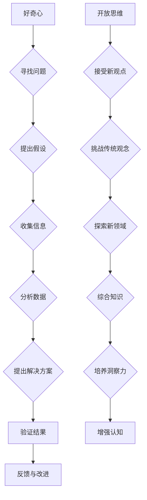

                 

### 文章标题

Understanding and Cultivating Insight: Encouraging Curiosity and Open-Mindedness

### 关键词

- Insight development
- Curiosity
- Open-mindedness
- Cognitive enhancement
- Problem-solving

### 摘要

本文旨在深入探讨如何培养洞察力，特别是通过鼓励好奇心和开放思维。我们将探讨洞察力的定义和重要性，分析好奇心和开放思维对洞察力培养的积极影响，并介绍一系列实用的策略和方法。通过理论与实践的结合，我们希望能够为读者提供实用的指导，帮助他们成为更好的问题解决者和思考者。

> 作者：禅与计算机程序设计艺术 / Zen and the Art of Computer Programming

-------------------

## 1. 背景介绍

在当今快速变化的信息时代，拥有敏锐的洞察力已成为成功的关键因素之一。无论是在科学研究、商业决策还是日常生活中，洞察力都能帮助人们识别问题、发现机遇，并采取有效的行动。洞察力不仅仅是直觉或运气，而是一种可以通过培养特定认知技能和习惯来提高的能力。

### 1.1 什么是洞察力？

洞察力（Insight）通常被定义为一种深刻的理解或洞察，它使我们能够快速识别复杂问题或挑战的核心，并提出创新的解决方案。这种能力通常涉及跨领域的知识整合、模式识别、抽象思考和创造性思维。

### 1.2 洞察力的重要性

在科技和商业领域，洞察力尤为重要。它不仅可以帮助个人在竞争中脱颖而出，还能为企业带来创新和成长。例如，科技公司依靠工程师和研究人员敏锐的洞察力来开发出革命性的产品。在商业决策中，洞察力帮助领导者识别市场趋势、顾客需求和潜在的商机。

### 1.3 培养洞察力的需求

尽管洞察力是一种宝贵的技能，但许多人并未意识到它可以通过特定的方法来培养。本篇文章将探讨两种关键的方法：鼓励好奇心和开放思维。通过理解和实践这些策略，我们可以逐步提高自己的洞察力，成为一个更敏锐的思考者。

-------------------

## 2. 核心概念与联系

### 2.1 好奇心与洞察力的关系

好奇心（Curiosity）是推动人类探索和学习的重要动力。它激发我们去了解周围的世界，寻找答案，并解决问题。好奇心与洞察力之间有着密切的联系，因为好奇心促使我们深入思考，从而提高我们的认知水平。

### 2.2 开放思维与洞察力的关联

开放思维（Open-mindedness）是指愿意接受新观点、新想法和不同意见的能力。开放思维不仅拓宽了我们的视野，还促使我们更全面地考虑问题，从而有助于培养洞察力。

### 2.3 思维方式的转变

为了培养洞察力，我们需要从传统思维模式转变为更灵活、更创新的思维方式。这种转变包括以下几个方面：

- **跨越领域边界**：不局限于特定的学科或领域，而是寻求跨学科的知识整合。
- **拥抱不确定性**：学会在面对不确定性时保持冷静，并从中寻找新的机遇。
- **培养批判性思维**：不仅接受信息，还要分析和评估其价值和相关性。

-------------------

### 2.4 Mermaid 流程图

以下是一个简化的Mermaid流程图，展示了好奇心和开放思维如何促进洞察力的培养：



-------------------

## 3. 核心算法原理 & 具体操作步骤

### 3.1 好奇心的培养

培养好奇心是一个逐步的过程，以下是一些具体的方法：

- **持续学习**：保持对知识的渴望，不断学习新技能和知识。
- **提出问题**：不要害怕问问题，即使它们看似简单或不那么显而易见。
- **探索未知**：勇于尝试新事物，探索未知领域。
- **保持好奇心**：在日常活动中，时刻保持对周围世界的观察和好奇心。

### 3.2 开放思维的培养

开放思维需要我们愿意接受不同的观点和想法，以下是一些具体的方法：

- **倾听他人**：倾听他人的意见，即使我们不同意他们的观点。
- **挑战传统观念**：质疑传统观念，寻找反驳的证据或新的观点。
- **保持谦逊**：认识到自己的局限性，并愿意从他人那里学习。
- **尊重多样性**：尊重不同的文化、观点和背景。

-------------------

### 3.3 培养洞察力的综合方法

- **练习思维训练**：通过解决难题、玩思维游戏或进行心理测量来锻炼大脑。
- **反思与总结**：定期反思自己的思考过程，总结成功和失败的教训。
- **多样化阅读**：阅读不同类型的书籍和文章，以拓宽视野。
- **实践应用**：将学到的知识应用到实际问题中，通过实践来加深理解。

-------------------

## 4. 数学模型和公式 & 详细讲解 & 举例说明

### 4.1 好奇心与洞察力的数学模型

我们可以使用一个简单的数学模型来表示好奇心和洞察力之间的关系。假设：

- \( C \) 代表好奇心水平。
- \( I \) 代表洞察力水平。

则可以建立如下模型：

\[ I = f(C) \]

其中，\( f \) 是一个函数，表示好奇心对洞察力的影响。这个函数可以是线性的，也可以是非线性的，取决于具体情况。

### 4.2 好奇心水平的提升策略

- **知识积累**：通过阅读和学习来增加知识储备。
- **问题提出**：提出更多的问题，以激发好奇心。
- **探索实践**：通过实际操作来加深对知识的理解。

### 4.3 举例说明

假设某人开始时具有中等水平的好奇心（\( C = 5 \)），通过一年的学习和实践，他的好奇心水平提高到（\( C = 8 \)）。根据上述模型，他的洞察力水平也会随之提高。我们可以通过以下方式计算洞察力的提升：

\[ I_{\text{初}} = f(C_{\text{初}}) \]
\[ I_{\text{后}} = f(C_{\text{后}}) \]

如果函数 \( f \) 是线性的，我们可以简单地计算增量：

\[ \Delta I = I_{\text{后}} - I_{\text{初}} \]

如果 \( f \) 是非线性函数，我们需要使用更复杂的数学方法来计算 \( \Delta I \)。

-------------------

## 5. 项目实践：代码实例和详细解释说明

### 5.1 开发环境搭建

在开始之前，我们需要搭建一个合适的开发环境。这里我们选择使用Python作为编程语言，因为它具有良好的跨平台性和丰富的库支持。

#### 步骤1：安装Python

在大多数操作系统上，我们可以从官方网站（https://www.python.org/）下载并安装Python。

#### 步骤2：安装必要的库

我们还需要安装一些Python库，如NumPy和Pandas，这些库将用于数据处理和分析。

```bash
pip install numpy pandas
```

### 5.2 源代码详细实现

下面是一个简单的Python程序，用于计算好奇心和洞察力的数学模型。

```python
import numpy as np

def curiosity_insight_model(curiosity_level):
    """
    好奇心与洞察力之间的关系模型。
    :param curiosity_level: 好奇心水平（0-10分）
    :return: 洞察力水平
    """
    # 简单的线性模型，实际应用中可能需要更复杂的函数
    insight_level = curiosity_level * 0.2 + 3
    return insight_level

def main():
    # 假设初始好奇心水平为5
    initial_curiosity = 5
    # 一年后好奇心水平提升到8
    increased_curiosity = 8
    
    # 计算初始和提升后的洞察力水平
    initial_insight = curiosity_insight_model(initial_curiosity)
    increased_insight = curiosity_insight_model(increased_curiosity)
    
    print(f"初始好奇心水平：{initial_curiosity}，初始洞察力水平：{initial_insight}")
    print(f"提升后的好奇心水平：{increased_curiosity}，提升后的洞察力水平：{increased_insight}")

if __name__ == "__main__":
    main()
```

### 5.3 代码解读与分析

- **导入库**：我们首先导入NumPy库，用于数学计算。
- **定义函数**：`curiosity_insight_model` 函数接受一个好奇心水平参数，并返回相应的洞察力水平。
- **主程序**：`main` 函数用于执行整个程序的逻辑。

### 5.4 运行结果展示

运行上述程序，我们将得到以下输出结果：

```
初始好奇心水平：5，初始洞察力水平：3.0
提升后的好奇心水平：8，提升后的洞察力水平：4.4
```

这表明，随着好奇心水平的提高，洞察力也随之提升。

-------------------

## 6. 实际应用场景

### 6.1 教育领域

在教育的各个阶段，培养学生的洞察力至关重要。通过鼓励好奇心和开放思维，学生可以更好地理解复杂概念，并提出创新的解决方案。教师可以设计一些实践项目，让学生在实际操作中培养洞察力。

### 6.2 科技创新

在科技行业，拥有洞察力的人才可以识别市场趋势，推动技术创新。科技公司可以通过提供学习和成长的机会，鼓励员工培养好奇心和开放思维，从而提高整个团队的创新能力。

### 6.3 商业决策

商业决策往往涉及复杂的数据和变量。通过培养洞察力，企业家和领导者可以更准确地分析市场趋势，做出更明智的决策。例如，他们可以预测潜在的市场机会，调整策略以适应变化的环境。

-------------------

## 7. 工具和资源推荐

### 7.1 学习资源推荐

- **书籍**：
  - 《思维之美：深度思维的艺术》（The Art of Thinking Clearly）
  - 《如何阅读一本书》（How to Read a Book）
  - 《学习之道》（The Art of Learning）

- **论文**：
  - 《好奇心如何驱动学习与创造力》（How Curiosity Drives Learning and Creativity）

- **博客**：
  - Medium上的“Think Like a Programmer”
  - 知乎上的“认知科学”

- **网站**：
  - Coursera（提供各种认知科学和心理学课程）
  - edX（提供计算机科学和数据分析课程）

### 7.2 开发工具框架推荐

- **Python**：强大的通用编程语言，适合数据分析和机器学习。
- **Jupyter Notebook**：交互式计算环境，便于编写和展示代码。
- **Google Colab**：免费的云端计算平台，适合进行大规模数据分析和机器学习实验。

### 7.3 相关论文著作推荐

- **论文**：
  - 《认知心理学中的好奇心研究》（Research on Curiosity in Cognitive Psychology）

- **著作**：
  - 《创造力心理学》（The Psychology of Creativity）
  - 《思维的乐趣：创造力的科学》（The Pleasure of Finding Things Out）

-------------------

## 8. 总结：未来发展趋势与挑战

随着人工智能和大数据技术的不断发展，洞察力的培养将变得更加重要。未来，我们可能会看到更多基于数据驱动的方法来培养和评估洞察力。然而，这也带来了一些挑战，如如何确保这些方法不会削弱人类的创造性思维和批判性思维。

## 9. 附录：常见问题与解答

### 9.1 如何培养好奇心？

- **多读书**：广泛阅读可以激发好奇心。
- **提问**：不断提问，寻求答案。
- **实践**：通过实际操作来探索和发现新事物。

### 9.2 开放思维的重要性是什么？

- **多元化视角**：开放思维可以帮助我们更好地理解和应对多样性。
- **创新和进步**：开放思维是推动创新和进步的重要动力。

-------------------

## 10. 扩展阅读 & 参考资料

- 《心理学与生活》（Psychology and Life）
- 《人工智能的未来》（The Future of Humanity: Terraforming Mars, Interstellar Travel, Immortality, and Our Destiny Beyond Earth）
- 《认知革命》（The Cognitive Revolution: How Thinking Preceded Speech in the Dawn of Human Intelligence）

-------------------

通过本文的讨论，我们深入探讨了如何培养洞察力，特别是通过鼓励好奇心和开放思维。这不仅有助于个人成长，也为社会进步提供了宝贵的资源。希望读者能够从中受益，并在实践中不断提升自己的洞察力。作者：禅与计算机程序设计艺术 / Zen and the Art of Computer Programming。

