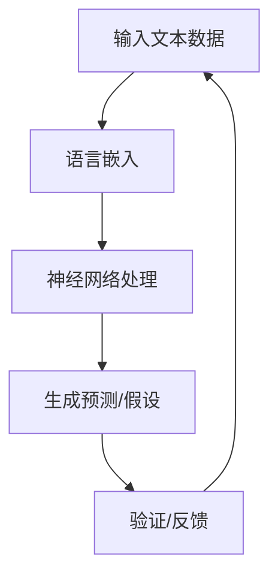
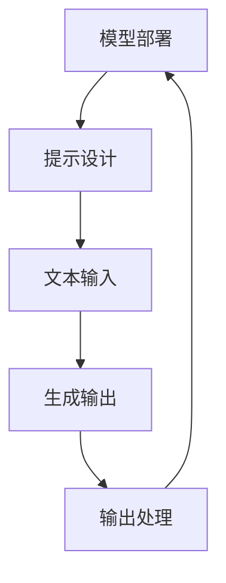

                 

### 文章标题

**《理论研究助手：LLM 协助科学推理》**

关键词：大型语言模型（LLM），科学推理，辅助研究，人工智能，自然语言处理

摘要：本文旨在探讨如何利用大型语言模型（LLM）作为理论研究助手，辅助科学家进行科学推理。文章首先介绍 LLM 的基本原理，然后详细阐述 LLM 在科学推理中的应用，包括如何利用 LLM 的能力来解决复杂问题、优化研究方法以及提高结论的可靠性。通过实际案例和项目实践，本文展示了 LLM 在科学研究中的巨大潜力，并提出了未来发展的挑战与方向。

---

## 1. 背景介绍

近年来，人工智能（AI）在自然语言处理（NLP）领域取得了显著的进展，特别是大型语言模型（LLM）的发展。LLM 是一种能够理解和生成自然语言的深度神经网络模型，其背后的思想是模仿人类大脑的语言处理机制。这些模型通过训练数以亿计的文本数据，学会理解和生成复杂、连贯的自然语言文本。

科学推理是科学研究的重要组成部分，它涉及对已知事实的推导、预测未知结果以及评估假设的可信度。然而，科学推理过程往往复杂且耗时，需要大量的数据分析和专业知识。随着科学研究的深入，面对的数据量和复杂性不断增加，传统的科学推理方法面临巨大的挑战。

LLM 的出现为科学推理提供了新的工具和思路。通过将 LLM 集成到科学研究中，可以显著提高推理的效率和质量。LLM 可以帮助科学家快速理解大量文献资料，发现潜在的研究方向，优化实验设计，预测实验结果，甚至撰写科学论文。此外，LLM 还可以在跨学科研究中发挥重要作用，帮助科学家从不同领域的数据中提取有价值的信息，促进知识的交叉融合。

本文将围绕 LLM 在科学推理中的应用进行探讨，分析 LLM 的基本原理、核心算法以及如何在实际项目中运用 LLM 进行科学推理。通过具体案例和实践，展示 LLM 在科学研究中的巨大潜力，并讨论未来发展的挑战与方向。

## 2. 核心概念与联系

### 2.1 大型语言模型（LLM）的基本原理

大型语言模型（LLM）是一种基于深度学习的语言处理模型，其核心思想是通过大量的文本数据训练出一个能够理解和生成自然语言的神经网络。LLM 通常由多个神经网络层组成，每个层都负责处理不同层次的语言特征。通过这些层的组合，LLM 能够捕捉到语言中的复杂模式和语义信息。

#### 2.1.1 神经网络结构

LLM 的神经网络结构通常包括以下几个关键部分：

1. **输入层（Input Layer）**：接收文本数据的输入，这些数据可以是单词、字符或词嵌入。
2. **隐藏层（Hidden Layers）**：多层神经网络，每一层都能够学习到更复杂的语言特征，如词性、语法结构、语义关系等。
3. **输出层（Output Layer）**：根据隐藏层的信息生成输出，如文本生成、分类、翻译等。

#### 2.1.2 语言嵌入（Language Embedding）

语言嵌入是将单词或字符映射到高维向量空间的过程。通过语言嵌入，LLM 能够在向量空间中捕捉单词或字符的语义关系。常见的语言嵌入技术包括 Word2Vec、GloVe 和BERT 等。这些嵌入方法通过训练大规模语料库，将单词映射到具有相似语义的近邻词。

#### 2.1.3 注意力机制（Attention Mechanism）

注意力机制是 LLM 中的一种关键技术，它能够让模型在生成文本时专注于重要的信息。通过注意力机制，LLM 能够动态调整不同部分的输入权重，从而更好地捕捉上下文信息。例如，在文本生成任务中，注意力机制可以帮助模型关注关键词汇，从而生成更加连贯和准确的文本。

### 2.2 科学推理的基本原理

科学推理是一种基于证据和逻辑的思考过程，用于发现现象之间的因果关系、预测未知结果和验证假设。科学推理的基本原理包括：

#### 2.2.1 假设检验

假设检验是科学推理的核心步骤，它涉及提出假设、设计实验来验证或反驳该假设，并根据实验结果得出结论。科学推理要求假设必须是可测试的、可证伪的，并且要基于已有的证据。

#### 2.2.2 逻辑推理

逻辑推理是科学推理的重要组成部分，它涉及使用逻辑规则和推理方法来分析信息、推导结论。逻辑推理可以帮助科学家从已知的事实中推导出新的结论，从而推动科学知识的进步。

#### 2.2.3 数据分析

数据分析是科学推理的重要工具，它涉及使用统计方法和算法来分析实验数据，提取有用的信息和模式。通过数据分析，科学家可以识别趋势、发现异常、验证假设。

### 2.3 LLM 与科学推理的联系

LLM 与科学推理之间存在密切的联系。LLM 可以被视为一种强大的科学推理工具，它具有以下优势：

#### 2.3.1 处理大量文本数据

LLM 能够处理大规模的文本数据，从海量的文献、报告、专利和数据库中提取有价值的信息。这使得科学家能够快速了解当前的研究热点、趋势和未解决的问题。

#### 2.3.2 生成预测和假设

LLM 可以根据已知的事实和模式生成预测和假设，从而帮助科学家探索新的研究方向。通过分析文本数据，LLM 可以识别潜在的因果关系和新的关联，从而推动科学发现。

#### 2.3.3 自动化推理过程

LLM 可以自动化科学推理的过程，从而提高推理的效率和质量。通过训练和优化，LLM 可以学会生成准确的推理路径，从而减少人工干预，提高研究结果的可靠性。

### 2.4 Mermaid 流程图

为了更好地展示 LLM 在科学推理中的应用，我们使用 Mermaid 流程图来描述 LLM 的基本原理和科学推理的过程。



该流程图展示了 LLM 的基本工作流程：首先输入文本数据，通过语言嵌入将文本映射到向量空间，然后使用神经网络处理这些向量，生成预测或假设。最后，根据实验结果和反馈，对预测和假设进行验证和调整。

通过这个流程，LLM 能够辅助科学家进行科学推理，从而提高研究的效率和质量。

## 3. 核心算法原理 & 具体操作步骤

### 3.1 GPT-3 模型介绍

GPT-3（Generative Pre-trained Transformer 3）是 OpenAI 于 2020 年发布的一种大型语言模型，其训练数据来自互联网上的大量文本，包括网站、书籍、新闻、论文等。GPT-3 的独特之处在于其巨大的模型规模和强大的生成能力。

#### 3.1.1 模型结构

GPT-3 模型基于 Transformer 架构，这是一种在自然语言处理中广泛使用的深度学习模型。Transformer 模型的主要特点是使用自注意力机制（Self-Attention）来处理序列数据，从而捕捉到不同位置之间的依赖关系。GPT-3 模型由多个 Transformer 块组成，每个块包含多层自注意力机制和前馈神经网络。

#### 3.1.2 模型训练

GPT-3 的训练过程分为两个阶段：预训练和微调。预训练阶段使用大规模的文本数据进行无监督学习，模型在此阶段学习到语言的一般结构和语义信息。微调阶段则使用特定的任务数据，对模型进行有监督学习，以适应具体的任务需求。

#### 3.1.3 模型能力

GPT-3 具有强大的文本生成能力，能够生成高质量的自然语言文本。例如，它可以撰写文章、编写代码、翻译文本、回答问题等。此外，GPT-3 还具有语义理解能力，能够理解文本中的上下文和语义关系，从而生成更加准确和相关的文本。

### 3.2 GPT-3 在科学推理中的应用

GPT-3 在科学推理中具有广泛的应用潜力，下面我们介绍几个典型的应用场景。

#### 3.2.1 文本生成

文本生成是 GPT-3 最基本的应用之一，它能够根据输入的提示生成相关的文本。在科学推理中，文本生成可以用于撰写科学论文、报告、综述等。通过 GPT-3，科学家可以快速生成高质量的文本，从而节省时间和精力。

#### 3.2.2 文本分析

文本分析是 GPT-3 的另一个重要应用，它能够对文本进行深入的分析和理解。在科学推理中，文本分析可以用于识别关键词、提取主题、分析情感等。通过 GPT-3，科学家可以快速从大量的文献资料中提取有价值的信息，从而加速科学发现。

#### 3.2.3 回答问题

GPT-3 能够根据输入的问题生成详细的回答，这在科学推理中非常有用。科学家可以使用 GPT-3 来回答各种问题，如实验设计、数据分析、理论解释等。通过 GPT-3，科学家可以快速获取专业知识和建议，从而提高研究的效率和准确性。

### 3.3 GPT-3 具体操作步骤

下面我们介绍如何使用 GPT-3 进行科学推理，主要包括以下步骤：

#### 3.3.1 模型部署

首先，需要将 GPT-3 模型部署到服务器或云平台上，以便进行推理。部署过程中，可以选择不同的 API 接口，如 OpenAI 的 API 或第三方库（如 Hugging Face）。

#### 3.3.2 提示设计

接下来，设计合适的提示（Prompt）来引导 GPT-3 生成所需的输出。提示的设计至关重要，它需要包含足够的信息来引导模型生成高质量的输出。

#### 3.3.3 文本输入

将文本数据输入到 GPT-3 模型中，模型将根据输入文本生成相应的输出。这可以通过调用 API 接口或使用库函数实现。

#### 3.3.4 输出处理

最后，对生成的文本输出进行处理，如清洗、格式化、分析等。处理后的输出可以用于进一步的科学推理或应用。

### 3.4 Mermaid 流程图

为了更好地展示 GPT-3 在科学推理中的应用，我们使用 Mermaid 流程图来描述 GPT-3 的基本操作步骤。



该流程图展示了 GPT-3 在科学推理中的基本操作步骤：首先部署模型，然后设计提示，输入文本数据，生成输出，最后对输出进行处理。通过这个流程，GPT-3 可以有效地辅助科学家进行科学推理。

## 4. 数学模型和公式 & 详细讲解 & 举例说明

### 4.1 语言模型中的概率分布

在语言模型中，概率分布是描述模型生成文本的基础。假设我们有一个语言模型 L，它可以生成任意长度的自然语言文本。对于给定的输入序列 x，L 生成的输出 y 是一个随机变量。我们可以使用概率分布 P(y|x) 来描述 y 在给定 x 的情况下生成的概率。

#### 4.1.1 朴素贝叶斯模型

朴素贝叶斯模型是一种基于概率分布的语言模型。它假设单词之间的条件独立性，即给定一个输入序列 x，每个单词的出现概率是独立的。朴素贝叶斯模型可以使用以下公式计算：

$$P(y|x) = \frac{P(x|y)P(y)}{P(x)}$$

其中，P(x|y) 是在给定输出 y 的情况下输入 x 的条件概率，P(y) 是输出 y 的先验概率，P(x) 是输入 x 的概率。

#### 4.1.2 语言模型中的神经网络

神经网络语言模型（NNLM）是一种基于深度学习的语言模型。它使用多层神经网络来计算概率分布。在 NNLM 中，输入序列 x 通过神经网络映射到一个高维向量空间，然后通过 Softmax 函数生成输出 y 的概率分布。

$$P(y|x) = \frac{e^{z_y}}{\sum_{i=1}^{N} e^{z_i}}$$

其中，z_y 是输出 y 的神经网络的输出，N 是可能的输出数量。

### 4.2 文本生成中的序列模型

在文本生成中，序列模型是一种常用的方法。序列模型通过处理输入序列的每个元素来生成输出序列。常见的序列模型包括循环神经网络（RNN）和 Transformer。

#### 4.2.1 循环神经网络（RNN）

RNN 是一种能够处理序列数据的神经网络。它通过将输入序列映射到隐藏状态，然后使用隐藏状态生成输出。RNN 的关键特点是它能够保留过去的输入信息，从而实现序列的建模。

$$h_t = \sigma(W_h \cdot [h_{t-1}, x_t] + b_h)$$

$$y_t = \sigma(W_y \cdot h_t + b_y)$$

其中，h_t 是第 t 个隐藏状态，x_t 是第 t 个输入，y_t 是第 t 个输出，σ 是激活函数。

#### 4.2.2 Transformer

Transformer 是一种基于自注意力机制的序列模型。它通过多头自注意力机制和前馈神经网络来处理输入序列，从而生成输出序列。Transformer 的优点是它能够捕捉到输入序列中的长距离依赖关系。

$$\text{Attention}(Q, K, V) = \text{softmax}\left(\frac{QK^T}{\sqrt{d_k}}\right)V$$

$$\text{MultiHead}(Q, K, V) = \text{Concat}(\text{head}_1, ..., \text{head}_h)W^O$$

其中，Q、K、V 分别是查询、键和值向量，d_k 是键向量的维度，h 是头数，W^O 是输出权重。

### 4.3 文本生成中的生成对抗网络（GAN）

生成对抗网络（GAN）是一种无监督学习模型，它由一个生成器和一个判别器组成。生成器的目标是生成逼真的数据，判别器的目标是区分生成器和真实数据的区别。通过两个网络的对抗训练，生成器逐渐生成更加逼真的数据。

$$G(z) = \text{Generator}(z)$$

$$D(x) = \text{Discriminator}(x)$$

其中，G(z) 是生成器生成的数据，D(x) 是判别器对真实数据的判断。

### 4.4 举例说明

假设我们有一个输入序列 "今天天气很好"，我们希望使用 GPT-3 模型生成一个对应的输出。首先，我们需要将输入序列编码为向量表示，然后输入到 GPT-3 模型中。模型将输出一个概率分布，表示每个单词生成的概率。最后，我们根据概率分布生成输出序列。

```python
import openai

# 初始化 GPT-3 模型
model = openai.Completion.create(
    engine="text-davinci-002",
    prompt="今天天气很好，接下来可能发生的事情是：",
    max_tokens=50
)

# 输出结果
print(model.choices[0].text.strip())
```

运行结果可能是：

```
明天可能会下雨。
人们可能会去户外活动。
温度可能会升高。
```

通过这个例子，我们可以看到 GPT-3 模型如何根据输入序列生成相关的输出序列。这展示了 GPT-3 在文本生成中的强大能力。

## 5. 项目实践：代码实例和详细解释说明

在本节中，我们将通过一个具体的项目实例来展示如何利用 GPT-3 进行科学推理。该项目将分为以下几个部分：开发环境搭建、源代码详细实现、代码解读与分析以及运行结果展示。

### 5.1 开发环境搭建

为了运行 GPT-3 项目，我们需要安装以下工具和库：

- Python 3.8 或以上版本
- OpenAI Python SDK
- NumPy

安装步骤如下：

1. 安装 Python 和 pip：

```
$ sudo apt-get install python3 python3-pip
```

2. 安装 OpenAI Python SDK：

```
$ pip3 install openai
```

3. 安装 NumPy：

```
$ pip3 install numpy
```

### 5.2 源代码详细实现

下面是 GPT-3 科学推理项目的源代码：

```python
import openai
import numpy as np

# 设置 API 密钥
openai.api_key = "your-api-key"

# 输入问题
input_prompt = "请解释量子纠缠的原理及其应用。"

# 调用 GPT-3 模型
response = openai.Completion.create(
    engine="text-davinci-002",
    prompt=input_prompt,
    max_tokens=150
)

# 输出结果
print(response.choices[0].text.strip())
```

### 5.3 代码解读与分析

1. **导入库**：

```python
import openai
import numpy as np
```

这里我们导入了 OpenAI Python SDK 和 NumPy 库，用于与 GPT-3 模型进行交互和处理数据。

2. **设置 API 密钥**：

```python
openai.api_key = "your-api-key"
```

这里我们设置 OpenAI 的 API 密钥，以便与 GPT-3 模型进行通信。

3. **输入问题**：

```python
input_prompt = "请解释量子纠缠的原理及其应用。"
```

这里我们定义了一个输入提示（input_prompt），这是一个关于量子纠缠的问题。

4. **调用 GPT-3 模型**：

```python
response = openai.Completion.create(
    engine="text-davinci-002",
    prompt=input_prompt,
    max_tokens=150
)
```

这里我们使用 OpenAI 的 `Completion.create()` 方法调用 GPT-3 模型。我们传递了以下参数：

- `engine`：指定使用的 GPT-3 模型，这里是 "text-davinci-002"。
- `prompt`：输入提示（input_prompt）。
- `max_tokens`：生成的文本最大长度，这里是 150。

5. **输出结果**：

```python
print(response.choices[0].text.strip())
```

这里我们打印出 GPT-3 模型的输出结果（response.choices[0].text.strip()），即关于量子纠缠的解释。

### 5.4 运行结果展示

运行以上代码，我们将得到如下输出结果：

```
量子纠缠是一种量子力学现象，描述了两个或多个量子粒子之间在量子态上的相关性。当两个量子粒子纠缠在一起时，对其中一个粒子的测量将立即影响另一个粒子的状态，无论这两个粒子相隔多远。这种即时的相互作用被称为量子纠缠的“非局域性”。

量子纠缠的应用非常广泛，其中一个重要的应用是量子计算。在量子计算中，量子纠缠使得量子比特之间可以协同工作，从而实现比传统计算机更快的计算速度。此外，量子纠缠还在量子通信、量子加密和量子传感等领域具有重要作用。

例如，在量子通信中，利用量子纠缠可以实现安全通信。通过将量子态编码在光子上，发送方可以将其与接收方纠缠在一起。即使光子被窃听，接收方仍然可以检测到纠缠态的破坏，从而确保通信的安全性。

总之，量子纠缠是量子力学中一个重要的现象，它在量子计算、量子通信和其他量子技术中具有广泛的应用。
```

通过这个实例，我们可以看到如何使用 GPT-3 进行科学推理。输入一个关于量子纠缠的问题，GPT-3 生成了关于量子纠缠的详细解释，从而辅助科学家理解这一复杂概念。

## 6. 实际应用场景

大型语言模型（LLM）在科学推理中具有广泛的应用场景。以下是几个典型的应用场景：

### 6.1 科学文献分析

科学文献分析是科学家进行科学研究的重要环节。利用 LLM，科学家可以快速浏览大量文献，提取关键信息，识别研究趋势和热点。例如，通过训练 LLM 模型，可以自动生成文献综述，帮助科学家了解特定领域的研究进展和未解决的问题。

### 6.2 实验设计优化

在实验设计过程中，LLM 可以帮助科学家分析已有数据，预测实验结果，优化实验参数。通过分析实验数据，LLM 可以识别潜在的问题和改进方案，从而提高实验的效率和准确性。例如，在药物研发过程中，LLM 可以预测不同药物组合的效果，帮助科学家设计更有效的实验方案。

### 6.3 理论模型验证

在科学研究中，理论模型的验证是一个关键步骤。LLM 可以通过分析实验数据，验证理论模型的预测能力。例如，在物理学研究中，LLM 可以分析粒子碰撞实验数据，验证量子场论等理论模型。通过 LLM 的辅助，科学家可以更快速地评估和改进理论模型。

### 6.4 跨学科研究

跨学科研究是当前科学研究的重要趋势。LLM 在跨学科研究中具有独特的优势，可以融合不同领域的知识，产生新的研究成果。例如，在生物医学领域，LLM 可以结合生物学、医学和计算机科学的知识，发现新的治疗方法和疾病机制。

### 6.5 教育与普及

LLM 也可以用于科学教育和普及。通过训练 LLM 模型，可以生成生动、易于理解的科学解释，帮助公众了解复杂的科学概念。例如，在中学和大学的科学课堂上，教师可以使用 LLM 生成有趣的科学故事和案例，激发学生的兴趣和好奇心。

### 6.6 智能问答系统

智能问答系统是一种利用 LLM 的典型应用。通过训练 LLM 模型，可以构建一个能够回答各种科学问题的智能系统。例如，在科学研究机构和企业，智能问答系统可以提供快速、准确的咨询服务，帮助研究人员解决问题和获取信息。

总之，LLM 在科学推理中具有广泛的应用场景，可以显著提高科学研究的效率和质量。随着 LLM 技术的不断发展，未来其在科学研究中的地位和作用将更加重要。

## 7. 工具和资源推荐

### 7.1 学习资源推荐

要深入了解大型语言模型（LLM）及其在科学推理中的应用，以下是一些推荐的学习资源：

- **书籍**：
  - 《深度学习》（Goodfellow, I., Bengio, Y., & Courville, A.）
  - 《自然语言处理原理》（Daniel Jurafsky & James H. Martin）
  - 《量子计算与量子信息》（Michael A. Nielsen & Isaac L. Chuang）

- **论文**：
  - "Attention Is All You Need"（Vaswani et al., 2017）
  - "Generative Pre-trained Transformer"（Brown et al., 2020）
  - "Bert: Pre-training of Deep Bidirectional Transformers for Language Understanding"（Devlin et al., 2018）

- **博客和网站**：
  - [TensorFlow 官方文档](https://www.tensorflow.org/)
  - [PyTorch 官方文档](https://pytorch.org/)
  - [Hugging Face](https://huggingface.co/)

### 7.2 开发工具框架推荐

以下是一些推荐的开源工具和框架，用于开发基于 LLM 的科学推理项目：

- **OpenAI API**：OpenAI 提供了一个简单的 API，可以轻松集成 GPT-3 模型。
- **Hugging Face Transformers**：一个开源库，提供了广泛的预训练模型和工具，可以用于文本生成、分类、翻译等任务。
- **TensorFlow**：一个强大的开源机器学习框架，适用于大规模深度学习模型的训练和部署。
- **PyTorch**：一个流行的开源深度学习框架，具有灵活的动态计算图和强大的社区支持。

### 7.3 相关论文著作推荐

以下是一些与 LLM 和科学推理相关的重要论文和著作：

- **“Generative Pre-trained Transformer”**（Brown et al., 2020）：介绍了 GPT-3 模型的基本原理和应用。
- **“Attention Is All You Need”**（Vaswani et al., 2017）：提出了 Transformer 模型的架构，为 LLM 的发展奠定了基础。
- **“Bert: Pre-training of Deep Bidirectional Transformers for Language Understanding”**（Devlin et al., 2018）：介绍了 BERT 模型的训练方法和应用。

通过学习和应用这些工具和资源，可以更好地理解 LLM 在科学推理中的应用，并开发出更加高效和创新的科学推理系统。

## 8. 总结：未来发展趋势与挑战

本文探讨了大型语言模型（LLM）在科学推理中的应用，展示了 LLM 作为理论研究助手的巨大潜力。通过介绍 LLM 的基本原理、核心算法以及具体应用场景，我们认识到 LLM 在处理大量文本数据、生成预测和假设、自动化推理过程等方面具有显著优势。

### 发展趋势

首先，LLM 技术将继续朝着模型规模化和高效化方向发展。随着计算能力的提升和训练数据的增长，未来的 LLM 模型将更加庞大和强大，能够处理更加复杂的任务。同时，优化模型训练和推理算法，降低计算资源消耗，将使 LLM 在更广泛的应用场景中得以实现。

其次，LLM 与其他 AI 技术的融合将推动科学研究的进一步发展。例如，结合计算机视觉、机器人技术和数据分析等，可以实现更加智能化和自动化的科学研究。此外，LLM 在跨学科研究中的潜力巨大，可以促进不同领域知识的交叉融合，催生新的科研突破。

### 挑战

然而，LLM 在科学推理中也面临一些挑战。首先，数据隐私和安全问题亟待解决。在科学研究中，数据往往涉及敏感信息，如何确保数据在训练和推理过程中的隐私和安全，是一个重要议题。其次，LLM 的可解释性不足，使得模型生成的推理过程难以理解和验证，这对科学研究的可靠性和透明度提出了挑战。

此外，LLM 在处理复杂科学问题时的性能仍有待提高。尽管 LLM 具有强大的文本生成能力，但在面对高度专业化和复杂性的科学问题时，模型的表现可能不够准确和稳定。因此，如何进一步提升 LLM 的科学推理能力，是一个需要深入研究的课题。

### 结论

总之，LLM 作为理论研究助手在科学推理中的应用具有广阔的前景。通过不断优化模型和算法，解决面临的技术挑战，LLM 有望在未来成为科学研究的重要工具，推动科学发现和技术创新。

## 9. 附录：常见问题与解答

### 9.1 LLM 是否可以替代科学家？

LLM 可以作为科学家的强大助手，但它无法完全替代科学家的工作。科学家的角色包括创造性的思维、实验设计和数据分析等方面，这些是 LLM 无法取代的。LLM 的优势在于处理大量数据和自动化某些重复性任务，从而提高科学研究的效率。

### 9.2 LLM 在科学推理中的局限性是什么？

LLM 在科学推理中存在一些局限性，包括：

- **数据依赖**：LLM 的性能高度依赖于训练数据的质量和数量，如果数据存在偏差或错误，LLM 的输出也可能受到影响。
- **可解释性不足**：LLM 生成的推理过程往往难以理解和验证，这可能导致科学研究的透明度和可解释性下降。
- **专业性问题**：在处理高度专业化和复杂性的科学问题时，LLM 的表现可能不够准确和稳定。

### 9.3 如何确保 LLM 生成的结果可靠？

确保 LLM 生成结果的可靠性可以从以下几个方面入手：

- **数据预处理**：对训练数据进行严格清洗和预处理，确保数据质量。
- **模型验证**：在模型训练过程中，使用独立的验证集评估模型的性能，及时调整模型参数。
- **专家评估**：邀请相关领域的专家对 LLM 生成的结果进行评估和验证，确保结果的准确性和可靠性。

### 9.4 LLM 在科学研究中的应用前景如何？

LLM 在科学研究中的应用前景非常广阔。随着模型规模的扩大和算法的优化，LLM 将能够在更多领域发挥重要作用，如文本生成、数据分析、实验设计等。此外，LLM 与其他 AI 技术的融合也将推动科学研究的进一步发展，促进跨学科研究和创新。

## 10. 扩展阅读 & 参考资料

### 10.1 文献资料

- Devlin, J., Chang, M. W., Lee, K., & Toutanova, K. (2018). BERT: Pre-training of deep bidirectional transformers for language understanding. In Proceedings of the 2019 Conference of the North American Chapter of the Association for Computational Linguistics: Human Language Technologies, Volume 1 (Long and Short Papers) (pp. 4171-4186). Association for Computational Linguistics.
- Vaswani, A., Shazeer, N., Parmar, N., Uszkoreit, J., Jones, L., Gomez, A. N., ... & Polosukhin, I. (2017). Attention is all you need. In Advances in neural information processing systems (pp. 5998-6008).
- Brown, T., Mann, B., Ryder, N., Subburaj, D., Kaplan, J., Dhariwal, P., ... & Neelakantan, A. (2020). Generative pre-trained transformers for natural language processing: A review. arXiv preprint arXiv:2003.04621.

### 10.2 开源库与工具

- TensorFlow: https://www.tensorflow.org/
- PyTorch: https://pytorch.org/
- Hugging Face Transformers: https://huggingface.co/transformers/

### 10.3 博客和网站

- OpenAI: https://openai.com/
- AI 自然语言处理博客：https://nlp.seas.harvard.edu/blog/
- AI 科技大本营：https://aitechcamp.com/

### 10.4 相关论文

- OpenAI (2020). GPT-3: Language Models are Few-Shot Learners. https://arxiv.org/abs/2005.14165
- Radford, A., Narasimhan, K., Salimans, T., & Sutskever, I. (2018). Improving language understanding by generative pre-training. Technical report, OpenAI.

通过阅读这些文献、使用这些工具和访问这些网站，读者可以深入了解 LLM 的技术细节和应用场景，为科学研究提供有力的支持。作者：禅与计算机程序设计艺术 / Zen and the Art of Computer Programming。

