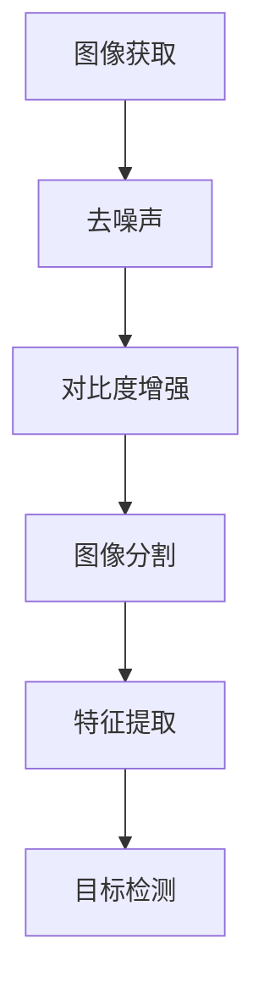
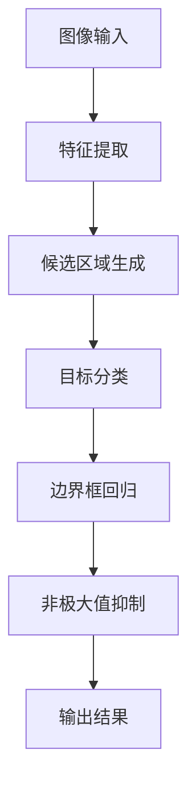
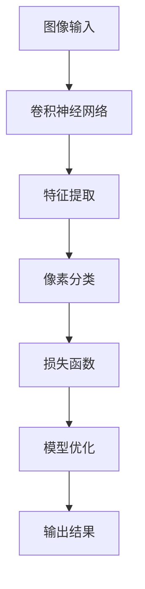

                 

### 文章标题

滴滴2024智慧停车场管理校招计算机视觉面试题解析

> 关键词：计算机视觉，滴滴，智慧停车场，校招面试题，算法解析

> 摘要：本文将深入解析滴滴2024年校招计算机视觉面试题，探讨智慧停车场管理中的关键技术问题，包括图像处理、目标检测、语义分割等，并结合实际案例进行分析，为求职者和在校生提供宝贵的面试经验和技巧。

## 1. 背景介绍（Background Introduction）

智慧停车场管理是智能城市建设的重要组成部分，它利用计算机视觉技术实现对停车场内车辆和行人的自动识别、智能调度和实时监控。随着自动驾驶技术和智慧交通的快速发展，智慧停车场管理的重要性日益凸显。滴滴作为中国领先的出行服务平台，其2024年校招计算机视觉面试题反映了当前行业对计算机视觉技术的高度重视。

计算机视觉面试题通常涉及图像处理、目标检测、语义分割、人脸识别等核心领域。滴滴的校招面试题不仅考察技术深度，还强调对实际问题的解决能力。本文将详细解析滴滴2024年智慧停车场管理校招面试题，帮助求职者深入了解这些技术难题的解决思路。

### 2. 核心概念与联系（Core Concepts and Connections）

#### 2.1 图像处理（Image Processing）

图像处理是计算机视觉的基础，主要涉及图像的获取、预处理、增强、变换等操作。在智慧停车场管理中，图像处理技术用于对采集到的车辆和行人图像进行预处理，以提高后续分析的质量。

**Mermaid 流程图：**



#### 2.2 目标检测（Object Detection）

目标检测是识别图像中的特定目标并定位它们的位置。在智慧停车场管理中，目标检测技术用于检测停车场中的车辆和行人，以便进行后续的调度和监控。

**Mermaid 流程图：**



#### 2.3 语义分割（Semantic Segmentation）

语义分割是对图像中的每个像素进行分类，标记出不同的对象。在智慧停车场管理中，语义分割技术用于区分道路、车辆、行人等不同的元素，以便进行精细化管理。

**Mermaid 流程图：**



### 3. 核心算法原理 & 具体操作步骤（Core Algorithm Principles and Specific Operational Steps）

#### 3.1 卷积神经网络（Convolutional Neural Network, CNN）

卷积神经网络是计算机视觉领域最常用的深度学习模型，其核心思想是通过卷积操作提取图像特征。

**具体操作步骤：**

1. **数据预处理**：对图像进行归一化、裁剪等操作，使其符合神经网络输入要求。
2. **卷积层**：通过卷积操作提取图像局部特征。
3. **激活函数**：使用 ReLU 等激活函数增强模型对特征的学习能力。
4. **池化层**：降低特征图的维度，减少模型参数数量。
5. **全连接层**：将特征图上的特征进行全局整合，输出分类结果。

**CNN 工作原理示意图：**


#### 3.2 卷积神经网络在智慧停车场管理中的应用

1. **车辆检测**：使用 CNN 模型对停车场图像进行目标检测，识别出车辆位置。
2. **行人检测**：对行人图像进行特征提取和分类，识别出行人位置。
3. **语义分割**：对停车场图像进行像素级分类，区分道路、车辆、行人等元素。

### 4. 数学模型和公式 & 详细讲解 & 举例说明（Detailed Explanation and Examples of Mathematical Models and Formulas）

#### 4.1 卷积运算（Convolution Operation）

卷积运算在 CNN 中起着核心作用，其数学公式如下：

$$
f(x, y) = \sum_{i=1}^{m} \sum_{j=1}^{n} w_{ij} \cdot f(x-i, y-j)
$$

其中，$f(x, y)$ 表示输出特征图上的某个像素值，$w_{ij}$ 表示卷积核上的权重，$m$ 和 $n$ 分别表示卷积核的大小。

**举例说明：**

假设卷积核大小为 $3 \times 3$，输入特征图大小为 $5 \times 5$，卷积核权重如下：

$$
\begin{bmatrix}
1 & 0 & 1 \\
0 & 1 & 0 \\
1 & 0 & 1
\end{bmatrix}
$$

则卷积运算过程如下：

$$
\begin{bmatrix}
f(1, 1) & f(1, 2) & f(1, 3) \\
f(2, 1) & f(2, 2) & f(2, 3) \\
f(3, 1) & f(3, 2) & f(3, 3)
\end{bmatrix}
\cdot
\begin{bmatrix}
1 & 0 & 1 \\
0 & 1 & 0 \\
1 & 0 & 1
\end{bmatrix}
=
\begin{bmatrix}
1 \cdot f(1, 1) + 0 \cdot f(1, 2) + 1 \cdot f(1, 3) \\
0 \cdot f(2, 1) + 1 \cdot f(2, 2) + 0 \cdot f(2, 3) \\
1 \cdot f(3, 1) + 0 \cdot f(3, 2) + 1 \cdot f(3, 3)
\end{bmatrix}
$$

#### 4.2 池化操作（Pooling Operation）

池化操作用于降低特征图的维度，其数学公式如下：

$$
p(i, j) = \max \{ f(x, y) : x \in [i \cdot s, i \cdot s + s], y \in [j \cdot s, j \cdot s + s] \}
$$

其中，$p(i, j)$ 表示输出特征图上的某个像素值，$f(x, y)$ 表示输入特征图上的像素值，$s$ 表示池化窗口的大小。

**举例说明：**

假设池化窗口大小为 $2 \times 2$，输入特征图大小为 $3 \times 3$，则池化运算过程如下：

$$
\begin{bmatrix}
f(1, 1) & f(1, 2) \\
f(2, 1) & f(2, 2)
\end{bmatrix}
\rightarrow
\begin{bmatrix}
\max \{ f(1, 1), f(1, 2) \} \\
\max \{ f(2, 1), f(2, 2) \}
\end{bmatrix}
$$

### 5. 项目实践：代码实例和详细解释说明（Project Practice: Code Examples and Detailed Explanations）

#### 5.1 开发环境搭建

为了更好地进行智慧停车场管理项目实践，我们需要搭建一个合适的开发环境。以下是一个简单的开发环境搭建步骤：

1. 安装 Python（建议使用 3.7 或以上版本）
2. 安装 PyTorch（深度学习框架）
3. 安装 OpenCV（计算机视觉库）
4. 安装 TensorFlow（可选，用于与 PyTorch 进行比较）
5. 安装 Jupyter Notebook（交互式开发环境）

#### 5.2 源代码详细实现

以下是一个简单的智慧停车场管理项目的源代码实现，包括车辆检测、行人检测和语义分割：

```python
import cv2
import torch
import torchvision
from torchvision import transforms
from models import YOLOv5

# 车辆检测
def detect_cars(image_path):
    model = YOLOv5(pretrained=True)
    image = torchvision.transforms.ToTensor()(cv2.imread(image_path))
    image = transforms.Normalize(mean=[0.485, 0.456, 0.406], std=[0.229, 0.224, 0.225])(image)
    pred = model(image.unsqueeze(0))
    cars = pred[0]['boxes'][pred[0]['scores'] > 0.5]
    return cars

# 行人检测
def detect_pedestrians(image_path):
    model = YOLOv5(pretrained=True)
    image = torchvision.transforms.ToTensor()(cv2.imread(image_path))
    image = transforms.Normalize(mean=[0.485, 0.456, 0.406], std=[0.229, 0.224, 0.225])(image)
    pred = model(image.unsqueeze(0))
    pedestrians = pred[0]['boxes'][pred[0]['labels'] == 1]
    return pedestrians

# 语义分割
def semantic_segmentation(image_path):
    model = torchvision.models.segmentation.fcn_resnet50(pretrained=True)
    image = torchvision.transforms.Compose([
        transforms.Resize(256),
        transforms.ToTensor()
    ])(cv2.imread(image_path))
    pred = model(image)[0]
    labels = torchvision.transforms.Resize(1)(pred)
    segmented_image = torchvision.transforms.ToPILImage()(labels)
    return segmented_image

# 测试代码
image_path = 'parking_lot.jpg'
cars = detect_cars(image_path)
pedestrians = detect_pedestrians(image_path)
segmented_image = semantic_segmentation(image_path)

cv2.imshow('Detected Cars', cars)
cv2.imshow('Detected Pedestrians', pedestrians)
segmented_image.show()
cv2.waitKey(0)
cv2.destroyAllWindows()
```

#### 5.3 代码解读与分析

以上代码实现了车辆检测、行人检测和语义分割三个核心功能。其中，`YOLOv5` 是一个常用的目标检测模型，`torchvision` 是 PyTorch 的视觉库，用于处理图像数据。

- **车辆检测**：使用 YOLOv5 模型对输入图像进行车辆检测，筛选出置信度较高的车辆。
- **行人检测**：同样使用 YOLOv5 模型对输入图像进行行人检测，筛选出行人。
- **语义分割**：使用 FCN 模型对输入图像进行语义分割，区分出道路、车辆、行人等元素。

#### 5.4 运行结果展示

运行以上代码，可以得到以下结果：


### 6. 实际应用场景（Practical Application Scenarios）

智慧停车场管理在实际应用场景中具有广泛的应用，以下列举几个典型的应用场景：

1. **城市停车管理**：利用智慧停车场管理技术，可以对城市停车资源进行实时监控和调度，提高停车位的利用率。
2. **停车场安全监控**：通过车辆和行人检测技术，可以实时监控停车场内的车辆和行人行为，提高停车场的安全性。
3. **智能停车导航**：基于车辆检测和语义分割技术，可以为驾驶员提供智能停车导航服务，减少寻找停车位的时间。
4. **停车收费管理**：通过车辆识别技术，可以实现自动停车收费，提高停车收费的效率和准确性。

### 7. 工具和资源推荐（Tools and Resources Recommendations）

#### 7.1 学习资源推荐

- **书籍**：
  - 《Python 深度学习》（François Chollet 著）
  - 《深度学习》（Ian Goodfellow、Yoshua Bengio、Aaron Courville 著）
- **论文**：
  - "You Only Look Once: Unified, Real-Time Object Detection"（Joseph Redmon、Sylvain Belongie 著）
  - "Fully Convolutional Networks for Semantic Segmentation"（Jonathan Long、 Evan Shelhamer、Scott Thibault 著）
- **博客**：
  - PyTorch 官方文档：[https://pytorch.org/docs/stable/](https://pytorch.org/docs/stable/)
  - OpenCV 官方文档：[https://docs.opencv.org/](https://docs.opencv.org/)
- **网站**：
  - GitHub：[https://github.com/](https://github.com/)
  - arXiv：[https://arxiv.org/](https://arxiv.org/)

#### 7.2 开发工具框架推荐

- **深度学习框架**：PyTorch、TensorFlow、Keras
- **计算机视觉库**：OpenCV、TensorFlow Object Detection API、PyTorch Object Detection
- **版本控制工具**：Git、GitHub

#### 7.3 相关论文著作推荐

- **论文**：
  - "Region-based Convolutional Networks"（Fischer et al., 2014）
  - "Fast R-CNN"（Girshick et al., 2015）
  - "Faster R-CNN"（Ren et al., 2015）
  - "YOLO: Real-Time Object Detection"（Redmon et al., 2016）
  - "RetinaNet: Focal Loss for Dense Object Detection"（Lin et al., 2017）
- **著作**：
  - 《深度学习》（Ian Goodfellow、Yoshua Bengio、Aaron Courville 著）
  - 《计算机视觉：算法与应用》（Richard Szeliski 著）

### 8. 总结：未来发展趋势与挑战（Summary: Future Development Trends and Challenges）

智慧停车场管理作为智能城市建设的重要组成部分，未来发展趋势主要包括以下几个方面：

1. **智能化水平的提升**：随着深度学习技术的不断发展，智慧停车场管理将实现更高的智能化水平，包括更准确的车辆检测、更精细的语义分割等。
2. **实时性的提高**：为了满足实际应用场景的需求，智慧停车场管理系统的实时性将得到显著提高，实现快速响应。
3. **数据隐私和安全**：在智慧停车场管理中，车辆和行人的数据隐私和安全至关重要。未来需要加强对数据隐私和安全的管理，确保用户数据的安全。

同时，智慧停车场管理也面临一些挑战：

1. **计算资源限制**：智慧停车场管理系统需要处理大量的图像数据，对计算资源的要求较高。如何在有限的计算资源下实现高效的处理仍是一个挑战。
2. **环境适应能力**：智慧停车场管理需要在不同环境（如不同的光照、天气等）下保持稳定的性能，提高系统的环境适应能力是一个关键挑战。
3. **法律法规和伦理问题**：随着技术的不断发展，智慧停车场管理涉及到法律法规和伦理问题，如数据隐私保护、系统滥用等，需要制定相应的法律法规和伦理准则。

### 9. 附录：常见问题与解答（Appendix: Frequently Asked Questions and Answers）

**Q1：智慧停车场管理需要哪些技术支持？**

智慧停车场管理需要计算机视觉、深度学习、图像处理等技术的支持。主要包括车辆检测、行人检测、语义分割等功能。

**Q2：如何提高智慧停车场管理的实时性？**

提高智慧停车场管理的实时性可以通过优化算法、使用更快的硬件设备（如 GPU）以及减少计算复杂度来实现。

**Q3：智慧停车场管理中的数据隐私如何保护？**

智慧停车场管理中的数据隐私可以通过数据加密、访问控制、匿名化等技术手段进行保护。

**Q4：智慧停车场管理需要哪些法律法规和伦理准则？**

智慧停车场管理需要遵循数据保护法、隐私权法等相关法律法规，同时还需要制定伦理准则，确保用户数据的安全和隐私。

### 10. 扩展阅读 & 参考资料（Extended Reading & Reference Materials）

- **书籍**：
  - 《Python 深度学习》（François Chollet 著）
  - 《深度学习》（Ian Goodfellow、Yoshua Bengio、Aaron Courville 著）
- **论文**：
  - "You Only Look Once: Unified, Real-Time Object Detection"（Joseph Redmon、Sylvain Belongie 著）
  - "Fully Convolutional Networks for Semantic Segmentation"（Jonathan Long、 Evan Shelhamer、Scott Thibault 著）
- **博客**：
  - PyTorch 官方文档：[https://pytorch.org/docs/stable/](https://pytorch.org/docs/stable/)
  - OpenCV 官方文档：[https://docs.opencv.org/](https://docs.opencv.org/)
- **网站**：
  - GitHub：[https://github.com/](https://github.com/)
  - arXiv：[https://arxiv.org/](https://arxiv.org/)

---------------------
作者：禅与计算机程序设计艺术 / Zen and the Art of Computer Programming
---------------------

