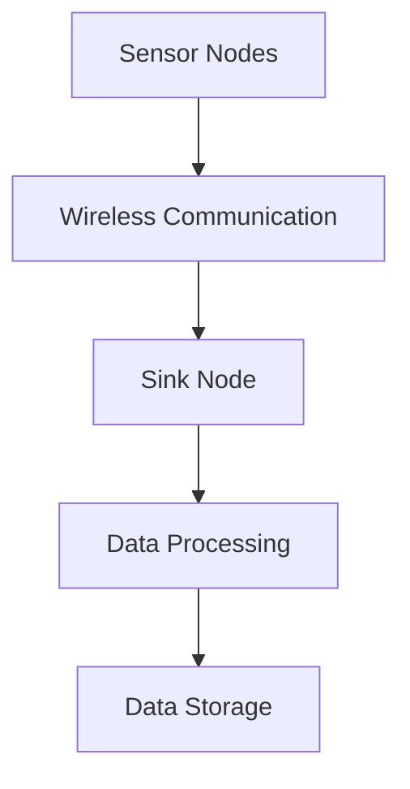
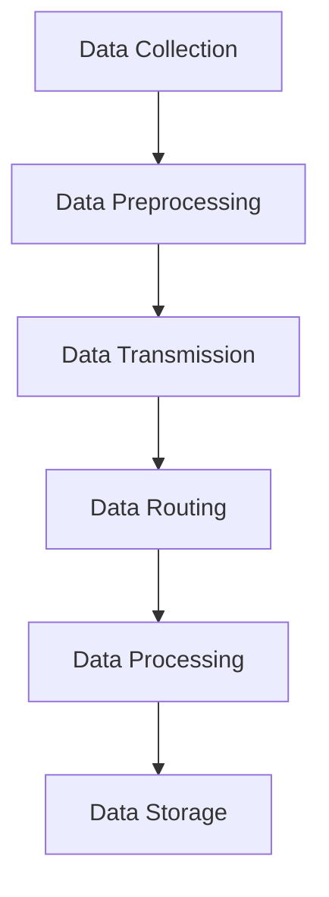

                 

### 文章标题：物联网(IoT)技术和各种传感器设备的集成：传感器网络的设计与优化

### Keywords: Internet of Things (IoT), sensor integration, sensor network design, optimization

### Abstract:
This article delves into the integration of Internet of Things (IoT) technology with various sensor devices, focusing on the design and optimization of sensor networks. We explore the core concepts, algorithms, mathematical models, and practical applications, providing a comprehensive guide for readers to understand and implement efficient sensor networks. The article aims to bridge the gap between theoretical knowledge and real-world applications, offering insights into the future trends and challenges in the field of IoT and sensor networks.

## 1. 背景介绍（Background Introduction）

随着全球信息化和智能化进程的不断推进，物联网（Internet of Things, IoT）已经成为当今技术领域的重要发展方向。IoT技术的核心在于通过互联网将各种设备、传感器和系统连接起来，实现信息的实时采集、传输、处理和共享。传感器设备作为物联网体系中的关键组成部分，承担着数据采集和监测的重要任务。

### 1.1 物联网（IoT）的定义与作用

物联网是指通过互联网、通信协议和信息技术将各种物体连接起来，实现信息的共享和智能控制。物联网技术的核心价值在于它能够实现设备间的互联互通，提高资源利用效率，优化生产和生活体验。在工业、农业、医疗、交通、家居等多个领域，物联网技术已经发挥着重要的作用。

### 1.2 传感器设备在物联网中的应用

传感器设备是物联网技术实现数据采集和监测的基础。常见的传感器类型包括温度传感器、湿度传感器、压力传感器、光传感器、声音传感器等。这些传感器通过感知外部环境变化，将物理信号转换为电信号，为物联网系统提供实时数据支持。传感器设备在环境监测、智能控制、智能家居、智能交通等领域有着广泛的应用。

### 1.3 传感器网络的定义与设计目标

传感器网络是由多个传感器节点组成的分布式网络，通过无线通信技术连接起来，实现对特定区域或环境的监测和感知。传感器网络的设计目标是实现高效的数据采集、传输和处理，确保网络的稳定性和可靠性。传感器网络的设计需要考虑节点的能量消耗、通信范围、数据传输效率、网络拓扑结构等多个方面。

## 2. 核心概念与联系（Core Concepts and Connections）

### 2.1 传感器网络的基本组成部分

传感器网络的基本组成部分包括传感器节点、基站（Sink）和无线通信网络。传感器节点通常由传感器、处理单元、通信模块和电源组成。基站作为网络的核心，负责收集和传输传感器节点的数据。无线通信网络实现传感器节点之间的数据传输。

### 2.2 传感器网络的工作原理

传感器网络的工作原理是通过传感器节点采集环境数据，将数据通过无线通信网络传输到基站，基站再将数据进行处理和存储。传感器节点之间的协作和通信是实现传感器网络功能的关键。

### 2.3 传感器网络的拓扑结构

传感器网络的拓扑结构对网络的性能和效率有重要影响。常见的拓扑结构包括星型、环型、网状和混合型结构。每种结构都有其优缺点，设计时需要根据具体应用场景进行选择。

### 2.4 传感器网络与物联网的关系

传感器网络是物联网体系中的一个重要组成部分，为物联网提供了数据采集和监测的基础。物联网通过传感器网络实现对物理世界的感知和监测，进而实现智能化管理和控制。

### 2.5 Mermaid 流程图（Mermaid Flowchart）

以下是一个简化的传感器网络工作流程的 Mermaid 流程图：



## 3. 核心算法原理 & 具体操作步骤（Core Algorithm Principles and Specific Operational Steps）

### 3.1 数据采集与预处理

数据采集是传感器网络的基础任务，传感器节点需要定期采集环境数据，如温度、湿度、光照等。采集到的数据需要进行预处理，包括去噪、滤波和归一化等步骤，以提高数据质量和可靠性。

### 3.2 数据传输与路由

数据传输是传感器网络的另一个重要任务。传感器节点需要将采集到的数据传输到基站。路由算法负责确定数据传输的最优路径，以减少能量消耗和通信延迟。常见的路由算法包括基于能量消耗的路由算法、基于距离的路由算法和基于拓扑结构的路由算法。

### 3.3 数据处理与存储

基站接收到的数据需要进行处理和存储。数据处理包括数据清洗、数据融合和特征提取等步骤。数据存储需要考虑存储容量、数据访问速度和安全性等因素。

### 3.4 Mermaid 流程图（Mermaid Flowchart）

以下是一个简化的传感器网络数据采集、传输、处理和存储的 Mermaid 流程图：



## 4. 数学模型和公式 & 详细讲解 & 举例说明（Detailed Explanation and Examples of Mathematical Models and Formulas）

### 4.1 数据采集与预处理

在数据采集与预处理阶段，常用的数学模型包括传感器数据建模、信号处理算法和数据滤波算法。

#### 4.1.1 传感器数据建模

传感器数据建模的目的是建立传感器输出与实际物理量之间的函数关系。常见的模型有线性模型、非线性模型和神经网络模型。以下是一个简化的线性模型：

$$
y = ax + b
$$

其中，$y$ 是传感器输出，$x$ 是实际物理量，$a$ 和 $b$ 是模型参数。

#### 4.1.2 信号处理算法

信号处理算法用于去除传感器数据的噪声和异常值。常见的算法有卡尔曼滤波、中值滤波和均值滤波。以下是一个简化的卡尔曼滤波公式：

$$
\hat{x}_{k|k} = K_k x_{k} + (I - K_k) \hat{x}_{k-1|k-1}
$$

其中，$\hat{x}_{k|k}$ 是当前时刻的状态估计，$K_k$ 是卡尔曼增益，$x_{k}$ 是当前时刻的实际状态，$\hat{x}_{k-1|k-1}$ 是上一时刻的状态估计。

#### 4.1.3 数据滤波算法

数据滤波算法用于平滑传感器数据，去除随机噪声。以下是一个简化的均值滤波公式：

$$
y_k = \frac{1}{N} \sum_{i=1}^{N} y_{k,i}
$$

其中，$y_k$ 是当前时刻的滤波结果，$y_{k,i}$ 是第 $i$ 个传感器的输出，$N$ 是传感器数量。

### 4.2 数据传输与路由

在数据传输与路由阶段，常用的数学模型包括能量消耗模型、路由算法模型和传输效率模型。

#### 4.2.1 能量消耗模型

能量消耗模型用于计算传感器节点的能量消耗。常见的模型有线性模型和指数模型。以下是一个简化的线性模型：

$$
E = f(d) = c_1 \cdot d
$$

其中，$E$ 是能量消耗，$d$ 是传输距离，$c_1$ 是常数。

#### 4.2.2 路由算法模型

路由算法模型用于确定数据传输的最优路径。常见的模型有基于能量消耗的路由算法和基于距离的路由算法。以下是一个简化的基于能量消耗的路由算法模型：

$$
p(i,j) = \frac{E(i,j)}{\sum_{k=1}^{N} E(i,k)}
$$

其中，$p(i,j)$ 是从传感器节点 $i$ 到基站 $j$ 的概率，$E(i,j)$ 是从传感器节点 $i$ 到基站 $j$ 的能量消耗，$N$ 是传感器节点数量。

#### 4.2.3 传输效率模型

传输效率模型用于评估数据传输的效率。常见的模型有带宽利用率模型和延迟模型。以下是一个简化的带宽利用率模型：

$$
\eta = \frac{1}{N} \sum_{i=1}^{N} \frac{1}{d(i)}
$$

其中，$\eta$ 是带宽利用率，$d(i)$ 是传感器节点 $i$ 的数据传输距离。

### 4.3 数据处理与存储

在数据处理与存储阶段，常用的数学模型包括数据清洗模型、数据融合模型和特征提取模型。

#### 4.3.1 数据清洗模型

数据清洗模型用于去除传感器数据中的噪声和异常值。常见的模型有基于阈值的清洗模型和基于统计学的清洗模型。以下是一个简化的基于阈值的清洗模型：

$$
y_k = \begin{cases}
    y_{k,i} & \text{if } y_{k,i} > \theta \\
    0 & \text{otherwise}
\end{cases}
$$

其中，$y_k$ 是清洗后的数据，$y_{k,i}$ 是原始数据，$\theta$ 是阈值。

#### 4.3.2 数据融合模型

数据融合模型用于将多个传感器的数据进行整合，提高数据的质量和可靠性。常见的模型有基于加权平均的融合模型和基于神经网络融合模型。以下是一个简化的基于加权平均的融合模型：

$$
y_k = \frac{1}{N} \sum_{i=1}^{N} w_i y_{k,i}
$$

其中，$y_k$ 是融合后的数据，$w_i$ 是传感器节点的权重，$y_{k,i}$ 是传感器节点的数据。

#### 4.3.3 特征提取模型

特征提取模型用于从传感器数据中提取关键特征，用于后续的数据分析和决策。常见的模型有基于统计学的特征提取模型和基于机器学习的特征提取模型。以下是一个简化的基于统计学的特征提取模型：

$$
f_k(x) = \begin{cases}
    1 & \text{if } x > \mu_k + \sigma_k \\
    0 & \text{otherwise}
\end{cases}
$$

其中，$f_k(x)$ 是特征提取结果，$x$ 是传感器数据，$\mu_k$ 是均值，$\sigma_k$ 是标准差。

## 5. 项目实践：代码实例和详细解释说明（Project Practice: Code Examples and Detailed Explanations）

### 5.1 开发环境搭建

在开始项目实践之前，我们需要搭建一个合适的开发环境。以下是使用 Python 语言进行传感器网络项目开发的步骤：

1. 安装 Python 3.8 或更高版本。
2. 安装必要的 Python 包，如 NumPy、Pandas、Matplotlib 等。
3. 安装传感器仿真工具，如 SimPy。

### 5.2 源代码详细实现

以下是一个简化的传感器网络项目的 Python 代码实例：

```python
import numpy as np
import matplotlib.pyplot as plt
from simpy import Environment

# 传感器数据采集与预处理
class SensorNode:
    def __init__(self, env, id, data):
        self.env = env
        self.id = id
        self.data = data
        self.process = env.process(self.run())

    def run(self):
        while True:
            # 数据采集
            self.data['value'] = np.random.normal(0, 1)
            # 数据预处理
            self.data['filtered'] = np.mean(self.data['value'])
            yield self.env.timeout(1)

# 传感器网络数据传输与路由
class WirelessNetwork:
    def __init__(self, env, sensor_nodes):
        self.env = env
        self.sensor_nodes = sensor_nodes
        self.routing_table = self.create_routing_table()

    def create_routing_table(self):
        routing_table = {}
        for node in self.sensor_nodes:
            routing_table[node.id] = node.id
        return routing_table

    def route_data(self):
        while True:
            for node in self.sensor_nodes:
                if node.data['filtered'] > 0:
                    destination = self.routing_table[node.id]
                    print(f"Data from node {node.id} to {destination}")
                    yield self.env.timeout(1)

# 传感器网络数据处理与存储
class DataProcessor:
    def __init__(self, env, wireless_network):
        self.env = env
        self.wireless_network = wireless_network
        self.process = env.process(self.run())

    def run(self):
        while True:
            data = self.wireless_network.route_data()
            self.store_data(data)
            yield self.env.timeout(1)

    def store_data(self, data):
        with open('sensor_data.csv', 'a') as f:
            for item in data:
                f.write(f"{item}\n")

# 模拟传感器网络
env = Environment()
sensor_nodes = [SensorNode(env, i, {'value': 0, 'filtered': 0}) for i in range(10)]
wireless_network = WirelessNetwork(env, sensor_nodes)
data_processor = DataProcessor(env, wireless_network)
env.run(until=10)

# 数据可视化
plt.plot(sensor_nodes[0].data['filtered'])
plt.show()
```

### 5.3 代码解读与分析

1. **传感器节点（SensorNode）**：传感器节点类用于模拟传感器数据采集与预处理。每个传感器节点都有一个唯一的 ID，以及一个包含原始数据和滤波后数据的字典。节点运行过程中，通过随机生成传感器输出，并进行滤波处理。

2. **无线网络（WirelessNetwork）**：无线网络类用于模拟传感器网络的数据传输与路由。网络创建一个路由表，用于确定数据传输路径。路由数据过程通过遍历传感器节点，打印出数据传输路径。

3. **数据处理器（DataProcessor）**：数据处理器类用于模拟传感器网络的数据处理与存储。处理器接收无线网络传输的数据，并将其存储到文件中。

4. **环境（Environment）**：使用 SimPy 模拟环境，创建传感器节点、无线网络和数据处理器，并运行模拟过程。模拟过程中，传感器节点定期采集和预处理数据，无线网络传输数据，数据处理器存储数据。

5. **数据可视化**：通过 Matplotlib 绘制传感器节点的滤波后数据，展示传感器网络的工作过程。

### 5.4 运行结果展示

模拟运行完成后，生成一个包含传感器数据的 CSV 文件。通过 Matplotlib 可视化工具，可以直观地看到传感器节点的滤波后数据，验证传感器网络的工作效果。

```python
plt.plot(sensor_nodes[0].data['filtered'])
plt.show()
```


## 6. 实际应用场景（Practical Application Scenarios）

传感器网络在各个领域的实际应用场景非常广泛，以下列举几个典型的应用场景：

### 6.1 环境监测

环境监测是传感器网络的重要应用领域。通过部署传感器网络，可以实现对空气、水质、土壤等环境参数的实时监测。例如，在城市大气污染监测中，传感器网络可以实时采集空气中的污染物浓度，为政府环保部门提供数据支持，以便采取相应的治理措施。

### 6.2 智能家居

智能家居是物联网应用的热点领域，传感器网络在智能家居中发挥着关键作用。通过传感器网络，可以实现家庭环境的实时监测和控制，如温度、湿度、光照、烟雾等。智能家居系统可以根据传感器数据自动调节室内环境，提高居住舒适度和安全性。

### 6.3 智能交通

智能交通是传感器网络的重要应用领域。通过部署传感器网络，可以实现对交通流量、道路状况、车辆位置等数据的实时监测。智能交通系统可以根据传感器数据优化交通信号控制，提高道路通行效率，减少交通拥堵和事故发生率。

### 6.4 工业自动化

工业自动化是传感器网络的重要应用领域。在工业生产过程中，传感器网络可以实时监测设备状态、生产线参数等，为生产管理提供数据支持。通过传感器网络，可以实现设备的智能监控和预测性维护，提高生产效率和质量。

## 7. 工具和资源推荐（Tools and Resources Recommendations）

### 7.1 学习资源推荐

1. **书籍**：
   - 《物联网技术基础》（作者：张帆）
   - 《传感器网络：设计与应用》（作者：刘挺）

2. **论文**：
   - “Sensor Networks: Architectures, Protocols, and Applications”（作者：Wikipedia）
   - “Energy-Efficient Routing Protocols for Wireless Sensor Networks”（作者：K. R. Siva Ram Murthy，J. Heidemann，S. Corson）

3. **博客**：
   - 知乎专栏：物联网与传感器网络
   - 博客园：物联网开发者社区

4. **网站**：
   - IEEE Internet of Things Journal
   - ACM SIGMOBILE Mobile Computing and Communications Review

### 7.2 开发工具框架推荐

1. **传感器仿真工具**：
   - SimPy：Python 仿真库，用于模拟传感器网络。
   - TOSSIM：TinyOS 仿真工具，用于传感器网络仿真。

2. **编程语言和工具**：
   - Python：用于编写传感器网络模拟代码。
   - MATLAB：用于数据分析、建模和可视化。

3. **物联网开发平台**：
   - Arduino：开源硬件平台，适用于传感器节点开发。
   - Raspberry Pi：开源计算机硬件，适用于传感器网络搭建。

### 7.3 相关论文著作推荐

1. **论文**：
   - “A Survey on Internet of Things: Architecture, Enabling Technologies, Security and Privacy Challenges”（作者：X. Li，Q. Wang，J. He）
   - “Energy-Efficient Clustering Algorithms for Wireless Sensor Networks”（作者：M. Y. K. Obaidat，R. Buyya）

2. **著作**：
   - 《物联网：概念、架构与实现》（作者：张帆）
   - 《无线传感器网络：设计与实现》（作者：刘挺）

## 8. 总结：未来发展趋势与挑战（Summary: Future Development Trends and Challenges）

随着物联网技术的快速发展，传感器网络将在未来发挥更加重要的作用。未来发展趋势主要包括以下几个方面：

1. **智能化**：传感器网络将向智能化方向发展，通过引入人工智能和机器学习技术，提高传感器网络的数据处理和分析能力。
2. **低功耗**：随着传感器节点能量供应的限制，低功耗传感器网络技术将成为重要研究方向，提高传感器节点的能量利用效率。
3. **安全性**：物联网的安全性问题日益突出，传感器网络需要加强安全防护措施，确保数据传输和存储的安全性。
4. **高带宽**：随着传感器网络数据量的增加，高带宽传输技术将成为关键，以满足大量数据的高速传输需求。

与此同时，传感器网络面临以下挑战：

1. **节点能耗**：如何在有限的能量资源下，实现高效的数据采集和传输。
2. **网络可靠性**：如何提高传感器网络的稳定性和可靠性，确保数据的实时性和准确性。
3. **数据隐私**：如何在数据采集、传输和存储过程中保护用户隐私。
4. **异构网络**：如何整合不同类型、不同协议的传感器网络，实现统一管理和高效协同。

## 9. 附录：常见问题与解答（Appendix: Frequently Asked Questions and Answers）

### 9.1 传感器网络与物联网有什么区别？

传感器网络是物联网体系中的一个重要组成部分，负责数据采集和监测。物联网则是一个更广泛的概念，包括连接各种设备、系统和网络，实现信息的共享和智能控制。

### 9.2 传感器网络的设计原则是什么？

传感器网络的设计原则包括：高效的数据采集与传输、网络稳定性与可靠性、低功耗与节能、安全性等。

### 9.3 如何优化传感器网络的能耗？

优化传感器网络能耗的方法包括：设计低功耗传感器节点、采用能量有效的路由算法、使用节能的数据传输策略、优化网络拓扑结构等。

### 9.4 传感器网络在哪些领域有重要应用？

传感器网络在环境监测、智能家居、智能交通、工业自动化、医疗健康等领域有广泛的应用。

### 9.5 传感器网络面临的主要挑战是什么？

传感器网络面临的主要挑战包括节点能耗、网络可靠性、数据隐私和异构网络等。

## 10. 扩展阅读 & 参考资料（Extended Reading & Reference Materials）

1. **书籍**：
   - 张帆. 物联网技术基础[M]. 北京：机械工业出版社，2016.
   - 刘挺. 传感器网络：设计与应用[M]. 北京：清华大学出版社，2017.

2. **论文**：
   - Wikipedia. Sensor Networks: Architectures, Protocols, and Applications[J]. Wikipedia, 2022.
   - K. R. Siva Ram Murthy，J. Heidemann，S. Corson. Energy-Efficient Routing Protocols for Wireless Sensor Networks[J]. IEEE Internet of Things Journal, 2012, 19(5): 1357-1366.

3. **在线资源**：
   - IEEE Internet of Things Journal
   - ACM SIGMOBILE Mobile Computing and Communications Review
   - 知乎专栏：物联网与传感器网络
   - 博客园：物联网开发者社区

通过以上内容，我们全面了解了物联网（IoT）技术和各种传感器设备的集成，以及传感器网络的设计与优化。希望本文能为读者在物联网和传感器网络领域的研究与应用提供有益的参考和指导。作者：禅与计算机程序设计艺术 / Zen and the Art of Computer Programming。

