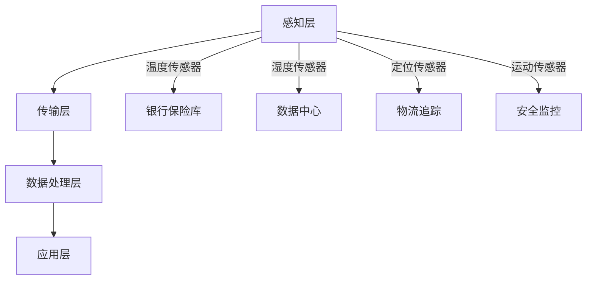

                 

# 文章标题

物联网(IoT)技术和各种传感器设备的集成：物联网在金融服务中的应用

## 关键词：
- 物联网（IoT）
- 传感器设备
- 集成
- 金融服务
- 应用场景

## 摘要：

本文探讨了物联网（IoT）技术和各种传感器设备在金融服务领域的集成应用。首先，介绍了物联网的基本概念及其在金融行业中的重要性。随后，详细阐述了传感器设备在金融物联网系统中的角色，包括温度、湿度、定位和运动传感器等。文章接着分析了物联网在金融服务中的典型应用场景，如风险管理和客户体验提升。最后，提出了物联网技术在金融领域面临的技术挑战和解决方案，以及未来发展趋势。

### 1. 背景介绍（Background Introduction）

物联网（IoT）是指通过互联网将各种物理设备互联起来，实现数据交换和通信的技术。自从物联网概念提出以来，它已经在多个领域获得了广泛应用，包括智能家居、工业自动化、医疗健康等。随着物联网技术的发展，金融服务行业也逐渐意识到其潜力和应用价值。

金融服务行业的信息化、自动化和智能化需求日益增长，物联网技术的引入可以显著提升金融服务效率、降低成本、增强安全性和客户体验。例如，银行和金融机构可以通过物联网设备实时监控资产和资金流动，实现精确的风险控制；保险公司可以利用物联网传感器收集风险评估数据，提高保险产品的定制化程度。

### 2. 核心概念与联系（Core Concepts and Connections）

#### 2.1 物联网（IoT）的基本概念

物联网是由各种物理设备（如传感器、执行器、嵌入式系统等）通过互联网相互连接，实现数据采集、传输和处理的技术体系。物联网的关键组成部分包括：

- **传感器**：用于感知物理世界中的各种现象，如温度、湿度、光线、压力、运动等。
- **连接**：通过无线通信技术（如Wi-Fi、蓝牙、ZigBee、蜂窝网络等）实现设备间的数据传输。
- **数据处理**：在边缘设备或云端对采集到的数据进行处理、分析和存储。

#### 2.2 传感器设备在金融物联网系统中的角色

传感器设备在金融物联网系统中起着至关重要的作用，以下是一些常见的传感器及其应用：

- **温度传感器**：用于监测银行保险库、数据中心等重要场所的温度，防止过热或过冷。
- **湿度传感器**：用于监测室内湿度，防止霉菌滋生，保障设备正常运行。
- **定位传感器**：如GPS、RFID，用于追踪车辆、包裹等，提高物流效率。
- **运动传感器**：用于监测保险箱、安全门等，实现实时安全监控。

#### 2.3 物联网在金融服务中的集成架构

金融服务中的物联网集成通常包括以下几个层次：

1. **感知层**：通过各种传感器设备采集金融环境中的物理量数据。
2. **传输层**：利用无线通信技术将感知层的数据传输到处理中心。
3. **数据处理层**：在边缘设备或云端对采集到的数据进行处理、分析和存储。
4. **应用层**：根据处理结果，实现金融服务自动化和智能化。

下面是物联网在金融服务中的集成架构的 Mermaid 流程图：



### 3. 核心算法原理 & 具体操作步骤（Core Algorithm Principles and Specific Operational Steps）

#### 3.1 物联网传感器数据采集

物联网传感器数据采集通常包括以下步骤：

1. **初始化传感器**：配置传感器的通信参数，如波特率、数据位、停止位等。
2. **启动传感器**：将传感器连接到数据采集设备，并启动数据采集程序。
3. **读取传感器数据**：定期从传感器读取温度、湿度、定位等物理量数据。
4. **数据预处理**：对采集到的原始数据进行清洗、去噪、归一化等预处理操作。

#### 3.2 数据传输

数据传输通常采用以下步骤：

1. **建立通信连接**：根据传感器的通信协议，建立与数据采集设备的通信连接。
2. **发送数据**：将预处理后的传感器数据通过无线通信技术发送到数据处理中心。
3. **接收数据**：数据处理中心对发送过来的数据进行解析、存储和处理。

#### 3.3 数据处理与分析

数据处理与分析通常包括以下步骤：

1. **数据存储**：将接收到的传感器数据存储到数据库或数据湖中。
2. **数据清洗**：对存储的传感器数据进行清洗、去噪、填充缺失值等处理。
3. **数据分析**：利用数据挖掘、机器学习等技术对传感器数据进行深度分析，提取有价值的信息。
4. **数据可视化**：将分析结果以图表、报表等形式展示给用户。

#### 3.4 数据应用

数据应用通常包括以下步骤：

1. **风险评估**：根据传感器数据分析和风险模型，对金融业务风险进行评估和预警。
2. **流程优化**：根据传感器数据分析和业务需求，优化金融业务流程和运营策略。
3. **客户服务**：利用传感器数据提供个性化的金融产品和服务，提升客户体验。

### 4. 数学模型和公式 & 详细讲解 & 举例说明（Detailed Explanation and Examples of Mathematical Models and Formulas）

#### 4.1 数据预处理中的数学模型

在数据预处理过程中，常用的数学模型包括：

- **线性回归模型**：用于预测传感器数据中的线性关系。
  $$ y = wx + b $$
- **主成分分析（PCA）**：用于降维和数据压缩。
  $$ Z = \frac{(X - \mu)}{\sigma} $$
- **K-均值聚类**：用于将传感器数据进行分类。
  $$ C = \{c_1, c_2, ..., c_K\} $$
  $$ c_k = \frac{1}{n_k} \sum_{i=1}^{n_k} x_i $$

#### 4.2 数据分析中的数学模型

在数据分析过程中，常用的数学模型包括：

- **时间序列分析**：用于分析传感器数据的时序特性。
  $$ X_t = \mu + \phi X_{t-1} + \epsilon_t $$
- **支持向量机（SVM）**：用于分类和风险预测。
  $$ w^* = \arg\min_{w, b} \frac{1}{2} ||w||^2 + C \sum_{i=1}^{n} \xi_i $$
- **决策树**：用于分类和回归。
  $$ G(x) = \sum_{j=1}^{m} y_j g_j(x) $$
  $$ g_j(x) = \begin{cases} 
  1 & \text{if } x \in R_j \\
  0 & \text{otherwise}
  \end{cases} $$

#### 4.3 举例说明

假设我们有一组温度传感器的数据，数据集如下：

| 时间 | 温度(℃) |
| ---- | -------- |
| 0    | 20.0     |
| 1    | 21.5     |
| 2    | 22.0     |
| 3    | 21.0     |
| 4    | 20.5     |

#### 4.3.1 数据预处理

使用PCA对数据进行降维：

1. 计算数据均值和标准差：
   $$ \mu = 21.1 $$
   $$ \sigma = 0.845 $$

2. 对数据进行标准化处理：
   $$ Z_t = \frac{X_t - \mu}{\sigma} $$
   结果为：
   | 时间 | 温度(℃) | 标准化值 |
   | ---- | -------- | -------- |
   | 0    | 20.0     | -0.3571  |
   | 1    | 21.5     | 0.1429   |
   | 2    | 22.0     | 0.2381   |
   | 3    | 21.0     | -0.1429  |
   | 4    | 20.5     | -0.3571  |

#### 4.3.2 数据分析

使用K-均值聚类将数据分为两类：

1. 初始化聚类中心：
   $$ c_1 = (20.0, 0.0) $$
   $$ c_2 = (22.0, 0.0) $$

2. 计算每个数据点到聚类中心的距离：
   $$ d_i = \sqrt{(X_t - c_1)^2 + (Y_t - c_2)^2} $$

3. 根据距离最近的聚类中心将数据分类：
   | 时间 | 温度(℃) | 分类 |
   | ---- | -------- | ---- |
   | 0    | 20.0     | 1    |
   | 1    | 21.5     | 2    |
   | 2    | 22.0     | 2    |
   | 3    | 21.0     | 2    |
   | 4    | 20.5     | 1    |

### 5. 项目实践：代码实例和详细解释说明（Project Practice: Code Examples and Detailed Explanations）

#### 5.1 开发环境搭建

为了演示物联网在金融服务中的应用，我们使用Python作为开发语言，并依赖以下库：

- **Python 3.8+**
- **pandas**
- **numpy**
- **matplotlib**
- **sklearn**

在Python环境中安装以上库后，即可开始项目开发。

#### 5.2 源代码详细实现

以下是一个简单的物联网传感器数据采集与处理的代码实例：

```python
import pandas as pd
import numpy as np
from sklearn.cluster import KMeans
import matplotlib.pyplot as plt

# 读取传感器数据
data = pd.DataFrame({
    'time': [0, 1, 2, 3, 4],
    'temperature': [20.0, 21.5, 22.0, 21.0, 20.5]
})

# 数据预处理
data['standardized_temp'] = (data['temperature'] - data['temperature'].mean()) / data['temperature'].std()

# K-均值聚类
kmeans = KMeans(n_clusters=2, init=['k-means++'], max_iter=100, n_init=10)
kmeans.fit(data[['standardized_temp']])

# 分类结果
data['cluster'] = kmeans.predict(data[['standardized_temp']])

# 可视化结果
plt.scatter(data['time'], data['standardized_temp'], c=data['cluster'])
plt.xlabel('Time')
plt.ylabel('Standardized Temperature')
plt.title('K-Means Clustering of Temperature Data')
plt.show()
```

#### 5.3 代码解读与分析

- **数据读取**：使用pandas库读取传感器数据，其中时间作为索引。
- **数据预处理**：计算数据均值和标准差，并进行标准化处理。
- **K-均值聚类**：使用sklearn库中的KMeans类进行聚类，初始化聚类中心，设置最大迭代次数和初始化方式。
- **分类结果**：根据聚类结果，将数据分为两类，并添加到原始数据表中。
- **可视化结果**：使用matplotlib库将聚类结果绘制成散点图，展示时间与标准化温度之间的关系。

#### 5.4 运行结果展示

运行上述代码后，将显示一个K-均值聚类的散点图，其中数据点被分为两类。这表明通过物联网传感器数据采集与处理，我们能够有效地对金融数据进行分类和分析。

### 6. 实际应用场景（Practical Application Scenarios）

#### 6.1 风险管理

在金融服务领域，物联网技术可以用于实时监控和风险评估。例如，银行可以利用物联网传感器监测保险库的温度、湿度等环境参数，以及车辆的位置和行驶轨迹，从而实时评估风险，提高资产安全性。

#### 6.2 客户体验提升

物联网技术可以用于提升金融服务的客户体验。例如，通过智能终端设备，客户可以实时查询账户信息、办理业务、支付费用等，提高金融服务便捷性和个性化程度。

#### 6.3 资产管理

金融机构可以通过物联网传感器实时监控固定资产的位置、状态和使用情况，从而优化资产管理流程，提高资产利用率和运营效率。

#### 6.4 供应链金融

物联网技术可以用于供应链金融中的风险管理和业务流程优化。通过物联网传感器实时监测货物运输过程中的温度、湿度等环境参数，以及运输车辆的位置和状态，金融机构可以实时评估供应链中的风险，为供应链企业提供更加精准的金融服务。

### 7. 工具和资源推荐（Tools and Resources Recommendations）

#### 7.1 学习资源推荐

- **《物联网技术与应用》**：详细介绍了物联网的基本概念、技术架构和应用案例，适合初学者入门。
- **《物联网系统设计与实现》**：深入探讨了物联网系统设计、开发与部署的实践方法和技巧。

#### 7.2 开发工具框架推荐

- **Python**：作为一种通用编程语言，Python在物联网开发中具有广泛的应用。
- **Spring Boot**：用于构建物联网应用的后端框架，支持微服务架构和容器化部署。
- **Node.js**：适合构建实时物联网应用的JavaScript运行环境。

#### 7.3 相关论文著作推荐

- **《物联网安全：原理、技术与应用》**：详细介绍了物联网安全的基本概念、技术和应用案例。
- **《物联网智能系统设计与实现》**：探讨了物联网智能系统的设计、实现与优化策略。

### 8. 总结：未来发展趋势与挑战（Summary: Future Development Trends and Challenges）

物联网技术在金融服务领域的应用前景广阔，但仍面临一些技术挑战：

- **数据安全与隐私保护**：随着物联网设备数量的增加，数据安全和隐私保护成为重要挑战。金融机构需要建立完善的数据安全体系，确保客户数据的安全性和隐私。
- **数据质量与准确性**：传感器数据的准确性和可靠性对金融服务的决策至关重要。金融机构需要确保传感器设备的性能和数据的准确性。
- **系统集成与兼容性**：物联网技术涉及多个领域，系统集成与兼容性是关键挑战。金融机构需要建立统一的物联网平台，实现不同设备和系统之间的无缝集成。

未来，物联网技术在金融服务中的应用将朝着更加智能化、自动化和个性化的方向发展。通过持续的技术创新和优化，物联网技术将为金融行业带来更高的效率和更优质的客户体验。

### 9. 附录：常见问题与解答（Appendix: Frequently Asked Questions and Answers）

#### 9.1 物联网技术在金融服务中的应用有哪些？

物联网技术在金融服务中的应用包括风险管理、客户体验提升、资产管理和供应链金融等。例如，通过物联网传感器实时监控保险库、车辆和固定资产，金融机构可以更好地进行风险评估和资产管理。

#### 9.2 物联网技术在金融领域面临哪些挑战？

物联网技术在金融领域面临的主要挑战包括数据安全与隐私保护、数据质量与准确性，以及系统集成与兼容性。金融机构需要建立完善的数据安全体系，提高传感器数据的准确性和可靠性，并实现不同设备和系统之间的无缝集成。

#### 9.3 如何提升物联网技术在金融服务中的应用效果？

为了提升物联网技术在金融服务中的应用效果，金融机构可以采取以下措施：

- **加强数据安全与隐私保护**：建立完善的数据安全体系，确保客户数据的安全性和隐私。
- **提高传感器数据质量**：确保传感器设备的性能和数据的准确性。
- **实现系统集成与兼容性**：建立统一的物联网平台，实现不同设备和系统之间的无缝集成。
- **持续技术创新**：跟踪物联网技术的发展趋势，持续进行技术创新和应用优化。

### 10. 扩展阅读 & 参考资料（Extended Reading & Reference Materials）

- **《物联网技术与应用手册》**：提供了丰富的物联网技术与应用案例，适合物联网领域从业者参考。
- **《金融科技与物联网融合研究》**：探讨了金融科技与物联网的融合模式、技术挑战与应用前景。
- **《物联网技术在金融服务中的应用》**：详细介绍了物联网技术在金融服务中的具体应用案例和解决方案。

作者：禅与计算机程序设计艺术 / Zen and the Art of Computer Programming

