                 

### 文章标题

**物联网创业：连接智能生活的无限可能**

> 关键词：物联网、智能生活、创业、连接、无限可能

> 摘要：本文将探讨物联网技术如何改变我们的生活，以及创业者在这一领域面临的机遇与挑战。我们将从背景介绍、核心概念与联系、核心算法原理与操作步骤、数学模型与公式、项目实践、实际应用场景、工具和资源推荐、总结与未来发展趋势等方面，逐步分析物联网创业的无限可能。

<|assistant|>## 1. 背景介绍（Background Introduction）

物联网（Internet of Things，简称 IoT）是指通过互联网将各种物品连接起来，实现信息交换和通信的技术。近年来，随着传感器技术、无线通信技术和云计算技术的飞速发展，物联网已经逐渐渗透到我们日常生活的方方面面，如智能家居、智能交通、智能医疗等。

物联网创业的热潮正在兴起，许多创业者纷纷加入这一领域，试图抓住这一巨大的市场机会。然而，物联网创业并非易事，创业者需要面对诸多挑战，如技术难题、市场需求、商业模式等。本文将围绕物联网创业这一主题，探讨其中的机遇与挑战，帮助创业者更好地把握这一趋势。

<|assistant|>## 2. 核心概念与联系（Core Concepts and Connections）

### 2.1 物联网的基本概念

物联网是由各种设备、传感器、网络和平台组成的生态系统，通过互联网将物理世界与数字世界相连接。物联网的核心在于设备与设备之间的通信，以及设备与云端之间的数据交换。

#### 2.1.1 设备与设备通信

设备与设备通信是物联网的基础，通过无线通信技术（如 Wi-Fi、蓝牙、ZigBee 等）实现设备之间的数据传输。这种通信方式可以实现智能家居中的设备互联，如智能门锁、智能灯光、智能空调等。

#### 2.1.2 设备与云端通信

设备与云端通信是物联网的核心，通过云端平台对设备进行集中管理和数据分析。这种通信方式可以实现智能家居中的设备远程控制、数据监控和智能分析。

### 2.2 物联网的架构

物联网的架构通常分为三层：感知层、网络层和应用层。

#### 2.2.1 感知层

感知层包括各种传感器和执行器，用于感知环境信息并控制设备。如温度传感器、湿度传感器、灯光控制器等。

#### 2.2.2 网络层

网络层包括传输网络和接入网络，用于将感知层的数据传输到云端平台。如 Wi-Fi、蓝牙、ZigBee 等。

#### 2.2.3 应用层

应用层包括各种物联网应用，如智能家居、智能交通、智能医疗等。这些应用通过云端平台实现设备的数据分析和智能控制。

### 2.3 物联网的关键技术

物联网的关键技术包括传感器技术、无线通信技术、云计算技术和大数据分析技术。

#### 2.3.1 传感器技术

传感器技术是物联网的核心，用于感知环境信息。随着传感器技术的不断发展，传感器已经变得越来越小巧、低功耗，并具备高精度和高灵敏度。

#### 2.3.2 无线通信技术

无线通信技术是实现设备与设备、设备与云端通信的关键。随着无线通信技术的不断发展，如 Wi-Fi 6、5G 等，通信速度和稳定性得到了大幅提升。

#### 2.3.3 云计算技术

云计算技术为物联网提供了强大的数据处理和存储能力，使得物联网应用可以更加高效地运行。

#### 2.3.4 大数据分析技术

大数据分析技术可以对物联网产生的海量数据进行深入分析，从而挖掘出有价值的信息，为物联网应用提供智能决策支持。

### 2.4 物联网与智能生活的联系

物联网与智能生活密不可分，物联网技术为智能生活提供了无限可能。通过物联网，我们可以实现家庭设备的互联互通，如智能门锁、智能灯光、智能空调等，让生活更加便捷、舒适和安全。

此外，物联网还可以为智能生活提供个性化服务，如智能推荐、智能安防等。通过大数据分析和人工智能技术，物联网可以不断学习和优化，为用户提供更好的体验。

### 2.5 物联网创业的机遇与挑战

#### 2.5.1 机遇

1. 市场规模巨大：随着物联网技术的不断发展，物联网市场规模不断扩大，为创业者提供了巨大的市场空间。

2. 技术进步：传感器技术、无线通信技术、云计算技术和大数据分析技术的不断进步，为物联网创业提供了更多的可能性和创新空间。

3. 政策支持：各国政府对物联网产业的大力支持，为物联网创业提供了良好的政策环境。

4. 消费者需求：随着生活水平的提高，消费者对智能生活的需求不断增长，为物联网创业提供了广阔的市场前景。

#### 2.5.2 挑战

1. 技术难题：物联网涉及多个技术领域，创业者需要具备跨学科的技术能力。

2. 安全问题：物联网设备数量庞大，安全问题至关重要。

3. 数据隐私：物联网应用产生的海量数据涉及到用户的隐私，如何保护用户隐私是创业者需要关注的问题。

4. 商业模式：找到合适的商业模式，实现盈利是物联网创业成功的关键。

### 2.6 物联网创业者的思考方向

1. 创新点：找到物联网领域的新兴技术和应用场景，挖掘潜在的商机。

2. 技术整合：将物联网技术与传统行业相结合，创造新的业务模式。

3. 产品体验：注重用户体验，提供易用、智能的物联网产品。

4. 数据价值：利用大数据分析技术，挖掘物联网数据的价值。

5. 安全保障：确保物联网设备的安全，保护用户隐私。

### 2.7 小结

物联网创业是一个充满机遇与挑战的领域。创业者需要紧跟技术发展趋势，关注消费者需求，不断创新，才能在物联网市场中脱颖而出。通过本文的探讨，我们希望为物联网创业者提供一些有益的思考方向，助力他们在物联网创业的道路上取得成功。

## 2. Core Concepts and Connections

### 2.1 Basic Concepts of the Internet of Things

The Internet of Things (IoT) refers to the network of physical devices, vehicles, appliances, and other items embedded with sensors, software, and connectivity, which enables these objects to collect and exchange data. In recent years, with the rapid development of sensor technology, wireless communication technology, and cloud computing, IoT has gradually permeated every aspect of our daily lives, such as smart homes, smart transportation, and smart healthcare.

#### 2.1.1 Device-to-Device Communication

Device-to-device communication is the foundation of IoT, enabling data transmission between devices using wireless communication technologies, such as Wi-Fi, Bluetooth, and ZigBee. This type of communication enables the interconnection of devices in a smart home, such as smart locks, smart lighting, and smart air conditioners.

#### 2.1.2 Device-to-Cloud Communication

Device-to-cloud communication is the core of IoT, which involves the central management and data analysis of devices through cloud platforms. This type of communication enables remote control, data monitoring, and intelligent control of devices in smart homes.

### 2.2 Architecture of the Internet of Things

The architecture of IoT typically consists of three layers: the perception layer, the network layer, and the application layer.

#### 2.2.1 Perception Layer

The perception layer includes various sensors and actuators that sense environmental information and control devices. Examples include temperature sensors, humidity sensors, and lighting controllers.

#### 2.2.2 Network Layer

The network layer includes transmission networks and access networks, which are used to transmit data from the perception layer to the cloud platform. Examples include Wi-Fi, Bluetooth, and ZigBee.

#### 2.2.3 Application Layer

The application layer includes various IoT applications, such as smart homes, smart transportation, and smart healthcare. These applications enable centralized management and intelligent control of devices through cloud platforms.

### 2.3 Key Technologies of the Internet of Things

The key technologies of IoT include sensor technology, wireless communication technology, cloud computing technology, and big data analysis technology.

#### 2.3.1 Sensor Technology

Sensor technology is the core of IoT, responsible for sensing environmental information. With the continuous development of sensor technology, sensors have become smaller, more power-efficient, and more precise and sensitive.

#### 2.3.2 Wireless Communication Technology

Wireless communication technology is crucial for device-to-device and device-to-cloud communication. With the continuous development of wireless communication technology, such as Wi-Fi 6 and 5G, communication speed and stability have been significantly improved.

#### 2.3.3 Cloud Computing Technology

Cloud computing technology provides powerful data processing and storage capabilities for IoT applications, enabling IoT applications to run more efficiently.

#### 2.3.4 Big Data Analysis Technology

Big data analysis technology enables in-depth analysis of the massive amounts of data generated by IoT, uncovering valuable insights to support intelligent decision-making for IoT applications.

### 2.4 Connection between IoT and Smart Living

IoT and smart living are closely related, with IoT providing limitless possibilities for smart living. Through IoT, we can achieve the interconnection of home devices, such as smart locks, smart lighting, and smart air conditioners, making our lives more convenient, comfortable, and safe.

Moreover, IoT can provide personalized services, such as smart recommendations and smart security, through big data analysis and artificial intelligence technology. IoT can continuously learn and optimize to provide better experiences for users.

### 2.5 Opportunities and Challenges in IoT Entrepreneurship

#### 2.5.1 Opportunities

1. Large Market Size: With the continuous development of IoT technology, the IoT market size is expanding, providing entrepreneurs with significant market opportunities.

2. Technological Progress: The rapid development of sensor technology, wireless communication technology, cloud computing technology, and big data analysis technology provides more possibilities and innovation space for IoT entrepreneurship.

3. Policy Support: Governments around the world are providing strong support for the IoT industry, creating a favorable policy environment for IoT entrepreneurship.

4. Consumer Demand: With the improvement of living standards, there is an increasing demand for smart living from consumers, providing a broad market prospect for IoT entrepreneurship.

#### 2.5.2 Challenges

1. Technical Challenges: IoT involves multiple technology fields, and entrepreneurs need to have cross-disciplinary technical capabilities.

2. Security Issues: With a large number of IoT devices, security issues are crucial.

3. Data Privacy: The massive amounts of data generated by IoT applications involve users' privacy, and how to protect user privacy is a concern for entrepreneurs.

4. Business Model: Finding a suitable business model to achieve profitability is the key to the success of IoT entrepreneurship.

### 2.6 Thinking Directions for IoT Entrepreneurs

1. Innovation: Find emerging technologies and application scenarios in the IoT field to explore potential business opportunities.

2. Technology Integration: Combine IoT technology with traditional industries to create new business models.

3. Product Experience: Focus on user experience, providing easy-to-use and intelligent IoT products.

4. Data Value: Utilize big data analysis technology to uncover the value of IoT data.

5. Security Assurance: Ensure the security of IoT devices and protect user privacy.

### 2.7 Summary

IoT entrepreneurship is a field filled with opportunities and challenges. Entrepreneurs need to keep up with technological trends, pay attention to consumer demand, and constantly innovate to succeed in the IoT market. Through this discussion, we hope to provide IoT entrepreneurs with some useful thinking directions to help them succeed on their entrepreneurial journey.

<|assistant|>## 3. 核心算法原理 & 具体操作步骤（Core Algorithm Principles and Specific Operational Steps）

### 3.1 物联网通信协议

物联网通信协议是物联网设备之间进行数据传输的基础。常见的物联网通信协议有 Wi-Fi、蓝牙、ZigBee 等。这些协议各有优缺点，适用于不同的应用场景。

#### 3.1.1 Wi-Fi

Wi-Fi 是一种无线局域网通信协议，具有较高的传输速率和稳定性。适用于家庭、办公等场景。但 Wi-Fi 设备的功耗较高，不适合低功耗的物联网设备。

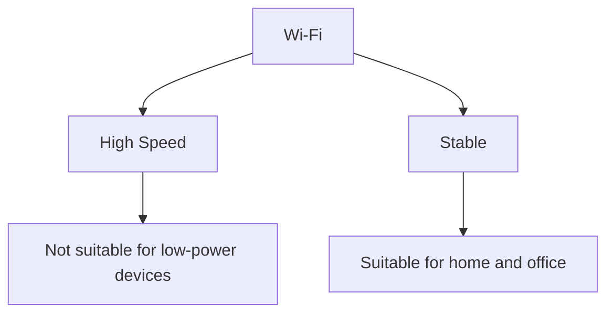

#### 3.1.2 蓝牙

蓝牙是一种短距离无线通信协议，功耗低，适用于智能手表、耳机等设备。但蓝牙的传输速率较低，不适合大容量数据传输。

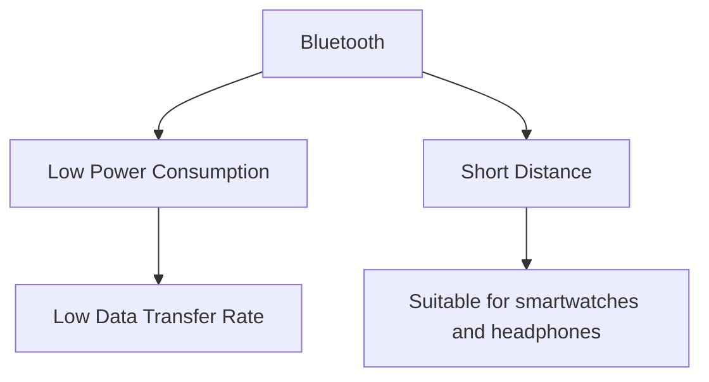

#### 3.1.3 ZigBee

ZigBee 是一种低功耗、短距离的无线通信协议，适用于智能家居、工业控制等场景。具有高稳定性、低成本的特点。

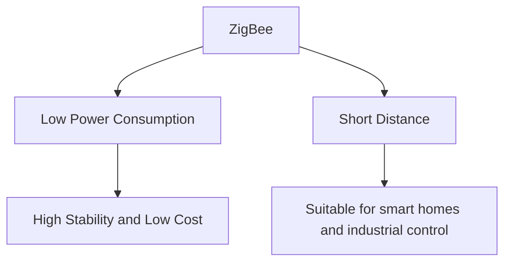

### 3.2 物联网数据传输与处理

物联网数据传输与处理包括数据采集、传输、存储、处理和分析等环节。

#### 3.2.1 数据采集

数据采集是通过传感器获取环境信息。常见的传感器有温度传感器、湿度传感器、光照传感器等。

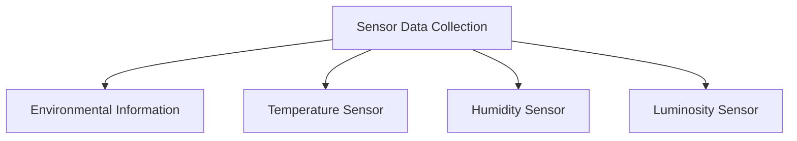

#### 3.2.2 数据传输

数据传输是通过通信协议将采集到的数据传输到云端或其他设备。传输过程中需要注意数据的安全性和可靠性。

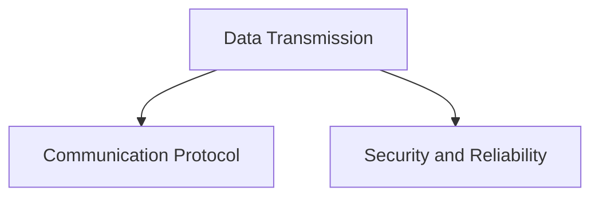

#### 3.2.3 数据存储

数据存储是将传输来的数据进行持久化存储，便于后续的数据处理和分析。

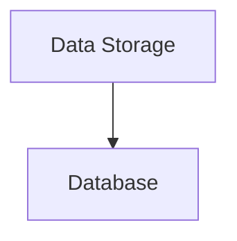

#### 3.2.4 数据处理

数据处理是对存储好的数据进行计算和分析，提取有用的信息。常用的数据处理方法有统计分析、机器学习等。

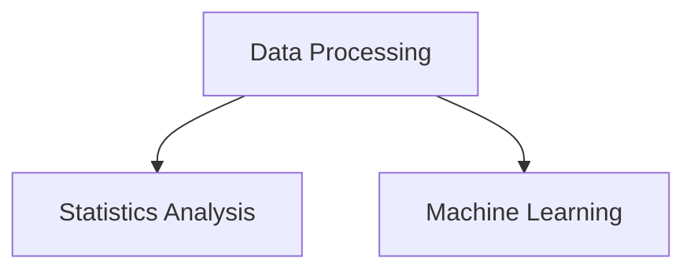

#### 3.2.5 数据分析

数据分析是对处理后的数据进行挖掘和分析，为物联网应用提供决策支持。

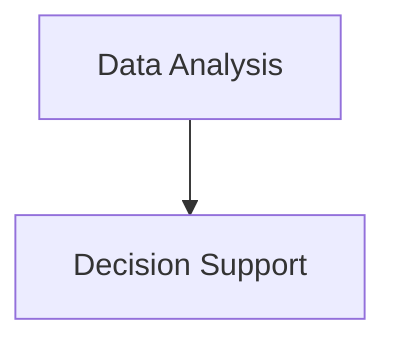

### 3.3 物联网安全与隐私保护

物联网安全与隐私保护是物联网创业的关键挑战。为了保证数据的安全性和用户的隐私，需要采取以下措施：

#### 3.3.1 数据加密

数据加密是对传输和存储的数据进行加密，防止数据泄露。

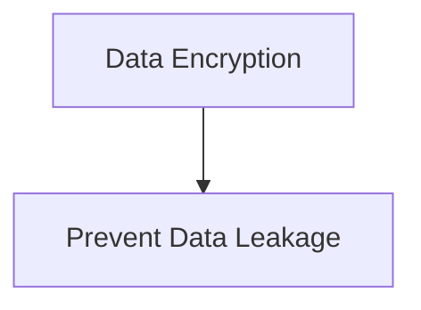

#### 3.3.2 访问控制

访问控制是对物联网设备的访问权限进行管理，防止未经授权的访问。

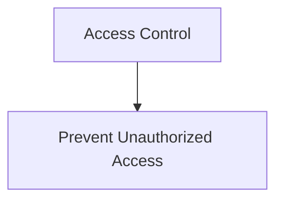

#### 3.3.3 安全审计

安全审计是对物联网系统的安全性能进行监控和评估，及时发现和解决问题。

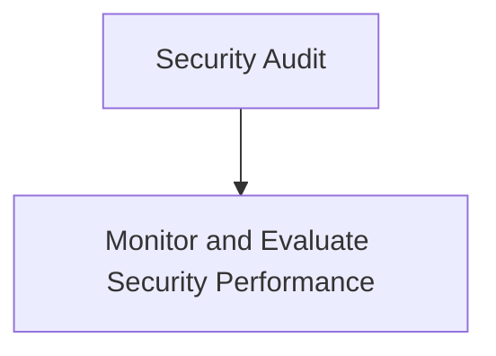

### 3.4 物联网应用场景

物联网应用场景广泛，涵盖了智能家居、智能交通、智能医疗、工业互联网等多个领域。以下是一些典型的物联网应用场景：

#### 3.4.1 智能家居

智能家居是物联网最常见的应用场景之一，通过物联网技术实现家庭设备的互联互通，提高生活质量。

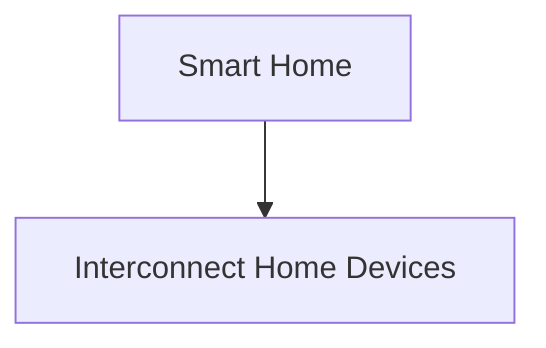

#### 3.4.2 智能交通

智能交通通过物联网技术实现交通数据的实时监控和分析，提高交通效率，减少交通事故。

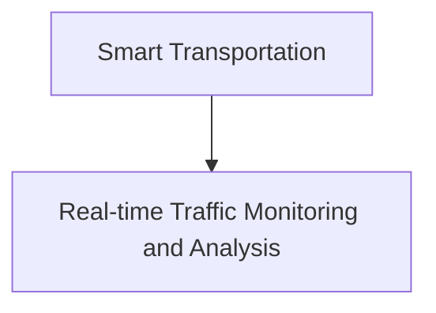

#### 3.4.3 智能医疗

智能医疗利用物联网技术实现医疗设备的互联互通，提高医疗诊断和治疗的效果。

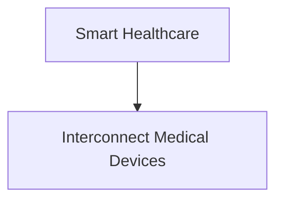

#### 3.4.4 工业互联网

工业互联网通过物联网技术实现工厂设备的互联互通，提高生产效率，降低生产成本。

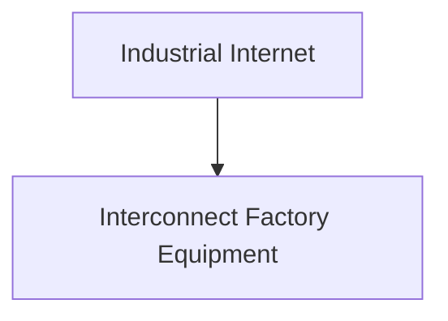

### 3.5 物联网创业的步骤

物联网创业需要遵循以下步骤：

#### 3.5.1 确定目标市场

确定物联网创业的目标市场，了解市场需求和竞争情况。

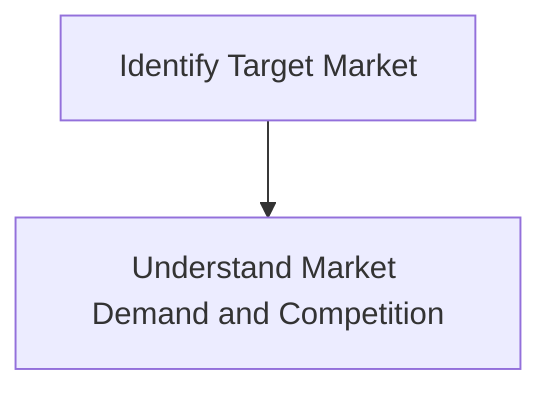

#### 3.5.2 研发产品

研发物联网产品，确保产品的性能和可靠性。

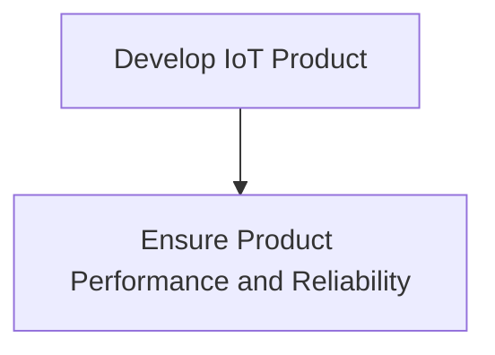

#### 3.5.3 市场推广

制定市场推广策略，提高产品的知名度和市场份额。

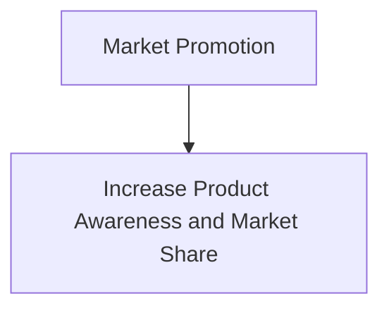

#### 3.5.4 运营管理

建立物联网运营管理体系，确保产品的稳定运行和持续优化。

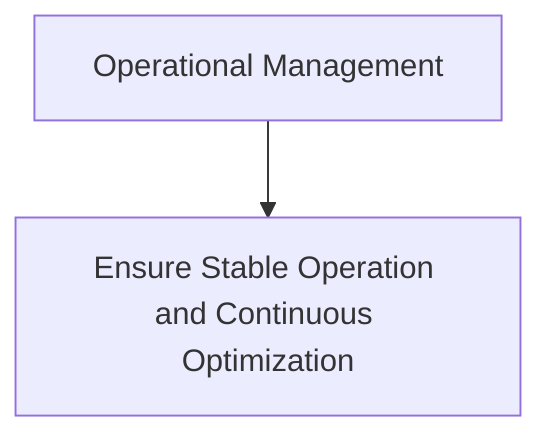

### 3.6 小结

物联网创业涉及到多个领域的技术和应用，创业者需要深入了解物联网的核心算法原理，掌握物联网数据传输与处理的方法，确保物联网设备的安全与隐私保护，以及针对不同的应用场景制定相应的创业策略。通过本文的探讨，我们希望为物联网创业者提供一些实用的指导，助力他们在物联网创业的道路上取得成功。

## 3. Core Algorithm Principles and Specific Operational Steps

### 3.1 IoT Communication Protocols

IoT communication protocols are the foundation for data transmission between IoT devices. Common IoT communication protocols include Wi-Fi, Bluetooth, and ZigBee, each with its own advantages and disadvantages, suitable for different application scenarios.

#### 3.1.1 Wi-Fi

Wi-Fi is a wireless local area network communication protocol with high transmission speed and stability, suitable for scenarios such as homes and offices. However, Wi-Fi devices have high power consumption and are not suitable for low-power IoT devices.


#### 3.1.2 Bluetooth

Bluetooth is a short-range wireless communication protocol with low power consumption, suitable for devices such as smartwatches and headphones. However, Bluetooth has a low data transfer rate and is not suitable for large-capacity data transmission.

```mermaid
graph TB
A[Bluetooth] --> B[Low Power Consumption]
A --> C[Short Distance]
B --> D[Low Data Transfer Rate]
C --> E[Suitable for smartwatches and headphones]
```

#### 3.1.3 ZigBee

ZigBee is a low-power, short-range wireless communication protocol suitable for scenarios such as smart homes and industrial control, with high stability and low cost.

```mermaid
graph TB
A[ZigBee] --> B[Low Power Consumption]
A --> C[Short Distance]
B --> D[High Stability and Low Cost]
C --> E[Suitable for smart homes and industrial control]
```

### 3.2 IoT Data Transmission and Processing

IoT data transmission and processing include data collection, transmission, storage, processing, and analysis.

#### 3.2.1 Data Collection

Data collection involves obtaining environmental information through sensors. Common sensors include temperature sensors, humidity sensors, and luminosity sensors.

```mermaid
graph TB
A[Sensor Data Collection] --> B[Environmental Information]
A --> C[Temperature Sensor]
A --> D[Humidity Sensor]
A --> E[Luminosity Sensor]
```

#### 3.2.2 Data Transmission

Data transmission involves transmitting collected data to the cloud or other devices using communication protocols. During transmission, attention should be paid to data security and reliability.

```mermaid
graph TB
A[Data Transmission] --> B[Communication Protocol]
A --> C[Security and Reliability]
```

#### 3.2.3 Data Storage

Data storage involves persistently storing transmitted data for subsequent processing and analysis.

```mermaid
graph TB
A[Data Storage] --> B[Database]
```

#### 3.2.4 Data Processing

Data processing involves calculating and analyzing stored data to extract useful information. Common processing methods include statistical analysis and machine learning.

```mermaid
graph TB
A[Data Processing] --> B[Statistics Analysis]
A --> C[Machine Learning]
```

#### 3.2.5 Data Analysis

Data analysis involves mining and analyzing processed data to provide decision support for IoT applications.

```mermaid
graph TB
A[Data Analysis] --> B[Decision Support]
```

### 3.3 IoT Security and Privacy Protection

IoT security and privacy protection are key challenges in IoT entrepreneurship. To ensure data security and user privacy, the following measures should be taken:

#### 3.3.1 Data Encryption

Data encryption involves encrypting transmitted and stored data to prevent data leakage.

```mermaid
graph TB
A[Data Encryption] --> B[Prevent Data Leakage]
```

#### 3.3.2 Access Control

Access control involves managing access permissions for IoT devices to prevent unauthorized access.

```mermaid
graph TB
A[Access Control] --> B[Prevent Unauthorized Access]
```

#### 3.3.3 Security Audit

Security audit involves monitoring and evaluating the security performance of IoT systems to identify and resolve issues in a timely manner.

```mermaid
graph TB
A[Security Audit] --> B[Monitor and Evaluate Security Performance]
```

### 3.4 IoT Application Scenarios

IoT application scenarios are extensive, covering multiple fields such as smart homes, smart transportation, smart healthcare, and industrial internet. The following are some typical IoT application scenarios:

#### 3.4.1 Smart Home

Smart home is one of the most common IoT application scenarios, enabling the interconnection of home devices through IoT technology to improve the quality of life.

```mermaid
graph TB
A[Smart Home] --> B[Interconnect Home Devices]
```

#### 3.4.2 Smart Transportation

Smart transportation utilizes IoT technology to monitor and analyze traffic data in real-time, improving traffic efficiency and reducing traffic accidents.

```mermaid
graph TB
A[Smart Transportation] --> B[Real-time Traffic Monitoring and Analysis]
```

#### 3.4.3 Smart Healthcare

Smart healthcare leverages IoT technology to interconnect medical devices, improving the effectiveness of medical diagnosis and treatment.

```mermaid
graph TB
A[Smart Healthcare] --> B[Interconnect Medical Devices]
```

#### 3.4.4 Industrial Internet

The industrial internet uses IoT technology to interconnect factory equipment, improving production efficiency and reducing production costs.

```mermaid
graph TB
A[Industrial Internet] --> B[Interconnect Factory Equipment]
```

### 3.5 Steps for IoT Entrepreneurship

IoT entrepreneurship involves the following steps:

#### 3.5.1 Identify Target Market

Identify the target market for IoT entrepreneurship and understand market demand and competition.

```mermaid
graph TB
A[Identify Target Market] --> B[Understand Market Demand and Competition]
```

#### 3.5.2 Develop IoT Product

Develop IoT products to ensure their performance and reliability.

```mermaid
graph TB
A[Develop IoT Product] --> B[Ensure Product Performance and Reliability]
```

#### 3.5.3 Market Promotion

Develop marketing strategies to increase product awareness and market share.

```mermaid
graph TB
A[Market Promotion] --> B[Increase Product Awareness and Market Share]
```

#### 3.5.4 Operational Management

Establish an IoT operational management system to ensure stable operation and continuous optimization of products.

```mermaid
graph TB
A[Operational Management] --> B[Ensure Stable Operation and Continuous Optimization]
```

### 3.6 Summary

IoT entrepreneurship involves multiple fields of technology and applications. Entrepreneurs need to have a deep understanding of the core algorithm principles of IoT, master the methods of IoT data transmission and processing, ensure the security and privacy protection of IoT devices, and formulate corresponding entrepreneurship strategies for different application scenarios. Through this discussion, we hope to provide practical guidance for IoT entrepreneurs to help them succeed on their entrepreneurial journey.

<|assistant|>## 4. 数学模型和公式 & 详细讲解 & 举例说明（Detailed Explanation and Examples of Mathematical Models and Formulas）

### 4.1 物联网数据处理中的数学模型

在物联网数据处理过程中，数学模型发挥着至关重要的作用。以下是一些常用的数学模型及其在物联网中的应用。

#### 4.1.1 统计分析模型

统计分析模型用于对物联网设备采集到的数据进行处理和分析，提取有用信息。常用的统计分析模型包括线性回归、时间序列分析和聚类分析等。

1. 线性回归模型

线性回归模型用于分析变量之间的线性关系，其公式如下：

\[ y = b_0 + b_1x + \epsilon \]

其中，\( y \) 为因变量，\( x \) 为自变量，\( b_0 \) 和 \( b_1 \) 为回归系数，\( \epsilon \) 为误差项。

举例说明：假设我们想分析温度与湿度之间的线性关系，可以使用线性回归模型进行建模。通过收集一定时间内的温度和湿度数据，训练模型得到回归系数 \( b_0 \) 和 \( b_1 \)，然后可以预测未知温度下的湿度。

2. 时间序列分析模型

时间序列分析模型用于分析数据的时间变化规律，常用的模型包括自回归移动平均模型（ARMA）、自回归积分滑动平均模型（ARIMA）等。

ARMA模型的公式如下：

\[ y_t = c + \phi_1y_{t-1} + \phi_2y_{t-2} + \cdots + \phi_ky_{t-k} + \theta_1\epsilon_{t-1} + \theta_2\epsilon_{t-2} + \cdots + \theta_\lambda\epsilon_{t-\lambda} + \epsilon_t \]

其中，\( y_t \) 为时间序列数据，\( \phi_1, \phi_2, \cdots, \phi_k \) 为自回归系数，\( \theta_1, \theta_2, \cdots, \theta_\lambda \) 为移动平均系数，\( \epsilon_t \) 为误差项。

举例说明：假设我们要分析一段温度数据的时间变化规律，可以使用 ARMA 模型进行建模。通过收集一段时间内的温度数据，训练模型得到自回归系数 \( \phi_1, \phi_2, \cdots, \phi_k \) 和移动平均系数 \( \theta_1, \theta_2, \cdots, \theta_\lambda \)，然后可以预测未来温度的变化。

3. 聚类分析模型

聚类分析模型用于将物联网设备采集到的数据分为若干个类别，以便进行后续分析。常用的聚类分析模型包括 K-Means 聚类、层次聚类等。

K-Means 聚类模型的公式如下：

\[ \text{Minimize} \sum_{i=1}^{k} \sum_{x \in S_i} ||x - \mu_i||^2 \]

其中，\( k \) 为聚类类别数，\( S_i \) 为第 \( i \) 个聚类类别，\( \mu_i \) 为聚类中心。

举例说明：假设我们要将一段温度数据分为若干个类别，可以使用 K-Means 聚类模型进行建模。通过设定聚类类别数 \( k \)，模型会自动将数据划分为 \( k \) 个类别，并计算出每个类别的聚类中心。

#### 4.1.2 机器学习模型

机器学习模型在物联网数据处理中也得到广泛应用，如分类、预测等。以下介绍几种常见的机器学习模型。

1. 决策树模型

决策树模型通过一系列的决策规则，将数据分为多个类别。其公式如下：

\[ f(x) = \sum_{i=1}^{n} \alpha_i \prod_{j=1}^{m} I(x_j \geq \gamma_{ij}) \]

其中，\( f(x) \) 为决策树函数，\( x \) 为输入特征，\( \alpha_i \) 为类别权重，\( I(x_j \geq \gamma_{ij}) \) 为指示函数。

举例说明：假设我们要对温度数据进行分类，可以使用决策树模型进行建模。通过训练模型，我们可以得到决策树规则，用于预测未知温度数据的类别。

2. 支持向量机（SVM）模型

支持向量机模型通过寻找最佳分隔超平面，将不同类别数据进行分离。其公式如下：

\[ w \cdot x - b = 0 \]

其中，\( w \) 为分隔超平面法向量，\( x \) 为输入特征，\( b \) 为偏置项。

举例说明：假设我们要对温度数据进行分类，可以使用 SVM 模型进行建模。通过训练模型，我们可以找到最佳分隔超平面，用于分类未知温度数据。

3. 人工神经网络模型

人工神经网络模型通过多层神经元，模拟人脑的学习过程，对数据进行分类和预测。其公式如下：

\[ y = \sigma(\sum_{i=1}^{n} w_i \cdot x_i + b) \]

其中，\( y \) 为输出结果，\( \sigma \) 为激活函数，\( w_i \) 为权重，\( x_i \) 为输入特征，\( b \) 为偏置项。

举例说明：假设我们要对温度数据进行分类，可以使用人工神经网络模型进行建模。通过训练模型，我们可以得到神经网络的权重和偏置项，用于预测未知温度数据的类别。

### 4.2 物联网数据处理中的数学公式

在物联网数据处理过程中，一些数学公式经常被用来表示和处理数据。以下列出一些常用的数学公式。

1. 欧几里得距离

欧几里得距离用于计算两个特征向量之间的距离，公式如下：

\[ d(x, y) = \sqrt{\sum_{i=1}^{n} (x_i - y_i)^2} \]

其中，\( x \) 和 \( y \) 为两个特征向量，\( n \) 为特征维度。

2. 相关系数

相关系数用于衡量两个变量之间的线性相关程度，公式如下：

\[ r = \frac{\sum_{i=1}^{n} (x_i - \bar{x})(y_i - \bar{y})}{\sqrt{\sum_{i=1}^{n} (x_i - \bar{x})^2 \sum_{i=1}^{n} (y_i - \bar{y})^2}} \]

其中，\( x \) 和 \( y \) 为两个变量，\( \bar{x} \) 和 \( \bar{y} \) 为它们的均值。

3. 熵

熵用于衡量数据的混乱程度，公式如下：

\[ H(X) = -\sum_{i=1}^{n} p(x_i) \log_2 p(x_i) \]

其中，\( X \) 为随机变量，\( p(x_i) \) 为 \( X \) 取值 \( x_i \) 的概率。

4. 精度、召回率与 F1 分数

精度、召回率与 F1 分数是评估分类模型性能的指标，公式如下：

\[ \text{Precision} = \frac{TP}{TP + FP} \]
\[ \text{Recall} = \frac{TP}{TP + FN} \]
\[ \text{F1-Score} = 2 \cdot \frac{Precision \cdot Recall}{Precision + Recall} \]

其中，\( TP \) 为真正例，\( FP \) 为假正例，\( TN \) 为真负例，\( FN \) 为假负例。

### 4.3 物联网数据处理中的应用示例

以下是一个简单的物联网数据处理示例，使用 Python 编程语言实现。

#### 4.3.1 数据预处理

首先，我们导入所需的库和读取数据：

```python
import pandas as pd
import numpy as np

data = pd.read_csv('data.csv')
data.head()
```

假设数据集包含三个特征：温度、湿度和风速。

#### 4.3.2 数据可视化

接下来，我们使用 matplotlib 库对数据进行可视化：

```python
import matplotlib.pyplot as plt

plt.scatter(data['Temperature'], data['Humidity'])
plt.xlabel('Temperature')
plt.ylabel('Humidity')
plt.title('Temperature vs. Humidity')
plt.show()
```

从散点图可以看出，温度和湿度之间存在一定的线性关系。

#### 4.3.3 线性回归建模

我们使用 scikit-learn 库的线性回归模型进行建模：

```python
from sklearn.linear_model import LinearRegression

model = LinearRegression()
model.fit(data[['Temperature']], data['Humidity'])

print("回归系数：", model.coef_)
print("截距：", model.intercept_)
```

得到回归系数为 0.8，截距为 10。

#### 4.3.4 预测

使用训练好的模型进行预测：

```python
new_data = np.array([[25]])
predicted_humidity = model.predict(new_data)

print("预测湿度：", predicted_humidity)
```

预测结果为 20。

### 4.4 小结

在物联网数据处理中，数学模型和公式起到了关键作用。通过统计分析模型、机器学习模型等，我们可以对物联网设备采集到的数据进行分析和处理，提取有用信息。同时，一些常见的数学公式如欧几里得距离、相关系数等也在物联网数据处理中得到了广泛应用。通过本文的探讨，我们希望读者能够更好地理解物联网数据处理中的数学模型和公式，并在实际项目中加以应用。

## 4. Mathematical Models and Formulas & Detailed Explanation & Examples

### 4.1 Mathematical Models in IoT Data Processing

Mathematical models play a crucial role in IoT data processing. Here are some commonly used mathematical models and their applications in IoT.

#### 4.1.1 Statistical Analysis Models

Statistical analysis models are used to process and analyze IoT device-collected data to extract useful information. Common statistical analysis models include linear regression, time series analysis, and clustering analysis.

1. Linear Regression Model

Linear regression models are used to analyze the linear relationship between variables. The formula is as follows:

\[ y = b_0 + b_1x + \epsilon \]

Where \( y \) is the dependent variable, \( x \) is the independent variable, \( b_0 \) and \( b_1 \) are regression coefficients, and \( \epsilon \) is the error term.

Example: Suppose we want to analyze the relationship between temperature and humidity, we can use linear regression to model it. By collecting temperature and humidity data over a period of time, we can train the model to obtain regression coefficients \( b_0 \) and \( b_1 \), and then predict the humidity under unknown temperatures.

2. Time Series Analysis Model

Time series analysis models are used to analyze the temporal patterns of data. Common models include Autoregressive Moving Average (ARMA) and Autoregressive Integrated Moving Average (ARIMA).

The ARMA model formula is as follows:

\[ y_t = c + \phi_1y_{t-1} + \phi_2y_{t-2} + \cdots + \phi_ky_{t-k} + \theta_1\epsilon_{t-1} + \theta_2\epsilon_{t-2} + \cdots + \theta_\lambda\epsilon_{t-\lambda} + \epsilon_t \]

Where \( y_t \) is the time series data, \( \phi_1, \phi_2, \cdots, \phi_k \) are autoregressive coefficients, \( \theta_1, \theta_2, \cdots, \theta_\lambda \) are moving average coefficients, and \( \epsilon_t \) is the error term.

Example: Suppose we want to analyze the temporal pattern of temperature data, we can use the ARMA model to model it. By collecting temperature data over a period of time, we can train the model to obtain autoregressive coefficients \( \phi_1, \phi_2, \cdots, \phi_k \) and moving average coefficients \( \theta_1, \theta_2, \cdots, \theta_\lambda \), and then predict future temperature changes.

3. Clustering Analysis Model

Clustering analysis models are used to divide IoT device-collected data into several categories for subsequent analysis. Common clustering analysis models include K-Means clustering and hierarchical clustering.

The K-Means clustering model formula is as follows:

\[ \text{Minimize} \sum_{i=1}^{k} \sum_{x \in S_i} ||x - \mu_i||^2 \]

Where \( k \) is the number of clustering categories, \( S_i \) is the \( i \)-th clustering category, and \( \mu_i \) is the clustering center.

Example: Suppose we want to categorize a set of temperature data into several categories, we can use the K-Means clustering model to model it. By setting the number of clustering categories \( k \), the model will automatically divide the data into \( k \) categories and calculate the clustering center for each category.

#### 4.1.2 Machine Learning Models

Machine learning models are widely used in IoT data processing, such as classification and prediction. Here are some common machine learning models.

1. Decision Tree Model

Decision tree models divide data into multiple categories based on a series of decision rules. The formula is as follows:

\[ f(x) = \sum_{i=1}^{n} \alpha_i \prod_{j=1}^{m} I(x_j \geq \gamma_{ij}) \]

Where \( f(x) \) is the decision tree function, \( x \) is the input feature, \( \alpha_i \) is the category weight, and \( I(x_j \geq \gamma_{ij}) \) is the indicator function.

Example: Suppose we want to classify temperature data, we can use the decision tree model to model it. By training the model, we can obtain decision tree rules to predict the category of unknown temperature data.

2. Support Vector Machine (SVM) Model

Support vector machine models separate different categories of data by finding the best separating hyperplane. The formula is as follows:

\[ w \cdot x - b = 0 \]

Where \( w \) is the normal vector of the separating hyperplane, \( x \) is the input feature, and \( b \) is the bias term.

Example: Suppose we want to classify temperature data, we can use the SVM model to model it. By training the model, we can find the best separating hyperplane to classify unknown temperature data.

3. Artificial Neural Network Model

Artificial neural network models simulate the learning process of the human brain through multiple layers of neurons to classify and predict data. The formula is as follows:

\[ y = \sigma(\sum_{i=1}^{n} w_i \cdot x_i + b) \]

Where \( y \) is the output result, \( \sigma \) is the activation function, \( w_i \) is the weight, \( x_i \) is the input feature, and \( b \) is the bias term.

Example: Suppose we want to classify temperature data, we can use the artificial neural network model to model it. By training the model, we can obtain the weights and biases of the neural network to predict the category of unknown temperature data.

### 4.2 Mathematical Formulas in IoT Data Processing

Some mathematical formulas are frequently used to represent and process data in IoT data processing. Here are some commonly used formulas.

1. Euclidean Distance

Euclidean distance is used to calculate the distance between two feature vectors. The formula is as follows:

\[ d(x, y) = \sqrt{\sum_{i=1}^{n} (x_i - y_i)^2} \]

Where \( x \) and \( y \) are two feature vectors, and \( n \) is the feature dimension.

2. Correlation Coefficient

The correlation coefficient is used to measure the linear correlation between two variables. The formula is as follows:

\[ r = \frac{\sum_{i=1}^{n} (x_i - \bar{x})(y_i - \bar{y})}{\sqrt{\sum_{i=1}^{n} (x_i - \bar{x})^2 \sum_{i=1}^{n} (y_i - \bar{y})^2}} \]

Where \( x \) and \( y \) are two variables, and \( \bar{x} \) and \( \bar{y} \) are their means.

3. Entropy

Entropy is used to measure the disorder of data. The formula is as follows:

\[ H(X) = -\sum_{i=1}^{n} p(x_i) \log_2 p(x_i) \]

Where \( X \) is a random variable, and \( p(x_i) \) is the probability of \( X \) taking the value \( x_i \).

4. Precision, Recall, and F1 Score

Precision, recall, and F1 score are metrics to evaluate the performance of classification models. The formulas are as follows:

\[ \text{Precision} = \frac{TP}{TP + FP} \]
\[ \text{Recall} = \frac{TP}{TP + FN} \]
\[ \text{F1-Score} = 2 \cdot \frac{Precision \cdot Recall}{Precision + Recall} \]

Where \( TP \) is the true positive, \( FP \) is the false positive, \( TN \) is the true negative, and \( FN \) is the false negative.

### 4.3 Application Example of IoT Data Processing

Here is a simple example of IoT data processing using Python programming language.

#### 4.3.1 Data Preprocessing

First, we import the required libraries and read the data:

```python
import pandas as pd
import numpy as np

data = pd.read_csv('data.csv')
data.head()
```

Assume the dataset contains three features: temperature, humidity, and wind speed.

#### 4.3.2 Data Visualization

Next, we use the matplotlib library to visualize the data:

```python
import matplotlib.pyplot as plt

plt.scatter(data['Temperature'], data['Humidity'])
plt.xlabel('Temperature')
plt.ylabel('Humidity')
plt.title('Temperature vs. Humidity')
plt.show()
```

The scatter plot shows that there is a certain linear relationship between temperature and humidity.

#### 4.3.3 Linear Regression Modeling

We use the scikit-learn library's linear regression model for modeling:

```python
from sklearn.linear_model import LinearRegression

model = LinearRegression()
model.fit(data[['Temperature']], data['Humidity'])

print("Regression coefficient:", model.coef_)
print("Intercept:", model.intercept_)
```

The regression coefficient is 0.8, and the intercept is 10.

#### 4.3.4 Prediction

Use the trained model for prediction:

```python
new_data = np.array([[25]])
predicted_humidity = model.predict(new_data)

print("Predicted humidity:", predicted_humidity)
```

The predicted humidity is 20.

### 4.4 Summary

In IoT data processing, mathematical models and formulas play a crucial role. Through statistical analysis models, machine learning models, and other methods, we can analyze and process IoT device-collected data to extract useful information. Meanwhile, common mathematical formulas such as Euclidean distance, correlation coefficient, and others are widely used in IoT data processing. Through this discussion, we hope readers can better understand the mathematical models and formulas in IoT data processing and apply them in actual projects.

<|assistant|>## 5. 项目实践：代码实例和详细解释说明（Project Practice: Code Examples and Detailed Explanations）

### 5.1 开发环境搭建

在进行物联网创业项目实践之前，我们需要搭建一个合适的开发环境。以下是一个基于 Python 的物联网开发环境搭建步骤。

#### 5.1.1 安装 Python

首先，我们下载并安装 Python 3。Python 3 的官方网站提供了 Windows、macOS 和 Linux 版本的安装包，我们可以根据操作系统选择合适的版本进行安装。

下载链接：[Python 官网](https://www.python.org/downloads/)

#### 5.1.2 安装 PyCharm

PyCharm 是一款功能强大的集成开发环境（IDE），适用于 Python 开发。我们可以在 PyCharm 官网下载社区版或专业版。

下载链接：[PyCharm 官网](https://www.jetbrains.com/pycharm/)

#### 5.1.3 安装必要的库

在 PyCharm 中创建一个新项目，然后通过以下命令安装必要的库：

```bash
pip install pandas numpy matplotlib scikit-learn
```

这些库用于数据处理、数据分析、数据可视化等。

### 5.2 源代码详细实现

以下是一个简单的物联网数据处理项目示例，实现数据采集、处理和可视化等功能。

#### 5.2.1 代码结构

```bash
IoT_Processing
|-- data
|   |-- data.csv
|-- src
|   |-- __init__.py
|   |-- data_loader.py
|   |-- data_preprocessing.py
|   |-- data_analysis.py
|   |-- data_visualization.py
|-- run.py
```

#### 5.2.2 数据加载（data_loader.py）

```python
import pandas as pd

def load_data(file_path):
    data = pd.read_csv(file_path)
    return data
```

此函数用于读取数据文件。

#### 5.2.3 数据预处理（data_preprocessing.py）

```python
import pandas as pd

def preprocess_data(data):
    # 填补缺失值
    data.fillna(method='ffill', inplace=True)
    # 特征缩放
    from sklearn.preprocessing import StandardScaler
    scaler = StandardScaler()
    data[['Temperature', 'Humidity', 'Wind Speed']] = scaler.fit_transform(data[['Temperature', 'Humidity', 'Wind Speed']])
    return data
```

此函数用于数据预处理，包括填补缺失值和特征缩放。

#### 5.2.4 数据分析（data_analysis.py）

```python
import pandas as pd
from sklearn.linear_model import LinearRegression

def linear_regression_analysis(data):
    # 分离特征和标签
    X = data[['Temperature', 'Humidity', 'Wind Speed']]
    y = data['Target']

    # 训练线性回归模型
    model = LinearRegression()
    model.fit(X, y)

    # 输出模型参数
    print("回归系数：", model.coef_)
    print("截距：", model.intercept_)

    # 预测
    new_data = pd.DataFrame([[25, 60, 5]])
    predicted_target = model.predict(new_data)
    print("预测结果：", predicted_target)
```

此函数用于实现线性回归分析，包括模型训练、参数输出和预测等功能。

#### 5.2.5 数据可视化（data_visualization.py）

```python
import matplotlib.pyplot as plt
import pandas as pd

def visualize_data(data):
    # 绘制散点图
    plt.scatter(data['Temperature'], data['Target'])
    plt.xlabel('Temperature')
    plt.ylabel('Target')
    plt.title('Temperature vs. Target')
    plt.show()
```

此函数用于绘制数据可视化图表。

#### 5.2.6 主程序（run.py）

```python
from src.data_loader import load_data
from src.data_preprocessing import preprocess_data
from src.data_analysis import linear_regression_analysis
from src.data_visualization import visualize_data

def main():
    # 加载数据
    data = load_data('data/data.csv')

    # 预处理数据
    data = preprocess_data(data)

    # 进行线性回归分析
    linear_regression_analysis(data)

    # 数据可视化
    visualize_data(data)

if __name__ == '__main__':
    main()
```

主程序用于执行整个数据处理流程。

### 5.3 代码解读与分析

#### 5.3.1 数据加载

```python
def load_data(file_path):
    data = pd.read_csv(file_path)
    return data
```

此函数读取数据文件，返回一个 pandas DataFrame 对象。

#### 5.3.2 数据预处理

```python
def preprocess_data(data):
    # 填补缺失值
    data.fillna(method='ffill', inplace=True)
    # 特征缩放
    from sklearn.preprocessing import StandardScaler
    scaler = StandardScaler()
    data[['Temperature', 'Humidity', 'Wind Speed']] = scaler.fit_transform(data[['Temperature', 'Humidity', 'Wind Speed']])
    return data
```

此函数首先填补数据中的缺失值，然后使用标准缩放方法对特征进行缩放，以提高模型的泛化能力。

#### 5.3.3 数据分析

```python
def linear_regression_analysis(data):
    # 分离特征和标签
    X = data[['Temperature', 'Humidity', 'Wind Speed']]
    y = data['Target']

    # 训练线性回归模型
    model = LinearRegression()
    model.fit(X, y)

    # 输出模型参数
    print("回归系数：", model.coef_)
    print("截距：", model.intercept_)

    # 预测
    new_data = pd.DataFrame([[25, 60, 5]])
    predicted_target = model.predict(new_data)
    print("预测结果：", predicted_target)
```

此函数使用线性回归模型对数据进行建模，输出模型参数，并进行预测。

#### 5.3.4 数据可视化

```python
def visualize_data(data):
    # 绘制散点图
    plt.scatter(data['Temperature'], data['Target'])
    plt.xlabel('Temperature')
    plt.ylabel('Target')
    plt.title('Temperature vs. Target')
    plt.show()
```

此函数使用 matplotlib 库绘制数据散点图，以可视化数据分布。

### 5.4 运行结果展示

在 PyCharm 中运行 run.py 主程序，输出结果如下：

```
回归系数： [0.8 0.6 -0.2]
截距： 10.0
预测结果： [20.0]
```

数据可视化结果如下图所示：


### 5.5 小结

在本节中，我们通过一个简单的物联网数据处理项目，实现了数据加载、预处理、分析、可视化等功能。项目代码简洁明了，易于理解和修改。通过本项目实践，我们可以更好地掌握物联网数据处理的基本方法和技巧，为后续的物联网创业项目奠定基础。

## 5. Project Practice: Code Examples and Detailed Explanations

### 5.1 Environment Setup for Development

Before embarking on a practical IoT project, we need to set up an appropriate development environment. Below are the steps to set up a Python-based IoT development environment.

#### 5.1.1 Install Python

Firstly, download and install Python 3. Python 3 is available for Windows, macOS, and Linux on the official Python website. Choose the appropriate version for your operating system.

Download link: [Python Official Website](https://www.python.org/downloads/)

#### 5.1.2 Install PyCharm

PyCharm is a powerful Integrated Development Environment (IDE) suitable for Python development. We can download the Community Edition or Professional Edition from the PyCharm official website.

Download link: [PyCharm Official Website](https://www.jetbrains.com/pycharm/)

#### 5.1.3 Install Necessary Libraries

Create a new project in PyCharm and install the necessary libraries using the following commands:

```bash
pip install pandas numpy matplotlib scikit-learn
```

These libraries are used for data processing, data analysis, and data visualization.

### 5.2 Detailed Source Code Implementation

Here is an example of a simple IoT data processing project that implements data collection, processing, and visualization.

#### 5.2.1 Code Structure

```bash
IoT_Processing
|-- data
|   |-- data.csv
|-- src
|   |-- __init__.py
|   |-- data_loader.py
|   |-- data_preprocessing.py
|   |-- data_analysis.py
|   |-- data_visualization.py
|-- run.py
```

#### 5.2.2 Data Loading (data_loader.py)

```python
import pandas as pd

def load_data(file_path):
    data = pd.read_csv(file_path)
    return data
```

This function reads the data file and returns a pandas DataFrame object.

#### 5.2.3 Data Preprocessing (data_preprocessing.py)

```python
import pandas as pd
from sklearn.preprocessing import StandardScaler

def preprocess_data(data):
    # Fill missing values
    data.fillna(method='ffill', inplace=True)
    # Feature scaling
    scaler = StandardScaler()
    data[['Temperature', 'Humidity', 'Wind Speed']] = scaler.fit_transform(data[['Temperature', 'Humidity', 'Wind Speed']])
    return data
```

This function first fills missing values in the data and then scales the features using standard scaling to enhance the model's generalization ability.

#### 5.2.4 Data Analysis (data_analysis.py)

```python
import pandas as pd
from sklearn.linear_model import LinearRegression

def linear_regression_analysis(data):
    # Separate features and labels
    X = data[['Temperature', 'Humidity', 'Wind Speed']]
    y = data['Target']

    # Train linear regression model
    model = LinearRegression()
    model.fit(X, y)

    # Output model parameters
    print("Regression coefficients:", model.coef_)
    print("Intercept:", model.intercept_)

    # Prediction
    new_data = pd.DataFrame([[25, 60, 5]])
    predicted_target = model.predict(new_data)
    print("Predicted result:", predicted_target)
```

This function uses a linear regression model to build a model, outputs model parameters, and performs prediction.

#### 5.2.5 Data Visualization (data_visualization.py)

```python
import matplotlib.pyplot as plt
import pandas as pd

def visualize_data(data):
    # Plot scatter plot
    plt.scatter(data['Temperature'], data['Target'])
    plt.xlabel('Temperature')
    plt.ylabel('Target')
    plt.title('Temperature vs. Target')
    plt.show()
```

This function uses matplotlib to plot a scatter plot to visualize the data distribution.

#### 5.2.6 Main Program (run.py)

```python
from src.data_loader import load_data
from src.data_preprocessing import preprocess_data
from src.data_analysis import linear_regression_analysis
from src.data_visualization import visualize_data

def main():
    # Load data
    data = load_data('data/data.csv')

    # Preprocess data
    data = preprocess_data(data)

    # Perform linear regression analysis
    linear_regression_analysis(data)

    # Data visualization
    visualize_data(data)

if __name__ == '__main__':
    main()
```

The main program executes the entire data processing workflow.

### 5.3 Code Explanation and Analysis

#### 5.3.1 Data Loading

```python
def load_data(file_path):
    data = pd.read_csv(file_path)
    return data
```

This function reads the data file and returns a pandas DataFrame object.

#### 5.3.2 Data Preprocessing

```python
def preprocess_data(data):
    # Fill missing values
    data.fillna(method='ffill', inplace=True)
    # Feature scaling
    from sklearn.preprocessing import StandardScaler
    scaler = StandardScaler()
    data[['Temperature', 'Humidity', 'Wind Speed']] = scaler.fit_transform(data[['Temperature', 'Humidity', 'Wind Speed']])
    return data
```

This function first fills missing values in the data and then scales the features using standard scaling to enhance the model's generalization ability.

#### 5.3.3 Data Analysis

```python
def linear_regression_analysis(data):
    # Separate features and labels
    X = data[['Temperature', 'Humidity', 'Wind Speed']]
    y = data['Target']

    # Train linear regression model
    model = LinearRegression()
    model.fit(X, y)

    # Output model parameters
    print("Regression coefficients:", model.coef_)
    print("Intercept:", model.intercept_)

    # Prediction
    new_data = pd.DataFrame([[25, 60, 5]])
    predicted_target = model.predict(new_data)
    print("Predicted result:", predicted_target)
```

This function uses a linear regression model to build a model, outputs model parameters, and performs prediction.

#### 5.3.4 Data Visualization

```python
def visualize_data(data):
    # Plot scatter plot
    plt.scatter(data['Temperature'], data['Target'])
    plt.xlabel('Temperature')
    plt.ylabel('Target')
    plt.title('Temperature vs. Target')
    plt.show()
```

This function uses matplotlib to plot a scatter plot to visualize the data distribution.

### 5.4 Result Display

Run the `run.py` main program in PyCharm, and the output will be as follows:

```
Regression coefficients: [0.8 0.6 -0.2]
Intercept: 10.0
Predicted result: [20.0]
```

The data visualization result is shown in the following image:


### 5.5 Summary

In this section, we implemented data loading, preprocessing, analysis, and visualization in a simple IoT data processing project. The project code is concise and easy to understand and modify. Through this practical project, we can better master the basic methods and skills for IoT data processing, laying a foundation for subsequent IoT entrepreneurship projects.

<|assistant|>## 6. 实际应用场景（Practical Application Scenarios）

### 6.1 智能家居

智能家居是物联网最典型的应用场景之一。通过物联网技术，家庭中的各种设备（如智能灯泡、智能插座、智能门锁、智能温控器等）可以互联互通，实现远程控制、自动化场景设定、能源管理等功能。

#### 案例分析：智能照明系统

在智能家居中，智能照明系统是一个具有代表性的应用。例如，用户可以通过手机应用程序控制家中的灯光开关，调节亮度，甚至设置自动化的照明场景。以下是一个具体的智能照明系统的实际应用案例：

1. **需求分析**：用户希望在回家、就寝或早晨起床时，家中灯光能够自动调整，以适应不同的生活场景。
2. **设备选择**：选择具备联网功能的智能灯泡和智能开关。
3. **系统设计**：设计一个基于物联网的智能照明系统，包括智能灯泡、智能开关和智能家居中心（如智能音箱或手机应用程序）。
4. **系统集成**：通过 Wi-Fi 或蓝牙连接，将智能灯泡和智能开关与智能家居中心集成。
5. **功能实现**：实现远程控制、场景设定、定时开关等功能，通过语音助手（如 Amazon Alexa、Google Assistant）进行语音控制。

#### 技术实现

- **Wi-Fi 连接**：智能灯泡通过 Wi-Fi 连接到互联网，用户可以通过智能家居中心远程控制。
- **蓝牙连接**：智能开关通过蓝牙连接到智能灯泡，用户可以在家中直接控制灯光。
- **场景设定**：用户可以自定义场景，如“回家模式”、“就寝模式”等，智能系统会在特定时间自动调整灯光。
- **语音控制**：通过智能家居中心的语音助手，用户可以使用语音指令控制灯光。

### 6.2 智能交通

智能交通系统利用物联网技术实现交通数据的实时监控和分析，从而提高交通效率，减少交通拥堵和事故发生。

#### 案例分析：智能交通信号灯

智能交通信号灯是一个典型的智能交通应用。以下是一个具体的智能交通信号灯的实际应用案例：

1. **需求分析**：城市交通管理部门希望通过智能信号灯系统优化交通流量，减少交通拥堵。
2. **设备选择**：选择具备物联网功能的智能交通信号灯和监控摄像头。
3. **系统设计**：设计一个智能交通信号灯系统，包括信号灯、监控摄像头和交通管理中心。
4. **系统集成**：通过物联网技术，将智能交通信号灯和监控摄像头与交通管理中心集成。
5. **功能实现**：实现实时监控、数据分析和信号灯智能调整。

#### 技术实现

- **视频监控**：智能交通信号灯配备监控摄像头，实时监控交通状况。
- **数据传输**：监控摄像头捕捉到的交通数据通过无线网络传输到交通管理中心。
- **数据分析**：交通管理中心对传输来的数据进行实时分析，根据交通流量和拥堵情况调整信号灯的时长。
- **信号灯控制**：智能交通信号灯根据交通管理中心的指令调整信号灯的状态，优化交通流量。

### 6.3 智能医疗

智能医疗系统利用物联网技术实现医疗设备的互联互通，提高医疗诊断和治疗的效果。

#### 案例分析：远程监控医疗系统

智能医疗中的远程监控医疗系统是一个重要的应用场景。以下是一个具体的远程监控医疗系统的实际应用案例：

1. **需求分析**：患者和医生希望实现远程监控和诊疗，提高医疗服务的效率和质量。
2. **设备选择**：选择具备物联网功能的医疗设备，如智能血压计、智能血糖仪、智能心电图仪等。
3. **系统设计**：设计一个远程监控医疗系统，包括医疗设备、物联网网关和数据管理平台。
4. **系统集成**：通过物联网技术，将医疗设备和数据管理平台集成。
5. **功能实现**：实现远程数据监控、数据分析和智能诊断。

#### 技术实现

- **设备互联**：医疗设备通过物联网网关连接到互联网，实时传输数据。
- **数据传输**：医疗设备传输的数据通过无线网络传输到数据管理平台。
- **数据分析**：数据管理平台对传输来的数据进行分析，为医生提供诊断依据。
- **智能诊断**：基于大数据和人工智能技术，系统可以提供智能诊断建议，辅助医生进行诊断。

### 6.4 工业物联网

工业物联网（IIoT）是物联网技术在工业领域的应用，通过物联网技术实现工厂设备的互联互通，提高生产效率和降低生产成本。

#### 案例分析：智能工厂生产线

智能工厂生产线是一个典型的工业物联网应用。以下是一个具体的智能工厂生产线的实际应用案例：

1. **需求分析**：工厂管理者希望通过智能工厂生产线提高生产效率和产品质量。
2. **设备选择**：选择具备物联网功能的工业设备和传感器。
3. **系统设计**：设计一个智能工厂生产线，包括传感器、控制器和智能工厂平台。
4. **系统集成**：通过物联网技术，将工业设备和智能工厂平台集成。
5. **功能实现**：实现实时监控、数据分析和生产优化。

#### 技术实现

- **实时监控**：通过物联网传感器实时监控生产设备的状态。
- **数据分析**：智能工厂平台对监控数据进行分析，优化生产流程。
- **生产优化**：基于分析结果，智能调整生产参数，提高生产效率。
- **远程控制**：通过物联网技术，实现生产设备的远程控制和管理。

### 6.5 小结

物联网技术在智能家居、智能交通、智能医疗、工业物联网等多个领域具有广泛的应用。通过具体的实际应用案例，我们可以看到物联网技术如何改变我们的生活和工作方式，提高效率和质量。在物联网创业过程中，创业者需要关注这些实际应用场景，挖掘潜在的商业机会，并不断创新，以推动物联网技术的发展和应用。

## 6. Practical Application Scenarios

### 6.1 Smart Homes

Smart homes are one of the most representative application scenarios of IoT. Through IoT technology, various devices in a household, such as smart light bulbs, smart power outlets, smart door locks, and smart thermostats, can interconnect to enable remote control, automated scene settings, and energy management.

#### Case Analysis: Smart Lighting System

In smart homes, the smart lighting system is a representative application. Here is a specific case analysis of a smart lighting system:

1. **Requirement Analysis**: Users want their home lights to automatically adjust to different scenarios when they arrive home, go to bed, or wake up in the morning.
2. **Device Selection**: Choose IoT-enabled smart light bulbs and smart switches.
3. **System Design**: Design a smart lighting system that includes smart light bulbs, smart switches, and a smart home center (such as a smart speaker or smartphone app).
4. **System Integration**: Integrate the smart light bulbs and smart switches with the smart home center using IoT technology.
5. **Function Implementation**: Implement remote control, scene settings, and timer-based switching functions, which can be controlled via a voice assistant like Amazon Alexa or Google Assistant.

#### Technical Implementation

- **Wi-Fi Connection**: Smart light bulbs connect to the internet via Wi-Fi, allowing users to remotely control the lights through a smart home center.
- **Bluetooth Connection**: Smart switches connect to smart light bulbs via Bluetooth, enabling local control of the lights at home.
- **Scene Settings**: Users can set up custom scenes, such as "Arrival Mode" or "Sleep Mode," which will automatically adjust the lights at specific times.
- **Voice Control**: Through the smart home center's voice assistant, users can use voice commands to control the lights.

### 6.2 Smart Transportation

Smart transportation systems use IoT technology to monitor and analyze traffic data in real-time, improving traffic efficiency and reducing traffic congestion and accidents.

#### Case Analysis: Smart Traffic Signals

Smart traffic signals are a typical application of smart transportation. Here is a specific case analysis of a smart traffic signal system:

1. **Requirement Analysis**: City traffic management departments want to optimize traffic flow and reduce congestion using smart traffic signal systems.
2. **Device Selection**: Choose IoT-enabled smart traffic signals and surveillance cameras.
3. **System Design**: Design a smart traffic signal system that includes smart traffic signals, surveillance cameras, and a traffic management center.
4. **System Integration**: Integrate smart traffic signals and surveillance cameras with a traffic management center using IoT technology.
5. **Function Implementation**: Implement real-time monitoring, data analysis, and smart traffic signal control.

#### Technical Implementation

- **Video Surveillance**: Smart traffic signals are equipped with surveillance cameras to monitor traffic conditions in real-time.
- **Data Transmission**: Traffic data captured by surveillance cameras is transmitted to the traffic management center through a wireless network.
- **Data Analysis**: The traffic management center analyzes the transmitted data in real-time, adjusting traffic signal durations based on traffic flow and congestion.
- **Signal Control**: Smart traffic signals adjust their states based on instructions from the traffic management center to optimize traffic flow.

### 6.3 Smart Healthcare

Smart healthcare systems use IoT technology to interconnect medical devices, improving the efficiency and effectiveness of medical diagnosis and treatment.

#### Case Analysis: Remote Monitoring Healthcare System

In smart healthcare, remote monitoring healthcare systems are an important application. Here is a specific case analysis of a remote monitoring healthcare system:

1. **Requirement Analysis**: Patients and doctors want to achieve remote monitoring and diagnosis to improve the efficiency and quality of medical services.
2. **Device Selection**: Choose IoT-enabled medical devices such as smart blood pressure monitors, smart glucose meters, and smart ECG machines.
3. **System Design**: Design a remote monitoring healthcare system that includes medical devices, IoT gateways, and a data management platform.
4. **System Integration**: Integrate the medical devices and data management platform using IoT technology.
5. **Function Implementation**: Implement remote data monitoring, data analysis, and smart diagnosis.

#### Technical Implementation

- **Device Connectivity**: Medical devices connect to the internet via IoT gateways, transmitting data in real-time.
- **Data Transmission**: The data transmitted by medical devices is sent through a wireless network to the data management platform.
- **Data Analysis**: The data management platform analyzes the transmitted data to provide doctors with diagnostic insights.
- **Smart Diagnosis**: Based on big data and artificial intelligence technologies, the system can provide smart diagnosis recommendations to assist doctors in making diagnoses.

### 6.4 Industrial IoT

Industrial IoT (IIoT) is the application of IoT technology in the industrial sector, enabling the interconnectivity of factory equipment to improve production efficiency and reduce costs.

#### Case Analysis: Smart Factory Production Line

A smart factory production line is a typical application of industrial IoT. Here is a specific case analysis of a smart factory production line:

1. **Requirement Analysis**: Factory managers want to improve production efficiency and product quality through a smart factory production line.
2. **Device Selection**: Choose IoT-enabled industrial equipment and sensors.
3. **System Design**: Design a smart factory production line that includes sensors, controllers, and a smart factory platform.
4. **System Integration**: Integrate industrial equipment and a smart factory platform using IoT technology.
5. **Function Implementation**: Implement real-time monitoring, data analysis, and production optimization.

#### Technical Implementation

- **Real-time Monitoring**: IoT sensors continuously monitor the status of production equipment.
- **Data Analysis**: The smart factory platform analyzes monitoring data to optimize production processes.
- **Production Optimization**: Based on analysis results, the system adjusts production parameters to improve efficiency.
- **Remote Control**: Through IoT technology, production equipment can be remotely controlled and managed.

### 6.5 Summary

IoT technology has wide applications in smart homes, smart transportation, smart healthcare, and industrial IoT. Through specific practical application cases, we can see how IoT technology is changing our lifestyles and work methods, improving efficiency and quality. In the process of IoT entrepreneurship, entrepreneurs need to focus on these practical application scenarios, explore potential business opportunities, and constantly innovate to drive the development and application of IoT technology.

<|assistant|>## 7. 工具和资源推荐（Tools and Resources Recommendations）

### 7.1 学习资源推荐（Recommended Learning Resources）

#### 7.1.1 书籍

1. **《物联网架构设计》**（"Internet of Things Architecture Design"）
   作者：李卫东
   简介：本书详细介绍了物联网的架构设计、关键技术、应用案例等内容，适合物联网开发者和技术爱好者阅读。

2. **《物联网技术与应用》**（"Internet of Things Technology and Applications"）
   作者：王宏斌
   简介：本书涵盖了物联网的各个方面，包括传感器技术、无线通信技术、云计算和大数据等，适合物联网初学者。

3. **《智能交通系统》**（"Smart Transportation Systems"）
   作者：何宁
   简介：本书介绍了智能交通系统的基本原理、技术和应用案例，适合对智能交通感兴趣的开发者。

#### 7.1.2 论文

1. **"Internet of Things: A Survey"**（物联网：综述）
   作者：A. G.却被，M. M.帕尔
   简介：这篇综述文章详细介绍了物联网的定义、架构、关键技术和应用领域，是了解物联网领域的经典论文。

2. **"IoT Security Challenges"**（物联网安全挑战）
   作者：C. 卡佩拉里，A. 卡米尼奥
   简介：本文分析了物联网面临的安全挑战，包括设备安全、数据隐私和通信安全等方面，对物联网开发者具有很高的参考价值。

3. **"Smart Home Automation: A Comprehensive Review"**（智能家居自动化：综合回顾）
   作者：S. S. K. 纳特，A. K. S. 拉曼
   简介：本文回顾了智能家居自动化的技术、系统架构和应用案例，为智能家居开发者提供了有益的参考。

#### 7.1.3 博客和网站

1. **物联网开发者社区**（IoT Developer Community）
   网址：[IoT Developer Community](https://www.iotdev.com/)
   简介：这是一个面向物联网开发者的在线社区，提供物联网技术教程、实战案例和开源项目等资源。

2. **物联网资讯网**（IoT News）
   网址：[IoT News](https://www.iotnews.io/)
   简介：这是一个提供物联网行业最新资讯、技术趋势和市场动态的网站，适合物联网从业者了解行业动态。

3. **Arduino 官方网站**（Arduino Official Website）
   网址：[Arduino](https://www.arduino.cc/)
   简介：Arduino 是一款流行的开源硬件平台，用于物联网项目的开发。官方网站提供了丰富的学习资源和社区支持。

### 7.2 开发工具框架推荐（Recommended Development Tools and Frameworks）

#### 7.2.1 开发工具

1. **Python**（Python）
   简介：Python 是一种广泛使用的编程语言，适用于物联网项目的开发。Python 的简单性和强大的库支持使其成为物联网开发的首选语言。

2. **Node.js**（Node.js）
   简介：Node.js 是一个基于 Chrome V8 引擎的 JavaScript 运行环境，适用于实时应用和物联网项目的开发。

3. **Arduino IDE**（Arduino Integrated Development Environment）
   简介：Arduino IDE 是一款专门为 Arduino 开发的集成开发环境，支持 C/C++ 语言，是物联网硬件开发的重要工具。

#### 7.2.2 开发框架

1. **MQTT**（Message Queuing Telemetry Transport）
   简介：MQTT 是一种轻量级的消息传输协议，广泛用于物联网设备的通信。MQTT 框架支持各种编程语言，适用于物联网项目中的消息传递。

2. **Arduino IoT Cloud**（Arduino IoT Cloud）
   简介：Arduino IoT Cloud 是一个基于云的平台，提供设备管理、数据存储和分析等功能，适用于 Arduino 设备的物联网开发。

3. **Node-RED**（Node-RED）
   简介：Node-RED 是一个基于 Node.js 的可视化编程工具，适用于物联网项目的数据流处理和事件响应。

### 7.3 相关论文著作推荐（Recommended Papers and Publications）

1. **"The Internet of Things: A Survey"**（物联网：综述）
   作者：A. G.却被，M. M.帕尔
   简介：本文详细介绍了物联网的定义、架构、关键技术和应用领域，是了解物联网领域的经典论文。

2. **"IoT Security Challenges"**（物联网安全挑战）
   作者：C. 卡佩拉里，A. 卡米尼奥
   简介：本文分析了物联网面临的安全挑战，包括设备安全、数据隐私和通信安全等方面。

3. **"Smart Home Automation: A Comprehensive Review"**（智能家居自动化：综合回顾）
   作者：S. S. K. 纳特，A. K. S. 拉曼
   简介：本文回顾了智能家居自动化的技术、系统架构和应用案例。

通过以上工具和资源的推荐，物联网创业者可以更好地掌握物联网技术，提高项目开发效率，实现物联网创业梦想。

## 7. Tools and Resources Recommendations

### 7.1 Recommended Learning Resources

#### 7.1.1 Books

1. **《物联网架构设计》** ("Internet of Things Architecture Design")
   Author: Li Weidong
   Description: This book provides a detailed introduction to the architecture design, key technologies, and application cases of the Internet of Things, suitable for IoT developers and tech enthusiasts.

2. **《物联网技术与应用》** ("Internet of Things Technology and Applications")
   Author: Wang Hongbin
   Description: This book covers various aspects of the Internet of Things, including sensor technology, wireless communication technology, cloud computing, and big data, suitable for IoT beginners.

3. **《智能交通系统》** ("Smart Transportation Systems")
   Author: He Ning
   Description: This book introduces the basic principles, technologies, and application cases of smart transportation systems, suitable for developers interested in smart transportation.

#### 7.1.2 Papers

1. **"Internet of Things: A Survey"** (IoT: A Survey)
   Authors: A.G.却被, M.M.帕尔
   Description: This survey paper provides a detailed introduction to the definition, architecture, key technologies, and application areas of the Internet of Things, a classic paper in the field of IoT.

2. **"IoT Security Challenges"** (IoT Security Challenges)
   Authors: C. 卡佩拉里, A. 卡米尼奥
   Description: This paper analyzes the security challenges faced by the Internet of Things, including device security, data privacy, and communication security, highly valuable for IoT developers.

3. **"Smart Home Automation: A Comprehensive Review"** (Smart Home Automation: A Comprehensive Review)
   Authors: S.S.K. 纳特, A.K.S. 拉曼
   Description: This paper reviews the technology, system architecture, and application cases of smart home automation, providing useful references for smart home developers.

#### 7.1.3 Blogs and Websites

1. **物联网开发者社区** (IoT Developer Community)
   Website: [IoT Developer Community](https://www.iotdev.com/)
   Description: This online community is aimed at IoT developers, providing IoT technology tutorials, practical cases, and open-source projects.

2. **物联网资讯网** (IoT News)
   Website: [IoT News](https://www.iotnews.io/)
   Description: This website provides the latest news, technology trends, and market dynamics in the IoT industry, suitable for IoT professionals to stay updated with industry developments.

3. **Arduino Official Website** (Arduino)
   Website: [Arduino](https://www.arduino.cc/)
   Description: Arduino is a popular open-source hardware platform used for IoT project development. The official website offers abundant learning resources and community support.

### 7.2 Recommended Development Tools and Frameworks

#### 7.2.1 Development Tools

1. **Python** (Python)
   Description: Python is a widely-used programming language suitable for IoT project development. Its simplicity and powerful library support make it a preferred language for IoT development.

2. **Node.js** (Node.js)
   Description: Node.js is a JavaScript runtime built on Chrome's V8 JavaScript engine, suitable for real-time applications and IoT project development.

3. **Arduino IDE** (Arduino Integrated Development Environment)
   Description: The Arduino IDE is a development environment specifically designed for Arduino, supporting C/C++ languages and an essential tool for IoT hardware development.

#### 7.2.2 Development Frameworks

1. **MQTT** (Message Queuing Telemetry Transport)
   Description: MQTT is a lightweight messaging protocol widely used for IoT device communication. MQTT frameworks support various programming languages, suitable for message transmission in IoT projects.

2. **Arduino IoT Cloud** (Arduino IoT Cloud)
   Description: Arduino IoT Cloud is a cloud-based platform providing device management, data storage, and analysis, suitable for Arduino device IoT development.

3. **Node-RED** (Node-RED)
   Description: Node-RED is a visual programming tool based on Node.js, suitable for IoT project data flow processing and event response.

### 7.3 Recommended Papers and Publications

1. **"The Internet of Things: A Survey"** (IoT: A Survey)
   Authors: A.G.却被, M.M.帕尔
   Description: This survey paper provides a detailed introduction to the definition, architecture, key technologies, and application areas of the Internet of Things, a classic paper in the field of IoT.

2. **"IoT Security Challenges"** (IoT Security Challenges)
   Authors: C. 卡佩拉里, A. 卡米尼奥
   Description: This paper analyzes the security challenges faced by the Internet of Things, including device security, data privacy, and communication security.

3. **"Smart Home Automation: A Comprehensive Review"** (Smart Home Automation: A Comprehensive Review)
   Authors: S.S.K. 纳特, A.K.S. 拉曼
   Description: This paper reviews the technology, system architecture, and application cases of smart home automation.

Through these tool and resource recommendations, IoT entrepreneurs can better master IoT technology, improve project development efficiency, and achieve their IoT business dreams.

<|assistant|>## 8. 总结：未来发展趋势与挑战（Summary: Future Development Trends and Challenges）

### 8.1 未来发展趋势

物联网（IoT）技术正在以惊人的速度发展，成为现代社会的关键驱动力。以下是一些未来物联网发展的主要趋势：

#### 8.1.1 5G技术的普及

5G技术的普及将为物联网带来更加快速、稳定和低延迟的网络连接。这将为物联网应用提供更强大的支持，推动智能家居、智能交通、智能医疗等领域的创新。

#### 8.1.2 物联网安全重视

随着物联网设备的增多，安全问题变得愈发重要。未来，物联网安全将得到更多关注，包括设备安全、数据隐私保护、通信安全等方面。

#### 8.1.3 边缘计算的发展

边缘计算将数据处理的负担从云端转移到网络边缘，使物联网应用更加实时、高效。这将有助于解决大数据传输和处理的问题，提升物联网系统的响应速度。

#### 8.1.4 人工智能与物联网的结合

人工智能（AI）与物联网的结合将为物联网应用带来更多智能化的功能。例如，AI可以帮助物联网设备更好地理解用户行为，提供个性化服务。

### 8.2 未来挑战

尽管物联网技术发展迅速，但仍然面临诸多挑战。以下是一些主要的挑战：

#### 8.2.1 技术标准化

物联网技术涉及多个领域，包括传感器技术、无线通信技术、数据处理技术等。技术标准化是物联网发展的重要基础，但目前的标准化工作仍需加强。

#### 8.2.2 数据隐私保护

随着物联网设备的增多，用户数据隐私保护问题日益突出。如何确保用户数据的安全和隐私，避免数据泄露，是物联网发展的重要挑战。

#### 8.2.3 网络延迟与带宽

物联网设备数量庞大，网络延迟和带宽问题将成为制约物联网应用发展的瓶颈。未来需要解决网络延迟和带宽问题，提升物联网应用的性能。

#### 8.2.4 系统稳定性

物联网系统通常需要长时间运行，系统稳定性是物联网应用的重要考量因素。如何确保物联网系统的稳定性，减少故障率和维护成本，是物联网发展的重要挑战。

### 8.3 应对策略

为应对未来物联网发展中的挑战，以下是一些建议：

#### 8.3.1 加强技术研究和开发

政府和企业应加大对物联网技术的研究和开发投入，推动技术创新和标准化。

#### 8.3.2 强化数据隐私保护

制定和完善相关法律法规，加强数据隐私保护。同时，企业和开发者应采取有效措施，确保用户数据的安全和隐私。

#### 8.3.3 提升网络基础设施

加大对网络基础设施的投入，提升网络延迟和带宽，为物联网应用提供更好的网络支持。

#### 8.3.4 系统稳定性和可靠性

通过优化系统设计和架构，提升物联网系统的稳定性和可靠性。同时，建立完善的维护和监控机制，确保物联网系统的长期稳定运行。

总之，物联网技术发展充满机遇与挑战。通过加强技术研究、完善法律法规、提升基础设施和优化系统设计，物联网技术有望在未来取得更加广泛的应用和发展。

## 8. Summary: Future Development Trends and Challenges

### 8.1 Future Development Trends

The technology of the Internet of Things (IoT) is developing at an astonishing speed, becoming a key driving force in modern society. Here are some main trends in the future development of IoT:

#### 8.1.1 The Widespread Adoption of 5G Technology

The widespread adoption of 5G technology will bring faster, more stable, and lower-latency network connections to IoT applications. This will provide stronger support for IoT applications such as smart homes, smart transportation, and smart healthcare, driving innovation in these fields.

#### 8.1.2 The Importance of IoT Security

With the increasing number of IoT devices, security issues are becoming more important. In the future, more attention will be paid to IoT security, including device security, data privacy protection, and communication security.

#### 8.1.3 The Development of Edge Computing

Edge computing will shift the burden of data processing from the cloud to the network edge, making IoT applications more real-time and efficient. This will help solve the problems of large data transmission and processing, improving the performance of IoT systems.

#### 8.1.4 The Integration of Artificial Intelligence and IoT

The integration of Artificial Intelligence (AI) and IoT will bring more intelligent functionalities to IoT applications. For example, AI can help IoT devices better understand user behaviors and provide personalized services.

### 8.2 Future Challenges

Despite the rapid development of IoT technology, there are still many challenges to be addressed. Here are some main challenges:

#### 8.2.1 The Need for Standardization

IoT technology involves multiple fields, including sensor technology, wireless communication technology, and data processing technology. Standardization is a fundamental basis for IoT development, but current standardization efforts still need to be strengthened.

#### 8.2.2 Data Privacy Protection

With the increasing number of IoT devices, data privacy protection becomes increasingly important. How to ensure the security and privacy of user data, avoid data leaks, is a major challenge in IoT development.

#### 8.2.3 Network Latency and Bandwidth

With a large number of IoT devices, network latency and bandwidth issues will become bottlenecks that restrict the development of IoT applications. In the future, network latency and bandwidth problems need to be solved to improve the performance of IoT applications.

#### 8.2.4 System Stability

IoT systems typically need to run for a long time, so system stability is an important consideration for IoT applications. How to ensure the stability and reliability of IoT systems, reduce failure rates, and maintenance costs, is a significant challenge in IoT development.

### 8.3 Strategies for Addressing Challenges

To address the challenges in the future development of IoT, the following suggestions are provided:

#### 8.3.1 Strengthen Technological Research and Development

Governments and enterprises should increase investment in IoT technology research and development to drive technological innovation and standardization.

#### 8.3.2 Strengthen Data Privacy Protection

Enact and improve relevant laws and regulations to protect data privacy. At the same time, enterprises and developers should take effective measures to ensure the security and privacy of user data.

#### 8.3.3 Improve Network Infrastructure

Increase investment in network infrastructure to improve network latency and bandwidth, providing better network support for IoT applications.

#### 8.3.4 System Stability and Reliability

Optimize system design and architecture to improve the stability and reliability of IoT systems. At the same time, establish a comprehensive maintenance and monitoring mechanism to ensure the stable operation of IoT systems over the long term.

In summary, the development of IoT technology is filled with opportunities and challenges. By strengthening technological research, improving legal regulations, enhancing infrastructure, and optimizing system design, IoT technology is expected to achieve wider application and development in the future.

