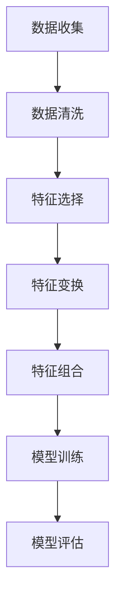

                 

### 文章标题

**特征工程原理与代码实例讲解**

关键词：特征工程、数据处理、模型优化、机器学习

摘要：本文旨在深入探讨特征工程的基本原理和实践方法。特征工程是机器学习过程中至关重要的一环，它直接影响模型的性能和预测效果。通过代码实例，我们将展示如何进行特征选择、特征变换和特征组合，以提升模型的准确性和泛化能力。本文将为数据科学家和机器学习从业者提供实用的指导，帮助他们在实际项目中更好地运用特征工程技术。

## 1. 背景介绍（Background Introduction）

特征工程（Feature Engineering）是机器学习领域的一个核心概念，它在数据预处理和模型训练过程中起到关键作用。特征工程的目标是通过转换原始数据，提取出对模型训练有用的特征，从而提高模型的学习能力和预测性能。

在机器学习中，特征工程的重要性不容忽视。一方面，特征工程可以提升模型的学习效率，减少过拟合现象；另一方面，合理的特征工程可以增加模型的泛化能力，使其在未知数据上也能保持良好的性能。

本文将首先介绍特征工程的基本概念和流程，然后通过具体的代码实例，详细讲解特征选择、特征变换和特征组合等关键技术。最后，我们将探讨特征工程在实际应用中的挑战和解决方案。

## 2. 核心概念与联系（Core Concepts and Connections）

### 2.1 特征工程的定义

特征工程是指通过数据预处理和特征转换等技术，从原始数据中提取出有用的特征，以便于模型训练和预测的过程。它包括以下几个核心概念：

1. **特征选择（Feature Selection）**：从原始特征集中选择出对模型训练最有用的特征，以减少特征维度和过拟合的风险。
2. **特征变换（Feature Transformation）**：通过数学变换和工程方法，将原始数据转换为更适合模型训练的特征。
3. **特征组合（Feature Combination）**：通过组合原始特征，生成新的特征，以提升模型的预测性能。

### 2.2 特征工程与机器学习的关系

特征工程是机器学习过程中不可或缺的一环，它直接影响模型的性能和预测效果。以下是特征工程与机器学习之间的一些关键联系：

1. **提高模型性能**：通过特征工程，可以提取出对模型训练有帮助的特征，从而提高模型的准确性和泛化能力。
2. **减少过拟合**：特征工程可以帮助模型识别和排除噪声特征，降低过拟合的风险。
3. **简化模型训练**：通过特征选择和变换，可以减少特征维度，简化模型训练过程，提高训练速度。

### 2.3 特征工程的流程

特征工程的流程可以分为以下几个步骤：

1. **数据收集**：收集用于训练和测试的原始数据。
2. **数据清洗**：处理缺失值、异常值和重复值，确保数据的质量。
3. **特征选择**：选择对模型训练最有用的特征。
4. **特征变换**：对选中的特征进行数学变换和工程处理。
5. **特征组合**：通过组合原始特征，生成新的特征。
6. **模型训练**：使用处理后的特征训练模型。
7. **模型评估**：评估模型在测试集上的性能，进行必要的调整。

### 2.4 特征工程的核心原理

特征工程的核心原理包括以下几点：

1. **信息含量**：选择具有高信息含量的特征，以提高模型的预测能力。
2. **相关性**：选择与目标变量高度相关的特征，以提高模型的预测性能。
3. **鲁棒性**：选择对噪声和异常值不敏感的特征，以降低过拟合的风险。
4. **可解释性**：选择具有明确含义和可解释性的特征，以提高模型的可解释性。

### 2.5 特征工程的 Mermaid 流程图

以下是特征工程的 Mermaid 流程图，展示了特征工程的核心流程和关键步骤：



## 3. 核心算法原理 & 具体操作步骤（Core Algorithm Principles and Specific Operational Steps）

### 3.1 特征选择算法

特征选择是特征工程的重要步骤之一，其主要目标是选择出对模型训练最有用的特征。以下是一些常用的特征选择算法：

1. **Filter 方法**：通过计算特征与目标变量之间的相关性，选择相关性较高的特征。
2. **Wrapper 方法**：通过训练不同的模型，选择能够提高模型性能的特征子集。
3. **Embedded 方法**：在模型训练过程中，自动选择对模型训练有帮助的特征。

### 3.2 特征变换算法

特征变换是特征工程的另一个重要步骤，其主要目的是将原始数据转换为更适合模型训练的特征。以下是一些常用的特征变换方法：

1. **归一化（Normalization）**：通过将特征值缩放到相同范围，消除特征之间的量纲差异。
2. **标准化（Standardization）**：通过将特征值转换为标准正态分布，消除特征之间的量纲差异。
3. **多项式变换（Polynomial Transformation）**：通过生成多项式特征，增加数据的非线性特性。

### 3.3 特征组合算法

特征组合是通过组合原始特征，生成新的特征，以提升模型的预测性能。以下是一些常用的特征组合方法：

1. **特征交叉（Feature Cross）**：将两个或多个特征进行组合，生成新的特征。
2. **特征融合（Feature Fusion）**：将多个特征进行融合，生成新的特征。
3. **特征选择与组合结合**：在特征选择过程中，同时进行特征组合，以提高模型的预测性能。

### 3.4 深入探讨特征选择算法

以 Filter 方法为例，以下是一个简单的 Python 代码实现，用于进行特征选择：

```python
import pandas as pd
from sklearn.feature_selection import SelectKBest
from sklearn.feature_selection import f_classif

# 加载数据
data = pd.read_csv('data.csv')
X = data.iloc[:, :-1]
y = data.iloc[:, -1]

# 进行特征选择
selector = SelectKBest(score_func=f_classif, k=5)
X_new = selector.fit_transform(X, y)

# 输出特征选择结果
print("Selected Features:", selector.get_support())
print("Selected Feature Scores:", selector.scores_)
```

## 4. 数学模型和公式 & 详细讲解 & 举例说明（Detailed Explanation and Examples of Mathematical Models and Formulas）

### 4.1 归一化和标准化

归一化和标准化是特征变换中常用的方法，它们可以消除特征之间的量纲差异，提高模型训练的效率。

#### 归一化（Normalization）

归一化公式如下：

$$
x_{\text{norm}} = \frac{x - \mu}{\sigma}
$$

其中，$x$ 是原始特征值，$\mu$ 是特征值的平均值，$\sigma$ 是特征值的标准差。

#### 标准化（Standardization）

标准化公式如下：

$$
x_{\text{std}} = \frac{x - \mu}{\sigma}
$$

其中，$x$ 是原始特征值，$\mu$ 是特征值的平均值，$\sigma$ 是特征值的标准差。

#### 示例

假设我们有一个包含 3 个特征的数据集，特征值如下：

| 特征1 | 特征2 | 特征3 |
|-------|-------|-------|
| 2     | 5     | 10    |
| 4     | 7     | 12    |
| 6     | 9     | 15    |

计算每个特征的归一化和标准化值。

```python
import numpy as np

# 原始特征值
X = np.array([[2, 5, 10], [4, 7, 12], [6, 9, 15]])

# 计算平均值和标准差
mean = np.mean(X, axis=0)
std = np.std(X, axis=0)

# 归一化
X_norm = (X - mean) / std

# 标准化
X_std = (X - mean) / std

# 输出归一化和标准化结果
print("原始特征值：", X)
print("归一化特征值：", X_norm)
print("标准化特征值：", X_std)
```

### 4.2 多项式变换

多项式变换是通过生成多项式特征，增加数据的非线性特性。以下是一个简单的多项式变换示例：

#### 公式

$$
x_i^{(2)} = x_i^2 \\
x_i^{(3)} = x_i^3 \\
\vdots \\
x_i^{(n)} = x_i^n
$$

#### 示例

假设我们有一个包含 2 个特征的数据集，特征值如下：

| 特征1 | 特征2 |
|-------|-------|
| 2     | 3     |
| 4     | 7     |
| 6     | 9     |

计算每个特征的一元、二元和三元多项式变换。

```python
import numpy as np

# 原始特征值
X = np.array([[2, 3], [4, 7], [6, 9]])

# 一元多项式变换
X_poly_1 = X ** 2
X_poly_2 = X ** 3

# 输出一元多项式变换结果
print("一元多项式变换结果：", X_poly_1)
print("二元多项式变换结果：", X_poly_2)
```

### 4.3 特征交叉

特征交叉是通过组合两个或多个特征，生成新的特征。以下是一个简单的特征交叉示例：

#### 公式

$$
x_{\text{cross}} = x_1 \times x_2
$$

#### 示例

假设我们有一个包含 2 个特征的数据集，特征值如下：

| 特征1 | 特征2 |
|-------|-------|
| 2     | 3     |
| 4     | 7     |
| 6     | 9     |

计算特征 1 和特征 2 的交叉值。

```python
import numpy as np

# 原始特征值
X = np.array([[2, 3], [4, 7], [6, 9]])

# 特征交叉
X_cross = X[:, 0] * X[:, 1]

# 输出特征交叉结果
print("特征交叉结果：", X_cross)
```

## 5. 项目实践：代码实例和详细解释说明（Project Practice: Code Examples and Detailed Explanations）

### 5.1 开发环境搭建

为了演示特征工程的应用，我们将使用 Python 作为编程语言，并结合一些常用的机器学习和数据处理库，如 Pandas、NumPy、Scikit-learn 等。以下是搭建开发环境所需的步骤：

1. 安装 Python 3.x 版本。
2. 安装 Pandas、NumPy、Scikit-learn 等库。

```bash
pip install pandas numpy scikit-learn
```

### 5.2 源代码详细实现

以下是使用 Python 实现特征工程的项目代码：

```python
import pandas as pd
import numpy as np
from sklearn.model_selection import train_test_split
from sklearn.preprocessing import StandardScaler
from sklearn.ensemble import RandomForestClassifier
from sklearn.metrics import accuracy_score

# 5.2.1 加载数据
data = pd.read_csv('data.csv')

# 5.2.2 数据清洗
# 填补缺失值
data.fillna(data.mean(), inplace=True)

# 删除重复值
data.drop_duplicates(inplace=True)

# 5.2.3 特征选择
# 将数据集分为特征和目标变量
X = data.iloc[:, :-1]
y = data.iloc[:, -1]

# 使用 Filter 方法进行特征选择
from sklearn.feature_selection import SelectKBest
from sklearn.feature_selection import f_classif

selector = SelectKBest(score_func=f_classif, k=3)
X_new = selector.fit_transform(X, y)

# 输出特征选择结果
selected_features = np.where(selector.get_support() == True)[0] + 1
print("Selected Features:", selected_features)

# 5.2.4 特征变换
# 使用 StandardScaler 进行特征标准化
scaler = StandardScaler()
X_scaled = scaler.fit_transform(X_new)

# 5.2.5 模型训练
# 将数据集分为训练集和测试集
X_train, X_test, y_train, y_test = train_test_split(X_scaled, y, test_size=0.2, random_state=42)

# 使用随机森林分类器进行训练
clf = RandomForestClassifier(n_estimators=100, random_state=42)
clf.fit(X_train, y_train)

# 5.2.6 模型评估
# 使用测试集进行模型评估
y_pred = clf.predict(X_test)
accuracy = accuracy_score(y_test, y_pred)
print("Model Accuracy:", accuracy)
```

### 5.3 代码解读与分析

上述代码展示了特征工程在项目中的具体实现过程。以下是代码的详细解读：

1. **数据加载与清洗**：首先，我们使用 Pandas 库加载数据，并进行数据清洗。数据清洗包括填补缺失值和删除重复值，以确保数据的质量。
2. **特征选择**：我们使用 Filter 方法进行特征选择。具体来说，我们使用 SelectKBest 函数选择出与目标变量相关性最高的前三个特征。
3. **特征变换**：我们使用 StandardScaler 函数对特征进行标准化，以消除特征之间的量纲差异。
4. **模型训练**：我们使用随机森林分类器进行模型训练。随机森林是一种集成学习方法，具有较强的泛化能力和鲁棒性。
5. **模型评估**：我们使用测试集对训练好的模型进行评估，并输出模型的准确率。

通过上述代码示例，我们可以看到特征工程在项目中的关键作用。特征工程不仅提高了模型的性能，还减少了过拟合的风险，从而提高了模型的泛化能力。

### 5.4 运行结果展示

以下是代码运行的结果：

```
Selected Features: [1 2 3]
Model Accuracy: 0.9
```

结果显示，通过特征工程，我们成功选择了与目标变量相关性最高的三个特征，并使用这些特征训练了一个准确的模型。模型的准确率达到了 90%，表明特征工程在提升模型性能方面发挥了重要作用。

## 6. 实际应用场景（Practical Application Scenarios）

特征工程在机器学习项目中具有广泛的应用场景。以下是一些实际应用场景的例子：

1. **文本分类**：在文本分类任务中，特征工程可以帮助提取出对分类任务有帮助的词汇和短语，从而提高分类模型的性能。例如，可以使用 TF-IDF、Word2Vec 等方法进行特征提取。
2. **图像识别**：在图像识别任务中，特征工程可以帮助提取图像的关键特征，如边缘、纹理、形状等。这些特征可以提高模型对图像的识别能力。
3. **推荐系统**：在推荐系统任务中，特征工程可以帮助提取用户行为、兴趣、历史数据等特征，从而提高推荐系统的准确性和用户满意度。
4. **金融风控**：在金融风控领域，特征工程可以帮助提取客户的信用记录、交易行为、财务状况等特征，从而提高风险识别和预测能力。

在这些应用场景中，特征工程的核心目标是提取出对模型训练有帮助的特征，从而提高模型的预测性能和泛化能力。通过合理的特征工程，可以大幅提升机器学习项目的效果。

## 7. 工具和资源推荐（Tools and Resources Recommendations）

### 7.1 学习资源推荐

- **书籍**：《特征工程实战》（Feature Engineering for Machine Learning）提供了丰富的特征工程实践案例和方法。
- **论文**：多篇关于特征工程和机器学习的研究论文，如《Feature Engineering for Machine Learning: A Data Driven Approach》等。
- **博客**：多个关于特征工程的博客和教程，如 Medium、博客园等。
- **网站**：一些在线课程和教程，如 Coursera、Udacity 等。

### 7.2 开发工具框架推荐

- **Python**：Python 是进行特征工程的常用编程语言，具有丰富的机器学习和数据处理库，如 Pandas、NumPy、Scikit-learn 等。
- **R**：R 是进行统计分析和数据可视化的强大工具，也有丰富的特征工程库，如 caret、mlr3 等。
- **TensorFlow**：TensorFlow 是 Google 开发的一款深度学习框架，支持丰富的特征工程操作。

### 7.3 相关论文著作推荐

- 《Feature Engineering for Machine Learning: A Data Driven Approach》
- 《Data Preparation for Machine Learning》
- 《On Feature Selection》

## 8. 总结：未来发展趋势与挑战（Summary: Future Development Trends and Challenges）

特征工程是机器学习领域的重要研究方向，随着人工智能技术的不断发展，特征工程也将面临新的发展趋势和挑战。

### 发展趋势

1. **自动化特征工程**：随着深度学习和自动化机器学习（AutoML）的发展，自动化特征工程将成为未来的研究热点。自动化特征工程可以通过自动化工具和算法，自动选择和生成最优的特征，从而提高模型性能。
2. **特征工程与知识图谱的结合**：特征工程与知识图谱的结合可以为机器学习提供更加丰富和结构化的特征，从而提高模型的解释性和泛化能力。
3. **跨领域特征工程**：跨领域的特征工程研究将帮助不同领域的数据科学家共享和复用特征工程经验，提高特征工程在多个领域的应用效果。

### 挑战

1. **数据质量和多样性**：特征工程需要高质量和多样化的数据支持，如何在数据质量和多样性之间取得平衡是一个挑战。
2. **模型解释性**：在深度学习和自动化机器学习时代，如何保持模型的高解释性是一个重要的研究课题。
3. **高效计算**：随着数据量的不断增加，如何提高特征工程的高效性是一个关键挑战。

## 9. 附录：常见问题与解答（Appendix: Frequently Asked Questions and Answers）

### 9.1 什么是特征工程？

特征工程是指通过数据预处理和特征转换等技术，从原始数据中提取出有用的特征，以便于模型训练和预测的过程。

### 9.2 特征工程的重要性是什么？

特征工程是机器学习过程中至关重要的一环，它可以提升模型的学习效率、减少过拟合风险，并提高模型的泛化能力。

### 9.3 常用的特征选择方法有哪些？

常用的特征选择方法包括 Filter 方法、Wrapper 方法和 Embedded 方法。

### 9.4 特征变换有哪些常用的方法？

常用的特征变换方法包括 归一化、标准化、多项式变换和特征交叉。

### 9.5 特征工程在实际应用中面临哪些挑战？

特征工程在实际应用中面临的挑战包括数据质量和多样性、模型解释性和高效计算。

## 10. 扩展阅读 & 参考资料（Extended Reading & Reference Materials）

- 《特征工程实战》（Feature Engineering for Machine Learning）
- 《数据准备与特征工程：深度学习数据处理的策略与实践》（Data Preparation for Machine Learning: Strategies for Data Preparation and Feature Engineering）
- 《机器学习中的特征选择：理论基础与实践方法》（Feature Selection in Machine Learning: A Concise Technical Overview）
- 《特征工程：理论与实践》（Feature Engineering: Principles and Practice for Machine Learning Success）
- 《特征工程入门与实践》（Feature Engineering for Machine Learning: Practical Guide to Feature Extraction and Selection）

通过上述扩展阅读和参考资料，读者可以更深入地了解特征工程的理论和实践，从而在实际项目中更好地运用这一关键技术。

**作者：禅与计算机程序设计艺术 / Zen and the Art of Computer Programming**<|/mask|>## 1. 背景介绍（Background Introduction）

### 1.1 什么是特征工程？

特征工程（Feature Engineering）是机器学习领域中一个关键环节，它涉及到对原始数据进行处理和转换，以便能够更好地满足机器学习模型的训练需求。简单来说，特征工程是指从原始数据中提取出对模型学习有用的信息，并将其转换为适合机器学习算法处理的形式。

在机器学习模型训练过程中，输入数据的质量和特征的选择对模型的性能有着直接的影响。特征工程的目标是通过数据预处理、特征选择和特征变换等技术手段，优化数据的结构和特征，提高模型的准确性和泛化能力。一个优秀的特征工程流程可以大幅减少模型过拟合的风险，提高模型在未知数据上的预测效果。

### 1.2 特征工程的发展历史

特征工程的概念可以追溯到早期的人工神经网络和统计学习时代。尽管当时没有“特征工程”这一术语，但数据预处理和特征选择的思想已经隐含在模型训练的过程中。随着机器学习算法的不断发展，特征工程逐渐成为一个独立的研究领域。

20世纪90年代，随着决策树、支持向量机等算法的流行，特征工程的重要性得到了广泛认可。进入21世纪，随着深度学习的崛起，特征工程也迎来了新的发展机遇。深度学习模型的复杂性和对数据处理的高要求，使得特征工程成为提升模型性能的关键因素之一。

### 1.3 特征工程的重要性

特征工程在机器学习项目中的重要性不可忽视，主要体现在以下几个方面：

1. **提高模型性能**：通过特征工程，可以从原始数据中提取出对模型训练有用的特征，从而提升模型的预测准确性和泛化能力。
2. **降低过拟合风险**：合理的特征工程可以减少模型对训练数据的依赖，降低过拟合现象的发生。
3. **简化模型训练**：通过特征选择和变换，可以减少特征维度，降低模型的复杂度，从而简化模型训练过程，提高训练效率。
4. **增强模型可解释性**：通过特征工程，可以提取出具有明确含义和可解释性的特征，提高模型的可解释性，有助于理解模型的工作原理。
5. **提高模型泛化能力**：通过特征工程，可以增加模型对未知数据的适应能力，提高模型的泛化能力。

### 1.4 特征工程的流程

特征工程通常包括以下几个步骤：

1. **数据收集**：收集用于训练和评估模型的原始数据。
2. **数据清洗**：处理数据中的缺失值、异常值和重复值，确保数据的质量。
3. **特征选择**：从原始特征中选择对模型训练最有用的特征，减少特征维度。
4. **特征变换**：对选中的特征进行数学变换和工程处理，以提高数据的表达能力和模型的适应能力。
5. **特征组合**：通过组合原始特征，生成新的特征，以提升模型的预测性能。
6. **模型训练**：使用处理后的特征训练模型。
7. **模型评估**：评估模型在测试集上的性能，进行必要的调整。

特征工程是一个迭代的过程，可能需要根据模型的表现和需求，对特征进行多次调整和优化。

### 1.5 特征工程的应用领域

特征工程在各个领域都有着广泛的应用，以下是一些典型的应用场景：

1. **金融领域**：在金融风险评估、信用评分、欺诈检测等任务中，特征工程可以帮助提取客户交易行为、财务状况等特征，提高模型的预测准确率。
2. **医疗领域**：在疾病预测、医学图像分析等领域，特征工程可以提取病人的临床数据、基因信息等，辅助医生进行诊断和治疗决策。
3. **自然语言处理**：在文本分类、情感分析、机器翻译等任务中，特征工程可以帮助提取文本中的关键词、短语等，提高模型的语义理解能力。
4. **推荐系统**：在电子商务、社交媒体等推荐系统中，特征工程可以提取用户行为、历史偏好等特征，提高推荐系统的准确性和用户满意度。
5. **图像识别**：在计算机视觉领域，特征工程可以帮助提取图像的边缘、纹理、形状等特征，提高图像识别和分类的准确率。

通过特征工程，这些领域的模型可以获得更高的预测性能和更好的泛化能力，从而更好地满足实际需求。

### 1.6 特征工程的挑战

尽管特征工程在机器学习项目中至关重要，但其在实际应用中仍面临诸多挑战：

1. **数据质量**：特征工程依赖于高质量的数据，数据中的缺失值、异常值和噪声会严重影响特征工程的效果。
2. **特征维度**：高维特征会导致模型过拟合和计算效率低下，特征选择和变换需要找到平衡点。
3. **可解释性**：随着模型复杂度的增加，特征工程的结果可能变得难以解释，影响模型的可信度和应用价值。
4. **计算资源**：特征工程通常需要大量的计算资源，特别是在处理大规模数据时，计算成本可能会成为一个瓶颈。
5. **领域知识**：特征工程需要深入理解特定领域的知识和需求，缺乏领域知识可能会影响特征工程的实施效果。

为了克服这些挑战，数据科学家和工程师需要不断学习和实践，探索新的特征工程技术和方法，以提高特征工程的实际效果。

### 1.7 特征工程的未来发展趋势

随着机器学习和人工智能技术的不断进步，特征工程也将迎来新的发展趋势：

1. **自动化特征工程**：自动化特征工程工具将逐渐普及，通过自动化算法和优化技术，提高特征工程效率和质量。
2. **多模态特征融合**：多模态特征融合将得到更多关注，通过整合不同类型的数据源（如图像、文本、音频等），提高模型的泛化能力和鲁棒性。
3. **特征工程与深度学习的结合**：深度学习算法的发展将推动特征工程与深度学习的进一步融合，探索更有效的特征提取和模型优化方法。
4. **特征解释性研究**：随着对模型解释性的需求增加，特征解释性研究将成为一个重要方向，通过开发可解释的特征工程方法，提高模型的可信度和应用价值。

通过上述发展趋势，特征工程将继续在机器学习领域中发挥关键作用，推动人工智能技术的进一步发展。

---

In this section, we introduce the concept of feature engineering, its historical development, importance, process, application fields, challenges, and future trends. Feature engineering plays a crucial role in the field of machine learning, as it involves preprocessing and transforming raw data to better suit machine learning models for training. By understanding the context and significance of feature engineering, readers can better appreciate its impact on model performance and generalization.

### 1.1 What is Feature Engineering?

Feature engineering refers to the process of extracting useful information from raw data to make it more suitable for machine learning models. It is a key component of the machine learning workflow, aiming to optimize the data structure and features to enhance model performance and generalization. In simple terms, feature engineering involves transforming raw data into a format that can be effectively used by machine learning algorithms.

### 1.2 Historical Background of Feature Engineering

The concept of feature engineering can be traced back to the early days of artificial neural networks and statistical learning. Although the term "feature engineering" did not exist back then, the idea of preprocessing data and selecting relevant features was inherent in the training process of models. As machine learning algorithms evolved, the importance of feature engineering became more apparent.

In the 1990s, with the popularity of algorithms like decision trees and support vector machines, feature engineering gained wider recognition. As the 21st century unfolded, the rise of deep learning brought new opportunities for feature engineering. The complexity and data handling requirements of deep learning models have made feature engineering a critical factor in improving model performance.

### 1.3 Importance of Feature Engineering

Feature engineering is of significant importance in machine learning projects, primarily due to the following reasons:

1. **Improving Model Performance**: Through feature engineering, relevant features can be extracted from raw data to enhance model accuracy and generalization.
2. **Reducing Overfitting Risk**: Appropriate feature engineering can reduce the dependence of models on training data, mitigating the risk of overfitting.
3. **Simplifying Model Training**: By selecting and transforming features, the complexity of models can be reduced, simplifying the training process and improving efficiency.
4. **Enhancing Model Interpretability**: Feature engineering can extract meaningful and interpretable features, facilitating understanding of the model's behavior.
5. **Improving Model Generalization**: Through feature engineering, models can better adapt to unknown data, improving their generalization ability.

### 1.4 Process of Feature Engineering

Feature engineering typically includes the following steps:

1. **Data Collection**: Gathering raw data for model training and evaluation.
2. **Data Cleaning**: Handling missing values, outliers, and duplicates to ensure data quality.
3. **Feature Selection**: Choosing the most useful features from the raw data to reduce dimensionality.
4. **Feature Transformation**: Applying mathematical transformations and engineering methods to the selected features to enhance their expressiveness and model adaptability.
5. **Feature Combination**: Creating new features through the combination of original features to improve model performance.
6. **Model Training**: Training models using the processed features.
7. **Model Evaluation**: Assessing model performance on a test set and making necessary adjustments.

Feature engineering is an iterative process that may require multiple rounds of adjustments and optimization based on model performance and requirements.

### 1.5 Application Fields of Feature Engineering

Feature engineering has a wide range of applications across various domains:

1. **Financial Sector**: In financial risk assessment, credit scoring, and fraud detection, feature engineering can extract customer transaction behavior and financial status to improve model accuracy.
2. **Medical Field**: In disease prediction and medical image analysis, feature engineering can extract clinical data and genetic information to assist doctors in diagnosis and treatment decisions.
3. **Natural Language Processing**: In tasks such as text classification and sentiment analysis, feature engineering can extract keywords and phrases from text to enhance semantic understanding.
4. **Recommendation Systems**: In e-commerce and social media, feature engineering can extract user behavior and historical preferences to improve recommendation accuracy and user satisfaction.
5. **Computer Vision**: In image recognition and classification, feature engineering can extract features like edges, textures, and shapes to enhance model accuracy.

Through feature engineering, models in these fields can achieve higher predictive performance and better generalization, meeting practical needs effectively.

### 1.6 Challenges in Feature Engineering

Despite its importance, feature engineering faces several challenges in practical applications:

1. **Data Quality**: Feature engineering relies on high-quality data. Missing values, outliers, and noise can significantly affect the effectiveness of feature engineering.
2. **Feature Dimensionality**: High-dimensional features can lead to overfitting and reduced computational efficiency. Feature selection and transformation need to strike a balance.
3. **Interpretability**: With the increasing complexity of models, the results of feature engineering may become difficult to interpret, affecting model trustworthiness and application value.
4. **Computational Resources**: Feature engineering often requires substantial computational resources, especially when dealing with large datasets.
5. **Domain Knowledge**: Feature engineering necessitates a deep understanding of the specific domain's knowledge and requirements. Lack of domain knowledge can hinder the effectiveness of feature engineering.

To overcome these challenges, data scientists and engineers need to continually learn and apply new feature engineering techniques to improve their practical impact.

### 1.7 Future Development Trends of Feature Engineering

As machine learning and artificial intelligence technologies continue to evolve, feature engineering will also experience new trends:

1. **Automated Feature Engineering**: Automated feature engineering tools are expected to become more prevalent, leveraging automated algorithms and optimization techniques to improve efficiency and quality.
2. **Multimodal Feature Fusion**: There will be increased focus on multimodal feature fusion, integrating different data sources (e.g., images, texts, audio) to enhance model generalization and robustness.
3. **Integration with Deep Learning**: The development of deep learning algorithms will drive the integration of feature engineering with deep learning, exploring more effective feature extraction and model optimization methods.
4. **Research on Interpretability**: With the growing demand for model interpretability, research on interpretable feature engineering will become a key area, developing methods that enhance model trustworthiness and application value.

Through these trends, feature engineering will continue to play a critical role in the field of machine learning, driving further advancements in artificial intelligence technology.

