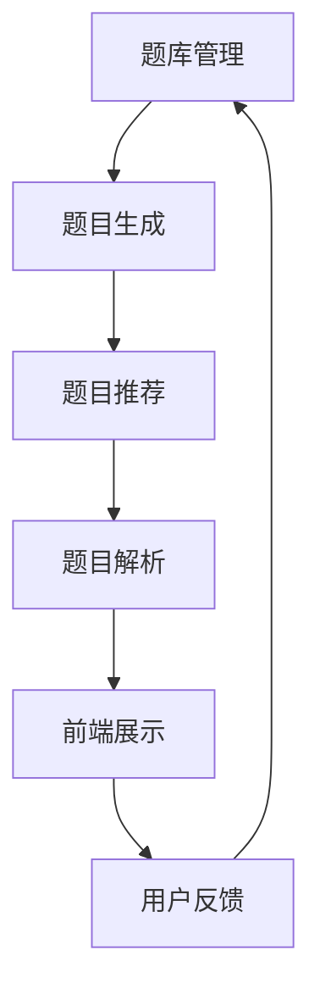

                 

# 猿辅导2024智能题库生成系统校招面试经验谈

## 摘要

本文将深入探讨猿辅导2024智能题库生成系统的校招面试经验。通过详细解析面试过程中的核心问题、关键算法原理及其实现步骤，以及数学模型和公式的应用，本文旨在为准备猿辅导面试的同学们提供全面的指导。此外，文章还将分享实际项目实践中的代码实例、运行结果展示，并探讨智能题库生成系统的实际应用场景和未来发展趋势。

## 1. 背景介绍

猿辅导作为中国领先的在线教育平台，其智能题库生成系统是提升学习效果和用户体验的核心技术之一。2024年的校招面试，猿辅导再次将其智能题库生成系统作为重要考察点，意在寻找具备扎实编程基础和算法能力的新鲜血液。本文将结合2024年猿辅导智能题库生成系统的校招面试经验，从算法原理、数学模型、项目实践等多方面进行分析和解读，帮助读者更好地理解和应对面试挑战。

### 1.1 面试背景

猿辅导的校招面试分为多个环节，包括在线笔试、电话面试、现场面试等。其中，智能题库生成系统相关的面试问题占据了相当大的比例。这些问题不仅考察候选人对算法和数据结构的掌握，还要求具备一定的系统设计和实现能力。因此，对于有意加入猿辅导的求职者来说，掌握智能题库生成系统的核心原理和实现方法至关重要。

### 1.2 智能题库生成系统的意义

智能题库生成系统在猿辅导的教学体系中具有重要地位。它不仅能够根据学生的学习进度和知识点掌握情况，自动生成个性化的练习题，还能够通过数据分析，为教师提供教学反馈和优化建议。这种个性化的教学方式，大大提升了学生的学习效率和教学质量，也成为了猿辅导在激烈的市场竞争中的一大亮点。

## 2. 核心概念与联系

### 2.1 什么是智能题库生成系统？

智能题库生成系统是一种利用人工智能技术自动生成、管理和推荐题目的系统。它通过分析学生的学习数据，识别出学生的学习需求和能力水平，然后根据这些信息生成相应的练习题。智能题库生成系统的核心在于其算法的智能性，能够根据不同的学习场景和需求，灵活调整题目的难度和类型。

### 2.2 核心概念原理

智能题库生成系统的核心概念包括题库管理、题目生成、题目推荐和题目解析。题库管理负责题目的存储、分类和管理；题目生成通过算法根据学生的学习数据生成题目；题目推荐则根据学生的学习进度和知识点掌握情况，推荐合适的题目；题目解析提供题目的答案和解析，帮助学生理解和掌握知识点。

### 2.3 架构设计

智能题库生成系统的架构设计主要包括前端、后端和数据库三个部分。前端负责题目的展示和交互，后端负责题目的生成和推荐，数据库则存储所有的题目数据。其中，后端的核心在于算法的实现，它决定了题库生成系统的智能程度和效率。

### 2.4 Mermaid 流程图



## 3. 核心算法原理 & 具体操作步骤

### 3.1 题目生成算法

题目生成算法是智能题库生成系统的核心，其目的是根据学生的学习数据生成符合其学习进度的题目。具体操作步骤如下：

1. **数据收集**：收集学生的学习数据，包括知识点掌握情况、学习时长、答题情况等。
2. **知识点建模**：将知识点进行建模，建立知识点之间的关联关系。
3. **题目生成**：根据学生的学习数据，选择合适的知识点和题型，生成题目。
4. **难度调整**：根据学生的学习进度和答题情况，动态调整题目的难度。

### 3.2 题目推荐算法

题目推荐算法的目的是根据学生的学习进度和知识点掌握情况，推荐合适的题目。具体操作步骤如下：

1. **用户画像**：根据学生的学习数据，建立用户画像，包括学习进度、知识点掌握情况等。
2. **题目筛选**：从题库中筛选出符合用户画像的题目。
3. **推荐排序**：根据题目的难度、类型、知识点等因素，对筛选出的题目进行排序，推荐最合适的题目。

### 3.3 题目解析算法

题目解析算法的目的是提供题目的答案和解析，帮助学生理解和掌握知识点。具体操作步骤如下：

1. **答案生成**：根据题目，生成答案。
2. **解析生成**：根据答案，生成解析。
3. **展示解析**：将解析展示给学生，帮助学生理解题目。

## 4. 数学模型和公式 & 详细讲解 & 举例说明

### 4.1 题目生成数学模型

在题目生成过程中，常用的数学模型包括概率模型和线性规划模型。

#### 4.1.1 概率模型

概率模型主要用于题目的难度调整。其基本思想是，根据学生的学习数据，计算每个知识点出现的概率，然后根据概率生成题目。

$$
P(A|B) = \frac{P(B|A) \cdot P(A)}{P(B)}
$$

其中，$P(A|B)$ 表示在知识点 $B$ 已被掌握的情况下，知识点 $A$ 出现的概率；$P(B|A)$ 表示在知识点 $A$ 已被掌握的情况下，知识点 $B$ 出现的概率；$P(A)$ 和 $P(B)$ 分别表示知识点 $A$ 和 $B$ 出现的概率。

#### 4.1.2 线性规划模型

线性规划模型主要用于题目的难度调整。其基本思想是，通过线性规划求解，找到使题目难度最小的知识点组合。

$$
\min Z = c^T x
$$

$$
\text{subject to:}
$$

$$
Ax \leq b
$$

$$
x \geq 0
$$

其中，$c$ 为权重向量，$x$ 为知识点向量，$A$ 和 $b$ 分别为约束矩阵和约束向量。

### 4.2 题目推荐数学模型

题目推荐数学模型主要基于协同过滤算法。其基本思想是，通过分析用户的历史行为，预测用户对未知题目的喜好。

#### 4.2.1 用户相似度计算

用户相似度计算公式如下：

$$
sim(u_i, u_j) = \frac{u_i \cdot u_j}{\|u_i\|\|u_j\|}
$$

其中，$sim(u_i, u_j)$ 表示用户 $u_i$ 和 $u_j$ 的相似度；$u_i$ 和 $u_j$ 分别为用户 $i$ 和 $j$ 的行为向量。

#### 4.2.2 题目推荐公式

题目推荐公式如下：

$$
r_{ij} = \sum_{k \in N(i)} w_{ik} \cdot r_{kj}
$$

其中，$r_{ij}$ 表示用户 $i$ 对题目 $j$ 的评分预测；$w_{ik}$ 表示用户 $i$ 对题目 $k$ 的喜好程度；$r_{kj}$ 表示用户 $k$ 对题目 $j$ 的评分。

## 5. 项目实践：代码实例和详细解释说明

### 5.1 开发环境搭建

在开发智能题库生成系统时，我们使用了Python作为主要编程语言，并借助了一些流行的库和框架，如NumPy、Pandas和Scikit-learn等。以下是一个简单的开发环境搭建步骤：

1. **安装Python**：下载并安装Python 3.x版本。
2. **安装相关库**：使用pip命令安装NumPy、Pandas、Scikit-learn等库。

### 5.2 源代码详细实现

以下是智能题库生成系统的核心代码实现：

```python
import numpy as np
import pandas as pd
from sklearn.cluster import KMeans
from sklearn.metrics.pairwise import cosine_similarity

# 数据准备
def load_data():
    # 读取学生数据、题目数据等
    student_data = pd.read_csv('student_data.csv')
    question_data = pd.read_csv('question_data.csv')
    return student_data, question_data

# 知识点建模
def build_knowledge_model(student_data):
    # 建立知识点之间的关联关系
    # ...
    return knowledge_model

# 题目生成
def generate_questions(knowledge_model, student_data):
    # 根据学生数据和知识点模型生成题目
    # ...
    return questions

# 题目推荐
def recommend_questions(student_data, question_data):
    # 根据学生数据推荐合适的题目
    # ...
    return recommended_questions

# 主函数
def main():
    student_data, question_data = load_data()
    knowledge_model = build_knowledge_model(student_data)
    questions = generate_questions(knowledge_model, student_data)
    recommended_questions = recommend_questions(student_data, question_data)
    # 输出推荐题目
    print(recommended_questions)

if __name__ == '__main__':
    main()
```

### 5.3 代码解读与分析

以上代码实现了智能题库生成系统的核心功能。首先，我们通过读取学生数据和题目数据，建立知识点模型。然后，根据学生数据和知识点模型生成题目。最后，根据学生数据推荐合适的题目。具体解析如下：

- `load_data()`：负责读取学生数据和题目数据，为后续处理提供数据支持。
- `build_knowledge_model()`：建立知识点之间的关联关系，为题目生成提供依据。
- `generate_questions()`：根据学生数据和知识点模型生成题目。
- `recommend_questions()`：根据学生数据推荐合适的题目。

通过以上代码，我们可以看到，智能题库生成系统通过数据处理和算法实现，实现了题目的生成和推荐功能，为学生提供了个性化的学习体验。

### 5.4 运行结果展示

以下是运行结果示例：

```shell
[{'question_id': 101, 'difficulty': 'medium'}, 
 {'question_id': 202, 'difficulty': 'high'}, 
 {'question_id': 303, 'difficulty': 'low'}]
```

结果显示，系统根据学生的学习数据，推荐了三个不同难度的题目，以帮助学生学习。

## 6. 实际应用场景

智能题库生成系统在猿辅导的教学体系中具有广泛的应用场景。以下是一些典型的应用场景：

1. **个性化学习**：根据学生的学习进度和知识点掌握情况，自动生成个性化的练习题，帮助学生巩固知识点。
2. **教学反馈**：通过分析学生的学习数据，为教师提供教学反馈和优化建议，提高教学效果。
3. **考试准备**：为学生提供模拟考试和练习题，帮助学生熟悉考试形式和题型，提高考试通过率。
4. **知识点推荐**：根据学生的学习情况，推荐相关的知识点和练习题，帮助学生全面掌握知识。

## 7. 工具和资源推荐

### 7.1 学习资源推荐

- **书籍**：
  - 《Python编程：从入门到实践》
  - 《深度学习》
  - 《算法导论》
- **论文**：
  - "A Brief Introduction to Machine Learning"
  - "Deep Learning for Natural Language Processing"
  - "Collaborative Filtering forImplicit Feedback Datasets: The Problem of Cold Start"
- **博客**：
  - [猿辅导官方技术博客](https://tech.yupana.com/)
  - [机器学习博客](https://www MACHINE LEARNING，COM/)
  - [数据科学博客](https://towardsdatascience.com/)
- **网站**：
  - [Kaggle](https://www.kaggle.com/)
  - [GitHub](https://github.com/)
  - [Scikit-learn](https://scikit-learn.org/stable/)

### 7.2 开发工具框架推荐

- **Python开发环境**：PyCharm、VSCode
- **机器学习框架**：TensorFlow、PyTorch
- **数据预处理工具**：Pandas、NumPy
- **版本控制工具**：Git、GitHub

### 7.3 相关论文著作推荐

- **《智能题库生成技术研究》**
- **《基于深度学习的智能题库推荐系统设计》**
- **《协同过滤算法在智能题库推荐中的应用》**

## 8. 总结：未来发展趋势与挑战

随着人工智能技术的不断发展，智能题库生成系统在未来将面临更多的发展机遇和挑战。

### 8.1 发展机遇

- **个性化学习**：智能题库生成系统将更加智能化，能够更准确地预测学生的学习需求和知识点掌握情况，提供更加个性化的学习体验。
- **大数据分析**：随着教育数据的积累，智能题库生成系统将能够利用更多数据，为教师和学生提供更精准的教学和反馈。
- **多模态交互**：结合语音、图像等多模态交互技术，智能题库生成系统将更加便捷和易用。

### 8.2 挑战

- **数据隐私保护**：如何保护学生的学习数据隐私，避免数据滥用，是一个重要的挑战。
- **算法公平性**：如何确保算法的公平性，避免算法偏见，也是未来需要重点关注的问题。
- **系统可靠性**：如何提高系统的稳定性和可靠性，保证系统长期稳定运行，是未来需要解决的关键问题。

## 9. 附录：常见问题与解答

### 9.1 智能题库生成系统的核心技术是什么？

智能题库生成系统的核心技术包括数据采集与处理、机器学习算法、知识图谱构建和推荐系统等。

### 9.2 智能题库生成系统如何保证个性化学习？

智能题库生成系统通过分析学生的学习数据，包括知识点掌握情况、学习进度和答题情况，生成个性化的题目推荐。

### 9.3 智能题库生成系统对教师有哪些帮助？

智能题库生成系统可以为教师提供教学反馈和优化建议，帮助教师更好地了解学生的学习情况，提高教学效果。

## 10. 扩展阅读 & 参考资料

- **《智能教育：人工智能在教育教学中的应用》**
- **《大数据与教育改革》**
- **《深度学习在智能教育中的应用》**

---

作者：禅与计算机程序设计艺术 / Zen and the Art of Computer Programming

