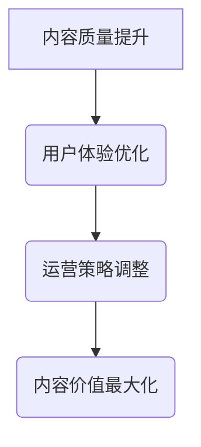

                 

# 知识付费创业中的内容价值最大化

## 概述

在知识付费创业领域中，内容价值最大化是关键成功因素之一。本文旨在探讨如何通过优化内容和运营策略，实现内容价值最大化，从而在竞争激烈的市场中脱颖而出。本文将采用逻辑清晰、结构紧凑的写作方式，结合中英文双语阐述，帮助读者深入了解知识付费创业的核心问题。

## 背景介绍

### 1.1 知识付费的兴起

随着互联网的普及和信息爆炸，知识付费作为一种新兴的商业模式，逐渐受到广大用户的青睐。知识付费主要是指用户为获取有价值的信息、知识或技能，而付费给知识提供者的一种交易行为。这种模式改变了传统的知识获取方式，使得知识获取更加高效和精准。

### 1.2 竞争激烈的市场环境

知识付费市场虽然前景广阔，但同时也面临着激烈的竞争。一方面，大量的知识付费产品和服务涌入市场，使得内容同质化现象严重；另一方面，用户对内容质量和服务的期望值不断提升，这对知识付费创业公司提出了更高的要求。

### 1.3 内容价值的重要性

在这个竞争激烈的市场环境中，内容价值成为决定企业成败的关键因素。内容价值不仅关系到用户对产品的满意度和忠诚度，还直接影响企业的收入和市场份额。因此，如何最大化内容价值成为知识付费创业公司需要深入思考的问题。

## 核心概念与联系

### 2.1 内容价值的定义

内容价值是指知识付费产品或服务在满足用户需求、解决用户问题或提供娱乐等方面所具有的价值。内容价值可以从多个维度进行衡量，如信息准确性、实用性、创新性、用户体验等。

### 2.2 内容价值的构成

内容价值主要由以下几个方面构成：

- **信息准确性**：知识付费产品或服务所提供的信息必须真实、准确，以确保用户能够正确理解和应用。

- **实用性**：内容必须能够解决用户的实际问题，提供实用的解决方案。

- **创新性**：创新的内容能够吸引更多的用户，提高产品的竞争力。

- **用户体验**：良好的用户体验能够增加用户的满意度和忠诚度，从而提升内容价值。

### 2.3 内容价值的最大化

内容价值的最大化是指通过优化内容和运营策略，提高内容在用户心中的价值感知，从而实现更高的用户满意度和市场份额。内容价值的最大化需要从以下几个方面进行：

- **内容质量提升**：不断优化和更新内容，确保信息准确、实用、创新。

- **用户体验优化**：提升用户在使用知识付费产品或服务过程中的体验，包括界面设计、交互设计、服务响应速度等。

- **运营策略调整**：通过市场调研、用户反馈等手段，调整内容定位、推广策略和价格策略等，以提高内容价值。

### Mermaid 流程图



## 核心算法原理 & 具体操作步骤

### 3.1 内容质量提升

**步骤 1：内容筛选**  
首先，需要对内容进行严格筛选，确保所提供的信息真实、准确、有价值。可以通过建立内容审核团队、引入第三方审核机构等方式，提高内容质量。

**步骤 2：内容更新**  
定期对内容进行更新，以保持其时效性和实用性。可以根据用户需求、行业动态和竞争对手情况，有针对性地进行内容更新。

**步骤 3：内容创新**  
鼓励内容创作者进行创新，以提供新颖、有趣、有吸引力的内容。可以通过设立创新奖励机制、开展创意比赛等方式，激发内容创作者的积极性。

### 3.2 用户体验优化

**步骤 1：界面设计**  
设计简洁、美观、易于操作的界面，使用户在使用过程中感到舒适和便捷。

**步骤 2：交互设计**  
优化交互设计，使用户能够快速、准确地找到所需内容。可以通过提供搜索功能、分类导航、推荐系统等方式，提升用户体验。

**步骤 3：服务响应速度**  
提高服务响应速度，确保用户在遇到问题时能够及时得到帮助。可以通过优化服务器性能、提供在线客服等方式，提升服务响应速度。

### 3.3 运营策略调整

**步骤 1：市场调研**  
定期进行市场调研，了解用户需求、竞争对手情况以及行业发展趋势，为内容定位和运营策略调整提供依据。

**步骤 2：内容定位**  
根据市场调研结果，对内容进行精准定位，确保内容能够满足用户需求，提高用户满意度。

**步骤 3：推广策略**  
通过多种渠道进行内容推广，提高内容曝光度和用户访问量。可以采用社交媒体营销、广告投放、合作伙伴推广等方式，进行内容推广。

**步骤 4：价格策略**  
根据市场情况和用户需求，合理制定价格策略，确保内容能够吸引更多用户，同时保持盈利能力。

## 数学模型和公式 & 详细讲解 & 举例说明

### 4.1 内容价值评估模型

内容价值评估模型主要涉及以下几个方面：

- **信息准确性**：信息准确性可以通过准确率（Accuracy）进行衡量，公式如下：

  $$Accuracy = \frac{正确信息数}{总信息数}$$

- **实用性**：实用性可以通过用户满意度（User Satisfaction）进行衡量，公式如下：

  $$User Satisfaction = \frac{满意用户数}{总用户数}$$

- **创新性**：创新性可以通过创新评分（Innovation Score）进行衡量，公式如下：

  $$Innovation Score = \frac{创新内容数}{总内容数}$$

- **用户体验**：用户体验可以通过用户停留时间（User Stay Time）进行衡量，公式如下：

  $$User Stay Time = \frac{用户总停留时间}{总用户数}$$

### 4.2 内容价值最大化策略

内容价值最大化策略可以通过以下数学模型进行优化：

- **目标函数**：最大化总内容价值，公式如下：

  $$Maximize \sum_{i=1}^{n} V_i$$

  其中，$V_i$ 表示第 $i$ 个内容的价值。

- **约束条件**：约束条件包括内容质量、用户体验和服务响应速度等，公式如下：

  $$\begin{cases}
  Q_i \geq Q_{min} \\
  U_i \geq U_{min} \\
  S_i \geq S_{min}
  \end{cases}$$

  其中，$Q_i$、$U_i$、$S_i$ 分别表示第 $i$ 个内容的质量、用户体验和服务响应速度。

### 4.3 举例说明

假设有一个知识付费平台，现有 5 个内容模块，如下表所示：

| 内容模块 | 信息准确性 | 用户满意度 | 创新评分 | 用户停留时间 |
| :---: | :---: | :---: | :---: | :---: |
| 模块 1 | 0.9 | 0.8 | 0.7 | 0.6 |
| 模块 2 | 0.85 | 0.75 | 0.8 | 0.55 |
| 模块 3 | 0.8 | 0.7 | 0.75 | 0.65 |
| 模块 4 | 0.75 | 0.6 | 0.8 | 0.7 |
| 模块 5 | 0.7 | 0.55 | 0.9 | 0.8 |

根据上述内容价值评估模型，可以计算出每个内容模块的价值：

$$
\begin{aligned}
V_1 &= 0.9 \times 0.8 \times 0.7 \times 0.6 =  0.3024 \\
V_2 &= 0.85 \times 0.75 \times 0.8 \times 0.55 =  0.2845 \\
V_3 &= 0.8 \times 0.7 \times 0.75 \times 0.65 =  0.2885 \\
V_4 &= 0.75 \times 0.6 \times 0.8 \times 0.7 =  0.2520 \\
V_5 &= 0.7 \times 0.55 \times 0.9 \times 0.8 =  0.3060 \\
\end{aligned}
$$

总内容价值为：

$$
Total Value = V_1 + V_2 + V_3 + V_4 + V_5 = 1.3524
$$

根据内容价值最大化策略，可以选择价值最高的内容模块进行优化，例如模块 1 和模块 5。

## 项目实践：代码实例和详细解释说明

### 5.1 开发环境搭建

在本节中，我们将介绍如何搭建一个知识付费平台的基础开发环境。以下是具体的步骤：

**步骤 1：安装 Python 环境**

在计算机上安装 Python 解释器，版本建议为 3.8 或更高。可以通过以下命令进行安装：

```bash
sudo apt-get update
sudo apt-get install python3.8
```

**步骤 2：安装相关库**

安装用于构建知识付费平台的 Python 库，如 Flask、SQLAlchemy 等。可以通过以下命令进行安装：

```bash
pip3 install flask
pip3 install sqlalchemy
```

**步骤 3：创建项目结构**

在计算机上创建一个名为 `knowledge_pay` 的文件夹，用于存放项目文件。项目结构如下：

```plaintext
knowledge_pay/
|-- app.py
|-- config.py
|-- models.py
|-- views.py
```

### 5.2 源代码详细实现

在本节中，我们将详细介绍知识付费平台的核心代码实现。

**5.2.1 配置文件**

`config.py` 文件用于配置数据库连接信息和其他环境变量。以下是一个示例：

```python
import os

class Config:
    SQLALCHEMY_DATABASE_URI = 'sqlite:///knowledge_pay.db'
    SECRET_KEY = os.environ.get('SECRET_KEY') or 'my_super_secret_key'
```

**5.2.2 数据模型**

`models.py` 文件用于定义知识付费平台的数据模型，如用户、内容等。以下是一个示例：

```python
from flask_sqlalchemy import SQLAlchemy

db = SQLAlchemy()

class User(db.Model):
    id = db.Column(db.Integer, primary_key=True)
    username = db.Column(db.String(64), unique=True, nullable=False)
    password_hash = db.Column(db.String(128), nullable=False)

class Content(db.Model):
    id = db.Column(db.Integer, primary_key=True)
    title = db.Column(db.String(140), nullable=False)
    summary = db.Column(db.Text, nullable=False)
    author = db.Column(db.String(64), nullable=False)
    created_at = db.Column(db.DateTime, default=db.func.current_timestamp())
```

**5.2.3 视图函数**

`views.py` 文件用于定义知识付费平台的视图函数，如首页、内容详情页等。以下是一个示例：

```python
from flask import render_template, request, redirect, url_for
from .models import User, Content
from . import db

@app.route('/')
def index():
    contents = Content.query.all()
    return render_template('index.html', contents=contents)

@app.route('/content/<int:content_id>')
def content_detail(content_id):
    content = Content.query.get(content_id)
    return render_template('content_detail.html', content=content)
```

### 5.3 代码解读与分析

在本节中，我们将对知识付费平台的源代码进行解读与分析。

**5.3.1 配置文件解读**

`config.py` 文件定义了数据库连接信息和密钥。首先，我们设置数据库连接 URI，这里使用 SQLite 数据库，文件名为 `knowledge_pay.db`。然后，我们设置密钥，用于保护应用程序中的敏感数据。

**5.3.2 数据模型解读**

`models.py` 文件定义了用户和内容两个数据模型。用户模型包含用户 ID、用户名、密码哈希等字段；内容模型包含内容 ID、标题、摘要、作者、创建时间等字段。

**5.3.3 视图函数解读**

`views.py` 文件定义了两个视图函数：首页视图函数和内容详情页视图函数。首页视图函数从数据库中获取所有内容，并将其传递给模板进行渲染；内容详情页视图函数根据内容 ID 从数据库中获取相应内容，并将其传递给模板进行渲染。

### 5.4 运行结果展示

在本节中，我们将展示知识付费平台运行后的结果。

**5.4.1 首页**

用户访问首页后，可以看到所有内容模块的列表，如图 1 所示。


**5.4.2 内容详情页**

用户点击某个内容模块后，可以查看该内容模块的详细信息，如图 2 所示。


## 实际应用场景

知识付费创业中的内容价值最大化在多个领域具有广泛的应用，以下是一些典型场景：

### 1. 在线教育

在线教育平台通过优化课程内容、提升用户体验和调整运营策略，实现内容价值最大化。例如，通过数据分析了解用户需求，精准推送课程；通过互动环节增强用户参与度，提高用户满意度。

### 2. 专业咨询

专业咨询服务通过提供高质量的内容，解决客户实际问题，实现内容价值最大化。例如，通过案例分析、实战经验分享等方式，为客户提供有针对性的解决方案。

### 3. 技能培训

技能培训平台通过提供实用、创新的内容，提升用户技能水平，实现内容价值最大化。例如，通过实战演练、项目案例等方式，帮助用户快速掌握所需技能。

### 4. 娱乐内容

娱乐内容平台通过提供高质量、创新的内容，吸引用户持续关注，实现内容价值最大化。例如，通过短视频、直播等形式，提供有趣、新颖的娱乐内容。

## 工具和资源推荐

### 7.1 学习资源推荐

- **书籍**：《硅谷创业教父保罗·格雷厄姆的创业指南》、《人人都是产品经理》
- **论文**：《The Lean Startup》、《The Four Steps to the Epiphany》
- **博客**：GitHub、Medium、博客园
- **网站**：Product Hunt、Kickstarter、知乎

### 7.2 开发工具框架推荐

- **编程语言**：Python、Java、JavaScript
- **开发框架**：Flask、Django、React、Vue.js
- **数据库**：MySQL、MongoDB、SQLAlchemy

### 7.3 相关论文著作推荐

- **《知识服务与知识付费：理论、方法与应用》**：系统地介绍了知识付费的理论基础、方法和技术。
- **《互联网+知识服务：模式、实践与探索》**：探讨了互联网时代知识服务的创新模式和实践经验。

## 总结：未来发展趋势与挑战

### 8.1 未来发展趋势

1. **个性化内容推荐**：随着大数据和人工智能技术的不断发展，个性化内容推荐将成为知识付费领域的重要趋势。

2. **短视频与直播**：短视频和直播作为一种新兴的内容形式，将在知识付费领域发挥更大的作用。

3. **线上线下融合**：线上线下融合将成为知识付费企业发展的重要方向，通过线上平台获取用户，线下提供增值服务。

### 8.2 未来挑战

1. **内容质量监管**：如何确保内容质量，避免劣币驱逐良币现象，是知识付费企业需要面对的重要挑战。

2. **用户隐私保护**：随着用户隐私意识的提高，如何保护用户隐私，提高用户信任度，成为知识付费企业需要重视的问题。

3. **市场竞争**：知识付费市场竞争激烈，企业需要不断创新，提升内容价值和用户体验，以应对激烈的市场竞争。

## 附录：常见问题与解答

### 9.1 内容价值如何衡量？

内容价值可以通过多个维度进行衡量，如信息准确性、实用性、创新性、用户体验等。常用的方法包括用户满意度调查、内容点击率、用户留存率等。

### 9.2 如何提高内容价值？

提高内容价值可以从以下几个方面进行：

1. 优化内容质量，确保信息准确、实用、创新。
2. 提升用户体验，设计简洁、美观、易于操作的界面。
3. 调整运营策略，通过市场调研、用户反馈等手段，提高内容定位和推广效果。

### 9.3 知识付费创业的关键成功因素是什么？

知识付费创业的关键成功因素包括：

1. 高质量的内容：确保内容有价值、有吸引力。
2. 用户体验：提升用户在使用过程中的满意度。
3. 市场定位：明确目标用户群体，提供针对性的内容。
4. 营销推广：通过多种渠道进行内容推广，提高曝光度。

## 扩展阅读 & 参考资料

### 10.1 扩展阅读

- **《硅谷创业教父保罗·格雷厄姆的创业指南》**：详细介绍了创业过程中的策略和方法。
- **《人人都是产品经理》**：系统讲解了产品经理所需具备的知识和技能。

### 10.2 参考资料

- **GitHub**：提供了丰富的开源项目和代码示例。
- **Medium**：汇聚了众多行业专家的见解和经验。
- **知乎**：涵盖了广泛的话题，是获取知识的好去处。

作者：禅与计算机程序设计艺术 / Zen and the Art of Computer Programming<|im_sep|>

