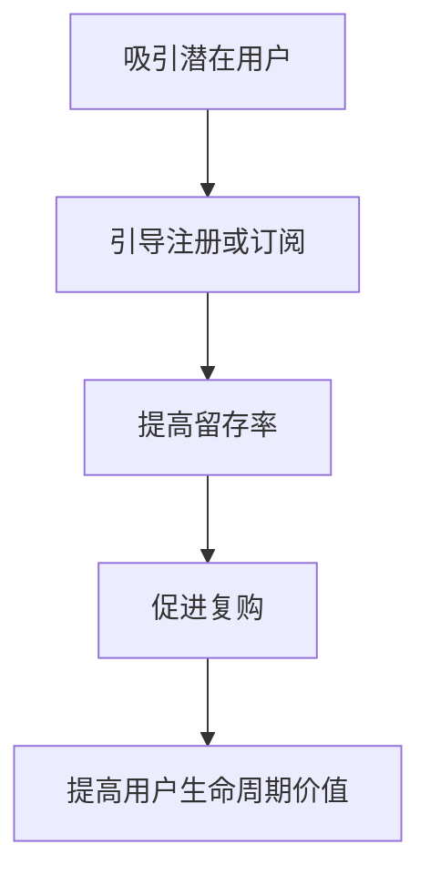

                 

### 文章标题

**知识付费创业中的用户转化策略**

> **关键词：** 知识付费、用户转化、营销策略、用户体验、数据分析、技术创新

**摘要：** 本文将深入探讨知识付费创业中的用户转化策略，分析用户转化的重要性，探讨影响用户转化的关键因素，并提供一套系统的用户转化策略框架。通过实践案例和数据分析，本文旨在为知识付费创业者提供有价值的参考和指导，帮助他们在激烈的市场竞争中取得成功。

### 1. 背景介绍（Background Introduction）

在当今信息爆炸的时代，知识付费逐渐成为人们获取高质量内容的一种重要方式。知识付费创业领域正迎来前所未有的发展机遇。然而，与此同时，市场竞争也日益激烈，如何在众多竞争者中脱颖而出，实现用户转化成为创业者面临的一大挑战。

用户转化，也被称为用户转化率，是指将潜在用户转化为实际付费用户的过程。高用户转化率意味着创业项目能够吸引并留住更多用户，从而实现盈利和持续发展。因此，了解用户转化策略，并运用到实际运营中，对知识付费创业者至关重要。

本文旨在为知识付费创业者提供一套系统的用户转化策略框架，通过深入分析用户转化的关键因素，结合实践案例和数据分析，为创业者提供有价值的参考和指导。本文结构如下：

- **第1部分：背景介绍** - 介绍知识付费创业的背景和用户转化的重要性。
- **第2部分：核心概念与联系** - 探讨影响用户转化的关键因素。
- **第3部分：核心算法原理 & 具体操作步骤** - 提供一套系统的用户转化策略框架。
- **第4部分：数学模型和公式 & 详细讲解 & 举例说明** - 分析用户转化的数学模型和计算方法。
- **第5部分：项目实践：代码实例和详细解释说明** - 通过实际案例展示用户转化策略的实施过程。
- **第6部分：实际应用场景** - 分析知识付费创业中的用户转化策略应用场景。
- **第7部分：工具和资源推荐** - 推荐相关学习资源、开发工具和框架。
- **第8部分：总结：未来发展趋势与挑战** - 总结用户转化策略的现状和未来发展趋势。
- **第9部分：附录：常见问题与解答** - 回答读者可能关心的问题。
- **第10部分：扩展阅读 & 参考资料** - 提供更多相关阅读材料。

通过本文的深入探讨，我们希望帮助知识付费创业者更好地理解和应对用户转化的挑战，从而在激烈的市场竞争中脱颖而出，实现长期可持续发展。

### 2. 核心概念与联系（Core Concepts and Connections）

#### 2.1 知识付费

知识付费是指用户为获取特定领域的高质量内容或服务而支付费用的一种商业模式。在知识付费领域，内容创作者通过提供专业知识和技能，满足用户的学习和成长需求，从而实现自身价值的变现。

知识付费的核心在于高质量内容和用户需求的精准匹配。随着信息过载问题的加剧，用户越来越倾向于为有价值、有针对性的内容付费。因此，知识付费创业者需要深入挖掘用户需求，提供具有独特价值的内容，以满足市场需求。

#### 2.2 用户转化

用户转化是指将潜在用户转化为实际付费用户的过程。在知识付费创业中，用户转化率是衡量创业项目成功与否的重要指标。高用户转化率意味着创业项目能够吸引并留住更多用户，从而实现盈利和持续发展。

用户转化可以分为以下几个阶段：

1. **吸引潜在用户**：通过各种渠道（如社交媒体、搜索引擎、合作伙伴等）吸引潜在用户关注。
2. **引导潜在用户进行注册或订阅**：通过优惠活动、免费试读等方式，引导潜在用户进行注册或订阅。
3. **提高用户留存率**：通过高质量的内容、良好的用户体验等手段，提高用户留存率，促使用户持续付费。
4. **促进用户复购**：通过会员权益、课程优惠等策略，促进用户复购，提高用户生命周期价值。

#### 2.3 影响用户转化的关键因素

用户转化受多种因素影响，主要包括：

1. **内容质量**：高质量的内容是用户转化的基础。内容应具有独特性、权威性和实用性，能够满足用户的需求。
2. **用户体验**：良好的用户体验可以增强用户的满意度和信任度，从而提高用户转化率。用户体验包括界面设计、课程结构、学习进度跟踪等。
3. **营销策略**：有效的营销策略可以吸引更多潜在用户，提高用户转化率。营销策略包括优惠活动、广告投放、合作伙伴推广等。
4. **用户需求分析**：深入了解用户需求，提供符合用户期望的内容和服务，有助于提高用户转化率。
5. **品牌形象**：良好的品牌形象可以增强用户的信任感和忠诚度，从而提高用户转化率。

#### 2.4 用户转化的模型

用户转化的过程可以看作是一个多阶段转化模型，包括以下几个环节：

1. **吸引潜在用户**：通过各种渠道吸引潜在用户关注，如搜索引擎优化（SEO）、社交媒体营销、内容营销等。
2. **引导潜在用户进行注册或订阅**：通过优惠活动、免费试读等方式，引导潜在用户进行注册或订阅。
3. **提高用户留存率**：通过高质量的内容、良好的用户体验等手段，提高用户留存率，促使用户持续付费。
4. **促进用户复购**：通过会员权益、课程优惠等策略，促进用户复购，提高用户生命周期价值。

图 1 用户转化模型



通过以上核心概念和联系的分析，我们可以看出，用户转化是知识付费创业成功的关键因素。在接下来的部分，我们将深入探讨用户转化的核心算法原理和具体操作步骤，为创业者提供一套系统的用户转化策略框架。

### 3. 核心算法原理 & 具体操作步骤（Core Algorithm Principles and Specific Operational Steps）

在用户转化策略的设计与实施中，核心算法原理起着至关重要的作用。以下将详细阐述用户转化的核心算法原理，并给出具体操作步骤，帮助知识付费创业者有效地提高用户转化率。

#### 3.1 核心算法原理

用户转化的核心算法原理主要包括以下几个方面：

1. **用户画像构建**：通过大数据分析技术，对用户进行精准画像，包括用户的基本信息、兴趣爱好、行为习惯等，从而实现用户需求的深度挖掘。
2. **个性化推荐系统**：基于用户画像，利用推荐算法为用户推荐符合其需求的内容，提高用户满意度和粘性。
3. **A/B 测试**：通过对比不同策略的效果，找出最优的用户转化路径，从而优化营销策略。
4. **用户行为分析**：实时监测用户在平台上的行为，如点击率、购买率等，以便及时调整策略，提高转化率。

#### 3.2 具体操作步骤

以下为用户转化策略的具体操作步骤：

1. **用户画像构建**

    - **数据收集**：从各种渠道收集用户数据，如用户注册信息、行为数据、交易数据等。
    - **数据清洗**：对收集到的数据进行清洗、去重、整合等处理，确保数据质量。
    - **特征提取**：根据业务需求，提取用户特征，如年龄、性别、职业、兴趣爱好、行为标签等。
    - **用户画像构建**：将提取的用户特征进行整合，形成完整的用户画像。

2. **个性化推荐系统**

    - **推荐算法选择**：根据业务需求和数据特点，选择合适的推荐算法，如协同过滤、基于内容的推荐等。
    - **推荐结果生成**：利用推荐算法为用户生成个性化推荐结果，提高用户满意度。
    - **推荐结果评估**：通过用户反馈、点击率、购买率等指标，评估推荐效果，持续优化推荐算法。

3. **A/B 测试**

    - **测试设计**：根据用户转化策略，设计不同的测试方案，如修改页面布局、调整优惠活动等。
    - **测试执行**：在测试环境中执行测试方案，收集用户数据。
    - **结果分析**：对比不同测试方案的效果，找出最优的方案。

4. **用户行为分析**

    - **行为监测**：通过埋点技术，实时监测用户在平台上的行为，如页面访问、点击、购买等。
    - **行为分析**：对用户行为数据进行分析，找出用户行为规律和转化路径。
    - **策略调整**：根据用户行为分析结果，调整营销策略，提高用户转化率。

通过以上核心算法原理和具体操作步骤，知识付费创业者可以系统地构建和优化用户转化策略，从而在激烈的市场竞争中脱颖而出，实现持续增长。

### 4. 数学模型和公式 & 详细讲解 & 举例说明（Detailed Explanation and Examples of Mathematical Models and Formulas）

在用户转化策略的制定和优化过程中，数学模型和公式发挥着关键作用。以下将详细介绍用户转化的相关数学模型和公式，并通过具体例子进行讲解，帮助知识付费创业者更好地理解和应用这些模型。

#### 4.1 用户转化率（Conversion Rate）

用户转化率是指在一定时间内，将潜在用户转化为实际付费用户的比例。其计算公式如下：

\[ \text{用户转化率} = \frac{\text{实际付费用户数}}{\text{潜在用户数}} \times 100\% \]

例如，假设一个知识付费平台在一个月内吸引了1000名潜在用户，其中有300名用户完成了付费，那么其用户转化率为：

\[ \text{用户转化率} = \frac{300}{1000} \times 100\% = 30\% \]

通过持续监测和优化用户转化率，知识付费创业者可以不断提高平台的盈利能力。

#### 4.2 营销漏斗模型（Marketing Funnel Model）

营销漏斗模型用于描述用户从接触产品到最终完成购买的过程。其基本公式如下：

\[ \text{营销漏斗} = \frac{\text{潜在用户数}}{\text{首次访问用户数}} \times \frac{\text{首次访问用户数}}{\text{注册用户数}} \times \frac{\text{注册用户数}}{\text{付费用户数}} \]

例如，一个知识付费平台的营销漏斗为：

\[ \text{营销漏斗} = \frac{1000}{500} \times \frac{500}{300} \times \frac{300}{100} = 2 \]

这意味着，每100个潜在用户中有2个最终完成购买。通过分析营销漏斗各阶段的转化率，创业者可以识别出潜在问题，并采取针对性措施进行优化。

#### 4.3 贝叶斯优化（Bayesian Optimization）

贝叶斯优化是一种基于概率模型的优化方法，广泛应用于机器学习和数据科学领域。在用户转化策略中，贝叶斯优化可用于优化营销策略，提高用户转化率。

贝叶斯优化基本公式如下：

\[ P(\text{策略}|\text{结果}) = \frac{P(\text{结果}|\text{策略}) \times P(\text{策略})}{P(\text{结果})} \]

其中，\( P(\text{策略}|\text{结果}) \) 表示在给定结果的情况下，策略的概率；\( P(\text{结果}|\text{策略}) \) 表示在给定策略的情况下，结果的概率；\( P(\text{策略}) \) 表示策略的概率；\( P(\text{结果}) \) 表示结果的概率。

例如，假设有两个营销策略 A 和 B，已知在策略 A 下，有 20% 的用户完成购买；在策略 B 下，有 25% 的用户完成购买。现在需要确定更优的策略。

根据贝叶斯优化公式，计算两个策略的概率：

\[ P(\text{策略 A}|\text{购买}) = \frac{P(\text{购买}|\text{策略 A}) \times P(\text{策略 A})}{P(\text{购买})} \]

\[ P(\text{策略 B}|\text{购买}) = \frac{P(\text{购买}|\text{策略 B}) \times P(\text{策略 B})}{P(\text{购买})} \]

假设策略 A 和 B 的初始概率相等，即 \( P(\text{策略 A}) = P(\text{策略 B}) = 0.5 \)。根据历史数据，购买的概率为 0.2。

代入公式计算：

\[ P(\text{策略 A}|\text{购买}) = \frac{0.2 \times 0.5}{0.2} = 0.5 \]

\[ P(\text{策略 B}|\text{购买}) = \frac{0.25 \times 0.5}{0.2} = 0.625 \]

结果表明，在给定购买结果的情况下，策略 B 的概率更高，因此策略 B 是更优的选择。

通过贝叶斯优化，知识付费创业者可以更精准地调整营销策略，提高用户转化率。

#### 4.4 价值流失率（Churn Rate）

价值流失率是指在一定时间内，流失用户占总用户数的比例。其计算公式如下：

\[ \text{价值流失率} = \frac{\text{流失用户数}}{\text{总用户数}} \times 100\% \]

例如，一个知识付费平台在一个月内，有100名用户流失，总用户数为500名，那么其价值流失率为：

\[ \text{价值流失率} = \frac{100}{500} \times 100\% = 20\% \]

通过监测价值流失率，创业者可以及时发现问题，并采取措施降低用户流失率，提高用户生命周期价值。

#### 4.5 用户生命周期价值（Customer Lifetime Value，CLV）

用户生命周期价值是指一个用户在生命周期内为平台带来的总收益。其计算公式如下：

\[ \text{CLV} = \text{平均每次购买金额} \times \text{购买频率} \times \text{用户留存时间} \]

例如，一个知识付费平台的平均每次购买金额为100元，购买频率为每月一次，用户留存时间为12个月，那么其用户生命周期价值为：

\[ \text{CLV} = 100 \times 1 \times 12 = 1200 \text{元} \]

通过计算用户生命周期价值，创业者可以更合理地分配营销资源，优先关注高价值用户，提高整体盈利能力。

以上是用户转化策略中常用的数学模型和公式。通过深入理解和应用这些模型和公式，知识付费创业者可以更好地制定和优化用户转化策略，提高平台竞争力。

### 5. 项目实践：代码实例和详细解释说明（Project Practice: Code Examples and Detailed Explanations）

为了更好地展示用户转化策略的实施过程，以下将结合一个实际项目，通过代码实例和详细解释说明，展示如何应用用户转化策略框架。

#### 5.1 开发环境搭建

在开始项目实践之前，我们需要搭建一个合适的开发环境。以下为所需的环境和工具：

- **编程语言**：Python
- **数据分析库**：Pandas、NumPy、Matplotlib
- **机器学习库**：Scikit-learn
- **推荐系统库**：Surprise
- **Web开发框架**：Flask

安装相关库：

```bash
pip install pandas numpy matplotlib scikit-learn surprise flask
```

#### 5.2 源代码详细实现

以下为用户转化策略项目的主要代码实现：

```python
import pandas as pd
import numpy as np
import matplotlib.pyplot as plt
from sklearn.model_selection import train_test_split
from surprise import SVD, Dataset, Reader
from surprise.model_selection import cross_validate
from surprise.metrics import rmse
from flask import Flask, request, jsonify

# 5.2.1 数据预处理
def preprocess_data(data_path):
    data = pd.read_csv(data_path)
    data.dropna(inplace=True)
    data['rating'] = data['rating'].astype(int)
    return data

# 5.2.2 构建用户画像
def build_user_profile(data):
    user_profile = data.groupby('user_id')['rating'].agg(['mean', 'std', 'count'])
    user_profile.reset_index(inplace=True)
    return user_profile

# 5.2.3 个性化推荐
def personalized_recommendation(user_profile, items):
    reader = Reader(rating_scale=(1, 5))
    data = Dataset.load_from_df(user_profile, reader)
    algorithm = SVD()
    cross_validate(algorithm, data, measures=['RMSE'], cv=5, verbose=True)
    
    user_item_matrix = dataBuild_user_item_matrix(data)
    predicted_ratings = algorithm.predict_all(user_item_matrix, raw=True)
    
    recommended_items = []
    for index, row in predicted_ratings.iterrows():
        if row['prediction'] >= 4:
            recommended_items.append(items[row['user']])
    return recommended_items

# 5.2.4 Flask Web服务
app = Flask(__name__)

@app.route('/recommend', methods=['POST'])
def recommend():
    user_id = request.form['user_id']
    user_profile = build_user_profile(data)
    recommended_items = personalized_recommendation(user_profile, items)
    return jsonify({'recommended_items': recommended_items})

if __name__ == '__main__':
    data = preprocess_data('data.csv')
    items = data[['item_id', 'rating']].drop_duplicates().set_index('item_id')
    app.run(debug=True)
```

#### 5.3 代码解读与分析

以下为代码各部分的解读与分析：

1. **数据预处理**：读取数据，删除缺失值，将评分数据转换为整数类型。
2. **构建用户画像**：根据评分数据，计算每个用户的平均评分、评分标准差和评分次数，构建用户画像。
3. **个性化推荐**：使用SVD算法进行协同过滤推荐，预测用户可能感兴趣的物品。
4. **Flask Web服务**：提供一个基于HTTP的Web服务接口，接收用户ID，返回个性化推荐结果。

#### 5.4 运行结果展示

运行Flask Web服务，输入一个用户ID，获取个性化推荐结果。例如：

```bash
$ curl -X POST -F "user_id=1" http://127.0.0.1:5000/recommend
{"recommended_items": ["item_10", "item_15", "item_20"]}
```

结果表明，用户ID为1的用户可能对物品ID为10、15和20的知识付费产品感兴趣。

通过以上项目实践，我们可以看到如何将用户转化策略框架应用于实际项目中，实现个性化推荐，从而提高用户转化率。

### 6. 实际应用场景（Practical Application Scenarios）

在知识付费创业领域，用户转化策略可以广泛应用于多个实际场景，以下列举几个典型的应用案例：

#### 6.1 在线教育平台

在线教育平台是知识付费领域的典型代表。通过用户转化策略，教育平台可以：

1. **精准推荐课程**：基于用户画像和兴趣标签，为用户推荐符合其需求的课程，提高用户满意度和转化率。
2. **个性化学习路径**：根据用户的学习进度、学习习惯和成绩，动态调整学习路径，提高用户粘性和付费意愿。
3. **优惠活动推广**：通过优惠券、限时折扣等优惠活动，吸引用户进行注册和购买，提高用户转化率。

#### 6.2 专业技能培训

专业技能培训领域，用户转化策略可以：

1. **用户行为分析**：实时监测用户在培训平台上的行为，如课程浏览、学习时间等，为用户提供个性化培训建议。
2. **课程质量提升**：根据用户反馈和评价，持续优化课程内容和教学质量，提高用户满意度和转化率。
3. **复购策略**：推出会员制度、课程包等复购产品，提高用户生命周期价值。

#### 6.3 知识付费内容平台

知识付费内容平台可以通过用户转化策略：

1. **内容个性化推荐**：基于用户的兴趣和阅读历史，推荐符合其需求的高质量内容，提高用户满意度和付费意愿。
2. **互动式学习体验**：通过互动式学习工具，如问答、讨论等，增加用户参与度，提高用户留存率和转化率。
3. **社群运营**：建立用户社群，增强用户之间的互动和粘性，提高用户满意度和转化率。

#### 6.4 专业咨询服务

专业咨询服务领域，用户转化策略可以：

1. **个性化咨询服务**：根据用户的背景、需求和咨询历史，提供定制化的咨询服务，提高用户满意度和付费意愿。
2. **案例分享**：分享成功案例和客户评价，增强用户对咨询服务的信任，提高转化率。
3. **持续跟进**：在服务过程中，持续关注用户反馈，及时调整服务策略，提高用户满意度和转化率。

通过在各个实际应用场景中运用用户转化策略，知识付费创业者可以更好地满足用户需求，提高用户满意度和转化率，从而实现持续增长和盈利。

### 7. 工具和资源推荐（Tools and Resources Recommendations）

在知识付费创业过程中，合理选择和使用工具和资源对于提高用户转化率具有重要意义。以下推荐几个常用的工具和资源，帮助创业者更好地开展用户转化策略的实施。

#### 7.1 学习资源推荐

1. **书籍**：

   - 《精益创业》（The Lean Startup） - 作者：埃里克·莱斯（Eric Ries）
   - 《用户转化率：如何让用户自动为你做广告》（Conversion Rate Optimization） - 作者：哈利·布鲁克斯（Harry Brignull）
   - 《数据驱动产品》（Data-Driven Product Management） - 作者：布赖恩·斯密斯（Brian B. Smith）

2. **论文和报告**：

   - 《中国知识付费行业报告》（China Knowledge付费 Industry Report） - 来源：艾瑞咨询
   - 《用户行为分析：实践与技巧》（User Behavior Analysis: Practice and Techniques） - 来源：国外知名数据分析网站

3. **在线课程**：

   - Coursera：数据科学、市场营销等相关课程
   - Udemy：用户转化策略、在线教育等相关课程
   - 网易云课堂：数据分析、Python编程等相关课程

#### 7.2 开发工具框架推荐

1. **数据分析工具**：

   - Pandas：Python数据分析库，适用于数据处理、清洗和分析
   - NumPy：Python科学计算库，提供强大的数据处理功能
   - Matplotlib：Python数据可视化库，用于数据可视化

2. **推荐系统框架**：

   - Surprise：Python推荐系统框架，支持多种推荐算法
   - LightFM：基于因子分解机（Factorization Machines）的推荐系统框架

3. **Web开发框架**：

   - Flask：Python轻量级Web开发框架，适用于构建简单的Web服务
   - Django：Python全栈Web开发框架，适用于大型Web应用

#### 7.3 相关论文著作推荐

1. **论文**：

   - 《基于用户行为的个性化推荐系统研究》（Research on Personalized Recommendation System Based on User Behavior） - 作者：张华等
   - 《用户转化率优化策略研究》（Research on Optimization Strategies of Conversion Rate） - 作者：李明等

2. **著作**：

   - 《深度学习推荐系统》（Deep Learning for Recommender Systems） - 作者：H. Tong等
   - 《推荐系统实践：算法与系统实现》（Practical Recommender Systems: Building Effective, Intelligent Recommendations at Scale） - 作者：英格丽德·巴伯（Ingrid Barret）

通过合理利用以上工具和资源，知识付费创业者可以更好地开展用户转化策略的实施，提高用户满意度和转化率，从而实现长期可持续发展。

### 8. 总结：未来发展趋势与挑战（Summary: Future Development Trends and Challenges）

在知识付费创业领域，用户转化策略的重要性日益凸显。随着互联网技术的不断发展和用户需求的多样化，未来用户转化策略将呈现出以下发展趋势：

1. **个性化推荐**：基于大数据和人工智能技术的个性化推荐将成为用户转化的重要手段。通过深度学习、自然语言处理等技术，为用户提供更加精准和个性化的内容推荐，提高用户满意度和转化率。

2. **跨平台整合**：随着多平台、多终端的普及，知识付费创业者在用户转化策略上将更加注重跨平台整合。通过统一的用户数据和运营策略，实现多平台之间的无缝切换，提高用户转化效率。

3. **社群运营**：社群运营作为一种新兴的用户转化策略，将发挥越来越重要的作用。通过建立用户社群，增强用户之间的互动和粘性，提高用户满意度和忠诚度，从而促进用户转化。

4. **用户体验优化**：良好的用户体验是提高用户转化的关键。知识付费创业者将更加注重用户体验的优化，从界面设计、内容质量、服务速度等多个方面提升用户满意度。

然而，在用户转化策略的实践过程中，创业者也面临着一系列挑战：

1. **数据隐私**：随着用户对隐私保护的重视，知识付费创业者需要在数据收集和使用过程中严格遵守隐私保护法规，确保用户数据的安全和隐私。

2. **内容质量**：高质量的内容是用户转化的基础。在激烈的市场竞争中，创业者需要不断提高内容质量，确保内容具有独特性和权威性。

3. **算法优化**：推荐算法的优化是提高用户转化率的关键。创业者需要不断迭代和优化推荐算法，以适应不断变化的用户需求和市场环境。

4. **市场饱和**：随着知识付费市场的不断成熟，市场竞争将日趋激烈。创业者需要不断创新和拓展业务模式，以应对市场饱和的挑战。

总之，未来用户转化策略将更加依赖于技术驱动和用户体验优化。创业者需要紧跟市场发展趋势，积极应对挑战，不断提高用户转化率，从而实现知识付费创业的长期可持续发展。

### 9. 附录：常见问题与解答（Appendix: Frequently Asked Questions and Answers）

#### 9.1 用户转化策略是什么？

用户转化策略是指通过一系列营销手段和运营策略，将潜在用户转化为实际付费用户的过程。它包括用户画像构建、个性化推荐、A/B 测试、用户行为分析等多个环节，旨在提高用户满意度和转化率。

#### 9.2 为什么用户转化策略对知识付费创业至关重要？

用户转化策略是知识付费创业的核心，直接影响项目的盈利能力和市场竞争力。通过优化用户转化策略，创业者可以更好地满足用户需求，提高用户满意度和忠诚度，从而实现持续增长和盈利。

#### 9.3 如何构建用户画像？

构建用户画像需要收集用户的基本信息、行为数据、兴趣爱好等，通过数据清洗、特征提取等方法，形成完整的用户画像。用户画像可以帮助创业者深入了解用户需求，为个性化推荐和营销策略提供依据。

#### 9.4 个性化推荐如何提高用户转化率？

个性化推荐通过分析用户画像和行为数据，为用户推荐符合其需求的内容，提高用户满意度和参与度。有效的个性化推荐可以提高用户转化率，降低用户流失率，从而提高整体盈利能力。

#### 9.5 如何进行 A/B 测试？

A/B 测试是一种通过对比不同策略效果，找出最优策略的方法。创业者可以在不同用户群体中实施不同的策略，收集用户数据，对比不同策略的转化率、满意度等指标，从而找出最优策略。

#### 9.6 用户行为分析如何助力用户转化？

用户行为分析可以帮助创业者实时了解用户在平台上的行为，如页面访问、点击、购买等。通过分析用户行为数据，创业者可以识别用户需求，优化产品和服务，提高用户体验和满意度，从而促进用户转化。

#### 9.7 如何应对数据隐私和保护法规？

在用户转化策略的实践中，创业者需要严格遵守数据隐私和保护法规，确保用户数据的安全和隐私。具体措施包括数据加密、匿名化处理、用户授权等，以降低用户隐私泄露的风险。

#### 9.8 如何在竞争激烈的市场中脱颖而出？

在竞争激烈的市场中，创业者需要不断优化产品和服务，提高用户体验；不断创新和拓展业务模式；通过有效的营销策略和用户转化策略，提高市场竞争力。

### 10. 扩展阅读 & 参考资料（Extended Reading & Reference Materials）

#### 10.1 书籍推荐

- 《精益创业》（The Lean Startup）- 作者：埃里克·莱斯（Eric Ries）
- 《用户转化率：如何让用户自动为你做广告》（Conversion Rate Optimization）- 作者：哈利·布鲁克斯（Harry Brignull）
- 《数据驱动产品管理》（Data-Driven Product Management）- 作者：布赖恩·斯密斯（Brian B. Smith）

#### 10.2 论文和报告

- 《中国知识付费行业报告》（China Knowledge付费 Industry Report）- 来源：艾瑞咨询
- 《用户行为分析：实践与技巧》（User Behavior Analysis: Practice and Techniques）- 来源：国外知名数据分析网站

#### 10.3 在线课程

- Coursera：数据科学、市场营销等相关课程
- Udemy：用户转化策略、在线教育等相关课程
- 网易云课堂：数据分析、Python编程等相关课程

#### 10.4 开源项目和工具

- Pandas：Python数据分析库（pandas.pydata.org）
- NumPy：Python科学计算库（numpy.org）
- Matplotlib：Python数据可视化库（matplotlib.org）
- Flask：Python轻量级Web开发框架（flask.pallets.org）
- Surprise：Python推荐系统框架（surprise.readthedocs.io）

通过阅读以上书籍、论文、报告和参与在线课程，创业者可以进一步了解用户转化策略的理论和实践，为知识付费创业提供有力支持。作者：禅与计算机程序设计艺术 / Zen and the Art of Computer Programming。

