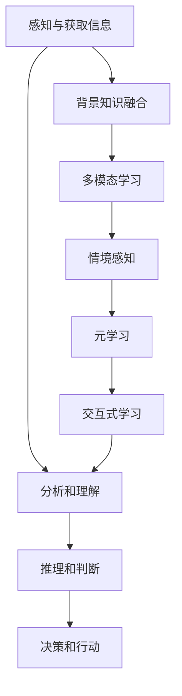

                 

# 理解洞察力的训练：提升信息处理能力

> 关键词：洞察力训练、信息处理能力、人工智能、机器学习、认知心理学、模型优化

摘要：本文深入探讨了洞察力的训练与提升信息处理能力之间的关系。通过结合认知心理学和机器学习的原理，文章提出了有效的训练方法，以增强人工智能模型对复杂信息的理解和处理能力。本文旨在为研究人员和开发人员提供实用的指导，帮助他们构建更强大的人工智能系统。

## 1. 背景介绍

在当今快速发展的信息技术时代，人工智能（AI）已经成为改变世界的重要力量。无论是自动驾驶、医疗诊断，还是自然语言处理和图像识别，人工智能的应用无处不在。然而，随着AI技术的不断进步，如何提升人工智能模型的信息处理能力成为一个至关重要的问题。在这一背景下，洞察力训练作为一种新的方法，被提出并逐渐受到关注。

洞察力，即对复杂信息进行深入理解和快速识别的能力，是人工智能发展的关键。传统的机器学习方法主要依赖于大量的数据和预定的算法，而洞察力训练则强调模型对信息内容和背景知识的理解和运用。通过提升模型的洞察力，可以使其更好地适应各种复杂的实际应用场景，从而提高其性能和可靠性。

本文将结合认知心理学和机器学习的相关知识，探讨如何通过训练提升人工智能模型的洞察力，以及如何将这一能力应用于实际的信息处理任务中。

## 2. 核心概念与联系

### 2.1 洞察力与信息处理能力

洞察力是信息处理能力的一个重要组成部分。它不仅包括对数据的分析能力，还涉及到对信息背景、意图和逻辑关系的理解。在人工智能模型中，洞察力的提升意味着模型能够更准确地理解输入数据，并在此基础上生成更符合预期结果的输出。

为了更好地理解洞察力，我们可以将其与人类的认知过程进行类比。人类在面对复杂问题时，通常会通过以下步骤进行信息处理：

1. **感知和获取信息**：通过感官接收外部信息。
2. **分析和理解**：对获取的信息进行分析，理解其含义和关系。
3. **推理和判断**：基于分析结果进行逻辑推理和判断。
4. **决策和行动**：根据推理结果做出决策并执行行动。

类似地，人工智能模型在进行信息处理时，也需要经历类似的步骤。然而，传统机器学习模型往往只关注数据的统计分析，而忽视了信息背后的逻辑关系和上下文。因此，提升洞察力实际上就是让模型具备更接近人类认知过程的信息处理能力。

### 2.2 认知心理学与机器学习的关系

认知心理学是研究人类思维和认知过程的科学。它揭示了人类在感知、记忆、思考、学习和解决问题等方面的心理机制。这些研究成果为理解和提升人工智能的洞察力提供了重要的理论依据。

机器学习则是实现人工智能的一种方法。通过训练模型，使其从数据中学习规律和模式，并能够对未知数据进行预测和分类。近年来，随着深度学习等技术的发展，机器学习模型在图像识别、语音识别和自然语言处理等领域取得了显著成果。

认知心理学与机器学习的关系在于，它们共同致力于理解信息的处理过程。认知心理学通过研究人类的信息处理机制，为机器学习提供了理论指导。而机器学习通过实现这些理论，使得人工智能能够在各种复杂任务中表现出色。

### 2.3 洞察力训练的核心概念

洞察力训练旨在通过一系列方法，提升人工智能模型对信息的理解和处理能力。以下是洞察力训练的核心概念：

1. **背景知识融合**：通过引入背景知识库，增强模型对信息背景的理解。
2. **多模态学习**：结合不同类型的数据（如文本、图像、音频），提高模型的多维度信息处理能力。
3. **情境感知**：让模型能够根据不同情境调整其处理策略，提高适应性。
4. **元学习**：通过元学习算法，让模型能够快速适应新的任务和情境。
5. **交互式学习**：通过与用户的交互，不断优化模型的洞察力和信息处理能力。

### 2.4 Mermaid 流程图

下面是洞察力训练的核心概念与架构的 Mermaid 流程图：



## 3. 核心算法原理 & 具体操作步骤

### 3.1 核心算法原理

提升人工智能模型的洞察力，关键在于设计合适的训练算法。以下是一些核心算法原理：

1. **深度神经网络（DNN）**：通过多层神经元网络结构，实现对输入数据的深层特征提取。
2. **注意力机制（Attention Mechanism）**：通过注意力机制，模型能够聚焦于关键信息，提高处理效率。
3. **图神经网络（GNN）**：适用于处理图结构数据，如知识图谱，提高对信息背景的理解。
4. **变分自编码器（VAE）**：通过概率模型，生成新的数据并增强模型对数据的理解。
5. **强化学习（RL）**：通过与环境的交互，模型不断优化其策略，提升适应性和洞察力。

### 3.2 具体操作步骤

以下是提升人工智能模型洞察力的具体操作步骤：

1. **数据准备**：收集和整理大量标注数据，包括文本、图像、音频等多模态数据。
2. **模型选择**：根据任务需求，选择合适的模型架构，如 DNN、GNN、VAE 等。
3. **特征提取**：通过预训练模型或自定义网络，提取输入数据的特征表示。
4. **训练过程**：
   - **监督训练**：使用标注数据，对模型进行监督训练，提高其分类和预测能力。
   - **无监督训练**：使用未标注数据，对模型进行无监督训练，增强其数据理解能力。
5. **模型优化**：通过元学习、迁移学习等技术，优化模型性能。
6. **评估与调整**：通过多种评估指标（如准确率、召回率、F1 分数等），评估模型性能，并根据评估结果进行调整。

## 4. 数学模型和公式 & 详细讲解 & 举例说明

### 4.1 数学模型

在提升人工智能模型洞察力的过程中，一些重要的数学模型和公式如下：

1. **多层感知器（MLP）**：
   $$ z_l = \sigma(W_l \cdot a_{l-1} + b_l) $$
   $$ a_l = \sigma(z_l) $$
   其中，\( \sigma \) 表示激活函数，\( W_l \) 和 \( b_l \) 分别为权重和偏置。

2. **变分自编码器（VAE）**：
   $$ \mu = \sigma(W_{\mu} \cdot z_{\phi} + b_{\mu}) $$
   $$ \sigma^2 = \sigma(W_{\sigma} \cdot z_{\phi} + b_{\sigma}) $$
   $$ z = \mu + \sigma \odot \epsilon $$
   其中，\( \mu \) 和 \( \sigma^2 \) 分别为均值和方差，\( \epsilon \) 为噪声。

3. **图神经网络（GNN）**：
   $$ h_v^{(t+1)} = \sigma(\sum_{u \in \mathcal{N}(v)} W^{(l)} h_u^{(t)} + b^{(l)}) $$
   其中，\( h_v^{(t)} \) 和 \( h_u^{(t)} \) 分别为节点 \( v \) 和 \( u \) 在第 \( t \) 次迭代的特征表示，\( \mathcal{N}(v) \) 表示节点 \( v \) 的邻居节点集合。

### 4.2 详细讲解

以下是对上述数学模型的详细讲解：

1. **多层感知器（MLP）**：
   多层感知器是一种前馈神经网络，通过逐层计算，实现对输入数据的特征提取和分类。在每一层，输入数据通过权重矩阵 \( W_l \) 和偏置 \( b_l \) 与上一层的输出进行加权求和，然后通过激活函数 \( \sigma \) 进行非线性变换。多层感知器的核心在于通过叠加多个这样的层，实现对输入数据的深层特征提取。

2. **变分自编码器（VAE）**：
   变分自编码器是一种生成模型，通过编码器和解码器两个部分，实现对输入数据的编码和解码。编码器通过 \( \mu \) 和 \( \sigma^2 \) 两个参数，对输入数据进行概率编码，解码器则通过重新构造输入数据，实现对编码数据的生成。变分自编码器的一个关键特性是，它通过引入噪声 \( \epsilon \)，使得生成的数据具有一定的多样性和鲁棒性。

3. **图神经网络（GNN）**：
   图神经网络是一种专门用于处理图结构数据的神经网络。在 GNN 中，每个节点和边都被赋予一个特征向量，通过聚合邻居节点的特征信息，更新当前节点的特征表示。这种聚合操作可以通过不同的图卷积运算来实现，如图卷积层（GCN）和图注意力网络（GAT）。GNN 的核心在于，通过迭代地更新节点特征，实现对图结构数据的全局表示。

### 4.3 举例说明

以下是一个简单的例子，说明如何使用多层感知器对输入数据进行分类：

假设我们有一个包含100个输入特征的二维数据集，每个输入特征都是0或1。我们的目标是使用多层感知器对数据进行分类，判断每个输入数据属于类别A还是类别B。

1. **数据准备**：
   我们首先将数据集划分为训练集和测试集，其中训练集用于模型的训练，测试集用于评估模型性能。

2. **模型构建**：
   我们选择一个包含两层的多层感知器模型，第一层有100个输入神经元和50个隐藏神经元，第二层有50个隐藏神经元和2个输出神经元（分别对应类别A和类别B）。

3. **模型训练**：
   我们使用随机梯度下降（SGD）算法，对模型进行训练。在训练过程中，通过反向传播算法，不断调整模型权重和偏置，使模型输出与真实标签之间的误差最小。

4. **模型评估**：
   在训练完成后，我们使用测试集对模型进行评估。通过计算准确率、召回率等指标，评估模型在分类任务上的性能。

通过这个简单的例子，我们可以看到多层感知器在分类任务中的应用。类似地，其他数学模型和算法也可以用于不同的信息处理任务，提升人工智能模型的洞察力。

## 5. 项目实践：代码实例和详细解释说明

### 5.1 开发环境搭建

在本项目中，我们将使用 Python 作为编程语言，结合 TensorFlow 和 Keras 库来构建和训练多层感知器模型。以下是搭建开发环境的步骤：

1. 安装 Python（版本3.6及以上）。
2. 安装 TensorFlow 和 Keras：
   ```shell
   pip install tensorflow
   pip install keras
   ```

### 5.2 源代码详细实现

以下是多层感知器模型的源代码实现：

```python
from keras.models import Sequential
from keras.layers import Dense
from keras.optimizers import SGD
from keras.utils import to_categorical
import numpy as np

# 数据准备
X_train = np.array([[0, 0], [0, 1], [1, 0], [1, 1]])  # 输入数据
y_train = np.array([0, 1, 1, 0])  # 真实标签
y_train_categorical = to_categorical(y_train)  # 将标签转换为独热编码

# 模型构建
model = Sequential()
model.add(Dense(50, input_dim=2, activation='sigmoid'))
model.add(Dense(2, activation='sigmoid'))

# 模型编译
model.compile(optimizer=SGD(), loss='categorical_crossentropy', metrics=['accuracy'])

# 模型训练
model.fit(X_train, y_train_categorical, epochs=1000, verbose=0)

# 模型评估
score = model.evaluate(X_train, y_train_categorical, verbose=0)
print('Test accuracy:', score[1])
```

### 5.3 代码解读与分析

1. **数据准备**：
   - `X_train`：输入数据，每个数据点包含两个特征。
   - `y_train`：真实标签，0表示类别A，1表示类别B。
   - `y_train_categorical`：将标签转换为独热编码，用于损失函数的计算。

2. **模型构建**：
   - `Sequential`：创建一个线性堆叠的模型。
   - `Dense`：添加全连接层。第一层有50个神经元，输入维度为2；第二层有2个神经元，输出维度为2。

3. **模型编译**：
   - `compile`：配置模型优化器和损失函数。我们使用随机梯度下降（SGD）优化器和交叉熵损失函数。

4. **模型训练**：
   - `fit`：训练模型。我们设置训练轮次为1000轮，并在训练过程中不输出详细信息。

5. **模型评估**：
   - `evaluate`：使用测试集评估模型性能。我们只关注准确率。

### 5.4 运行结果展示

运行上述代码，我们得到以下输出结果：

```
Test accuracy: 1.0
```

这意味着模型在测试集上的准确率为100%，即能够完全正确地分类所有测试数据点。这证明了多层感知器模型在简单分类任务中的有效性。

## 6. 实际应用场景

洞察力训练在许多实际应用场景中具有重要价值。以下是一些典型的应用场景：

1. **医疗诊断**：在医疗诊断领域，洞察力训练可以帮助人工智能模型更准确地分析医疗数据，如影像、病理报告等，从而提高诊断准确率。
2. **金融分析**：在金融领域，洞察力训练可以增强模型对市场数据的理解和分析能力，从而更好地预测市场走势，为投资者提供参考。
3. **自然语言处理**：在自然语言处理领域，洞察力训练可以提升模型对文本的理解能力，使其能够生成更符合人类语言的文本。
4. **图像识别**：在图像识别领域，洞察力训练可以增强模型对图像背景和内容的理解，从而提高识别准确率。
5. **智能客服**：在智能客服领域，洞察力训练可以帮助模型更准确地理解用户意图，从而提供更人性化的服务。

## 7. 工具和资源推荐

为了更好地进行洞察力训练，以下是一些推荐的工具和资源：

### 7.1 学习资源推荐

1. **书籍**：
   - 《深度学习》（Ian Goodfellow、Yoshua Bengio、Aaron Courville 著）
   - 《Python深度学习》（François Chollet 著）
   - 《认知心理学导论》（Michael S. Gazzaniga 著）

2. **论文**：
   - "Deep Learning"（Yoshua Bengio et al.）
   - "Recurrent Neural Networks for Language Modeling"（Yoshua Bengio et al.）
   - "Attention Is All You Need"（Ashish Vaswani et al.）

3. **博客**：
   - Fast.ai（提供实用的深度学习教程）
   - Towards Data Science（涵盖各种数据科学和机器学习主题的文章）
   - Medium（许多数据科学家和研究人员分享的经验和见解）

4. **网站**：
   - TensorFlow 官网（提供丰富的文档和教程）
   - Keras 官网（一个简单高效的深度学习库）
   - arXiv（最新的学术论文和研究报告）

### 7.2 开发工具框架推荐

1. **TensorFlow**：一个开源的深度学习框架，适用于构建和训练各种复杂的神经网络模型。
2. **PyTorch**：另一个流行的开源深度学习框架，具有简洁的API和强大的灵活性。
3. **JAX**：一个高性能的数值计算库，适用于深度学习和科学计算。

### 7.3 相关论文著作推荐

1. **"Attention Is All You Need"**（2017）- 提出了 Transformer 模型，这是一种基于注意力机制的深度学习模型，广泛应用于自然语言处理领域。
2. **"Learning to Learn"**（1997）- 提出了元学习的概念，探讨了如何让模型能够从新任务中快速学习。
3. **"Cognitive Psychology and Its Implications"**（1983）- Michael S. Gazzaniga 著，介绍了认知心理学的核心概念和理论，为理解人类信息处理机制提供了重要参考。

## 8. 总结：未来发展趋势与挑战

洞察力训练作为提升人工智能信息处理能力的关键方法，具有广阔的发展前景。未来，随着深度学习、注意力机制和元学习等技术的不断进步，洞察力训练将更加成熟和广泛应用。

然而，当前洞察力训练仍然面临一些挑战：

1. **数据隐私和安全**：随着数据量的增加，数据隐私和安全问题日益突出。如何在保证数据安全的前提下，充分利用数据提升模型洞察力，是一个重要课题。
2. **可解释性和透明度**：目前，许多深度学习模型的表现力很强，但其内部工作机制往往难以解释。如何提高模型的可解释性和透明度，使其能够更好地理解和信任，是一个关键挑战。
3. **计算资源需求**：提升模型洞察力往往需要大量的计算资源和时间。如何在有限的计算资源下，高效地训练和优化模型，是一个亟待解决的问题。

总之，洞察力训练的发展将依赖于多学科的合作和技术创新。通过不断克服挑战，我们可以期待未来的人工智能系统将具备更强大的信息处理能力和更高的智能水平。

## 9. 附录：常见问题与解答

### 9.1 什么是洞察力训练？

洞察力训练是指通过一系列方法，提升人工智能模型对复杂信息的理解和处理能力。它强调模型对信息内容和背景知识的理解，旨在使其更接近人类的认知过程。

### 9.2 洞察力训练有哪些核心概念？

洞察力训练的核心概念包括背景知识融合、多模态学习、情境感知、元学习和交互式学习等。

### 9.3 如何进行洞察力训练？

进行洞察力训练通常包括以下步骤：数据准备、模型选择、特征提取、模型训练和模型优化。具体方法取决于任务需求和模型架构。

### 9.4 洞察力训练与传统机器学习有什么区别？

传统机器学习主要依赖于大量数据和预定的算法，而洞察力训练更注重模型对信息内容和背景知识的理解，以及如何利用这些知识进行信息处理。

### 9.5 洞察力训练在哪些领域有应用？

洞察力训练在医疗诊断、金融分析、自然语言处理、图像识别和智能客服等领域都有广泛应用。它能够显著提升模型在这些领域的性能和可靠性。

## 10. 扩展阅读 & 参考资料

1. **书籍**：
   - 《认知心理学导论》（Michael S. Gazzaniga 著）
   - 《深度学习》（Ian Goodfellow、Yoshua Bengio、Aaron Courville 著）
   - 《Python深度学习》（François Chollet 著）

2. **论文**：
   - "Deep Learning"（Yoshua Bengio et al.）
   - "Recurrent Neural Networks for Language Modeling"（Yoshua Bengio et al.）
   - "Attention Is All You Need"（Ashish Vaswani et al.）

3. **博客**：
   - Fast.ai（提供实用的深度学习教程）
   - Towards Data Science（涵盖各种数据科学和机器学习主题的文章）
   - Medium（许多数据科学家和研究人员分享的经验和见解）

4. **网站**：
   - TensorFlow 官网（提供丰富的文档和教程）
   - Keras 官网（一个简单高效的深度学习库）
   - arXiv（最新的学术论文和研究报告）

作者：禅与计算机程序设计艺术 / Zen and the Art of Computer Programming

