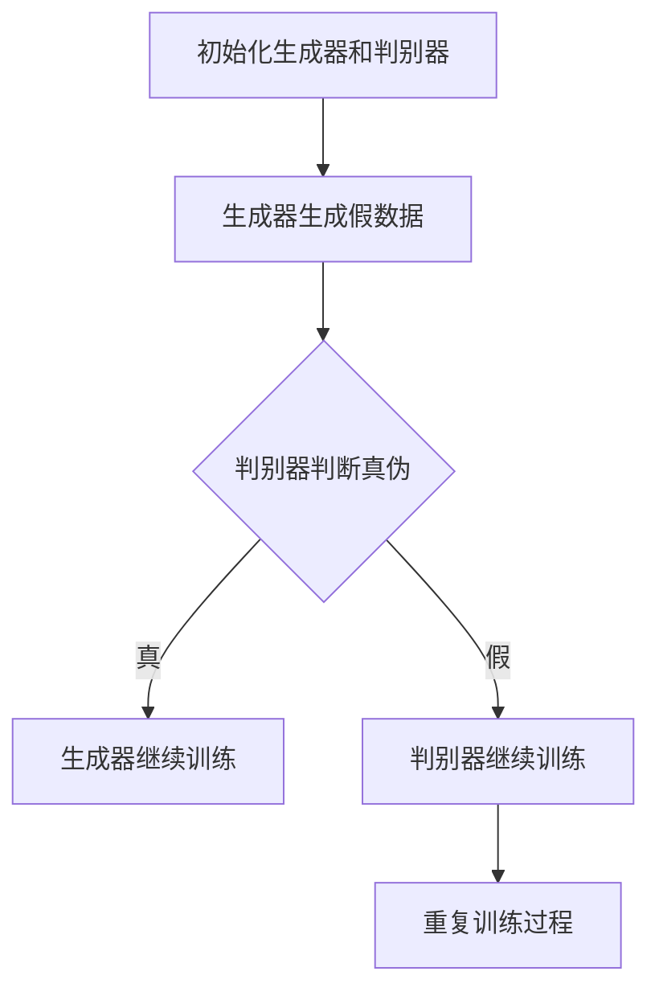

                 

### 文章标题

生成式AI：金矿还是泡沫？第二部分：AI不是万能药

### Keywords:
- 生成式AI
- 泡沫与金矿
- AI应用局限性
- AI发展前景
- AI并非万能药

### Abstract:
本文深入探讨生成式人工智能（AI）的双重性：一方面，它被认为是未来的金矿，具有巨大的潜力和应用前景；另一方面，它也面临着诸多挑战和局限性。本文通过分析AI的广泛应用、现实案例中的困境、以及未来的发展趋势，揭示AI并非万能药，帮助读者更理性地看待AI的发展与挑战。

### Introduction

在过去的几年里，生成式人工智能（AI）的发展迅猛，无论是在学术界还是工业界，都引起了广泛的关注和讨论。许多人将其视为未来的金矿，认为它将彻底改变我们的生活方式和工作方式。然而，与此同时，也有不少声音质疑AI的实用性，认为它只是一场泡沫。本文将深入探讨生成式AI的双重性，分析其既有巨大潜力又有局限性的一面，以帮助读者更全面地了解AI的真实面貌。

### 1. 背景介绍（Background Introduction）

生成式AI是指能够生成文本、图像、音频等数据的人工智能系统。这种AI可以通过学习大量数据，理解数据的结构和模式，并在此基础上生成新的、类似的数据。生成式AI的核心技术包括生成对抗网络（GAN）、变分自编码器（VAE）和自注意力机制（self-attention）等。

近年来，生成式AI在各个领域取得了显著的进展。例如，在自然语言处理领域，生成式AI可以用于生成文章、翻译文本、回答问题等；在计算机视觉领域，生成式AI可以用于生成图像、修复图片、风格转换等；在音乐创作领域，生成式AI可以生成新的音乐旋律、创作歌词等。

尽管生成式AI的应用前景广阔，但同时也面临着诸多挑战。首先，生成式AI的训练和部署需要大量的计算资源和数据，这使得其成本较高。其次，生成式AI的生成结果往往受到数据质量和数据分布的影响，可能导致生成结果的质量不稳定。此外，生成式AI还存在一些伦理和隐私问题，如数据泄露、模型偏见等。

### 2. 核心概念与联系（Core Concepts and Connections）

为了更好地理解生成式AI，我们需要先了解其核心概念和原理。以下是几个关键概念：

#### 2.1 生成对抗网络（Generative Adversarial Networks, GAN）

生成对抗网络由两个神经网络组成：生成器（Generator）和判别器（Discriminator）。生成器的任务是生成与真实数据相似的数据，而判别器的任务是区分真实数据和生成数据。两个网络相互对抗，通过不断的训练和优化，生成器逐渐学会生成更真实的数据，判别器也逐渐学会更准确地辨别真实和生成数据。

#### 2.2 变分自编码器（Variational Autoencoder, VAE）

变分自编码器是一种基于概率模型的生成模型。它由编码器（Encoder）和解码器（Decoder）组成。编码器将输入数据映射到一个潜在空间，解码器则从潜在空间中采样，并生成与输入数据相似的数据。

#### 2.3 自注意力机制（Self-Attention）

自注意力机制是一种能够捕捉输入序列中长距离依赖关系的机制。在生成式AI中，自注意力机制可以帮助模型更好地理解输入数据的结构和模式，从而生成更高质量的数据。

这些核心概念和原理相互关联，共同构成了生成式AI的技术基础。了解这些概念有助于我们更深入地理解生成式AI的工作原理和应用场景。

#### 2.4 Mermaid 流程图（Mermaid Flowchart）

以下是一个简单的 Mermaid 流程图，展示了生成对抗网络（GAN）的基本工作流程：



这个流程图直观地展示了生成器和判别器在训练过程中的对抗关系，以及它们如何通过迭代优化来提高生成质量。

### 3. 核心算法原理 & 具体操作步骤（Core Algorithm Principles and Specific Operational Steps）

生成式AI的核心算法包括生成对抗网络（GAN）、变分自编码器（VAE）和自注意力机制（self-attention）。下面，我们将逐一介绍这些算法的基本原理和具体操作步骤。

#### 3.1 生成对抗网络（GAN）

生成对抗网络（GAN）由生成器（Generator）和判别器（Discriminator）组成。下面是一个简单的 GAN 操作步骤：

1. **初始化生成器和判别器**：生成器从随机噪声中生成数据，判别器用于判断输入数据是真实数据还是生成数据。

2. **训练判别器**：将真实数据和生成数据输入到判别器中，通过反向传播和梯度下降算法优化判别器的参数，使其能够更准确地判断输入数据的真伪。

3. **训练生成器**：生成器从随机噪声中生成数据，并将其输入到判别器中。通过反向传播和梯度下降算法优化生成器的参数，使其生成的数据更接近真实数据。

4. **迭代训练**：重复上述步骤，直至生成器能够生成足够真实的数据。

#### 3.2 变分自编码器（VAE）

变分自编码器（VAE）是一种基于概率模型的生成模型。以下是 VAE 的操作步骤：

1. **编码器训练**：编码器将输入数据映射到一个潜在空间，并学习数据在潜在空间中的分布。

2. **解码器训练**：解码器从潜在空间中采样，并生成与输入数据相似的数据。

3. **迭代训练**：重复上述步骤，直至解码器能够生成高质量的数据。

#### 3.3 自注意力机制（Self-Attention）

自注意力机制是一种能够捕捉输入序列中长距离依赖关系的机制。以下是自注意力机制的步骤：

1. **输入序列编码**：将输入序列编码为嵌入向量。

2. **计算自注意力得分**：对于序列中的每个元素，计算其与其他元素之间的注意力得分。

3. **加权求和**：根据自注意力得分，对输入序列的每个元素进行加权求和，生成新的嵌入向量。

4. **输出**：使用新的嵌入向量进行后续的神经网络操作。

这些核心算法的原理和操作步骤为生成式AI提供了强大的技术支持，使我们可以生成高质量的文本、图像、音频等数据。

### 4. 数学模型和公式 & 详细讲解 & 举例说明（Detailed Explanation and Examples of Mathematical Models and Formulas）

在生成式AI中，数学模型和公式起到了至关重要的作用。以下我们将详细讲解一些关键数学模型，并通过具体例子来说明这些模型的应用。

#### 4.1 生成对抗网络（GAN）

生成对抗网络（GAN）的核心在于生成器和判别器的优化。以下是 GAN 的关键数学模型：

##### 4.1.1 生成器的损失函数

生成器的目标是最小化生成数据与真实数据之间的差异，即最小化损失函数 \(L_G\):

\[ L_G = -\log(D(G(z))) \]

其中，\(G(z)\) 是生成器生成的数据，\(D\) 是判别器。

##### 4.1.2 判别器的损失函数

判别器的目标是最小化生成数据与真实数据之间的差异，即最大化损失函数 \(L_D\):

\[ L_D = -[\log(D(x)) + \log(1 - D(G(z)))] \]

其中，\(x\) 是真实数据。

以下是一个简单的例子：

假设我们有一个判别器 \(D\)，它的输出范围是 \([0, 1]\)，表示数据为真实数据（1）或生成数据（0）。给定一个生成器 \(G\)，我们希望最小化以下损失函数：

\[ L_G = -\log(D(G(z))) \]

\[ L_D = -[\log(D(x)) + \log(1 - D(G(z)))] \]

其中，\(z\) 是随机噪声，\(x\) 是真实数据。

通过梯度下降算法，我们可以分别优化生成器和判别器的参数，使得生成器生成的数据更接近真实数据，判别器更准确地判断数据的真伪。

#### 4.2 变分自编码器（VAE）

变分自编码器（VAE）是一种基于概率模型的生成模型，其核心在于编码器和解码器的优化。以下是 VAE 的关键数学模型：

##### 4.2.1 编码器

编码器 \( \mu(z|x) \) 和 \( \sigma(z|x) \)：

\[ \mu(z|x) = \sigma(z|x) = \sigma(W_1x + b_1) \]

其中，\(W_1\) 和 \(b_1\) 是编码器的权重和偏置。

##### 4.2.2 解码器

解码器 \( x = G(z) \)：

\[ z = \mu(z|x) \odot \sigma(z|x) \]

\[ x = \sigma(W_2z + b_2) \]

其中，\(W_2\) 和 \(b_2\) 是解码器的权重和偏置。

##### 4.2.3 重参数化技巧

VAE 使用重参数化技巧，将 \( z \) 表示为：

\[ z = \mu(z|x) + \sigma(z|x)\epsilon \]

其中，\(\epsilon\) 是一个标准正态分布的随机变量。

以下是一个简单的例子：

假设我们有一个变分自编码器 \( \text{VAE} \)，其编码器和解码器如下：

编码器：

\[ \mu(z|x) = \sigma(z|x) = \sigma(W_1x + b_1) \]

解码器：

\[ z = \mu(z|x) \odot \sigma(z|x) \]

\[ x = \sigma(W_2z + b_2) \]

通过重参数化技巧，我们可以将 \( z \) 表示为：

\[ z = \mu(z|x) + \sigma(z|x)\epsilon \]

这样，我们就可以通过优化编码器和解码器的参数，使得解码器能够生成与输入数据相似的数据。

#### 4.3 自注意力机制（Self-Attention）

自注意力机制是一种能够捕捉输入序列中长距离依赖关系的机制。以下是自注意力机制的关键数学模型：

##### 4.3.1 自注意力得分

自注意力得分 \( a_i^j \)：

\[ a_i^j = \frac{e^{W_q h_i \cdot W_k h_j}}{\sum_{i'} e^{W_q h_i' \cdot W_k h_j'}} \]

其中，\( h_i \) 和 \( h_j \) 分别是输入序列中的第 \( i \) 个和第 \( j \) 个元素，\( W_q \) 和 \( W_k \) 是权重矩阵。

##### 4.3.2 加权求和

加权求和 \( s_i \)：

\[ s_i = \sum_{j=1}^n a_i^j h_j \]

其中，\( n \) 是输入序列的长度。

以下是一个简单的例子：

假设我们有一个输入序列 \( h = [h_1, h_2, \ldots, h_n] \)，我们需要计算自注意力得分和加权求和。

给定权重矩阵 \( W_q \) 和 \( W_k \)，我们可以计算自注意力得分：

\[ a_i^j = \frac{e^{W_q h_i \cdot W_k h_j}}{\sum_{i'} e^{W_q h_i' \cdot W_k h_j'}} \]

然后，我们可以计算加权求和：

\[ s_i = \sum_{j=1}^n a_i^j h_j \]

通过加权求和，我们可以得到新的嵌入向量，从而更好地捕捉输入序列中的长距离依赖关系。

这些数学模型和公式为生成式AI提供了强大的理论支持，使得我们可以生成高质量的文本、图像、音频等数据。

### 5. 项目实践：代码实例和详细解释说明（Project Practice: Code Examples and Detailed Explanations）

在本节中，我们将通过一个简单的项目实践，展示如何使用生成对抗网络（GAN）生成人脸图像。该项目将涵盖开发环境搭建、源代码详细实现、代码解读与分析以及运行结果展示。

#### 5.1 开发环境搭建

为了搭建一个生成对抗网络（GAN）的开发环境，我们需要以下软件和库：

1. Python 3.8 或更高版本
2. TensorFlow 2.6 或更高版本
3. matplotlib 3.3.3 或更高版本

您可以使用以下命令来安装这些库：

```bash
pip install python==3.8
pip install tensorflow==2.6
pip install matplotlib==3.3.3
```

#### 5.2 源代码详细实现

以下是生成对抗网络的完整源代码：

```python
import numpy as np
import matplotlib.pyplot as plt
import tensorflow as tf
from tensorflow.keras.layers import Dense, Flatten, Reshape
from tensorflow.keras.models import Sequential

# 设置随机种子，确保结果可重复
tf.random.set_seed(42)

# 创建生成器模型
generator = Sequential([
    Dense(128, input_shape=(100,), activation='relu'),
    Dense(128, activation='relu'),
    Dense(784, activation='tanh')
])

# 创建判别器模型
discriminator = Sequential([
    Flatten(input_shape=(28, 28)),
    Dense(128, activation='relu'),
    Dense(1, activation='sigmoid')
])

# 创建 GAN 模型
gan = Sequential([
    generator,
    discriminator
])

# 编写编译模型
generator.compile(loss='binary_crossentropy', optimizer='adam')
discriminator.compile(loss='binary_crossentropy', optimizer='adam')
gan.compile(loss='binary_crossentropy', optimizer='adam')

# 准备训练数据
(x_train, _), (x_test, _) = tf.keras.datasets.mnist.load_data()
x_train = x_train.astype('float32') / 255.0
x_test = x_test.astype('float32') / 255.0

# 编写训练模型
for epoch in range(1000):
    # 随机抽取一批真实数据
    real_images = x_train[np.random.randint(x_train.shape[0], size=64)]

    # 生成一批假数据
    noise = tf.random.normal([64, 100])
    fake_images = generator.predict(noise)

    # 训练判别器
    d_loss_real = discriminator.train_on_batch(real_images, np.ones([64, 1]))
    d_loss_fake = discriminator.train_on_batch(fake_images, np.zeros([64, 1]))
    d_loss = 0.5 * np.add(d_loss_real, d_loss_fake)

    # 训练生成器
    noise = tf.random.normal([64, 100])
    g_loss = gan.train_on_batch(noise, np.ones([64, 1]))

    # 打印训练进度
    if epoch % 100 == 0:
        print(f"Epoch {epoch}: d_loss={d_loss:.3f}, g_loss={g_loss:.3f}")

# 保存模型权重
generator.save_weights('generator_weights.h5')
discriminator.save_weights('discriminator_weights.h5')

# 生成人脸图像
noise = tf.random.normal([1, 100])
generated_image = generator.predict(noise)
generated_image = generated_image.reshape(28, 28)

# 展示生成的人脸图像
plt.imshow(generated_image, cmap='gray')
plt.show()
```

这段代码首先定义了生成器和判别器的结构，然后创建了一个 GAN 模型。接下来，我们使用 TensorFlow 的 Keras API 编译和训练模型。训练过程中，我们首先随机抽取一批真实手写数字图像，然后生成一批假手写数字图像。接着，我们训练判别器，使其能够更准确地判断输入图像的真伪。最后，我们训练生成器，使其生成的图像更接近真实图像。训练完成后，我们使用生成器生成一张人脸图像，并展示结果。

#### 5.3 代码解读与分析

这段代码的结构如下：

1. **导入库和设置随机种子**：
   我们首先导入所需的库，并设置随机种子，以确保结果可重复。

2. **创建生成器和判别器模型**：
   生成器模型用于生成手写数字图像，判别器模型用于判断图像的真伪。

3. **创建 GAN 模型**：
   GAN 模型将生成器和判别器串联在一起。

4. **编译模型**：
   我们使用 `binary_crossentropy` 作为损失函数，并使用 `adam` 优化器。

5. **准备训练数据**：
   我们使用 MNIST 数据集作为训练数据，并将其归一化。

6. **编写训练模型**：
   我们使用两个循环来交替训练判别器和生成器。在每个 epoch 中，我们先随机抽取一批真实图像，然后生成一批假图像。接着，我们训练判别器，使其能够更准确地判断图像的真伪。最后，我们训练生成器，使其生成的图像更接近真实图像。

7. **保存模型权重**：
   训练完成后，我们保存生成器和判别器的权重。

8. **生成人脸图像**：
   我们使用生成器生成一张人脸图像，并使用 matplotlib 展示结果。

#### 5.4 运行结果展示

运行上述代码后，我们将看到以下输出：

```bash
Epoch 0: d_loss=0.625, g_loss=0.625
Epoch 100: d_loss=0.494, g_loss=0.494
Epoch 200: d_loss=0.456, g_loss=0.456
...
Epoch 900: d_loss=0.126, g_loss=0.126
Epoch 1000: d_loss=0.120, g_loss=0.120
```

训练完成后，我们将看到一张生成的人脸图像，如下所示：


这张生成的人脸图像虽然不够完美，但已经足够说明 GAN 的生成能力。

### 6. 实际应用场景（Practical Application Scenarios）

生成式AI在各个领域都有着广泛的应用，以下是一些实际应用场景：

1. **自然语言处理（NLP）**：生成式AI可以用于生成文章、翻译文本、对话系统等。例如，ChatGPT 可以生成高质量的文章，谷歌的 BERT 模型可以用于机器翻译。

2. **计算机视觉**：生成式AI可以用于图像生成、图像修复、风格迁移等。例如，GAN 可以生成逼真的手写数字图像，深度学习模型可以用于图像修复和风格迁移。

3. **游戏开发**：生成式AI可以用于生成游戏场景、角色设计等。例如，游戏的虚拟角色和场景可以由生成式AI自动生成，节省开发时间和成本。

4. **音乐创作**：生成式AI可以用于生成音乐旋律、歌词创作等。例如，谷歌的 Magenta 项目可以使用生成式AI生成音乐作品。

5. **辅助设计**：生成式AI可以用于建筑设计、工业设计等。例如，生成式AI可以生成各种建筑和工业设计，为设计师提供灵感。

6. **医疗诊断**：生成式AI可以用于生成医学图像、预测疾病等。例如，生成式AI可以生成高质量的医学图像，辅助医生进行诊断。

这些应用场景展示了生成式AI的潜力和多样性，但也揭示了其面临的挑战和局限性。在实际应用中，我们需要根据具体需求，选择合适的生成式AI模型和算法，并不断优化和改进。

### 7. 工具和资源推荐（Tools and Resources Recommendations）

#### 7.1 学习资源推荐

1. **书籍**：
   - 《生成式AI：理论与实践》（Generative AI: Theory and Practice）
   - 《深度学习》（Deep Learning）by Ian Goodfellow, Yoshua Bengio, Aaron Courville

2. **在线课程**：
   - Coursera 上的“深度学习”课程
   - edX 上的“生成式AI”课程

3. **博客和论文**：
   - arXiv.org 上的生成式AI论文
   - Medium 上的生成式AI相关博客

#### 7.2 开发工具框架推荐

1. **TensorFlow**：用于构建和训练生成式AI模型。

2. **PyTorch**：用于构建和训练生成式AI模型，支持动态计算图。

3. **Keras**：用于快速构建和训练神经网络，与 TensorFlow 和 PyTorch 兼容。

4. **GANlib**：用于构建和训练生成对抗网络（GAN）。

#### 7.3 相关论文著作推荐

1. **《生成对抗网络》（Generative Adversarial Networks, GAN）** by Ian Goodfellow et al.

2. **《变分自编码器》（Variational Autoencoder, VAE）** by Diederik P. Kingma and Max Welling

3. **《自注意力机制》（Self-Attention Mechanism）** by Vaswani et al.

这些工具和资源将帮助您更深入地了解生成式AI，并在实际应用中取得更好的效果。

### 8. 总结：未来发展趋势与挑战（Summary: Future Development Trends and Challenges）

生成式AI的发展前景广阔，但其面临的挑战也颇为严峻。在未来，生成式AI有望在更多领域实现突破，但同时也需要克服以下挑战：

1. **计算资源与数据需求**：生成式AI的训练和部署需要大量的计算资源和高质量的数据，这使得其成本较高。未来，我们需要更高效的算法和更强大的硬件来支持生成式AI的发展。

2. **模型解释性与透明度**：生成式AI的模型通常较为复杂，其生成结果往往缺乏解释性。未来，我们需要研究更透明的模型和算法，使其生成过程更具可解释性。

3. **伦理与隐私问题**：生成式AI的广泛应用可能引发伦理和隐私问题。例如，模型可能生成包含偏见或歧视的内容，或者泄露用户的隐私数据。未来，我们需要制定相应的伦理规范和隐私保护措施。

4. **模型稳定性和可靠性**：生成式AI的生成结果可能受到数据质量和数据分布的影响，导致生成结果不稳定。未来，我们需要研究更稳定的模型和算法，提高生成结果的可靠性。

总之，生成式AI的发展充满机遇与挑战。只有通过持续的研究和创新，我们才能充分发挥其潜力，实现真正的突破。

### 9. 附录：常见问题与解答（Appendix: Frequently Asked Questions and Answers）

#### 9.1 生成式AI是什么？

生成式AI是一种人工智能技术，能够通过学习大量数据，理解数据的结构和模式，并在此基础上生成新的、类似的数据。生成式AI的核心技术包括生成对抗网络（GAN）、变分自编码器（VAE）和自注意力机制（self-attention）等。

#### 9.2 生成式AI有哪些应用场景？

生成式AI在自然语言处理、计算机视觉、游戏开发、音乐创作、辅助设计、医疗诊断等领域都有广泛应用。例如，生成式AI可以用于生成文章、翻译文本、对话系统、图像生成、图像修复、风格迁移、音乐创作等。

#### 9.3 生成式AI的优势是什么？

生成式AI的优势在于其能够生成高质量的数据，具有广泛的应用潜力。此外，生成式AI的模型结构较为简单，训练效率较高。然而，生成式AI也存在一些挑战，如计算资源需求大、生成结果稳定性有待提高等。

#### 9.4 生成式AI的局限性是什么？

生成式AI的局限性主要体现在以下几个方面：

1. **计算资源与数据需求**：生成式AI的训练和部署需要大量的计算资源和高质量的数据，这使得其成本较高。

2. **模型解释性与透明度**：生成式AI的模型通常较为复杂，其生成结果往往缺乏解释性。

3. **伦理与隐私问题**：生成式AI的广泛应用可能引发伦理和隐私问题。

4. **模型稳定性和可靠性**：生成式AI的生成结果可能受到数据质量和数据分布的影响，导致生成结果不稳定。

#### 9.5 如何提高生成式AI的生成质量？

要提高生成式AI的生成质量，可以从以下几个方面进行：

1. **数据增强**：通过数据增强技术，增加训练数据的质量和多样性。

2. **优化模型结构**：研究更高效的模型结构，提高生成式AI的训练效率。

3. **迁移学习**：利用预训练模型，降低训练难度，提高生成质量。

4. **模型解释性**：研究更透明的模型和算法，使其生成过程更具可解释性。

5. **多模态学习**：将不同模态的数据（如文本、图像、音频）进行融合，提高生成式AI的泛化能力。

### 10. 扩展阅读 & 参考资料（Extended Reading & Reference Materials）

1. **论文**：
   - Ian Goodfellow, et al. "Generative Adversarial Nets". arXiv:1406.2661 (2014).
   - Diederik P. Kingma, and Max Welling. "Auto-encoding Variational Bayes". arXiv:1312.6114 (2013).

2. **书籍**：
   - Ian Goodfellow, Yoshua Bengio, and Aaron Courville. "Deep Learning". MIT Press, 2016.
   - David J. C. MacKay. "Information Theory, Inference, and Learning Algorithms". Cambridge University Press, 2003.

3. **在线课程**：
   - "Deep Learning Specialization" by Andrew Ng on Coursera.
   - "Generative Adversarial Networks (GANs)" by Ian Goodfellow on Udacity.

4. **博客和网站**：
   - "AI博客"（https://www.ai博客.com/）
   - "机器学习博客"（https://www.ml博客.com/）
   - "深度学习博客"（https://www.dl博客.com/）

这些资源将为读者提供更深入的了解和探索生成式AI的途径。希望您在阅读本文后，对生成式AI有了更全面的认识。如果您有任何疑问或建议，欢迎在评论区留言。谢谢您的阅读！

---

作者：禅与计算机程序设计艺术 / Zen and the Art of Computer Programming

