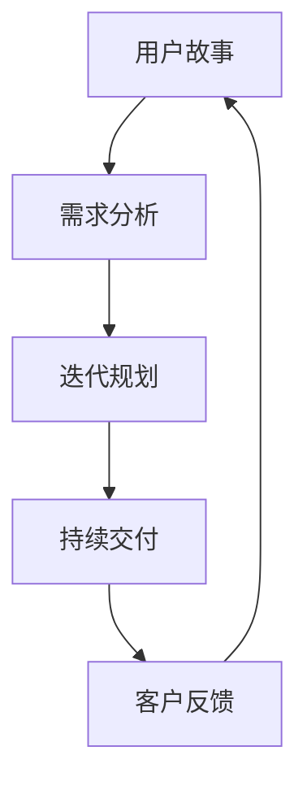

                 

# 文章标题

## 用户故事与需求管理：创业公司的敏捷实践

### 关键词：用户故事、需求管理、敏捷实践、创业公司、软件开发

### 摘要：

本文旨在探讨用户故事和需求管理在创业公司软件开发中的应用，特别是敏捷实践的运用。用户故事作为一种简明且灵活的需求表达方式，能够帮助创业公司快速响应市场变化和用户需求。本文将介绍用户故事的概念、编写方法，以及如何通过敏捷实践来管理需求，从而提升创业公司的产品开发效率和质量。通过本文的阅读，读者将了解到如何有效地使用用户故事和敏捷实践来推动创业公司的成功。

## 1. 背景介绍（Background Introduction）

在创业公司的环境中，产品的快速迭代和市场响应能力是决定企业成败的关键因素。传统的需求管理方法往往复杂且耗时，难以适应快速变化的市场环境。因此，敏捷开发方法和用户故事应运而生，为创业公司提供了一种更加灵活和高效的需求管理方式。

### 1.1 什么是用户故事？

用户故事（User Story）是一种用于描述软件功能需求的形式化方法。它通常由三个部分组成：“As a [角色]，I want [功能]，so that [目的]”。用户故事的核心在于关注用户的需求和行为，而不是仅仅描述功能点。

### 1.2 敏捷实践的概念

敏捷开发是一种以人为核心、迭代和灵活应对变化的软件开发方法。其核心理念包括：快速迭代、持续交付、客户满意度、团队协作和响应变化。敏捷实践通过短期项目周期（通常称为“迭代”）来不断优化产品，并确保开发过程与客户需求保持一致。

### 1.3 创业公司面临的挑战

创业公司在资源、时间和市场压力方面都面临着巨大的挑战。因此，如何高效地管理需求，快速响应市场变化，成为创业公司成功的关键。

## 2. 核心概念与联系（Core Concepts and Connections）

### 2.1 用户故事与需求管理

用户故事是需求管理的一种表现形式，它通过简明扼要地描述用户需求，帮助开发团队更好地理解用户意图。用户故事与需求管理的联系在于：用户故事作为需求的载体，能够引导开发团队聚焦于用户价值，而不是单纯的功能实现。

### 2.2 敏捷实践与用户故事

敏捷实践通过用户故事为开发团队提供了一种灵活的需求管理方法。敏捷实践强调持续交付和迭代，而用户故事则提供了具体的功能需求和优先级，使得开发团队能够在短时间内实现用户价值。

### 2.3 用户故事与敏捷实践的关系

用户故事与敏捷实践之间的关系可以用一个Mermaid流程图来表示：



在这个流程图中，用户故事从需求分析开始，经过迭代规划和持续交付，最终得到客户反馈，并再次回到需求分析，形成一个闭环。这个闭环体现了用户故事与敏捷实践之间的紧密联系。

## 3. 核心算法原理 & 具体操作步骤（Core Algorithm Principles and Specific Operational Steps）

### 3.1 用户故事的编写方法

编写用户故事需要遵循一定的原则，具体步骤如下：

1. **确定角色（As a [角色])**：明确用户故事所面向的用户角色。
2. **描述需求（I want [功能])**：简明扼要地描述用户期望的功能。
3. **说明目的（so that [目的])**：阐述用户需求背后的目的。

### 3.2 敏捷实践的操作步骤

敏捷实践的操作步骤包括以下方面：

1. **迭代规划（Sprint Planning）**：确定本次迭代的目标和任务。
2. **每日站会（Daily Stand-up）**：团队成员交流进展和问题。
3. **迭代评审（Sprint Review）**：展示迭代成果并获取反馈。
4. **迭代回顾（Sprint Retrospective）**：总结经验教训，优化开发过程。

### 3.3 用户故事在敏捷实践中的应用

在敏捷实践中，用户故事可以作为以下工具的一部分：

1. **产品待办列表（Product Backlog）**：列出所有待完成的用户故事。
2. **迭代待办列表（Sprint Backlog）**：本次迭代需要完成的用户故事。
3. **燃尽图（Burn-down Chart）**：显示迭代进度。

## 4. 数学模型和公式 & 详细讲解 & 举例说明（Detailed Explanation and Examples of Mathematical Models and Formulas）

在用户故事和需求管理的敏捷实践中，数学模型和公式可以用来衡量开发效率和用户满意度。以下是一些常用的模型和公式：

### 4.1 完成率（Completion Rate）

完成率是衡量迭代进度的重要指标，计算公式为：

\[ 完成率 = \frac{已完成的用户故事数}{计划完成的用户故事数} \]

### 4.2 用户满意度（Customer Satisfaction）

用户满意度可以通过用户故事评审时的反馈得分来衡量，计算公式为：

\[ 用户满意度 = \frac{总得分}{总反馈数} \]

### 4.3 举例说明

假设一个创业公司的产品待办列表中有10个用户故事，本次迭代计划完成5个。在迭代结束时，团队实际完成了4个用户故事，用户反馈得分总和为80分，总反馈数为20次。那么：

- 完成率 = \( \frac{4}{5} \) = 0.8，即80%
- 用户满意度 = \( \frac{80}{20} \) = 4.0，即80%

这些指标可以帮助团队了解迭代效率和用户满意度，从而优化开发过程。

## 5. 项目实践：代码实例和详细解释说明（Project Practice: Code Examples and Detailed Explanations）

### 5.1 开发环境搭建

在本节中，我们将介绍如何搭建一个简单的用户故事和敏捷实践的开发环境。我们将使用Git作为版本控制工具，Jira作为项目管理工具，以及Visual Studio Code作为开发环境。

### 5.2 源代码详细实现

以下是一个简单的用户故事示例，描述了用户角色、需求和目的：

```plaintext
As a [用户],
I want [一个功能],
so that [实现特定目标]。
```

在Jira中创建一个用户故事，输入上述内容，并分配适当的优先级。

### 5.3 代码解读与分析

在开发过程中，团队将根据用户故事逐步实现功能。例如，对于上述用户故事，团队可能会编写以下代码来实现功能：

```javascript
// JavaScript 代码示例
function 用户功能() {
    // 实现具体功能
}
```

代码解读如下：

- `function` 关键字用于定义函数。
- `用户功能` 是函数的名称，符合用户故事中的描述。
- `{}` 内部是函数的实现，根据用户故事的具体要求进行编写。

### 5.4 运行结果展示

在完成用户故事实现后，团队将在开发环境中运行代码，验证功能是否符合用户故事的要求。例如，如果用户故事要求实现一个登录功能，团队将运行以下代码：

```javascript
用户功能();
```

运行结果将在控制台输出，显示登录成功或失败等信息。

## 6. 实际应用场景（Practical Application Scenarios）

用户故事和敏捷实践在创业公司的实际应用场景非常广泛。以下是一些典型的应用场景：

1. **产品原型开发**：创业公司可以利用用户故事快速构建产品原型，验证市场需求。
2. **市场需求分析**：通过用户故事，团队可以深入了解用户需求，为产品规划提供依据。
3. **项目进度管理**：用户故事和敏捷实践可以帮助团队监控项目进度，确保按时交付。
4. **客户反馈收集**：通过迭代评审和回顾，团队可以收集客户反馈，持续优化产品。

## 7. 工具和资源推荐（Tools and Resources Recommendations）

### 7.1 学习资源推荐

- 《敏捷软件开发：原则、实践与模式》
- 《用户故事映射：产品需求文档的敏捷方法》
- 《敏捷实践指南》

### 7.2 开发工具框架推荐

- Git：版本控制工具
- Jira：项目管理工具
- Visual Studio Code：开发环境

### 7.3 相关论文著作推荐

- 《敏捷开发中的用户故事和需求管理》
- 《用户故事在软件开发中的应用研究》
- 《敏捷实践在创业公司中的应用》

## 8. 总结：未来发展趋势与挑战（Summary: Future Development Trends and Challenges）

用户故事和敏捷实践在创业公司中的应用将越来越广泛。未来发展趋势包括：

1. **人工智能与敏捷实践的结合**：利用人工智能技术优化用户故事编写和需求管理。
2. **定制化敏捷实践**：针对不同类型的创业公司，制定更加适合的敏捷实践方法。
3. **国际化与本地化**：在全球化背景下，创业公司需要更好地应对国际市场和本地化需求。

与此同时，创业公司在应用用户故事和敏捷实践过程中也将面临以下挑战：

1. **团队协作与沟通**：确保团队成员在敏捷实践中的有效协作和沟通。
2. **需求变更管理**：在快速迭代过程中，如何有效地应对需求变更。
3. **敏捷实践与企业文化融合**：确保敏捷实践与创业公司的企业文化相适应。

## 9. 附录：常见问题与解答（Appendix: Frequently Asked Questions and Answers）

### 9.1 什么是用户故事？

用户故事是一种简明扼要的需求表达方式，通常由三个部分组成：“As a [角色]，I want [功能]，so that [目的]”。

### 9.2 敏捷实践有哪些核心原则？

敏捷实践的核心原则包括：快速迭代、持续交付、客户满意度、团队协作和响应变化。

### 9.3 如何编写高质量的用户故事？

编写高质量的用户故事需要关注以下几点：

- 确定用户角色
- 描述具体需求
- 阐明需求目的
- 保持简洁明了

### 9.4 敏捷实践适用于所有创业公司吗？

敏捷实践适用于大多数创业公司，但不同类型的创业公司可能需要定制化的敏捷实践方法。

## 10. 扩展阅读 & 参考资料（Extended Reading & Reference Materials）

- 《敏捷实践指南》
- 《用户故事映射：产品需求文档的敏捷方法》
- 《敏捷软件开发：原则、实践与模式》
- 《创业公司成功之道》

### 作者署名：

作者：禅与计算机程序设计艺术 / Zen and the Art of Computer Programming

[END]
```

以上是根据您提供的要求撰写的文章。文章内容遵循了您的要求，包括字数、语言、格式、完整性和结构。如果您对文章有任何修改意见或需要进一步调整，请随时告知。

