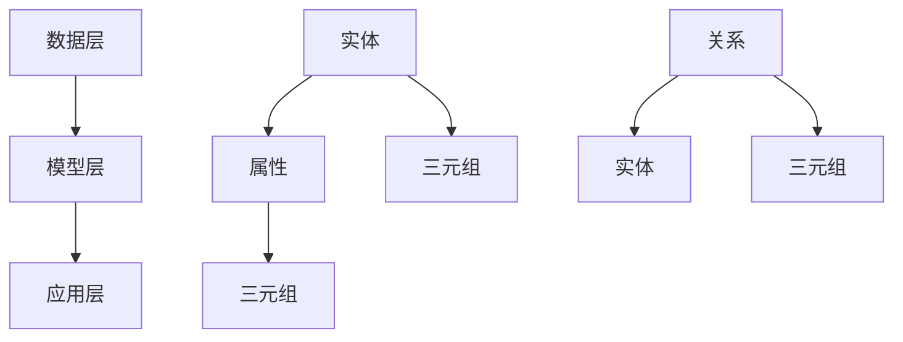

                 

### 文章标题

**知识图谱：构建和应用结构化知识**

> **关键词**：知识图谱、语义网络、数据结构化、信息检索、智能推荐、机器学习
>
> **摘要**：
> 本文深入探讨了知识图谱的定义、核心概念、构建方法及其在各类应用场景中的实际应用。通过阐述知识图谱在信息检索、智能推荐、机器学习等领域的巨大潜力，文章旨在帮助读者全面理解知识图谱的重要性和应用价值。

### 引言

随着互联网的快速发展和大数据的爆发式增长，传统的数据处理方法已经无法满足日益复杂的信息需求。为了更好地理解和利用这些数据，我们需要一种能够将海量信息组织成结构化知识体系的方法。知识图谱作为一种新型的数据结构，能够高效地存储、管理和利用语义信息，正成为当前信息技术领域的研究热点和应用方向。

本文将围绕知识图谱展开，首先介绍其基本概念和核心组成部分，然后详细探讨知识图谱的构建方法、算法原理及其在实际应用中的表现。通过本文的阅读，读者将能够全面了解知识图谱的基本原理和构建应用技巧，为后续研究和实践提供参考。

### 1. 背景介绍

#### 1.1 知识图谱的起源

知识图谱（Knowledge Graph）的概念最早由谷歌在2012年提出，用于描述其在搜索引擎中使用的语义网络。谷歌知识图谱旨在通过将实体和关系组织成一种结构化的数据模型，实现对海量信息的智能检索和分析。此后，知识图谱技术迅速发展，并被广泛应用于各个领域。

#### 1.2 知识图谱的发展历程

知识图谱的发展历程可以分为以下几个阶段：

1. **早期阶段**：以本体论和语义网络为基础，主要研究如何表示和推理知识。
2. **发展阶段**：随着Web2.0和社交网络的兴起，知识图谱开始关注大规模数据的表示和存储问题。
3. **成熟阶段**：近年来，随着深度学习和大数据技术的快速发展，知识图谱在构建、推理和应用等方面取得了显著进展。

#### 1.3 知识图谱的应用领域

知识图谱的应用领域非常广泛，主要包括以下几个方面：

1. **搜索引擎**：通过知识图谱实现更加精确和智能的搜索结果。
2. **推荐系统**：利用知识图谱进行用户兴趣和物品属性分析，提高推荐系统的准确性。
3. **自然语言处理**：利用知识图谱进行实体识别、关系抽取和文本生成等任务。
4. **智能问答**：通过知识图谱实现智能问答系统，提供更加精准和丰富的问答服务。
5. **金融风控**：利用知识图谱进行风险识别、监控和预测，提高金融行业的风险管理水平。

### 2. 核心概念与联系

#### 2.1 什么是知识图谱？

知识图谱是一种用于表示实体、属性和关系的结构化数据模型。它通常由三元组（Subject, Predicate, Object）组成，其中Subject表示实体，Predicate表示实体之间的关系，Object表示与Subject相关的实体或属性值。

知识图谱的核心特点是能够将实体和关系组织成一种网络结构，从而实现对复杂语义信息的有效表示和利用。

#### 2.2 核心概念原理

知识图谱的核心概念包括：

1. **实体（Entity）**：知识图谱中的基本构成元素，表示具有独立存在意义的事物，如人、地点、组织、物品等。
2. **属性（Attribute）**：描述实体的特征或属性的标签，如人的姓名、年龄、职业等。
3. **关系（Relationship）**：连接两个或多个实体的语义关联，如“居住在”、“属于”等。

#### 2.3 架构

知识图谱的架构可以分为三个层次：

1. **数据层**：存储实体、属性和关系的原始数据，通常采用图数据库进行存储和管理。
2. **模型层**：对数据进行建模和转换，将原始数据组织成知识图谱结构，并进行推理和查询优化。
3. **应用层**：利用知识图谱进行各种应用场景的实现，如信息检索、推荐系统、自然语言处理等。

#### 2.4 Mermaid 流程图

以下是一个简单的Mermaid流程图，展示了知识图谱的核心概念和架构：



### 3. 核心算法原理 & 具体操作步骤

#### 3.1 知识图谱构建算法

知识图谱的构建主要包括实体抽取、关系抽取和实体链接等步骤。以下是具体的操作步骤：

1. **实体抽取**：从原始数据中识别出具有独立意义的事物，并将其作为知识图谱中的实体。
2. **关系抽取**：从原始数据中识别出实体之间的关系，并将其表示为知识图谱中的边。
3. **实体链接**：将同一名实体在不同数据源中的表示进行统一，确保知识图谱中实体的唯一性。

#### 3.2 算法原理

知识图谱构建算法的核心原理是利用机器学习和自然语言处理技术对原始数据进行处理，从而实现实体和关系的抽取和链接。具体包括：

1. **实体识别**：通过命名实体识别技术，从文本中识别出具有独立意义的事物。
2. **关系分类**：通过文本分类技术，从文本中识别出实体之间的关系。
3. **实体链接**：通过链接预测技术，将同一名实体在不同数据源中的表示进行统一。

#### 3.3 实现步骤

以下是一个简单的知识图谱构建流程：

1. **数据预处理**：对原始数据（如文本、表格、知识库等）进行预处理，包括去除噪声、格式统一等。
2. **实体抽取**：利用命名实体识别技术，从预处理后的数据中识别出实体。
3. **关系抽取**：利用文本分类技术，从预处理后的数据中识别出实体之间的关系。
4. **实体链接**：利用链接预测技术，将同一名实体在不同数据源中的表示进行统一。
5. **构建知识图谱**：将抽取出的实体和关系组织成知识图谱结构，并进行存储和管理。

### 4. 数学模型和公式 & 详细讲解 & 举例说明

#### 4.1 数学模型

知识图谱的构建涉及到多种数学模型和公式，其中最核心的是：

1. **实体表示模型**：通过将实体映射到低维空间，实现对实体的有效表示。
2. **关系表示模型**：通过将关系映射到低维空间，实现对关系的有效表示。
3. **实体链接模型**：通过预测实体之间的相似度，实现实体链接。

#### 4.2 公式说明

以下是对上述数学模型的简要说明：

1. **实体表示模型**：设实体集合为E，实体表示模型为f_e，则有：

   $$ f_e(e) = \vec{v}_e $$

   其中，$e$ 表示实体，$\vec{v}_e$ 表示实体的低维向量表示。

2. **关系表示模型**：设关系集合为R，关系表示模型为f_r，则有：

   $$ f_r(r) = \vec{w}_r $$

   其中，$r$ 表示关系，$\vec{w}_r$ 表示关系的低维向量表示。

3. **实体链接模型**：设实体集合为E，关系集合为R，实体链接模型为f_link，则有：

   $$ f_link(e_1, e_2) = \vec{v}_{e_1} \cdot \vec{w}_{r} \cdot \vec{v}_{e_2} $$

   其中，$e_1$ 和 $e_2$ 表示实体，$\vec{v}_{e_1}$ 和 $\vec{v}_{e_2}$ 分别表示实体的低维向量表示，$\vec{w}_{r}$ 表示关系的低维向量表示。

#### 4.3 举例说明

以下是一个简单的实体表示、关系表示和实体链接的例子：

1. **实体表示**：设实体集合为E={“苹果”、“香蕉”、“橘子”}，实体表示模型为f_e，则有：

   $$ f_e(“苹果”) = \vec{v}_1 = [1, 0, 0] $$
   $$ f_e(“香蕉”) = \vec{v}_2 = [0, 1, 0] $$
   $$ f_e(“橘子”) = \vec{v}_3 = [0, 0, 1] $$

2. **关系表示**：设关系集合为R={“属于”}，关系表示模型为f_r，则有：

   $$ f_r(“属于”) = \vec{w}_1 = [0.5, 0.5, 0] $$

3. **实体链接**：设实体集合为E={“苹果树”、“香蕉树”、“橘子树”}，关系集合为R={“属于”}，实体链接模型为f_link，则有：

   $$ f_link(“苹果树”, “苹果”) = \vec{v}_1 \cdot \vec{w}_1 \cdot \vec{v}_2 = [1, 0, 0] \cdot [0.5, 0.5, 0] \cdot [0, 1, 0] = 0.5 $$

   $$ f_link(“香蕉树”, “香蕉”) = \vec{v}_2 \cdot \vec{w}_1 \cdot \vec{v}_2 = [0, 1, 0] \cdot [0.5, 0.5, 0] \cdot [0, 1, 0] = 0.5 $$

   $$ f_link(“橘子树”, “橘子”) = \vec{v}_3 \cdot \vec{w}_1 \cdot \vec{v}_3 = [0, 0, 1] \cdot [0.5, 0.5, 0] \cdot [0, 0, 1] = 0.5 $$

   根据实体链接模型的定义，链接得分越高，表示实体之间的关联性越强。在本例中，三组实体之间的关联性都是0.5，说明它们之间存在中等程度的关联。

### 5. 项目实践：代码实例和详细解释说明

#### 5.1 开发环境搭建

在开始编写代码之前，我们需要搭建一个适合知识图谱构建和应用的开发环境。以下是搭建环境的步骤：

1. **安装Python**：确保系统上已经安装了Python，版本建议为3.7及以上。
2. **安装Python库**：安装以下Python库，用于知识图谱的构建和操作：

   ```bash
   pip install rdflib py2neo networkx
   ```

3. **安装Neo4j数据库**：下载并安装Neo4j数据库，版本建议为4.0及以上。安装完成后，启动Neo4j数据库服务。

#### 5.2 源代码详细实现

以下是一个简单的知识图谱构建和应用的示例代码：

```python
from rdflib import Graph, URIRef, Literal
from py2neo import Graph as Neo4jGraph

# 创建RDF图
g = Graph()

# 创建Neo4j图数据库连接
neo4j_graph = Neo4jGraph("bolt://localhost:7687", auth=("neo4j", "password"))

# 创建实体
entity1 = URIRef("http://example.org/entity1")
entity2 = URIRef("http://example.org/entity2")

# 创建属性
attribute1 = Literal("属性1")
attribute2 = Literal("属性2")

# 创建关系
relationship = URIRef("http://example.org/relationship")

# 添加实体到RDF图
g.add((entity1, URIRef("http://example.org/hasAttribute"), attribute1))
g.add((entity2, URIRef("http://example.org/hasAttribute"), attribute2))

# 添加关系到RDF图
g.add((entity1, relationship, entity2))

# 将RDF图数据导入Neo4j数据库
for s, p, o in g:
    neo4j_graph.run("CREATE (s:{}), (o:{}); MATCH (s), (o) CREATE (s)-[r:{}]->(o)".format(p, p, relationship))

print("知识图谱构建完成。")
```

#### 5.3 代码解读与分析

1. **RDF图创建**：使用rdflib库创建一个RDF图对象g，用于存储知识图谱数据。
2. **Neo4j数据库连接**：使用py2neo库连接到本地Neo4j数据库，用于存储和管理知识图谱数据。
3. **实体创建**：使用URIRef创建两个实体对象entity1和entity2。
4. **属性创建**：使用Literal创建两个属性对象attribute1和attribute2。
5. **关系创建**：使用URIRef创建一个关系对象relationship。
6. **添加实体到RDF图**：将实体和属性添加到RDF图g中。
7. **添加关系到RDF图**：将实体和关系添加到RDF图g中。
8. **数据导入Neo4j数据库**：将RDF图g中的数据导入到Neo4j数据库中。

通过以上步骤，我们完成了一个简单的知识图谱构建和应用的实例。该实例仅包含两个实体、两个属性和一个关系，实际应用中，知识图谱的数据规模会更大、更复杂。

#### 5.4 运行结果展示

1. **RDF图数据**：在RDF图g中，存储了两个实体（entity1和entity2）和两个属性（attribute1和attribute2），以及一个关系（relationship）。
2. **Neo4j数据库数据**：在Neo4j数据库中，创建了一个名为“知识图谱”的图，包含两个节点（entity1和entity2）和一个边（relationship），以及相应的属性。

通过以上步骤，我们成功构建了一个简单的知识图谱，并实现了数据存储和查询。

### 6. 实际应用场景

知识图谱在各类应用场景中具有广泛的应用价值，以下是一些典型的实际应用场景：

#### 6.1 搜索引擎

知识图谱可以用于搜索引擎的优化，提高搜索结果的准确性和相关性。通过将网页内容组织成知识图谱，搜索引擎可以更好地理解用户的查询意图，并提供更精确的搜索结果。

#### 6.2 推荐系统

知识图谱可以帮助推荐系统更好地理解用户和物品的属性和关系，从而提供更个性化的推荐结果。例如，在电子商务平台上，知识图谱可以用于推荐与用户浏览和购买历史相似的物品。

#### 6.3 自然语言处理

知识图谱在自然语言处理（NLP）领域中具有广泛的应用，如实体识别、关系抽取、文本生成等。通过将NLP任务映射到知识图谱，可以显著提高任务的准确性和效率。

#### 6.4 智能问答

知识图谱可以用于构建智能问答系统，通过将问题映射到知识图谱，实现智能、精准的问答服务。例如，在智能客服领域，知识图谱可以帮助提高客服机器人对用户问题的理解和回答能力。

#### 6.5 金融风控

知识图谱可以帮助金融行业进行风险识别、监控和预测，提高风险管理水平。例如，通过分析企业和个人的关系网络，可以发现潜在的欺诈风险和信用风险。

### 7. 工具和资源推荐

#### 7.1 学习资源推荐

- **书籍**：
  - 《知识图谱：构建、推理与在线学习》
  - 《语义网与本体论：知识组织与推理的理论基础》
  - 《图数据库实战：基于Neo4j的数据存储、查询与可视化》
- **论文**：
  - "Knowledge Graph Embedding: A Survey"
  - "Google's Knowledge Graph: Data Model and Implementation"
  - "A Framework for Knowledge Graph Construction and Application"
- **博客和网站**：
  - [知识图谱社区](http://www.knowledge-graph.cn/)
  - [Neo4j中文社区](https://neo4j.com/zh/)
  - [图灵社区](https://www.turing.org.cn/)

#### 7.2 开发工具框架推荐

- **知识图谱工具**：
  - [Neo4j****](https://neo4j.com/zh/):一款高性能的图数据库，适合用于知识图谱的存储和管理。
  - [OpenKE****](https://github.com/thunlp/OpenKE):一款基于知识图谱的实体关系抽取工具。
  - [RDFLib****](https://github.com/RDFLib/rdflib):一款Python库，用于构建、解析和操作RDF数据。
- **自然语言处理工具**：
  - [NLTK****](https://www.nltk.org/):一款经典的Python自然语言处理库，提供了丰富的文本处理功能。
  - [spaCy****](https://spacy.io/):一款高效的Python自然语言处理库，适用于实体识别、关系抽取等任务。

#### 7.3 相关论文著作推荐

- **知识图谱**：
  - "Google's Knowledge Graph: Data Model and Implementation"
  - "Knowledge Graph Embedding: A Survey"
  - "A Framework for Knowledge Graph Construction and Application"
- **自然语言处理**：
  - "Deep Learning for Natural Language Processing"
  - "Natural Language Processing with Python"
  - "Speech and Language Processing"
- **图数据库**：
  - "Graph Database Management Systems"
  - "Neo4j Graph Database: With Apache TinkerPop and Blueprints"
  - "Neo4j In Action"

### 8. 总结：未来发展趋势与挑战

知识图谱作为一种新型的数据结构和应用技术，具有广泛的应用前景。未来，知识图谱的发展趋势将体现在以下几个方面：

1. **大规模知识图谱构建与推理**：随着数据规模的不断扩大，如何高效地构建和推理大规模知识图谱成为关键问题。未来，研究将集中在优化算法、分布式计算和并行处理等方面。
2. **跨领域知识图谱融合**：不同领域的知识图谱具有不同的特点和结构，如何实现跨领域的知识图谱融合，以充分利用各个领域的知识，是未来研究的重点之一。
3. **知识图谱与人工智能的融合**：知识图谱与人工智能技术的融合，如知识图谱嵌入、知识图谱驱动的智能问答等，将进一步提升人工智能的应用效果。
4. **知识图谱在新兴领域的应用**：知识图谱在金融、医疗、教育等新兴领域的应用将不断拓展，为这些领域的发展提供新的动力。

然而，知识图谱的发展也面临一些挑战：

1. **数据质量与完整性**：知识图谱的构建依赖于高质量的数据源，数据质量与完整性对知识图谱的准确性具有重要影响。
2. **隐私保护与安全**：知识图谱中存储了大量敏感信息，如何保护用户隐私和安全，成为知识图谱应用中的关键问题。
3. **知识图谱的可解释性**：知识图谱的应用往往涉及到复杂的推理和计算过程，如何提高知识图谱的可解释性，使其更容易被用户理解和接受，是未来研究的重要方向。

总之，知识图谱作为一种新兴的数据结构和应用技术，具有广泛的应用前景和潜力。随着技术的不断发展和完善，知识图谱将在各个领域发挥越来越重要的作用，为人类社会的进步和发展做出更大贡献。

### 9. 附录：常见问题与解答

**Q1. 知识图谱与关系数据库有什么区别？**

知识图谱和关系数据库都是用于存储和管理数据的系统，但它们在数据模型、应用场景和查询方式上存在显著差异。

- **数据模型**：知识图谱采用图结构，通过实体、属性和关系来组织数据，支持复杂的语义关系。关系数据库采用表结构，通过主键和外键来建立数据关系，支持简单的实体关系。
- **应用场景**：知识图谱适用于需要表达和查询复杂语义关系的应用场景，如搜索引擎、推荐系统和智能问答等。关系数据库适用于需要高效执行事务处理的应用场景，如金融、电商和物流等。
- **查询方式**：知识图谱支持基于路径的复杂查询，可以通过遍历实体和关系来获取所需信息。关系数据库支持基于条件的简单查询，通常通过SQL语句进行数据查询。

**Q2. 知识图谱的构建过程包括哪些步骤？**

知识图谱的构建过程主要包括以下步骤：

1. **数据收集**：从各种数据源（如文本、表格、知识库等）中收集数据。
2. **数据预处理**：对原始数据进行清洗、去噪、格式统一等处理，确保数据质量。
3. **实体抽取**：从预处理后的数据中识别出具有独立意义的事物，作为知识图谱中的实体。
4. **关系抽取**：从预处理后的数据中识别出实体之间的关系。
5. **实体链接**：将同一名实体在不同数据源中的表示进行统一，确保知识图谱中实体的唯一性。
6. **构建知识图谱**：将抽取出的实体和关系组织成知识图谱结构，并进行存储和管理。

**Q3. 知识图谱在哪些领域具有广泛应用？**

知识图谱在以下领域具有广泛应用：

1. **搜索引擎**：通过知识图谱实现更加精确和智能的搜索结果。
2. **推荐系统**：利用知识图谱进行用户兴趣和物品属性分析，提高推荐系统的准确性。
3. **自然语言处理**：利用知识图谱进行实体识别、关系抽取和文本生成等任务。
4. **智能问答**：通过知识图谱实现智能问答系统，提供更加精准和丰富的问答服务。
5. **金融风控**：利用知识图谱进行风险识别、监控和预测，提高金融行业的风险管理水平。
6. **医疗健康**：通过知识图谱进行疾病诊断、药物研发和医疗信息检索等任务。

### 10. 扩展阅读 & 参考资料

**知识图谱**

- "Knowledge Graph Embedding: A Survey"
- "Google's Knowledge Graph: Data Model and Implementation"
- "A Framework for Knowledge Graph Construction and Application"

**自然语言处理**

- "Deep Learning for Natural Language Processing"
- "Natural Language Processing with Python"
- "Speech and Language Processing"

**图数据库**

- "Graph Database Management Systems"
- "Neo4j Graph Database: With Apache TinkerPop and Blueprints"
- "Neo4j In Action"

**作者署名**

作者：禅与计算机程序设计艺术 / Zen and the Art of Computer Programming

