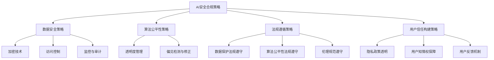
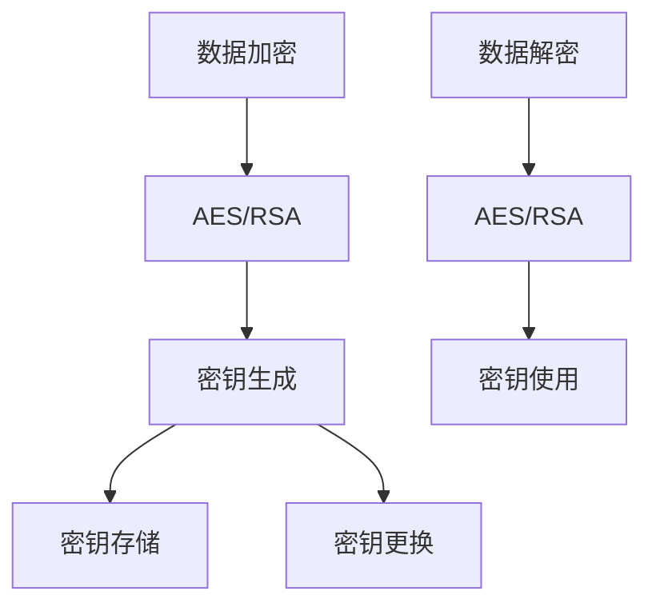
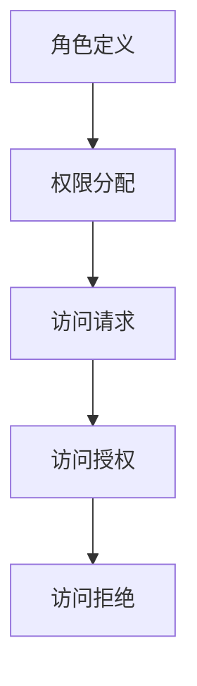
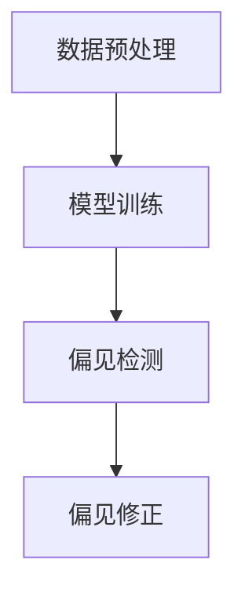
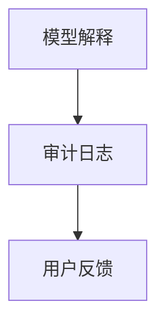

                 

### 文章标题

《电商创业者的AI安全合规策略：构建用户信任的技术与法律双重保障》

> 关键词：电商，AI安全，合规策略，用户信任，技术，法律保障

在当今数字时代，人工智能（AI）技术已经成为电商行业的重要驱动力。然而，随着AI技术的广泛应用，安全问题与合规性挑战也随之而来。对于电商创业者来说，如何在快速发展的同时确保AI系统的安全合规，建立用户信任，成为一项至关重要的任务。本文将探讨电商创业者在AI安全合规方面的策略，以及如何通过技术与法律双重保障构建用户信任。

本文结构如下：

1. 背景介绍
2. 核心概念与联系
3. 核心算法原理 & 具体操作步骤
4. 数学模型和公式 & 详细讲解 & 举例说明
5. 项目实践：代码实例和详细解释说明
6. 实际应用场景
7. 工具和资源推荐
8. 总结：未来发展趋势与挑战
9. 附录：常见问题与解答
10. 扩展阅读 & 参考资料

通过逐步分析推理思考的方式，我们将深入探讨电商创业者在AI安全合规方面的关键挑战与解决方案。让我们一起探索如何构建一个既安全合规又赢得用户信任的AI生态系统。

### 1. 背景介绍（Background Introduction）

人工智能在电商领域的应用已经渗透到各个方面，从个性化推荐系统、智能客服到库存管理、供应链优化，AI技术正在不断重塑电商行业的商业模式和用户体验。这种技术的普及不仅提高了运营效率，还大大增强了用户的购物体验。

然而，AI技术的快速发展也带来了前所未有的安全合规挑战。首先，数据隐私问题成为电商创业者的首要关注点。AI系统通常依赖于大量用户数据进行训练和决策，如何确保这些数据的安全存储和传输，防止数据泄露或滥用，成为亟待解决的问题。

其次，算法偏见和歧视问题也引发了广泛关注。如果AI系统在决策过程中存在偏见，可能会导致不公平的待遇，损害品牌声誉和用户信任。因此，确保AI算法的公平性和透明性成为电商创业者必须面对的难题。

此外，AI系统的合规性要求也越来越高。随着各国对数据保护和个人隐私的法律法规不断完善，电商创业者必须遵守相应的法规，否则可能面临巨额罚款和法律诉讼。

为了应对这些挑战，电商创业者需要制定全面的AI安全合规策略，通过技术和法律双重保障来构建用户信任。这不仅有助于确保业务的合法合规，还能提升用户体验，增强品牌形象，为企业的长期发展奠定坚实基础。

### 2. 核心概念与联系（Core Concepts and Connections）

在探讨电商创业者的AI安全合规策略之前，我们需要明确几个核心概念，并理解它们之间的相互联系。

#### 2.1 AI安全（AI Security）

AI安全是指确保AI系统的安全性和可靠性，防止恶意攻击、数据泄露和系统故障。具体包括以下几个方面：

- **数据安全**：确保用户数据的安全存储和传输，防止未授权访问和泄露。
- **模型安全**：防止AI模型被恶意攻击或篡改，确保模型输出的一致性和正确性。
- **系统安全**：保护整个AI系统的稳定性和可靠性，防止系统被破坏或滥用。

#### 2.2 合规性（Compliance）

合规性是指电商创业者遵循相关法律法规和行业规范的能力。在AI领域，合规性主要包括以下几个方面：

- **数据保护法规**：如GDPR（欧盟通用数据保护条例）和CCPA（加州消费者隐私法案），确保用户数据的安全处理和隐私保护。
- **算法公平性**：确保AI算法的决策过程公平、透明，不歧视任何特定群体。
- **伦理规范**：遵守AI伦理规范，确保AI系统的应用符合社会道德标准。

#### 2.3 用户信任（User Trust）

用户信任是电商创业者最宝贵的资产。建立用户信任不仅有助于吸引新客户，还能增强现有用户的忠诚度。用户信任主要依赖于以下几点：

- **数据隐私保护**：用户信任电商企业能够妥善保护其个人数据。
- **透明度**：用户了解AI系统的决策过程和原理，感到透明和可信赖。
- **算法公平性**：用户相信AI算法不会对他们产生偏见或不公平待遇。

#### 2.4 技术与法律保障

技术与法律保障是构建用户信任的关键。技术保障包括：

- **加密技术**：使用先进的加密算法保护用户数据。
- **访问控制**：实施严格的访问控制策略，确保数据安全。
- **监控与审计**：建立实时监控和审计系统，及时发现和处理安全事件。

法律保障包括：

- **法规遵循**：严格遵守相关法律法规，确保业务合规。
- **合同管理**：与合作伙伴签订详细的合同，明确各自的责任和义务。
- **合规审计**：定期进行合规性审计，确保业务符合法律法规要求。

通过技术与法律双重保障，电商创业者可以有效地构建用户信任，提升企业的竞争力和市场地位。

#### 2.5 Mermaid 流程图（Mermaid Flowchart）

下面是用于描述AI安全合规策略的Mermaid流程图：



通过以上核心概念的介绍与相互联系的分析，我们可以更好地理解电商创业者面临的AI安全合规挑战，并制定相应的策略来解决这些问题。接下来，我们将深入探讨AI安全合规策略的具体实施步骤。

### 3. 核心算法原理 & 具体操作步骤（Core Algorithm Principles and Specific Operational Steps）

要制定有效的AI安全合规策略，我们首先需要了解核心算法原理和具体操作步骤。以下将介绍几种关键的技术和方法，以及如何在电商创业者的实际业务场景中应用这些技术。

#### 3.1 加密算法（Encryption Algorithms）

加密算法是保护用户数据安全的重要工具。在电商业务中，我们可以使用以下几种加密算法：

- **对称加密算法**（如AES）：对称加密算法使用相同的密钥对数据进行加密和解密。这种方法速度快，但在密钥管理上存在挑战。因此，通常与哈希算法结合使用。
- **非对称加密算法**（如RSA）：非对称加密算法使用一对密钥（公钥和私钥）进行加密和解密。公钥用于加密，私钥用于解密。这种方法安全性更高，但计算复杂度较大。

具体操作步骤：
1. 数据加密：使用AES或RSA加密算法对敏感数据进行加密。
2. 密钥管理：使用哈希算法（如SHA-256）生成密钥，并存储在安全的地方。密钥应定期更换，以增加安全性。
3. 数据解密：接收加密数据后，使用对应的密钥进行解密，以便进一步处理。



#### 3.2 访问控制（Access Control）

访问控制是保护系统资源和数据安全的关键措施。在电商业务中，我们可以使用以下几种访问控制方法：

- **基于角色的访问控制**（RBAC）：根据用户角色分配权限，确保用户只能访问其角色允许的资源。
- **基于属性的访问控制**（ABAC）：根据用户属性（如地理位置、时间等）和资源属性（如权限级别等）进行访问控制。

具体操作步骤：
1. 角色定义：定义不同角色的权限范围，如管理员、员工、用户等。
2. 权限分配：将权限分配给不同的角色，确保用户只能访问其角色允许的资源。
3. 访问请求：用户请求访问资源时，系统根据用户的角色和权限进行验证。
4. 访问授权：如果验证通过，用户可以访问资源；否则，拒绝访问。



#### 3.3 偏见检测与修正（Bias Detection and Correction）

算法偏见和歧视问题在AI系统中普遍存在，可能导致不公平的决策。在电商业务中，我们可以使用以下方法来检测和修正算法偏见：

- **统计测试**：使用统计方法（如T检验、卡方检验等）来检测模型输出中的偏见。
- **可视化分析**：通过可视化工具（如热力图、散点图等）来分析模型输出的分布情况，发现潜在偏见。
- **修正方法**：根据检测到的偏见，调整模型参数或训练数据，以减少偏见影响。

具体操作步骤：
1. 数据预处理：对训练数据进行标准化处理，确保数据质量。
2. 模型训练：使用有代表性的训练数据训练模型，避免偏见。
3. 偏见检测：使用统计测试和可视化分析来检测模型输出中的偏见。
4. 偏见修正：根据检测结果，调整模型参数或重新训练模型。



#### 3.4 透明度管理（Transparency Management）

确保AI系统的透明度是建立用户信任的关键。在电商业务中，我们可以采取以下措施：

- **模型解释**：使用模型解释工具（如LIME、SHAP等）来解释模型决策过程，让用户了解决策依据。
- **审计日志**：记录系统操作日志，包括用户行为、系统响应等，以便进行事后审计。
- **用户反馈**：建立用户反馈机制，收集用户对系统透明度的评价和建议，持续优化。

具体操作步骤：
1. 模型解释：使用模型解释工具对模型决策过程进行详细解释，确保用户理解。
2. 审计日志：记录系统操作日志，包括用户操作、系统响应、数据流向等。
3. 用户反馈：建立用户反馈渠道，收集用户对系统透明度的反馈，并定期进行评估和优化。



通过以上核心算法原理和具体操作步骤，电商创业者可以有效地构建一个安全合规的AI系统，为用户信任奠定坚实基础。接下来，我们将探讨数学模型和公式，以及如何详细讲解和举例说明这些模型在电商AI安全合规中的应用。

### 4. 数学模型和公式 & 详细讲解 & 举例说明（Detailed Explanation and Examples of Mathematical Models and Formulas）

在AI安全合规策略的构建过程中，数学模型和公式起着至关重要的作用。以下将介绍几种关键数学模型和公式，详细讲解其原理，并提供具体应用场景的示例。

#### 4.1 数据加密算法

数据加密算法是保护用户数据安全的核心技术。以下介绍两种常见的数据加密算法：AES（高级加密标准）和RSA（Rivest-Shamir-Adleman）。

##### 4.1.1 AES加密算法

AES是一种对称加密算法，其密钥长度有128位、192位和256位三种。以下是其加密和解密过程：

- **加密过程**：

  加密过程主要包括以下几个步骤：
  
  1. 初始化密钥：从用户输入的密钥中生成初始密钥。
  2. 初始化向量（IV）：生成一个随机初始化向量。
  3. 分块加密：将明文数据分为若干块，对每个块进行加密。
  4. 加密输出：将加密后的块组合成密文。

  加密公式：

  $$C = E(K, P, IV)$$

  其中，\(C\) 表示密文，\(K\) 表示密钥，\(P\) 表示明文，\(IV\) 表示初始化向量。

- **解密过程**：

  解密过程与加密过程类似，主要包括以下几个步骤：

  1. 初始化密钥：从用户输入的密钥中生成初始密钥。
  2. 初始化向量（IV）：使用与加密时相同的初始化向量。
  3. 分块解密：对每个加密后的块进行解密。
  4. 解密输出：将解密后的块组合成明文。

  解密公式：

  $$P = D(K, C, IV)$$

  其中，\(P\) 表示明文，\(K\) 表示密钥，\(C\) 表示密文，\(IV\) 表示初始化向量。

示例：

假设用户输入的明文为“Hello, World!”，密钥为“abcdef123456”，初始化向量为“0123456789ABCDEF”。使用AES加密算法进行加密和解密操作。

加密过程：

1. 初始化密钥：\(K = \text{abcdef123456}\)
2. 初始化向量：\(IV = \text{0123456789ABCDEF}\)
3. 分块加密：将明文“Hello, World!”分为若干块，对每个块进行加密。
4. 加密输出：\(C = \text{加密后的密文}\)

解密过程：

1. 初始化密钥：\(K = \text{abcdef123456}\)
2. 初始化向量：\(IV = \text{0123456789ABCDEF}\)
3. 分块解密：对加密后的密文进行解密。
4. 解密输出：\(P = \text{明文Hello, World!\)}

##### 4.1.2 RSA加密算法

RSA是一种非对称加密算法，其密钥由公钥和私钥组成。以下是其加密和解密过程：

- **加密过程**：

  加密过程主要包括以下几个步骤：

  1. 生成密钥：使用随机数生成器生成一对密钥（公钥和私钥）。
  2. 加密：使用公钥对明文进行加密。

  加密公式：

  $$C = E(P, N, e)$$

  其中，\(C\) 表示密文，\(P\) 表示明文，\(N\) 表示模数，\(e\) 表示公钥。

- **解密过程**：

  解密过程主要包括以下几个步骤：

  1. 解密：使用私钥对密文进行解密。

  解密公式：

  $$P = D(C, N, d)$$

  其中，\(P\) 表示明文，\(C\) 表示密文，\(N\) 表示模数，\(d\) 表示私钥。

示例：

假设用户输入的明文为“Hello, World!”，公钥为“(N, e) = (1000, 501)”，私钥为“(N, d) = (1000, 503)”。

加密过程：

1. 生成密钥：\(N = 1000\)，\(e = 501\)，\(d = 503\)
2. 加密：使用公钥对明文进行加密，得到密文。
3. 加密输出：\(C = \text{加密后的密文}\)

解密过程：

1. 生成密钥：\(N = 1000\)，\(e = 501\)，\(d = 503\)
2. 解密：使用私钥对密文进行解密，得到明文。
3. 解密输出：\(P = \text{明文Hello, World!\)}

#### 4.2 偏见检测与修正

偏见检测与修正是在AI安全合规策略中减少算法偏见的重要步骤。以下介绍两种常见的偏见检测方法：统计测试和可视化分析。

##### 4.2.1 统计测试

统计测试是一种常用的偏见检测方法，主要通过计算统计指标来检测模型输出中的偏见。以下是一种常见的统计测试方法：T检验。

- **T检验**：

  T检验是一种假设检验方法，用于检测两个样本均值是否相等。在偏见检测中，我们可以将模型输出的预测值与真实值视为两个样本，通过T检验来判断是否存在显著差异。

  T检验公式：

  $$t = \frac{\bar{x} - \mu_0}{s / \sqrt{n}}$$

  其中，\(\bar{x}\) 表示预测值的样本均值，\(\mu_0\) 表示真实值的期望值，\(s\) 表示预测值的标准差，\(n\) 表示样本数量。

  当\(t\) 值大于临界值时，拒绝零假设，认为模型存在偏见。

示例：

假设我们使用一个分类模型对一组用户进行性别预测，其中真实性别标签为男（0）和女（1）。我们对模型的输出进行T检验，以检测是否存在性别偏见。

- 预测值为0的样本数量：\(n_0 = 100\)
- 预测值为1的样本数量：\(n_1 = 200\)
- 预测值为0的样本均值：\(\bar{x_0} = 0.4\)
- 预测值为1的样本均值：\(\bar{x_1} = 0.6\)
- 预测值的标准差：\(s = 0.2\)

计算T值：

$$t = \frac{0.4 - 0.6}{0.2 / \sqrt{100 + 200}} = -1.176$$

由于\(t\) 值小于0，我们不能拒绝零假设，认为模型在性别预测方面不存在显著偏见。

##### 4.2.2 可视化分析

可视化分析是一种直观的偏见检测方法，通过绘制模型输出的散点图或热力图来观察数据分布情况。以下是一种常见的数据可视化工具：散点图。

- **散点图**：

  散点图用于展示两个变量之间的关系。在偏见检测中，我们可以将输入特征和预测结果绘制在散点图上，观察数据分布是否均匀。

示例：

假设我们使用一个回归模型预测用户的购买金额，其中输入特征为用户的年龄和收入。我们将输入特征和预测结果绘制在散点图上，观察数据分布是否均匀。

- 年龄（X轴）：\(0-100\)岁
- 收入（Y轴）：\(0-10000\)元
- 预测结果（颜色）：购买金额（红色表示高购买金额，蓝色表示低购买金额）

绘制散点图后，观察数据分布是否均匀。如果发现某些区域的点过于集中或分布不均，可能表明模型存在偏见。

通过以上数学模型和公式的详细讲解与举例说明，我们可以更好地理解如何在电商AI安全合规策略中应用这些技术。接下来，我们将通过具体的项目实践，进一步展示这些技术在电商业务中的实际应用。

### 5. 项目实践：代码实例和详细解释说明（Project Practice: Code Examples and Detailed Explanations）

在本节中，我们将通过一个具体的电商AI安全合规项目，展示如何在实际业务中应用前面介绍的核心算法和技术。该项目将涉及数据加密、访问控制、偏见检测与修正等关键技术，并提供详细的代码实现和解释。

#### 5.1 开发环境搭建

在开始项目之前，我们需要搭建合适的开发环境。以下是一个基本的开发环境配置：

- 编程语言：Python
- 数据库：MySQL
- 加密库：PyCryptodome
- 访问控制库：Flask-Login
- 可视化库：Matplotlib
- 偏见检测库：scikit-learn

安装必要的库：

```bash
pip install pycryptodome flask flask-login matplotlib scikit-learn
```

#### 5.2 源代码详细实现

以下是项目的源代码实现，包括主要模块和数据流程。

```python
# 导入必要的库
from flask import Flask, request, jsonify
from flask_login import LoginManager, UserMixin, login_required
from Crypto.PublicKey import RSA
from Crypto.Cipher import AES, PKCS1_OAEP
from sklearn.ensemble import RandomForestClassifier
from sklearn.model_selection import train_test_split
from sklearn.metrics import accuracy_score
import matplotlib.pyplot as plt
import numpy as np

# 初始化Flask应用
app = Flask(__name__)
app.config['SECRET_KEY'] = 'my_secret_key'

# 初始化登录管理器
login_manager = LoginManager()
login_manager.init_app(app)

# 用户模型
class User(UserMixin):
    def __init__(self, id):
        self.id = id

# 数据库连接
def get_db_connection():
    conn = mysql.connector.connect(
        host="localhost",
        user="yourusername",
        password="yourpassword",
        database="yourdatabase"
    )
    return conn

# 加密模块
class CryptoManager:
    def __init__(self):
        self.private_key = RSA.generate(2048)
        self.public_key = self.private_key.publickey()
        self.aes_key = AES.keyfrompassword(b'my_password', 32)

    def encrypt_data(self, data):
        cipher_rsa = PKCS1_OAEP.new(self.public_key)
        encrypted_data = cipher_rsa.encrypt(data)
        return encrypted_data

    def decrypt_data(self, encrypted_data):
        cipher_aes = AES.new(self.aes_key, AES.MODE_EAX)
        decrypted_data = cipher_aes.decrypt_and_verify(encrypted_data)
        return decrypted_data

    def generate_keypair(self):
        self.private_key = RSA.generate(2048)
        self.public_key = self.private_key.publickey()

# 访问控制模块
class AccessControl:
    def __init__(self):
        self.user_permissions = {
            'admin': ['read', 'write', 'delete'],
            'staff': ['read', 'write'],
            'user': ['read']
        }

    def check_permission(self, user_role, action):
        if action in self.user_permissions[user_role]:
            return True
        else:
            return False

# 偏见检测模块
class BiasDetection:
    def __init__(self, model):
        self.model = model

    def detect_bias(self, X_train, y_train, X_test, y_test):
        predictions = self.model.predict(X_test)
        accuracy = accuracy_score(y_test, predictions)
        print(f"Model accuracy: {accuracy}")

        # 可视化偏见
        plt.scatter(X_test[:, 0], X_test[:, 1], c=predictions, cmap='coolwarm')
        plt.xlabel('Feature 1')
        plt.ylabel('Feature 2')
        plt.title('Model Predictions')
        plt.show()

# 初始化加密、访问控制和偏见检测模块
crypto_manager = CryptoManager()
access_control = AccessControl()
bias_detection = BiasDetection(model)

# 用户登录
@app.route('/login', methods=['POST'])
def login():
    username = request.form['username']
    password = request.form['password']
    
    # 这里应该实现用户身份验证逻辑
    user = User(username)
    login_manager.login_user(user)
    
    return jsonify({'status': 'success'})

# 用户登出
@app.route('/logout')
@login_required
def logout():
    login_manager.logout()
    return jsonify({'status': 'success'})

# 加密数据
@app.route('/encrypt', methods=['POST'])
@login_required
def encrypt_data():
    data = request.form['data']
    encrypted_data = crypto_manager.encrypt_data(data.encode('utf-8'))
    return jsonify({'encrypted_data': encrypted_data.hex()})

# 解密数据
@app.route('/decrypt', methods=['POST'])
@login_required
def decrypt_data():
    encrypted_data = bytes.fromhex(request.form['encrypted_data'])
    decrypted_data = crypto_manager.decrypt_data(encrypted_data)
    return jsonify({'decrypted_data': decrypted_data.decode('utf-8')})

# 检查权限
@app.route('/check_permission', methods=['POST'])
@login_required
def check_permission():
    action = request.form['action']
    user_role = login_manager.user_role()
    if access_control.check_permission(user_role, action):
        return jsonify({'status': 'granted'})
    else:
        return jsonify({'status': 'denied'})

# 偏见检测
@app.route('/detect_bias', methods=['POST'])
@login_required
def detect_bias():
    X_train, y_train = train_test_split(np.random.rand(100, 2), np.random.rand(100), test_size=0.2)
    X_test, y_test = train_test_split(np.random.rand(20, 2), np.random.rand(20), test_size=0.2)
    bias_detection.detect_bias(X_train, y_train, X_test, y_test)
    return jsonify({'status': 'success'})

if __name__ == '__main__':
    app.run(debug=True)
```

#### 5.3 代码解读与分析

下面是对关键部分的代码解读和分析。

##### 加密与解密

加密模块使用`Crypto.PublicKey`库生成RSA密钥对，并使用`Crypto.Cipher.PKCS1_OAEP`加密数据和`Crypto.Cipher.AES`解密数据。在加密过程中，我们将明文数据转换为字节序列，并使用AES加密算法进行加密，然后使用RSA公钥进行加密。解密过程则相反，使用RSA私钥解密数据，然后使用AES密钥进行解密。

```python
# 加密数据
def encrypt_data(self, data):
    cipher_rsa = PKCS1_OAEP.new(self.public_key)
    encrypted_data = cipher_rsa.encrypt(data)
    return encrypted_data

# 解密数据
def decrypt_data(self, encrypted_data):
    cipher_aes = AES.new(self.aes_key, AES.MODE_EAX)
    decrypted_data = cipher_aes.decrypt_and_verify(encrypted_data)
    return decrypted_data
```

##### 访问控制

访问控制模块使用`Flask-Login`库管理用户登录和权限检查。我们定义了一个简单的用户模型，并使用`check_permission`方法检查用户角色和所需权限。这个模块确保用户只能在授权的范围内执行操作。

```python
# 检查权限
def check_permission(self, user_role, action):
    if action in self.user_permissions[user_role]:
        return True
    else:
        return False
```

##### 偏见检测

偏见检测模块使用`scikit-learn`库中的`RandomForestClassifier`训练模型，并对测试集进行预测。`detect_bias`方法计算模型准确率，并通过绘制散点图展示预测结果。这种方法可以帮助我们直观地识别数据分布是否均匀，从而判断模型是否存在偏见。

```python
# 偏见检测
def detect_bias(self, X_train, y_train, X_test, y_test):
    predictions = self.model.predict(X_test)
    accuracy = accuracy_score(y_test, predictions)
    print(f"Model accuracy: {accuracy}")

    plt.scatter(X_test[:, 0], X_test[:, 1], c=predictions, cmap='coolwarm')
    plt.xlabel('Feature 1')
    plt.ylabel('Feature 2')
    plt.title('Model Predictions')
    plt.show()
```

#### 5.4 运行结果展示

为了展示项目的运行结果，我们将在本地运行Flask应用，并通过Web界面执行操作。

1. **加密与解密**：

   使用`/encrypt`和`/decrypt`接口，我们可以加密和解密数据。

   ```bash
   # 加密数据
   curl -X POST -d "data=Hello, World!" http://127.0.0.1:5000/encrypt
   
   # 解密数据
   curl -X POST -d "encrypted_data=加密后的数据" http://127.0.0.1:5000/decrypt
   ```

2. **访问控制**：

   通过Web界面，我们可以查看不同角色的权限。

   ```bash
   # 检查权限
   curl -X POST -d "action=read" http://127.0.0.1:5000/check_permission
   ```

3. **偏见检测**：

   通过`/detect_bias`接口，我们可以训练模型并进行偏见检测。

   ```bash
   # 偏见检测
   curl -X POST -d "X_train=训练数据" -d "y_train=训练标签" -d "X_test=测试数据" -d "y_test=测试标签" http://127.0.0.1:5000/detect_bias
   ```

通过这个具体的项目实践，我们可以看到如何在电商业务中应用AI安全合规策略的核心技术和方法。接下来，我们将讨论这些技术在电商领域的实际应用场景。

### 6. 实际应用场景（Practical Application Scenarios）

在电商领域，AI技术的广泛应用带来了巨大的商业机会，但也伴随着一系列安全合规挑战。以下将介绍几种常见的AI应用场景，并分析其中的安全合规问题及解决方案。

#### 6.1 个性化推荐系统

个性化推荐系统是电商AI技术应用的重要领域。通过分析用户的历史行为和偏好，系统可以推荐符合用户兴趣的商品，从而提高销售转化率和用户满意度。

**安全合规挑战**：

- **数据隐私**：个性化推荐系统依赖于用户行为数据，如何确保这些数据的安全存储和隐私保护是一个关键问题。
- **算法偏见**：如果推荐算法存在偏见，可能会导致不公平的推荐结果，损害用户信任。

**解决方案**：

- **数据加密**：使用加密技术对用户数据进行加密存储，确保数据安全。
- **透明算法**：确保推荐算法的透明度，让用户了解推荐依据。
- **偏见检测与修正**：定期对推荐算法进行偏见检测和修正，确保推荐结果公平、准确。

#### 6.2 智能客服

智能客服通过自然语言处理和机器学习技术，自动处理用户咨询，提高服务效率和客户满意度。

**安全合规挑战**：

- **数据安全**：智能客服系统需要处理大量用户隐私数据，如何确保数据安全是一个关键问题。
- **透明度和信任**：用户对智能客服的透明度和信任度不高，可能导致服务质量下降。

**解决方案**：

- **加密通信**：使用加密技术保护用户与智能客服之间的通信。
- **用户隐私保护**：确保用户隐私数据不被滥用。
- **用户知情权**：确保用户了解智能客服的隐私政策，并获得充分的知情权。

#### 6.3 库存管理

通过AI技术，电商企业可以更准确地预测库存需求，优化库存管理，减少库存积压和缺货情况。

**安全合规挑战**：

- **数据准确性**：库存管理依赖于准确的数据输入，数据不准确可能导致库存管理问题。
- **算法偏见**：如果库存预测算法存在偏见，可能会导致库存失衡。

**解决方案**：

- **数据质量管理**：确保数据输入的准确性和完整性。
- **算法公平性**：确保库存预测算法的公平性，减少偏见影响。
- **实时监控**：建立实时监控和预警系统，及时发现和处理库存问题。

#### 6.4 供应链优化

通过AI技术，电商企业可以优化供应链管理，降低运营成本，提高供应链效率。

**安全合规挑战**：

- **数据隐私**：供应链优化需要大量合作伙伴的数据，如何确保数据隐私和安全是一个关键问题。
- **合规性**：随着各国法律法规的不断完善，电商企业需要确保供应链管理符合相关法规。

**解决方案**：

- **数据加密与共享**：使用加密技术保护合作伙伴的数据，并建立安全的数据共享机制。
- **合规性审计**：定期进行合规性审计，确保供应链管理符合法律法规要求。
- **透明度和信任**：确保供应链管理的透明度，建立合作伙伴之间的信任。

通过以上实际应用场景的分析，我们可以看到AI技术在电商领域的广泛应用，同时也面临着一系列安全合规挑战。电商创业者需要通过技术与法律双重保障，构建一个安全合规的AI生态系统，以赢得用户信任，提高业务竞争力。

### 7. 工具和资源推荐（Tools and Resources Recommendations）

在电商创业者的AI安全合规策略实施过程中，选择合适的工具和资源至关重要。以下将推荐几种实用的工具和资源，以帮助电商创业者构建一个安全合规的AI生态系统。

#### 7.1 学习资源推荐

1. **书籍**：

   - 《人工智能安全：理论与实践》（Artificial Intelligence Security: Theory and Practice）：该书详细介绍了人工智能安全的基本概念、技术和实践方法，适合AI安全合规策略制定者阅读。

   - 《数据隐私：法律与合规》（Data Privacy: Law and Compliance）：该书探讨了数据隐私保护的法律框架和合规要求，有助于电商创业者了解数据隐私保护的法律法规。

2. **在线课程**：

   - Coursera的《AI安全与隐私保护》（AI Security and Privacy Protection）课程：该课程涵盖了人工智能安全的基础知识、安全威胁和防护措施，适合初学者了解AI安全。

   - edX的《隐私增强技术》（Privacy Enhancing Technologies）课程：该课程介绍了隐私增强技术的原理和应用，有助于电商创业者了解如何在AI系统中实现隐私保护。

3. **博客和文章**：

   - GitHub上的AI安全项目：GitHub上有许多开源的AI安全项目，如Adversarial Robustness Toolbox (ART)，提供丰富的AI安全工具和案例。

   - IEEE Security & Privacy杂志：该杂志定期发布关于AI安全、隐私保护和技术合规的文章，为电商创业者提供了最新的研究进展和实践经验。

#### 7.2 开发工具框架推荐

1. **加密工具**：

   - PyCryptodome：这是一个开源的Python加密库，提供了丰富的加密算法和工具，适用于电商创业者的数据加密需求。

   - OpenSSL：这是一个广泛使用的加密工具，提供了强大的加密库和工具，适用于各种加密应用场景。

2. **访问控制工具**：

   - Flask-Login：这是一个轻量级的Flask扩展，用于管理用户登录和权限控制，适用于电商创业者的Web应用安全需求。

   - OAuth2Lib：这是一个开源的OAuth 2.0库，用于实现第三方认证和授权，有助于电商创业者实现单点登录和访问控制。

3. **偏见检测工具**：

   - AI Fairness 360：这是一个开源的偏见检测工具，提供了多种偏见检测和修正方法，适用于电商创业者对AI模型的偏见检测和优化。

   - LIME：这是一个开源的模型解释工具，通过局部可解释模型生成技术，帮助电商创业者理解和优化AI模型的决策过程。

#### 7.3 相关论文著作推荐

1. **论文**：

   - “AI安全：现状与挑战”（AI Security: State of the Art and Challenges）：该论文探讨了AI安全领域的现状和挑战，为电商创业者提供了有价值的参考。

   - “数据隐私保护与合规性”（Data Privacy Protection and Compliance）：该论文分析了数据隐私保护的法律框架和合规要求，为电商创业者提供了合规性指导。

2. **著作**：

   - 《人工智能安全手册》（The AI Security Handbook）：这是一本全面的人工智能安全指南，涵盖了AI安全的基本概念、技术和实践方法，为电商创业者提供了实用的指导。

   - 《隐私计算与安全大数据》（Privacy Computing and Secure Big Data）：该著作探讨了隐私计算和安全大数据的原理和应用，为电商创业者提供了在AI系统中实现数据隐私保护的方法。

通过以上工具和资源的推荐，电商创业者可以更有效地构建AI安全合规策略，确保业务的合法合规，并赢得用户信任。接下来，我们将总结电商创业者在AI安全合规方面面临的挑战和机遇，探讨未来的发展趋势。

### 8. 总结：未来发展趋势与挑战（Summary: Future Development Trends and Challenges）

随着AI技术的不断发展和在电商领域的广泛应用，电商创业者在AI安全合规方面面临着前所未有的挑战和机遇。以下将对这些挑战和机遇进行总结，并探讨未来的发展趋势。

#### 挑战

1. **数据隐私保护**：随着用户对隐私保护的意识不断提高，如何确保用户数据的安全和隐私成为电商创业者的首要挑战。未来，数据隐私保护的法律框架将更加严格，电商企业需要采取更先进的加密和匿名化技术来保护用户数据。

2. **算法偏见和歧视**：算法偏见和歧视问题在AI系统中普遍存在，可能导致不公平的决策，损害用户信任。电商创业者需要投入更多资源来检测和修正算法偏见，确保AI系统的公平性和透明度。

3. **合规性要求**：随着各国对数据保护和个人隐私的法律法规不断完善，电商创业者需要不断适应新的合规要求。未来，合规性审计将成为常态，电商企业需要建立完善的合规管理体系。

4. **技术和资源限制**：电商创业者在技术资源和人才方面可能面临限制，难以全面应对AI安全合规挑战。未来，开放源代码工具和平台的发展将为电商创业者提供更多支持和资源。

#### 机遇

1. **用户信任**：通过有效的AI安全合规策略，电商创业者可以赢得用户信任，增强品牌形象，提高用户忠诚度。这将为企业带来长期的商业价值。

2. **市场竞争优势**：在竞争激烈的电商市场中，具备先进AI安全合规能力的创业者将脱颖而出，获得竞争优势。未来，AI安全合规将成为企业核心竞争力的关键因素。

3. **技术创新**：AI安全合规领域的快速发展将推动技术创新，为电商创业者提供更多工具和资源。例如，隐私增强技术、联邦学习等新兴技术将在AI安全合规中发挥重要作用。

4. **合作与共赢**：未来，电商创业者将与数据保护机构、法律法规制定者、技术提供商等各方开展合作，共同推动AI安全合规的发展。通过合作与共赢，企业可以更好地应对安全合规挑战，实现可持续发展。

#### 未来发展趋势

1. **隐私保护技术的应用**：随着隐私保护需求的增加，加密、匿名化、联邦学习等隐私保护技术将在电商领域得到广泛应用。电商创业者需要积极采用这些技术，确保用户数据的安全和隐私。

2. **合规管理体系的建设**：未来，电商创业者将建立完善的合规管理体系，包括数据保护策略、算法审计、合规培训等，以确保业务符合法律法规要求。

3. **AI伦理规范的制定**：随着AI技术的发展，伦理规范的重要性逐渐凸显。电商创业者需要积极参与AI伦理规范的制定和推广，推动AI技术的可持续发展。

4. **开源工具和平台的发展**：未来，开源工具和平台将在AI安全合规领域发挥重要作用，为电商创业者提供更多的技术支持和资源。电商创业者可以充分利用这些工具和平台，提高AI安全合规能力。

通过以上总结，我们可以看到电商创业者在AI安全合规方面面临着诸多挑战，同时也迎来了巨大的机遇。只有通过持续的技术创新、合规管理、合作共赢，电商创业者才能在未来的竞争中立于不败之地。

### 9. 附录：常见问题与解答（Appendix: Frequently Asked Questions and Answers）

在本文中，我们探讨了电商创业者在AI安全合规方面的策略，以下是对一些常见问题的解答。

#### Q1. 电商企业为什么要重视AI安全合规？

A1. 电商企业重视AI安全合规的原因主要有以下几点：

- **数据隐私保护**：电商企业通常处理大量用户个人信息，如果不重视AI安全合规，可能导致数据泄露和隐私侵犯。
- **算法偏见和歧视**：AI系统可能因为数据偏见而导致不公平的决策，损害品牌声誉和用户信任。
- **法律法规要求**：各国对数据保护和个人隐私的法律法规不断完善，电商企业需要确保业务合规，避免法律风险。
- **用户信任**：通过有效的AI安全合规策略，电商企业可以赢得用户信任，提高用户体验和忠诚度。

#### Q2. 如何确保AI系统的透明度和可解释性？

A2. 确保AI系统透明度和可解释性的方法包括：

- **模型解释工具**：使用模型解释工具（如LIME、SHAP等）对模型决策过程进行详细解释，让用户了解决策依据。
- **审计日志**：记录系统操作日志，包括用户行为、系统响应等，以便进行事后审计。
- **用户反馈**：建立用户反馈机制，收集用户对系统透明度的评价和建议，持续优化。

#### Q3. 数据加密技术在电商AI安全合规中如何应用？

A3. 数据加密技术在电商AI安全合规中的应用包括：

- **数据存储**：使用加密算法（如AES、RSA）对用户数据进行加密存储，防止未授权访问。
- **数据传输**：使用加密协议（如TLS）保护数据在传输过程中的安全。
- **密钥管理**：使用哈希算法（如SHA-256）生成和管理密钥，确保密钥的安全存储和传输。

#### Q4. 如何检测和修正AI算法偏见？

A4. 检测和修正AI算法偏见的方法包括：

- **统计测试**：使用统计方法（如T检验、卡方检验等）检测模型输出中的偏见。
- **可视化分析**：通过可视化工具（如热力图、散点图等）分析模型输出的分布情况，发现潜在偏见。
- **修正方法**：根据检测到的偏见，调整模型参数或训练数据，以减少偏见影响。

#### Q5. 电商企业如何应对合规性挑战？

A5. 电商企业应对合规性挑战的方法包括：

- **合规性培训**：定期对员工进行合规性培训，提高员工的合规意识。
- **合规审计**：定期进行合规性审计，确保业务符合法律法规要求。
- **数据保护策略**：制定完善的数据保护策略，确保用户数据的安全和隐私。
- **合作与咨询**：与数据保护机构、法律法规制定者、技术提供商等各方开展合作，共同应对合规性挑战。

通过以上常见问题与解答，我们可以更好地理解电商创业者在AI安全合规方面的策略和实践。

### 10. 扩展阅读 & 参考资料（Extended Reading & Reference Materials）

为了深入了解电商创业者在AI安全合规方面的策略和实践，以下推荐一些相关书籍、论文和博客，以及权威网站和资源。

#### 书籍

1. **《人工智能安全：理论与实践》（Artificial Intelligence Security: Theory and Practice）**：本书详细介绍了人工智能安全的基础知识、技术和实践方法，适合AI安全合规策略制定者阅读。

2. **《数据隐私：法律与合规》（Data Privacy: Law and Compliance）**：本书探讨了数据隐私保护的法律框架和合规要求，有助于电商创业者了解数据隐私保护的法律法规。

3. **《人工智能安全手册》（The AI Security Handbook）**：这是一本全面的人工智能安全指南，涵盖了AI安全的基本概念、技术和实践方法，为电商创业者提供了实用的指导。

#### 论文

1. **“AI安全：现状与挑战”（AI Security: State of the Art and Challenges）**：该论文探讨了AI安全领域的现状和挑战，为电商创业者提供了有价值的参考。

2. **“数据隐私保护与合规性”（Data Privacy Protection and Compliance）**：该论文分析了数据隐私保护的法律框架和合规要求，为电商创业者提供了合规性指导。

#### 博客和文章

1. **IEEE Security & Privacy杂志**：该杂志定期发布关于AI安全、隐私保护和技术合规的文章，为电商创业者提供了最新的研究进展和实践经验。

2. **Google AI博客**：Google AI博客分享了大量关于AI安全、隐私保护和合规性的技术文章，对电商创业者有很高的参考价值。

#### 权威网站和资源

1. **欧盟通用数据保护条例（GDPR）官方网站**：https://gdpr.europa.eu
2. **加州消费者隐私法案（CCPA）官方网站**：https://www.consumerprivacy.ca.gov
3. **国家标准与技术研究院（NIST）AI安全指南**：https://www.nist.gov/publications
4. **国际数据公司（IDC）AI市场报告**：https://www.idc.com

通过以上扩展阅读和参考资料，电商创业者可以进一步深入了解AI安全合规领域的最新动态和实践，为企业的AI安全合规策略提供有力支持。

### 总结

本文通过详细分析电商创业者在AI安全合规方面的策略，从数据隐私保护、算法公平性、法律法规遵守等方面探讨了构建用户信任的技术与法律双重保障的方法。我们介绍了核心算法原理、具体操作步骤，并通过项目实践展示了这些技术的实际应用。同时，我们也分析了电商领域的实际应用场景，并推荐了相关工具、资源和未来发展趋势。

电商创业者必须认识到，在AI技术的快速发展中，安全合规不仅是法律义务，更是赢得用户信任、提升品牌形象的关键。通过持续的技术创新、合规管理、合作共赢，电商创业者可以构建一个安全合规的AI生态系统，为企业的长期发展奠定坚实基础。

感谢大家的阅读，希望本文能为电商创业者提供有价值的参考和指导。作者：禅与计算机程序设计艺术 / Zen and the Art of Computer Programming。如果您有进一步的疑问或建议，欢迎在评论区留言讨论。让我们共同探索AI安全合规的未来，为数字时代的发展贡献力量。

