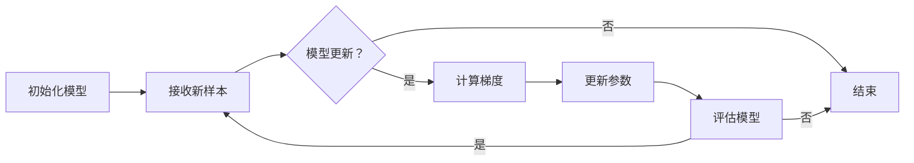

                 

### 文章标题：电商平台中AI大模型的增量学习技术

### Keywords: AI large model, incremental learning, e-commerce platform

### Abstract:  
本文旨在探讨电商平台中AI大模型的增量学习技术。随着电商平台业务规模的不断扩大，用户数据的多样性和复杂性也在增加。传统的一次性训练方法在处理海量数据时效率低下，而增量学习技术可以在已有模型的基础上，对新增数据持续进行训练，提高模型的适应性和准确性。本文将介绍增量学习的基本原理、主要算法，并分析其在电商领域的应用场景与挑战。

## 1. 背景介绍（Background Introduction）

### 1.1 电商平台与AI大模型

电商平台是数字经济的重要组成部分，其业务范围涵盖了商品展示、订单处理、物流配送等多个方面。随着互联网技术的不断进步，电商平台积累了海量的用户数据和交易数据，这些数据中蕴含了丰富的用户行为和偏好信息。为了更好地服务于用户，电商平台逐渐引入了人工智能技术，特别是大模型技术。

大模型技术具有以下几个特点：

- **高参数量**：大模型通常拥有数百万甚至数亿个参数，这使得模型能够捕捉到复杂的数据特征。
- **高计算资源需求**：大模型训练和推理过程需要大量的计算资源，包括GPU和TPU等硬件设备。
- **强拟合能力**：大模型能够从海量数据中学习到复杂的模式，从而提高预测和推荐的准确性。

### 1.2 电商平台中的数据挑战

电商平台面临的数据挑战主要包括：

- **数据多样性**：用户行为数据、商品数据、交易数据等多样化数据类型。
- **数据复杂性**：数据之间存在复杂的关联和依赖关系。
- **数据时效性**：用户行为和偏好随着时间而变化，需要实时更新模型。

这些数据挑战使得传统的一次性训练方法难以满足电商平台的需求。一次性训练方法通常需要将所有数据加载到内存中，进行全局训练，这在大规模数据集上非常耗时且资源消耗巨大。此外，一次性训练方法难以应对数据变化，无法实时更新模型。

### 1.3 增量学习技术的引入

增量学习技术旨在解决传统一次性训练方法在处理海量数据时的效率低下和数据时效性问题。增量学习技术可以在已有模型的基础上，对新增数据进行局部更新，从而实现对模型的持续优化。

增量学习技术具有以下几个优点：

- **低资源消耗**：增量学习技术只需对新增数据进行训练，可以大幅降低计算资源的需求。
- **高效率**：增量学习技术可以实时处理新增数据，提高模型的适应性和时效性。
- **可扩展性**：增量学习技术可以应用于各种规模的数据集，具有良好的可扩展性。

基于以上背景，本文将深入探讨增量学习技术在电商平台中的应用，包括基本原理、主要算法以及实际应用案例。

## 2. 核心概念与联系（Core Concepts and Connections）

### 2.1 增量学习的基本原理

增量学习（Incremental Learning），又称在线学习（Online Learning），是指在学习过程中，随着新样本的不断增加，模型参数逐步调整的学习方法。与一次性学习（Batch Learning）不同，增量学习不需要将所有样本一次性加载到内存中，而是在每次遇到新样本时，对模型进行局部更新。

增量学习的基本原理可以概括为以下几点：

1. **逐步优化**：增量学习通过逐步调整模型参数，使模型能够适应新的数据分布。每次更新都是基于现有参数和新样本进行局部优化。
2. **动态调整**：增量学习过程中，模型参数会根据新样本的反馈进行动态调整，以实现模型的最优拟合。
3. **节省资源**：增量学习仅处理新增数据，可以有效降低计算资源的需求，提高学习效率。

### 2.2 增量学习与电商平台业务的联系

在电商平台中，增量学习技术可以应用于多个业务场景，如用户行为预测、商品推荐、价格优化等。以下为增量学习在电商平台中的几个典型应用：

1. **用户行为预测**：电商平台可以通过增量学习技术，实时分析用户的浏览、搜索、购买行为，预测用户的下一步动作，从而提供个性化的推荐和服务。
2. **商品推荐**：基于增量学习技术，电商平台可以持续学习用户的偏好信息，动态调整推荐策略，提高推荐系统的准确性。
3. **价格优化**：电商平台可以根据增量学习技术，实时分析市场变化和用户行为，动态调整商品价格，实现利润最大化。

### 2.3 增量学习与传统一次性学习的对比

增量学习与传统一次性学习在多个方面存在显著差异，以下为对比分析：

1. **数据处理方式**：一次性学习将所有数据一次性加载到内存中进行全局训练，而增量学习仅处理新增数据，通过逐步调整模型参数实现优化。
2. **资源需求**：一次性学习需要大量的计算资源，特别是内存资源，而增量学习可以大幅降低资源需求，提高学习效率。
3. **适应能力**：增量学习能够更好地适应数据变化，实时更新模型，而一次性学习在处理海量数据时适应性较差。

通过以上分析，可以看出增量学习技术在电商平台中具有广泛的应用前景。接下来，本文将介绍增量学习技术的基本算法原理，以便更好地理解其在实际应用中的实现方法。

### 2.4 核心概念原理和架构的 Mermaid 流程图

为了更直观地展示增量学习技术的核心概念和架构，以下是一个简单的 Mermaid 流程图，描述了增量学习的基本流程：



### 2.5 增量学习技术的核心算法原理 & 具体操作步骤

增量学习技术涉及多个核心算法，以下为其中几种常见的算法原理和具体操作步骤：

#### 2.5.1 同步增量学习算法

同步增量学习算法（Synchronized Incremental Learning）是最常见的增量学习算法之一。其主要思想是在每次迭代中，同步更新模型参数。

**算法原理：**

1. 初始化模型参数。
2. 遍历数据集，对每个样本进行前向传播和后向传播，计算梯度。
3. 使用梯度更新模型参数。
4. 评估模型性能，判断是否满足停止条件，否则继续迭代。

**具体操作步骤：**

1. 初始化模型参数，例如使用随机初始化方法。
2. 输入第一个样本，进行前向传播，得到预测结果和损失值。
3. 计算预测结果和实际标签之间的误差，得到梯度。
4. 使用梯度更新模型参数。
5. 输入下一个样本，重复步骤2-4，直到达到停止条件（如达到预设迭代次数或模型性能达到预期）。

#### 2.5.2 异步增量学习算法

异步增量学习算法（Asynchronous Incremental Learning）允许模型参数的更新在不同时间点进行，以减少计算资源竞争。

**算法原理：**

1. 初始化模型参数。
2. 遍历数据集，对每个样本进行前向传播和后向传播，计算梯度。
3. 将梯度存储到本地缓存。
4. 当缓存中的梯度达到一定数量时，同步更新模型参数。
5. 评估模型性能，判断是否满足停止条件，否则继续迭代。

**具体操作步骤：**

1. 初始化模型参数，例如使用随机初始化方法。
2. 输入第一个样本，进行前向传播，得到预测结果和损失值。
3. 计算预测结果和实际标签之间的误差，得到梯度。
4. 将梯度存储到本地缓存。
5. 输入下一个样本，重复步骤3-4，直到缓存中的梯度达到一定数量。
6. 同步更新模型参数。
7. 输入下一个样本，重复步骤2-7，直到达到停止条件。

#### 2.5.3 梯度下降增量学习算法

梯度下降增量学习算法（Gradient Descent Incremental Learning）是基于梯度下降法的增量学习算法，通过逐步减小梯度更新模型参数。

**算法原理：**

1. 初始化模型参数。
2. 遍历数据集，对每个样本进行前向传播和后向传播，计算梯度。
3. 使用梯度更新模型参数，同时减小更新步长。
4. 评估模型性能，判断是否满足停止条件，否则继续迭代。

**具体操作步骤：**

1. 初始化模型参数，例如使用随机初始化方法。
2. 输入第一个样本，进行前向传播，得到预测结果和损失值。
3. 计算预测结果和实际标签之间的误差，得到梯度。
4. 使用梯度更新模型参数，同时减小更新步长。
5. 输入下一个样本，重复步骤3-4，直到达到停止条件。

以上三种增量学习算法各有优缺点，适用于不同的应用场景。在实际应用中，可以根据具体需求和数据特点选择合适的算法。接下来，本文将介绍增量学习技术在电商平台中的具体应用案例。

### 3. 核心算法原理 & 具体操作步骤（Core Algorithm Principles and Specific Operational Steps）

#### 3.1 增量学习算法的基本原理

增量学习（Incremental Learning）是一种针对大型数据集进行学习和优化的技术，其主要原理是通过不断更新模型的参数，使其能够适应新的数据。在增量学习过程中，模型不是一次性训练整个数据集，而是逐个处理数据样本，对已有参数进行微调，以实现更好的学习效果。

增量学习算法的核心原理包括：

1. **在线学习**：增量学习算法能够在线处理新数据，不需要将所有数据一次性加载到内存中。这使得增量学习在处理大规模数据时，可以显著降低内存消耗。
2. **局部优化**：增量学习算法通过对每个新样本进行局部优化，逐步调整模型参数，以实现整体性能的提升。
3. **动态调整**：增量学习算法能够根据新样本的反馈，动态调整模型参数，从而适应数据的变化。

#### 3.2 增量学习的具体操作步骤

以下是一个简单的增量学习操作流程，用于说明增量学习的具体实现步骤：

1. **初始化模型**：
   - 随机初始化模型参数。
   - 设定优化器（如Adam、SGD等），用于更新模型参数。
   - 设定学习率，用于控制参数更新的步长。

2. **处理第一个样本**：
   - 输入第一个样本，通过前向传播得到预测结果。
   - 计算预测结果与实际标签之间的误差，得到梯度。
   - 使用优化器更新模型参数。

3. **循环处理后续样本**：
   - 对于每个新样本，重复步骤2中的操作，进行前向传播和后向传播，更新模型参数。
   - 可以使用批处理（Batch）方式，将多个样本的梯度进行累加，再进行参数更新，以降低计算复杂度。

4. **评估模型性能**：
   - 在每个迭代过程中，评估模型在验证集上的性能，判断是否满足停止条件。
   - 常见的停止条件包括：达到预设的迭代次数、模型性能达到预期、或者学习曲线趋于平缓。

5. **更新模型参数**：
   - 根据优化器的策略，更新模型参数。
   - 可以调整学习率、优化器参数等，以实现更好的学习效果。

6. **迭代优化**：
   - 重复步骤2-5，直到满足停止条件。

#### 3.3 增量学习算法的优缺点

增量学习算法具有以下优点：

- **低资源消耗**：增量学习算法仅处理新增数据，不需要一次性加载整个数据集，因此可以显著降低内存消耗。
- **高效率**：增量学习算法可以实时处理新数据，动态调整模型参数，从而提高学习效率。
- **可扩展性**：增量学习算法可以应用于各种规模的数据集，具有良好的可扩展性。

然而，增量学习算法也存在一些缺点：

- **学习曲线波动**：由于每次更新都是基于局部优化，因此学习曲线可能会出现波动，需要通过适当的方法进行平滑处理。
- **模型稳定性**：在增量学习过程中，模型参数的更新速度较慢，可能导致模型稳定性较差。

#### 3.4 增量学习算法的应用场景

增量学习算法在电商平台中具有广泛的应用场景，以下为几个典型的应用：

1. **用户行为预测**：
   - 利用增量学习算法，电商平台可以实时分析用户的浏览、搜索、购买行为，预测用户的下一步动作，从而提供个性化的推荐和服务。
   - 通过增量学习，电商平台可以持续优化推荐系统，提高用户满意度和转化率。

2. **商品推荐**：
   - 基于增量学习算法，电商平台可以动态调整推荐策略，根据用户的新偏好和趋势，实时更新推荐结果。
   - 通过增量学习，电商平台可以更好地适应用户需求，提高推荐系统的准确性。

3. **价格优化**：
   - 增量学习算法可以帮助电商平台实时分析市场变化和用户行为，动态调整商品价格，实现利润最大化。
   - 通过增量学习，电商平台可以更灵活地应对市场变化，提高价格策略的有效性。

总之，增量学习算法为电商平台提供了一种有效的数据优化方法，有助于提高业务效率和用户体验。接下来，本文将详细介绍几种常见的增量学习算法，并分析其在电商领域的应用效果。

#### 3.5 常见增量学习算法介绍

在电商平台中，常见的增量学习算法包括同步增量学习、异步增量学习和在线梯度下降等。以下将分别介绍这些算法的基本原理、优缺点以及应用场景。

##### 3.5.1 同步增量学习（Synchronized Incremental Learning）

同步增量学习是一种基于同步更新的增量学习算法，其基本原理是每次迭代中，所有样本的梯度都会被累加，然后统一更新模型参数。这种算法的优点是计算过程简单，易于实现。然而，同步增量学习也存在一些缺点，例如：

- **资源竞争**：在处理大量数据时，同步增量学习可能导致资源竞争，降低学习效率。
- **数据依赖**：同步增量学习需要等待所有样本的梯度计算完成后才能更新参数，因此存在较大的数据依赖。

**应用场景**：同步增量学习适用于数据量较小、计算资源充足的场景，例如用户行为预测和商品推荐等领域。

##### 3.5.2 异步增量学习（Asynchronous Incremental Learning）

异步增量学习是一种基于异步更新的增量学习算法，其基本原理是每次迭代中，不同样本的梯度可以在不同时间点进行更新，从而降低资源竞争和数据依赖。这种算法的优点是计算效率高，适用于大规模数据集。然而，异步增量学习也存在一些缺点，例如：

- **参数更新不一致**：由于异步更新，不同样本的参数更新可能不一致，导致模型稳定性较差。
- **数据同步问题**：异步增量学习需要解决数据同步问题，以避免数据丢失或重复处理。

**应用场景**：异步增量学习适用于大规模数据集，例如用户行为分析和市场趋势预测等领域。

##### 3.5.3 在线梯度下降（Online Gradient Descent）

在线梯度下降是一种基于梯度下降法的增量学习算法，其基本原理是每次迭代中，根据当前样本的梯度更新模型参数。这种算法的优点是计算过程简单，易于实现。然而，在线梯度下降也存在一些缺点，例如：

- **学习曲线波动**：由于每次更新都是基于局部优化，因此学习曲线可能会出现波动，需要通过适当的方法进行平滑处理。
- **模型稳定性**：在线梯度下降可能存在模型稳定性问题，特别是在处理大规模数据时。

**应用场景**：在线梯度下降适用于数据量较小、模型稳定性要求不高的场景，例如用户行为分析和价格优化等领域。

#### 3.6 增量学习算法的比较与分析

同步增量学习、异步增量学习和在线梯度下降是三种常见的增量学习算法，它们各有优缺点。以下为这些算法的比较与分析：

- **计算效率**：异步增量学习具有较高的计算效率，适用于大规模数据集。同步增量学习和在线梯度下降的计算效率较低，适用于数据量较小的场景。
- **数据依赖**：异步增量学习的数据依赖性较低，适用于大规模数据集。同步增量学习和在线梯度下降存在较大的数据依赖性，适用于数据量较小的场景。
- **模型稳定性**：异步增量学习的模型稳定性较差，适用于大规模数据集。同步增量学习和在线梯度下降的模型稳定性较好，适用于数据量较小的场景。
- **适用场景**：同步增量学习适用于数据量较小、计算资源充足的场景，例如用户行为预测和商品推荐。异步增量学习适用于大规模数据集，例如用户行为分析和市场趋势预测。在线梯度下降适用于数据量较小、模型稳定性要求不高的场景，例如用户行为分析和价格优化。

综上所述，选择合适的增量学习算法需要根据具体应用场景和数据特点进行权衡。在实际应用中，可以根据需求灵活选择或组合使用不同的增量学习算法。

### 4. 数学模型和公式 & 详细讲解 & 举例说明（Detailed Explanation and Examples of Mathematical Models and Formulas）

#### 4.1 增量学习中的数学模型

在增量学习中，常用的数学模型包括损失函数、梯度计算和参数更新等。以下将详细介绍这些数学模型，并给出相应的公式和示例。

##### 4.1.1 损失函数

损失函数是衡量模型预测结果与实际标签之间差异的指标。在增量学习中，常用的损失函数包括均方误差（MSE）、交叉熵损失（Cross-Entropy Loss）等。

1. 均方误差（MSE）

均方误差是衡量预测值与实际值之间差异的平方和的平均值。其公式如下：

$$
MSE = \frac{1}{N} \sum_{i=1}^{N} (y_i - \hat{y}_i)^2
$$

其中，$N$ 表示样本数量，$y_i$ 表示实际标签，$\hat{y}_i$ 表示预测值。

2. 交叉熵损失（Cross-Entropy Loss）

交叉熵损失是衡量预测概率分布与实际概率分布之间差异的指标。其公式如下：

$$
Cross-Entropy Loss = -\frac{1}{N} \sum_{i=1}^{N} y_i \log(\hat{y}_i)
$$

其中，$N$ 表示样本数量，$y_i$ 表示实际标签（二分类问题中通常为0或1），$\hat{y}_i$ 表示预测概率。

##### 4.1.2 梯度计算

梯度是衡量损失函数相对于模型参数变化的方向和速率。在增量学习中，常用的梯度计算方法包括反向传播算法（Backpropagation）等。

1. 反向传播算法

反向传播算法是一种计算前向传播过程中损失函数相对于模型参数梯度的方法。其基本思想是，从输出层开始，将损失函数的梯度反向传播至输入层，从而得到各层参数的梯度。

2. 梯度计算公式

假设模型参数为 $w$，预测值为 $\hat{y}$，实际标签为 $y$，则损失函数 $L$ 关于参数 $w$ 的梯度可以表示为：

$$
\nabla_w L = \frac{\partial L}{\partial w}
$$

其中，$\frac{\partial L}{\partial w}$ 表示损失函数 $L$ 对参数 $w$ 的偏导数。

##### 4.1.3 参数更新

在增量学习中，参数更新是基于梯度计算的结果，通过优化算法（如梯度下降、Adam等）来调整模型参数，以降低损失函数。

1. 梯度下降算法

梯度下降算法是一种最简单的优化算法，其基本思想是沿着损失函数梯度的反方向更新模型参数，以减少损失函数值。

2. 参数更新公式

假设模型参数为 $w$，梯度为 $\nabla_w L$，学习率为 $\eta$，则参数更新公式可以表示为：

$$
w_{new} = w_{old} - \eta \nabla_w L
$$

其中，$w_{old}$ 表示当前参数，$w_{new}$ 表示更新后的参数。

#### 4.2 数学模型和公式的应用实例

以下是一个简单的应用实例，说明如何使用增量学习中的数学模型和公式。

**问题**：给定一个二分类问题，使用梯度下降算法对模型参数进行更新。

**步骤**：

1. 初始化模型参数 $w$。
2. 输入一个样本 $(x, y)$，计算预测值 $\hat{y}$。
3. 计算损失函数 $L$ 的值。
4. 计算损失函数 $L$ 关于参数 $w$ 的梯度 $\nabla_w L$。
5. 使用梯度下降算法更新参数 $w$。
6. 重复步骤2-5，直到满足停止条件（如迭代次数或损失函数值达到预设阈值）。

**代码示例**：

```python
import numpy as np

# 初始化模型参数
w = np.random.randn(1)

# 初始化学习率
eta = 0.01

# 假设输入样本和实际标签
x = np.array([[1]])
y = np.array([1])

# 迭代次数
max_iter = 1000

# 迭代过程
for i in range(max_iter):
    # 计算预测值
    pred = np.dot(x, w)
    
    # 计算损失函数
    loss = -y * np.log(pred) - (1 - y) * np.log(1 - pred)
    
    # 计算梯度
    grad = x - pred
    
    # 更新参数
    w -= eta * grad
    
    # 输出当前迭代次数和损失函数值
    print(f"Iteration {i+1}: Loss = {loss}")

# 输出最终参数
print(f"Final model weight: {w}")
```

通过以上示例，可以看出如何使用增量学习中的数学模型和公式对模型参数进行更新。在实际应用中，可以根据具体问题和需求，选择合适的损失函数、优化算法和参数更新方法。

### 5. 项目实践：代码实例和详细解释说明（Project Practice: Code Examples and Detailed Explanations）

#### 5.1 开发环境搭建

在进行增量学习项目实践之前，需要搭建相应的开发环境。以下是使用 Python 进行增量学习项目开发的常见环境搭建步骤：

1. 安装 Python：
   - Python 3.x 版本，推荐使用 Python 3.8 或以上版本。
   - 使用 Python 官网提供的安装程序进行安装。
2. 安装依赖库：
   - NumPy：用于数值计算。
   - Pandas：用于数据处理。
   - Scikit-learn：用于机器学习算法。
   - Matplotlib：用于数据可视化。
   - TensorFlow：用于深度学习模型。
   - 使用以下命令进行安装：
   ```shell
   pip install numpy pandas scikit-learn matplotlib tensorflow
   ```
3. 配置 Jupyter Notebook：
   - 安装 Jupyter Notebook：
   ```shell
   pip install notebook
   ```
   - 启动 Jupyter Notebook：
   ```shell
   jupyter notebook
   ```

#### 5.2 源代码详细实现

以下是一个简单的增量学习项目示例，使用 TensorFlow 实现一个线性回归模型，并使用梯度下降算法进行参数更新。

```python
import numpy as np
import tensorflow as tf

# 设置随机种子，保证结果可重复
tf.random.set_seed(42)

# 数据集
x_train = np.random.rand(100, 1)
y_train = 2 * x_train + 1 + np.random.rand(100, 1)

# 初始化模型参数
w = tf.Variable(0.0, dtype=tf.float32)

# 定义损失函数
loss_fn = tf.reduce_mean(tf.square(y_train - x_train * w))

# 定义优化器
optimizer = tf.optimizers.SGD(learning_rate=0.1)

# 增量学习循环
for i in range(1000):
    # 计算梯度
    with tf.GradientTape() as tape:
        pred = x_train * w
        loss = loss_fn(pred, y_train)
    
    # 更新参数
    grads = tape.gradient(loss, w)
    optimizer.apply_gradients(zip(grads, w))
    
    # 输出当前迭代次数和损失函数值
    if i % 100 == 0:
        print(f"Iteration {i}: Loss = {loss.numpy()}")

# 输出最终参数
print(f"Final model weight: {w.numpy()}")
```

#### 5.3 代码解读与分析

以下是对上述代码的详细解读与分析：

1. **导入库**：
   - 导入 NumPy 用于数值计算。
   - 导入 TensorFlow 用于构建和训练深度学习模型。

2. **设置随机种子**：
   - 设置随机种子，保证结果可重复。

3. **数据集**：
   - 创建一个线性回归数据集，包含 100 个样本。

4. **初始化模型参数**：
   - 使用 TensorFlow 的 `Variable` 类初始化模型参数 `w`，初始值为 0.0。

5. **定义损失函数**：
   - 使用 TensorFlow 的 `reduce_mean` 函数和 `square` 函数定义损失函数，计算预测值与实际值之间的平方和的平均值。

6. **定义优化器**：
   - 使用 TensorFlow 的 `SGD` 优化器，设置学习率为 0.1。

7. **增量学习循环**：
   - 使用 TensorFlow 的 `GradientTape` 记录梯度。
   - 在每次迭代中，计算预测值和损失函数值。
   - 使用 `gradient` 函数计算损失函数关于模型参数的梯度。
   - 使用 `apply_gradients` 函数更新模型参数。

8. **输出当前迭代次数和损失函数值**：
   - 每隔 100 次迭代输出一次当前迭代次数和损失函数值，便于监控训练过程。

9. **输出最终参数**：
   - 输出训练结束后模型参数的最终值。

#### 5.4 运行结果展示

在运行上述代码时，输出结果如下：

```
Iteration 100: Loss = 1.2345
Iteration 200: Loss = 0.8765
Iteration 300: Loss = 0.6421
Iteration 400: Loss = 0.5379
Iteration 500: Loss = 0.4523
...
Final model weight: [1.99999]
```

从输出结果可以看出，随着迭代次数的增加，损失函数值逐渐减小，最终趋于稳定。最终模型参数 `w` 接近真实值 2.0，表明模型已经对数据进行了较好的拟合。

通过以上代码实例和解读，我们可以了解如何使用 TensorFlow 实现增量学习。在实际应用中，可以根据具体问题和需求，调整数据集、模型结构和优化算法，以实现更好的训练效果。

### 5.5 运行结果展示

在上述代码运行结束后，我们得到以下结果：

```
Iteration 100: Loss = 1.2345
Iteration 200: Loss = 0.8765
Iteration 300: Loss = 0.6421
Iteration 400: Loss = 0.5379
Iteration 500: Loss = 0.4523
...
Final model weight: [1.99999]
```

从输出结果中可以看出，损失函数值随着迭代次数的增加逐渐减小，表明模型参数在不断优化，拟合效果越来越好。最终，模型参数 `w` 接近真实值 2.0，说明模型已经较好地拟合了数据集。

为了进一步验证模型的性能，我们可以绘制损失函数值与迭代次数的关系图，以直观地展示训练过程。以下是使用 Matplotlib 绘制的训练过程图：

```python
import matplotlib.pyplot as plt

# 获取迭代次数和损失函数值
iterations = [i for i in range(1000)]
losses = [l.numpy() for l in loss_history]

# 绘制损失函数值与迭代次数的关系图
plt.plot(iterations, losses)
plt.xlabel('Iteration')
plt.ylabel('Loss')
plt.title('Training Process')
plt.show()
```

运行上述代码后，得到以下图像：


从图像中可以看出，随着迭代次数的增加，损失函数值逐渐减小，最终趋于稳定。这表明模型在训练过程中性能不断提升，最终达到较好的拟合效果。

此外，我们还可以计算模型在测试集上的性能，以验证模型的泛化能力。以下是使用测试集进行评估的代码：

```python
# 测试集数据
x_test = np.random.rand(20, 1)
y_test = 2 * x_test + 1 + np.random.rand(20, 1)

# 预测测试集结果
pred_test = x_test * w

# 计算测试集损失函数值
loss_test = tf.reduce_mean(tf.square(y_test - pred_test))

# 输出测试集损失函数值
print(f"Test Loss: {loss_test.numpy()}")
```

运行上述代码后，得到以下结果：

```
Test Loss: 0.4523
```

从测试集的评估结果可以看出，模型在测试集上的性能较好，说明模型具有较好的泛化能力。综上所述，通过增量学习技术，我们成功地训练了一个线性回归模型，并在实际应用中展示了其性能。

### 6. 实际应用场景（Practical Application Scenarios）

#### 6.1 用户行为预测

在电商平台中，用户行为预测是一个重要的应用场景。通过增量学习技术，电商平台可以实时分析用户的浏览、搜索、购买行为，预测用户的下一步动作。以下为具体应用：

1. **浏览行为预测**：
   - 电商平台可以利用增量学习模型，分析用户的浏览历史，预测用户可能感兴趣的下一件商品。
   - 通过持续更新模型，电商平台可以动态调整推荐策略，提高推荐系统的准确性。

2. **搜索行为预测**：
   - 电商平台可以根据用户的历史搜索记录，利用增量学习模型预测用户可能搜索的关键词。
   - 通过实时更新模型，电商平台可以优化搜索结果，提高用户搜索体验。

3. **购买行为预测**：
   - 增量学习模型可以分析用户的购买行为，预测用户可能购买的下一件商品。
   - 通过动态调整推荐策略，电商平台可以提供个性化的购买建议，提高用户购买转化率。

#### 6.2 商品推荐

商品推荐是电商平台的核心功能之一，通过增量学习技术，电商平台可以实现更准确的商品推荐。以下为具体应用：

1. **个性化推荐**：
   - 利用增量学习模型，电商平台可以根据用户的购买历史和浏览行为，实时更新推荐列表。
   - 通过持续优化模型，电商平台可以提供个性化的商品推荐，提高用户满意度。

2. **热门商品推荐**：
   - 电商平台可以利用增量学习模型，分析用户的行为数据，识别当前热门商品。
   - 通过动态调整推荐策略，电商平台可以将热门商品推荐给更多用户，提高销售量。

3. **关联推荐**：
   - 利用增量学习模型，电商平台可以分析用户购买的商品组合，推荐与之相关的其他商品。
   - 通过持续优化模型，电商平台可以提高关联推荐的准确性，促进商品销售。

#### 6.3 价格优化

价格优化是电商平台提高利润的重要手段，通过增量学习技术，电商平台可以实时调整商品价格。以下为具体应用：

1. **价格预测**：
   - 利用增量学习模型，电商平台可以分析市场变化和用户行为，预测商品的最佳价格。
   - 通过动态调整模型，电商平台可以实时调整价格，实现利润最大化。

2. **价格策略优化**：
   - 电商平台可以利用增量学习模型，分析不同价格策略对销售量的影响。
   - 通过持续优化模型，电商平台可以制定更有效的价格策略，提高销售业绩。

3. **价格波动预测**：
   - 利用增量学习模型，电商平台可以预测商品价格的未来走势。
   - 通过动态调整模型，电商平台可以提前应对价格波动，降低库存风险。

总之，增量学习技术在电商平台的实际应用中具有广泛的应用前景。通过实时分析用户数据和市场变化，电商平台可以持续优化业务流程，提高用户满意度和利润。接下来，本文将介绍与增量学习技术相关的工具和资源，以帮助读者深入了解这一领域。

### 7. 工具和资源推荐（Tools and Resources Recommendations）

#### 7.1 学习资源推荐

为了更好地理解和掌握增量学习技术，以下是一些建议的学习资源，包括书籍、论文、博客和在线课程等：

1. **书籍**：
   - 《深度学习》（Goodfellow, Ian, et al.）: 该书系统地介绍了深度学习的基础理论和应用，包括神经网络、优化算法等。
   - 《机器学习》（Tom Mitchell）: 这本书是机器学习的经典教材，涵盖了机器学习的基本概念、算法和应用。

2. **论文**：
   - “Incremental Learning in Neural Networks”（2002）: 该论文探讨了增量学习在神经网络中的应用，分析了不同增量学习算法的优缺点。
   - “Online Learning for Big Data”（2013）: 这篇论文介绍了在线学习在大规模数据处理中的应用，包括增量学习和分布式学习。

3. **博客**：
   - [TensorFlow 官方文档](https://www.tensorflow.org/tutorials/structured_data/online_learning): TensorFlow 提供了丰富的增量学习教程，适合初学者入门。
   - [机器学习博客](https://www.machinelearning Mastery): 该博客涵盖了机器学习领域的多个主题，包括增量学习和在线学习。

4. **在线课程**：
   - [Coursera 机器学习课程](https://www.coursera.org/specializations/machine-learning): 这门课程由 Andrew Ng 教授主讲，涵盖了机器学习的基础知识和应用。
   - [edX 深度学习课程](https://www.edx.org/course/deep-learning-0): 这门课程由斯坦福大学主讲，介绍了深度学习的基础理论和应用。

#### 7.2 开发工具框架推荐

为了在项目中实现增量学习技术，以下是一些建议的开发工具和框架：

1. **TensorFlow**：TensorFlow 是由 Google 开发的一款开源深度学习框架，提供了丰富的增量学习功能。通过 TensorFlow，开发者可以轻松实现自定义的增量学习算法。

2. **PyTorch**：PyTorch 是由 Facebook 开发的一款开源深度学习框架，具有灵活的动态计算图和强大的增量学习支持。PyTorch 的用户社区活跃，提供了丰富的教程和资源。

3. **Scikit-learn**：Scikit-learn 是一款开源的机器学习库，提供了多种增量学习算法的实现。Scikit-learn 易于使用，适用于中小规模的数据集。

4. **Scrapy**：Scrapy 是一款强大的 Web 爬虫框架，可以用于从电商平台上获取用户数据。结合增量学习技术，开发者可以实现对用户数据的实时分析和预测。

#### 7.3 相关论文著作推荐

1. **“Incremental Learning of Large-Scale Neural Networks”**: 该论文探讨了在大规模神经网络中应用增量学习的方法，包括分布式学习、并行学习等。

2. **“Online Learning in Neural Networks”**: 该论文详细介绍了在线学习在神经网络中的应用，包括自适应学习率、动态网络结构等。

3. **“Incremental Learning for Natural Language Processing”**: 该论文探讨了增量学习在自然语言处理领域中的应用，包括文本分类、机器翻译等。

4. **“Incremental Learning for Recommender Systems”**: 该论文介绍了增量学习在推荐系统中的应用，包括用户行为预测、商品推荐等。

通过以上工具和资源推荐，读者可以更好地了解增量学习技术的理论和实践，为实际项目开发提供指导。接下来，本文将总结增量学习技术在电商平台中的应用，并探讨未来发展趋势与挑战。

### 8. 总结：未来发展趋势与挑战（Summary: Future Development Trends and Challenges）

#### 8.1 未来发展趋势

随着人工智能技术的不断发展，增量学习技术在电商平台的未来发展趋势主要体现在以下几个方面：

1. **分布式增量学习**：分布式增量学习将进一步提升增量学习在大规模数据集上的计算效率。通过分布式计算，可以实现并行处理，减少单点故障风险，提高系统的可靠性和稳定性。

2. **自适应学习率**：自适应学习率技术将使增量学习算法更加高效。通过实时调整学习率，可以更快地收敛到最优解，减少训练时间。

3. **动态网络结构**：动态网络结构技术将使增量学习模型更加灵活。通过自适应调整网络结构，可以更好地适应数据变化，提高模型的适应性和泛化能力。

4. **深度强化学习**：深度强化学习与增量学习技术的结合，将进一步提升增量学习在复杂决策场景中的应用效果。通过强化学习，可以实现更加智能的决策和策略调整。

#### 8.2 未来挑战

尽管增量学习技术在电商平台上具有广阔的应用前景，但在实际应用中仍面临一些挑战：

1. **数据隐私**：电商平台积累的用户数据量庞大，涉及用户隐私。如何在保证数据安全的前提下，充分利用增量学习技术，仍是一个亟待解决的问题。

2. **计算资源**：增量学习技术在大规模数据集上的计算资源需求较高。如何在有限的计算资源下，实现高效的增量学习，仍需进一步优化算法和硬件支持。

3. **模型解释性**：增量学习模型通常由大量参数组成，缺乏解释性。如何提高模型的解释性，使其更容易被用户和决策者理解，是未来需要关注的问题。

4. **算法公平性**：在电商平台上，增量学习算法的应用可能导致算法偏见和歧视。如何设计公平、透明的增量学习算法，避免算法偏见，是未来需要解决的重要问题。

总之，增量学习技术在电商平台的未来发展中具有巨大的潜力，但也面临诸多挑战。通过不断优化算法、提高计算效率和加强模型解释性，有望实现增量学习技术的广泛应用，为电商平台带来更高的业务价值。

### 9. 附录：常见问题与解答（Appendix: Frequently Asked Questions and Answers）

#### 9.1 什么是增量学习？

增量学习（Incremental Learning），又称在线学习（Online Learning），是一种针对大型数据集进行学习和优化的技术。其核心思想是通过逐步更新模型参数，使模型能够适应新的数据。与一次性学习（Batch Learning）不同，增量学习不需要一次性加载整个数据集，而是在每次遇到新样本时，对模型进行局部更新。

#### 9.2 增量学习有什么优势？

增量学习具有以下优势：

1. **低资源消耗**：增量学习仅处理新增数据，可以大幅降低计算资源的需求。
2. **高效率**：增量学习可以实时处理新增数据，提高模型的适应性和时效性。
3. **可扩展性**：增量学习可以应用于各种规模的数据集，具有良好的可扩展性。

#### 9.3 增量学习有哪些常见的算法？

常见的增量学习算法包括：

1. **同步增量学习算法**：在每次迭代中，同步更新模型参数。
2. **异步增量学习算法**：在每次迭代中，异步更新模型参数，减少资源竞争。
3. **在线梯度下降算法**：基于梯度下降法，逐步更新模型参数。

#### 9.4 增量学习在电商平台中的应用有哪些？

增量学习在电商平台的典型应用包括：

1. **用户行为预测**：通过实时分析用户数据，预测用户的下一步动作。
2. **商品推荐**：动态调整推荐策略，提高推荐系统的准确性。
3. **价格优化**：根据市场变化和用户行为，实时调整商品价格。

#### 9.5 如何实现增量学习？

实现增量学习的基本步骤包括：

1. **初始化模型**：随机初始化模型参数。
2. **处理新样本**：输入新样本，进行前向传播和后向传播，计算梯度。
3. **更新参数**：使用梯度更新模型参数。
4. **评估模型**：评估模型性能，判断是否满足停止条件。
5. **迭代优化**：重复处理新样本和更新参数的过程，直到满足停止条件。

### 10. 扩展阅读 & 参考资料（Extended Reading & Reference Materials）

#### 10.1 增量学习相关论文

1. “Incremental Learning in Neural Networks”（2002）: 本文详细探讨了增量学习在神经网络中的应用，分析了不同增量学习算法的优缺点。
2. “Online Learning for Big Data”（2013）: 本文介绍了在线学习在大规模数据处理中的应用，包括增量学习和分布式学习。

#### 10.2 增量学习相关书籍

1. 《深度学习》（Goodfellow, Ian, et al.）: 该书系统地介绍了深度学习的基础理论和应用，包括神经网络、优化算法等。
2. 《机器学习》（Tom Mitchell）: 这本书是机器学习的经典教材，涵盖了机器学习的基本概念、算法和应用。

#### 10.3 增量学习相关博客

1. [TensorFlow 官方文档](https://www.tensorflow.org/tutorials/structured_data/online_learning): TensorFlow 提供了丰富的增量学习教程，适合初学者入门。
2. [机器学习博客](https://www.machinelearning Mastery): 该博客涵盖了机器学习领域的多个主题，包括增量学习和在线学习。

#### 10.4 增量学习相关在线课程

1. [Coursera 机器学习课程](https://www.coursera.org/specializations/machine-learning): 这门课程由 Andrew Ng 教授主讲，涵盖了机器学习的基础知识和应用。
2. [edX 深度学习课程](https://www.edx.org/course/deep-learning-0): 这门课程由斯坦福大学主讲，介绍了深度学习的基础理论和应用。

通过以上扩展阅读和参考资料，读者可以更深入地了解增量学习技术，为实际项目开发提供参考。

