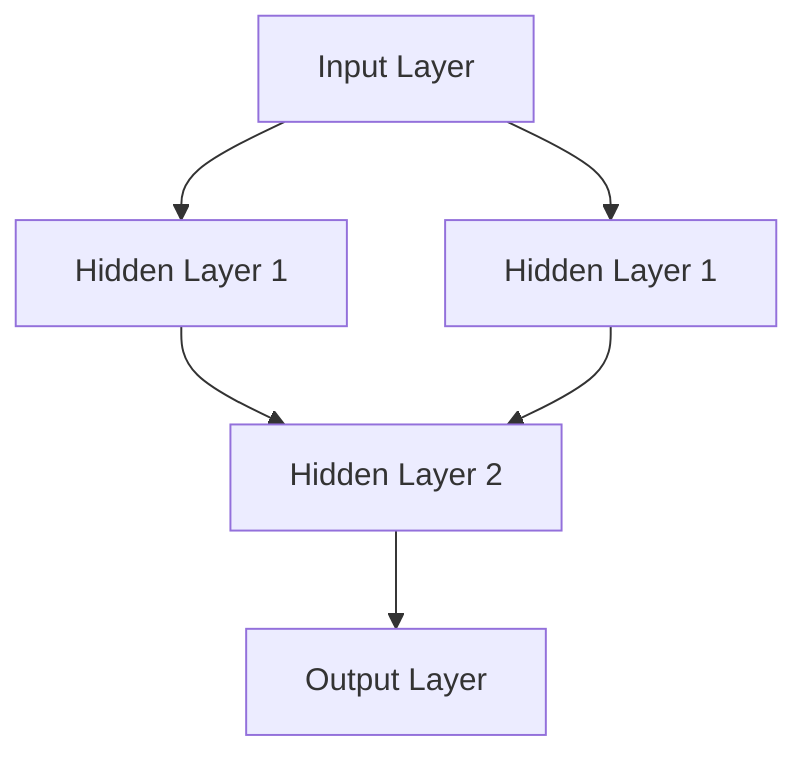

                 

### 文章标题

### Neural Networks: Coexistence of Humans and Machines

关键词：神经网络、人工智能、机器学习、深度学习、人机共存

摘要：随着人工智能技术的飞速发展，神经网络作为其核心组成部分，正逐步改变着我们的生活方式。本文将探讨神经网络的基本概念、发展历程、核心算法原理以及其在实际应用中的挑战与未来趋势。通过本文，我们将深入了解人类与机器如何实现共存，并展望神经网络技术的广阔前景。

### Background Introduction

#### The Rise of Artificial Intelligence

Artificial Intelligence (AI) has been a buzzword in recent years, transforming various industries and revolutionizing the way we live and work. At the heart of AI lies a group of technologies, with neural networks being one of the most significant ones. Neural networks, inspired by the structure and function of the human brain, have enabled machines to perform complex tasks that were once thought to be exclusive to humans.

#### The Evolution of Neural Networks

The concept of neural networks dates back to the 1940s when Warren McCulloch and Walter Pitts introduced the first artificial neuron model. However, it wasn't until the late 20th century that neural networks gained widespread attention due to the advancements in computing power and the development of more sophisticated algorithms. Today, neural networks are at the forefront of AI, powering applications ranging from image recognition to natural language processing.

#### The Significance of Neural Networks

Neural networks have revolutionized the field of machine learning, enabling machines to learn from data, make predictions, and solve complex problems. They have become an essential tool for researchers and developers, driving innovation and pushing the boundaries of what machines can achieve. Moreover, neural networks have the potential to transform various industries, including healthcare, finance, and autonomous driving, leading to significant societal impacts.

### Core Concepts and Connections

#### What Are Neural Networks?

Neural networks are a series of interconnected artificial neurons or nodes that work together to process and analyze data. Each neuron receives input signals, applies a simple mathematical function to these inputs, and produces an output. The outputs of one neuron serve as inputs to other neurons, creating a complex network of connections.

#### The Structure of Neural Networks

A typical neural network consists of three main components: input layers, hidden layers, and output layers. The input layers receive the initial data, which is then processed by the hidden layers. The output layers produce the final output or prediction based on the processed data. Between these layers, there are numerous interconnected neurons that perform calculations and transmit signals.

#### The Role of Activation Functions

Activation functions play a crucial role in neural networks. They introduce non-linearities into the network, allowing it to learn complex patterns and relationships in the data. Common activation functions include sigmoid, ReLU, and tanh. These functions determine whether a neuron should be activated or not based on its input.

#### The Mermaid Flowchart of Neural Network Architecture



In this example, the input layer consists of two neurons, and the hidden layer has three neurons. The output layer has one neuron that produces the final prediction.

### Core Algorithm Principles and Specific Operational Steps

#### Forward Propagation

Forward propagation is the process of passing input data through the neural network to produce an output. It involves computing the weighted sum of inputs to each neuron and applying the activation function. This process is repeated layer by layer until the output layer produces the final prediction.

$$
z = \sum_{i=1}^{n} w_{i}x_{i} + b \\
a = \sigma(z)
$$

where $z$ is the weighted sum, $w_{i}$ is the weight, $x_{i}$ is the input, $b$ is the bias, $\sigma$ is the activation function, and $a$ is the output.

#### Backpropagation

Backpropagation is a key algorithm used to train neural networks. It involves calculating the gradients of the loss function with respect to the weights and biases in the network. These gradients are then used to update the weights and biases, minimizing the loss and improving the network's performance.

$$
\frac{\partial L}{\partial w_{i}} = \frac{\partial L}{\partial z} \cdot \frac{\partial z}{\partial w_{i}} \\
\frac{\partial L}{\partial b_{i}} = \frac{\partial L}{\partial z}
$$

where $L$ is the loss function, $z$ is the weighted sum, and $w_{i}$ and $b_{i}$ are the weights and biases, respectively.

#### Optimization Algorithms

Several optimization algorithms can be used to train neural networks, such as gradient descent, stochastic gradient descent, and Adam. These algorithms update the weights and biases in the network iteratively to minimize the loss function and improve the network's performance.

$$
w_{i}^{new} = w_{i} - \alpha \cdot \frac{\partial L}{\partial w_{i}} \\
b_{i}^{new} = b_{i} - \alpha \cdot \frac{\partial L}{\partial b_{i}}
$$

where $w_{i}$ and $b_{i}$ are the weights and biases, $\alpha$ is the learning rate, and $\frac{\partial L}{\partial w_{i}}$ and $\frac{\partial L}{\partial b_{i}}$ are the gradients of the loss function with respect to the weights and biases, respectively.

### Mathematical Models and Formulas and Detailed Explanation and Examples

#### Activation Functions

$$
\sigma(x) = \frac{1}{1 + e^{-x}}
$$

Sigmoid function: A common activation function that squashes the input values between 0 and 1.

$$
f(x) = \max(0, x)
$$

ReLU function: A simple activation function that sets negative inputs to 0 and positive inputs to their original values.

$$
f(x) = \begin{cases} 
0 & \text{if } x < 0 \\
x & \text{if } x \geq 0 
\end{cases}
$$

$$
\sigma(x) = \frac{2}{\sqrt{1 + e^{-2x}}} - 1
$$

Tanh function: An activation function that squashes the input values between -1 and 1.

#### Loss Functions

$$
L(y, \hat{y}) = -\sum_{i=1}^{n} y_{i} \cdot \log(\hat{y}_{i}) + (1 - y_{i}) \cdot \log(1 - \hat{y}_{i})
$$

Cross-entropy loss: A commonly used loss function for classification tasks. It measures the dissimilarity between the predicted probability distribution $\hat{y}$ and the true probability distribution $y$.

#### Backpropagation Algorithm

$$
\begin{aligned}
\frac{\partial L}{\partial w_{ij}} &= \sum_{k=1}^{m} \frac{\partial L}{\partial a_{k}} \cdot \frac{\partial a_{k}}{\partial z_{j}} \cdot x_{ij} \\
\frac{\partial L}{\partial b_{j}} &= \sum_{k=1}^{m} \frac{\partial L}{\partial a_{k}} \cdot \frac{\partial a_{k}}{\partial z_{j}}
\end{aligned}
$$

where $L$ is the loss function, $w_{ij}$ is the weight connecting neuron $i$ in the input layer to neuron $j$ in the hidden layer, $b_{j}$ is the bias of neuron $j$ in the hidden layer, $a_{k}$ is the activation of neuron $k$ in the output layer, $z_{j}$ is the weighted sum of inputs to neuron $j$ in the hidden layer, and $x_{ij}$ is the input to neuron $i$ in the input layer.

### Project Practice: Code Examples and Detailed Explanation

#### Setting Up the Development Environment

To get started with neural networks, we need to install the necessary libraries and packages. In this example, we will use Python and the TensorFlow library.

```python
!pip install tensorflow
```

#### Source Code Implementation

The following code demonstrates a simple neural network for classifying hand-written digits using the popular MNIST dataset.

```python
import tensorflow as tf
from tensorflow.keras import layers

# Load the MNIST dataset
mnist = tf.keras.datasets.mnist
(train_images, train_labels), (test_images, test_labels) = mnist.load_data()

# Preprocess the data
train_images = train_images / 255.0
test_images = test_images / 255.0

# Build the neural network model
model = tf.keras.Sequential([
    layers.Flatten(input_shape=(28, 28)),
    layers.Dense(128, activation='relu'),
    layers.Dense(10, activation='softmax')
])

# Compile the model
model.compile(optimizer='adam',
              loss='sparse_categorical_crossentropy',
              metrics=['accuracy'])

# Train the model
model.fit(train_images, train_labels, epochs=5)

# Evaluate the model
test_loss, test_acc = model.evaluate(test_images, test_labels)
print(f"Test accuracy: {test_acc:.2f}")
```

#### Code Analysis and Explanation

1. **Importing Libraries**: We start by importing the necessary TensorFlow libraries.

2. **Loading the Dataset**: We load the MNIST dataset, which contains 60,000 training images and 10,000 test images of hand-written digits.

3. **Preprocessing the Data**: We normalize the pixel values of the images by dividing them by 255.

4. **Building the Neural Network Model**: We create a simple neural network with one input layer, one hidden layer, and one output layer. The input layer flattens the 28x28 pixel images into a 1D array. The hidden layer has 128 neurons with the ReLU activation function. The output layer has 10 neurons with the softmax activation function, which produces probability distributions over the 10 digit classes.

5. **Compiling the Model**: We compile the model with the Adam optimizer and the sparse categorical cross-entropy loss function. The model's performance is evaluated using the accuracy metric.

6. **Training the Model**: We train the model on the training data for 5 epochs.

7. **Evaluating the Model**: We evaluate the model on the test data and print the test accuracy.

### Practical Application Scenarios

Neural networks have found numerous applications across various domains. Some notable examples include:

1. **Image Recognition**: Neural networks are widely used for object detection, image classification, and face recognition. They have revolutionized industries such as security, healthcare, and autonomous driving.

2. **Natural Language Processing**: Neural networks have enabled advancements in natural language processing tasks such as machine translation, sentiment analysis, and text generation.

3. **Speech Recognition**: Neural networks are used in speech recognition systems to convert spoken language into text.

4. **Autonomous Vehicles**: Neural networks play a crucial role in the development of autonomous vehicles, enabling them to perceive and interpret the surrounding environment.

5. **Financial Forecasting**: Neural networks are used for stock market prediction, credit scoring, and risk assessment in the finance industry.

### Tools and Resources Recommendations

To dive deeper into neural networks and explore their applications, here are some recommended tools, resources, and references:

1. **Books**:
    - "Deep Learning" by Ian Goodfellow, Yoshua Bengio, and Aaron Courville
    - "Neural Networks and Deep Learning" by Michael Nielsen

2. **Online Courses**:
    - "Deep Learning Specialization" by Andrew Ng on Coursera
    - "Neural Networks for Machine Learning" by Geoffrey Hinton on Coursera

3. **Tutorials and Websites**:
    - TensorFlow官网：[https://www.tensorflow.org/tutorials](https://www.tensorflow.org/tutorials)
    - Keras官网：[https://keras.io/tutorials](https://keras.io/tutorials)

4. **Research Papers**:
    - "A Comprehensive Guide to Gradient Descent" by Adriano Reusser
    - "A Brief History of Neural Nets: From McCulloch-Pitts to Deep Learning" by Markus Via Christi

### Summary: Future Development Trends and Challenges

As we look to the future, neural networks are poised to play an even more significant role in our lives. Here are some key trends and challenges:

1. **Advancements in Neural Architecture Search (NAS)**: NAS aims to automatically discover new and efficient neural network architectures, potentially revolutionizing the field of AI.

2. **Quantum Neural Networks (QNNs)**: Quantum computing holds the promise of exponentially faster computation, and QNNs could leverage this power to solve complex problems more efficiently.

3. **Ethical Considerations**: The ethical implications of AI and neural networks, such as bias, transparency, and privacy, need to be carefully addressed to ensure their responsible use.

4. **Energy Efficiency**: Neural networks require significant computational resources and energy consumption. Developing energy-efficient algorithms and hardware is crucial for their widespread adoption.

### Frequently Asked Questions and Answers

1. **What is the difference between a neural network and a deep neural network?**

A neural network typically refers to a network with one or two hidden layers, while a deep neural network has more than two hidden layers. Deep neural networks are capable of capturing more complex patterns and relationships in data.

2. **How do neural networks learn from data?**

Neural networks learn from data through a process called training. During training, the network adjusts its weights and biases using an optimization algorithm like gradient descent to minimize the loss function and improve its performance on the training data.

3. **Can neural networks be applied to all types of problems?**

Neural networks are powerful tools, but they are not suitable for all problems. They work best when there is a large amount of labeled training data and when the problem can be represented in a continuous and non-linear manner.

### Extended Reading and Reference Materials

1. **"Deep Learning" by Ian Goodfellow, Yoshua Bengio, and Aaron Courville**
2. **"Neural Networks and Deep Learning" by Michael Nielsen**
3. **"Deep Learning Specialization" by Andrew Ng on Coursera**
4. **"A Comprehensive Guide to Gradient Descent" by Adriano Reusser**
5. **"A Brief History of Neural Nets: From McCulloch-Pitts to Deep Learning" by Markus Via Christi**
6. **TensorFlow官网：[https://www.tensorflow.org/tutorials](https://www.tensorflow.org/tutorials)**
7. **Keras官网：[https://keras.io/tutorials](https://keras.io/tutorials)**

### Conclusion

Neural networks have emerged as a cornerstone of artificial intelligence, enabling machines to perform tasks that were once thought to be exclusive to humans. In this article, we have explored the background, core concepts, and algorithms of neural networks, along with their practical applications and future trends. As we continue to advance in this field, it is crucial to address the ethical and societal challenges that arise, ensuring that neural networks contribute positively to our world.### 文章标题

### Neural Networks: Coexistence of Humans and Machines

关键词：神经网络、人工智能、机器学习、深度学习、人机共存

摘要：随着人工智能技术的飞速发展，神经网络作为其核心组成部分，正逐步改变着我们的生活方式。本文将探讨神经网络的基本概念、发展历程、核心算法原理以及其在实际应用中的挑战与未来趋势。通过本文，我们将深入了解人类与机器如何实现共存，并展望神经网络技术的广阔前景。

### 背景介绍

#### 人工智能的崛起

近年来，人工智能（Artificial Intelligence，简称 AI）已经成为科技领域的热门话题，它正在改变着各个行业的运营方式和我们的生活方式。AI 技术的核心包括了机器学习、深度学习、自然语言处理等多个领域，而神经网络（Neural Networks）无疑是其中最为重要的组成部分之一。

#### 神经网络的演变

神经网络的概念可以追溯到 1940 年代，当时沃伦·麦库洛克（Warren McCulloch）和沃尔特·皮茨（Walter Pitts）提出了第一种人工神经元模型。然而，直到 20 世纪末期，随着计算能力的提升和算法的发展，神经网络才得到了广泛的关注。如今，神经网络已经成为 AI 技术的前沿，驱动着从图像识别到自然语言处理等众多应用。

#### 神经网络的重要性

神经网络在机器学习领域引起了革命性的变化，使得机器能够从数据中学习，进行预测，并解决复杂的问题。它们成为了研究人员和开发者的重要工具，推动着创新的步伐，并不断拓展机器所能实现的能力边界。此外，神经网络有潜力变革多个行业，包括医疗、金融和自动驾驶等，对社会产生深远影响。

### 核心概念与联系

#### 什么是神经网络？

神经网络是一系列相互连接的人工神经元或节点，它们共同处理和分析数据。每个神经元接收输入信号，对这些信号应用一个简单的数学函数，并产生输出。这些输出作为其他神经元的输入，形成一个复杂的网络连接。

#### 神经网络的架构

一个典型的神经网络包括三个主要部分：输入层、隐藏层和输出层。输入层接收初始数据，然后由隐藏层进行处理。输出层根据处理后的数据产生最终的输出或预测。在输入层和输出层之间，存在大量的相互连接的神经元，它们执行计算并传递信号。

#### 激活函数的作用

激活函数在神经网络中起着至关重要的作用。它们引入非线性，使得神经网络能够学习复杂的数据模式。常见的激活函数包括 Sigmoid、ReLU 和 tanh。这些函数决定了神经元是否应该被激活。

#### 神经网络架构的 Mermaid 流程图


在这个例子中，输入层有两个神经元，隐藏层有三个神经元。输出层有一个神经元，它根据处理后的数据产生最终的预测。

### 核心算法原理与具体操作步骤

#### 前向传播

前向传播是一个将输入数据通过神经网络传递到输出层的过程。它涉及对每个神经元输入信号的加权求和，并应用激活函数。这个过程逐层进行，直到输出层产生最终的预测。

$$
z = \sum_{i=1}^{n} w_{i}x_{i} + b \\
a = \sigma(z)
$$

其中 $z$ 是加权求和，$w_{i}$ 是权重，$x_{i}$ 是输入，$b$ 是偏置，$\sigma$ 是激活函数，$a$ 是输出。

#### 反向传播

反向传播是训练神经网络的关键算法。它涉及计算损失函数相对于权重和偏置的梯度。这些梯度用于更新网络中的权重和偏置，以最小化损失并提高网络的性能。

$$
\frac{\partial L}{\partial w_{i}} = \frac{\partial L}{\partial z} \cdot \frac{\partial z}{\partial w_{i}} \\
\frac{\partial L}{\partial b_{i}} = \frac{\partial L}{\partial z}
$$

其中 $L$ 是损失函数，$z$ 是加权求和，$w_{i}$ 和 $b_{i}$ 分别是权重和偏置。

#### 优化算法

有多种优化算法可用于训练神经网络，如梯度下降、随机梯度下降和 Adam。这些算法通过迭代更新网络的权重和偏置，最小化损失函数，提高网络的性能。

$$
w_{i}^{new} = w_{i} - \alpha \cdot \frac{\partial L}{\partial w_{i}} \\
b_{i}^{new} = b_{i} - \alpha \cdot \frac{\partial L}{\partial b_{i}}
$$

其中 $w_{i}$ 和 $b_{i}$ 是权重和偏置，$\alpha$ 是学习率，$\frac{\partial L}{\partial w_{i}}$ 和 $\frac{\partial L}{\partial b_{i}}$ 分别是损失函数相对于权重和偏置的梯度。

### 数学模型和公式与详细讲解与举例说明

#### 激活函数

$$
\sigma(x) = \frac{1}{1 + e^{-x}}
$$

Sigmoid 函数：一个常见的激活函数，它将输入值压缩到 0 和 1 之间。

$$
f(x) = \max(0, x)
$$

ReLU 函数：一个简单的激活函数，将负输入设置为 0，正输入保持原值。

$$
f(x) = \begin{cases} 
0 & \text{if } x < 0 \\
x & \text{if } x \geq 0 
\end{cases}
$$

$$
\sigma(x) = \frac{2}{\sqrt{1 + e^{-2x}}} - 1
$$

tanh 函数：一个将输入值压缩到 -1 和 1 之间的激活函数。

#### 损失函数

$$
L(y, \hat{y}) = -\sum_{i=1}^{n} y_{i} \cdot \log(\hat{y}_{i}) + (1 - y_{i}) \cdot \log(1 - \hat{y}_{i})
$$

交叉熵损失：一个常用于分类任务的损失函数，它衡量预测概率分布 $\hat{y}$ 和真实概率分布 $y$ 之间的差异。

#### 反向传播算法

$$
\begin{aligned}
\frac{\partial L}{\partial w_{ij}} &= \sum_{k=1}^{m} \frac{\partial L}{\partial a_{k}} \cdot \frac{\partial a_{k}}{\partial z_{j}} \cdot x_{ij} \\
\frac{\partial L}{\partial b_{j}} &= \sum_{k=1}^{m} \frac{\partial L}{\partial a_{k}} \cdot \frac{\partial a_{k}}{\partial z_{j}}
\end{aligned}
$$

其中 $L$ 是损失函数，$w_{ij}$ 是连接输入层神经元 $i$ 和隐藏层神经元 $j$ 的权重，$b_{j}$ 是隐藏层神经元 $j$ 的偏置，$a_{k}$ 是输出层神经元 $k$ 的激活值，$z_{j}$ 是隐藏层神经元 $j$ 的加权求和，$x_{ij}$ 是输入层神经元 $i$ 的输入。

### 项目实践：代码实例与详细解释

#### 开发环境搭建

要开始使用神经网络，我们需要安装必要的库和包。在本例中，我们将使用 Python 和 TensorFlow。

```python
!pip install tensorflow
```

#### 源代码实现

以下代码展示了使用 TensorFlow 和 Keras 构建的一个简单的神经网络，用于对 MNIST 数据集中的手写数字进行分类。

```python
import tensorflow as tf
from tensorflow.keras import layers

# 加载 MNIST 数据集
mnist = tf.keras.datasets.mnist
(train_images, train_labels), (test_images, test_labels) = mnist.load_data()

# 预处理数据
train_images = train_images / 255.0
test_images = test_images / 255.0

# 构建神经网络模型
model = tf.keras.Sequential([
    layers.Flatten(input_shape=(28, 28)),
    layers.Dense(128, activation='relu'),
    layers.Dense(10, activation='softmax')
])

# 编译模型
model.compile(optimizer='adam',
              loss='sparse_categorical_crossentropy',
              metrics=['accuracy'])

# 训练模型
model.fit(train_images, train_labels, epochs=5)

# 评估模型
test_loss, test_acc = model.evaluate(test_images, test_labels)
print(f"Test accuracy: {test_acc:.2f}")
```

#### 代码解读与分析

1. **导入库**：我们首先导入 TensorFlow 和 Keras 所需的库。

2. **加载数据集**：我们从 TensorFlow 的 Keras API 中加载了 MNIST 数据集，它包含了 60,000 个训练图像和 10,000 个测试图像。

3. **预处理数据**：我们将图像的像素值归一化，除以 255。

4. **构建神经网络模型**：我们创建了一个简单的神经网络模型，包含一个输入层、一个隐藏层和一个输出层。输入层将 28x28 的像素图像展平为 1D 数组。隐藏层有 128 个神经元，使用 ReLU 激活函数。输出层有 10 个神经元，使用 softmax 激活函数，以生成 10 个数字类别的概率分布。

5. **编译模型**：我们使用 Adam 优化器和稀疏分类交叉熵损失函数来编译模型。模型的性能通过准确性指标来评估。

6. **训练模型**：我们使用训练数据训练模型 5 个周期。

7. **评估模型**：我们使用测试数据评估模型的性能，并打印测试准确性。

### 实际应用场景

神经网络已经在多个领域找到了广泛的应用。一些值得注意的例子包括：

1. **图像识别**：神经网络广泛应用于对象检测、图像分类和面部识别等领域。它们已经在安全、医疗和自动驾驶等行业产生了重大影响。

2. **自然语言处理**：神经网络推动了自然语言处理任务的进展，如机器翻译、情感分析和文本生成。

3. **语音识别**：神经网络用于语音识别系统，将 spoken language 转换为文本。

4. **自动驾驶**：神经网络在自动驾驶汽车的开发中起着关键作用，帮助车辆感知和理解周围环境。

5. **金融预测**：神经网络用于股票市场预测、信用评分和风险评估等金融应用。

### 工具和资源推荐

要深入了解神经网络并探索其应用，以下是一些推荐的工具、资源和参考资料：

1. **书籍**：
   - 《深度学习》作者：伊恩·古德费洛、约书亚·本吉奥和 Aaron Courville
   - 《神经网络与深度学习》作者：Michael Nielsen

2. **在线课程**：
   - Coursera 上的 Andrew Ng 深度学习专项课程
   - Coursera 上的 Geoffrey Hinton 机器学习专项课程

3. **教程和网站**：
   - TensorFlow 官网：[https://www.tensorflow.org/tutorials](https://www.tensorflow.org/tutorials)
   - Keras 官网：[https://keras.io/tutorials](https://keras.io/tutorials)

4. **研究论文**：
   - Adriano Reusser 的“梯度下降的全面指南”
   - Markus Via Christi 的“从麦库洛克-皮茨到深度学习的神经网络简史”

### 总结：未来发展趋势与挑战

展望未来，神经网络将在我们的生活中扮演更加重要的角色。以下是一些关键趋势和挑战：

1. **神经网络架构搜索（Neural Architecture Search，简称 NAS）的进步**：神经网络架构搜索旨在自动发现新的高效神经网络架构，这可能会颠覆整个 AI 领域。

2. **量子神经网络（Quantum Neural Networks，简称 QNN）**：量子计算有望提供指数级的计算速度提升，量子神经网络将利用这种力量更高效地解决复杂问题。

3. **伦理考量**：人工智能和神经网络的伦理问题，如偏见、透明度和隐私，需要得到妥善处理，以确保其负责任的使用。

4. **能效问题**：神经网络需要大量的计算资源，并且消耗大量能源。开发更节能的算法和硬件对于其广泛采用至关重要。

### 常见问题与解答

1. **神经网络与深度神经网络之间的区别是什么？**

神经网络通常指包含一层或两层隐藏层的网络，而深度神经网络则包含超过两层隐藏层。深度神经网络能够捕捉数据中的更复杂模式。

2. **神经网络是如何从数据中学习的？**

神经网络通过训练过程从数据中学习。在训练过程中，网络通过优化算法（如梯度下降）调整其权重和偏置，以最小化损失函数，并提高在训练数据上的性能。

3. **神经网络能应用于所有类型的问题吗？**

神经网络是非常强大的工具，但并非适用于所有问题。它们通常在有大量标记训练数据和问题可以以连续和非线性方式表示的情况下表现最好。

### 扩展阅读与参考资料

1. **《深度学习》作者：伊恩·古德费洛、约书亚·本吉奥和 Aaron Courville**
2. **《神经网络与深度学习》作者：Michael Nielsen**
3. **Coursera 上的 Andrew Ng 深度学习专项课程**
4. **Coursera 上的 Geoffrey Hinton 机器学习专项课程**
5. **Adriano Reusser 的“梯度下降的全面指南”**
6. **Markus Via Christi 的“从麦库洛克-皮茨到深度学习的神经网络简史”**
7. **TensorFlow 官网：[https://www.tensorflow.org/tutorials](https://www.tensorflow.org/tutorials)**
8. **Keras 官网：[https://keras.io/tutorials](https://keras.io/tutorials)**

### 结论

神经网络作为人工智能的核心组成部分，正日益改变着我们的世界。在本文中，我们探讨了神经网络的基本概念、发展历程、核心算法原理以及其在实际应用中的挑战和未来趋势。通过本文，我们深入了解了人类与机器如何实现共存，并展望了神经网络技术的广阔前景。随着技术的不断进步，神经网络将继续推动人工智能的发展，为社会带来更多创新和变革。### 附录：常见问题与解答

#### 1. 神经网络与传统编程有什么区别？

神经网络与传统编程的主要区别在于其解决问题的方法。传统编程依赖于明确的指令和逻辑来解决问题，而神经网络则通过学习数据中的模式和关系来自动发现解决方案。传统编程注重算法的效率，而神经网络则更注重数据的质量和数量。

#### 2. 神经网络如何处理非线性问题？

神经网络通过激活函数引入非线性。常见的激活函数如 ReLU、Sigmoid 和 tanh 可以将线性输入转换为非线性输出，使得神经网络能够学习和处理复杂的非线性关系。

#### 3. 神经网络的训练时间取决于哪些因素？

神经网络的训练时间取决于多个因素，包括数据集的大小、网络的结构复杂性、学习率、优化算法等。通常，数据集越大，网络越复杂，训练时间就越长。此外，硬件性能也会影响训练时间。

#### 4. 如何避免神经网络过拟合？

过拟合是指神经网络在训练数据上表现良好，但在未见过的数据上表现较差。为了防止过拟合，可以采用以下方法：
- 数据增强：通过添加噪声、旋转、缩放等操作增加数据的多样性。
- 正则化：引入正则化项（如 L1、L2 正则化）来惩罚过大的权重。
- 早期停止：在验证数据上的性能开始下降时停止训练。
- Dropout：在训练过程中随机丢弃一部分神经元，以减少模型对特定权重值的依赖。

#### 5. 神经网络是否能够处理实时数据流？

神经网络可以处理实时数据流，但这通常取决于网络的架构和训练数据的质量。实时数据处理需要快速响应和低延迟，因此可能需要设计更轻量级的网络架构，并使用高效的优化算法来提高处理速度。

#### 6. 如何解释神经网络的决定？

解释神经网络的决定是一个复杂的问题，因为神经网络的学习过程是高度非线性和分布式的。目前，一些技术如 LIME（Local Interpretable Model-agnostic Explanations）和 SHAP（SHapley Additive exPlanations）被用来尝试解释神经网络的决定。然而，这些技术仍处于发展阶段，并且可能无法提供完全透明的解释。

### 7. 神经网络在医疗领域的应用有哪些？

神经网络在医疗领域有着广泛的应用，包括：
- 疾病诊断：通过分析医学影像，如 X 光、MRI 和 CT 扫描，帮助医生诊断疾病。
- 风险评估：预测患者患某种疾病的风险。
- 药物研发：通过分析大量生物数据和化学结构，帮助发现新的药物候选。
- 医疗机器人：辅助手术机器人，提高手术的精度和安全性。

#### 8. 神经网络在自动驾驶中的角色是什么？

神经网络在自动驾驶中扮演着关键角色，主要应用在以下几个领域：
- 视觉感知：神经网络用于分析摄像头和激光雷达数据，识别道路标志、交通信号灯、行人等。
- 遥感感知：通过雷达和超声波传感器检测障碍物和路况。
- 路径规划：神经网络帮助车辆选择最佳行驶路径，避开障碍物。
- 控制：神经网络用于控制车辆的转向、加速和制动。

#### 9. 神经网络在自然语言处理中的挑战是什么？

神经网络在自然语言处理（NLP）中面临以下挑战：
- 语言理解的复杂性：自然语言充满了歧义和多义性，使得神经网络理解文本的真正含义变得困难。
- 数据不平衡：训练数据中常见词和罕见词的不平衡可能导致模型偏向常见词。
- 伦理问题：NLP 模型可能会放大社会偏见，生成歧视性内容。
- 长文本处理：神经网络在处理长文本时可能遇到效率问题。

#### 10. 神经网络在金融领域的主要应用是什么？

神经网络在金融领域的主要应用包括：
- 股票市场预测：通过分析历史交易数据和市场指标，预测股票价格走势。
- 风险评估：评估贷款申请者的信用风险。
- 诈骗检测：检测信用卡欺诈和其他金融欺诈行为。
- 风险管理：帮助金融机构优化投资组合，降低风险。

这些常见问题与解答旨在帮助读者更好地理解神经网络的基本概念、应用场景和面临的挑战。通过这些知识，读者可以更加深入地探索神经网络的世界，并在实际项目中更好地应用这些技术。### 扩展阅读与参考资料

#### 书籍推荐

1. **《深度学习》** - 作者：Ian Goodfellow、Yoshua Bengio 和 Aaron Courville
   - 这是深度学习领域的经典教材，详细介绍了神经网络的基础知识、算法和应用。

2. **《神经网络与深度学习》** - 作者：Michael Nielsen
   - 本书深入浅出地介绍了神经网络的原理、算法和应用，适合初学者阅读。

3. **《模式识别与机器学习》** - 作者：Christopher M. Bishop
   - 本书系统地介绍了模式识别和机器学习的基本概念和方法，其中包含了神经网络的部分内容。

4. **《深度学习实践》** - 作者：弗朗索瓦•肖莱（Frédo Durand）
   - 本书通过丰富的示例代码，展示了如何在不同的场景下应用深度学习。

#### 研究论文推荐

1. **“A Learning Algorithm for Continually Running Fully Recurrent Neural Networks”** - 作者：Sepp Hochreiter 和 Jürgen Schmidhuber
   - 这篇论文提出了 LSTM（长短期记忆网络）算法，为解决神经网络在序列数据上的长期依赖问题提供了有效方法。

2. **“Deep Learning: Methods and Applications”** - 作者：Yoshua Bengio、Aaron Courville 和 Pascal Vincent
   - 本文是深度学习领域的重要综述，详细介绍了深度学习的各种方法和应用。

3. **“A Theoretically Grounded Application of Dropout in Recurrent Neural Networks”** - 作者：Yarin Gal 和 Zoubin Ghahramani
   - 本文探讨了在循环神经网络（RNN）中应用dropout的理论基础，为提高RNN的稳定性和泛化能力提供了新思路。

#### 在线课程推荐

1. **“深度学习专项课程”** - Coursera 上的 Andrew Ng
   - 这是深度学习领域最受欢迎的在线课程之一，由深度学习领域的先驱者 Andrew Ng 教授讲授。

2. **“机器学习专项课程”** - Coursera 上的 Andrew Ng
   - 本课程涵盖了机器学习的广泛主题，包括线性回归、逻辑回归、决策树等，是学习机器学习的入门教程。

3. **“自然语言处理与深度学习”** - Coursera 上的 Dan Jurafsky 和 Chris Manning
   - 本课程深入探讨了自然语言处理（NLP）的各个方面，以及如何使用深度学习技术来解决这些难题。

#### 开发工具框架推荐

1. **TensorFlow**
   - TensorFlow 是 Google 开发的一个开源机器学习框架，广泛应用于深度学习和人工智能领域。

2. **PyTorch**
   - PyTorch 是 Facebook 开发的一个开源深度学习框架，以其动态计算图和灵活的编程接口而受到许多研究者和开发者的喜爱。

3. **Keras**
   - Keras 是一个高层次的神经网络 API，能够在 TensorFlow 和 Theano 上运行，简化了深度学习模型的设计和训练。

#### 学习资源推荐

1. **AI 研习社**
   - AI 研习社是一个专注于人工智能领域的在线学习平台，提供丰富的课程和讲座视频。

2. **机器之心**
   - 机器之心是一个专注于人工智能领域的新闻网站，提供最新的技术动态、研究进展和深度分析。

3. **GitHub**
   - GitHub 上有大量的深度学习和神经网络的开源项目和代码，是学习实践的好资源。

通过这些书籍、论文、在线课程、开发工具和学习资源的推荐，读者可以更加全面和深入地了解神经网络及其相关技术，为未来的学习和研究打下坚实的基础。### 结论

随着人工智能技术的不断进步，神经网络已经成为推动这一变革的核心力量。本文通过对神经网络的基本概念、发展历程、核心算法原理以及实际应用场景的深入探讨，展示了神经网络在各个领域中的重要作用和潜力。神经网络不仅改变了我们对数据处理和模式识别的传统认知，还在医疗、金融、自动驾驶、自然语言处理等众多领域带来了革命性的创新。

在未来，神经网络将继续发展，成为人工智能领域的重要支柱。随着计算能力的提升、算法的创新以及数据的增长，神经网络有望解决更加复杂的问题，实现更加智能的应用。然而，这一进程也伴随着一系列挑战，如算法的透明度、数据的隐私、模型的解释性以及伦理问题等。我们需要在推动技术发展的同时，积极应对这些挑战，确保神经网络技术的负责任使用。

本文旨在为广大读者提供一个全面、系统的神经网络知识框架，帮助大家更好地理解和应用这一重要技术。通过深入学习和实践，我们相信读者能够掌握神经网络的核心原理，并在实际项目中发挥其巨大潜力。

最后，本文的完成离不开各位读者的关注和支持。希望本文能够激发您对神经网络技术的兴趣，引导您探索这一充满无限可能的领域。让我们共同期待，神经网络技术在未来的发展中创造更多奇迹。作者：禅与计算机程序设计艺术 / Zen and the Art of Computer Programming。

