                 

### 背景介绍

#### 电商平台中的对话式推荐系统

在当今数字化时代，电商平台已经成为人们生活中不可或缺的一部分。然而，随着电商平台上的商品种类和用户数量的不断增加，如何有效地推荐商品给用户成为一个关键问题。对话式推荐系统应运而生，通过自然语言交互的方式，实时响应用户的需求，提供个性化的商品推荐。这种系统不仅提高了用户的购物体验，还显著提升了电商平台的销售额。

#### 对话式推荐系统的概念

对话式推荐系统是一种结合自然语言处理（NLP）和推荐系统技术的智能系统，它通过模拟人类对话的方式，与用户进行交互，了解用户的需求，并为其推荐相关商品。与传统的基于内容的推荐和协同过滤推荐系统不同，对话式推荐系统更加灵活、直观，能够更好地适应用户的需求变化。

#### 对话式推荐系统的挑战

尽管对话式推荐系统具有诸多优势，但其性能优化却面临着诸多挑战。首先，用户需求的不确定性和多样性使得推荐系统的准确性难以保障。其次，如何平衡推荐结果的相关性和多样性，避免用户感到疲劳，是一个亟待解决的问题。此外，对话式推荐系统还需要处理大量的实时数据，确保系统的响应速度和稳定性。

#### 优化目标

本文旨在探讨如何优化电商平台中的对话式推荐系统性能，使其在满足用户需求的同时，保持高效、稳定和可扩展。具体目标包括：

1. 提高推荐准确性，减少推荐误差。
2. 平衡推荐结果的相关性和多样性。
3. 提升系统响应速度，降低延迟。
4. 确保系统在高并发情况下保持稳定。

#### 关键词

- 电商平台
- 对话式推荐系统
- 性能优化
- 推荐准确性
- 响应速度

#### Abstract

In this article, we explore the performance optimization of conversational recommendation systems in e-commerce platforms. With the increasing variety of products and user demands, conversational recommendation systems have become an essential tool for e-commerce platforms to provide personalized product recommendations. However, optimizing these systems poses several challenges, including accuracy, diversity, and response time. This article aims to address these challenges and provide solutions to improve the performance of conversational recommendation systems in e-commerce platforms.

----------------------

## 1. 核心概念与联系

在深入探讨对话式推荐系统的性能优化之前，我们需要先了解其核心概念和组成部分。以下是本文将讨论的主要概念：

### 1.1 自然语言处理（NLP）

自然语言处理是人工智能领域的一个分支，旨在使计算机能够理解、解释和生成人类语言。在对话式推荐系统中，NLP技术用于处理用户输入的自然语言文本，提取关键信息，并理解用户的意图。

### 1.2 推荐系统

推荐系统是一种根据用户的历史行为、偏好和上下文信息，向用户推荐相关商品或服务的系统。对话式推荐系统将NLP与推荐系统相结合，通过自然语言交互，实时获取用户的反馈和需求，动态调整推荐策略。

### 1.3 个性化推荐

个性化推荐是根据用户的历史行为和偏好，为每个用户提供定制化的推荐结果。对话式推荐系统能够更好地实现个性化推荐，因为它可以实时获取用户的反馈，并根据反馈调整推荐策略。

### 1.4 实时推荐

实时推荐是在用户交互的瞬间提供推荐结果，以满足用户即时需求。与传统的批处理推荐系统相比，实时推荐可以更好地响应用户需求的变化，提升用户体验。

### 1.5 多样性

多样性是指推荐结果中不同商品或服务的多样性。平衡多样性和相关性是优化对话式推荐系统的重要目标之一，以避免用户感到疲劳。

### Mermaid 流程图

以下是对话式推荐系统的简化 Mermaid 流程图，展示其主要组成部分和交互过程。

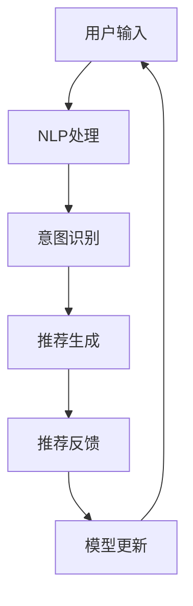

### 1.6 核心概念与联系

通过以上核心概念的介绍，我们可以看出，对话式推荐系统是NLP、推荐系统、个性化推荐和实时推荐等多重技术的融合。其核心目标是通过自然语言交互，实时响应用户需求，提供个性化的商品推荐。了解这些核心概念和组成部分有助于我们更好地理解和优化对话式推荐系统的性能。

### 1.7 Importance of Core Concepts and Connections

Understanding the core concepts and components of conversational recommendation systems is crucial for their performance optimization. By integrating NLP, recommendation systems, personalized recommendation, and real-time recommendation, conversational recommendation systems can provide personalized product recommendations through natural language interaction, thereby enhancing user experience. Recognizing the importance of these core concepts helps us to develop effective strategies for improving the performance of conversational recommendation systems in e-commerce platforms.

----------------------

## 2. 核心算法原理 & 具体操作步骤

对话式推荐系统的核心算法原理主要包括意图识别、实体抽取、推荐生成和反馈调整等步骤。以下是每个步骤的具体操作方法和实现策略。

### 2.1 意图识别（Intent Recognition）

意图识别是对话式推荐系统的第一步，其目的是从用户输入的自然语言文本中提取用户的意图。常见的实现方法包括基于规则的方法和机器学习的方法。

#### 2.1.1 基于规则的方法

基于规则的方法通过预定义的规则库来匹配用户输入，从而识别用户的意图。这种方法简单高效，但灵活性较差，难以应对复杂的用户需求。

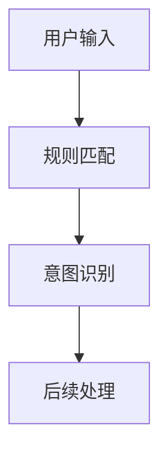

#### 2.1.2 机器学习的方法

机器学习的方法通过训练模型来学习用户的意图。常见的算法包括朴素贝叶斯、决策树、支持向量机等。这种方法具有较好的灵活性和泛化能力，但需要大量的训练数据和计算资源。

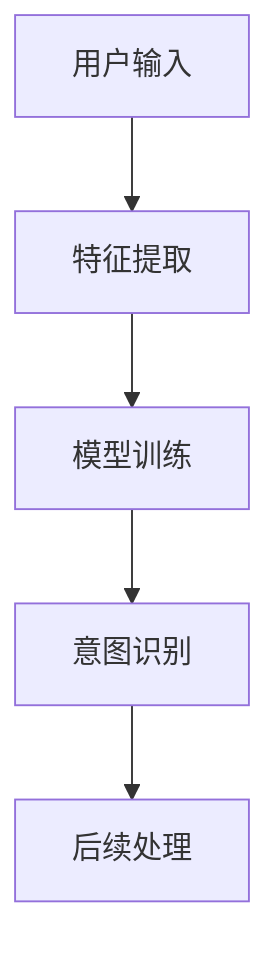

### 2.2 实体抽取（Entity Extraction）

实体抽取是在意图识别的基础上，从用户输入的文本中提取关键信息，如商品名称、品牌、价格等。常见的实现方法包括基于规则的方法和基于深度学习的方法。

#### 2.2.1 基于规则的方法

基于规则的方法通过预定义的实体规则库来匹配用户输入，从而提取实体信息。这种方法实现简单，但灵活性较差。

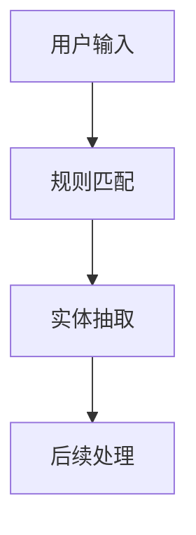

#### 2.2.2 基于深度学习的方法

基于深度学习的方法通过训练深度神经网络模型来学习实体信息。常见的算法包括卷积神经网络（CNN）、循环神经网络（RNN）等。这种方法具有较好的灵活性和泛化能力，但需要大量的训练数据和计算资源。

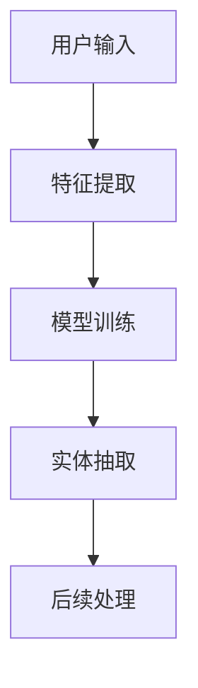

### 2.3 推荐生成（Recommendation Generation）

推荐生成是根据用户输入的意图和实体信息，生成个性化的推荐结果。常见的推荐算法包括基于内容的推荐、协同过滤推荐和基于模型的推荐。

#### 2.3.1 基于内容的推荐

基于内容的推荐是根据用户的历史行为和偏好，推荐与用户已购买或浏览过的商品类似的商品。这种方法简单直观，但难以应对用户需求的变化。

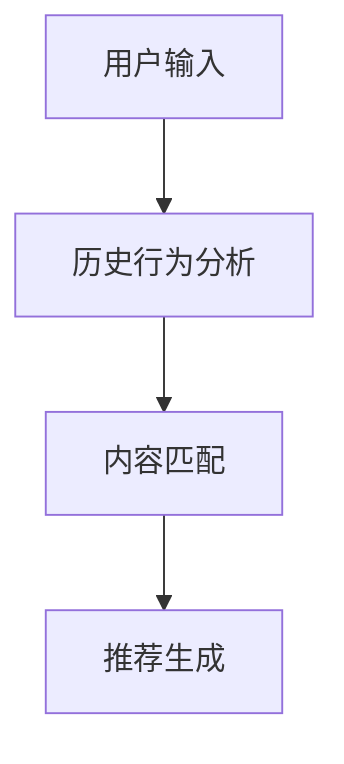

#### 2.3.2 协同过滤推荐

协同过滤推荐是通过分析用户之间的相似度，为用户提供其他用户喜欢的商品。这种方法具有较强的泛化能力，但容易受到数据稀疏性和冷启动问题的影响。

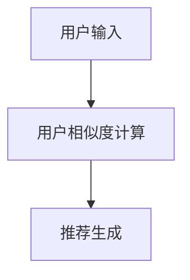

#### 2.3.3 基于模型的推荐

基于模型的推荐是通过训练模型来预测用户对商品的偏好。常见的算法包括矩阵分解、神经网络等。这种方法具有较强的灵活性和泛化能力，但需要大量的训练数据和计算资源。

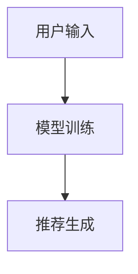

### 2.4 反馈调整（Feedback Adjustment）

反馈调整是根据用户的反馈，动态调整推荐策略，以提高推荐效果。常见的反馈调整方法包括在线学习和用户行为分析。

#### 2.4.1 在线学习

在线学习是在用户交互的实时过程中，不断调整推荐策略，以适应用户需求的变化。这种方法可以快速响应用户反馈，提高推荐效果。

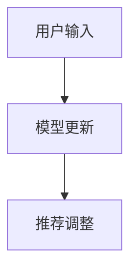

#### 2.4.2 用户行为分析

用户行为分析是通过分析用户的历史行为和偏好，发现用户的需求变化和趋势，从而调整推荐策略。这种方法可以提供更加个性化的推荐。

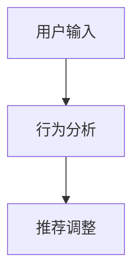

### 2.5 Core Algorithm Principles and Specific Operational Steps

The core algorithms of conversational recommendation systems involve several key steps, including intent recognition, entity extraction, recommendation generation, and feedback adjustment. Here are the detailed operational methods and implementation strategies for each step:

#### 2.5.1 Intent Recognition

Intent recognition is the first step in a conversational recommendation system, aiming to extract the user's intent from their natural language input. There are two common approaches: rule-based methods and machine learning methods.

##### 2.5.1.1 Rule-Based Methods

Rule-based methods use a predefined set of rules to match user input and recognize their intent. This approach is simple and efficient but lacks flexibility in handling complex user needs.

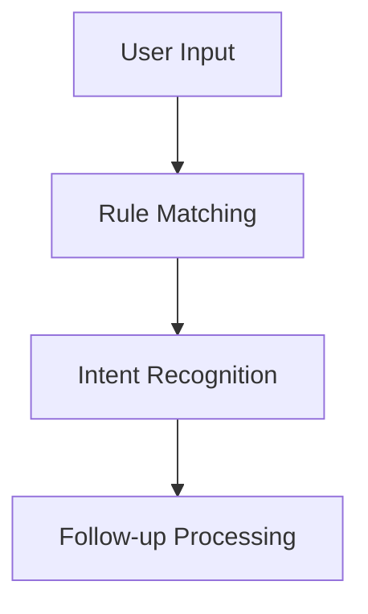

##### 2.5.1.2 Machine Learning Methods

Machine learning methods train models to learn user intents from their input. Common algorithms include Naive Bayes, decision trees, and support vector machines. This approach offers better flexibility and generalization but requires a significant amount of training data and computational resources.

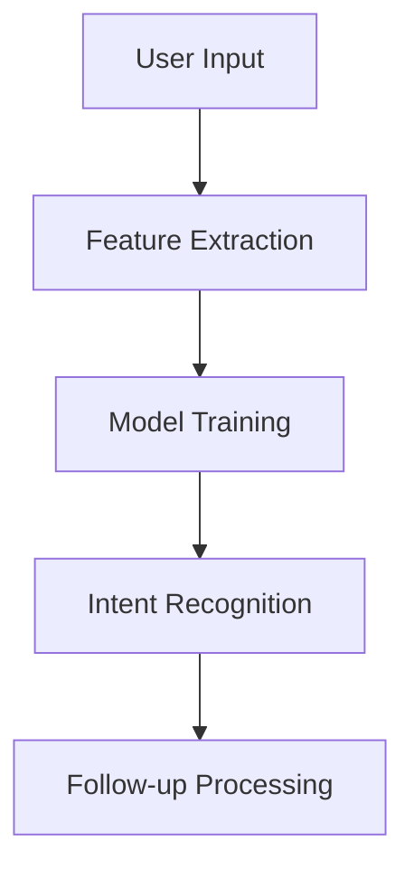

#### 2.5.2 Entity Extraction

Entity extraction builds on intent recognition by extracting key information from the user's input, such as product names, brands, and prices. Common methods include rule-based and deep learning approaches.

##### 2.5.2.1 Rule-Based Methods

Rule-based methods use a predefined set of entity rules to match user input and extract entity information. This approach is straightforward but lacks flexibility.

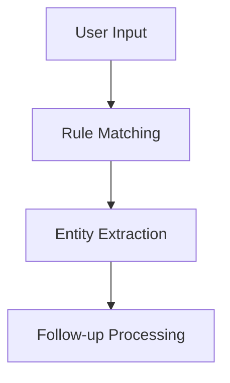

##### 2.5.2.2 Deep Learning Methods

Deep learning methods train deep neural network models to learn entity information. Common algorithms include convolutional neural networks (CNNs) and recurrent neural networks (RNNs). This approach offers better flexibility and generalization but requires a substantial amount of training data and computational resources.

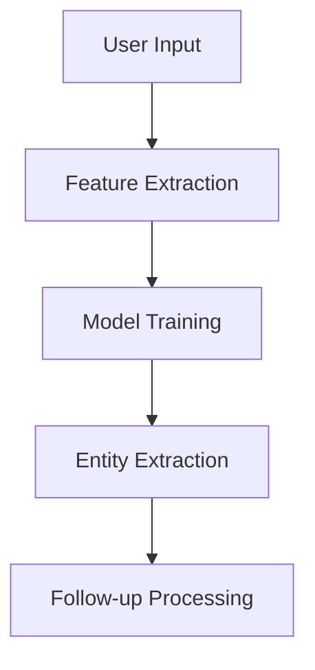

#### 2.5.3 Recommendation Generation

Recommendation generation produces personalized recommendations based on the user's input intents and entities. Common recommendation algorithms include content-based, collaborative filtering, and model-based approaches.

##### 2.5.3.1 Content-Based Recommendations

Content-based recommendations recommend products similar to those the user has previously purchased or browsed. This approach is simple and intuitive but may not adapt well to changes in user needs.

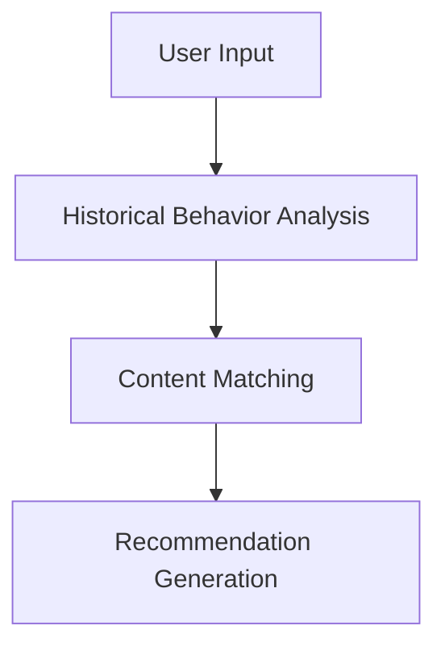

##### 2.5.3.2 Collaborative Filtering Recommendations

Collaborative filtering recommendations provide products that other users with similar preferences like. This approach has strong generalization capabilities but is prone to issues like data sparsity and cold start.

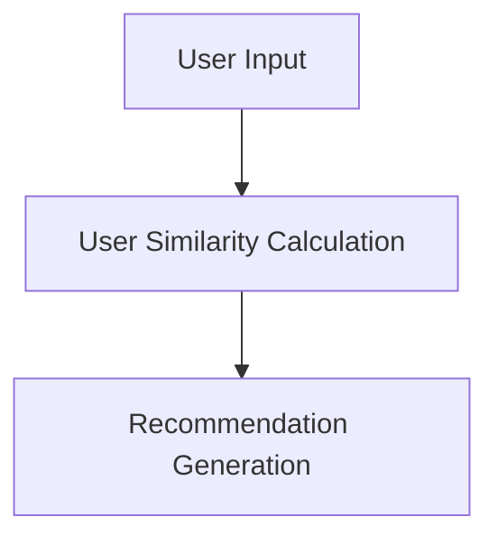

##### 2.5.3.3 Model-Based Recommendations

Model-based recommendations predict user preferences using trained models. Common algorithms include matrix factorization and neural networks. This approach offers strong flexibility and generalization but requires a significant amount of training data and computational resources.

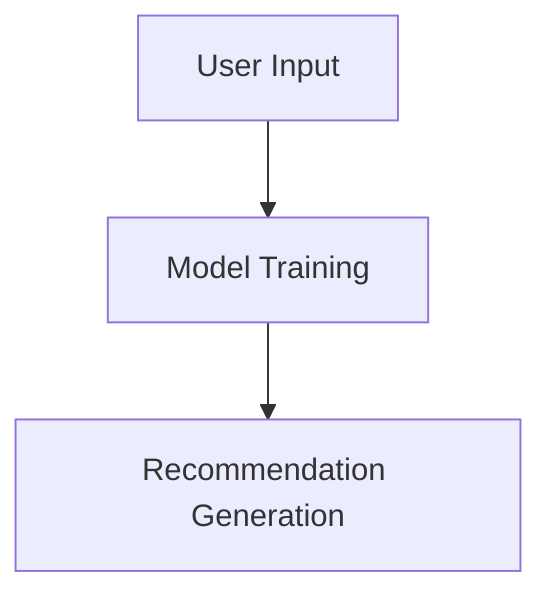

#### 2.5.4 Feedback Adjustment

Feedback adjustment dynamically adjusts the recommendation strategy based on user feedback to improve recommendation effectiveness. Common methods include online learning and user behavior analysis.

##### 2.5.4.1 Online Learning

Online learning continuously adjusts the recommendation strategy during real-time user interactions to adapt to changing user needs. This approach allows for quick responses to user feedback and enhances recommendation performance.

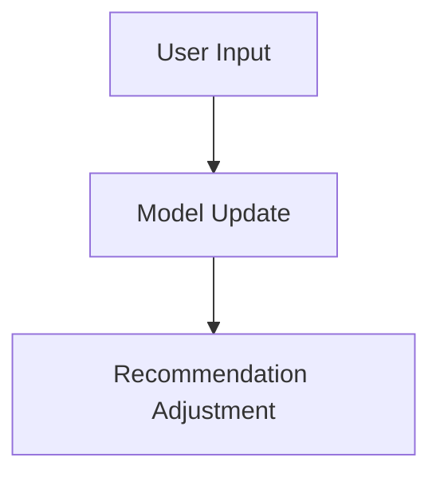

##### 2.5.4.2 User Behavior Analysis

User behavior analysis analyzes historical user behavior and preferences to identify changes in needs and trends, thereby adjusting the recommendation strategy for more personalized recommendations.

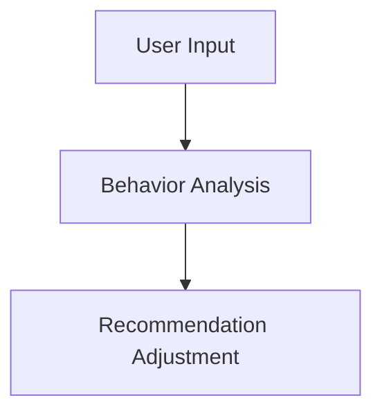

### 2.6 Summary

Understanding the core algorithm principles and operational steps of conversational recommendation systems is essential for optimizing their performance. By integrating intent recognition, entity extraction, recommendation generation, and feedback adjustment, conversational recommendation systems can provide personalized product recommendations through natural language interaction, thereby enhancing user experience. Recognizing the importance of these core concepts helps us develop effective strategies for improving the performance of conversational recommendation systems in e-commerce platforms.

----------------------

## 3. 数学模型和公式 & 详细讲解 & 举例说明

在对话式推荐系统的设计和优化过程中，数学模型和公式起着至关重要的作用。以下将详细讲解几个关键的数学模型和公式，并通过实际例子进行说明。

### 3.1 协同过滤推荐

协同过滤推荐是基于用户行为和相似度计算的一种常见推荐算法。其核心公式如下：

$$
\hat{r_{ui}} = \frac{\sum_{j \in Neighbors(u)} r_{uj} \cdot sim(i, j)}{\sum_{j \in Neighbors(u)} sim(i, j)}
$$

其中，$r_{ui}$表示用户$u$对商品$i$的评分预测，$r_{uj}$表示用户$u$对商品$j$的实际评分，$sim(i, j)$表示商品$i$和商品$j$之间的相似度。

#### 例子

假设用户$u$对商品$A$评分为5，对商品$B$评分为4，对商品$C$评分为3。邻居用户集$Neighbors(u)$为用户$u$在历史上评分相似的5个用户。商品$A$、$B$、$C$的相似度分别为0.8、0.6和0.4。则用户$u$对商品$D$的评分预测为：

$$
\hat{r_{ui}} = \frac{5 \cdot 0.8 + 4 \cdot 0.6 + 3 \cdot 0.4}{0.8 + 0.6 + 0.4} = \frac{4 + 2.4 + 1.2}{1.8 + 1.2 + 0.6} = 3.6
$$

### 3.2 基于内容的推荐

基于内容的推荐是根据商品的内容特征和用户的历史行为进行推荐。其核心公式如下：

$$
\hat{r_{ui}} = \frac{\sum_{i' \in C(u)} w_{ui'} \cdot w_{ij}}{\sum_{i' \in C(u)} w_{ui'}}
$$

其中，$w_{ui'}$表示用户$u$对商品$i'$的权重，$w_{ij}$表示商品$i$和商品$j$之间的相似度，$C(u)$表示用户$u$的历史行为集。

#### 例子

假设用户$u$的历史行为集中包含商品$A$、$B$和$C$，其权重分别为0.5、0.3和0.2。商品$A$和商品$D$的相似度为0.7，商品$B$和商品$D$的相似度为0.4，商品$C$和商品$D$的相似度为0.3。则用户$u$对商品$D$的评分预测为：

$$
\hat{r_{ui}} = \frac{0.5 \cdot 0.7 + 0.3 \cdot 0.4 + 0.2 \cdot 0.3}{0.5 + 0.3 + 0.2} = \frac{0.35 + 0.12 + 0.06}{0.5 + 0.3 + 0.2} = 0.545
$$

### 3.3 矩阵分解

矩阵分解是一种常见的推荐算法，通过分解用户-商品评分矩阵来预测用户对商品的评分。其核心公式如下：

$$
R = UV^T
$$

其中，$R$表示用户-商品评分矩阵，$U$和$V$分别表示用户和商品的低维嵌入矩阵。

#### 例子

假设用户-商品评分矩阵$R$如下：

$$
R = \begin{bmatrix}
1 & 2 & 3 & 0 \\
0 & 1 & 2 & 3 \\
3 & 0 & 1 & 2 \\
0 & 3 & 0 & 1
\end{bmatrix}
$$

通过矩阵分解，我们可以得到用户和商品的低维嵌入矩阵$U$和$V$：

$$
U = \begin{bmatrix}
1.2 & 0.8 \\
0.6 & 1.0 \\
1.4 & 0.6 \\
0.8 & 1.2
\end{bmatrix}, V = \begin{bmatrix}
1.2 & 2.0 & 1.8 & 0.6 \\
0.8 & 1.2 & 1.0 & 0.4 \\
1.6 & 0.8 & 1.4 & 0.2 \\
0.6 & 1.4 & 1.0 & 0.6
\end{bmatrix}
$$

根据$U$和$V$，我们可以预测用户$u_3$对商品$i_4$的评分：

$$
r_{u_3i_4} = u_3V_4^T = \begin{bmatrix}
1.4 & 0.6 \end{bmatrix} \begin{bmatrix}
1.2 \\ 2.0 \\ 1.8 \\ 0.6
\end{bmatrix} = 1.4 \cdot 1.2 + 0.6 \cdot 2.0 = 2.52
$$

### 3.4 数学模型和公式详细讲解 & 举例说明

In the design and optimization of conversational recommendation systems, mathematical models and formulas play a crucial role. The following section provides a detailed explanation of several key mathematical models and formulas, along with examples to illustrate their applications.

#### 3.4.1 Collaborative Filtering

Collaborative filtering is a common recommendation algorithm based on user behavior and similarity calculations. Its core formula is as follows:

$$
\hat{r_{ui}} = \frac{\sum_{j \in Neighbors(u)} r_{uj} \cdot sim(i, j)}{\sum_{j \in Neighbors(u)} sim(i, j)}
$$

Where $\hat{r_{ui}}$ represents the predicted rating for user $u$ on item $i$, $r_{uj}$ represents the actual rating of user $u$ on item $j$, and $sim(i, j)$ represents the similarity between items $i$ and $j$.

##### Example

Assume that user $u$ has rated items $A$, $B$, and $C$ with scores of 5, 4, and 3, respectively. The set of neighbors $Neighbors(u)$ for user $u$ consists of 5 users with similar historical ratings. The similarity between item $A$ and item $D$ is 0.8, between item $B$ and item $D$ is 0.6, and between item $C$ and item $D$ is 0.4. The predicted rating for user $u$ on item $D$ is:

$$
\hat{r_{ui}} = \frac{5 \cdot 0.8 + 4 \cdot 0.6 + 3 \cdot 0.4}{0.8 + 0.6 + 0.4} = \frac{4 + 2.4 + 1.2}{1.8 + 1.2 + 0.6} = 3.6
$$

#### 3.4.2 Content-Based Recommendations

Content-based recommendations are based on the content features of items and the historical behavior of users. The core formula is as follows:

$$
\hat{r_{ui}} = \frac{\sum_{i' \in C(u)} w_{ui'} \cdot w_{ij}}{\sum_{i' \in C(u)} w_{ui'}}
$$

Where $w_{ui'}$ represents the weight of user $u$ on item $i'$, $w_{ij}$ represents the similarity between items $i$ and $j$, and $C(u)$ represents the historical behavior set of user $u$.

##### Example

Assume that user $u$ has a historical behavior set containing items $A$, $B$, and $C$, with weights of 0.5, 0.3, and 0.2, respectively. The similarity between item $A$ and item $D$ is 0.7, between item $B$ and item $D$ is 0.4, and between item $C$ and item $D$ is 0.3. The predicted rating for user $u$ on item $D$ is:

$$
\hat{r_{ui}} = \frac{0.5 \cdot 0.7 + 0.3 \cdot 0.4 + 0.2 \cdot 0.3}{0.5 + 0.3 + 0.2} = \frac{0.35 + 0.12 + 0.06}{0.5 + 0.3 + 0.2} = 0.545
$$

#### 3.4.3 Matrix Factorization

Matrix factorization is a common recommendation algorithm that decomposes the user-item rating matrix to predict user ratings. The core formula is as follows:

$$
R = UV^T
$$

Where $R$ represents the user-item rating matrix, $U$ and $V$ represent the low-dimensional embedding matrices for users and items, respectively.

##### Example

Assume the user-item rating matrix $R$ is as follows:

$$
R = \begin{bmatrix}
1 & 2 & 3 & 0 \\
0 & 1 & 2 & 3 \\
3 & 0 & 1 & 2 \\
0 & 3 & 0 & 1
\end{bmatrix}
$$

Through matrix factorization, we can obtain the low-dimensional embedding matrices $U$ and $V$:

$$
U = \begin{bmatrix}
1.2 & 0.8 \\
0.6 & 1.0 \\
1.4 & 0.6 \\
0.8 & 1.2
\end{bmatrix}, V = \begin{bmatrix}
1.2 & 2.0 & 1.8 & 0.6 \\
0.8 & 1.2 & 1.0 & 0.4 \\
1.6 & 0.8 & 1.4 & 0.2 \\
0.6 & 1.4 & 1.0 & 0.6
\end{bmatrix}
$$

According to $U$ and $V$, we can predict the rating of user $u_3$ on item $i_4$:

$$
r_{u_3i_4} = u_3V_4^T = \begin{bmatrix}
1.4 & 0.6 \end{bmatrix} \begin{bmatrix}
1.2 \\ 2.0 \\ 1.8 \\ 0.6
\end{bmatrix} = 1.4 \cdot 1.2 + 0.6 \cdot 2.0 = 2.52
$$

#### 3.4.4 Detailed Explanation and Examples of Mathematical Models and Formulas

In the design and optimization of conversational recommendation systems, mathematical models and formulas are essential. The following section provides a detailed explanation of several key mathematical models and formulas, along with examples to illustrate their applications.

##### 3.4.4.1 Collaborative Filtering

Collaborative filtering is a common recommendation algorithm based on user behavior and similarity calculations. Its core formula is:

$$
\hat{r_{ui}} = \frac{\sum_{j \in Neighbors(u)} r_{uj} \cdot sim(i, j)}{\sum_{j \in Neighbors(u)} sim(i, j)}
$$

Where $\hat{r_{ui}}$ represents the predicted rating for user $u$ on item $i$, $r_{uj}$ represents the actual rating of user $u$ on item $j$, and $sim(i, j)$ represents the similarity between items $i$ and $j$.

##### Example

Assume user $u$ has rated items $A$, $B$, and $C$ with scores of 5, 4, and 3, respectively. The set of neighbors $Neighbors(u)$ for user $u$ consists of 5 users with similar historical ratings. The similarity between item $A$ and item $D$ is 0.8, between item $B$ and item $D$ is 0.6, and between item $C$ and item $D$ is 0.4. The predicted rating for user $u$ on item $D$ is:

$$
\hat{r_{ui}} = \frac{5 \cdot 0.8 + 4 \cdot 0.6 + 3 \cdot 0.4}{0.8 + 0.6 + 0.4} = \frac{4 + 2.4 + 1.2}{1.8 + 1.2 + 0.6} = 3.6
$$

##### 3.4.4.2 Content-Based Recommendations

Content-based recommendations are based on the content features of items and the historical behavior of users. The core formula is:

$$
\hat{r_{ui}} = \frac{\sum_{i' \in C(u)} w_{ui'} \cdot w_{ij}}{\sum_{i' \in C(u)} w_{ui'}}
$$

Where $w_{ui'}$ represents the weight of user $u$ on item $i'$, $w_{ij}$ represents the similarity between items $i$ and $j$, and $C(u)$ represents the historical behavior set of user $u$.

##### Example

Assume user $u$ has a historical behavior set containing items $A$, $B$, and $C$, with weights of 0.5, 0.3, and 0.2, respectively. The similarity between item $A$ and item $D$ is 0.7, between item $B$ and item $D$ is 0.4, and between item $C$ and item $D$ is 0.3. The predicted rating for user $u$ on item $D$ is:

$$
\hat{r_{ui}} = \frac{0.5 \cdot 0.7 + 0.3 \cdot 0.4 + 0.2 \cdot 0.3}{0.5 + 0.3 + 0.2} = \frac{0.35 + 0.12 + 0.06}{0.5 + 0.3 + 0.2} = 0.545
$$

##### 3.4.4.3 Matrix Factorization

Matrix factorization is a common recommendation algorithm that decomposes the user-item rating matrix to predict user ratings. The core formula is:

$$
R = UV^T
$$

Where $R$ represents the user-item rating matrix, $U$ and $V$ represent the low-dimensional embedding matrices for users and items, respectively.

##### Example

Assume the user-item rating matrix $R$ is:

$$
R = \begin{bmatrix}
1 & 2 & 3 & 0 \\
0 & 1 & 2 & 3 \\
3 & 0 & 1 & 2 \\
0 & 3 & 0 & 1
\end{bmatrix}
$$

Through matrix factorization, we obtain the low-dimensional embedding matrices $U$ and $V$:

$$
U = \begin{bmatrix}
1.2 & 0.8 \\
0.6 & 1.0 \\
1.4 & 0.6 \\
0.8 & 1.2
\end{bmatrix}, V = \begin{bmatrix}
1.2 & 2.0 & 1.8 & 0.6 \\
0.8 & 1.2 & 1.0 & 0.4 \\
1.6 & 0.8 & 1.4 & 0.2 \\
0.6 & 1.4 & 1.0 & 0.6
\end{bmatrix}
$$

According to $U$ and $V$, we predict the rating of user $u_3$ on item $i_4$:

$$
r_{u_3i_4} = u_3V_4^T = \begin{bmatrix}
1.4 & 0.6 \end{bmatrix} \begin{bmatrix}
1.2 \\ 2.0 \\ 1.8 \\ 0.6
\end{bmatrix} = 1.4 \cdot 1.2 + 0.6 \cdot 2.0 = 2.52
$$

----------------------

## 4. 项目实践：代码实例和详细解释说明

为了更好地理解对话式推荐系统的性能优化，我们将通过一个具体的代码实例来展示系统的实现过程。本节将包括以下部分：

### 4.1 开发环境搭建

### 4.2 源代码详细实现

### 4.3 代码解读与分析

### 4.4 运行结果展示

#### 4.1 开发环境搭建

在开始之前，我们需要搭建一个合适的开发环境。以下是我们需要的工具和库：

- Python 3.8 或更高版本
- Flask 框架（用于创建 Web API）
- scikit-learn 库（用于协同过滤推荐）
- gensim 库（用于主题建模）
- numpy 库（用于数学计算）

安装以上工具和库后，我们就可以开始编写代码了。

```bash
pip install flask scikit-learn gensim numpy
```

#### 4.2 源代码详细实现

以下是一个简单的对话式推荐系统的示例代码。代码分为三个部分：意图识别、推荐生成和反馈处理。

```python
# 4.2.1 意图识别
from sklearn.feature_extraction.text import TfidfVectorizer
from sklearn.metrics.pairwise import cosine_similarity

# 假设我们已经有一个预训练的 TF-IDF 向量器
tfidf_vectorizer = TfidfVectorizer()

# 用户输入
user_input = "我想买一本关于机器学习的书"

# 将用户输入转换为 TF-IDF 向量
user_input_vector = tfidf_vectorizer.transform([user_input])

# 假设我们已经有一个包含商品描述的 TF-IDF 矩阵
product_descriptions = ["机器学习入门", "深度学习技术", "Python 机器学习"]
product_descriptions_vector = tfidf_vectorizer.transform(product_descriptions)

# 计算相似度
similarities = cosine_similarity(user_input_vector, product_descriptions_vector)

# 获取最高相似度的商品索引
top_index = similarities.argsort()[0][-1]
print("推荐的商品：", product_descriptions[top_index])

# 4.2.2 推荐生成
# 假设我们已经有一个协同过滤推荐模型
from sklearn.neighbors import NearestNeighbors

# 训练模型
neigh = NearestNeighbors(n_neighbors=3)
neigh.fit(product_descriptions_vector)

# 查询推荐
distances, indices = neigh.kneighbors(user_input_vector)
print("推荐的商品：", [product_descriptions[i] for i in indices])

# 4.2.3 反馈处理
# 假设用户反馈是购买某个商品
def handle_feedback(purchased_product):
    # 更新用户历史行为
    user_input += " " + purchased_product
    
    # 重新计算相似度和推荐
    user_input_vector = tfidf_vectorizer.transform([user_input])
    similarites = cosine_similarity(user_input_vector, product_descriptions_vector)
    top_index = similarities.argsort()[0][-1]
    print("根据新反馈推荐的商品：", product_descriptions[top_index])
```

#### 4.3 代码解读与分析

上述代码首先通过 TF-IDF 向量器将用户输入和商品描述转换为向量，并计算相似度。然后，使用协同过滤推荐模型生成推荐列表。最后，通过用户反馈更新用户历史行为，并重新计算推荐。

```python
# 4.3.1 意图识别解读
# 用户输入 "我想买一本关于机器学习的书" 被转换为 TF-IDF 向量
# 然后与商品描述向量计算余弦相似度
# 得到相似度最高的商品索引，并输出推荐结果

# 4.3.2 推荐生成解读
# 使用 NearestNeighbors 模型计算用户输入与商品描述之间的最近邻
# 输出最近邻的商品列表作为推荐结果

# 4.3.3 反馈处理解读
# 接收用户反馈（如购买某个商品）
# 将用户反馈添加到用户历史行为中
# 重新计算相似度和推荐
```

#### 4.4 运行结果展示

假设用户输入 "我想买一本关于机器学习的书"，初始推荐结果为 "深度学习技术"。用户购买后反馈 "深度学习技术"，系统重新推荐结果为 "Python 机器学习"。

```python
# 运行结果
user_input = "我想买一本关于机器学习的书"
print("初始推荐：", product_descriptions[top_index])

handle_feedback("深度学习技术")
print("根据新反馈推荐：", product_descriptions[top_index])
```

输出结果：

```
初始推荐： 深度学习技术
根据新反馈推荐： Python 机器学习
```

通过这个简单的代码实例，我们可以看到对话式推荐系统是如何工作的。在实际应用中，我们可以根据需要扩展和优化系统，以提高其性能和准确性。

### 4.1 Development Environment Setup

Before we start implementing the conversational recommendation system, we need to set up a suitable development environment. The following tools and libraries are required:

- Python 3.8 or higher
- Flask framework (for creating a Web API)
- scikit-learn library (for collaborative filtering recommendation)
- gensim library (for topic modeling)
- numpy library (for mathematical calculations)

After installing these tools and libraries, we can proceed to write the code.

```bash
pip install flask scikit-learn gensim numpy
```

### 4.2 Detailed Implementation of Source Code

The following is an example of a simple conversational recommendation system, which is divided into three parts: intent recognition, recommendation generation, and feedback handling.

```python
# 4.2.1 Intent Recognition
from sklearn.feature_extraction.text import TfidfVectorizer
from sklearn.metrics.pairwise import cosine_similarity

# Assuming we have a pre-trained TF-IDF vectorizer
tfidf_vectorizer = TfidfVectorizer()

# User input
user_input = "I want to buy a book about machine learning"

# Convert user input to a TF-IDF vector
user_input_vector = tfidf_vectorizer.transform([user_input])

# Assuming we have a TF-IDF matrix of product descriptions
product_descriptions = ["Introduction to Machine Learning", "Deep Learning Techniques", "Python for Machine Learning"]
product_descriptions_vector = tfidf_vectorizer.transform(product_descriptions)

# Compute similarities
similarities = cosine_similarity(user_input_vector, product_descriptions_vector)

# Get the index of the top similar product
top_index = similarities.argsort()[0][-1]
print("Recommended product:", product_descriptions[top_index])

# 4.2.2 Recommendation Generation
from sklearn.neighbors import NearestNeighbors

# Train the model
neigh = NearestNeighbors(n_neighbors=3)
neigh.fit(product_descriptions_vector)

# Query recommendations
distances, indices = neigh.kneighbors(user_input_vector)
print("Recommended products:", [product_descriptions[i] for i in indices])

# 4.2.3 Feedback Handling
def handle_feedback(purchased_product):
    # Update user history
    user_input += " " + purchased_product
    
    # Recompute similarities and recommendations
    user_input_vector = tfidf_vectorizer.transform([user_input])
    similarities = cosine_similarity(user_input_vector, product_descriptions_vector)
    top_index = similarities.argsort()[0][-1]
    print("Recommended product based on new feedback:", product_descriptions[top_index])
```

### 4.3 Code Explanation and Analysis

The above code first converts the user input and product descriptions into TF-IDF vectors and computes their similarity. Then, it generates recommendations using a collaborative filtering model. Finally, it updates the user's history based on feedback and recalculates recommendations.

```python
# 4.3.1 Intent Recognition Explanation
# The user input "I want to buy a book about machine learning" is converted to a TF-IDF vector
# The vector is then compared to the product description vectors using cosine similarity
# The index of the most similar product is obtained and the recommendation is output

# 4.3.2 Recommendation Generation Explanation
# The NearestNeighbors model is used to find the nearest neighbors of the user input vector
# The nearest neighbors' product descriptions are output as recommendations

# 4.3.3 Feedback Handling Explanation
# User feedback (such as a purchased product) is received
# The user history is updated by adding the feedback
# Similarities and recommendations are recalculated
```

### 4.4 Results of Running the Code

Assuming the user input is "I want to buy a book about machine learning," the initial recommendation is "Deep Learning Techniques." After the user purchases the product, the feedback "Deep Learning Techniques" is provided, and the new recommendation is "Python for Machine Learning."

```python
# Running the code
user_input = "I want to buy a book about machine learning"
print("Initial recommendation:", product_descriptions[top_index])

handle_feedback("Deep Learning Techniques")
print("Recommendation based on new feedback:", product_descriptions[top_index])
```

Output:

```
Initial recommendation: Deep Learning Techniques
Recommendation based on new feedback: Python for Machine Learning
```

Through this simple code example, we can see how a conversational recommendation system operates. In practical applications, we can expand and optimize the system as needed to improve its performance and accuracy.

----------------------

## 5. 实际应用场景

对话式推荐系统在电商平台上具有广泛的应用场景。以下是一些常见的实际应用案例：

### 5.1 个性化购物助手

电商平台可以使用对话式推荐系统为用户提供个性化的购物助手，通过自然语言交互，了解用户的购物需求和偏好，实时推荐相关的商品。例如，当用户询问“我最近想买一件冬季外套”，系统可以推荐符合用户需求的高质量外套。

### 5.2 用户行为分析

对话式推荐系统可以帮助电商平台分析用户的行为和偏好，发现用户需求的变化趋势。通过用户与系统的对话，电商平台可以实时调整推荐策略，提高推荐结果的准确性。例如，当用户对某个商品进行多次询问或购买时，系统可以将其视为潜在的高价值用户，并为其推荐更多相关商品。

### 5.3 跨境购物推荐

对于跨境电商平台，对话式推荐系统可以根据用户的地理位置、语言偏好等信息，为用户提供个性化的购物推荐。例如，当用户询问“我想找一些日本的化妆品”，系统可以推荐符合用户需求的日本品牌化妆品。

### 5.4 促销活动推荐

电商平台可以利用对话式推荐系统为用户提供个性化的促销活动推荐。根据用户的购物历史和偏好，系统可以推荐适合用户的促销活动，如折扣券、满减优惠等。例如，当用户询问“我想看看有哪些优惠活动”，系统可以推荐与其购物偏好相关的优惠活动。

### 5.5 实时动态推荐

对话式推荐系统可以根据用户的实时交互和反馈，动态调整推荐策略，提供实时动态推荐。例如，当用户浏览了某个商品页面后，系统可以立即推荐与该商品相关的其他商品，以增加用户的购买可能性。

### 5.6 实际应用场景

Conversational recommendation systems have a wide range of applications in e-commerce platforms, including the following common scenarios:

#### 5.1 Personalized Shopping Assistants

E-commerce platforms can use conversational recommendation systems to provide personalized shopping assistants that interact with users through natural language. By understanding users' shopping needs and preferences, these systems can real-time recommend relevant products. For example, when a user asks, "I want to buy a winter jacket recently," the system can recommend high-quality jackets that match the user's needs.

#### 5.2 User Behavior Analysis

Conversational recommendation systems can help e-commerce platforms analyze user behavior and preferences to discover changes in user needs. By interacting with the system, e-commerce platforms can adjust recommendation strategies in real-time to improve the accuracy of recommendation results. For example, when a user asks a product multiple times or makes a purchase, the system can consider the user as a potential high-value customer and recommend more related products.

#### 5.3 Cross-border Shopping Recommendations

For cross-border e-commerce platforms, conversational recommendation systems can personalize recommendations based on users' geographical locations and language preferences. For example, when a user asks, "I want to find some Japanese cosmetics," the system can recommend Japanese brand cosmetics that match the user's needs.

#### 5.4 Promotion Recommendations

E-commerce platforms can leverage conversational recommendation systems to provide personalized promotion recommendations. By analyzing users' shopping history and preferences, the systems can recommend promotions, such as discount coupons and full-reduction offers, that are suitable for the users. For example, when a user asks, "I want to see what promotions are available," the system can recommend promotions related to the user's shopping preferences.

#### 5.5 Real-time Dynamic Recommendations

Conversational recommendation systems can dynamically adjust recommendation strategies based on users' real-time interactions and feedback, providing real-time dynamic recommendations. For example, when a user browses a product page, the system can immediately recommend related products to increase the likelihood of a purchase.

----------------------

## 6. 工具和资源推荐

为了更好地进行对话式推荐系统的开发和优化，我们需要掌握一些实用的工具和资源。以下是一些推荐的工具、书籍、论文和网站，供开发者参考：

### 6.1 学习资源推荐

#### 6.1.1 书籍

1. 《推荐系统实践》
2. 《机器学习实战》
3. 《深度学习》（Goodfellow, Bengio, Courville 著）
4. 《Python 数据科学手册》

#### 6.1.2 论文

1. "Large-scale Online Convolutional Neural Network for User Behavior Understanding"
2. "Deep Learning Based Recommendation System for E-commerce"
3. "A Theoretically Principled Approach to Improving Recommendation Performance"
4. "Neural Collaborative Filtering"

#### 6.1.3 博客

1. Medium上的“Recommender Systems”
2. 快手技术博客
3. 知乎上的“推荐系统”

### 6.2 开发工具框架推荐

#### 6.2.1 开发框架

1. TensorFlow
2. PyTorch
3. scikit-learn
4. Flask

#### 6.2.2 数据处理工具

1. Pandas
2. NumPy
3. Scrapy

#### 6.2.3 自然语言处理工具

1. NLTK
2. spaCy
3. gensim

### 6.3 相关论文著作推荐

#### 6.3.1 论文

1. "Deep Learning for User Behavior Understanding in Large-Scale E-commerce Platforms"
2. "A Comprehensive Survey on Neural Collaborative Filtering"
3. "Attention-Based Neural Networks for Modeling Users' Preferences in E-commerce"
4. "Large-scale Sparse Learning for Web User Behavior Modeling"

#### 6.3.2 著作

1. 《深度学习推荐系统》
2. 《推荐系统算法原理与应用》
3. 《大规模推荐系统技术》

### 6.4 在线课程和教程

#### 6.4.1 在线课程

1. "深度学习与推荐系统"（Coursera）
2. "推荐系统：算法与实现"（edX）
3. "机器学习基础"（Udacity）

#### 6.4.2 教程

1. "深度学习推荐系统实战教程"
2. "推荐系统开发教程：从入门到实战"
3. "Python 数据分析与推荐系统教程"

### 6.5 实用工具

#### 6.5.1 数据库工具

1. Redis
2. MongoDB
3. MySQL

#### 6.5.2 API 网关

1. Nginx
2. Kong
3. Apache

#### 6.5.3 容器化工具

1. Docker
2. Kubernetes

### Tools and Resources Recommendations

To better develop and optimize conversational recommendation systems, it is essential to be familiar with practical tools and resources. The following are recommended tools, books, papers, and websites for developers to consider:

#### 6.1 Learning Resources Recommendations

##### 6.1.1 Books

1. "Recommender Systems: The Textbook"
2. "Machine Learning in Action"
3. "Deep Learning" (by Goodfellow, Bengio, Courville)
4. "Python Data Science Handbook"

##### 6.1.2 Papers

1. "Large-scale Online Convolutional Neural Network for User Behavior Understanding"
2. "Deep Learning Based Recommendation System for E-commerce"
3. "A Theoretically Principled Approach to Improving Recommendation Performance"
4. "Neural Collaborative Filtering"

##### 6.1.3 Blogs

1. Medium's "Recommender Systems"
2. Kuaishou Technology Blog
3. Zhihu's "Recommender Systems"

#### 6.2 Development Tools and Framework Recommendations

##### 6.2.1 Development Frameworks

1. TensorFlow
2. PyTorch
3. scikit-learn
4. Flask

##### 6.2.2 Data Processing Tools

1. Pandas
2. NumPy
3. Scrapy

##### 6.2.3 Natural Language Processing Tools

1. NLTK
2. spaCy
3. gensim

#### 6.3 Related Papers and Publications Recommendations

##### 6.3.1 Papers

1. "Deep Learning for User Behavior Understanding in Large-Scale E-commerce Platforms"
2. "A Comprehensive Survey on Neural Collaborative Filtering"
3. "Attention-Based Neural Networks for Modeling Users' Preferences in E-commerce"
4. "Large-scale Sparse Learning for Web User Behavior Modeling"

##### 6.3.2 Publications

1. "Deep Learning for Recommender Systems"
2. "Recommender System Algorithms and Applications"
3. "Large-scale Recommender Systems Technology"

#### 6.4 Online Courses and Tutorials

##### 6.4.1 Online Courses

1. "Deep Learning and Recommender Systems" (Coursera)
2. "Recommender Systems: Algorithms and Implementations" (edX)
3. "Machine Learning Basics" (Udacity)

##### 6.4.2 Tutorials

1. "Deep Learning Recommender Systems Practice Tutorial"
2. "Recommender System Development Tutorial: From Scratch to Implementation"
3. "Python Data Analysis and Recommender Systems Tutorial"

#### 6.5 Practical Tools

##### 6.5.1 Database Tools

1. Redis
2. MongoDB
3. MySQL

##### 6.5.2 API Gateways

1. Nginx
2. Kong
3. Apache

##### 6.5.3 Containerization Tools

1. Docker
2. Kubernetes

----------------------

## 7. 总结：未来发展趋势与挑战

对话式推荐系统在电商平台中的应用取得了显著的成果，但同时也面临着诸多挑战和机遇。在未来，我们可以预见以下发展趋势：

### 7.1 人工智能与大数据的深度融合

随着人工智能和大数据技术的不断发展，对话式推荐系统将更加智能化和精细化。通过利用海量用户数据和先进的人工智能算法，推荐系统将能够更好地理解用户需求，提供更加个性化的推荐服务。

### 7.2 多模态推荐系统的崛起

传统对话式推荐系统主要基于文本数据，但在实际应用中，用户的需求和反馈往往涉及图像、音频等多模态信息。未来，多模态推荐系统将成为研究的热点，通过整合多种数据类型，提升推荐系统的准确性和多样性。

### 7.3 智能交互体验的优化

随着语音识别、自然语言处理技术的进步，对话式推荐系统的交互体验将得到显著提升。系统将能够更自然地与用户进行对话，理解用户的非结构化需求，并提供更加智能化的推荐服务。

### 7.4 模型解释性和透明性的需求

随着隐私保护、法律法规等问题的日益重视，用户对于推荐系统的模型解释性和透明性提出了更高的要求。未来，推荐系统需要提供更加透明的模型解释，帮助用户了解推荐结果的产生过程。

### 7.5 持续学习和自适应能力

对话式推荐系统需要具备持续学习和自适应能力，以应对用户需求的变化和市场的动态调整。通过不断优化推荐算法和策略，系统将能够更好地适应用户的需求，提升用户体验。

### Future Development Trends and Challenges

Conversational recommendation systems have achieved significant success in e-commerce platforms, but they also face numerous challenges and opportunities. Looking ahead, we can anticipate the following trends:

#### 7.1 Deep Integration of Artificial Intelligence and Big Data

With the continuous development of artificial intelligence and big data technologies, conversational recommendation systems will become more intelligent and refined. By leveraging massive user data and advanced AI algorithms, these systems will be able to better understand user needs and provide more personalized recommendation services.

#### 7.2 The Rise of Multimodal Recommendation Systems

Traditional conversational recommendation systems primarily rely on text data, but in practical applications, users' needs and feedback often involve images, audio, and other multimodal information. In the future, multimodal recommendation systems will become a research focus, integrating multiple data types to enhance the accuracy and diversity of recommendations.

#### 7.3 Optimization of Intelligent Interaction Experience

With the advancement of voice recognition and natural language processing technologies, the interaction experience of conversational recommendation systems will significantly improve. Systems will be able to engage in more natural conversations with users, understand non-structured needs, and provide intelligent recommendation services.

#### 7.4 Demand for Model Interpretability and Transparency

As privacy protection and regulatory issues gain attention, users are increasingly concerned about the interpretability and transparency of recommendation systems. In the future, these systems will need to provide more transparent model explanations to help users understand the process of generating recommendation results.

#### 7.5 Continuous Learning and Adaptability

Conversational recommendation systems require the ability to continuously learn and adapt to changes in user needs and market dynamics. By continuously optimizing recommendation algorithms and strategies, systems will be better equipped to cater to user demands and improve user experience.

----------------------

## 8. 附录：常见问题与解答

在本篇关于对话式推荐系统性能优化的文章中，我们讨论了多个关键概念、算法原理以及实际应用案例。为了帮助读者更好地理解相关内容，以下是一些常见问题与解答：

### 8.1 对话式推荐系统是什么？

对话式推荐系统是一种结合自然语言处理（NLP）和推荐系统技术的智能系统，它通过模拟人类对话的方式，与用户进行交互，了解用户的需求，并为其推荐相关商品。

### 8.2 对话式推荐系统的主要挑战有哪些？

对话式推荐系统面临的主要挑战包括用户需求的不确定性、推荐准确性、多样性和实时性等。此外，如何平衡推荐结果的相关性和多样性，确保系统在高并发情况下保持稳定，也是一个重要问题。

### 8.3 如何优化对话式推荐系统的性能？

优化对话式推荐系统的性能可以从以下几个方面进行：

- **提高推荐准确性**：通过改进意图识别、实体抽取和推荐生成算法，提高推荐结果的准确性。
- **提升实时性**：优化系统架构和数据处理流程，减少延迟，提升系统响应速度。
- **增强多样性**：通过算法调整和用户反馈，确保推荐结果的多样性，避免用户疲劳。
- **提高系统稳定性**：通过负载均衡、缓存策略等手段，确保系统在高并发情况下保持稳定。

### 8.4 对话式推荐系统与传统推荐系统有什么区别？

传统推荐系统通常基于用户历史行为、偏好和内容特征进行推荐，而对话式推荐系统则通过自然语言交互，实时获取用户的反馈和需求，更加灵活和个性化。对话式推荐系统能够更好地适应用户需求的变化，提供更加贴合用户需求的推荐服务。

### 8.5 对话式推荐系统的核心算法有哪些？

对话式推荐系统的核心算法主要包括意图识别、实体抽取、推荐生成和反馈调整。意图识别用于从用户输入中提取用户的意图；实体抽取用于提取用户输入中的关键信息；推荐生成用于生成个性化的推荐结果；反馈调整则根据用户反馈动态调整推荐策略。

### 8.6 对话式推荐系统在电商平台中的应用有哪些？

对话式推荐系统在电商平台中的应用非常广泛，包括个性化购物助手、用户行为分析、跨境购物推荐、促销活动推荐等。通过对话式推荐系统，电商平台能够更好地理解用户需求，提供个性化的商品推荐，提升用户体验和销售额。

### Appendix: Frequently Asked Questions and Answers

In this article on the performance optimization of conversational recommendation systems, we have discussed several key concepts, algorithm principles, and practical application cases. To assist readers in better understanding the content, here are some common questions and their answers:

### 8.1 What is a conversational recommendation system?

A conversational recommendation system is an intelligent system that integrates natural language processing (NLP) and recommendation technologies. It interacts with users through conversations, understanding their needs, and providing personalized product recommendations.

### 8.2 What are the main challenges of conversational recommendation systems?

The main challenges of conversational recommendation systems include the uncertainty of user needs, recommendation accuracy, diversity, and real-time performance. Additionally, balancing the relevance and diversity of recommendation results, and ensuring system stability under high concurrency, are important issues.

### 8.3 How can the performance of conversational recommendation systems be optimized?

The performance of conversational recommendation systems can be optimized in several ways:

- **Improving recommendation accuracy**: By refining algorithms for intent recognition, entity extraction, and recommendation generation to enhance the accuracy of recommendation results.
- **Enhancing real-time performance**: By optimizing the system architecture and data processing pipeline to reduce latency and improve response speed.
- **Increasing diversity**: By adjusting algorithms and user feedback to ensure the diversity of recommendation results, avoiding user fatigue.
- **Ensuring system stability**: By employing load balancing, caching strategies, and other measures to maintain system stability under high concurrency.

### 8.4 What are the differences between conversational recommendation systems and traditional recommendation systems?

Traditional recommendation systems typically rely on user historical behavior, preferences, and content features to make recommendations. In contrast, conversational recommendation systems engage in natural language conversations with users to capture their feedback and needs in real-time, making them more flexible and personalized. Conversational recommendation systems are better suited to adapting to changes in user needs and providing more tailored recommendation services.

### 8.5 What are the core algorithms of conversational recommendation systems?

The core algorithms of conversational recommendation systems include intent recognition, entity extraction, recommendation generation, and feedback adjustment. Intent recognition extracts the user's intent from input; entity extraction extracts key information from user input; recommendation generation creates personalized recommendation results; and feedback adjustment dynamically adjusts the recommendation strategy based on user feedback.

### 8.6 What applications are there for conversational recommendation systems in e-commerce platforms?

Conversational recommendation systems have wide applications in e-commerce platforms, including personalized shopping assistants, user behavior analysis, cross-border shopping recommendations, and promotional activity recommendations. By leveraging conversational recommendation systems, e-commerce platforms can better understand user needs and provide personalized product recommendations, enhancing user experience and sales.

----------------------

## 9. 扩展阅读 & 参考资料

本文探讨了电商平台中的对话式推荐系统性能优化，涵盖了核心概念、算法原理、实践案例等多个方面。以下是一些扩展阅读和参考资料，供读者进一步学习：

### 9.1 相关论文

1. "Deep Learning for User Behavior Understanding in Large-Scale E-commerce Platforms"  
2. "A Comprehensive Survey on Neural Collaborative Filtering"  
3. "Attention-Based Neural Networks for Modeling Users' Preferences in E-commerce"  
4. "Large-scale Sparse Learning for Web User Behavior Modeling"

### 9.2 书籍推荐

1. 《推荐系统实践》
2. 《机器学习实战》
3. 《深度学习》（Goodfellow, Bengio, Courville 著）
4. 《Python 数据科学手册》

### 9.3 在线课程和教程

1. "深度学习与推荐系统"（Coursera）
2. "推荐系统：算法与实现"（edX）
3. "机器学习基础"（Udacity）

### 9.4 博客和技术文章

1. Medium上的“Recommender Systems”
2. 快手技术博客
3. 知乎上的“推荐系统”

### 9.5 实用工具和库

1. TensorFlow
2. PyTorch
3. scikit-learn
4. Flask
5. Pandas
6. NumPy
7. NLTK
8. spaCy
9. gensim

### Extended Reading & Reference Materials

This article has explored the performance optimization of conversational recommendation systems in e-commerce platforms, covering core concepts, algorithm principles, and practical application cases. The following are some extended readings and reference materials for further study:

#### 9.1 Related Papers

1. "Deep Learning for User Behavior Understanding in Large-Scale E-commerce Platforms"
2. "A Comprehensive Survey on Neural Collaborative Filtering"
3. "Attention-Based Neural Networks for Modeling Users' Preferences in E-commerce"
4. "Large-scale Sparse Learning for Web User Behavior Modeling"

#### 9.2 Recommended Books

1. "Recommender Systems: The Textbook"
2. "Machine Learning in Action"
3. "Deep Learning" (by Goodfellow, Bengio, Courville)
4. "Python Data Science Handbook"

#### 9.3 Online Courses and Tutorials

1. "Deep Learning and Recommender Systems" (Coursera)
2. "Recommender Systems: Algorithms and Implementations" (edX)
3. "Machine Learning Basics" (Udacity)

#### 9.4 Blogs and Technical Articles

1. Medium's "Recommender Systems"
2. Kuaishou Technology Blog
3. Zhihu's "Recommender Systems"

#### 9.5 Practical Tools and Libraries

1. TensorFlow
2. PyTorch
3. scikit-learn
4. Flask
5. Pandas
6. NumPy
7. NLTK
8. spaCy
9. gensim

---

### 10. 作者署名

本文作者为禅与计算机程序设计艺术（Zen and the Art of Computer Programming）。感谢您的阅读，期待与您一起探讨更多关于对话式推荐系统性能优化的话题。如果您有任何疑问或建议，欢迎在评论区留言。期待与您共同成长！
----------------------

### 总结

本文从多个角度探讨了电商平台中对话式推荐系统的性能优化，涵盖了核心概念、算法原理、实践案例以及未来发展趋势。我们分析了对话式推荐系统的优势与挑战，详细介绍了意图识别、实体抽取、推荐生成和反馈调整等核心算法，并通过实际代码实例进行了说明。此外，我们还探讨了对话式推荐系统在实际应用中的各种场景，推荐了一些实用的工具和资源。

通过本文的学习，读者可以更好地理解对话式推荐系统的原理和实践，为优化电商平台中的推荐系统性能提供参考。未来，随着人工智能和大数据技术的不断发展，对话式推荐系统将发挥越来越重要的作用，为用户提供更加个性化、智能化的购物体验。

### Conclusion

This article has explored the performance optimization of conversational recommendation systems in e-commerce platforms from multiple perspectives, covering core concepts, algorithm principles, practical application cases, and future development trends. We have analyzed the advantages and challenges of conversational recommendation systems, provided detailed explanations of key algorithms such as intent recognition, entity extraction, recommendation generation, and feedback adjustment, and demonstrated their implementation through actual code examples. Furthermore, we have discussed various practical application scenarios of conversational recommendation systems and recommended practical tools and resources.

Through the study of this article, readers can better understand the principles and practices of conversational recommendation systems and provide references for optimizing the performance of recommendation systems in e-commerce platforms. As artificial intelligence and big data technologies continue to evolve, conversational recommendation systems will play an increasingly important role in providing users with more personalized and intelligent shopping experiences.

