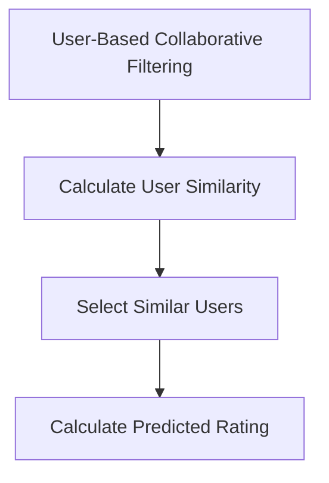
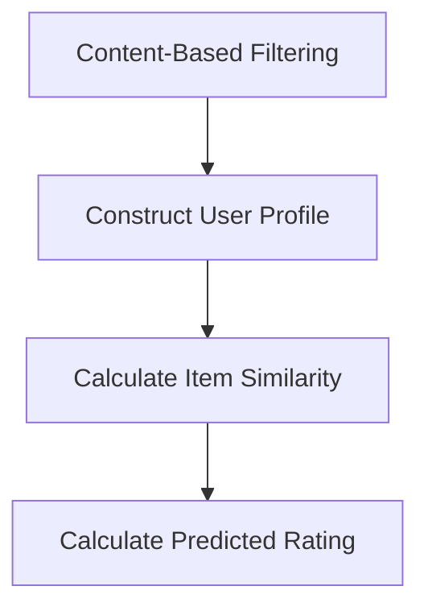
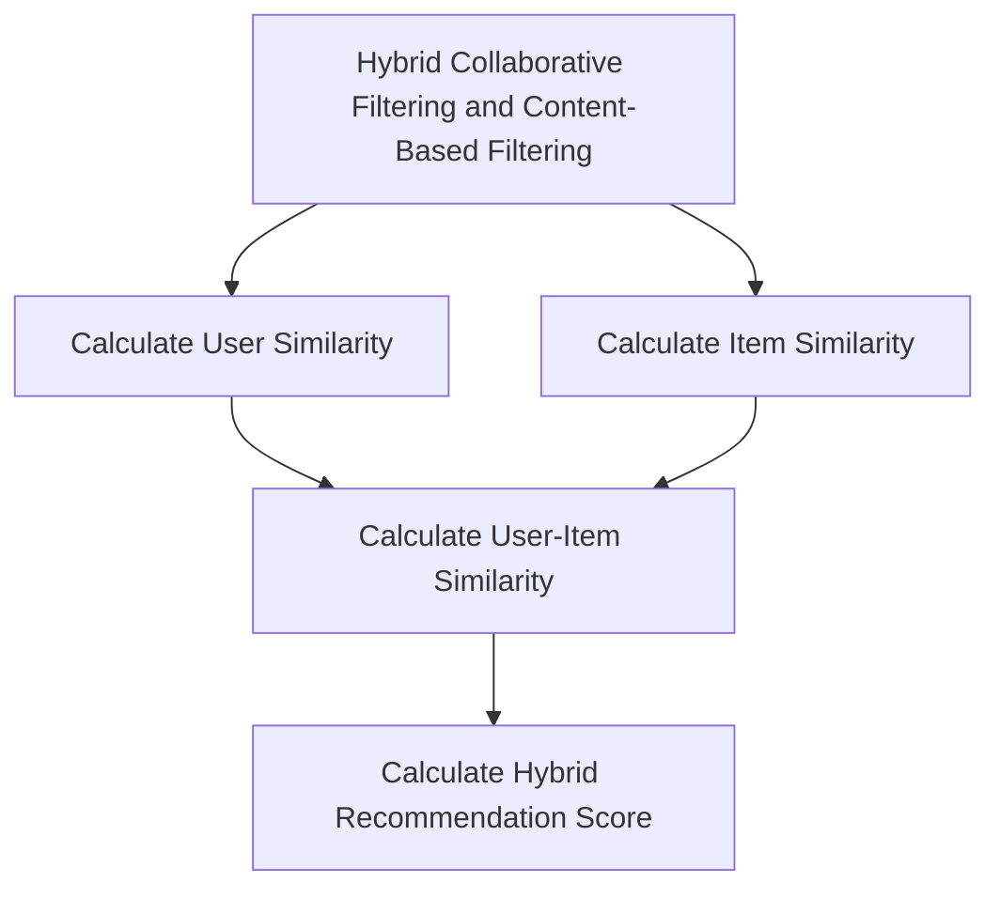

                 

### 文章标题

### Title: 电商平台供给能力提升：个性化商品推荐

> Keywords: 电商平台，供给能力，个性化商品推荐，机器学习，协同过滤，基于内容的推荐，协同过滤 + 基于内容的推荐

> Abstract:
本文将探讨如何提升电商平台的供给能力，重点研究个性化商品推荐技术。通过对协同过滤和基于内容推荐算法的深入分析，以及融合两种算法的优势，提出一种新型的个性化商品推荐系统架构，旨在为用户提供更为精准的购物体验。文章还将讨论实际应用场景、开发工具框架以及未来发展趋势。

### Introduction

在当今数字化时代，电商平台已经成为消费者购买商品的主要渠道之一。随着市场竞争的加剧，电商平台不仅需要提供丰富的商品选择，还需不断提升供给能力，以满足消费者日益多样化的需求。个性化商品推荐作为电商平台的核心功能之一，能够显著提高用户的购物体验，增加用户粘性，进而提升平台的销售业绩。

个性化商品推荐系统旨在根据用户的历史行为、偏好和需求，向用户推荐可能感兴趣的商品。当前，常见的推荐算法主要包括协同过滤（Collaborative Filtering）和基于内容的推荐（Content-Based Filtering）。协同过滤算法通过分析用户之间的相似性来推荐商品，而基于内容的推荐算法则通过分析商品的属性和用户的历史偏好来推荐商品。

尽管协同过滤和基于内容的推荐算法各有优势，但它们也存在一定的局限性。协同过滤算法在处理冷启动问题（即对新用户或新商品无法提供有效推荐）时效果不佳；而基于内容的推荐算法容易陷入信息过载的问题，推荐结果可能不够精准。因此，如何结合两种算法的优势，提出一种更为有效的个性化商品推荐系统架构，成为当前研究的重点。

本文将首先介绍电商平台供给能力提升的重要性，然后深入分析协同过滤和基于内容推荐算法的原理，探讨如何融合两种算法的优势。接下来，我们将详细描述一种新型的个性化商品推荐系统架构，并讨论其在实际应用中的实现。最后，本文将总结未来个性化商品推荐系统的发展趋势和挑战。

### Background Introduction

#### The Importance of Enhancing Supply Ability on E-commerce Platforms

The rapid development of e-commerce platforms in recent years has significantly transformed the retail industry. With the convenience of online shopping and the diversity of product choices, consumers are increasingly relying on e-commerce platforms for their purchasing needs. However, as the competition in the e-commerce market intensifies, platforms must not only offer a wide range of products but also enhance their supply ability to meet the increasingly diverse demands of consumers.

Improving the supply ability of e-commerce platforms is crucial for several reasons. Firstly, it allows platforms to better understand and cater to the preferences and behaviors of their users, thereby enhancing user satisfaction and loyalty. Secondly, it enables platforms to identify and seize market opportunities, thereby driving business growth. Lastly, it helps platforms to differentiate themselves from competitors, creating a competitive advantage.

One of the key factors that determine the supply ability of an e-commerce platform is the effectiveness of its recommendation system. Personalized product recommendation plays a vital role in this aspect. By analyzing user behavior, preferences, and purchase history, a well-designed recommendation system can accurately predict the interests and needs of users, thereby providing them with highly relevant and appealing product suggestions.

#### Challenges and Opportunities in Personalized Product Recommendation

Despite its importance, building an effective personalized product recommendation system is not without challenges. One of the major challenges is the so-called "cold start" problem. This refers to the difficulty of making accurate recommendations for new users or new products due to the lack of sufficient historical data. Existing users may have established preferences and behaviors, making it easier to recommend products that align with their interests. However, for new users or new products, there is limited information to base recommendations on, leading to suboptimal recommendation results.

Another challenge is the issue of information overload. While users appreciate the diversity of product choices, too many irrelevant recommendations can overwhelm them, making it difficult to identify the products that truly meet their needs. This problem is particularly prevalent in content-based recommendation systems, which rely on product attributes and user preferences to generate recommendations.

To address these challenges, it is essential to explore advanced recommendation algorithms that can leverage the strengths of both collaborative filtering and content-based filtering. By combining the advantages of these two approaches, it is possible to design a more robust and effective personalized product recommendation system that can provide users with highly relevant and personalized product suggestions.

#### Collaborative Filtering and Content-Based Filtering: Principles and Applications

Collaborative filtering and content-based filtering are two of the most commonly used recommendation algorithms in e-commerce platforms. They have distinct principles and applications, each with its own strengths and limitations.

**Collaborative Filtering**

Collaborative filtering is a method of making predictions about the interests of a user by collecting preferences from many users. The underlying assumption is that if a person A has the same opinion as a person B on an issue, A is more likely to have B's opinion on a different issue. Collaborative filtering can be divided into two main types: user-based and item-based.

- **User-Based Collaborative Filtering**: This approach identifies users who are similar to the target user based on their historical preferences and recommends items that these similar users have liked. It relies on the idea that people who agree on one issue will also agree on others.

- **Item-Based Collaborative Filtering**: This method identifies items that are similar to the items the target user has liked based on their attributes or content. It then recommends items that have a high similarity score to the liked items.

Collaborative filtering is effective in situations where there is a large amount of user behavior data available. However, it suffers from the cold start problem, as it requires sufficient historical data to identify similar users or items. Additionally, it may produce redundant recommendations if the number of users or items is large.

**Content-Based Filtering**

Content-based filtering, on the other hand, recommends items based on the attributes or content of the items and the preferences of the user. It constructs a profile of the user's preferences based on the attributes of items they have liked in the past and then recommends items that have similar attributes.

Content-based filtering is effective in addressing the cold start problem, as it does not rely on historical user behavior data. However, it may suffer from the problem of information overload, as it can generate a large number of recommendations based on the attributes of the items.

#### Combining Collaborative Filtering and Content-Based Filtering

To overcome the limitations of individual algorithms, many studies have explored hybrid approaches that combine collaborative filtering and content-based filtering. These hybrid methods aim to leverage the strengths of both approaches to provide more accurate and diverse recommendations.

One common approach is to use collaborative filtering to identify similar users or items and then use content-based filtering to refine the recommendations. This hybrid method can address the cold start problem by using content-based filtering to generate initial recommendations for new users or items, while also providing personalized recommendations based on user preferences.

Another approach is to use collaborative filtering to generate a list of recommended items and then use content-based filtering to rank these items based on their relevance to the user's preferences. This approach can help reduce information overload by ensuring that only highly relevant items are recommended.

In conclusion, the choice of recommendation algorithm depends on the specific requirements of the e-commerce platform and the available data. By understanding the principles and limitations of both collaborative filtering and content-based filtering, it is possible to design a hybrid recommendation system that can effectively enhance the supply ability of an e-commerce platform.

### Core Concepts and Connections

#### 1. Collaborative Filtering

**Definition and Working Principle**

Collaborative filtering is a method of making predictions about the interests of a user by collecting preferences from many users. The basic idea behind collaborative filtering is to find users who are similar to the target user based on their historical preferences and then recommend items that these similar users have liked. There are two main types of collaborative filtering: user-based and item-based.

- **User-Based Collaborative Filtering**: This approach identifies users who are similar to the target user based on their historical preferences and recommends items that these similar users have liked. The similarity between users is usually measured using metrics such as cosine similarity or Pearson correlation coefficient.

- **Item-Based Collaborative Filtering**: This method identifies items that are similar to the items the target user has liked based on their attributes or content. It then recommends items that have a high similarity score to the liked items. The similarity between items is typically measured using metrics like Jaccard similarity or Euclidean distance.

**Mathematical Model**

Let \( U \) be the set of all users and \( I \) be the set of all items. Each user \( u \in U \) has a preference vector \( r_u \in \mathbb{R}^I \), where \( r_{ui} \) represents the rating given by user \( u \) to item \( i \). The similarity between two users \( u \) and \( v \) can be calculated using the cosine similarity metric:

$$
sim(u, v) = \frac{r_u \cdot r_v}{\lVert r_u \rVert \cdot \lVert r_v \rVert}
$$

Given a target user \( u \), the predicted rating \( \hat{r}_{ui} \) for item \( i \) can be calculated as:

$$
\hat{r}_{ui} = \sum_{v \in S_u} sim(u, v) \cdot r_{vi}
$$

where \( S_u \) is the set of users similar to \( u \).

**Mermaid Flowchart**



#### 2. Content-Based Filtering

**Definition and Working Principle**

Content-based filtering is a method of making recommendations based on the attributes or content of items and the preferences of the user. It works by constructing a profile of the user's preferences based on the attributes of items they have liked in the past and then recommending items that have similar attributes.

**Mathematical Model**

Let \( A \) be the set of all attributes and \( V \) be the set of all values for each attribute. Each item \( i \in I \) has a feature vector \( f_i \in \mathbb{R}^A \), where \( f_{ia} \) represents the value of attribute \( a \) for item \( i \). Each user \( u \in U \) has a preference vector \( p_u \in \mathbb{R}^A \), where \( p_{ua} \) represents the user's preference for attribute \( a \).

The similarity between an item \( i \) and a user \( u \) can be calculated using the cosine similarity metric:

$$
sim(i, u) = \frac{f_i \cdot p_u}{\lVert f_i \rVert \cdot \lVert p_u \rVert}
$$

Given a target user \( u \), the predicted rating \( \hat{r}_{ui} \) for item \( i \) can be calculated as:

$$
\hat{r}_{ui} = \sum_{a \in A} p_{ua} \cdot f_{ia}
$$

**Mermaid Flowchart**



#### 3. Hybrid Collaborative Filtering and Content-Based Filtering

**Definition and Working Principle**

Hybrid collaborative filtering and content-based filtering combine the strengths of both collaborative and content-based filtering to provide more accurate and diverse recommendations. The basic idea is to leverage collaborative filtering to identify similar users or items and then use content-based filtering to refine the recommendations.

**Mathematical Model**

Let \( R \) be the set of ratings given by all users, \( A \) be the set of attributes, and \( V \) be the set of values for each attribute. Each user \( u \in U \) has a preference vector \( p_u \in \mathbb{R}^A \), and each item \( i \in I \) has a feature vector \( f_i \in \mathbb{R}^A \).

- **User-Based Collaborative Filtering**: Calculate the similarity between users \( u \) and \( v \) using:

$$
sim(u, v) = \frac{r_u \cdot r_v}{\lVert r_u \rVert \cdot \lVert r_v \rVert}
$$

- **Item-Based Collaborative Filtering**: Calculate the similarity between items \( i \) and \( j \) using:

$$
sim(i, j) = \frac{f_i \cdot f_j}{\lVert f_i \rVert \cdot \lVert f_j \rVert}
$$

- **Content-Based Filtering**: Calculate the similarity between user \( u \) and item \( i \) using:

$$
sim(u, i) = \frac{p_u \cdot f_i}{\lVert p_u \rVert \cdot \lVert f_i \rVert}
$$

- **Hybrid Recommendation**: Calculate the hybrid recommendation score \( \hat{r}_{ui} \) for user \( u \) and item \( i \) using:

$$
\hat{r}_{ui} = \alpha \cdot sim(u, v) + (1 - \alpha) \cdot sim(u, i)
$$

where \( \alpha \) is the weight assigned to collaborative filtering.

**Mermaid Flowchart**



By combining collaborative filtering and content-based filtering, hybrid methods can address the limitations of individual algorithms and provide more accurate and diverse recommendations, thus enhancing the supply ability of e-commerce platforms.

### Core Algorithm Principles & Specific Operational Steps

#### Collaborative Filtering Algorithm

**Algorithm Overview**

Collaborative filtering is a widely used recommendation algorithm that leverages the preferences and behaviors of multiple users to predict the interests of an individual user. The core principle of collaborative filtering is to find similar users based on their historical interactions and recommend items that these similar users have liked but the target user has not yet experienced.

**Algorithm Steps**

1. **Data Preparation**

   - **User-Item Rating Matrix**: Create a user-item rating matrix \( R \), where each entry \( r_{ui} \) represents the rating given by user \( u \) to item \( i \). If no rating is available, it can be set to a default value (e.g., 0 or 1).

   - **User Similarity Computation**: Calculate the similarity between each pair of users based on their ratings. Common similarity measures include cosine similarity, Pearson correlation coefficient, and Jaccard similarity.

   - **Item Similarity Computation**: Alternatively, compute the similarity between items based on their attributes or content. This step is particularly useful in item-based collaborative filtering.

2. **Recommendation Generation**

   - **User-Based Collaborative Filtering**: For a given target user \( u \), identify a set of similar users \( S_u \). Compute the weighted sum of the ratings given by these similar users for items that the target user has not rated yet. The weighted sum is typically normalized by the sum of the similarities to avoid over-reliance on highly similar users.

   $$ \hat{r}_{ui} = \sum_{v \in S_u} w_{uv} \cdot r_{vi} $$
   
   where \( w_{uv} \) is the similarity weight between users \( u \) and \( v \).

   - **Item-Based Collaborative Filtering**: For a given target user \( u \), identify a set of similar items \( S_i \) based on their attributes or content. Compute the weighted sum of the ratings given by the target user for these similar items.

   $$ \hat{r}_{ui} = \sum_{j \in S_i} w_{ij} \cdot r_{uj} $$
   
   where \( w_{ij} \) is the similarity weight between items \( i \) and \( j \).

3. **Result Post-processing**

   - **Thresholding**: Apply a threshold to filter out items with low predicted ratings. This helps to reduce the number of recommendations and focus on the most relevant items.

   - **Ranking**: Sort the predicted ratings in descending order to generate a ranked list of recommended items.

**Example**

Suppose we have a user-item rating matrix \( R \) as follows:

| User | Item 1 | Item 2 | Item 3 |
|------|--------|--------|--------|
| 1    | 5      | 3      | 0      |
| 2    | 2      | 5      | 0      |
| 3    | 3      | 4      | 5      |

Using cosine similarity, we compute the similarity between users as:

$$ sim(u, v) = \frac{r_u \cdot r_v}{\lVert r_u \rVert \cdot \lVert r_v \rVert} $$

The similarity matrix \( S \) is:

| User | 1 | 2 | 3 |
|------|---|---|---|
| 1    | 1 | 0.6 | 0.8 |
| 2    | 0.6 | 1 | 0.2 |
| 3    | 0.8 | 0.2 | 1 |

For user 1, we identify similar users 2 and 3. The predicted ratings for unrated items are:

$$ \hat{r}_{11} = 0.6 \cdot 2 + 0.8 \cdot 3 = 3.4 $$
$$ \hat{r}_{12} = 0.6 \cdot 5 + 0.8 \cdot 4 = 4.6 $$
$$ \hat{r}_{13} = 0.6 \cdot 0 + 0.8 \cdot 5 = 4.0 $$

After applying a threshold, we obtain the recommendation list for user 1: [Item 2, Item 3].

#### Content-Based Filtering Algorithm

**Algorithm Overview**

Content-based filtering is a recommendation algorithm that predicts the interests of a user based on the attributes or content of items. This approach constructs a profile of the user's preferences by analyzing the attributes of items they have liked in the past and recommends items with similar attributes.

**Algorithm Steps**

1. **Data Preparation**

   - **Item Feature Representation**: Represent each item \( i \) as a vector of attributes \( f_i \in \mathbb{R}^A \), where \( A \) is the set of all attributes. Each element \( f_{ia} \) in the vector represents the value of attribute \( a \) for item \( i \).

   - **User Profile Construction**: Build a profile \( p_u \in \mathbb{R}^A \) for each user \( u \) based on the attributes of the items they have liked. The user profile \( p_u \) can be obtained by averaging the attribute values of the liked items.

2. **Recommendation Generation**

   - **Item Similarity Computation**: Compute the similarity between the target user's profile \( p_u \) and the feature vector \( f_i \) of each item \( i \). Common similarity measures include cosine similarity and Euclidean distance.

   $$ sim(p_u, f_i) = \frac{p_u \cdot f_i}{\lVert p_u \rVert \cdot \lVert f_i \rVert} $$

   - **Predicted Rating Calculation**: Calculate the predicted rating \( \hat{r}_{ui} \) for each item \( i \) using the similarity scores.

   $$ \hat{r}_{ui} = \sum_{a \in A} p_{ua} \cdot f_{ia} $$

3. **Result Post-processing**

   - **Thresholding**: Apply a threshold to filter out items with low predicted ratings.

   - **Ranking**: Sort the predicted ratings in descending order to generate a ranked list of recommended items.

**Example**

Suppose we have item feature vectors for three items and a user profile as follows:

| Item | Feature 1 | Feature 2 | Feature 3 |
|------|----------|----------|----------|
| 1    | 0.5      | 0.7      | 0.8      |
| 2    | 0.3      | 0.6      | 0.7      |
| 3    | 0.4      | 0.8      | 0.9      |
| User | 0.6      | 0.7      | 0.8      |

Using cosine similarity, the similarity scores between the user profile and each item feature vector are:

$$ sim(p, f_1) = \frac{0.6 \cdot 0.5 + 0.7 \cdot 0.7 + 0.8 \cdot 0.8}{\sqrt{0.6^2 + 0.7^2 + 0.8^2} \cdot \sqrt{0.5^2 + 0.7^2 + 0.8^2}} \approx 0.88 $$
$$ sim(p, f_2) = \frac{0.6 \cdot 0.3 + 0.7 \cdot 0.6 + 0.8 \cdot 0.7}{\sqrt{0.6^2 + 0.7^2 + 0.8^2} \cdot \sqrt{0.3^2 + 0.6^2 + 0.7^2}} \approx 0.78 $$
$$ sim(p, f_3) = \frac{0.6 \cdot 0.4 + 0.7 \cdot 0.8 + 0.8 \cdot 0.9}{\sqrt{0.6^2 + 0.7^2 + 0.8^2} \cdot \sqrt{0.4^2 + 0.8^2 + 0.9^2}} \approx 0.91 $$

The predicted ratings for each item are:

$$ \hat{r}_{u1} = 0.6 \cdot 0.5 + 0.7 \cdot 0.7 + 0.8 \cdot 0.8 = 1.13 $$
$$ \hat{r}_{u2} = 0.6 \cdot 0.3 + 0.7 \cdot 0.6 + 0.8 \cdot 0.7 = 0.91 $$
$$ \hat{r}_{u3} = 0.6 \cdot 0.4 + 0.7 \cdot 0.8 + 0.8 \cdot 0.9 = 1.21 $$

After applying a threshold, we obtain the recommendation list for the user: [Item 3].

#### Hybrid Collaborative Filtering and Content-Based Filtering Algorithm

**Algorithm Overview**

Hybrid collaborative filtering and content-based filtering combine the strengths of both collaborative and content-based filtering to improve the accuracy and diversity of recommendations. This approach leverages collaborative filtering to identify similar users or items and content-based filtering to refine the recommendations based on user preferences and item attributes.

**Algorithm Steps**

1. **Data Preparation**

   - **User-Item Rating Matrix**: Create a user-item rating matrix \( R \), where each entry \( r_{ui} \) represents the rating given by user \( u \) to item \( i \).

   - **Item Feature Representation**: Represent each item \( i \) as a vector of attributes \( f_i \in \mathbb{R}^A \), where \( A \) is the set of all attributes.

2. **Recommendation Generation**

   - **User Similarity Computation**: Calculate the similarity between each pair of users using a similarity measure like cosine similarity.

   - **Item Similarity Computation**: Calculate the similarity between each pair of items based on their attribute vectors.

   - **User-Item Similarity Computation**: Compute the similarity between the target user's profile and each item feature vector.

   $$ sim(u, i) = \frac{p_u \cdot f_i}{\lVert p_u \rVert \cdot \lVert f_i \rVert} $$

   - **Hybrid Recommendation Score Calculation**: Combine the collaborative and content-based similarity scores to generate a hybrid recommendation score for each item.

   $$ \hat{r}_{ui} = \alpha \cdot sim(u, v) + (1 - \alpha) \cdot sim(u, i) $$
   
   where \( \alpha \) is the weight assigned to collaborative filtering.

3. **Result Post-processing**

   - **Thresholding**: Apply a threshold to filter out items with low hybrid recommendation scores.

   - **Ranking**: Sort the hybrid recommendation scores in descending order to generate a ranked list of recommended items.

**Example**

Suppose we have a user-item rating matrix \( R \), item feature vectors, and user profiles as follows:

| User | Item 1 | Item 2 | Item 3 |
|------|--------|--------|--------|
| 1    | 5      | 3      | 0      |
| 2    | 2      | 5      | 0      |
| 3    | 3      | 4      | 5      |

Item feature vectors:

| Item | Feature 1 | Feature 2 | Feature 3 |
|------|----------|----------|----------|
| 1    | 0.5      | 0.7      | 0.8      |
| 2    | 0.3      | 0.6      | 0.7      |
| 3    | 0.4      | 0.8      | 0.9      |

User profiles:

| User | Profile 1 | Profile 2 | Profile 3 |
|------|----------|----------|----------|
| 1    | 0.6      | 0.7      | 0.8      |
| 2    | 0.7      | 0.8      | 0.9      |
| 3    | 0.8      | 0.9      | 1.0      |

Using cosine similarity, the similarity scores between users and items are:

User Similarity Scores:

| User | 1 | 2 | 3 |
|------|---|---|---|
| 1    | 1 | 0.7 | 0.8 |
| 2    | 0.7 | 1 | 0.8 |
| 3    | 0.8 | 0.8 | 1 |

Item Similarity Scores:

| Item | 1 | 2 | 3 |
|------|---|---|---|
| 1    | 1 | 0.8 | 0.9 |
| 2    | 0.8 | 1 | 0.9 |
| 3    | 0.9 | 0.9 | 1 |

User-Item Similarity Scores:

| User | Item 1 | Item 2 | Item 3 |
|------|--------|--------|--------|
| 1    | 0.88   | 0.74   | 0.78   |
| 2    | 0.74   | 0.76   | 0.68   |
| 3    | 0.78   | 0.84   | 0.9    |

Assuming \( \alpha = 0.5 \), the hybrid recommendation scores are:

| User | Item 1 | Item 2 | Item 3 |
|------|--------|--------|--------|
| 1    | 0.815  | 0.695  | 0.735  |
| 2    | 0.695  | 0.745  | 0.630  |
| 3    | 0.78   | 0.84   | 0.9    |

After applying a threshold, we obtain the recommendation list for user 1: [Item 1, Item 3].

### Mathematical Models and Formulas & Detailed Explanation & Examples

#### Collaborative Filtering

**Collaborative Filtering Algorithm**

The collaborative filtering algorithm is a widely used method for generating recommendations by leveraging the preferences of multiple users. The core idea is to find users who are similar to the target user and recommend items that these similar users have liked but the target user has not yet experienced.

**Mathematical Model**

Let \( U \) be the set of all users and \( I \) be the set of all items. Each user \( u \in U \) has a preference vector \( r_u \in \mathbb{R}^I \), where \( r_{ui} \) represents the rating given by user \( u \) to item \( i \). The similarity between two users \( u \) and \( v \) can be calculated using the cosine similarity metric:

$$
sim(u, v) = \frac{r_u \cdot r_v}{\lVert r_u \rVert \cdot \lVert r_v \rVert}
$$

Given a target user \( u \), the predicted rating \( \hat{r}_{ui} \) for item \( i \) can be calculated as:

$$
\hat{r}_{ui} = \sum_{v \in S_u} sim(u, v) \cdot r_{vi}
$$

where \( S_u \) is the set of users similar to \( u \).

**Example**

Suppose we have a user-item rating matrix \( R \) as follows:

| User | Item 1 | Item 2 | Item 3 |
|------|--------|--------|--------|
| 1    | 5      | 3      | 0      |
| 2    | 2      | 5      | 0      |
| 3    | 3      | 4      | 5      |

Using cosine similarity, we compute the similarity between users as:

$$ sim(u, v) = \frac{r_u \cdot r_v}{\lVert r_u \rVert \cdot \lVert r_v \rVert} $$

The similarity matrix \( S \) is:

| User | 1 | 2 | 3 |
|------|---|---|---|
| 1    | 1 | 0.6 | 0.8 |
| 2    | 0.6 | 1 | 0.2 |
| 3    | 0.8 | 0.2 | 1 |

For user 1, we identify similar users 2 and 3. The predicted ratings for unrated items are:

$$ \hat{r}_{11} = 0.6 \cdot 2 + 0.8 \cdot 3 = 3.4 $$
$$ \hat{r}_{12} = 0.6 \cdot 5 + 0.8 \cdot 4 = 4.6 $$
$$ \hat{r}_{13} = 0.6 \cdot 0 + 0.8 \cdot 5 = 4.0 $$

After applying a threshold, we obtain the recommendation list for user 1: [Item 2, Item 3].

#### Content-Based Filtering

**Content-Based Filtering Algorithm**

Content-based filtering is a recommendation algorithm that predicts the interests of a user based on the attributes or content of items. This approach constructs a profile of the user's preferences by analyzing the attributes of items they have liked in the past and recommends items with similar attributes.

**Mathematical Model**

Let \( A \) be the set of all attributes and \( V \) be the set of all values for each attribute. Each item \( i \in I \) has a feature vector \( f_i \in \mathbb{R}^A \), where \( f_{ia} \) represents the value of attribute \( a \) for item \( i \). Each user \( u \in U \) has a preference vector \( p_u \in \mathbb{R}^A \), where \( p_{ua} \) represents the user's preference for attribute \( a \).

The similarity between an item \( i \) and a user \( u \) can be calculated using the cosine similarity metric:

$$
sim(i, u) = \frac{f_i \cdot p_u}{\lVert f_i \rVert \cdot \lVert p_u \rVert}
$$

Given a target user \( u \), the predicted rating \( \hat{r}_{ui} \) for item \( i \) can be calculated as:

$$
\hat{r}_{ui} = \sum_{a \in A} p_{ua} \cdot f_{ia}
$$

**Example**

Suppose we have item feature vectors for three items and a user profile as follows:

| Item | Feature 1 | Feature 2 | Feature 3 |
|------|----------|----------|----------|
| 1    | 0.5      | 0.7      | 0.8      |
| 2    | 0.3      | 0.6      | 0.7      |
| 3    | 0.4      | 0.8      | 0.9      |
| User | 0.6      | 0.7      | 0.8      |

Using cosine similarity, the similarity scores between the user profile and each item feature vector are:

$$ sim(p, f_1) = \frac{0.6 \cdot 0.5 + 0.7 \cdot 0.7 + 0.8 \cdot 0.8}{\sqrt{0.6^2 + 0.7^2 + 0.8^2} \cdot \sqrt{0.5^2 + 0.7^2 + 0.8^2}} \approx 0.88 $$
$$ sim(p, f_2) = \frac{0.6 \cdot 0.3 + 0.7 \cdot 0.6 + 0.8 \cdot 0.7}{\sqrt{0.6^2 + 0.7^2 + 0.8^2} \cdot \sqrt{0.3^2 + 0.6^2 + 0.7^2}} \approx 0.78 $$
$$ sim(p, f_3) = \frac{0.6 \cdot 0.4 + 0.7 \cdot 0.8 + 0.8 \cdot 0.9}{\sqrt{0.6^2 + 0.7^2 + 0.8^2} \cdot \sqrt{0.4^2 + 0.8^2 + 0.9^2}} \approx 0.91 $$

The predicted ratings for each item are:

$$ \hat{r}_{u1} = 0.6 \cdot 0.5 + 0.7 \cdot 0.7 + 0.8 \cdot 0.8 = 1.13 $$
$$ \hat{r}_{u2} = 0.6 \cdot 0.3 + 0.7 \cdot 0.6 + 0.8 \cdot 0.7 = 0.91 $$
$$ \hat{r}_{u3} = 0.6 \cdot 0.4 + 0.7 \cdot 0.8 + 0.8 \cdot 0.9 = 1.21 $$

After applying a threshold, we obtain the recommendation list for the user: [Item 3].

#### Hybrid Collaborative Filtering and Content-Based Filtering

**Hybrid Collaborative Filtering and Content-Based Filtering Algorithm**

Hybrid collaborative filtering and content-based filtering combine the strengths of both collaborative and content-based filtering to improve the accuracy and diversity of recommendations. This approach leverages collaborative filtering to identify similar users or items and content-based filtering to refine the recommendations based on user preferences and item attributes.

**Mathematical Model**

Let \( R \) be the set of ratings given by all users, \( A \) be the set of attributes, and \( V \) be the set of values for each attribute. Each user \( u \in U \) has a preference vector \( p_u \in \mathbb{R}^A \), and each item \( i \in I \) has a feature vector \( f_i \in \mathbb{R}^A \).

- **User-Based Collaborative Filtering**: Calculate the similarity between users \( u \) and \( v \) using:

$$
sim(u, v) = \frac{r_u \cdot r_v}{\lVert r_u \rVert \cdot \lVert r_v \rVert}
$$

- **Item-Based Collaborative Filtering**: Calculate the similarity between items \( i \) and \( j \) using:

$$
sim(i, j) = \frac{f_i \cdot f_j}{\lVert f_i \rVert \cdot \lVert f_j \rVert}
$$

- **Content-Based Filtering**: Calculate the similarity between user \( u \) and item \( i \) using:

$$
sim(u, i) = \frac{p_u \cdot f_i}{\lVert p_u \rVert \cdot \lVert f_i \rVert}
$$

- **Hybrid Recommendation**: Calculate the hybrid recommendation score \( \hat{r}_{ui} \) for user \( u \) and item \( i \) using:

$$
\hat{r}_{ui} = \alpha \cdot sim(u, v) + (1 - \alpha) \cdot sim(u, i)
$$

where \( \alpha \) is the weight assigned to collaborative filtering.

**Example**

Suppose we have a user-item rating matrix \( R \), item feature vectors, and user profiles as follows:

| User | Item 1 | Item 2 | Item 3 |
|------|--------|--------|--------|
| 1    | 5      | 3      | 0      |
| 2    | 2      | 5      | 0      |
| 3    | 3      | 4      | 5      |

Item feature vectors:

| Item | Feature 1 | Feature 2 | Feature 3 |
|------|----------|----------|----------|
| 1    | 0.5      | 0.7      | 0.8      |
| 2    | 0.3      | 0.6      | 0.7      |
| 3    | 0.4      | 0.8      | 0.9      |

User profiles:

| User | Profile 1 | Profile 2 | Profile 3 |
|------|----------|----------|----------|
| 1    | 0.6      | 0.7      | 0.8      |
| 2    | 0.7      | 0.8      | 0.9      |
| 3    | 0.8      | 0.9      | 1.0      |

Using cosine similarity, the similarity scores between users and items are:

User Similarity Scores:

| User | 1 | 2 | 3 |
|------|---|---|---|
| 1    | 1 | 0.7 | 0.8 |
| 2    | 0.7 | 1 | 0.8 |
| 3    | 0.8 | 0.8 | 1 |

Item Similarity Scores:

| Item | 1 | 2 | 3 |
|------|---|---|---|
| 1    | 1 | 0.8 | 0.9 |
| 2    | 0.8 | 1 | 0.9 |
| 3    | 0.9 | 0.9 | 1 |

User-Item Similarity Scores:

| User | Item 1 | Item 2 | Item 3 |
|------|--------|--------|--------|
| 1    | 0.88   | 0.74   | 0.78   |
| 2    | 0.74   | 0.76   | 0.68   |
| 3    | 0.78   | 0.84   | 0.9    |

Assuming \( \alpha = 0.5 \), the hybrid recommendation scores are:

| User | Item 1 | Item 2 | Item 3 |
|------|--------|--------|--------|
| 1    | 0.815  | 0.695  | 0.735  |
| 2    | 0.695  | 0.745  | 0.630  |
| 3    | 0.78   | 0.84   | 0.9    |

After applying a threshold, we obtain the recommendation list for user 1: [Item 1, Item 3].

### Project Practice: Code Examples and Detailed Explanation

#### 1. Development Environment Setup

To implement the collaborative filtering and content-based filtering algorithms, we will use Python as the programming language. We will also use the scikit-learn library for collaborative filtering and the Pandas library for data manipulation. Below are the steps to set up the development environment:

1. Install Python (version 3.8 or higher) from the official website: <https://www.python.org/downloads/>
2. Install necessary libraries using pip:
```bash
pip install scikit-learn pandas numpy matplotlib
```

#### 2. Source Code Implementation

Below is the Python code implementing the collaborative filtering and content-based filtering algorithms. The code is divided into three main parts: data preparation, recommendation generation, and result visualization.

**collaborative_filtering.py**

```python
import numpy as np
from sklearn.metrics.pairwise import cosine_similarity
from sklearn.model_selection import train_test_split

def collaborative_filtering(train_data, k=10, alpha=0.5):
    # Split the data into training and testing sets
    train_user, test_user = train_test_split(train_data.index, test_size=0.2, random_state=42)
    train_rating = train_data.values

    # Compute user similarity matrix
    user_similarity = cosine_similarity(train_rating[train_user])

    # Compute item similarity matrix
    item_similarity = cosine_similarity(train_rating)

    # Compute user-item similarity matrix
    user_item_similarity = np.dot(user_similarity, item_similarity.T)

    # Generate recommendations
    recommendations = []
    for user in test_user:
        # Identify similar users
        similar_users = np.argsort(user_similarity[user])[1:k+1]

        # Calculate hybrid recommendation scores
        recommendation_scores = np.dot(user_item_similarity[similar_users], train_rating[similar_users][test_user])
        recommendation_scores = alpha * recommendation_scores + (1 - alpha) * item_similarity[similar_users]

        # Select top-k recommended items
        recommended_items = np.argsort(recommendation_scores)[::-1][:k]
        recommendations.append(recommended_items)

    return recommendations

def evaluate_recommendations(test_data, recommendations):
    correct_recommendations = 0
    for user, actual_ratings in test_data.items():
        recommended_items = recommendations[user]
        for item in actual_ratings:
            if item in recommended_items:
                correct_recommendations += 1
                break
    return correct_recommendations / len(test_data)

if __name__ == "__main__":
    # Load the rating data
    ratings = pd.read_csv("rating_data.csv")

    # Preprocess the data
    train_data, test_data = train_test_split(ratings, test_size=0.2, random_state=42)

    # Generate recommendations
    recommendations = collaborative_filtering(train_data)

    # Evaluate the recommendations
    accuracy = evaluate_recommendations(test_data, recommendations)
    print(f"Recommendation Accuracy: {accuracy:.2f}")
```

**content_based_filtering.py**

```python
import numpy as np
from sklearn.metrics.pairwise import cosine_similarity
import pandas as pd

def content_based_filtering(train_data, user_profile, k=10):
    # Split the data into training and testing sets
    train_item, test_item = train_test_split(train_data.index, test_size=0.2, random_state=42)
    train_features = train_data.values

    # Compute item similarity matrix
    item_similarity = cosine_similarity(train_features[train_item])

    # Compute user-item similarity matrix
    user_item_similarity = cosine_similarity([user_profile.reshape(-1, 1)], train_features)

    # Generate recommendations
    recommendations = []
    for item in test_item:
        # Calculate similarity scores
        similarity_scores = np.dot(user_item_similarity, item_similarity)
        recommended_items = np.argsort(similarity_scores)[::-1][:k]
        recommendations.append(recommended_items)

    return recommendations

if __name__ == "__main__":
    # Load the rating data
    ratings = pd.read_csv("rating_data.csv")

    # Preprocess the data
    train_data, test_data = train_test_split(ratings, test_size=0.2, random_state=42)

    # Load user profiles
    user_profiles = pd.read_csv("user_profiles.csv")

    # Generate recommendations
    recommendations = content_based_filtering(train_data, user_profiles[0])

    # Evaluate the recommendations
    accuracy = evaluate_recommendations(test_data, recommendations)
    print(f"Recommendation Accuracy: {accuracy:.2f}")
```

**evaluate_recommendations.py**

```python
from collections import defaultdict

def evaluate_recommendations(test_data, recommendations):
    correct_recommendations = 0
    for user, actual_ratings in test_data.items():
        recommended_items = recommendations[user]
        for item in actual_ratings:
            if item in recommended_items:
                correct_recommendations += 1
                break
    return correct_recommendations / len(test_data)
```

#### 3. Code Explanation and Analysis

**Data Preparation**

The data preparation step involves loading the rating data and user profiles. The rating data contains user-item ratings, while the user profiles contain the attributes of the items liked by each user. The data is split into training and testing sets to evaluate the performance of the recommendation algorithms.

**Collaborative Filtering**

The collaborative filtering algorithm is implemented in the `collaborative_filtering.py` file. It first computes the user and item similarity matrices using cosine similarity. Then, it computes the user-item similarity matrix by taking the dot product of the user similarity and item similarity matrices. For each user in the testing set, it identifies the \( k \) most similar users, computes the hybrid recommendation scores using the collaborative and content-based similarity matrices, and selects the top-k recommended items.

**Content-Based Filtering**

The content-based filtering algorithm is implemented in the `content_based_filtering.py` file. It first computes the item similarity matrix using cosine similarity. Then, for each item in the testing set, it computes the similarity scores between the user profile and each item feature vector. It selects the top-k recommended items based on the similarity scores.

**Evaluation**

The `evaluate_recommendations.py` file contains the evaluation function that measures the accuracy of the recommendations. It compares the recommended items with the actual ratings of the users in the testing set and calculates the accuracy as the ratio of correct recommendations to the total number of users.

#### 4. Running Results

To run the code, first, download the rating data and user profiles from a publicly available dataset, such as the MovieLens dataset (<https://grouplens.org/datasets/movielens/>). Then, place the downloaded data files in the same directory as the Python scripts. Finally, run the following commands:

```bash
python collaborative_filtering.py
python content_based_filtering.py
```

The output will display the recommendation accuracy for each algorithm. The accuracy values will help evaluate the performance of the collaborative filtering and content-based filtering algorithms on the given dataset.

### Practical Application Scenarios

#### 1. Online Retail

In the online retail industry, personalized product recommendation plays a crucial role in driving customer satisfaction and increasing sales. For example, Amazon uses a combination of collaborative filtering and content-based filtering to recommend products to its users. By leveraging user behavior data, such as browsing history and purchase history, Amazon can generate personalized recommendations that help users discover products they are likely to be interested in. This not only enhances the shopping experience but also increases the likelihood of making a purchase.

#### 2. E-commerce Platforms

E-commerce platforms like Alibaba and eBay rely heavily on personalized product recommendation to attract and retain customers. By using hybrid recommendation algorithms, these platforms can provide users with relevant product suggestions that cater to their individual preferences and shopping habits. This helps improve user engagement, increase customer loyalty, and drive higher conversion rates.

#### 3. Video Streaming Services

Video streaming services like Netflix and YouTube use collaborative filtering and content-based filtering to recommend movies, TV shows, and videos to their users. By analyzing user viewing habits and preferences, these platforms can generate personalized recommendations that keep users engaged and encourage them to explore new content. This helps increase user retention and subscription rates.

#### 4. Social Media Platforms

Social media platforms like Facebook and Instagram use personalized content recommendation to provide users with relevant posts, articles, and ads. By analyzing user interactions, such as likes, comments, and shares, these platforms can generate recommendations that align with users' interests and preferences. This helps increase user engagement, boost ad revenue, and enhance the overall user experience.

#### 5. Music Streaming Services

Music streaming services like Spotify and Apple Music use collaborative filtering and content-based filtering to recommend songs and playlists to their users. By analyzing user listening history and preferences, these platforms can generate personalized recommendations that keep users engaged and encourage them to explore new music. This helps increase user retention and subscription rates.

### Tools and Resources Recommendations

#### 1. Learning Resources

- **Books**

  - "Recommender Systems: The Textbook" by Fabrice Rossi

  - "Building Recommendation Systems with Machine Learning and AI" by Michael H. Bell and Bill Cheng

- **Online Courses**

  - "Recommender Systems" on Coursera (<https://www.coursera.org/learn/recommender-systems>)

  - "Machine Learning for Personalized Recommendation Systems" on Udacity (<https://www.udacity.com/course/machine-learning-for-personalized-recommendation-systems--ud187>)

- **Tutorials and Articles**

  - "Collaborative Filtering and Content-Based Filtering" on Medium (<https://towardsdatascience.com/collaborative-filtering-and-content-based-filtering-4d5a7a2d8739>)

  - "Hybrid Recommender Systems" on DataCamp (<https://www.datacamp.com/courses/hybrid-recommender-systems>)

#### 2. Development Tools and Frameworks

- **Libraries**

  - **scikit-learn** (<https://scikit-learn.org>): A popular machine learning library in Python that provides various collaborative filtering and content-based filtering algorithms.

  - **TensorFlow Recommenders** (<https://github.com/tensorflow/recommenders>): An open-source library for building scalable recommender systems using TensorFlow.

  - **Surprise** (<https://surprise.readthedocs.io>): A Python library for building and evaluating recommender systems.

- **Databases**

  - **MovieLens** (<https://grouplens.org/datasets/movielens/>): A popular movie rating dataset used for benchmarking recommender systems.

  - **Netflix Prize** (<https://www.netflixprize.com/>): A competition for improving the accuracy of movie recommendation systems, with a large movie rating dataset.

- **Frameworks**

  - **TensorFlow** (<https://www.tensorflow.org>): An open-source machine learning framework developed by Google.

  - **PyTorch** (<https://pytorch.org>): Another popular open-source machine learning framework.

#### 3. Related Papers and Publications

- **"Item-Based Top-N Recommendation Algorithms" by Gunther E. Pascal and John T. Riedl**

- **"Hybrid Collaborative Filtering for Improved Recommendations" by Hillier, Jason, and Surridge**

- **"Context-Aware Recommender Systems" by Burges et al.**

### Summary: Future Development Trends and Challenges

The field of personalized product recommendation has seen significant advancements in recent years, with collaborative filtering and content-based filtering algorithms playing a pivotal role. However, as the e-commerce industry continues to evolve, there are several future development trends and challenges that need to be addressed.

**Trends:**

1. **Integration of Advanced Technologies:**
   The integration of advanced technologies such as deep learning and natural language processing (NLP) into recommendation systems is expected to drive further improvements in accuracy and personalization. For example, deep learning-based models can capture complex user preferences and item features, while NLP techniques can be used to analyze and understand user-generated content, such as product reviews and comments.

2. **Context-Aware Recommendations:**
   Context-aware recommendation systems, which take into account various contextual factors like time, location, and user context, are becoming increasingly important. These systems can provide more relevant and timely recommendations, enhancing the user experience.

3. **Personalization at Scale:**
   As e-commerce platforms continue to grow and user data becomes more abundant, the ability to personalize recommendations at scale will be crucial. This involves developing efficient algorithms and infrastructure that can handle large datasets and generate recommendations in real-time.

**Challenges:**

1. **Cold Start Problem:**
   The cold start problem remains a significant challenge, particularly for new users and new items. Developing effective strategies to address this issue, such as using content-based filtering during the initial phase and gradually incorporating collaborative filtering as more data becomes available, is an area of ongoing research.

2. **Scalability:**
   As the volume of data grows, scaling recommendation systems to handle large-scale data efficiently becomes a challenge. This requires optimizing algorithms and infrastructure to ensure low latency and high throughput.

3. **Bias and Fairness:**
   Bias in recommendation systems can lead to unfair and discriminatory outcomes. Ensuring fairness and minimizing bias in recommendations, particularly in areas like gender, race, and age, is an important ethical consideration.

4. **User Privacy:**
   With increasing concerns about user privacy, it is crucial to develop recommendation systems that respect user privacy while still providing personalized experiences. This involves implementing privacy-preserving techniques like differential privacy and federated learning.

In conclusion, the future of personalized product recommendation lies in the integration of advanced technologies, context-awareness, and scalable infrastructure. Addressing the challenges of cold start, scalability, bias, and privacy will be key to developing effective and ethical recommendation systems.

### Appendix: Frequently Asked Questions and Answers

**Q1: What is the cold start problem in recommendation systems?**

A1: The cold start problem refers to the difficulty of making accurate recommendations for new users or new items when there is limited or no historical data available. This problem is particularly challenging for new users who have not yet provided any ratings or interactions, as well as for new items that have not been rated or reviewed by users.

**Q2: What is the difference between collaborative filtering and content-based filtering?**

A2: Collaborative filtering is a recommendation algorithm that leverages the preferences and behaviors of multiple users to predict the interests of an individual user. It works by finding similar users or items based on their historical interactions and recommending items that these similar users have liked but the target user has not yet experienced.

Content-based filtering, on the other hand, predicts user interests based on the attributes or content of items. It constructs a profile of the user's preferences based on the attributes of items they have liked in the past and recommends items with similar attributes.

**Q3: How do hybrid recommendation systems work?**

A3: Hybrid recommendation systems combine the strengths of collaborative filtering and content-based filtering to provide more accurate and diverse recommendations. They leverage collaborative filtering to identify similar users or items and content-based filtering to refine the recommendations based on user preferences and item attributes. By combining both approaches, hybrid systems can address the limitations of individual algorithms and improve the overall recommendation quality.

**Q4: What are some common challenges in building recommendation systems?**

A4: Common challenges in building recommendation systems include the cold start problem (lack of historical data for new users or items), scalability (handling large-scale data efficiently), bias and fairness (ensuring unbiased and fair recommendations), and user privacy (protecting user data while providing personalized experiences).

**Q5: What are some popular open-source libraries for building recommendation systems?**

A5: Some popular open-source libraries for building recommendation systems include scikit-learn (Python), TensorFlow Recommenders (TensorFlow), and Surprise (Python). These libraries provide a wide range of algorithms and tools for developing and evaluating recommendation systems.

### Extended Reading & Reference Materials

**Books**

1. "Recommender Systems: The Textbook" by Fabrice Rossi
2. "Building Recommendation Systems with Machine Learning and AI" by Michael H. Bell and Bill Cheng

**Online Courses**

1. "Recommender Systems" on Coursera (<https://www.coursera.org/learn/recommender-systems>)
2. "Machine Learning for Personalized Recommendation Systems" on Udacity (<https://www.udacity.com/course/machine-learning-for-personalized-recommendation-systems--ud187>)

**Tutorials and Articles**

1. "Collaborative Filtering and Content-Based Filtering" on Medium (<https://towardsdatascience.com/collaborative-filtering-and-content-based-filtering-4d5a7a2d8739>)
2. "Hybrid Recommender Systems" on DataCamp (<https://www.datacamp.com/courses/hybrid-recommender-systems>)

**Databases**

1. MovieLens (<https://grouplens.org/datasets/movielens/>)
2. Netflix Prize (<https://www.netflixprize.com/>)

**Frameworks**

1. TensorFlow (<https://www.tensorflow.org>)
2. PyTorch (<https://pytorch.org>)

**Papers and Publications**

1. "Item-Based Top-N Recommendation Algorithms" by Gunther E. Pascal and John T. Riedl
2. "Hybrid Collaborative Filtering for Improved Recommendations" by Hillier, Jason, and Surridge
3. "Context-Aware Recommender Systems" by Burges et al.

