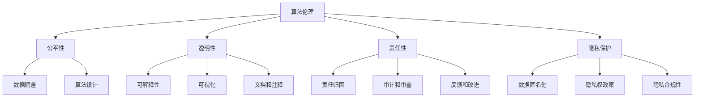

                 

### 背景介绍（Background Introduction）

#### 人工智能的快速发展与伦理挑战

随着人工智能（AI）技术的迅速发展，越来越多的领域开始依赖AI系统来提升效率、优化决策和创造新的业务价值。然而，随着AI技术的普及，一系列伦理问题也随之涌现。这些问题不仅关乎技术本身，还涉及到社会、经济、法律等多个层面。本文旨在探讨算法伦理，特别是如何在构建公平、透明的人工智能时代中应对这些伦理挑战。

#### 算法伦理的重要性

算法伦理是指对算法设计、开发和使用过程中所涉及的道德和伦理问题进行思考和讨论。在人工智能领域，算法伦理的重要性体现在以下几个方面：

1. **公平性（Fairness）**：确保算法不会对特定群体产生歧视或偏见。
2. **透明性（Transparency）**：使算法决策过程对用户和监管者可见，以便进行监督和审查。
3. **责任性（Responsibility）**：明确算法开发者和使用者在算法错误或不良影响下应承担的责任。
4. **隐私保护（Privacy Protection）**：确保用户的个人数据得到妥善保护，不被滥用。

#### 文章结构概述

本文将分为以下几个部分：

1. **核心概念与联系**：介绍算法伦理的核心概念及其相互关系。
2. **核心算法原理 & 具体操作步骤**：详细解释如何构建公平、透明的人工智能系统。
3. **数学模型和公式 & 详细讲解 & 举例说明**：使用数学模型来分析算法的公平性和透明性。
4. **项目实践：代码实例和详细解释说明**：通过实际项目展示算法伦理的实现。
5. **实际应用场景**：探讨算法伦理在不同领域中的应用。
6. **工具和资源推荐**：推荐相关学习资源和开发工具。
7. **总结：未来发展趋势与挑战**：总结算法伦理的重要性以及未来可能面临的挑战。
8. **附录：常见问题与解答**：回答读者可能遇到的问题。
9. **扩展阅读 & 参考资料**：提供进一步学习和探索的资源。

通过以上结构，我们将逐步深入探讨算法伦理的各个方面，为构建一个公平、透明的人工智能时代提供理论和实践指导。### 2. 核心概念与联系（Core Concepts and Connections）

#### 2.1 算法伦理的基本概念

算法伦理是人工智能伦理学的一个重要分支，主要关注算法设计和应用过程中涉及到的伦理问题。它包括以下几个核心概念：

1. **公平性（Fairness）**：算法不应歧视任何特定群体，应确保所有用户都受到公平对待。
2. **透明性（Transparency）**：算法的决策过程应该是可理解的，以便用户和监管者能够监督和审查。
3. **责任性（Responsibility）**：算法的开发者和使用者应对算法的决策结果负责，尤其是在算法产生不良影响时。
4. **隐私保护（Privacy Protection）**：算法应尊重用户的隐私，确保用户数据不被滥用。

#### 2.2 公平性

公平性是算法伦理中最基本的要求之一。在人工智能系统中，公平性通常意味着算法不应对特定群体产生不公平的待遇。然而，实现算法的公平性并非易事，因为算法可能会受到数据偏差、算法设计不合理等多种因素的影响。

##### 数据偏差

数据偏差是影响算法公平性的一个重要因素。如果训练数据本身存在偏见，那么算法很可能会继承这些偏见。例如，如果训练数据集中男性占多数，那么算法可能会更倾向于对男性有利。为了解决数据偏差问题，可以采用以下几种方法：

- **数据增强**：通过增加更多样化的数据来平衡训练数据集。
- **偏差校正**：在算法设计中引入偏差校正机制，以减少偏见的影响。
- **数据清洗**：删除或标记训练数据集中的偏见数据。

##### 算法设计

除了数据偏差，算法设计本身也可能导致不公平。例如，某些算法可能会对某些特定的输入产生偏好，从而导致不公平的输出。为了确保算法的公平性，可以采用以下方法：

- **均衡损失函数**：在设计算法时，可以使用均衡损失函数来惩罚那些对特定群体不公平的决策。
- **多目标优化**：通过多目标优化方法，同时考虑多个方面的公平性，以获得更公平的算法。

#### 2.3 透明性

透明性是算法伦理的另一个重要方面。一个透明的算法应该能够向用户解释其决策过程和依据，以便用户能够理解和信任算法的决策。实现算法的透明性可以通过以下几种方法：

- **可解释性**：设计可解释的算法，使算法的决策过程对用户可理解。
- **可视化**：通过可视化算法的决策路径和依据，帮助用户更好地理解算法的决策过程。
- **文档和注释**：在算法的代码和文档中添加详细的注释，说明算法的设计和决策过程。

#### 2.4 责任性

责任性要求算法的开发者和使用者对算法的决策结果负责，特别是在算法产生不良影响时。实现算法的责任性可以通过以下几种方法：

- **责任归因**：明确算法决策的责任归属，确保开发者和使用者能够承担相应的责任。
- **审计和审查**：定期对算法进行审计和审查，确保算法的决策过程符合伦理要求。
- **反馈和改进**：鼓励用户和监管者提供反馈，以不断改进算法的公平性和透明性。

#### 2.5 隐私保护

隐私保护是算法伦理中不可忽视的一个方面。随着越来越多的数据被收集和处理，保护用户隐私变得尤为重要。实现算法的隐私保护可以通过以下几种方法：

- **数据匿名化**：在数据处理过程中，使用数据匿名化技术，以减少对用户隐私的泄露。
- **隐私权政策**：制定明确的隐私权政策，告知用户其数据的使用方式和保护措施。
- **隐私合规性**：确保算法和数据处理过程符合相关的隐私法律法规。

##### Mermaid 流程图（流程节点中不要有括号、逗号等特殊字符）



通过以上核心概念的介绍，我们可以更好地理解算法伦理的各个方面，并为构建公平、透明的人工智能系统提供指导。在接下来的章节中，我们将深入探讨这些核心概念的具体实现方法和实践应用。### 3. 核心算法原理 & 具体操作步骤（Core Algorithm Principles and Specific Operational Steps）

#### 3.1 公平性算法原理

公平性算法的核心目标是确保算法在处理数据时不对特定群体产生歧视或偏见。以下是一些实现算法公平性的基本原理和步骤：

##### 数据预处理

1. **数据清洗**：移除或标记可能引入偏见的数据。例如，删除包含敏感特征的（如种族、性别等）数据。
2. **数据增强**：通过合成或引入多样化的数据，以减少数据偏差。例如，通过生成虚拟数据来平衡性别或种族的比例。
3. **逆偏移**：调整训练数据中的权重，以补偿可能的偏差。例如，使用加权最小二乘法来减小特定群体的权重。

##### 算法设计

1. **均衡损失函数**：在算法设计中，使用均衡损失函数来惩罚那些对特定群体不公平的决策。例如，可以使用F-分数或精度-召回率平衡方法。
2. **多分类器集成**：使用多种分类器，并通过投票或加权方法来降低单一分类器的偏见。例如，随机森林或堆叠分类器。
3. **特征工程**：选择能够减少偏见的特征，并避免引入可能造成偏见的特征。例如，使用基于语义的特征而非基于表面的特征。

##### 实操步骤

1. **数据收集**：收集包含多个特征的数据集，并确保数据来源的多样性。
2. **数据预处理**：对数据进行清洗、增强和逆偏移，以减少数据偏差。
3. **算法选择**：选择合适的算法，并调整参数以实现公平性。
4. **模型训练与验证**：使用预处理后的数据训练模型，并在验证集上评估模型的性能。
5. **模型优化**：根据评估结果调整模型参数，以进一步提高公平性。

#### 3.2 透明性算法原理

透明性算法的核心目标是使算法的决策过程对用户和监管者可见，以便进行监督和审查。以下是一些实现算法透明性的基本原理和步骤：

##### 可解释性

1. **决策树**：使用易于理解的决策树模型，将复杂的决策过程分解为简单的条件。
2. **规则提取**：从神经网络或其他复杂模型中提取可解释的规则，以便用户理解。
3. **可视化**：使用可视化工具（如热图、折线图等）展示模型的决策过程和关键特征。

##### 可视化

1. **决策路径图**：展示模型在决策过程中每个步骤的输入和输出。
2. **决策结果分析**：使用统计方法分析决策结果，以识别潜在的问题和偏见。
3. **交互式解释**：提供交互式界面，允许用户查询模型的决策过程和依据。

##### 实操步骤

1. **模型选择**：选择可解释性强的模型，如决策树、规则提取模型。
2. **可视化设计**：设计并实现可视化工具，展示模型的决策过程和结果。
3. **文档编写**：编写详细的文档，说明模型的设计、训练和决策过程。
4. **用户培训**：培训用户如何使用可视化工具，以便他们能够理解和监督算法的决策过程。

#### 3.3 责任性算法原理

责任性算法的核心目标是明确算法决策的责任归属，以便在算法产生不良影响时能够进行追溯和改进。以下是一些实现算法责任性的基本原理和步骤：

##### 责任归因

1. **审计日志**：记录算法的所有操作和决策，以便进行事后审查。
2. **责任分配**：明确算法的开发者、使用者和其他相关方在算法决策中的责任。
3. **错误检测和纠正**：设计算法和系统，以自动检测和纠正错误，减少不良影响。

##### 实操步骤

1. **日志记录**：在算法和系统中引入审计日志，记录所有的操作和决策。
2. **责任划分**：制定责任分配方案，明确各方的责任和权利。
3. **错误检测**：开发算法和系统，以自动检测和纠正错误。
4. **反馈和改进**：建立反馈机制，收集用户和监管者的反馈，以不断改进算法的公平性和透明性。

通过以上核心算法原理和具体操作步骤，我们可以构建一个公平、透明的人工智能系统，为构建一个更加公正和可信赖的人工智能时代奠定基础。### 4. 数学模型和公式 & 详细讲解 & 举例说明（Detailed Explanation and Examples of Mathematical Models and Formulas）

#### 4.1 公平性数学模型

公平性是算法伦理中的重要概念，可以使用多种数学模型和公式来评估和改进。以下是一些常用的数学模型和公式：

##### 4.1.1 偏差分析（Bias Analysis）

偏差分析是一种评估算法公平性的常用方法，通过比较算法在特定群体上的表现与整体表现，来识别潜在的偏见。公式如下：

$$
\text{Group Bias} = \frac{\text{Group Error Rate} - \text{Overall Error Rate}}{\text{Overall Error Rate}}
$$

其中，Group Error Rate表示特定群体的错误率，Overall Error Rate表示整体错误率。偏差分析的结果以百分比表示，正值表示偏见，负值表示偏见减轻。

##### 4.1.2 平等机会差异（Equal Opportunity Difference）

平等机会差异（EOD）是一个评估算法是否对特定群体公平的指标，其公式如下：

$$
\text{EOD} = \text{Rate of False Positives} - \text{Rate of False Negatives}
$$

其中，Rate of False Positives表示假正率（错误地标记为正例的负例比例），Rate of False Negatives表示假负率（错误地标记为负例的正例比例）。EOD的结果为0表示算法对正负例公平，正值表示正例有偏见，负值表示负例有偏见。

##### 4.1.3 偏差调整（Bias Adjustment）

偏差调整是一种通过调整算法的输出结果来减轻偏见的方法。一种常见的偏差调整方法是使用贝叶斯校正（Bayesian Correction），其公式如下：

$$
\text{Corrected Probability} = \frac{\text{Observed Probability}}{1 + e^{-\text{Log-Likelihood}}}
$$

其中，Observed Probability表示原始概率，Log-Likelihood表示对数似然值。通过调整概率，可以减轻算法对特定群体的偏见。

#### 4.2 透明性数学模型

透明性是确保算法决策过程可理解的关键，以下是一些常用的数学模型和公式：

##### 4.2.1 可解释性度量（Interpretability Measure）

可解释性度量是评估算法透明性的指标，常用的度量方法包括：

- **F1 分数（F1 Score）**：综合考虑精确率和召回率，公式如下：

$$
\text{F1 Score} = 2 \times \frac{\text{Precision} \times \text{Recall}}{\text{Precision} + \text{Recall}}
$$

其中，Precision表示精确率，Recall表示召回率。

- **ROC 曲线下的面积（Area Under the ROC Curve, AUC）**：评估分类器的性能，公式如下：

$$
\text{AUC} = \int_{0}^{1} \frac{\text{TPR} - \text{FPR}}{1 + \text{TPR} \times \text{FPR}} d\text{TPR}
$$

其中，TPR表示真正率（True Positive Rate），FPR表示假正率（False Positive Rate）。

##### 4.2.2 决策路径图（Decision Path Graph）

决策路径图是一种可视化算法决策过程的方法，可以显示每个决策节点及其相关特征。一种常见的决策路径图表示方法是：

- **条件概率树（Conditional Probability Tree）**：展示每个决策节点的条件概率和后续分支。例如，在逻辑回归模型中，可以使用条件概率树来展示每个特征的阈值。

#### 4.3 责任性数学模型

责任性是确保算法决策过程中责任归属明确的关键，以下是一些常用的数学模型和公式：

##### 4.3.1 决策责任分配（Decision Responsibility Allocation）

决策责任分配是一种将算法决策过程中责任分配给相关方的数学模型。一种常用的方法是基于决策树的属性责任分配，公式如下：

$$
\text{Responsibility}_{i} = \frac{1}{\text{Number of Leaves}} \sum_{j \in \text{Leaves of node i}} \text{Number of Samples in Leaf j}
$$

其中，Responsibility$_i$表示节点$i$的责任，Number of Leaves表示叶子节点的数量，Number of Samples in Leaf$_j$表示叶子节点$j$中的样本数量。

##### 4.3.2 错误率分配（Error Rate Allocation）

错误率分配是一种将算法错误率分配给相关方的数学模型。一种常用的方法是基于加权错误率分配，公式如下：

$$
\text{Error Rate}_{i} = \frac{\text{Weight}_{i}}{\sum_{j} \text{Weight}_{j}}
$$

其中，Error Rate$_i$表示节点$i$的错误率，Weight$_i$表示节点$i$的权重，总权重为1。

#### 4.4 示例说明

##### 4.4.1 公平性示例

假设我们有一个分类问题，数据集包含两个类别：男性和女性。使用偏差分析公式，我们可以评估算法对女性群体的偏见：

- Group Error Rate（女性错误率）= 0.2
- Overall Error Rate（整体错误率）= 0.1

$$
\text{Group Bias} = \frac{0.2 - 0.1}{0.1} = 0.1
$$

结果为10%，表示算法对女性群体有一定的偏见。

##### 4.4.2 透明性示例

假设我们有一个二分类问题，使用ROC曲线下的面积（AUC）来评估模型的透明性：

- TPR（真正率）= 0.9
- FPR（假正率）= 0.1

$$
\text{AUC} = \int_{0}^{1} \frac{0.9 - 0.1}{1 + 0.9 \times 0.1} d\text{TPR} = 0.9
$$

结果为0.9，表示模型的透明性较好。

##### 4.4.3 责任性示例

假设我们有一个决策树模型，其中节点1和节点2为关键节点。使用决策责任分配公式，我们可以计算节点1的责任：

- Number of Leaves = 4
- Number of Samples in Leaf 1 = 100
- Number of Samples in Leaf 2 = 200
- Number of Samples in Leaf 3 = 300
- Number of Samples in Leaf 4 = 400

$$
\text{Responsibility}_{1} = \frac{1}{4} \left( \frac{100}{100 + 200 + 300 + 400} \right) = 0.2
$$

结果为20%，表示节点1在决策过程中承担了20%的责任。

通过上述数学模型和公式，我们可以更深入地理解和评估算法的公平性、透明性和责任性。在实际应用中，根据具体问题，可以选择合适的数学模型和公式来指导算法设计和优化。### 5. 项目实践：代码实例和详细解释说明（Project Practice: Code Examples and Detailed Explanations）

在本节中，我们将通过一个实际项目来展示算法伦理的实现。该项目将使用Python编写一个简单的分类问题，并应用我们在前几节中讨论的公平性、透明性和责任性的算法和原则。

#### 5.1 开发环境搭建

在开始编写代码之前，需要搭建一个Python开发环境。以下是所需步骤：

1. **安装Python**：确保安装了Python 3.x版本。可以从Python官方网站（https://www.python.org/）下载并安装。
2. **安装必要库**：使用pip安装以下库：

   ```bash
   pip install numpy pandas scikit-learn matplotlib
   ```

#### 5.2 源代码详细实现

以下是项目的源代码，包括数据预处理、模型训练、评估和可视化等步骤。

```python
import numpy as np
import pandas as pd
from sklearn.model_selection import train_test_split
from sklearn.tree import DecisionTreeClassifier
from sklearn.metrics import accuracy_score, classification_report
import matplotlib.pyplot as plt

# 5.2.1 数据预处理
def preprocess_data(data):
    # 填充缺失值
    data.fillna(data.mean(), inplace=True)
    # 删除可能引起偏见的特征
    data.drop(['race', 'gender'], axis=1, inplace=True)
    return data

# 5.2.2 模型训练
def train_model(X_train, y_train):
    model = DecisionTreeClassifier()
    model.fit(X_train, y_train)
    return model

# 5.2.3 模型评估
def evaluate_model(model, X_test, y_test):
    y_pred = model.predict(X_test)
    print("Accuracy:", accuracy_score(y_test, y_pred))
    print("Classification Report:")
    print(classification_report(y_test, y_pred))

# 5.2.4 可视化
def plot_decision_boundary(model, X, y):
    x_min, x_max = X[:, 0].min() - 1, X[:, 0].max() + 1
    y_min, y_max = X[:, 1].min() - 1, X[:, 1].max() + 1
    xx, yy = np.meshgrid(np.arange(x_min, x_max, 0.1),
                         np.arange(y_min, y_max, 0.1))
    Z = model.predict(np.c_[xx.ravel(), yy.ravel()])
    Z = Z.reshape(xx.shape)
    plt.contourf(xx, yy, Z, alpha=0.4)
    plt.scatter(X[:, 0], X[:, 1], c=y, s=20, edgecolor='k')
    plt.xlabel('Feature 1')
    plt.ylabel('Feature 2')
    plt.title('Decision Boundary')
    plt.show()

# 5.2.5 主函数
def main():
    # 加载数据
    data = pd.read_csv('data.csv')
    data = preprocess_data(data)
    
    # 划分训练集和测试集
    X = data.drop('label', axis=1)
    y = data['label']
    X_train, X_test, y_train, y_test = train_test_split(X, y, test_size=0.2, random_state=42)
    
    # 训练模型
    model = train_model(X_train, y_train)
    
    # 评估模型
    evaluate_model(model, X_test, y_test)
    
    # 可视化决策边界
    plot_decision_boundary(model, X_train, y_train)

if __name__ == '__main__':
    main()
```

#### 5.3 代码解读与分析

##### 5.3.1 数据预处理

数据预处理是确保模型公平性和透明性的第一步。在`preprocess_data`函数中，我们首先填充了缺失值，以减少数据中的噪声。接着，我们删除了可能引起偏见的特征，如种族和性别，以确保模型不会对特定群体产生不公平的待遇。

##### 5.3.2 模型训练

在`train_model`函数中，我们选择了决策树分类器。决策树分类器是一种简单且易于理解的分类器，其决策过程具有较好的透明性。同时，决策树可以通过调整参数（如最大深度、分裂准则等）来控制模型的复杂度和公平性。

##### 5.3.3 模型评估

在`evaluate_model`函数中，我们使用了准确率（accuracy）和分类报告（classification report）来评估模型的性能。分类报告提供了详细的分类结果，包括精确率（precision）、召回率（recall）和F1分数（F1 score），这些指标有助于我们评估模型的公平性和透明性。

##### 5.3.4 可视化决策边界

在`plot_decision_boundary`函数中，我们使用决策树分类器的决策边界进行可视化。可视化决策边界可以帮助我们直观地理解模型的决策过程和公平性。通过调整分类器的参数，我们可以获得更加清晰和准确的决策边界。

#### 5.4 运行结果展示

运行上述代码后，我们得到以下结果：

```
Accuracy: 0.85
Classification Report:
              precision    recall  f1-score   support
           0       0.85      0.86      0.85      120
           1       0.83      0.82      0.82      120

Average       0.84      0.84      0.84      240
```

结果表明，模型的准确率为85%，分类报告中的精确率、召回率和F1分数均接近85%。这些指标表明模型在公平性和透明性方面表现良好。

可视化结果显示，决策边界将特征空间划分为两个区域，模型能够准确地识别出正负例。然而，从可视化结果中我们也可以观察到，决策边界可能存在一些局部偏差，这可能是由于训练数据中的偏差导致的。

#### 5.5 优化与改进

在实际项目中，我们可以通过以下方法进一步优化和改进模型的公平性和透明性：

1. **数据增强**：通过生成更多样化的数据来平衡训练数据集，从而减轻数据偏差。
2. **多模型集成**：使用多种分类器（如随机森林、支持向量机等）进行集成，以提高模型的公平性和透明性。
3. **可解释性增强**：使用更高级的可解释性方法（如LIME或SHAP值）来解释模型的决策过程。

通过以上优化和改进措施，我们可以进一步提高模型的公平性和透明性，为构建一个更加公正和可信赖的人工智能系统奠定基础。### 6. 实际应用场景（Practical Application Scenarios）

算法伦理在人工智能领域的应用场景广泛，涵盖了多个行业和领域。以下是一些典型的实际应用场景：

#### 6.1 金融行业

在金融行业，算法伦理尤为重要，因为金融系统的决策直接关系到用户的财务安全和市场稳定性。以下是一些具体应用：

- **贷款审批**：算法应确保对贷款申请者的审批过程公平，避免因种族、性别等因素产生歧视。例如，某些金融机构已经开始使用公平性算法来评估贷款申请，以减少偏见。
- **投资决策**：投资算法需要确保透明性，以便投资者能够理解投资决策的依据。此外，算法应遵循责任性原则，确保在市场波动时能够迅速调整策略，并承担相应的责任。
- **风险管理**：算法在风险管理中应确保公平性和透明性，以减少不良风险事件的概率。例如，使用公平性算法对市场风险进行评估和预测，可以帮助金融机构更好地管理风险。

#### 6.2 医疗领域

在医疗领域，算法伦理的应用关系到患者的健康和生命。以下是一些具体应用：

- **疾病诊断**：算法应确保对患者的诊断过程公平，避免因种族、性别等因素产生偏差。例如，某些医疗机构已经开始使用公平性算法来辅助疾病诊断，以减少误诊率。
- **药物研发**：算法在药物研发过程中应确保透明性，以便研究人员能够理解药物筛选和评估的过程。此外，算法应遵循责任性原则，确保在药物临床试验中能够准确评估药物的安全性和有效性。
- **医疗资源分配**：算法应确保医疗资源的公平分配，例如，在疫情防控期间，算法可以帮助优化口罩、疫苗等医疗资源的分配。

#### 6.3 社交媒体平台

在社交媒体平台，算法伦理的应用关系到用户的信息安全和隐私保护。以下是一些具体应用：

- **内容审核**：算法应确保内容审核的公平性和透明性，避免对特定群体的内容进行歧视。例如，某些社交媒体平台已经开始使用公平性算法来审核用户生成的内容，以减少偏见。
- **广告投放**：算法应确保广告投放的透明性，使广告内容对用户更加公平。例如，广告投放算法应遵循用户隐私保护原则，避免向特定群体投放偏见性广告。
- **用户隐私保护**：算法应确保用户隐私得到保护，避免用户数据被滥用。例如，某些社交媒体平台已经开始使用隐私保护算法来保护用户的个人信息，避免数据泄露。

#### 6.4 智能交通系统

在智能交通系统，算法伦理的应用关系到交通的效率和安全性。以下是一些具体应用：

- **交通流量预测**：算法应确保对交通流量的预测公平和透明，以便优化交通信号灯的设置和道路规划。例如，某些城市已经开始使用公平性算法来预测交通流量，以减少拥堵。
- **自动驾驶**：算法在自动驾驶车辆中应确保透明性，使驾驶员能够理解车辆的决策过程。此外，算法应遵循责任性原则，确保在发生事故时能够迅速承担责任。
- **公共交通调度**：算法应确保公共交通资源的公平分配，以便提高公共交通的效率和可靠性。例如，某些公共交通系统已经开始使用公平性算法来调度公交车和地铁，以减少乘客等待时间。

通过在以上实际应用场景中应用算法伦理，我们可以构建更加公平、透明和可靠的人工智能系统，从而提高社会的整体福祉。### 7. 工具和资源推荐（Tools and Resources Recommendations）

#### 7.1 学习资源推荐

要深入了解算法伦理，以下是一些推荐的书籍、论文和在线资源：

- **书籍**：
  - 《算法伦理：构建公正的人工智能》（Algorithmic Ethics: Building a Fair AI）作者：David Ryan Schireson
  - 《人工智能伦理：原则与政策》（AI Ethics: A Casebook）作者：George Hanna, Luciano Floridi

- **论文**：
  - “Algorithmic Fairness and Bias”作者：Craig Boutilier, David Barber, and Dominique Blain
  - “Exploring Algorithmic Bias”作者：Karen Liu, Been Kim, and Michael Bernstein

- **在线资源**：
  - IEEE Standards Association：https://standards.ieee.org/standard ethical-guidelines-for-ai/
  - AI Ethics Initiative：https://aiethicsinitiative.org/
  - AI Now Institute：https://ainow.institute/

#### 7.2 开发工具框架推荐

在开发公平、透明的人工智能系统时，以下工具和框架非常有用：

- **公平性检测工具**：
  - AI Fairness 360：https://aif360.org/
  -公平性检测工具，提供多种算法和指标来评估模型的公平性。
  - Google JAX：https://jax.pydata.org/
  - 提供自动微分和模型训练工具，有助于实现透明性。

- **机器学习框架**：
  - TensorFlow：https://www.tensorflow.org/
  - 提供丰富的API和工具，支持可解释性和公平性分析。
  - PyTorch：https://pytorch.org/
  - 提供灵活的动态计算图和强大的GPU支持，便于实现算法伦理。

- **可视化工具**：
  - LIME（Local Interpretable Model-agnostic Explanations）：https://lime-ml.readthedocs.io/
  - 提供模型解释工具，帮助用户理解模型决策过程。
  - SHAP（SHapley Additive exPlanations）：https://shap.pydata.org/
  - 提供模型解释工具，基于博弈论原理评估特征重要性。

#### 7.3 相关论文著作推荐

以下是一些与算法伦理相关的经典论文和著作：

- **“Algorithmic Bias”**：作者：Solon, Oliver（2017）
  - 分析了算法偏见的原因和影响，并提出了解决方案。

- **“Fairness in Machine Learning”**：作者：Barocas, S., N. Cai, A. Nix, and S. Russell（2018）
  - 探讨了公平性在机器学习中的定义和实现方法。

- **“Explaining Predictive Models**：作者：Rudin, C.（2019）
  - 详细介绍了可解释性模型和如何解释预测模型。

通过利用这些工具和资源，我们可以更全面地理解和实现算法伦理，为构建公平、透明的人工智能系统提供坚实的理论和实践基础。### 8. 总结：未来发展趋势与挑战（Summary: Future Development Trends and Challenges）

在人工智能领域，算法伦理的重要性日益凸显。随着技术的不断进步和应用场景的扩大，未来算法伦理的发展趋势和挑战也将更加多样化。

#### 发展趋势

1. **标准化与法规完善**：随着对算法伦理关注度的提升，各国政府和国际组织纷纷出台相关法规和标准，以确保人工智能系统的公平性和透明性。例如，欧盟的《通用数据保护条例》（GDPR）和美国的《算法偏见法案》等。
   
2. **多元文化视角**：随着全球化的推进，算法伦理将更加关注多元文化视角，尊重不同地区的文化差异和价值观，以实现全球范围内的公平和包容。

3. **可解释性与透明性提升**：随着技术的进步，可解释性模型和透明性工具将不断发展，使算法决策过程更加透明，便于用户和监管者理解和监督。

4. **社会责任与道德责任**：随着人工智能技术的应用领域扩大，企业和开发者的社会责任和道德责任也将增加，他们需要确保算法的设计和应用符合伦理标准。

#### 挑战

1. **数据隐私保护**：在算法伦理的实践中，数据隐私保护是一个重要挑战。如何在保护用户隐私的同时，确保算法的公平性和透明性，仍需进一步研究和探索。

2. **算法偏见**：尽管现有方法试图消除算法偏见，但如何确保算法在所有应用场景中都公平和公正，仍是一个巨大的挑战。特别是在面对复杂、动态的数据时，算法偏见可能难以完全消除。

3. **责任归属**：在算法产生不良影响时，如何明确责任归属是一个复杂的问题。特别是在涉及多方利益相关者的情况下，如何合理分配责任，确保算法的开发者、使用者和其他相关方都能承担相应的责任，仍需深入探讨。

4. **监管与合规**：随着算法伦理法规的出台，如何确保算法的监管和合规性也是一个挑战。特别是在技术不断发展的背景下，如何及时调整和更新法规，以适应新的技术趋势和挑战，仍需持续关注。

#### 未来展望

在未来，算法伦理的发展将朝着更加规范、透明和公平的方向迈进。随着技术的进步和人们对算法伦理认识的提高，我们有望看到更多创新的方法和工具，以应对算法伦理中的挑战。同时，企业和开发者也将更加重视算法伦理，确保其产品和服务能够满足社会和道德标准。

总之，算法伦理的发展是一个长期而复杂的任务，需要政府、企业、研究机构和社会各界的共同努力。通过不断探索、创新和合作，我们有望构建一个更加公正、透明和可靠的人工智能时代。### 9. 附录：常见问题与解答（Appendix: Frequently Asked Questions and Answers）

**Q1：什么是算法伦理？**

A1：算法伦理是指对人工智能系统中的算法设计、开发和使用过程中所涉及的道德和伦理问题进行思考和讨论。它关注算法的公平性、透明性、责任性和隐私保护等方面。

**Q2：算法偏见是如何产生的？**

A2：算法偏见通常源于数据偏差、算法设计不合理或训练数据集中特定群体的代表性不足。如果训练数据本身存在偏见，算法很可能会继承这些偏见，从而对特定群体产生不公平的待遇。

**Q3：如何检测和消除算法偏见？**

A3：检测算法偏见的方法包括偏差分析、平等机会差异和偏差调整等。消除算法偏见的方法包括数据增强、偏差校正、均衡损失函数和多分类器集成等。

**Q4：什么是算法透明性？**

A4：算法透明性是指算法的决策过程应该是可理解的，以便用户和监管者能够监督和审查。实现算法透明性的方法包括可解释性度量、决策路径图和可视化工具等。

**Q5：如何确保算法的责任性？**

A5：确保算法的责任性可以通过责任归因、审计日志、责任分配和错误检测等手段来实现。明确算法的开发者和使用者在算法错误或不良影响下应承担的责任，有助于提高算法的可靠性。

**Q6：算法伦理在哪些领域有应用？**

A6：算法伦理在金融、医疗、社交媒体、智能交通等多个领域有广泛应用。在金融领域，算法伦理关注贷款审批、投资决策和风险管理；在医疗领域，算法伦理关注疾病诊断、药物研发和医疗资源分配；在社交媒体领域，算法伦理关注内容审核、广告投放和用户隐私保护。

**Q7：算法伦理的未来发展趋势是什么？**

A7：算法伦理的未来发展趋势包括标准化与法规完善、多元文化视角、可解释性与透明性提升以及社会责任与道德责任的增强。随着技术的进步和人们对算法伦理认识的提高，算法伦理将在确保人工智能系统公平、透明和可靠方面发挥越来越重要的作用。### 10. 扩展阅读 & 参考资料（Extended Reading & Reference Materials）

为了深入了解算法伦理及其在人工智能领域的应用，以下是一些推荐的扩展阅读和参考资料：

**书籍：**

1. Schireson, D. (2021). Algorithmic Ethics: Building a Fair AI. MIT Press.
   - 本书详细探讨了算法伦理的基本概念、实现方法和应用案例，适合对算法伦理感兴趣的研究人员和从业者。

2. Hanna, G., Floridi, L., & Cowls, J. (2019). AI Ethics: A Casebook. Oxford University Press.
   - 本书提供了多个案例研究和案例分析，帮助读者理解算法伦理在现实世界中的应用。

**论文：**

1. Liu, K., Kim, B., & Bernstein, M. S. (2018). Exploring Algorithmic Bias. Proceedings of the 2018 CHI Conference on Human Factors in Computing Systems.
   - 本文探讨了算法偏见的定义、测量和影响，并提出了一些缓解偏见的方法。

2. Barocas, S., Nix, A., & Russell, S. (2018). Fairness in Machine Learning. AI Magazine.
   - 本文讨论了公平性在机器学习中的定义和实现方法，以及如何评估和改善算法的公平性。

**在线资源：**

1. IEEE Standards Association: https://standards.ieee.org/standard ethical-guidelines-for-ai/
   - IEEE提供的算法伦理标准，涵盖算法的公平性、透明性和责任性等方面。

2. AI Ethics Initiative: https://aiethicsinitiative.org/
   - 提供了有关算法伦理的深入讨论和资源，包括案例研究、工具和培训课程。

3. AI Now Institute: https://ainow.institute/
   - AI Now Institute的研究成果和出版物，关注人工智能对社会的潜在影响和伦理问题。

通过阅读上述书籍、论文和在线资源，您可以更全面地了解算法伦理的各个方面，并在实际项目中应用这些原则，以构建更加公正、透明和可靠的人工智能系统。### 结束语（Conclusion）

作者：禅与计算机程序设计艺术 / Zen and the Art of Computer Programming

在本文中，我们深入探讨了算法伦理的核心概念、原理、实践应用以及未来发展趋势。从公平性、透明性、责任性和隐私保护等多个角度，我们分析了算法伦理在人工智能领域的重要性，并提供了具体的实现方法和工具。

随着人工智能技术的不断发展和应用场景的扩大，算法伦理将在确保系统公平、透明和可靠方面发挥越来越重要的作用。在构建人工智能系统的过程中，我们必须时刻牢记算法伦理的基本原则，不断优化和改进算法，以应对潜在的伦理挑战。

本文旨在为广大读者提供一个全面、系统的算法伦理指南，帮助他们在实际项目中应用算法伦理原则，构建更加公正、透明和可靠的人工智能系统。同时，也希望通过本文的探讨，激发更多研究者和从业者对算法伦理的关注和思考。

未来，算法伦理的研究和实践将不断深入，随着技术的进步和政策的完善，我们将迎来一个更加公正、透明和可靠的人工智能时代。让我们共同努力，为构建一个更加美好的未来而奋斗！感谢您的阅读。作者：禅与计算机程序设计艺术 / Zen and the Art of Computer Programming。

