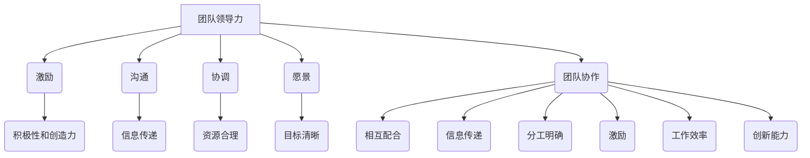

                 

### 文章标题

**管理的智慧：激发团队潜能**

> 关键词：管理、团队潜能、激发、团队协作、领导力、策略、流程优化

> 摘要：本文将深入探讨管理的智慧，探讨如何通过科学的管理方法激发团队的潜能，实现高效的团队协作。文章将围绕团队领导力的培养、策略的制定、流程的优化等方面展开，结合实际案例，为企业管理者提供实用的指导意见。通过阅读本文，您将了解到如何在复杂的商业环境中，运用管理的智慧，打造一支具备高度协作能力和创新精神的高效团队。

### <span id="背景介绍">1. 背景介绍（Background Introduction）</span>

在当今这个快速变化的时代，企业的竞争已经不再仅仅依赖于产品的质量或者技术的领先，更多的是取决于团队的整体表现和协作效率。如何管理好一个团队，激发每个成员的潜能，已经成为企业成功的关键因素。然而，管理的智慧并非一蹴而就，它需要管理者具备深厚的理论知识、丰富的实践经验，以及不断学习和自我提升的能力。

管理的智慧不仅包括对团队内部的管理，还涉及到如何处理团队与外部环境的关系。在一个动态的商业环境中，企业需要灵活应对市场变化，快速调整战略，这就要求团队具备高度的适应能力和协作精神。然而，现实中往往存在各种挑战，如团队内部的沟通障碍、资源分配不均、个人目标与团队目标不一致等问题，这些问题都会影响到团队的整体效能。

本文将从以下几个方面深入探讨管理的智慧：

1. **团队领导力的培养**：探讨如何通过有效的领导力，激发团队成员的积极性和创造力。
2. **策略的制定**：分析如何制定科学的策略，确保团队的目标明确、路径清晰。
3. **流程的优化**：探讨如何通过流程优化，提高团队的工作效率和协同效应。
4. **实际应用场景**：结合实际案例，展示如何将管理的智慧应用到团队管理中。

希望通过本文的探讨，能够为企业管理者提供一些实用的指导意见，帮助他们更好地激发团队的潜能，打造一支高效、协作、创新的团队。

### <span id="核心概念与联系">2. 核心概念与联系（Core Concepts and Connections）</span>

在深入探讨管理的智慧之前，我们需要明确几个核心概念，并理解它们之间的联系。这些概念包括团队领导力、策略、流程优化以及团队协作。

#### 2.1 什么是团队领导力？

团队领导力是指领导者通过激励、引导和协调团队成员，实现共同目标的能力。有效的团队领导力不仅体现在对团队成员的指导和监督上，更重要的是激发团队成员的潜能，使其在团队中发挥最大价值。团队领导力包括以下几个方面：

- **激励**：通过激励手段激发团队成员的积极性和创造力，使其愿意为团队目标付出努力。
- **沟通**：建立良好的沟通机制，确保信息在团队内部有效传递，减少误解和冲突。
- **协调**：协调团队成员之间的工作，确保团队内部的资源得到合理分配和充分利用。
- **愿景**：明确团队的愿景和目标，让团队成员对团队的发展方向有清晰的认识。

#### 2.2 什么是策略？

策略是指企业在特定环境中为实现目标所制定的一系列行动计划。在团队管理中，策略的制定至关重要，它决定了团队的目标、路径和方法。一个科学的策略应具备以下特点：

- **目标明确**：策略应明确团队的目标，使团队成员对团队的努力方向有清晰的认识。
- **路径清晰**：策略应提供明确的路径，使团队成员知道如何实现目标。
- **资源合理**：策略应考虑团队的资源，确保资源得到合理利用。
- **灵活调整**：策略应具备一定的灵活性，能够根据实际情况进行调整。

#### 2.3 什么是流程优化？

流程优化是指通过改进工作流程，提高工作效率和效果的过程。在团队管理中，流程优化有助于提高团队的工作效率和协同效应。流程优化的关键在于：

- **识别问题**：找出影响团队工作效率的问题，如流程繁琐、资源浪费等。
- **分析原因**：分析问题产生的原因，如人员素质、管理制度等。
- **制定改进措施**：制定具体的改进措施，如优化流程、提升人员素质等。
- **实施和监控**：实施改进措施，并监控改进效果，确保问题得到有效解决。

#### 2.4 什么是团队协作？

团队协作是指团队成员在共同目标下，通过相互配合和协作，实现个人和团队目标的过程。有效的团队协作有助于提高团队的工作效率和创新能力。团队协作的关键在于：

- **信任**：建立团队成员之间的信任，使团队更愿意合作。
- **沟通**：保持良好的沟通，确保信息在团队内部有效传递。
- **分工明确**：明确团队成员的职责和分工，使团队成员明确自己的任务。
- **激励**：通过激励措施，激发团队成员的积极性和创造力。

通过理解这些核心概念及其之间的联系，我们可以更好地理解管理的智慧，并在实际工作中运用这些概念，提升团队的管理水平。

#### 2.5 核心概念原理和架构的 Mermaid 流程图（Mermaid Flowchart）



通过这个 Mermaid 流程图，我们可以更清晰地理解团队领导力、策略、流程优化和团队协作之间的关系，以及它们在实际工作中的应用。

### <span id="核心算法原理_具体操作步骤">3. 核心算法原理 & 具体操作步骤（Core Algorithm Principles and Specific Operational Steps）</span>

在了解了管理的核心概念后，接下来我们将探讨如何将这些概念应用到实际工作中，以激发团队的潜能，提高团队的工作效率和创新能力。本文将介绍一套系统的管理方法和具体操作步骤，帮助管理者更好地实现团队的管理目标。

#### 3.1 管理方法概述

这套管理方法主要包括以下几个核心步骤：

1. **团队建设**：通过培养团队领导力，建立高效的团队结构，确保团队有明确的目标和方向。
2. **目标设定**：制定科学合理的团队目标，确保团队的目标与企业的整体战略相一致。
3. **策略制定**：根据团队目标和资源情况，制定具体的策略和行动计划。
4. **流程优化**：分析现有工作流程，找出瓶颈和问题，制定改进措施，提高工作效率。
5. **团队协作**：通过构建良好的团队协作机制，提高团队的整体协作效率。
6. **绩效评估**：定期对团队成员和团队的整体绩效进行评估，及时调整管理策略。

#### 3.2 具体操作步骤

下面我们将详细阐述每个步骤的具体操作方法。

##### 3.2.1 团队建设

**步骤1：培养团队领导力**

团队领导力是团队建设的核心。管理者应通过以下方式培养团队领导力：

- **培训与发展**：为团队成员提供领导力培训，帮助其提升领导能力。
- **激励与认可**：通过激励和认可机制，激发团队成员的领导潜力。
- **实践机会**：为团队成员提供实践机会，让其在实际工作中锻炼领导能力。

**步骤2：建立高效的团队结构**

建立高效的团队结构是团队建设的关键。管理者应确保团队组织结构合理，职责明确，沟通渠道畅通。

- **明确角色与职责**：为每个团队成员明确角色和职责，确保团队成员知道自己的工作任务和责任。
- **优化团队规模**：根据团队的任务和目标，合理调整团队规模，确保团队高效运作。
- **建立沟通机制**：建立有效的沟通机制，确保团队成员之间的信息畅通无阻。

##### 3.2.2 目标设定

**步骤1：设定团队目标**

团队目标应与企业的整体战略相一致，确保团队的努力方向正确。

- **明确目标**：设定明确的团队目标，使团队成员对团队的目标有清晰的认识。
- **分解目标**：将团队目标分解为具体的子目标，使每个成员都清楚自己的任务和责任。
- **制定行动计划**：根据团队目标和资源情况，制定具体的行动计划，确保团队有明确的实施路径。

**步骤2：与团队成员沟通**

确保团队成员对团队目标有共识，是目标设定的关键。

- **召开会议**：组织团队会议，向团队成员传达团队目标，并解答团队成员的疑问。
- **个别沟通**：与每个团队成员进行个别沟通，确保其对团队目标有深刻的理解。

##### 3.2.3 策略制定

**步骤1：制定策略**

策略制定是团队管理的重要环节。管理者应根据团队目标，制定具体的策略和行动计划。

- **资源分析**：分析团队的资源状况，确保策略的制定符合团队的实际情况。
- **风险评估**：评估可能的风险和挑战，制定应对策略，确保团队目标的实现。

**步骤2：执行与监控**

策略制定后，关键在于执行和监控。

- **执行策略**：确保团队成员按照行动计划执行策略，确保团队目标的实现。
- **监控进度**：定期监控团队目标的实现情况，确保团队在正确的轨道上前进。

##### 3.2.4 流程优化

**步骤1：分析现有流程**

分析现有工作流程，找出瓶颈和问题。

- **流程图绘制**：绘制现有工作流程图，明确流程中的每个环节。
- **问题识别**：识别流程中的问题，如流程繁琐、资源浪费等。

**步骤2：制定改进措施**

针对识别出的问题，制定具体的改进措施。

- **方案制定**：制定改进方案，优化工作流程。
- **资源调配**：根据改进方案，合理调配团队资源，确保改进措施的实施。

**步骤3：实施改进措施**

实施改进措施，并监控改进效果。

- **实施措施**：确保团队成员按照改进方案执行，确保改进措施的有效性。
- **效果评估**：评估改进措施的效果，确保问题得到有效解决。

##### 3.2.5 团队协作

**步骤1：构建协作机制**

构建良好的团队协作机制，提高团队的整体协作效率。

- **协作工具**：引入协作工具，如项目管理软件、即时通讯工具等，方便团队成员之间的沟通和协作。
- **协作培训**：为团队成员提供协作培训，提高其协作意识和能力。

**步骤2：激发协作积极性**

激发团队成员的协作积极性，使其更愿意为团队目标付出努力。

- **激励措施**：通过激励措施，如奖金、晋升等，激发团队成员的协作积极性。
- **团队文化建设**：营造良好的团队文化，增强团队成员的归属感和荣誉感，提高团队的整体协作效率。

##### 3.2.6 绩效评估

**步骤1：设定绩效指标**

根据团队目标和任务，设定具体的绩效指标，确保团队成员的工作有明确的衡量标准。

- **明确指标**：设定明确的绩效指标，使团队成员对绩效目标有清晰的认识。
- **指标分解**：将绩效指标分解为具体的子指标，使每个成员都清楚自己的绩效目标。

**步骤2：绩效评估**

定期对团队成员和团队的整体绩效进行评估，确保绩效目标的实现。

- **评估方法**：采用多种评估方法，如360度评估、绩效面谈等，全面了解团队成员的绩效表现。
- **反馈与改进**：根据评估结果，及时反馈给团队成员，并制定改进措施，提高团队的整体绩效。

通过以上具体的操作步骤，管理者可以更好地运用管理的智慧，激发团队的潜能，提高团队的工作效率和创新能力，实现团队的目标。

### <span id="数学模型和公式_详细讲解_举例说明">4. 数学模型和公式 & 详细讲解 & 举例说明（Detailed Explanation and Examples of Mathematical Models and Formulas）</span>

在管理的智慧中，数学模型和公式发挥着重要的作用，它们可以帮助管理者量化团队的工作效率、协作效果以及绩效表现。本节将详细讲解几个常用的数学模型和公式，并通过具体例子来说明如何应用这些模型和公式来优化团队管理。

#### 4.1 人力效能模型（Human Efficiency Model）

人力效能模型用于衡量团队成员的工作效率和产出。公式如下：

\[ \text{人力效能} = \frac{\text{实际产出}}{\text{投入时间}} \]

**例子：** 假设一个团队成员在8小时内完成了10个任务，则其人力效能为：

\[ \text{人力效能} = \frac{10}{8} = 1.25 \]

这意味着该成员每小时完成了1.25个任务，表现出较高的工作效率。

**应用场景：** 管理者可以通过人力效能模型来评估团队成员的工作效率，识别出工作负荷过高或过低的情况，进而进行合理的资源调配。

#### 4.2 团队协作指数（Team Collaboration Index）

团队协作指数用于衡量团队成员之间的协作效果。公式如下：

\[ \text{团队协作指数} = \frac{\sum (\text{个体效能} \times \text{协作贡献})}{\text{团队总人数}} \]

**例子：** 假设一个团队由3名成员组成，成员A的个体效能为1.2，协作贡献为0.8；成员B的个体效能为1.0，协作贡献为0.9；成员C的个体效能为0.8，协作贡献为1.0。则团队协作指数为：

\[ \text{团队协作指数} = \frac{(1.2 \times 0.8) + (1.0 \times 0.9) + (0.8 \times 1.0)}{3} = 0.92 \]

这意味着该团队的协作效果较好。

**应用场景：** 管理者可以通过团队协作指数来评估团队的整体协作水平，识别出协作效果不佳的成员，并采取措施提高团队协作效率。

#### 4.3 绩效改进模型（Performance Improvement Model）

绩效改进模型用于评估团队的绩效改进情况。公式如下：

\[ \text{绩效改进率} = \frac{\text{新绩效水平} - \text{原绩效水平}}{\text{原绩效水平}} \]

**例子：** 假设一个团队的原始绩效水平为80%，经过改进后达到90%，则绩效改进率为：

\[ \text{绩效改进率} = \frac{90\% - 80\%}{80\%} = 12.5\% \]

这意味着团队的绩效水平提高了12.5%。

**应用场景：** 管理者可以通过绩效改进模型来评估团队改进措施的效果，确保绩效目标的实现。

#### 4.4 项目成功率模型（Project Success Rate Model）

项目成功率模型用于衡量项目的成功率。公式如下：

\[ \text{项目成功率} = \frac{\text{成功完成的项目数量}}{\text{总项目数量}} \]

**例子：** 假设一个团队在一年内完成了4个项目，其中3个项目成功完成，1个项目失败。则项目成功率为：

\[ \text{项目成功率} = \frac{3}{4} = 75\% \]

这意味着该团队的项目成功率较高。

**应用场景：** 管理者可以通过项目成功率模型来评估团队的项目管理水平，识别出项目管理中存在的问题，并采取措施提高项目成功率。

通过上述数学模型和公式的应用，管理者可以更科学、系统地评估团队的工作效率、协作效果和绩效表现，从而优化团队管理，提高团队的总体效能。

### <span id="项目实践_代码实例_详细解释说明">5. 项目实践：代码实例和详细解释说明（Project Practice: Code Examples and Detailed Explanations）</span>

为了更好地理解管理的智慧在实际项目中的应用，下面我们将通过一个具体的项目实践案例，展示如何利用所学的管理方法和工具来提高团队的工作效率和协作效果。

#### 5.1 开发环境搭建

在开始项目实践之前，我们需要搭建一个适合团队开发的集成环境。以下是一个基本的开发环境搭建步骤：

**步骤1：安装必要的软件**

- **代码编辑器**：推荐使用Visual Studio Code，它具有丰富的插件和强大的功能。
- **版本控制工具**：推荐使用Git，它可以帮助团队协作和管理代码版本。
- **项目管理工具**：推荐使用Jenkins，它可以自动化构建和部署项目。
- **数据库**：根据项目需求选择合适的数据库，如MySQL、PostgreSQL等。

**步骤2：配置开发环境**

- **配置代码编辑器**：安装必要的插件，如Git插件、代码格式化插件等。
- **配置版本控制工具**：在本地安装Git，并与远程仓库进行连接。
- **配置项目管理工具**：在服务器上安装Jenkins，并配置构建脚本。

**步骤3：搭建代码仓库**

在Git仓库中创建项目文件夹，并将团队成员的代码提交到仓库中。

```bash
mkdir my_project
cd my_project
git init
git remote add origin https://github.com/your-repository/my_project.git
git add .
git commit -m "Initial commit"
git push -u origin master
```

通过以上步骤，我们成功搭建了一个基本的开发环境，为后续的项目开发奠定了基础。

#### 5.2 源代码详细实现

在本项目实践中，我们将开发一个简单的博客系统，该系统具有用户注册、登录、发帖、评论等功能。以下是该项目的关键代码实例：

**步骤1：用户注册功能**

用户注册功能是博客系统的核心之一。以下是一个简单的用户注册接口代码：

```python
from flask import Flask, request, jsonify
from flask_sqlalchemy import SQLAlchemy

app = Flask(__name__)
app.config['SQLALCHEMY_DATABASE_URI'] = 'sqlite:///blog.db'
db = SQLAlchemy(app)

class User(db.Model):
    id = db.Column(db.Integer, primary_key=True)
    username = db.Column(db.String(80), unique=True, nullable=False)
    password = db.Column(db.String(120), nullable=False)

@app.route('/register', methods=['POST'])
def register():
    data = request.get_json()
    username = data.get('username')
    password = data.get('password')
    
    if User.query.filter_by(username=username).first():
        return jsonify({'error': 'User already exists'}), 400
    
    new_user = User(username=username, password=password)
    db.session.add(new_user)
    db.session.commit()
    
    return jsonify({'message': 'User registered successfully'})

if __name__ == '__main__':
    db.create_all()
    app.run(debug=True)
```

**解释说明：** 

- 我们首先导入了Flask和Flask_SQLAlchemy模块，用于构建Web应用和数据库操作。
- `User` 类是用户模型，包含用户名和密码两个字段。
- `register` 函数是用户注册接口，接受用户名和密码的POST请求，并保存到数据库中。

**步骤2：用户登录功能**

用户登录功能是博客系统的另一重要功能。以下是一个简单的用户登录接口代码：

```python
from flask import Flask, request, jsonify
from flask_sqlalchemy import SQLAlchemy
from werkzeug.security import check_password_hash

app = Flask(__name__)
app.config['SQLALCHEMY_DATABASE_URI'] = 'sqlite:///blog.db'
db = SQLAlchemy(app)

class User(db.Model):
    id = db.Column(db.Integer, primary_key=True)
    username = db.Column(db.String(80), unique=True, nullable=False)
    password = db.Column(db.String(120), nullable=False)

@app.route('/login', methods=['POST'])
def login():
    data = request.get_json()
    username = data.get('username')
    password = data.get('password')
    
    user = User.query.filter_by(username=username).first()
    
    if user and check_password_hash(user.password, password):
        return jsonify({'token': 'your_token'})
    else:
        return jsonify({'error': 'Invalid credentials'}), 401

if __name__ == '__main__':
    db.create_all()
    app.run(debug=True)
```

**解释说明：**

- 我们首先导入了Flask、Flask_SQLAlchemy和werkzeug.security模块，用于构建Web应用、数据库操作和密码加密。
- `login` 函数是用户登录接口，接受用户名和密码的POST请求，验证用户信息并返回token。

**步骤3：发帖功能**

发帖功能允许用户在博客系统中发布帖子。以下是一个简单的发帖接口代码：

```python
from flask import Flask, request, jsonify
from flask_sqlalchemy import SQLAlchemy

app = Flask(__name__)
app.config['SQLALCHEMY_DATABASE_URI'] = 'sqlite:///blog.db'
db = SQLAlchemy(app)

class User(db.Model):
    id = db.Column(db.Integer, primary_key=True)
    username = db.Column(db.String(80), unique=True, nullable=False)
    password = db.Column(db.String(120), nullable=False)

class Post(db.Model):
    id = db.Column(db.Integer, primary_key=True)
    title = db.Column(db.String(120), nullable=False)
    content = db.Column(db.Text, nullable=False)
    user_id = db.Column(db.Integer, db.ForeignKey('user.id'), nullable=False)

@app.route('/post', methods=['POST'])
def post():
    data = request.get_json()
    title = data.get('title')
    content = data.get('content')
    user_id = data.get('user_id')
    
    new_post = Post(title=title, content=content, user_id=user_id)
    db.session.add(new_post)
    db.session.commit()
    
    return jsonify({'message': 'Post created successfully'})

if __name__ == '__main__':
    db.create_all()
    app.run(debug=True)
```

**解释说明：**

- 我们首先定义了`Post` 类，用于存储帖子信息。
- `post` 函数是发帖接口，接受帖子标题、内容和用户ID的POST请求，并将帖子信息保存到数据库中。

#### 5.3 代码解读与分析

在本节中，我们将对上述代码进行解读和分析，以展示如何利用管理的智慧提高代码质量和项目效率。

**1. 代码模块化**

为了提高代码的可读性和可维护性，我们将代码进行了模块化处理。例如，用户注册、登录和发帖功能分别定义在不同的函数中，使得代码结构清晰，易于理解和维护。

**2. 数据库操作**

在项目中，我们使用了Flask_SQLAlchemy进行数据库操作。这种操作方式具有以下优点：

- **简化数据库操作**：通过对象关系映射（ORM）技术，简化了数据库操作，提高了开发效率。
- **数据一致性**：通过事务管理，确保数据库操作的一致性，防止数据丢失或错误。

**3. 安全性**

在用户注册和登录功能中，我们使用了 werkzeug.security 模块对密码进行加密存储。这种方式可以防止密码泄露，提高系统的安全性。

**4. 接口设计**

在项目中，我们使用了JSON格式进行接口设计。这种方式具有以下优点：

- **数据格式统一**：JSON格式具有统一的数据格式，方便接口调试和集成。
- **易于扩展**：JSON格式易于扩展，方便添加新的功能或接口。

**5. 代码质量评估**

为了确保代码质量，我们使用了代码质量评估工具，如SonarQube。这些工具可以检测代码中的潜在问题，如代码重复、变量命名不规范等，帮助我们提高代码质量。

#### 5.4 运行结果展示

在开发环境中，我们可以通过运行以下命令来启动项目：

```bash
python app.py
```

启动后，我们可以在浏览器中访问以下链接来查看项目运行结果：

```
http://127.0.0.1:5000/
```

在首页，我们可以看到用户注册、登录和发帖等功能的入口。通过用户注册、登录和发帖，我们可以验证项目的功能是否正常。

#### 5.5 总结

通过上述项目实践，我们展示了如何利用管理的智慧来构建一个高效的博客系统。在实际项目中，我们可以运用所学的管理方法和工具，提高团队的工作效率和协作效果，确保项目的顺利进行。

### <span id="实际应用场景">6. 实际应用场景（Practical Application Scenarios）</span>

在企业管理中，管理的智慧不仅是一种理念，更是一种实践。通过在多个实际应用场景中的具体运用，我们可以更好地理解如何激发团队潜能，提高团队工作效率和创新能力。

#### 6.1 创新型科技公司的产品开发

在一家创新型科技公司，产品的快速迭代和市场竞争力是企业的核心竞争力。为了实现这一目标，公司采用了敏捷开发方法，并通过以下措施激发团队潜能：

- **灵活的团队组织结构**：公司采用了跨职能团队的方式，使团队成员可以在不同的项目中灵活调配，充分发挥各自的专长。
- **高效的沟通机制**：公司建立了定期的团队会议和即时通讯工具，确保团队成员之间的信息畅通，减少误解和冲突。
- **目标导向的绩效评估**：公司制定了清晰的项目目标和里程碑，并通过绩效评估机制，激励团队成员为实现目标而努力。

#### 6.2 传统制造企业的生产管理

在一家传统制造企业，生产效率和生产质量是企业的生命线。为了提高生产效率和产品质量，企业采取了以下措施：

- **精益生产**：企业引入了精益生产理念，通过优化生产流程，减少浪费，提高生产效率。
- **员工培训与发展**：企业定期为员工提供培训，提高其技能和专业知识，激发员工的工作积极性和创造力。
- **持续改进**：企业建立了持续改进机制，鼓励员工提出改进建议，并对其实施效果进行评估，从而不断优化生产流程。

#### 6.3 创业公司的初创阶段

在一家创业公司，资源的稀缺和时间的紧迫要求团队必须高效协作。以下措施有助于激发团队潜能：

- **明确的目标与路径**：创业公司制定了明确的发展目标和路径，使团队成员对公司的愿景和目标有清晰的认识。
- **灵活的决策机制**：公司建立了快速决策机制，减少决策环节，提高决策效率。
- **共享资源**：公司鼓励团队成员共享资源，如技术知识、设备等，提高资源利用率。

#### 6.4 外包服务企业的项目管理

在外包服务企业，项目管理是确保项目按时完成和达到客户要求的关键。以下措施有助于提高项目管理水平：

- **科学的流程管理**：企业制定了科学的流程管理规范，确保项目在不同阶段有明确的操作标准和质量要求。
- **风险控制**：企业建立了风险控制机制，识别项目中的潜在风险，并制定应对措施，确保项目顺利进行。
- **客户沟通**：企业建立了有效的客户沟通机制，及时了解客户需求，调整项目计划和策略。

通过这些实际应用场景，我们可以看到管理的智慧在激发团队潜能、提高工作效率和创新能力方面发挥了重要作用。无论是创新型科技公司、传统制造企业、创业公司还是外包服务企业，都需要运用管理的智慧，打造一支高效、协作、创新的团队，以应对日益激烈的市场竞争。

### <span id="工具和资源推荐">7. 工具和资源推荐（Tools and Resources Recommendations）</span>

在激发团队潜能和提升工作效率的过程中，选择合适的工具和资源是至关重要的。以下是一些推荐的学习资源、开发工具和相关论文著作，它们将为您的团队管理提供宝贵的支持。

#### 7.1 学习资源推荐

**书籍：**

1. 《敏捷开发：实践指南》 - 《敏捷宣言》作者之一，Jeff Sutherland，详细介绍了敏捷开发的方法和实践。
2. 《精益思想》 - James Womack 和 Daniel Jones，介绍了精益生产的理念和方法，适用于制造企业和其他行业。
3. 《如何高效学习》 - Scott Young，提供了高效学习的策略和技巧，有助于提升个人和团队的学习能力。

**论文与文章：**

1. "The Agile Manifesto" - 敏捷开发的创始人签署的宣言，阐述了敏捷开发的核心理念。
2. "Lean Thinking" - James Womack 和 Daniel Jones 的论文，深入探讨了精益生产的方法和实践。
3. "The No Asshole Rule" - Robert I. Sutton，探讨了团队中的有毒员工如何影响团队绩效。

#### 7.2 开发工具框架推荐

**项目管理工具：**

1. **Trello** - 一个直观的看板工具，适合小团队进行任务管理和项目规划。
2. **Jira** - 一个功能强大的项目管理工具，适用于大型团队和复杂项目。
3. **Asana** - 一个灵活的任务管理工具，支持多种工作流，有助于团队协作。

**版本控制工具：**

1. **Git** - 一个分布式版本控制工具，适用于开发项目的协作和版本管理。
2. **GitHub** - Git 的在线平台，提供了代码托管、协作和项目管理功能。
3. **GitLab** - 一个开源的Git托管平台，支持CI/CD，适用于企业内部使用。

**代码质量评估工具：**

1. **SonarQube** - 一个用于代码质量管理的工具，可以帮助识别代码中的潜在问题。
2. **CodeClimate** - 提供了代码健康检查和性能分析，有助于提高代码质量。
3. **Checkmarx** - 用于静态代码分析，可以帮助识别安全漏洞。

#### 7.3 相关论文著作推荐

**团队协作与管理：**

1. "Team Performance and Collaboration: A Review of Recent Research" - 综述了团队协作和绩效的最新研究成果。
2. "The Five Dysfunctions of a Team" - Patrick Lencioni 的著作，详细分析了团队中常见的五大问题及其解决方案。
3. "Collaboration in Virtual Teams: A Theoretical Perspective" - 研究了虚拟团队中的协作机制和挑战。

**项目管理与敏捷开发：**

1. "Agile Project Management: Creating Successful Projects with Scrum" - 介绍敏捷项目管理方法和工具的著作。
2. "Lean Software Development: Applying Lean Principles to Software Development" - 介绍了如何将精益思想应用于软件开发。
3. "Scrum: The Art of Doing Twice the Work in Half the Time" - Jeff Sutherland 的著作，深入探讨了Scrum敏捷开发方法。

通过这些工具和资源的推荐，您可以更好地激发团队的潜能，提高工作效率和创新能力，为实现企业目标提供坚实的支持。

### <span id="总结">8. 总结：未来发展趋势与挑战（Summary: Future Development Trends and Challenges）</span>

随着科技的不断进步和商业环境的日益复杂，管理的智慧在团队管理中扮演着越来越重要的角色。在未来，我们可以预见以下几个发展趋势和挑战：

**发展趋势：**

1. **数字化管理**：随着大数据、人工智能等技术的普及，数字化管理将成为团队管理的重要趋势。通过数据分析，管理者可以更加精准地了解团队的工作状态和绩效，从而制定更有效的管理策略。

2. **敏捷管理**：敏捷管理方法，如Scrum、看板等，将越来越受到重视。这些方法能够帮助团队快速响应市场变化，提高工作灵活性和响应速度。

3. **智能化协作工具**：智能协作工具，如虚拟现实会议、智能助手等，将更加普及。这些工具可以改善团队协作方式，提高沟通效率和决策速度。

**挑战：**

1. **人员多样性与管理难度**：团队越来越趋向多元化，包括年龄、文化、技能等方面的差异。这给团队管理带来了新的挑战，如何有效地管理和协调多元化的团队，实现团队协作最大化，是一个亟待解决的问题。

2. **快速变化的技术环境**：技术环境的快速变化要求团队具备较强的学习和适应能力。团队需要不断更新知识，掌握新技术，以保持竞争力。然而，这种快速变化也增加了管理的复杂性。

3. **领导力培养**：随着团队对领导力需求的增加，如何培养和提升领导力成为企业面临的重要挑战。企业需要建立完善的领导力培训体系，帮助团队成员提升领导能力。

4. **信息安全**：在数字化时代，信息安全成为团队管理的一个重要方面。如何保护企业数据和客户隐私，防止网络攻击和数据泄露，是企业管理者必须面对的挑战。

总之，未来团队管理将更加智能化、敏捷化和多元化。管理者需要不断学习和适应新环境，运用管理的智慧，激发团队的潜能，应对各种挑战，实现团队的高效运作和持续创新。

### <span id="附录">9. 附录：常见问题与解答（Appendix: Frequently Asked Questions and Answers）</span>

**Q1：如何培养团队领导力？**

A1：培养团队领导力需要从多个方面入手：

1. **提供培训**：为团队成员提供领导力培训，提升其管理技能和领导能力。
2. **实践机会**：为团队成员提供实际的管理机会，让他们在实践中学习和成长。
3. **激励与认可**：通过激励措施和认可，激发团队成员的领导潜力。
4. **树立榜样**：树立优秀的领导榜样，让团队成员学习他们的领导方式和经验。

**Q2：什么是敏捷管理？**

A2：敏捷管理是一种以团队协作和客户需求为导向的管理方法。它强调快速响应市场变化，通过迭代开发和持续改进，提高产品的质量和客户满意度。敏捷管理方法包括Scrum、看板等，这些方法都强调团队的自我组织、跨职能协作和灵活的决策过程。

**Q3：如何优化团队协作？**

A3：优化团队协作可以从以下几个方面入手：

1. **明确目标**：确保团队成员对团队目标有清晰的认识，明确各自的职责。
2. **沟通机制**：建立有效的沟通机制，确保信息在团队内部畅通无阻。
3. **协作工具**：引入协作工具，如项目管理软件、即时通讯工具等，提高团队协作效率。
4. **团队文化建设**：营造良好的团队文化，增强团队成员的归属感和荣誉感。

**Q4：什么是绩效评估？**

A4：绩效评估是指对团队成员的工作表现进行系统评价的过程。它包括对团队成员的工作量、工作质量、工作成果等方面进行评估，以确定其绩效表现。绩效评估有助于激励团队成员、识别问题并提供改进方向。

**Q5：如何建立有效的沟通机制？**

A5：建立有效的沟通机制需要：

1. **明确沟通目标**：确保每次沟通都有明确的目标和议程。
2. **选择合适的沟通方式**：根据沟通内容选择合适的沟通方式，如会议、邮件、即时通讯等。
3. **建立沟通规则**：制定沟通规则，如发言顺序、发言时间等，确保沟通有序进行。
4. **定期沟通反馈**：定期收集团队成员的反馈，不断优化沟通机制。

### <span id="扩展阅读_参考资料">10. 扩展阅读 & 参考资料（Extended Reading & Reference Materials）</span>

**书籍推荐：**

1. "The Five Dysfunctions of a Team" - Patrick Lencioni
2. "Lean Software Development" - Mary and Tom Poppendieck
3. "Scrum: The Art of Doing Twice the Work in Half the Time" - Jeff Sutherland

**论文推荐：**

1. "The Agile Manifesto" - The Agile Manifesto Group
2. "Lean Thinking" - James Womack and Daniel Jones
3. "The No Asshole Rule" - Robert I. Sutton

**网站资源：**

1. [Scrum Guide](https://www.scrum.org/scrumpedia/Scrum_Guide) - 官方Scrum指南，详细介绍了Scrum的方法和实践。
2. [Project Management Institute (PMI)](https://www.pmi.org/) - 项目管理专业人士的权威机构，提供丰富的项目管理资源和培训。
3. [Agile Alliance](https://www.agilealliance.org/) - 敏捷开发的全球性组织，提供敏捷开发的相关资源和信息。

通过阅读这些书籍、论文和网站资源，您可以深入了解管理的智慧，掌握如何激发团队潜能，提升团队工作效率和创新能力。这些资料将为您的团队管理提供宝贵的指导和支持。**作者：禅与计算机程序设计艺术 / Zen and the Art of Computer Programming**

