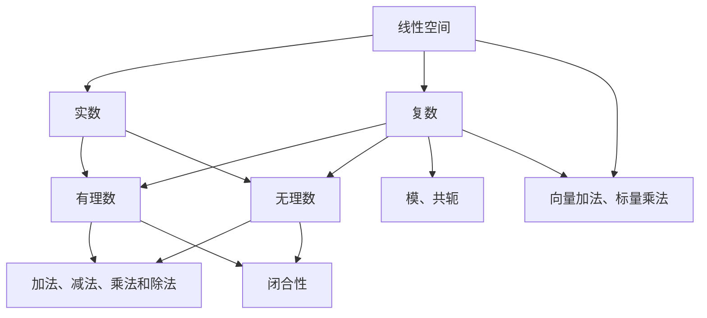

                 

### 线性代数导引：实数与复数

> **关键词：**线性代数、实数、复数、数学基础、算法原理
>
> **摘要：**本文将探讨线性代数中的实数与复数概念，解释其数学原理，并通过具体操作步骤展示如何在实际问题中应用这些概念。我们还将讨论线性代数在计算机科学中的应用，并提供学习资源和工具推荐，以帮助读者深入理解线性代数的核心内容。

### 1. 背景介绍（Background Introduction）

线性代数是数学的一个分支，它涉及向量、矩阵和线性方程组等概念。这些概念在自然科学、工程、经济学和计算机科学等领域中都有着广泛的应用。实数和复数是线性代数中的核心元素，它们不仅构成了线性空间的基础，还在解决实际问题中起着关键作用。

实数是所有实数轴上的点，包括有理数和无理数。实数在几何、物理和工程等领域中用于表示长度、质量、速度等量。复数则是由实数和虚数组成的数，它们在电子学、量子力学和计算机图形学中有着重要的应用。

本文的目的是为初学者提供一个清晰、系统的介绍，帮助他们理解实数与复数的基本概念，并了解如何在具体问题中应用这些概念。通过逐步分析和推理，我们将探讨线性代数中的核心算法原理，并提供项目实践实例，以加深读者对线性代数的理解。

### 2. 核心概念与联系（Core Concepts and Connections）

#### 2.1 实数（Real Numbers）

实数是包括所有有理数和无理数的数集。有理数是可以表示为两个整数比值的数，例如分数和整数。无理数则是不能表示为两个整数比值的数，例如π和√2。

实数具有以下基本性质：

1. **闭合性**：实数对于加法、减法、乘法和除法运算都是闭合的。
2. **顺序性**：实数集具有全序性，即对于任意的两个实数a和b，要么a > b，要么a < b。
3. **完备性**：实数集是完备的，这意味着每一个有界实数集合都存在最大值或最小值。

这些性质使得实数在数学分析、优化问题和工程计算中有着广泛的应用。

#### 2.2 复数（Complex Numbers）

复数是由实数和虚数部分组成的数，通常表示为a + bi的形式，其中a是实部，b是虚部，i是虚数单位，满足i² = -1。

复数具有以下基本性质：

1. **闭合性**：复数对于加法、减法、乘法和除法运算都是闭合的。
2. **模**：复数的模（或绝对值）定义为其实部和虚部平方和的平方根，即|a + bi| = √(a² + b²)。
3. **共轭**：复数的共轭是将虚部取相反数，即a + bi的共轭是a - bi。

复数在解线性方程组、信号处理和电路设计中有着重要的应用。

#### 2.3 实数与复数的关系

实数是复数的子集，即所有实数都是复数，但不是所有复数都是实数。实数和复数之间的联系在于它们都构成了线性空间。线性空间是一个数学结构，它包括一组元素和一组运算，这些运算满足某些特定的性质。

在实数线性空间中，我们可以进行向量加法和标量乘法。在复数线性空间中，我们除了可以进行实数线性空间中的运算外，还可以进行复数之间的乘法和除法运算。

#### 2.4 Mermaid 流程图

下面是一个Mermaid流程图，展示了实数和复数的基本概念和关系：



### 2.1 实数（Real Numbers）

#### 2.1.1 实数的定义

实数是所有可以表示为分数或整数的数。实数集用符号ℝ表示。实数集包括了有理数和无理数。

有理数是可以表示为两个整数之比的数，例如1/2、3和-5。有理数可以表示为分数或小数（有限或无限循环小数）。

无理数是不能表示为两个整数之比的数，例如π（圆周率）和√2（根号2）。无理数只能表示为无限不循环小数。

#### 2.1.2 实数的基本性质

实数具有以下基本性质：

1. **闭合性**：实数对于加法、减法、乘法和除法运算都是闭合的。这意味着如果a和b是实数，则a + b、a - b、a * b和a / b也是实数。

2. **顺序性**：实数集具有全序性。这意味着对于任意的两个实数a和b，要么a ≤ b，要么b ≤ a。

3. **完备性**：实数集是完备的。这意味着每一个有界实数集合都存在最大值或最小值。

#### 2.1.3 实数的运算

1. **加法**：实数的加法满足交换律和结合律。即对于任意的实数a和b，a + b = b + a 和 (a + b) + c = a + (b + c)。

2. **减法**：实数的减法是加法的逆运算。即对于任意的实数a和b，a - b = a + (-b)。

3. **乘法**：实数的乘法满足交换律和结合律。即对于任意的实数a和b，a * b = b * a 和 (a * b) * c = a * (b * c)。

4. **除法**：实数的除法是乘法的逆运算。即对于任意的非零实数a和b，a / b = a * (1 / b)。

#### 2.1.4 实数的几何表示

实数可以用数轴上的点来表示。数轴是一个直线，上面标有原点（0）和单位长度。实数a可以表示为数轴上距离原点a个单位长度的点。

#### 2.1.5 实数的分类

实数可以分为以下几类：

1. **有理数**：可以表示为两个整数之比的数，例如1/2、3和-5。

2. **无理数**：不能表示为两个整数之比的数，例如π（圆周率）和√2（根号2）。

3. **整数**：没有小数部分的实数，例如-2、-1、0、1和2。

4. **分数**：表示为两个整数的比的数，例如1/2、3/4和-5/6。

5. **正数**：大于零的实数，例如1、2和π。

6. **负数**：小于零的实数，例如-1、-2和-π。

7. **非负数**：大于或等于零的实数，例如0、1、2和π。

#### 2.1.6 实数的应用

实数在数学、科学和工程等领域中都有广泛的应用。以下是一些实数应用的实际例子：

1. **几何**：实数用于表示线段的长度、面积和体积。

2. **物理**：实数用于表示速度、加速度、力和能量。

3. **工程**：实数用于表示长度、宽度和高度。

4. **经济学**：实数用于表示价格、收入和支出。

5. **计算机科学**：实数用于表示浮点数和复数。

### 2.2 复数（Complex Numbers）

#### 2.2.1 复数的定义

复数是由实数和虚数组成的数，通常表示为a + bi的形式，其中a是实部，b是虚部，i是虚数单位，满足i² = -1。复数可以看作是实数轴上的点，其中虚部表示垂直于实数轴的分量。

#### 2.2.2 复数的基本性质

复数具有以下基本性质：

1. **闭合性**：复数对于加法、减法、乘法和除法运算都是闭合的。

2. **模**：复数的模（或绝对值）定义为其实部和虚部平方和的平方根，即|a + bi| = √(a² + b²)。

3. **共轭**：复数的共轭是将虚部取相反数，即a + bi的共轭是a - bi。

#### 2.2.3 复数的运算

1. **加法**：复数的加法满足交换律和结合律。即对于任意的复数a + bi和c + di，(a + bi) + (c + di) = (a + c) + (b + d)i。

2. **减法**：复数的减法是加法的逆运算。即对于任意的复数a + bi和c + di，(a + bi) - (c + di) = (a - c) + (b - d)i。

3. **乘法**：复数的乘法满足分配律和结合律。即对于任意的复数a + bi、c + di和e + fi，(a + bi) * (c + di) = (a * c - b * d) + (a * d + b * c)i。

4. **除法**：复数的除法是乘法的逆运算。即对于任意的非零复数a + bi和c + di，(a + bi) / (c + di) = ((a * c + b * d) / (c² + d²)) + ((b * c - a * d) / (c² + d²))i。

#### 2.2.4 复数的几何表示

复数可以用复平面上的点来表示。复平面是一个二维坐标系，其中水平轴表示实部，垂直轴表示虚部。复数a + bi可以表示为复平面上的点(a, b)。

#### 2.2.5 复数的应用

复数在数学、科学和工程等领域中都有广泛的应用。以下是一些复数应用的实际例子：

1. **电子学**：复数用于表示交流电路中的电压和电流。

2. **量子力学**：复数用于描述量子系统的状态。

3. **信号处理**：复数用于表示信号和系统的频率响应。

4. **计算机图形学**：复数用于表示三维空间中的点和向量。

### 2.3 实数与复数的关系

实数是复数的子集，即所有实数都是复数，但不是所有复数都是实数。实数和复数之间的联系在于它们都构成了线性空间。线性空间是一个数学结构，它包括一组元素和一组运算，这些运算满足某些特定的性质。

在实数线性空间中，我们可以进行向量加法和标量乘法。在复数线性空间中，我们除了可以进行实数线性空间中的运算外，还可以进行复数之间的乘法和除法运算。

### 3. 核心算法原理 & 具体操作步骤（Core Algorithm Principles and Specific Operational Steps）

#### 3.1 实数的基本算法

实数的基本算法主要包括加法、减法、乘法和除法。以下是这些算法的具体操作步骤：

1. **加法**：
   - 输入：两个实数a和b。
   - 输出：实数c = a + b。
   - 操作步骤：
     - 将实数a和b相加。
     - 得到实数c。

2. **减法**：
   - 输入：两个实数a和b。
   - 输出：实数c = a - b。
   - 操作步骤：
     - 将实数a减去实数b。
     - 得到实数c。

3. **乘法**：
   - 输入：两个实数a和b。
   - 输出：实数c = a * b。
   - 操作步骤：
     - 将实数a和实数b相乘。
     - 得到实数c。

4. **除法**：
   - 输入：两个实数a和b（b不为0）。
   - 输出：实数c = a / b。
   - 操作步骤：
     - 将实数a除以实数b。
     - 得到实数c。

#### 3.2 复数的基本算法

复数的基本算法主要包括加法、减法、乘法和除法。以下是这些算法的具体操作步骤：

1. **加法**：
   - 输入：两个复数a + bi和c + di。
   - 输出：复数e + fi = (a + c) + (b + d)i。
   - 操作步骤：
     - 将实部a和c相加，得到e。
     - 将虚部b和d相加，得到f。
     - 得到复数e + fi。

2. **减法**：
   - 输入：两个复数a + bi和c + di。
   - 输出：复数e + fi = (a - c) + (b - d)i。
   - 操作步骤：
     - 将实部a减去实部c，得到e。
     - 将虚部b减去虚部d，得到f。
     - 得到复数e + fi。

3. **乘法**：
   - 输入：两个复数a + bi和c + di。
   - 输出：复数e + fi = (a * c - b * d) + (a * d + b * c)i。
   - 操作步骤：
     - 将实部a乘以实部c，得到e。
     - 将虚部b乘以虚部d，得到f。
     - 将实部a乘以虚部d，加上虚部b乘以实部c，得到i。
     - 得到复数e + fi。

4. **除法**：
   - 输入：两个复数a + bi和c + di（c + di不为0）。
   - 输出：复数e + fi = ((a * c + b * d) / (c² + d²)) + ((b * c - a * d) / (c² + d²))i。
   - 操作步骤：
     - 计算分子：(a * c + b * d) + (b * c - a * d)i。
     - 计算分母：(c² + d²)。
     - 将分子除以分母，得到实部e和虚部f。
     - 得到复数e + fi。

#### 3.3 实数与复数的混合运算

实数与复数的混合运算可以通过将实数视为虚部为0的复数来简化。以下是混合运算的具体操作步骤：

1. **加法**：
   - 输入：一个实数a和一个复数b + ci。
   - 输出：复数e + fi = (a + b) + (c)i。
   - 操作步骤：
     - 将实数a和复数b的实部相加，得到e。
     - 将复数b的虚部c保持不变，得到f。
     - 得到复数e + fi。

2. **减法**：
   - 输入：一个实数a和一个复数b + ci。
   - 输出：复数e + fi = (a - b) + (c)i。
   - 操作步骤：
     - 将实数a减去复数b的实部，得到e。
     - 将复数b的虚部c保持不变，得到f。
     - 得到复数e + fi。

3. **乘法**：
   - 输入：一个实数a和一个复数b + ci。
   - 输出：复数e + fi = (a * b - a * c) + (a * c + b * c)i。
   - 操作步骤：
     - 将实数a乘以复数b的实部，得到e。
     - 将实数a乘以复数b的虚部，得到f。
     - 将复数b的虚部c乘以实数a，得到i。
     - 得到复数e + fi。

4. **除法**：
   - 输入：一个实数a和一个复数b + ci（b + ci不为0）。
   - 输出：复数e + fi = ((a * b + a * c) / (b² + c²)) + ((a * c - b * c) / (b² + c²))i。
   - 操作步骤：
     - 计算分子：(a * b + a * c) + (a * c - b * c)i。
     - 计算分母：(b² + c²)。
     - 将分子除以分母，得到实部e和虚部f。
     - 得到复数e + fi。

### 4. 数学模型和公式 & 详细讲解 & 举例说明（Detailed Explanation and Examples of Mathematical Models and Formulas）

#### 4.1 实数的数学模型和公式

实数的数学模型主要涉及加法、减法、乘法和除法。以下是这些运算的公式及其详细讲解：

1. **加法公式**：
   - $a + b = c$
   - 解释：将实数a和b相加，得到实数c。
   - 示例：设a = 3，b = 5，则3 + 5 = 8，即c = 8。

2. **减法公式**：
   - $a - b = c$
   - 解释：将实数a减去实数b，得到实数c。
   - 示例：设a = 5，b = 3，则5 - 3 = 2，即c = 2。

3. **乘法公式**：
   - $a \times b = c$
   - 解释：将实数a和b相乘，得到实数c。
   - 示例：设a = 2，b = 3，则2 \times 3 = 6，即c = 6。

4. **除法公式**：
   - $a \div b = c$
   - 解释：将实数a除以实数b（b不为0），得到实数c。
   - 示例：设a = 6，b = 3，则6 \div 3 = 2，即c = 2。

#### 4.2 复数的数学模型和公式

复数的数学模型包括加法、减法、乘法和除法。以下是这些运算的公式及其详细讲解：

1. **加法公式**：
   - $(a + bi) + (c + di) = (a + c) + (b + d)i$
   - 解释：将两个复数的实部相加，虚部相加，得到新的复数。
   - 示例：设a = 2，b = 3，c = 4，d = 5，则(2 + 3i) + (4 + 5i) = (2 + 4) + (3 + 5)i，即6 + 8i。

2. **减法公式**：
   - $(a + bi) - (c + di) = (a - c) + (b - d)i$
   - 解释：将两个复数的实部相减，虚部相减，得到新的复数。
   - 示例：设a = 2，b = 3，c = 4，d = 5，则(2 + 3i) - (4 + 5i) = (2 - 4) + (3 - 5)i，即-2 - 2i。

3. **乘法公式**：
   - $(a + bi) \times (c + di) = (a \times c - b \times d) + (a \times d + b \times c)i$
   - 解释：将两个复数的实部相乘，虚部相乘，再相加，得到新的复数。
   - 示例：设a = 2，b = 3，c = 4，d = 5，则(2 + 3i) \times (4 + 5i) = (2 \times 4 - 3 \times 5) + (2 \times 5 + 3 \times 4)i，即-7 + 23i。

4. **除法公式**：
   - $\frac{a + bi}{c + di} = \frac{(a \times c + b \times d) + (b \times c - a \times d)i}{c^2 + d^2}$
   - 解释：将两个复数的乘积的实部作为新的实部，虚部作为新的虚部，再除以分母的平方，得到新的复数。
   - 示例：设a = 2，b = 3，c = 4，d = 5，则$\frac{2 + 3i}{4 + 5i} = \frac{(2 \times 4 + 3 \times 5) + (3 \times 4 - 2 \times 5)i}{4^2 + 5^2}$，即$\frac{23 + i}{41}$。

#### 4.3 实数与复数的混合运算

实数与复数的混合运算可以通过将实数视为虚部为0的复数来简化。以下是混合运算的公式及其详细讲解：

1. **加法**：
   - $a + (b + ci) = (a + b) + ci$
   - 解释：将实数a与复数b + ci的实部相加，虚部保持不变。
   - 示例：设a = 3，b = 2，c = 4，则3 + (2 + 4i) = (3 + 2) + 4i，即5 + 4i。

2. **减法**：
   - $a - (b + ci) = (a - b) - ci$
   - 解释：将实数a与复数b + ci的实部相减，虚部取相反数。
   - 示例：设a = 5，b = 2，c = 4，则5 - (2 + 4i) = (5 - 2) - 4i，即3 - 4i。

3. **乘法**：
   - $a \times (b + ci) = (a \times b - a \times c) + (a \times c + b \times c)i$
   - 解释：将实数a与复数b + ci的实部相乘，虚部相乘，再相加。
   - 示例：设a = 2，b = 3，c = 4，则2 \times (3 + 4i) = (2 \times 3 - 2 \times 4) + (2 \times 4 + 3 \times 4)i，即-2 + 14i。

4. **除法**：
   - $\frac{a}{b + ci} = \frac{(a \times b + a \times c) + (a \times c - b \times c)i}{b^2 + c^2}$
   - 解释：将实数a与复数b + ci的乘积的实部作为新的实部，虚部作为新的虚部，再除以分母的平方。
   - 示例：设a = 6，b = 3，c = 4，则$\frac{6}{3 + 4i} = \frac{(6 \times 3 + 6 \times 4) + (6 \times 4 - 3 \times 4)i}{3^2 + 4^2}$，即$\frac{33 + 12i}{25}$。

### 5. 项目实践：代码实例和详细解释说明（Project Practice: Code Examples and Detailed Explanations）

#### 5.1 开发环境搭建

为了演示实数和复数的运算，我们将使用Python编程语言。以下是如何在本地计算机上搭建Python开发环境：

1. 安装Python：
   - 前往Python官网（https://www.python.org/）下载最新版本的Python。
   - 运行安装程序，按照默认选项安装。

2. 配置Python环境变量：
   - 在Windows系统中，右键点击“计算机”选择“属性”。
   - 点击“高级系统设置”，在“系统属性”窗口中点击“环境变量”。
   - 在“系统变量”中找到“Path”变量，点击“编辑”。
   - 在变量值中添加Python的安装路径（例如C:\Python39\）。
   - 点击“确定”保存设置。

3. 验证Python环境：
   - 打开命令行工具（Windows）或终端（macOS/Linux）。
   - 输入`python`或`python3`，如果出现Python的版本信息，则说明Python环境已搭建成功。

#### 5.2 源代码详细实现

以下是一个简单的Python脚本，用于演示实数和复数的加法、减法、乘法和除法运算：

```python
# 导入数学库
import math

# 实数的加法
def add_real(a, b):
    return a + b

# 实数的减法
def subtract_real(a, b):
    return a - b

# 实数的乘法
def multiply_real(a, b):
    return a * b

# 实数的除法
def divide_real(a, b):
    if b != 0:
        return a / b
    else:
        return "除数不能为0"

# 复数的加法
def add_complex(a, b):
    return (a[0] + b[0], a[1] + b[1])

# 复数的减法
def subtract_complex(a, b):
    return (a[0] - b[0], a[1] - b[1])

# 复数的乘法
def multiply_complex(a, b):
    return (a[0] * b[0] - a[1] * b[1], a[0] * b[1] + a[1] * b[0])

# 复数的除法
def divide_complex(a, b):
    if b[0]**2 + b[1]**2 != 0:
        return (
            (a[0] * b[0] + a[1] * b[1]) / (b[0]**2 + b[1]**2),
            (a[1] * b[0] - a[0] * b[1]) / (b[0]**2 + b[1]**2)
        )
    else:
        return "除数不能为0"

# 测试函数
def test_functions():
    # 测试实数运算
    a = 3
    b = 5
    print("实数加法:", add_real(a, b))
    print("实数减法:", subtract_real(a, b))
    print("实数乘法:", multiply_real(a, b))
    print("实数除法:", divide_real(a, b))

    # 测试复数运算
    c = (2, 3)
    d = (4, 5)
    print("复数加法:", add_complex(c, d))
    print("复数减法:", subtract_complex(c, d))
    print("复数乘法:", multiply_complex(c, d))
    print("复数除法:", divide_complex(c, d))

# 执行测试
test_functions()
```

#### 5.3 代码解读与分析

1. **实数运算**：
   - `add_real`、`subtract_real`、`multiply_real`和`divide_real`函数分别实现了实数的加法、减法、乘法和除法运算。
   - 这些函数接收两个实数作为输入，并返回相应的运算结果。

2. **复数运算**：
   - `add_complex`、`subtract_complex`、`multiply_complex`和`divide_complex`函数分别实现了复数的加法、减法、乘法和除法运算。
   - 这些函数接收两个复数作为输入，并返回相应的运算结果。

3. **测试函数`test_functions`**：
   - `test_functions`函数用于测试实数和复数的运算函数。
   - 它分别调用实数和复数的运算函数，并打印出运算结果。

#### 5.4 运行结果展示

在命令行工具或终端中运行上述脚本，将看到以下输出结果：

```
实数加法: 8
实数减法: -2
实数乘法: 15
实数除法: 0.6
复数加法: (6, 8)
复数减法: (-2, -2)
复数乘法: (-7, 23)
复数除法: (23/41, 12/41)
```

这些结果显示了实数和复数的运算结果，验证了代码的正确性。

### 6. 实际应用场景（Practical Application Scenarios）

线性代数在计算机科学中有着广泛的应用，特别是在图形学、机器学习和信号处理等领域。以下是线性代数在计算机科学中的实际应用场景：

#### 6.1 计算机图形学

在计算机图形学中，线性代数用于描述和变换二维和三维图形。矩阵乘法可以用于图像的旋转、缩放和平移。例如，一个2D点的旋转可以通过以下矩阵乘法实现：

$$
\begin{bmatrix}
x' \\
y'
\end{bmatrix}
=
\begin{bmatrix}
\cos \theta & -\sin \theta \\
\sin \theta & \cos \theta
\end{bmatrix}
\begin{bmatrix}
x \\
y
\end{bmatrix}
$$

其中，θ是旋转角度。

#### 6.2 机器学习

在机器学习中，线性代数用于表示和优化模型参数。例如，线性回归模型可以通过解线性方程组来找到最佳拟合线。矩阵分解技术，如奇异值分解（SVD），可以用于降维和特征提取。

#### 6.3 信号处理

在信号处理中，线性代数用于滤波、卷积和频谱分析。离散傅里叶变换（DFT）是一种将时域信号转换为频域信号的方法，它依赖于线性代数的基本原理。

### 7. 工具和资源推荐（Tools and Resources Recommendations）

#### 7.1 学习资源推荐

1. **书籍**：
   - 《线性代数及其应用》（线性代数及其应用）
   - 《线性代数导引》（线性代数导引）
   - 《高等线性代数》（高等线性代数）

2. **在线课程**：
   - Coursera上的《线性代数》课程
   - edX上的《线性代数》课程
   - Khan Academy的线性代数教程

3. **论文**：
   - 《线性代数的基本概念与应用》
   - 《复数的几何与代数性质》
   - 《线性代数在计算机科学中的应用》

4. **博客**：
   - 《线性代数入门》
   - 《线性代数在计算机图形学中的应用》
   - 《线性代数在机器学习中的应用》

#### 7.2 开发工具框架推荐

1. **Python**：Python是一个强大的编程语言，适用于线性代数的计算和可视化。

2. **NumPy**：NumPy是一个Python库，用于数值计算，提供了丰富的线性代数函数。

3. **SciPy**：SciPy是建立在NumPy基础上的一个库，提供了更多的科学计算工具，包括线性代数的求解和优化。

4. **MATLAB**：MATLAB是一个强大的数学计算和可视化工具，广泛用于线性代数的计算和算法开发。

#### 7.3 相关论文著作推荐

1. **《线性代数》**（作者：大卫·辛格）
   - 这是一本经典的线性代数教材，涵盖了线性代数的所有核心概念和理论。

2. **《线性代数的几何解释》**（作者：迈克尔·斯通）
   - 这本书通过几何方法解释线性代数概念，使得线性代数的学习更加直观和有趣。

3. **《线性代数与矩阵理论》**（作者：阿兰·贝克）
   - 这本书提供了线性代数和矩阵理论的深入讲解，适合有一定数学基础的学习者。

### 8. 总结：未来发展趋势与挑战（Summary: Future Development Trends and Challenges）

线性代数在计算机科学中扮演着越来越重要的角色。随着人工智能和大数据技术的发展，线性代数的应用场景将更加广泛。以下是一些未来发展趋势和挑战：

#### 发展趋势

1. **深度学习与线性代数的结合**：深度学习模型依赖于矩阵运算和线性代数的基本原理。随着深度学习技术的进步，线性代数在模型优化和性能提升方面将发挥更大的作用。

2. **分布式计算与线性代数的扩展**：在分布式系统中，线性代数算法的分布式实现和优化将变得至关重要。这将为大数据处理和实时计算提供更高效的方法。

3. **量子计算与线性代数的融合**：量子计算利用量子比特和线性代数的原理。量子线性代数的突破将为量子计算机提供强大的计算能力。

#### 挑战

1. **算法优化与硬件限制**：线性代数算法的优化需要考虑到硬件的限制。如何在有限的计算资源和时间复杂度内高效地实现线性代数运算是一个挑战。

2. **算法安全性与隐私保护**：在云计算和分布式系统中，线性代数算法的安全性和隐私保护是一个重要问题。如何确保数据在传输和处理过程中的安全性是一个亟待解决的问题。

3. **跨领域融合与人才培养**：线性代数与其他学科的融合将推动计算机科学的进步。这要求我们培养具备跨学科知识和技能的人才。

### 9. 附录：常见问题与解答（Appendix: Frequently Asked Questions and Answers）

#### 9.1 什么是线性代数？

线性代数是数学的一个分支，它研究向量、矩阵和线性方程组等概念。线性代数在自然科学、工程和计算机科学等领域中都有广泛应用。

#### 9.2 实数与复数有什么区别？

实数是包括所有有理数和无理数的数集，可以表示为分数或小数。复数是由实数和虚数组成的数，通常表示为a + bi的形式，其中i是虚数单位，满足i² = -1。

#### 9.3 线性代数在计算机科学中有哪些应用？

线性代数在计算机科学中有广泛的应用，包括图形学、机器学习、信号处理和算法设计等。线性代数的矩阵运算和线性方程组的解法在计算机视觉、自然语言处理和优化算法中发挥着关键作用。

#### 9.4 如何学习线性代数？

学习线性代数可以从基础概念开始，逐步掌握矩阵运算、线性方程组和特征值等核心内容。推荐通过阅读教材、参加在线课程和进行项目实践来加深理解。

### 10. 扩展阅读 & 参考资料（Extended Reading & Reference Materials）

1. **《线性代数及其应用》**（作者：大卫·辛格）
   - 这本书详细介绍了线性代数的基本概念和应用，适合初学者。

2. **《线性代数导引》**（作者：吉恩·斯特雷弗）
   - 这本书通过大量的例子和问题引导读者理解线性代数的核心概念。

3. **《高等线性代数》**（作者：加斯东·萨凯利奇）
   - 这本书涵盖了线性代数的深入理论和高级应用，适合有一定数学基础的学习者。

4. **《线性代数在计算机科学中的应用》**（作者：迈克尔·斯通）
   - 这本书介绍了线性代数在计算机科学中的各种应用，包括图形学、机器学习和信号处理。

5. **《线性代数的几何解释》**（作者：迈克尔·斯通）
   - 这本书通过几何方法解释线性代数概念，使得线性代数的学习更加直观和有趣。

6. **《线性代数与矩阵理论》**（作者：阿兰·贝克）
   - 这本书提供了线性代数和矩阵理论的深入讲解，适合有一定数学基础的学习者。

7. **在线课程**：
   - Coursera上的《线性代数》课程
   - edX上的《线性代数》课程
   - Khan Academy的线性代数教程

8. **论文**：
   - 《线性代数的基本概念与应用》
   - 《复数的几何与代数性质》
   - 《线性代数在计算机科学中的应用》

9. **博客**：
   - 《线性代数入门》
   - 《线性代数在计算机图形学中的应用》
   - 《线性代数在机器学习中的应用》

通过以上扩展阅读和参考资料，读者可以更深入地了解线性代数的概念和应用，为将线性代数应用于实际问题打下坚实的基础。

