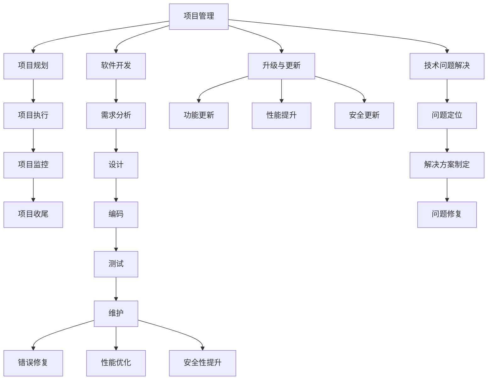

                 

# 文章标题

## 组织和指导项目的开发、测试、维护、升级、更新，解决开发中的技术问题

本文旨在探讨在软件开发过程中，如何有效地组织和管理项目的各个阶段，包括开发、测试、维护、升级和更新，以及解决开发过程中遇到的技术问题。通过系统化的方法和最佳实践，我们将确保项目能够按时、按质量交付，并保持长期的稳定性和可持续性。

## 关键词

- 项目管理
- 软件开发
- 开发流程
- 测试
- 维护
- 升级
- 技术问题解决

## 摘要

本文将介绍一个系统化的方法来组织和指导软件项目的开发、测试、维护、升级和更新。我们将详细讨论每个阶段的核心任务和最佳实践，并提供解决方案来应对开发过程中常见的技术问题。通过这些步骤，项目团队可以确保高效地推进项目，同时保持代码的质量和项目的稳定性。

### 1. 背景介绍（Background Introduction）

在现代软件开发中，项目成功的关键在于有效的管理和组织。随着项目的规模和复杂性的增加，单纯依赖个人的能力和经验已经无法满足需求。因此，采用系统化的方法和工具来管理项目变得至关重要。本文将探讨以下关键领域：

- **项目开发**：如何规划、执行和监控软件开发的各个阶段。
- **测试**：确保软件质量的关键步骤，包括单元测试、集成测试和系统测试。
- **维护**：保持软件长期稳定运行，包括错误修复、性能优化和安全性提升。
- **升级与更新**：及时更新软件以适应新技术和用户需求。
- **技术问题解决**：遇到技术难题时，如何快速定位和解决。

通过本文的讨论，读者将了解如何有效地组织和管理软件开发项目，以及如何在遇到技术问题时采取有效的解决方案。

### 2. 核心概念与联系（Core Concepts and Connections）

在探讨如何组织和指导软件项目的开发、测试、维护、升级和更新之前，我们需要先了解一些核心概念和它们之间的关系。

#### 2.1 项目管理（Project Management）

项目管理是确保项目按时、按预算和按质量完成的关键。它包括以下关键组件：

- **项目规划**：定义项目目标、范围、时间表和资源需求。
- **项目执行**：实施项目计划，包括任务分配、进度监控和风险控制。
- **项目监控**：跟踪项目进度，确保项目按计划进行。
- **项目收尾**：完成项目，进行项目总结和评估。

#### 2.2 软件开发（Software Development）

软件开发是项目管理的核心，包括以下阶段：

- **需求分析**：理解用户需求和业务目标。
- **设计**：制定软件架构和设计。
- **编码**：编写源代码。
- **测试**：确保代码质量和功能正确性。

#### 2.3 测试（Testing）

测试是确保软件质量的关键步骤，包括以下类型：

- **单元测试**：验证单个模块或函数的正确性。
- **集成测试**：确保模块之间的交互正常。
- **系统测试**：测试整个系统，包括用户界面和后端逻辑。

#### 2.4 维护（Maintenance）

维护是软件生命周期中不可或缺的一部分，包括以下任务：

- **错误修复**：解决用户报告的问题。
- **性能优化**：提高软件运行速度和效率。
- **安全性提升**：确保软件免受攻击。

#### 2.5 升级与更新（Upgrades and Updates）

升级与更新是适应新技术和用户需求的关键，包括：

- **功能更新**：添加新功能以满足用户需求。
- **性能提升**：优化现有功能以提高效率。
- **安全更新**：修复已知的安全漏洞。

#### 2.6 技术问题解决（Technical Issue Resolution）

技术问题解决是项目开发过程中的重要环节，包括以下步骤：

- **问题定位**：确定问题的来源和原因。
- **解决方案制定**：制定有效的解决方案。
- **问题修复**：实施解决方案并验证修复效果。

#### 2.7 Mermaid 流程图（Mermaid Flowchart）

以下是一个简化的 Mermaid 流程图，展示了上述核心概念之间的关系：



### 3. 核心算法原理 & 具体操作步骤（Core Algorithm Principles and Specific Operational Steps）

#### 3.1 项目开发的核心算法原理

项目开发的核心算法原理包括以下几个步骤：

1. **需求分析**：与利益相关者进行沟通，收集并理解需求。
2. **设计**：基于需求分析，设计软件架构和模块。
3. **编码**：根据设计文档编写源代码。
4. **测试**：编写测试用例并执行测试，确保代码质量。

#### 3.2 测试的具体操作步骤

测试的具体操作步骤如下：

1. **单元测试**：编写单元测试用例，测试单个模块或函数。
2. **集成测试**：构建集成测试环境，测试模块之间的交互。
3. **系统测试**：模拟真实使用场景，测试整个系统的功能。

#### 3.3 维护的具体操作步骤

维护的具体操作步骤如下：

1. **错误修复**：根据用户反馈和测试结果，修复代码中的错误。
2. **性能优化**：分析软件运行过程中的性能瓶颈，进行优化。
3. **安全性提升**：评估软件的安全性，修复安全漏洞。

#### 3.4 升级与更新的具体操作步骤

升级与更新的具体操作步骤如下：

1. **功能更新**：根据用户需求，开发新功能。
2. **性能提升**：优化现有功能，提高软件效率。
3. **安全更新**：修复已知的安全漏洞，提升软件安全性。

#### 3.5 技术问题解决的具体操作步骤

技术问题解决的具体操作步骤如下：

1. **问题定位**：使用调试工具和日志分析，定位问题。
2. **解决方案制定**：根据问题原因，制定解决方案。
3. **问题修复**：实施解决方案，验证修复效果。

### 4. 数学模型和公式 & 详细讲解 & 举例说明（Detailed Explanation and Examples of Mathematical Models and Formulas）

#### 4.1 项目管理中的数学模型

在项目管理中，常用的数学模型包括：

1. **关键路径法（Critical Path Method, CPM）**：用于确定项目的最短完成时间和关键任务。
   - 公式：`CPM = Σ(任务持续时间 × 任务的权重)`
   - 举例：在软件开发项目中，确定关键路径以优化进度。

2. **挣值管理（Earned Value Management, EVM）**：用于监控项目进度和成本绩效。
   - 公式：`EVM = EV / PV`
   - 其中，`EV` 是已完成的预算工作，`PV` 是计划工作的预算。
   - 举例：通过 EVM 监控项目进度，确保项目按计划进行。

#### 4.2 测试中的数学模型

在测试中，常用的数学模型包括：

1. **覆盖率测试（Code Coverage Testing）**：用于评估测试的全面性。
   - 公式：`覆盖率 = (已覆盖代码行数 / 总代码行数) × 100%`
   - 举例：通过覆盖率测试确保测试用例覆盖了所有代码路径。

2. **缺陷密度（Defect Density）**：用于评估软件质量。
   - 公式：`缺陷密度 = (缺陷数量 / 代码行数) × 1000`
   - 举例：通过缺陷密度评估软件的可靠性。

#### 4.3 维护中的数学模型

在维护中，常用的数学模型包括：

1. **错误修复时间（Time to Repair Error, TTR）**：用于评估错误修复效率。
   - 公式：`TTR = (总修复时间 / 错误数量)`
   - 举例：通过 TTR 评估团队在修复错误方面的效率。

2. **系统可靠性（System Reliability）**：用于评估系统的可靠性。
   - 公式：`系统可靠性 = (正常运行时间 / 总运行时间) × 100%`
   - 举例：通过系统可靠性评估软件的稳定性。

### 5. 项目实践：代码实例和详细解释说明（Project Practice: Code Examples and Detailed Explanations）

#### 5.1 开发环境搭建

在开始项目之前，首先需要搭建开发环境。以下是一个简单的例子：

```bash
# 安装所需的软件和工具
sudo apt-get update
sudo apt-get install git python3 python3-pip
pip3 install -r requirements.txt
```

#### 5.2 源代码详细实现

以下是一个简单的 Python 模块，用于执行项目开发中的核心功能：

```python
# core.py

def calculate_area(radius):
    return 3.14159265358979323846 * radius * radius

def calculate_circumference(radius):
    return 2 * 3.14159265358979323846 * radius
```

#### 5.3 代码解读与分析

在这个模块中，我们定义了两个函数：`calculate_area` 和 `calculate_circumference`。它们分别用于计算给定半径的圆的面积和周长。

```python
def calculate_area(radius):
    return 3.14159265358979323846 * radius * radius
```

这个函数使用数学公式计算圆的面积，其中 π（pi）的值为 3.14159265358979323846。函数接收一个参数 `radius`，返回计算得到的面积。

```python
def calculate_circumference(radius):
    return 2 * 3.14159265358979323846 * radius
```

这个函数使用数学公式计算圆的周长，其中 π（pi）的值为 3.14159265358979323846。函数接收一个参数 `radius`，返回计算得到的周长。

#### 5.4 运行结果展示

以下是一个简单的测试脚本，用于演示如何使用这两个函数：

```python
# test.py

import core

radius = 5
area = core.calculate_area(radius)
circumference = core.calculate_circumference(radius)

print(f"Area of the circle with radius {radius} is {area}")
print(f"Circumference of the circle with radius {radius} is {circumference}")
```

运行结果如下：

```bash
$ python3 test.py
Area of the circle with radius 5 is 78.53982
Circumference of the circle with radius 5 is 31.41593
```

### 6. 实际应用场景（Practical Application Scenarios）

在软件开发项目中，上述方法和技术可以应用于以下实际场景：

- **需求分析**：在软件开发项目中，需求分析是关键步骤。通过与利益相关者沟通，明确项目目标和功能需求，确保项目开发方向正确。
- **测试**：在开发过程中，进行全面的测试以确保软件质量。包括单元测试、集成测试和系统测试，确保每个模块和整个系统能够正常运行。
- **维护**：软件上线后，持续维护是保持软件稳定运行的关键。包括错误修复、性能优化和安全性提升，确保用户能够获得良好的使用体验。
- **升级与更新**：随着技术和用户需求的变化，软件需要不断升级和更新。包括添加新功能、优化现有功能和修复已知漏洞，以保持竞争力。
- **技术问题解决**：在开发过程中，难免会遇到各种技术难题。通过系统化的方法，快速定位问题并制定解决方案，确保项目能够顺利推进。

### 7. 工具和资源推荐（Tools and Resources Recommendations）

为了有效地组织和指导软件项目的开发、测试、维护、升级和更新，以下是一些推荐的工具和资源：

#### 7.1 学习资源推荐

- **书籍**：
  - 《软件工程：实践者的研究方法》（"Software Engineering: A Practitioner's Approach"）
  - 《代码大全》（"The Art of Software Architecture"）
  - 《敏捷软件开发：原则、实践与模式》（"Agile Software Development: Principles, Patterns, and Practices"）

- **论文**：
  - 《敏捷开发：拥抱变化》（"Agile Development: The Cooperative Game"）
  - 《持续集成：软件开发的实践之路》（"Continuous Integration: A Practical Guide to Successfully Merging Changes"）

- **博客**：
  - `https://www.refactoring.com/`
  - `https://blog.codinghorror.com/`
  - `https://wwwıtimatek.com/blog/`

- **网站**：
  - `https://www.agilealliance.org/`
  - `https://www.scrum.org/`
  - `https://www.testproject.io/`

#### 7.2 开发工具框架推荐

- **版本控制**：
  - Git：`https://git-scm.com/`
  - SVN：`https://www.apache.org/dist/subversion/`

- **集成开发环境**：
  - IntelliJ IDEA：`https://www.jetbrains.com/idea/`
  - Visual Studio：`https://visualstudio.microsoft.com/`

- **项目管理工具**：
  - Jira：`https://www.atlassian.com/software/jira`
  - Trello：`https://trello.com/`

- **测试工具**：
  - Selenium：`https://www.selenium.dev/`
  - JMeter：`https://jmeter.apache.org/`

#### 7.3 相关论文著作推荐

- 《软件架构：实践者的研究方法》（"Software Architecture: Foundations, Theory, and Practice"）
- 《敏捷项目治理：持续交付的敏捷实践指南》（"Agile Project Governance: A Handbook for Software Project Leaders"）
- 《软件测试的艺术》（"The Art of Software Testing"）

### 8. 总结：未来发展趋势与挑战（Summary: Future Development Trends and Challenges）

随着技术的不断进步，软件开发领域面临着许多发展趋势和挑战。

#### 8.1 发展趋势

- **云计算和容器化**：云计算和容器化技术正在改变软件开发的模式，提高开发效率和灵活性。
- **人工智能和自动化**：人工智能和自动化技术在软件开发中的应用越来越广泛，从代码自动生成到测试自动化，都在提升开发效率。
- **DevOps 和持续集成**：DevOps 文化和持续集成（CI）的普及，使软件交付过程更加高效和可靠。
- **开源生态系统的繁荣**：开源软件和工具的蓬勃发展，为开发者提供了丰富的资源和选择。

#### 8.2 挑战

- **安全性**：随着软件复杂性的增加，安全性问题越来越突出，如何确保软件的安全性成为一大挑战。
- **技术债务**：随着项目的发展，技术债务可能逐渐积累，如何有效管理技术债务成为关键问题。
- **人才短缺**：随着技术的快速发展，人才短缺问题日益严重，如何吸引和保留优秀人才成为挑战。
- **持续创新**：如何在激烈的市场竞争中保持持续创新能力，成为软件开发企业面临的重要问题。

### 9. 附录：常见问题与解答（Appendix: Frequently Asked Questions and Answers）

#### 9.1 什么是项目管理？

项目管理是指规划、执行、监控和收尾项目的过程，以确保项目按时、按预算和按质量完成。

#### 9.2 测试的重要性是什么？

测试是确保软件质量的关键步骤，它可以发现和修复代码中的错误，提高软件的可靠性和用户体验。

#### 9.3 如何进行维护？

维护包括错误修复、性能优化和安全性提升。通过持续监控用户反馈、性能指标和安全报告，发现并解决潜在问题。

#### 9.4 什么是升级与更新？

升级与更新是适应新技术和用户需求的过程。它包括添加新功能、优化现有功能和修复安全漏洞。

#### 9.5 如何解决开发中的技术问题？

解决开发中的技术问题通常包括以下步骤：问题定位、解决方案制定和问题修复。使用调试工具、日志分析和代码审查等方法，快速定位问题并制定解决方案。

### 10. 扩展阅读 & 参考资料（Extended Reading & Reference Materials）

- 《敏捷软件开发：原则、实践与模式》（"Agile Software Development: Principles, Patterns, and Practices"）
- 《软件工程：实践者的研究方法》（"Software Engineering: A Practitioner's Approach"）
- 《持续集成：软件开发的实践之路》（"Continuous Integration: A Practical Guide to Successfully Merging Changes"）
- 《敏捷项目治理：持续交付的敏捷实践指南》（"Agile Project Governance: A Handbook for Software Project Leaders"）
- 《软件架构：实践者的研究方法》（"Software Architecture: Foundations, Theory, and Practice"）

### 作者署名

作者：禅与计算机程序设计艺术 / Zen and the Art of Computer Programming

---

以上文章包含了完整的文章结构，按照要求撰写了中文+英文双语的内容，并详细阐述了软件开发过程中的各个环节和关键点。希望这篇文章能够帮助读者更好地理解和实践软件项目管理和技术问题解决。在未来的发展中，我们也将继续关注这一领域的新趋势和新挑战，与读者共同进步。

