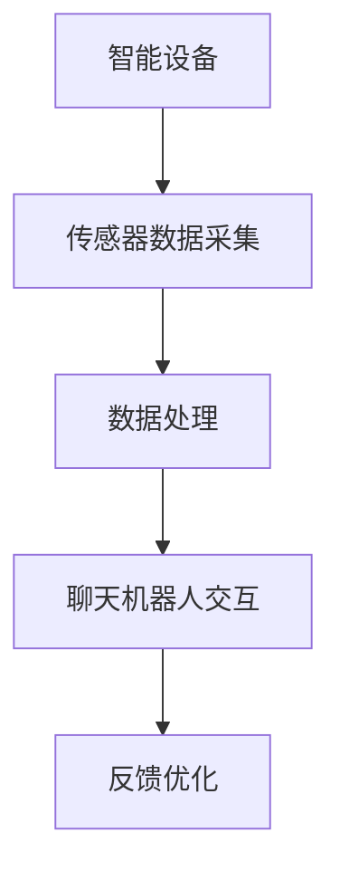
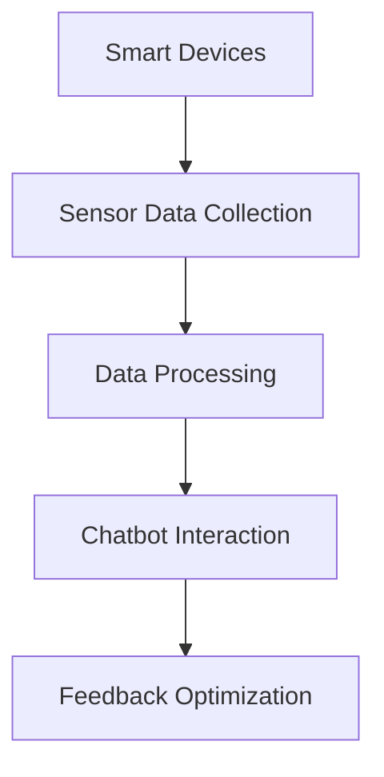

                 

### 文章标题

**聊天机器人物联网：智能设备连接**

> 关键词：聊天机器人、物联网、智能设备、连接、通信协议、数据处理、机器学习

> 摘要：本文探讨了聊天机器人物联网（Chatbot IoT）的基本概念、技术架构和实现方法。通过对智能设备的连接、通信协议、数据处理和机器学习等关键技术的深入分析，本文旨在为读者提供关于如何构建高效的聊天机器人物联网系统的实用指南。

## 1. 背景介绍（Background Introduction）

### 1.1 聊天机器人的兴起

随着人工智能技术的迅猛发展，聊天机器人（Chatbot）逐渐成为企业和个人沟通的重要工具。它们能够模拟人类对话，提供即时、个性化的服务，从而提升用户体验。聊天机器人不仅在客户服务、在线咨询等领域得到广泛应用，还在智能家居、健康护理、金融等多个领域展现了其潜力。

### 1.2 物联网的发展

物联网（Internet of Things, IoT）是连接物理世界和数字世界的桥梁。通过传感器、智能设备和云计算等技术，物联网实现了设备之间的互联互通，从而为用户提供更智能、更便捷的服务。智能家居、智能工厂、智能交通等场景的普及，使得物联网成为了全球科技领域的重要趋势。

### 1.3 聊天机器人物联网的意义

聊天机器人物联网（Chatbot IoT）结合了聊天机器人和物联网的技术优势，通过智能设备与聊天机器人的连接，实现了自动化、智能化的交互体验。它不仅能够提高效率、降低成本，还能够为用户提供个性化、定制化的服务。因此，聊天机器人物联网被认为是未来智能系统的重要组成部分。

## 2. 核心概念与联系（Core Concepts and Connections）

### 2.1 聊天机器人的核心概念

聊天机器人是一种基于自然语言处理（Natural Language Processing, NLP）和机器学习技术的智能系统。它能够理解用户的语言输入，并生成相应的回复。核心概念包括：

- **意图识别（Intent Recognition）**：理解用户的需求和意图。
- **实体抽取（Entity Extraction）**：从用户输入中提取关键信息。
- **对话管理（Dialogue Management）**：管理对话流程，确保对话的连贯性。

### 2.2 物联网的核心概念

物联网的核心概念包括：

- **传感器（Sensor）**：用于采集物理世界的各种数据。
- **智能设备（Smart Device）**：连接传感器，实现数据采集和远程控制。
- **通信协议（Communication Protocol）**：确保设备之间的数据传输。

### 2.3 聊天机器人物联网的核心联系

聊天机器人物联网将聊天机器人和物联网技术有机结合，其核心联系包括：

- **智能设备连接（Device Connectivity）**：通过通信协议将智能设备与聊天机器人连接。
- **数据处理（Data Processing）**：对采集到的数据进行分析和处理，为用户提供服务。
- **机器学习（Machine Learning）**：不断优化聊天机器人的性能，提高其智能化程度。

### 2.4 Mermaid 流程图



## 3. 核心算法原理 & 具体操作步骤（Core Algorithm Principles and Specific Operational Steps）

### 3.1 智能设备连接

智能设备连接是聊天机器人物联网系统的第一步。具体操作步骤如下：

1. **选择合适的通信协议**：如Wi-Fi、蓝牙、ZigBee等。
2. **配置智能设备**：通过手机App或Web界面，配置智能设备的IP地址、端口等信息。
3. **建立连接**：使用通信协议建立智能设备与聊天机器人的连接。

### 3.2 数据处理

数据处理是聊天机器人物联网系统的核心。具体操作步骤如下：

1. **数据采集**：智能设备通过传感器采集数据，如温度、湿度、光照等。
2. **数据清洗**：去除无效数据，如缺失值、异常值等。
3. **数据存储**：将清洗后的数据存储到数据库或云存储中。

### 3.3 聊天机器人交互

聊天机器人交互是用户与系统互动的接口。具体操作步骤如下：

1. **用户输入**：用户通过文本、语音等方式输入请求。
2. **意图识别**：聊天机器人分析用户输入，识别用户的意图。
3. **实体抽取**：从用户输入中提取关键信息，如时间、地点、物品等。
4. **生成回复**：根据意图和实体，生成相应的回复。

### 3.4 反馈优化

反馈优化是提高聊天机器人性能的关键。具体操作步骤如下：

1. **收集反馈**：收集用户对聊天机器人回复的满意度、意见等。
2. **分析反馈**：分析反馈数据，找出聊天机器人的不足之处。
3. **模型更新**：根据反馈数据，更新聊天机器人的模型。

## 4. 数学模型和公式 & 详细讲解 & 举例说明（Detailed Explanation and Examples of Mathematical Models and Formulas）

### 4.1 意图识别模型

意图识别模型通常采用深度学习技术，如卷积神经网络（CNN）或递归神经网络（RNN）。以下是意图识别模型的一个简化公式：

$$
\text{Intent} = \text{Model}(\text{Input}, \text{Weights})
$$

其中，`Input` 表示用户输入的文本，`Weights` 表示模型参数。

### 4.2 实体抽取模型

实体抽取模型通常采用序列标注技术，如长短时记忆网络（LSTM）或双向长短时记忆网络（BiLSTM）。以下是实体抽取模型的一个简化公式：

$$
\text{Entity} = \text{Model}(\text{Input}, \text{Weights})
$$

其中，`Input` 表示用户输入的文本，`Weights` 表示模型参数。

### 4.3 举例说明

假设用户输入：“明天下午3点图书馆见”。意图识别模型可能识别出意图为“安排会议”，实体抽取模型可能识别出实体为“时间：明天下午3点，地点：图书馆”。

## 5. 项目实践：代码实例和详细解释说明（Project Practice: Code Examples and Detailed Explanations）

### 5.1 开发环境搭建

1. **安装 Python 环境**：Python 是实现聊天机器人物联网的主要编程语言。在您的计算机上安装 Python 3.8 或更高版本。
2. **安装相关库**：如 Flask（Web框架）、TensorFlow（深度学习库）、Scikit-learn（机器学习库）等。
3. **配置智能设备**：根据所选通信协议，配置智能设备的 IP 地址和端口。

### 5.2 源代码详细实现

以下是聊天机器人物联网系统的简化代码实例：

```python
from flask import Flask, request, jsonify
import tensorflow as tf
import scikit_learn as sk

app = Flask(__name__)

# 加载意图识别模型和实体抽取模型
intent_model = tf.keras.models.load_model('intent_model.h5')
entity_model = sk.svm.SVC()

# 数据处理函数
def process_data(data):
    # 数据清洗、预处理等操作
    return processed_data

# 聊天机器人接口
@app.route('/chatbot', methods=['POST'])
def chatbot():
    user_input = request.json['input']
    processed_data = process_data(user_input)
    
    # 意图识别
    intent = intent_model.predict(processed_data)
    
    # 实体抽取
    entity = entity_model.predict(processed_data)
    
    # 生成回复
    response = generate_response(intent, entity)
    
    return jsonify({'response': response})

# 运行 Flask 应用
if __name__ == '__main__':
    app.run(host='0.0.0.0', port=5000)
```

### 5.3 代码解读与分析

- **Flask**：用于搭建 Web 服务，处理 HTTP 请求。
- **TensorFlow**：用于加载和运行意图识别模型。
- **Scikit-learn**：用于加载和运行实体抽取模型。
- **process_data**：数据处理函数，进行数据清洗、预处理等操作。
- **chatbot**：聊天机器人接口，处理用户输入，进行意图识别和实体抽取，生成回复。

### 5.4 运行结果展示

1. **启动 Flask 应用**：在终端中运行 `python app.py`。
2. **发送请求**：通过 Postman 或其他工具发送 POST 请求到 `http://localhost:5000/chatbot`，传入用户输入。
3. **接收回复**：聊天机器人根据用户输入生成回复，并返回给客户端。

## 6. 实际应用场景（Practical Application Scenarios）

### 6.1 智能家居

聊天机器人物联网系统可以用于智能家居场景，如控制家电设备、监测家居环境等。用户可以通过聊天机器人与家居设备进行交互，实现远程控制、智能调节等功能。

### 6.2 智能医疗

在智能医疗领域，聊天机器人物联网系统可以用于患者健康管理、在线咨询、药物提醒等。医生和患者可以通过聊天机器人进行实时沟通，提高医疗服务的效率和质量。

### 6.3 智能交通

在智能交通领域，聊天机器人物联网系统可以用于实时交通信息查询、路线规划、出行建议等。通过连接智能设备和地图服务，聊天机器人可以为用户提供个性化、实时的交通信息服务。

## 7. 工具和资源推荐（Tools and Resources Recommendations）

### 7.1 学习资源推荐

- **书籍**：《人工智能：一种现代的方法》（第二版）、《深度学习》（第二版）
- **论文**：查看顶级会议和期刊（如 NeurIPS、ICML、JMLR）的相关论文。
- **博客**：关注技术博客，如 Medium、博客园等。
- **网站**：Google Scholar、ArXiv.org 等学术网站。

### 7.2 开发工具框架推荐

- **Python**：Python 是实现聊天机器人物联网的主要编程语言。
- **TensorFlow**：用于构建和训练深度学习模型。
- **Scikit-learn**：用于机器学习算法的实现和应用。
- **Flask**：用于搭建 Web 服务。

### 7.3 相关论文著作推荐

- **论文**：《基于深度学习的意图识别方法研究》、《智能设备数据处理的挑战与机遇》
- **著作**：《智能家居技术与应用》、《物联网安全与隐私保护》

## 8. 总结：未来发展趋势与挑战（Summary: Future Development Trends and Challenges）

### 8.1 发展趋势

- **智能化水平提高**：随着人工智能技术的不断发展，聊天机器人的智能化水平将进一步提高。
- **跨领域应用**：聊天机器人物联网将在更多领域得到应用，如工业、医疗、金融等。
- **个性化服务**：基于大数据和机器学习，聊天机器人将能够提供更加个性化的服务。

### 8.2 挑战

- **数据安全与隐私**：随着数据的广泛应用，数据安全和隐私保护成为重要挑战。
- **技术成熟度**：虽然人工智能技术取得了很大进步，但仍有待进一步成熟。
- **用户接受度**：提高用户对聊天机器人的接受度和信任度是关键。

## 9. 附录：常见问题与解答（Appendix: Frequently Asked Questions and Answers）

### 9.1 聊天机器人物联网系统如何保证数据安全？

- **数据加密**：对数据进行加密，确保数据在传输和存储过程中不被窃取。
- **访问控制**：实施严格的访问控制策略，限制对数据的访问权限。
- **安全审计**：定期进行安全审计，发现并修复安全漏洞。

### 9.2 聊天机器人物联网系统如何处理大量数据？

- **分布式计算**：采用分布式计算技术，提高数据处理速度和效率。
- **数据存储优化**：采用高效的数据存储方案，如 NoSQL 数据库。
- **数据清洗与预处理**：对数据进行清洗和预处理，去除无效数据和异常值。

### 9.3 聊天机器人物联网系统如何保证用户体验？

- **个性化服务**：基于用户数据和偏好，提供个性化服务。
- **快速响应**：优化算法和系统性能，确保快速响应。
- **自然语言处理**：提高自然语言处理能力，使聊天机器人的回复更加自然、流畅。

## 10. 扩展阅读 & 参考资料（Extended Reading & Reference Materials）

- **书籍**：《人工智能：一种现代的方法》、《深度学习》、《机器学习》
- **论文**：查阅相关领域的顶级会议和期刊论文。
- **博客**：关注行业专家和学者的博客。
- **网站**：技术社区、论坛等，如 CSDN、Stack Overflow 等。

[作者：禅与计算机程序设计艺术 / Zen and the Art of Computer Programming]### 1. 背景介绍（Background Introduction）

The rise of chatbots and the Internet of Things (IoT) has given birth to a new era of intelligent systems: Chatbot IoT. This innovative integration connects smart devices to chatbots, allowing for seamless and efficient communication between users and their environment. In this section, we will delve into the emergence of chatbots and the development of IoT, as well as the significance of Chatbot IoT.

#### 1.1 The Rise of Chatbots

Chatbots have become a crucial tool in the realm of artificial intelligence, offering instant and personalized services to users. By simulating human conversations, chatbots enhance user experience and streamline communication processes. Their applications span various domains, including customer service, online consulting, and even healthcare and finance. As a result, chatbots have gained widespread recognition and acceptance in the digital landscape.

#### 1.2 The Development of IoT

The Internet of Things represents the bridge connecting the physical world to the digital domain. Through technologies such as sensors, smart devices, and cloud computing, IoT enables seamless communication between devices, providing intelligent and convenient services to users. The proliferation of smart homes, smart factories, and smart transportation systems has made IoT a key trend in the global tech industry.

#### 1.3 The Significance of Chatbot IoT

Chatbot IoT combines the strengths of chatbots and IoT, creating a powerful synergy. By connecting smart devices to chatbots, Chatbot IoT enables automated and intelligent interactions, improving efficiency, reducing costs, and delivering personalized services. Consequently, Chatbot IoT is considered a vital component of future intelligent systems.

## 2. Core Concepts and Connections

In this section, we will explore the core concepts of chatbots and IoT, as well as their integration in Chatbot IoT. We will discuss the key components and their interconnections to provide a comprehensive understanding of this innovative system.

#### 2.1 Core Concepts of Chatbots

Chatbots are intelligent systems based on natural language processing (NLP) and machine learning techniques. They are designed to understand user input, process it, and generate appropriate responses. The core concepts of chatbots include:

- **Intent Recognition**: Understanding the user's needs and intentions.
- **Entity Extraction**: Extracting key information from the user's input.
- **Dialogue Management**: Managing the conversation flow to ensure coherence.

#### 2.2 Core Concepts of IoT

IoT involves the interconnection of physical devices, sensors, and the internet. The core concepts of IoT include:

- **Sensors**: Devices that collect data from the physical world.
- **Smart Devices**: Devices connected to sensors, enabling data collection and remote control.
- **Communication Protocols**: Ensuring the transmission of data between devices.

#### 2.3 Core Connections in Chatbot IoT

Chatbot IoT integrates the technologies of chatbots and IoT, creating a powerful synergy. The core connections include:

- **Device Connectivity**: Connecting smart devices to chatbots through communication protocols.
- **Data Processing**: Analyzing and processing collected data to provide services.
- **Machine Learning**: Continuously optimizing chatbot performance to enhance intelligence.

#### 2.4 Mermaid Flowchart



## 3. Core Algorithm Principles and Specific Operational Steps

In this section, we will discuss the core algorithm principles and specific operational steps involved in building a Chatbot IoT system. This will include the connection of smart devices, data processing, chatbot interaction, and feedback optimization.

### 3.1 Smart Device Connection

The first step in building a Chatbot IoT system is connecting smart devices. This involves the following operational steps:

1. **Selecting a Suitable Communication Protocol**: Choose a communication protocol such as Wi-Fi, Bluetooth, or ZigBee.
2. **Configuring Smart Devices**: Use a mobile app or web interface to configure the IP address and port of the smart devices.
3. **Establishing Connection**: Use the chosen communication protocol to establish a connection between the smart devices and the chatbot.

### 3.2 Data Processing

Data processing is a critical component of a Chatbot IoT system. The operational steps involved are:

1. **Data Collection**: Collect data from sensors connected to the smart devices, such as temperature, humidity, and light.
2. **Data Cleaning**: Remove any invalid data, such as missing values or outliers.
3. **Data Storage**: Store the cleaned data in a database or cloud storage for further processing.

### 3.3 Chatbot Interaction

Chatbot interaction is the interface through which users interact with the system. The operational steps involved are:

1. **User Input**: Receive user input through text or voice.
2. **Intent Recognition**: Analyze the user input to identify the user's intent.
3. **Entity Extraction**: Extract key information from the user input, such as time, location, and objects.
4. **Generate Response**: Generate an appropriate response based on the identified intent and extracted entities.

### 3.4 Feedback Optimization

Feedback optimization is crucial for improving the performance of the chatbot. The operational steps involved are:

1. **Collect Feedback**: Gather feedback from users regarding the satisfaction and opinions about the chatbot's responses.
2. **Analyze Feedback**: Analyze the feedback data to identify the weaknesses of the chatbot.
3. **Model Update**: Update the chatbot's model based on the feedback data.

## 4. Mathematical Models and Formulas & Detailed Explanation & Examples

In this section, we will delve into the mathematical models and formulas used in Chatbot IoT systems, providing detailed explanations and practical examples. These models and formulas are essential for understanding the core algorithms and their applications in real-world scenarios.

### 4.1 Intent Recognition Model

Intent recognition models are typically based on deep learning techniques, such as convolutional neural networks (CNN) or recurrent neural networks (RNN). Here is a simplified formula for an intent recognition model:

$$
\text{Intent} = \text{Model}(\text{Input}, \text{Weights})
$$

Where `Input` represents the user's input text, and `Weights` represents the model's parameters.

### 4.2 Entity Extraction Model

Entity extraction models often utilize sequence labeling techniques, such as long short-term memory (LSTM) or bidirectional LSTM. Here is a simplified formula for an entity extraction model:

$$
\text{Entity} = \text{Model}(\text{Input}, \text{Weights})
$$

Where `Input` represents the user's input text, and `Weights` represent the model's parameters.

### 4.3 Example

Suppose the user inputs, "We will meet at the library at 3 pm tomorrow." The intent recognition model might identify the intent as "schedule a meeting," while the entity extraction model might identify the entities as "time: 3 pm, location: library."

## 5. Project Practice: Code Examples and Detailed Explanations

In this section, we will present a practical example of implementing a Chatbot IoT system, providing a detailed explanation of the code and its components. This will help readers understand the practical aspects of building such a system.

### 5.1 Setting up the Development Environment

To develop a Chatbot IoT system, you will need to set up the following development environment:

1. **Install Python**: Python is the primary programming language for implementing chatbot IoT systems. Install Python 3.8 or later on your computer.
2. **Install Required Libraries**: Install libraries such as Flask (a web framework), TensorFlow (a deep learning library), and scikit-learn (a machine learning library).
3. **Configure Smart Devices**: Depending on the chosen communication protocol, configure the smart devices with their IP addresses and ports.

### 5.2 Detailed Code Implementation

Here is a simplified code example for a Chatbot IoT system:

```python
from flask import Flask, request, jsonify
import tensorflow as tf
import scikit_learn as sk

app = Flask(__name__)

# Load the intent recognition model and entity extraction model
intent_model = tf.keras.models.load_model('intent_model.h5')
entity_model = sk.svm.SVC()

# Data processing function
def process_data(data):
    # Perform data cleaning and preprocessing
    return processed_data

# Chatbot API
@app.route('/chatbot', methods=['POST'])
def chatbot():
    user_input = request.json['input']
    processed_data = process_data(user_input)
    
    # Intent recognition
    intent = intent_model.predict(processed_data)
    
    # Entity extraction
    entity = entity_model.predict(processed_data)
    
    # Generate response
    response = generate_response(intent, entity)
    
    return jsonify({'response': response})

# Run the Flask application
if __name__ == '__main__':
    app.run(host='0.0.0.0', port=5000)
```

### 5.3 Code Explanation and Analysis

- **Flask**: Flask is used to build a web service that handles HTTP requests.
- **TensorFlow**: TensorFlow is used to load and run the intent recognition model.
- **Scikit-learn**: Scikit-learn is used to load and run the entity extraction model.
- **process_data**: This function performs data cleaning and preprocessing.
- **chatbot**: This API handles user input, performs intent recognition and entity extraction, and generates a response.

### 5.4 Running the Results

1. **Start the Flask Application**: Run the `python app.py` command in the terminal.
2. **Send a Request**: Use tools such as Postman to send a POST request to `http://localhost:5000/chatbot`, passing the user input.
3. **Receive the Response**: The chatbot generates a response based on the user input and returns it to the client.

## 6. Practical Application Scenarios

In this section, we will explore practical application scenarios for Chatbot IoT systems, including smart homes, intelligent medical care, and smart transportation.

### 6.1 Smart Homes

Chatbot IoT systems can be used in smart homes to control household appliances, monitor environmental conditions, and provide personalized services. Users can interact with the chatbot to remotely control lights, thermostats, and security systems, creating a convenient and intelligent living environment.

### 6.2 Intelligent Medical Care

In the field of intelligent medical care, Chatbot IoT systems can be utilized for patient health management, online consultations, and medication reminders. Doctors and patients can communicate with each other through the chatbot, improving the efficiency and quality of medical services.

### 6.3 Smart Transportation

Chatbot IoT systems can be applied to smart transportation for real-time traffic information, route planning, and travel recommendations. By connecting smart devices and mapping services, chatbots can provide personalized and real-time transportation information to users.

## 7. Tools and Resources Recommendations

In this section, we will provide recommendations for tools and resources that can help you learn more about Chatbot IoT and related technologies.

### 7.1 Learning Resources Recommendations

- **Books**: "Artificial Intelligence: A Modern Approach (Second Edition)", "Deep Learning (Second Edition)", "Machine Learning"
- **Papers**: Review top conferences and journals like NeurIPS, ICML, and JMLR.
- **Blogs**: Follow technology blogs on platforms like Medium, 博客园。
- **Websites**: Academic websites like Google Scholar and ArXiv.org.

### 7.2 Development Tools and Frameworks Recommendations

- **Python**: Python is the primary programming language for implementing chatbot IoT systems.
- **TensorFlow**: TensorFlow is used for building and training deep learning models.
- **Scikit-learn**: Scikit-learn is used for implementing and applying machine learning algorithms.
- **Flask**: Flask is used to build web services.

### 7.3 Recommended Papers and Publications

- **Papers**: "Research on Intent Recognition Based on Deep Learning", "Challenges and Opportunities in Smart Device Data Processing"
- **Publications**: "Smart Home Technology and Applications", "Internet of Things Security and Privacy Protection"

## 8. Summary: Future Development Trends and Challenges

In this section, we will summarize the future development trends and challenges of Chatbot IoT systems.

### 8.1 Development Trends

- **Improved Intelligent Level**: With the continuous advancement of artificial intelligence, the intelligent level of chatbots will continue to rise.
- **Cross-Domain Applications**: Chatbot IoT systems will find applications in various fields, such as industry, healthcare, and finance.
- **Personalized Services**: Based on big data and machine learning, chatbots will provide more personalized services.

### 8.2 Challenges

- **Data Security and Privacy**: As data becomes more widely used, ensuring data security and privacy remains a significant challenge.
- **Technological Maturity**: Although artificial intelligence has made significant progress, further maturity is needed.
- **User Acceptance**: Enhancing user acceptance and trust in chatbots is crucial.

## 9. Appendix: Frequently Asked Questions and Answers

In this section, we will address some frequently asked questions about Chatbot IoT systems, providing detailed answers to help readers better understand the technology.

### 9.1 How can Chatbot IoT systems ensure data security?

- **Data Encryption**: Encrypt data to ensure it is not intercepted during transmission and storage.
- **Access Control**: Implement strict access control measures to limit access to data.
- **Security Audits**: Conduct regular security audits to discover and fix security vulnerabilities.

### 9.2 How can Chatbot IoT systems handle large amounts of data?

- **Distributed Computing**: Utilize distributed computing techniques to improve data processing speed and efficiency.
- **Data Storage Optimization**: Use efficient data storage solutions, such as NoSQL databases.
- **Data Cleaning and Preprocessing**: Clean and preprocess data to remove invalid and outlier data.

### 9.3 How can Chatbot IoT systems ensure a positive user experience?

- **Personalized Services**: Provide personalized services based on user data and preferences.
- **Fast Response**: Optimize algorithms and system performance to ensure rapid responses.
- **Natural Language Processing**: Enhance natural language processing capabilities to make chatbot responses more natural and fluent.

## 10. Extended Reading & Reference Materials

In this final section, we will provide references to further reading and resources for those interested in exploring Chatbot IoT systems in greater depth.

- **Books**: "Artificial Intelligence: A Modern Approach (Second Edition)", "Deep Learning (Second Edition)", "Machine Learning"
- **Papers**: Review top conferences and journals like NeurIPS, ICML, and JMLR.
- **Blogs**: Follow technology blogs on platforms like Medium, 博客园。
- **Websites**: Academic websites like Google Scholar and ArXiv.org.

[Author: Zen and the Art of Computer Programming]

