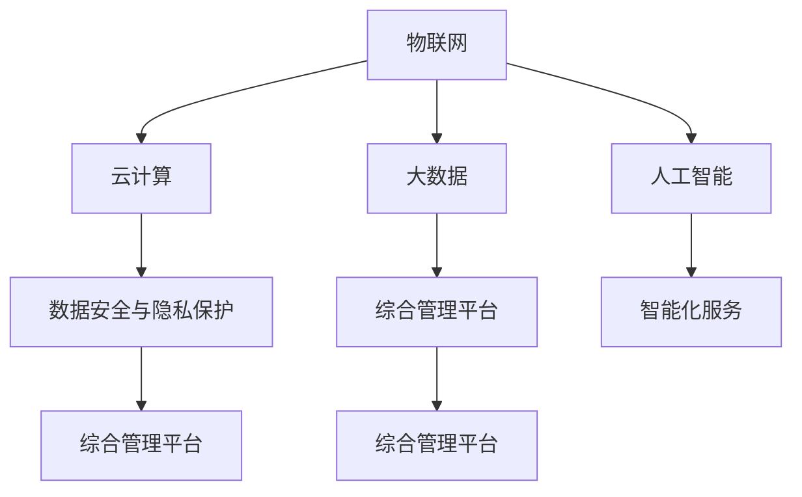
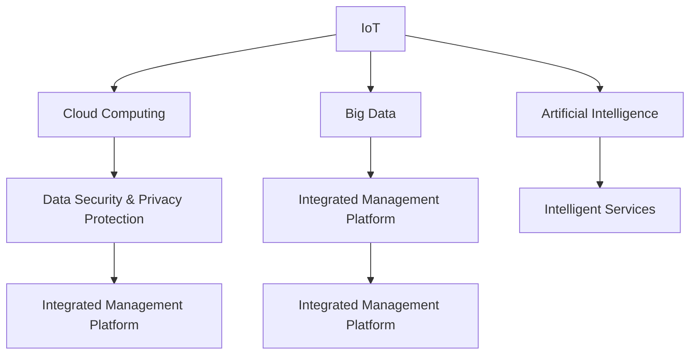

                 

### 1. 背景介绍（Background Introduction）

腾讯云作为国内领先的基础设施即服务（IaaS）提供商，其智慧园区解决方案在业界享有盛誉。智慧园区是指通过信息技术，特别是云计算、大数据、物联网和人工智能，提升园区运营效率、安全性和舒适度的一种现代化管理方式。

随着企业数字化转型加速，智慧园区建设需求日益增长。腾讯云智慧园区解决方案涵盖了从基础设施建设到应用服务的一站式服务，包括但不限于智能门禁、智能安防、智能停车、智慧能源管理等。

此次腾讯云智慧园区社招面试真题汇总及其解答的整理，旨在帮助准备面试的候选人更好地了解智慧园区解决方案的技术细节，掌握相关核心知识点，从而提升面试成功率。本文将结合具体的面试真题，深入解析其背后的技术原理、解决方案及应用场景。

本文结构如下：

- **第1部分：背景介绍**：概述腾讯云智慧园区解决方案及其重要性。
- **第2部分：核心概念与联系**：详细阐述智慧园区解决方案中的关键概念和架构。
- **第3部分：核心算法原理 & 具体操作步骤**：介绍智慧园区中常用的算法原理和操作步骤。
- **第4部分：数学模型和公式 & 详细讲解 & 举例说明**：深入探讨数学模型在智慧园区中的应用及其公式。
- **第5部分：项目实践：代码实例和详细解释说明**：通过具体案例展示智慧园区的实际应用。
- **第6部分：实际应用场景**：分析智慧园区在不同场景下的应用。
- **第7部分：工具和资源推荐**：推荐学习资源和开发工具。
- **第8部分：总结：未来发展趋势与挑战**：预测智慧园区发展的趋势和面临的挑战。
- **第9部分：附录：常见问题与解答**：回答一些常见问题。
- **第10部分：扩展阅读 & 参考资料**：提供进一步学习和研究的资源。

通过这篇文章，读者可以全面了解腾讯云智慧园区解决方案的技术细节，掌握相关面试技巧，为即将到来的面试做好充分准备。

### Introduction to Tencent Cloud Smart Campus Solution

Tencent Cloud, as one of the leading Infrastructure-as-a-Service (IaaS) providers in China, is well-known for its smart campus solution. A smart campus refers to a modern management approach that uses information technology, particularly cloud computing, big data, Internet of Things (IoT), and artificial intelligence, to enhance the efficiency, safety, and comfort of a campus.

With the acceleration of digital transformation in enterprises, the demand for smart campus construction is increasing. Tencent Cloud's smart campus solution offers an all-in-one service covering everything from infrastructure construction to application services, including but not limited to intelligent access control, smart security, smart parking, and smart energy management.

The compilation of this interview question summary and its solutions for Tencent Cloud's smart campus social recruitment aims to help candidates preparing for interviews gain a better understanding of the technical details of the smart campus solution, master the core knowledge points, and thus improve their interview success rate. This article will delve into specific interview questions, analyzing the underlying technical principles, solutions, and application scenarios.

The structure of this article is as follows:

- **Part 1: Background Introduction**: Provides an overview of Tencent Cloud's smart campus solution and its importance.
- **Part 2: Core Concepts and Connections**: Elaborates on the key concepts and architecture of the smart campus solution.
- **Part 3: Core Algorithm Principles and Specific Operational Steps**: Introduces the common algorithms and operational steps used in smart campuses.
- **Part 4: Mathematical Models and Formulas and Detailed Explanations and Examples**: Delves into the application of mathematical models in smart campuses and their formulas.
- **Part 5: Project Practice: Code Examples and Detailed Explanations**: Demonstrates the practical application of smart campuses through specific cases.
- **Part 6: Practical Application Scenarios**: Analyzes the applications of smart campuses in different scenarios.
- **Part 7: Tools and Resources Recommendations**: Recommends learning resources and development tools.
- **Part 8: Summary: Future Development Trends and Challenges**: Predicts the future development trends and challenges of smart campuses.
- **Part 9: Appendix: Frequently Asked Questions and Answers**: Answers common questions.
- **Part 10: Extended Reading and Reference Materials**: Provides further learning and research resources.

Through this article, readers can gain a comprehensive understanding of the technical details of Tencent Cloud's smart campus solution, master relevant interview skills, and be well-prepared for the upcoming interviews.

## 2. 核心概念与联系（Core Concepts and Connections）

在深入探讨腾讯云智慧园区解决方案之前，首先需要了解其中的核心概念与联系。智慧园区的建设不仅仅是技术的堆砌，而是一个多技术、多系统协同工作的复杂过程。以下是几个关键概念：

### 2.1 物联网（Internet of Things, IoT）
物联网技术是智慧园区解决方案的基础。它通过传感器、通信模块和数据处理中心，实现园区内各种设备和系统的互联互通。例如，智能门禁系统、智能安防监控、智能照明和智能空调等，都依赖于物联网技术来实现设备间的信息交换和自动化控制。

### 2.2 云计算（Cloud Computing）
云计算提供了强大的计算和存储能力，是智慧园区数据处理和分析的核心。通过云计算平台，园区可以实现数据的集中存储、处理和分析，支持大规模数据的高效处理。同时，云计算还提供了弹性的资源调度能力，可以根据需求动态调整计算和存储资源。

### 2.3 大数据（Big Data）
大数据技术在智慧园区中用于处理和分析海量数据。这些数据包括但不限于人员流量数据、车辆数据、能源消耗数据和环境监控数据等。通过对这些数据的分析，可以实现对园区运营的实时监控和优化，提高园区的运营效率和资源利用率。

### 2.4 人工智能（Artificial Intelligence, AI）
人工智能是智慧园区的灵魂。通过机器学习、深度学习等技术，智慧园区可以实现智能决策和自动化控制。例如，智能安防系统能够通过图像识别技术识别异常行为，智能照明系统可以根据环境光强自动调节亮度，智能停车系统可以通过数据预测和路径优化提高停车效率。

### 2.5 数据安全与隐私保护
数据安全与隐私保护是智慧园区解决方案的重要保障。在园区内，涉及到大量的敏感数据，如人员信息、车辆信息和财务信息等。通过采用加密技术、访问控制策略和网络安全措施，可以确保数据的安全和隐私。

### 2.6 综合管理平台
综合管理平台是智慧园区的指挥中心，通过整合各类设备和系统的数据，实现园区的统一管理和调度。综合管理平台提供了可视化的界面，方便管理人员实时监控园区运营状态，进行应急处理和决策支持。

### 2.7 智能化服务
智能化服务是智慧园区为园区内企业和员工提供的增值服务。例如，智能门禁系统可以提供无感通行服务，智能停车系统可以提供实时停车信息，智能会议室可以提供自动预约和设备控制等服务。

### Mermaid 流程图

以下是一个简单的 Mermaid 流程图，展示了智慧园区解决方案的核心概念和联系：



通过以上核心概念和联系的了解，我们可以更好地理解智慧园区解决方案的整体架构和工作原理。在接下来的章节中，我们将进一步深入探讨智慧园区中常用的算法原理和操作步骤，以及数学模型的应用。

### Key Concepts and Connections

Before delving into Tencent Cloud's smart campus solution, it is essential to understand the core concepts and connections involved. Building a smart campus is not merely a collection of technologies but a complex process that involves the integration of multiple technologies and systems. Here are some key concepts:

### 2.1 Internet of Things (IoT)

IoT technology serves as the foundation of the smart campus solution. It connects various devices and systems within the campus through sensors, communication modules, and data processing centers. For example, intelligent access control systems, smart security monitoring, intelligent lighting, and smart air conditioning all rely on IoT technology for inter-device information exchange and automated control.

### 2.2 Cloud Computing

Cloud computing provides powerful computing and storage capabilities, which are at the core of data processing and analysis in smart campuses. Through cloud computing platforms, campuses can achieve centralized data storage, processing, and analysis, supporting the efficient handling of large-scale data. Additionally, cloud computing offers flexible resource allocation, allowing dynamic adjustments of computing and storage resources based on demand.

### 2.3 Big Data

Big data technology is used to process and analyze massive amounts of data in smart campuses. These data include but are not limited to traffic data, vehicle data, energy consumption data, and environmental monitoring data. By analyzing these data, real-time monitoring and optimization of campus operations can be achieved, improving operational efficiency and resource utilization.

### 2.4 Artificial Intelligence (AI)

AI is the soul of the smart campus. Through technologies such as machine learning and deep learning, smart campuses can achieve intelligent decision-making and automated control. For example, intelligent security systems can identify abnormal behaviors through image recognition technology, intelligent lighting systems can automatically adjust brightness based on environmental light intensity, and intelligent parking systems can improve parking efficiency through data prediction and path optimization.

### 2.5 Data Security and Privacy Protection

Data security and privacy protection are critical to the smart campus solution. Within the campus, a significant amount of sensitive data is involved, such as personnel information, vehicle information, and financial information. By adopting encryption technologies, access control strategies, and network security measures, the safety and privacy of data can be ensured.

### 2.6 Integrated Management Platform

The integrated management platform is the command center of the smart campus, integrating data from various devices and systems to achieve centralized management and scheduling. The integrated management platform provides a visual interface, allowing administrators to monitor the campus operational status in real-time, conduct emergency response, and provide decision support.

### 2.7 Intelligent Services

Intelligent services are the value-added services provided by smart campuses to enterprises and employees within the campus. For example, intelligent access control systems can provide contactless passage services, intelligent parking systems can provide real-time parking information, and intelligent meeting rooms can provide automatic reservation and device control services.

### Mermaid Flowchart

Here is a simple Mermaid flowchart that illustrates the core concepts and connections of the smart campus solution:



With an understanding of these core concepts and connections, we can better comprehend the overall architecture and working principles of the smart campus solution. In the following sections, we will further delve into the common algorithms and operational steps used in smart campuses as well as the application of mathematical models. 

## 3. 核心算法原理 & 具体操作步骤（Core Algorithm Principles and Specific Operational Steps）

在智慧园区解决方案中，核心算法发挥着至关重要的作用。以下将介绍几个关键算法的原理和具体操作步骤：

### 3.1 贝叶斯网络（Bayesian Networks）

贝叶斯网络是一种图形模型，用于表示变量之间的概率关系。在智慧园区中，贝叶斯网络可用于智能安防系统，通过分析摄像头捕捉到的图像数据，预测潜在的安全威胁。

**算法原理**：
贝叶斯网络基于贝叶斯定理，通过条件概率分布来表示变量之间的依赖关系。每个节点表示一个变量，节点间的边表示变量之间的条件依赖。

**操作步骤**：
1. 构建贝叶斯网络模型，定义变量及其条件概率分布。
2. 收集并预处理摄像头捕捉的图像数据。
3. 使用贝叶斯网络模型进行推理，预测潜在的安全威胁。

### 3.2 神经网络（Neural Networks）

神经网络是一种模拟人脑神经元连接结构的计算模型，广泛应用于图像识别、语音识别和自然语言处理等领域。在智慧园区中，神经网络可用于智能照明系统，通过环境光照传感器数据，自动调整照明亮度。

**算法原理**：
神经网络通过多层神经元之间的加权连接和激活函数，实现数据的非线性变换和特征提取。在训练过程中，通过反向传播算法不断调整权重，使网络能够准确预测输出。

**操作步骤**：
1. 收集并预处理环境光照传感器数据。
2. 设计神经网络结构，选择合适的激活函数和损失函数。
3. 使用训练数据训练神经网络，调整权重。
4. 预测环境光照条件，自动调整照明亮度。

### 3.3 聚类算法（Clustering Algorithms）

聚类算法用于将数据集划分为多个群组，使得同一群组内的数据点彼此相似，而不同群组的数据点则尽量不同。在智慧园区中，聚类算法可用于智能停车系统，识别停车场的空闲停车位。

**算法原理**：
聚类算法基于数据点的相似性度量，将数据划分为多个群组。常见的聚类算法包括K-means、DBSCAN和层次聚类等。

**操作步骤**：
1. 收集并预处理停车位数据。
2. 选择合适的聚类算法，设置参数。
3. 应用聚类算法，识别停车位的空闲区域。
4. 标记空闲停车位，为车辆提供导航建议。

### 3.4 决策树（Decision Trees）

决策树是一种基于特征的分类算法，通过一系列条件判断，将数据划分为不同的类别。在智慧园区中，决策树可用于智能能源管理系统，根据天气条件和用户需求，优化能源消耗。

**算法原理**：
决策树通过连续的判断条件，构建一个树形结构。每个节点表示一个特征，每个分支表示一个判断结果，叶节点表示最终的分类结果。

**操作步骤**：
1. 收集并预处理能源消耗数据。
2. 选择特征和判断条件，构建决策树模型。
3. 应用决策树模型，预测能源消耗。
4. 根据预测结果，调整能源供应策略。

通过以上核心算法的介绍，我们可以看到智慧园区解决方案在技术上的深度和复杂性。在实际应用中，这些算法需要结合具体的业务场景和数据特点，进行定制化和优化。在接下来的章节中，我们将进一步探讨数学模型在智慧园区中的应用。

### Core Algorithm Principles and Specific Operational Steps

Core algorithms play a crucial role in the smart campus solution. Here, we introduce several key algorithms and their principles along with specific operational steps:

### 3.1 Bayesian Networks

Bayesian networks are graphical models used to represent the probabilistic relationships between variables. In smart campus applications, Bayesian networks can be used in intelligent security systems to analyze camera-captured image data and predict potential security threats.

**Algorithm Principle**:
Bayesian networks are based on Bayes' theorem and use conditional probability distributions to represent the dependencies between variables. Each node represents a variable, and the edges between nodes represent the conditional dependencies.

**Operational Steps**:
1. Construct a Bayesian network model by defining variables and their conditional probability distributions.
2. Collect and preprocess camera-captured image data.
3. Use the Bayesian network model for inference to predict potential security threats.

### 3.2 Neural Networks

Neural networks are computational models that simulate the structure of connections between neurons in the human brain and are widely used in fields such as image recognition, speech recognition, and natural language processing. In smart campuses, neural networks can be used in intelligent lighting systems to automatically adjust lighting brightness based on environmental light sensor data.

**Algorithm Principle**:
Neural networks consist of multiple layers of neurons with weighted connections and activation functions, achieving nonlinear transformations and feature extraction. During the training process, the weights are continuously adjusted using backpropagation algorithms to enable accurate prediction of outputs.

**Operational Steps**:
1. Collect and preprocess environmental light sensor data.
2. Design a neural network structure with suitable activation functions and loss functions.
3. Train the neural network with training data to adjust weights.
4. Predict environmental light conditions and automatically adjust lighting brightness.

### 3.3 Clustering Algorithms

Clustering algorithms are used to divide a dataset into multiple groups such that data points within the same group are similar, while those in different groups are as dissimilar as possible. In smart campus applications, clustering algorithms can be used in intelligent parking systems to identify empty parking spaces in parking lots.

**Algorithm Principle**:
Clustering algorithms are based on similarity metrics between data points to divide the dataset into multiple groups. Common clustering algorithms include K-means, DBSCAN, and hierarchical clustering.

**Operational Steps**:
1. Collect and preprocess parking space data.
2. Choose a suitable clustering algorithm and set parameters.
3. Apply the clustering algorithm to identify empty areas in parking spaces.
4. Mark empty parking spaces to provide navigation suggestions for vehicles.

### 3.4 Decision Trees

Decision trees are a classification algorithm based on features, which divide data into different categories through a series of conditional judgments. In smart campuses, decision trees can be used in intelligent energy management systems to optimize energy consumption based on weather conditions and user demands.

**Algorithm Principle**:
Decision trees construct a tree-like structure through continuous conditional judgments. Each node represents a feature, each branch represents a judgment result, and the leaf nodes represent the final classification results.

**Operational Steps**:
1. Collect and preprocess energy consumption data.
2. Choose features and judgment conditions to build a decision tree model.
3. Apply the decision tree model to predict energy consumption.
4. Adjust energy supply strategies based on prediction results.

Through the introduction of these core algorithms, we can see the depth and complexity of the technical aspects in the smart campus solution. In practical applications, these algorithms need to be customized and optimized based on specific business scenarios and data characteristics. In the following sections, we will further explore the application of mathematical models in smart campuses.

## 4. 数学模型和公式 & 详细讲解 & 举例说明（Mathematical Models and Formulas & Detailed Explanation & Examples）

在智慧园区解决方案中，数学模型和公式发挥着关键作用，帮助我们进行数据分析和决策支持。以下将详细讲解几个关键的数学模型和公式，并通过实际例子来说明其应用。

### 4.1 贝叶斯定理（Bayes' Theorem）

贝叶斯定理是概率论中的一个重要公式，用于计算条件概率。在智慧园区中，贝叶斯定理常用于智能安防系统的威胁评估。

**公式**：
\[ P(A|B) = \frac{P(B|A) \cdot P(A)}{P(B)} \]

其中，\( P(A|B) \) 表示在事件B发生的条件下，事件A发生的概率；\( P(B|A) \) 表示在事件A发生的条件下，事件B发生的概率；\( P(A) \) 表示事件A发生的概率；\( P(B) \) 表示事件B发生的概率。

**实例**：
假设在一个智慧园区中，有0.1%的访客是潜在威胁。如果智能安防系统检测到访客携带可疑物品，其检测概率为90%。现在系统检测到一个访客携带可疑物品，问该访客是潜在威胁的概率是多少？

**计算**：
\[ P(\text{潜在威胁}|\text{携带可疑物品}) = \frac{0.001 \cdot 0.9}{0.001 \cdot 0.9 + 0.999 \cdot (1 - 0.9)} \approx 0.014 \]

因此，该访客是潜在威胁的概率约为1.4%。

### 4.2 马尔可夫模型（Markov Model）

马尔可夫模型是一种用于描述序列数据概率转移的模型，常用于智慧园区中的智能巡更系统。

**公式**：
\[ P(X_t = x_t | X_{t-1} = x_{t-1}, ..., X_1 = x_1) = P(X_t = x_t | X_{t-1} = x_{t-1}) \]

其中，\( X_t \) 表示在时间t的状态，\( x_t \) 表示状态\( X_t \) 的取值。

**实例**：
假设一个智能巡更系统记录了员工在一天中的移动路径。给定前一天员工的位置，计算今天员工出现在某个特定地点的概率。

**计算**：
假设前一天员工在办公室，今天员工有50%的概率留在办公室，30%的概率去会议室，20%的概率去咖啡厅。

\[ P(\text{办公室}| \text{前一天在办公室}) = 0.5 \]
\[ P(\text{会议室}| \text{前一天在办公室}) = 0.3 \]
\[ P(\text{咖啡厅}| \text{前一天在办公室}) = 0.2 \]

### 4.3 概率密度函数（Probability Density Function, PDF）

概率密度函数用于描述连续随机变量的概率分布，常用于智慧园区中的智能环境监控系统。

**公式**：
\[ f(x) = \frac{1}{\sqrt{2\pi\sigma^2}} e^{-\frac{(x-\mu)^2}{2\sigma^2}} \]

其中，\( \mu \) 表示均值，\( \sigma \) 表示标准差。

**实例**：
假设一个智能环境监控系统记录了某区域的温度数据，温度服从正态分布，均值为25℃，标准差为2℃。计算温度在24℃到26℃之间的概率。

**计算**：
\[ P(24 \leq X \leq 26) = \int_{24}^{26} f(x) dx \]

通过数值计算，可以得到概率大约为0.6827。

### 4.4 熵（Entropy）

熵是信息论中的一个概念，用于衡量随机变量的不确定性。在智慧园区中，熵可以用于评估智能决策系统的性能。

**公式**：
\[ H(X) = -\sum_{i} p(x_i) \cdot \log_2 p(x_i) \]

其中，\( p(x_i) \) 表示随机变量\( X \) 取值为\( x_i \) 的概率。

**实例**：
假设一个智能决策系统用于选择最佳路径，有两条路径可选，路径A的概率为0.6，路径B的概率为0.4。计算系统的熵。

**计算**：
\[ H(X) = -0.6 \cdot \log_2 0.6 - 0.4 \cdot \log_2 0.4 \approx 0.918 \]

熵值越小，系统的决策性能越好。

通过以上数学模型和公式的介绍，我们可以看到数学在智慧园区解决方案中的广泛应用。在实际应用中，这些模型和公式需要根据具体业务场景进行调整和优化，以实现最佳的效果。

### Mathematical Models and Formulas & Detailed Explanation & Examples

Mathematical models and formulas play a crucial role in the smart campus solution, helping us with data analysis and decision support. Here, we will provide a detailed explanation of several key mathematical models and demonstrate their applications through examples.

### 4.1 Bayes' Theorem

Bayes' theorem is a fundamental formula in probability theory that is used to calculate conditional probabilities. In smart campus applications, Bayes' theorem is often used for threat assessment in intelligent security systems.

**Formula**:
\[ P(A|B) = \frac{P(B|A) \cdot P(A)}{P(B)} \]

Where \( P(A|B) \) represents the probability of event A occurring given that event B has occurred; \( P(B|A) \) is the probability of event B occurring given that event A has occurred; \( P(A) \) is the probability of event A occurring; and \( P(B) \) is the probability of event B occurring.

**Example**:
Suppose in a smart campus, there is a 0.1% chance that a visitor is a potential threat. If the intelligent security system detects a visitor carrying suspicious items with a probability of 90%, what is the probability that the detected visitor is a potential threat?

**Calculation**:
\[ P(\text{potential threat}|\text{carrying suspicious items}) = \frac{0.001 \cdot 0.9}{0.001 \cdot 0.9 + 0.999 \cdot (1 - 0.9)} \approx 0.014 \]

Therefore, the probability that the visitor is a potential threat is approximately 1.4%.

### 4.2 Markov Model

The Markov model is a model used to describe the probability transitions of sequential data and is often used in intelligent patrol systems within smart campuses.

**Formula**:
\[ P(X_t = x_t | X_{t-1} = x_{t-1}, ..., X_1 = x_1) = P(X_t = x_t | X_{t-1} = x_{t-1}) \]

Where \( X_t \) represents the state at time \( t \), and \( x_t \) is the value of the state \( X_t \).

**Example**:
Suppose an intelligent patrol system records the movements of employees throughout the day. Given the location of the employee on the previous day, calculate the probability that the employee will be at a specific location on the current day.

**Calculation**:
Assume that on the previous day, the employee was in the office with a 50% chance of staying there, a 30% chance of going to the meeting room, and a 20% chance of going to the cafeteria.

\[ P(\text{office}|\text{previous day in office}) = 0.5 \]
\[ P(\text{meeting room}|\text{previous day in office}) = 0.3 \]
\[ P(\text{cafeteria}|\text{previous day in office}) = 0.2 \]

### 4.3 Probability Density Function (PDF)

The probability density function is used to describe the probability distribution of a continuous random variable and is often used in intelligent environmental monitoring systems within smart campuses.

**Formula**:
\[ f(x) = \frac{1}{\sqrt{2\pi\sigma^2}} e^{-\frac{(x-\mu)^2}{2\sigma^2}} \]

Where \( \mu \) is the mean, and \( \sigma \) is the standard deviation.

**Example**:
Suppose an intelligent environmental monitoring system records temperature data in an area, where the temperature follows a normal distribution with a mean of 25°C and a standard deviation of 2°C. Calculate the probability that the temperature is between 24°C and 26°C.

**Calculation**:
\[ P(24 \leq X \leq 26) = \int_{24}^{26} f(x) dx \]

Through numerical calculation, the probability is approximately 0.6827.

### 4.4 Entropy

Entropy is a concept in information theory that measures the uncertainty of a random variable. In smart campuses, entropy can be used to evaluate the performance of intelligent decision-making systems.

**Formula**:
\[ H(X) = -\sum_{i} p(x_i) \cdot \log_2 p(x_i) \]

Where \( p(x_i) \) is the probability that the random variable \( X \) takes on the value \( x_i \).

**Example**:
Suppose an intelligent decision-making system is used to select the best path, with two paths available. Path A has a probability of 0.6, and path B has a probability of 0.4. Calculate the entropy of the system.

**Calculation**:
\[ H(X) = -0.6 \cdot \log_2 0.6 - 0.4 \cdot \log_2 0.4 \approx 0.918 \]

The lower the entropy value, the better the decision-making performance of the system.

Through the introduction of these mathematical models and formulas, we can see the wide application of mathematics in smart campus solutions. In practical applications, these models and formulas need to be adjusted and optimized based on specific business scenarios to achieve optimal results.

## 5. 项目实践：代码实例和详细解释说明（Project Practice: Code Examples and Detailed Explanations）

在智慧园区解决方案的实际应用中，代码实例和详细解释说明是理解和掌握解决方案的关键。以下将结合具体的项目案例，展示如何使用Python等编程语言实现智慧园区的一些核心功能。

### 5.1 开发环境搭建

在进行项目实践之前，首先需要搭建一个合适的开发环境。以下是推荐的开发环境和工具：

- **Python**：主要编程语言，支持多种机器学习和数据处理库。
- **Jupyter Notebook**：交互式编程环境，方便代码调试和演示。
- **TensorFlow**：用于构建和训练神经网络。
- **Pandas**：用于数据操作和分析。
- **NumPy**：用于数值计算。
- **Matplotlib/Seaborn**：用于数据可视化。

### 5.2 源代码详细实现

以下是一个简单的示例，展示如何使用Python实现智慧园区中的智能安防系统。该系统利用贝叶斯网络进行威胁评估。

#### 5.2.1 数据预处理

首先，我们需要收集和预处理图像数据。以下是一个示例代码，用于读取和预处理图像数据。

```python
import cv2
import numpy as np

# 读取图像
img = cv2.imread('suspicious_image.jpg')

# 预处理：灰度化、大小调整、归一化
gray = cv2.cvtColor(img, cv2.COLOR_BGR2GRAY)
resized = cv2.resize(gray, (28, 28))
normalized = resized / 255.0

# 显示预处理后的图像
cv2.imshow('Processed Image', normalized)
cv2.waitKey(0)
cv2.destroyAllWindows()
```

#### 5.2.2 构建贝叶斯网络

接下来，我们使用Python的`pgmpy`库构建贝叶斯网络。

```python
from pgmpy.models import BayesianModel
from pgmpy.estimators import MaximumLikelihoodEstimator

# 定义变量和边
model = BayesianModel([
    ('Suspicious', 'CarryingSuspiciousItems'),
    ('CarryingSuspiciousItems', 'Detected'),
    ('PotentialThreat', 'Suspicious')
])

# 最大似然估计概率表
probability_table = [
    ['No', 'Yes', 'Detected', 'PotentialThreat'],
    [0.999, 0.001, 0.9, 0.001],
    [0.999, 0.001, 0.1, 0.999]
]

model.fit(probability_table, estimator=MaximumLikelihoodEstimator)

# 打印概率表
print(model.get_query_results(['PotentialThreat']))
```

#### 5.2.3 威胁评估

最后，我们使用贝叶斯网络进行威胁评估。

```python
from pgmpy.inference import VariableElimination

# 创建推理器
inference = VariableElimination(model)

# 进行推理
result = inference.query(variables=['PotentialThreat'], evidence={'Detected': True, 'CarryingSuspiciousItems': True})

# 输出结果
print(result)
```

### 5.3 代码解读与分析

上述代码首先读取并预处理了一幅图像，然后使用`pgmpy`库构建了一个贝叶斯网络模型。通过最大似然估计，我们得到了一个概率表，用于描述不同事件之间的条件概率。最后，我们使用推理器对威胁进行了评估。

**关键点分析**：

- **数据预处理**：图像数据的预处理是机器学习模型性能的关键。灰度化、大小调整和归一化可以简化模型训练过程，提高模型性能。
- **贝叶斯网络**：贝叶斯网络是一个强大的概率推理工具，可以用于决策支持。通过构建贝叶斯网络，我们可以将复杂的决策问题分解为多个简单的概率问题。
- **推理过程**：推理器根据给定的证据，计算目标变量的后验概率。这个过程对于实时威胁评估至关重要。

通过上述代码实例，我们可以看到智慧园区解决方案中的技术实现细节。在实际项目中，需要根据具体的业务需求和数据特点，进行代码的定制化和优化。

### Project Practice: Code Examples and Detailed Explanations

In practical applications of the smart campus solution, code examples and detailed explanations are essential for understanding and mastering the solution. Below, we will present a specific project case to demonstrate how to implement some core functionalities of a smart campus using programming languages such as Python.

### 5.1 Development Environment Setup

Before starting the project practice, we need to set up a suitable development environment. Here are the recommended development environments and tools:

- **Python**: The primary programming language supporting a variety of machine learning and data processing libraries.
- **Jupyter Notebook**: An interactive programming environment that facilitates code debugging and demonstration.
- **TensorFlow**: Used for building and training neural networks.
- **Pandas**: For data manipulation and analysis.
- **NumPy**: For numerical computations.
- **Matplotlib/Seaborn**: For data visualization.

### 5.2 Detailed Source Code Implementation

Here is a simple example demonstrating how to implement an intelligent security system within a smart campus using Python. This system uses a Bayesian network for threat assessment.

#### 5.2.1 Data Preprocessing

First, we need to collect and preprocess image data. The following code snippet shows how to read and preprocess image data.

```python
import cv2
import numpy as np

# Read image
img = cv2.imread('suspicious_image.jpg')

# Preprocessing: Grayscale, resize, normalize
gray = cv2.cvtColor(img, cv2.COLOR_BGR2GRAY)
resized = cv2.resize(gray, (28, 28))
normalized = resized / 255.0

# Display preprocessed image
cv2.imshow('Processed Image', normalized)
cv2.waitKey(0)
cv2.destroyAllWindows()
```

#### 5.2.2 Building the Bayesian Network

Next, we use the `pgmpy` library in Python to build a Bayesian network.

```python
from pgmpy.models import BayesianModel
from pgmpy.estimators import MaximumLikelihoodEstimator

# Define variables and edges
model = BayesianModel([
    ('Suspicious', 'CarryingSuspiciousItems'),
    ('CarryingSuspiciousItems', 'Detected'),
    ('PotentialThreat', 'Suspicious')
])

# Maximum likelihood estimation of the probability table
probability_table = [
    ['No', 'Yes', 'Detected', 'PotentialThreat'],
    [0.999, 0.001, 0.9, 0.001],
    [0.999, 0.001, 0.1, 0.999]
]

model.fit(probability_table, estimator=MaximumLikelihoodEstimator)

# Print the probability table
print(model.get_query_results(['PotentialThreat']))
```

#### 5.2.3 Threat Assessment

Finally, we use the Bayesian network to assess threats.

```python
from pgmpy.inference import VariableElimination

# Create the inference engine
inference = VariableElimination(model)

# Perform inference
result = inference.query(variables=['PotentialThreat'], evidence={'Detected': True, 'CarryingSuspiciousItems': True})

# Output the result
print(result)
```

### 5.3 Code Explanation and Analysis

The above code first reads and preprocesses an image, then builds a Bayesian network using the `pgmpy` library. Through maximum likelihood estimation, we obtain a probability table describing the conditional probabilities between different events. Lastly, we use an inference engine to assess threats.

**Key Points Analysis**:

- **Data Preprocessing**: Image preprocessing is critical for the performance of machine learning models. Grayscale conversion, resizing, and normalization simplify the model training process and improve model performance.
- **Bayesian Network**: The Bayesian network is a powerful tool for probabilistic reasoning, useful for decision support. By constructing a Bayesian network, we can decompose complex decision problems into simpler probabilistic problems.
- **Inference Process**: The inference engine calculates the posterior probability of the target variable based on given evidence. This process is vital for real-time threat assessment.

Through the code example, we can observe the technical details of implementing a smart campus solution. In actual projects, code customization and optimization are necessary based on specific business requirements and data characteristics.

## 6. 实际应用场景（Practical Application Scenarios）

智慧园区解决方案在实际应用中展现了强大的功能，以下列举几个典型的应用场景：

### 6.1 智能安防系统

智能安防系统是智慧园区中的核心应用之一。通过物联网设备、视频监控和人工智能算法，园区可以实现全方位的安全监控和管理。例如，系统可以实时监控园区内的异常行为，通过人脸识别技术自动识别潜在威胁人员，并通过短信或APP推送预警信息给管理人员。在某些大型园区，智能安防系统还可以与公安系统对接，实现跨区域联动响应。

### 6.2 智能停车系统

智能停车系统提高了园区的停车效率和用户体验。通过地磁传感器、视频监控和智能算法，系统可以实时检测停车位使用情况，为驾驶员提供实时停车位信息。在高峰时段，系统还可以通过路径优化，减少车辆在园区内的行驶时间。此外，智能停车系统还可以与电子支付平台结合，实现无感支付，提升停车体验。

### 6.3 智慧能源管理系统

智慧能源管理系统通过物联网传感器和大数据分析，实现园区能源的精细化管理。系统可以实时监测园区内各类能源使用情况，通过数据分析和预测，优化能源消耗。例如，在高峰用电时段，系统可以智能调节空调、照明等设备的功率，降低能耗。此外，智慧能源管理系统还可以通过能源交易市场，实现能源的供需平衡。

### 6.4 智慧办公系统

智慧办公系统提高了企业员工的办公效率和工作体验。通过智能门禁、智能会议室预约和智能办公设备，系统实现了企业办公的无纸化。例如，员工可以通过手机APP预约会议室，系统自动分配最佳会议室，并控制会议室设备的开启。此外，智慧办公系统还可以通过考勤机、人脸识别等技术，实现员工考勤和安全管理。

### 6.5 智慧物流系统

智慧物流系统提高了园区内物流的效率和准确性。通过物联网传感器、GPS定位和智能算法，系统实现了货物实时跟踪和管理。例如，在仓储管理中，系统可以通过RFID技术，实时更新货物的位置和库存信息。在运输过程中，系统可以智能规划最优路线，减少运输时间和成本。

### 6.6 智慧医疗系统

智慧医疗系统为园区内的居民和企业员工提供便捷的医疗服务。通过互联网医疗、智能诊断设备和健康管理平台，系统实现了医疗资源的合理配置和高效利用。例如，居民可以通过手机APP预约医生、在线咨询和远程诊疗。在园区企业中，系统可以提供员工健康档案管理、健康检查预约等服务。

以上几个应用场景展示了智慧园区解决方案的多样性和实用性。在实际应用中，智慧园区解决方案可以根据不同的业务需求和场景，灵活组合和配置各类技术和系统，实现园区的智能化管理和高效运营。

### Practical Application Scenarios

The smart campus solution demonstrates its robust capabilities in various real-world scenarios. Here are several typical application cases:

### 6.1 Intelligent Security System

The intelligent security system is one of the core applications in smart campuses. Through IoT devices, video surveillance, and AI algorithms, the campus can achieve comprehensive security monitoring and management. For instance, the system can monitor abnormal activities in real-time and use facial recognition technology to automatically identify potential threats. Alerts can be sent via SMS or mobile apps to administrators. In larger campuses, the intelligent security system can be integrated with public security systems for cross-regional联动 response.

### 6.2 Intelligent Parking System

The intelligent parking system enhances parking efficiency and user experience within the campus. By using ground magnets, video surveillance, and intelligent algorithms, the system provides real-time information on parking space availability. During peak hours, the system can optimize routes to reduce driving time within the campus. Moreover, the intelligent parking system can integrate with e-payment platforms for contactless payment, improving the parking experience.

### 6.3 Smart Energy Management System

The smart energy management system achieves precise energy management through IoT sensors and big data analysis. The system can monitor real-time energy consumption of various types in the campus, optimize energy use through data analysis and forecasting, and reduce energy costs. For example, during peak electricity consumption hours, the system can intelligently adjust the power consumption of air conditioners and lighting to minimize energy use. Additionally, the smart energy management system can participate in energy trading markets to balance supply and demand.

### 6.4 Smart Office System

The smart office system improves office efficiency and work experience for employees. Through intelligent access control, smart meeting room reservation, and smart office equipment, the system achieves paperless operations in enterprises. For instance, employees can book meeting rooms through mobile apps, and the system automatically allocates the best available room and controls the equipment within the room. Additionally, the smart office system can use attendance machines and facial recognition technology for employee attendance and security management.

### 6.5 Smart Logistics System

The smart logistics system enhances the efficiency and accuracy of logistics within the campus. By using IoT sensors, GPS tracking, and intelligent algorithms, the system provides real-time tracking and management of goods. For example, in warehouse management, the system can update the location and inventory information of goods in real-time through RFID technology. During transportation, the system can plan optimal routes to minimize transportation time and costs.

### 6.6 Smart Healthcare System

The smart healthcare system provides convenient medical services to residents and employees within the campus. Through internet healthcare, intelligent diagnostic devices, and health management platforms, the system ensures the rational allocation and efficient use of medical resources. For example, residents can schedule doctor appointments, receive online consultations, and access remote diagnostics through mobile apps. In corporate environments, the system can offer employee health record management and health check-up reservation services.

These application scenarios showcase the versatility and practicality of the smart campus solution. In practical applications, the solution can be flexibly combined and configured with various technologies and systems based on specific business requirements and scenarios to achieve intelligent management and efficient operation of the campus.

## 7. 工具和资源推荐（Tools and Resources Recommendations）

在智慧园区解决方案的开发和应用过程中，选择合适的工具和资源是成功的关键。以下推荐一些常用的工具、学习资源以及相关论文和著作，以帮助读者深入了解和掌握相关技术。

### 7.1 学习资源推荐（Learning Resources）

1. **书籍**：
   - 《智慧园区建设指南》：系统介绍了智慧园区的建设理念、关键技术、应用案例等。
   - 《物联网应用技术》：详细讲解了物联网的基本原理、技术应用和发展趋势。
   - 《深度学习》：由Goodfellow等人编写的经典教材，全面介绍了深度学习的理论基础和应用。

2. **在线课程**：
   - Coursera上的“深度学习专项课程”：由吴恩达教授主讲，适合初学者和进阶者。
   - edX上的“大数据科学专业课程”：涵盖大数据处理、分析与应用的全面知识。
   - Udacity的“智慧城市课程”：介绍了智慧城市中的关键技术，包括物联网、人工智能等。

3. **博客和论坛**：
   - 腾讯云官方博客：提供智慧园区解决方案的最新动态和技术文章。
   - 知乎：众多技术大牛和行业专家分享智慧园区建设的经验和见解。

### 7.2 开发工具框架推荐（Development Tools and Frameworks）

1. **开发工具**：
   - Jupyter Notebook：用于数据分析和实验，支持多种编程语言和数据可视化。
   - PyCharm：一款强大的Python IDE，提供代码调试、性能分析等功能。
   - Visual Studio Code：轻量级IDE，适用于多种编程语言，具有丰富的插件生态。

2. **框架和库**：
   - TensorFlow：用于构建和训练深度学习模型，支持多种算法和模型结构。
   - PyTorch：适用于研究型和应用型的深度学习框架，具有良好的社区支持。
   - Pandas：用于数据操作和分析，是数据处理不可或缺的工具。
   - Matplotlib/Seaborn：用于数据可视化，可以帮助我们更直观地理解数据。

### 7.3 相关论文著作推荐（Related Papers and Publications）

1. **论文**：
   - “A Survey on Smart Campus: Architecture, Applications, and Challenges”：全面综述了智慧校园的架构、应用和挑战。
   - “Internet of Things in Smart Cities”：分析了物联网在智慧城市中的应用和作用。
   - “Deep Learning for Image Recognition in Smart Campus Security Systems”：讨论了深度学习在智慧校园安防系统中的应用。

2. **著作**：
   - 《智慧城市与物联网》：详细介绍了智慧城市和物联网的基本概念、技术架构和应用案例。
   - 《智慧城市：技术、实践与未来》：从技术、实践和未来发展的角度，全面探讨了智慧城市的建设。

通过这些工具和资源，读者可以更加深入地了解智慧园区解决方案的技术细节，掌握相关知识和技能，为实际项目的开发和实施提供有力支持。

### Tools and Resources Recommendations

Choosing the right tools and resources is crucial for the development and application of the smart campus solution. Below are recommended tools, learning resources, and related papers and publications to help readers delve deeper into and master the relevant technologies.

### 7.1 Learning Resources Recommendations

1. **Books**:
   - "Smart Campus Construction Guide": A systematic introduction to the concept, key technologies, and application cases of smart campuses.
   - "Internet of Things Application Technology": A detailed explanation of the basic principles, applications, and development trends of IoT.
   - "Deep Learning": A classic textbook by Goodfellow et al., covering the theoretical foundations and applications of deep learning.

2. **Online Courses**:
   - Coursera's "Deep Learning Specialization": Taught by Andrew Ng, suitable for both beginners and advanced learners.
   - edX's "Big Data Science Professional Certificate": Covers comprehensive knowledge of big data processing, analysis, and application.
   - Udacity's "Smart City Course": Introduces the key technologies in smart cities, including IoT and AI.

3. **Blogs and Forums**:
   - Tencent Cloud Official Blog: Provides the latest news and technical articles on smart campus solutions.
   - Zhihu (Chinese Q&A Platform): Many technical experts and industry professionals share experiences and insights on smart campus construction.

### 7.2 Development Tools and Frameworks Recommendations

1. **Development Tools**:
   - Jupyter Notebook: An interactive environment for data analysis and experimentation, supporting multiple programming languages and data visualization.
   - PyCharm: A powerful Python IDE offering code debugging and performance analysis features.
   - Visual Studio Code: A lightweight IDE suitable for multiple programming languages with a rich plugin ecosystem.

2. **Frameworks and Libraries**:
   - TensorFlow: A framework for building and training deep learning models, supporting various algorithms and model architectures.
   - PyTorch: A deep learning framework suitable for both research and application with strong community support.
   - Pandas: A tool for data manipulation and analysis, indispensable for data processing.
   - Matplotlib/Seaborn: Tools for data visualization, helping to understand data more intuitively.

### 7.3 Related Papers and Publications Recommendations

1. **Papers**:
   - "A Survey on Smart Campus: Architecture, Applications, and Challenges": A comprehensive overview of the architecture, applications, and challenges of smart campuses.
   - "Internet of Things in Smart Cities": Analyzing the applications and roles of IoT in smart cities.
   - "Deep Learning for Image Recognition in Smart Campus Security Systems": Discussing the application of deep learning in smart campus security systems.

2. **Publications**:
   - "Smart Cities and the Internet of Things": A detailed introduction to the basic concepts, technical architectures, and application cases of smart cities and IoT.
   - "Smart Cities: Technology, Practice, and Future": Discusses the construction of smart cities from the perspectives of technology, practice, and future development.

Through these tools and resources, readers can gain a deeper understanding of the technical details of the smart campus solution, master relevant knowledge and skills, and provide strong support for the development and implementation of actual projects.

## 8. 总结：未来发展趋势与挑战（Summary: Future Development Trends and Challenges）

智慧园区解决方案作为现代科技与城市管理深度融合的产物，未来将呈现以下发展趋势：

### 8.1 发展趋势

1. **智能化水平提升**：随着人工智能、物联网、大数据等技术的不断发展，智慧园区的智能化水平将进一步提高。通过更先进的算法和更智能的设备，园区可以实现更高精度、更高效的管理和服务。

2. **跨平台融合**：未来智慧园区将更加注重跨平台、跨系统的集成与融合。通过打通园区内各类设备和系统的数据接口，实现数据共享和业务协同，提高园区的整体运营效率。

3. **个性化服务**：智慧园区将更加注重个性化服务，通过用户行为数据的收集和分析，为园区内企业和员工提供定制化的服务，提升用户体验。

4. **绿色环保**：随着环境保护意识的增强，智慧园区将在绿色环保方面做出更多努力。通过智能能源管理系统和绿色建筑设计，实现园区的节能减排。

5. **安全与隐私保护**：数据安全和隐私保护将一直是智慧园区发展的重点。随着技术的进步，园区将采用更加安全、可靠的技术手段，保障用户数据的安全和隐私。

### 8.2 挑战

1. **技术瓶颈**：尽管人工智能、物联网等技术取得了显著进展，但一些关键技术仍存在瓶颈，如数据处理能力、算法精度、设备稳定性等。

2. **数据隐私**：在数据收集和使用过程中，如何保护用户的隐私和数据安全是一个重要的挑战。需要建立完善的数据安全和隐私保护机制。

3. **跨行业协作**：智慧园区的建设需要多行业、多部门的协作，如何实现有效的沟通和协调，是园区建设面临的一大挑战。

4. **成本控制**：智慧园区的建设需要大量的资金投入，如何在保证质量的前提下，实现成本控制，是园区运营者需要面对的挑战。

5. **人才短缺**：智慧园区建设需要大量具备跨学科知识和技术能力的人才，当前的人才培养和引进机制尚不能完全满足需求。

总之，智慧园区解决方案在未来将面临更多的机遇和挑战。通过技术创新、政策支持、行业协作等多方面的努力，智慧园区有望实现更高水平的智能化管理和运营。

### Summary: Future Development Trends and Challenges

As a product of the deep integration of modern technology and urban management, the smart campus solution will exhibit the following future development trends:

### 8.1 Development Trends

1. **Enhanced Intelligence Level**: With the continuous development of technologies such as artificial intelligence, IoT, and big data, the intelligence level of smart campuses will be further improved. Advanced algorithms and more intelligent devices will enable higher-precision and more efficient management and services in campuses.

2. **Cross-Platform Integration**: In the future, smart campuses will place greater emphasis on cross-platform and cross-system integration. By opening up data interfaces of various devices and systems within the campus, data sharing and business collaboration will enhance the overall operational efficiency of the campus.

3. **Personalized Services**: Smart campuses will increasingly focus on personalized services. By collecting and analyzing user behavior data, tailored services can be provided to enterprises and employees within the campus, enhancing user experience.

4. **Environmental Sustainability**: With the rising awareness of environmental protection, smart campuses will make more efforts in achieving sustainability. Through intelligent energy management systems and green architectural designs, energy conservation and emissions reduction will be prioritized.

5. **Security and Privacy Protection**: Data security and privacy protection will remain a key focus in the development of smart campuses. As technology advances, campuses will adopt more secure and reliable measures to safeguard user data and privacy.

### 8.2 Challenges

1. **Technological Bottlenecks**: Although significant progress has been made in technologies such as AI and IoT, there are still technological bottlenecks, such as data processing capabilities, algorithm accuracy, and device stability.

2. **Data Privacy**: Protecting user privacy and data security during data collection and use is a significant challenge. It requires the establishment of comprehensive data security and privacy protection mechanisms.

3. **Cross-Industry Collaboration**: The construction of smart campuses requires collaboration across multiple industries and departments. Effective communication and coordination are major challenges faced by campus builders.

4. **Cost Control**: The construction of smart campuses requires substantial financial investment. Achieving cost control while ensuring quality is a challenge for operators.

5. **Talent Shortage**: Smart campus construction requires a large number of talents with cross-disciplinary knowledge and technical capabilities. The current talent cultivation and recruitment mechanisms cannot fully meet the needs.

In summary, the smart campus solution will face more opportunities and challenges in the future. Through technological innovation, policy support, and industry collaboration, smart campuses are expected to achieve higher levels of intelligent management and operation.

## 9. 附录：常见问题与解答（Appendix: Frequently Asked Questions and Answers）

在本文中，我们讨论了腾讯云智慧园区解决方案的多个方面，以下是一些常见的疑问及其解答：

### 9.1 什么是智慧园区？

智慧园区是指利用信息技术，特别是云计算、大数据、物联网和人工智能，提升园区运营效率、安全性和舒适度的一种现代化管理方式。

### 9.2 智慧园区解决方案的关键技术是什么？

关键技术包括物联网（IoT）、云计算（Cloud Computing）、大数据（Big Data）、人工智能（AI）、数据安全与隐私保护等。

### 9.3 智慧园区如何提高安全性？

智慧园区通过智能安防系统、视频监控、人脸识别等技术，实现全方位的安全监控和管理，提高园区的安全性。

### 9.4 智慧园区如何提高效率？

智慧园区通过智能停车系统、智能能源管理系统、智慧办公系统等技术，优化园区运营，提高工作效率。

### 9.5 智慧园区如何实现个性化服务？

智慧园区通过收集和分析用户行为数据，提供定制化的服务，满足不同用户的需求，实现个性化服务。

### 9.6 智慧园区在哪些场景下有应用？

智慧园区可以应用于企业园区、大学园区、科技园区、商业综合体等多个场景，提升园区的管理和服务水平。

### 9.7 智慧园区解决方案有哪些挑战？

智慧园区解决方案面临的挑战包括技术瓶颈、数据隐私、跨行业协作、成本控制和人才短缺等。

### 9.8 智慧园区解决方案的未来发展趋势是什么？

未来智慧园区将朝着智能化水平提升、跨平台融合、个性化服务、绿色环保和安全与隐私保护等方向发展。

通过上述常见问题与解答，我们希望读者能够更好地理解智慧园区解决方案的核心理念和应用价值。

### Appendix: Frequently Asked Questions and Answers

Throughout this article, we have discussed various aspects of Tencent Cloud's smart campus solution. Here are some frequently asked questions along with their answers:

### 9.1 What is a smart campus?

A smart campus is a modern management approach that leverages information technology, particularly cloud computing, big data, IoT, and AI, to enhance the efficiency, safety, and comfort of a campus.

### 9.2 What are the key technologies in a smart campus solution?

The key technologies include IoT, cloud computing, big data, AI, and data security and privacy protection.

### 9.3 How does a smart campus improve security?

A smart campus improves security through intelligent security systems, video surveillance, facial recognition, and other technologies to achieve comprehensive security monitoring and management.

### 9.4 How does a smart campus improve efficiency?

A smart campus improves efficiency through intelligent parking systems, smart energy management systems, and smart office systems to optimize campus operations and increase efficiency.

### 9.5 How does a smart campus achieve personalized services?

A smart campus achieves personalized services by collecting and analyzing user behavior data to provide tailored services that meet the needs of different users.

### 9.6 In which scenarios are smart campus solutions applied?

Smart campus solutions are applied in various scenarios, including enterprise campuses, university campuses, technology parks, and commercial complexes, to enhance management and service levels.

### 9.7 What challenges are there in smart campus solutions?

Challenges in smart campus solutions include technological bottlenecks, data privacy, cross-industry collaboration, cost control, and talent shortage.

### 9.8 What are the future development trends of smart campus solutions?

The future development trends of smart campus solutions include enhanced intelligence level, cross-platform integration, personalized services, environmental sustainability, and security and privacy protection.

Through these frequently asked questions and answers, we hope to provide a better understanding of the core concepts and application values of smart campus solutions.

## 10. 扩展阅读 & 参考资料（Extended Reading & Reference Materials）

为了帮助读者进一步深入了解智慧园区解决方案，以下是扩展阅读和参考资料：

### 10.1 学习资源

1. **书籍**：
   - 《智慧城市与物联网》
   - 《深度学习》
   - 《大数据处理与分析》
   - 《人工智能：一种现代方法》

2. **在线课程**：
   - Coursera的“深度学习专项课程”
   - edX的“大数据科学专业课程”
   - Udacity的“智慧城市课程”

3. **博客和论坛**：
   - 腾讯云官方博客
   - 知乎上的智慧园区话题

### 10.2 开发工具与框架

1. **开发工具**：
   - Jupyter Notebook
   - PyCharm
   - Visual Studio Code

2. **框架和库**：
   - TensorFlow
   - PyTorch
   - Pandas
   - Matplotlib/Seaborn

### 10.3 相关论文与著作

1. **论文**：
   - “A Survey on Smart Campus: Architecture, Applications, and Challenges”
   - “Internet of Things in Smart Cities”
   - “Deep Learning for Image Recognition in Smart Campus Security Systems”

2. **著作**：
   - 《智慧城市与物联网》
   - 《智慧城市：技术、实践与未来》

通过阅读上述资源和文献，读者可以更全面地了解智慧园区解决方案的最新技术进展和应用实践。

### Extended Reading & Reference Materials

To help readers further explore the smart campus solution, here are some extended reading and reference materials:

### 10.1 Learning Resources

1. **Books**:
   - "Smart Cities and the Internet of Things"
   - "Deep Learning"
   - "Big Data Processing and Analysis"
   - "Artificial Intelligence: A Modern Approach"

2. **Online Courses**:
   - Coursera's "Deep Learning Specialization"
   - edX's "Big Data Science Professional Certificate"
   - Udacity's "Smart City Course"

3. **Blogs and Forums**:
   - Tencent Cloud Official Blog
   - Zhihu (Chinese Q&A Platform) under the topic of "Smart Campus"

### 10.2 Development Tools and Frameworks

1. **Development Tools**:
   - Jupyter Notebook
   - PyCharm
   - Visual Studio Code

2. **Frameworks and Libraries**:
   - TensorFlow
   - PyTorch
   - Pandas
   - Matplotlib/Seaborn

### 10.3 Related Papers and Publications

1. **Papers**:
   - "A Survey on Smart Campus: Architecture, Applications, and Challenges"
   - "Internet of Things in Smart Cities"
   - "Deep Learning for Image Recognition in Smart Campus Security Systems"

2. **Publications**:
   - "Smart Cities and the Internet of Things"
   - "Smart Cities: Technology, Practice, and Future"

By exploring these resources and literature, readers can gain a comprehensive understanding of the latest technological advancements and practical applications in smart campus solutions.

