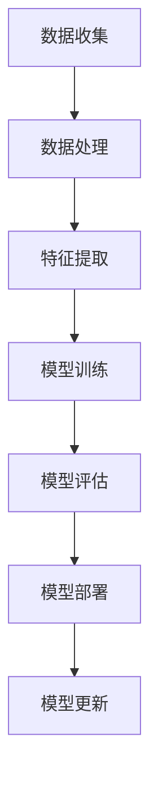
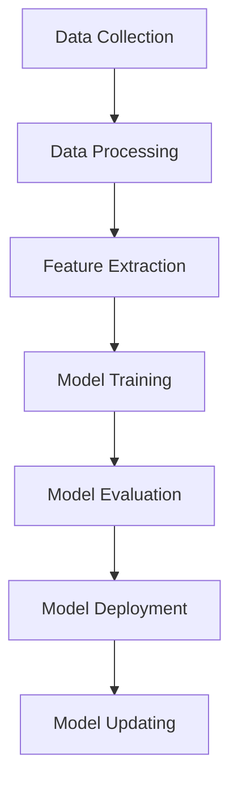

                 

### 文章标题

"电商行业中的AI大模型：机遇与挑战并存"

关键词：电商，AI大模型，机遇，挑战

摘要：本文深入探讨了电商行业中AI大模型的应用及其带来的机遇与挑战。通过对AI大模型的核心概念、算法原理、数学模型以及项目实践的详细分析，文章揭示了AI大模型在电商行业中的广泛应用场景和未来发展趋势。

<|assistant|>## 1. 背景介绍（Background Introduction）

### 1.1 电商行业的现状

电商行业自20世纪末兴起以来，经历了飞速的发展。随着互联网技术的普及和智能手机的普及，电商已经成为了人们日常生活中不可或缺的一部分。根据最新的统计数据，全球电商市场规模已经突破了万亿美元大关，预计未来几年仍将保持较高的增长率。

### 1.2 AI大模型的崛起

AI大模型，尤其是基于深度学习的语言模型，如ChatGPT、BERT等，近年来取得了巨大的成功。这些模型通过学习海量数据，能够生成高质量的自然语言文本，从而在自然语言处理、图像识别、语音识别等多个领域展现出强大的能力。

### 1.3 AI大模型在电商行业中的应用

随着AI大模型技术的不断成熟，电商行业也开始积极拥抱这一新技术。从智能客服、个性化推荐、到市场预测、供应链优化，AI大模型在电商行业的应用场景越来越广泛。

### 1.4 机遇与挑战并存

AI大模型在电商行业带来了巨大的机遇，同时也带来了诸多挑战。如何在充分利用AI大模型优势的同时，规避其可能带来的风险，成为了电商行业亟需解决的问题。

<|assistant|>## 2. 核心概念与联系（Core Concepts and Connections）

### 2.1 AI大模型的核心概念

AI大模型，尤其是基于深度学习的语言模型，通常具有以下几个核心概念：

- **神经网络（Neural Network）**：AI大模型的核心组成部分，由大量的神经元组成，通过学习数据来模拟人脑的处理方式。
- **大规模训练（Massive Training）**：AI大模型需要大量数据进行训练，以达到良好的性能。训练数据的质量和数量直接影响到模型的性能。
- **语言建模（Language Modeling）**：AI大模型通过对大量文本数据进行学习，生成自然语言文本的能力。

### 2.2 AI大模型与电商行业的联系

AI大模型与电商行业的联系主要表现在以下几个方面：

- **个性化推荐**：AI大模型可以通过分析用户的历史购买行为、浏览记录等信息，为用户推荐个性化商品。
- **智能客服**：AI大模型可以模拟人类客服，解决用户的常见问题，提高客服效率。
- **市场预测**：AI大模型可以通过分析市场数据，预测未来的市场趋势，帮助电商企业制定战略决策。
- **供应链优化**：AI大模型可以分析供应链数据，优化库存管理、物流配送等环节，降低运营成本。

### 2.3 AI大模型与传统电商的区别

与传统的电商模式相比，AI大模型具有以下几个显著区别：

- **数据处理能力**：AI大模型可以通过大规模数据处理，挖掘出更多的用户行为模式，从而提供更精准的服务。
- **决策能力**：AI大模型可以通过分析大量的数据，提供智能化的决策支持，帮助电商企业更好地应对市场变化。
- **用户体验**：AI大模型可以提供更个性化的服务，提高用户的满意度。

<|assistant|>### 2.3 AI大模型与传统电商的区别

与传统的电商模式相比，AI大模型具有以下几个显著区别：

- **数据处理能力**：AI大模型可以通过大规模数据处理，挖掘出更多的用户行为模式，从而提供更精准的服务。传统的电商模式往往依赖于简单的用户数据统计，难以深入挖掘用户的潜在需求。

- **决策能力**：AI大模型可以通过分析大量的数据，提供智能化的决策支持，帮助电商企业更好地应对市场变化。传统的电商模式往往依赖于人工经验进行决策，效率较低且容易受到主观因素的影响。

- **用户体验**：AI大模型可以提供更个性化的服务，提高用户的满意度。传统的电商模式往往提供标准化的商品和服务，无法满足不同用户的需求。

### 2.4 AI大模型在电商行业的应用

AI大模型在电商行业的应用已经非常广泛，以下是一些典型的应用场景：

- **个性化推荐**：AI大模型可以通过分析用户的历史购买行为、浏览记录等信息，为用户推荐个性化商品。例如，淘宝的个性化推荐系统就是基于用户的购买记录和浏览行为，为用户提供个性化推荐。

- **智能客服**：AI大模型可以模拟人类客服，解决用户的常见问题，提高客服效率。例如，京东的智能客服系统就是基于AI大模型技术，能够自动回答用户的问题。

- **市场预测**：AI大模型可以通过分析市场数据，预测未来的市场趋势，帮助电商企业制定战略决策。例如，亚马逊的市场预测系统就是基于AI大模型技术，能够预测哪些商品会在未来热销。

- **供应链优化**：AI大模型可以分析供应链数据，优化库存管理、物流配送等环节，降低运营成本。例如，阿里巴巴的供应链优化系统就是基于AI大模型技术，能够优化库存管理和物流配送，提高运营效率。

### 2.5 AI大模型的优势与挑战

AI大模型在电商行业带来了诸多优势，同时也带来了一些挑战。

- **优势**：

  - 提高效率：AI大模型可以自动化处理大量数据，提高工作效率。

  - 提高准确性：AI大模型可以通过学习海量数据，提高预测和推荐的准确性。

  - 提高用户体验：AI大模型可以提供更个性化的服务，提高用户的满意度。

- **挑战**：

  - 数据隐私：AI大模型需要大量的用户数据，如何保护用户隐私成为了重要问题。

  - 模型解释性：AI大模型的决策过程往往不透明，如何解释模型的决策结果成为了挑战。

  - 模型适应性：AI大模型需要不断学习和更新，以适应不断变化的市场环境。

## 2.1 What is Large-scale AI Model?
A large-scale AI model, particularly deep learning-based language models such as ChatGPT and BERT, has several core concepts:
- Neural Network: The core component of large-scale AI models, consisting of numerous neurons that learn from data to simulate the processing of the human brain.
- Large-scale Training: AI large models require massive amounts of data for training to achieve good performance. The quality and quantity of training data directly affect the performance of the model.
- Language Modeling: The ability of AI large models to generate natural language text by learning from large amounts of text data.

### 2.2 The Connection Between Large-scale AI Models and E-commerce Industry

The connection between large-scale AI models and the e-commerce industry is manifested in several aspects:
- Personalized Recommendation: AI large models can analyze users' historical purchase behavior and browsing records to recommend personalized products to users. For example, Taobao's personalized recommendation system is based on users' purchase records and browsing behavior, providing personalized recommendations.
- Intelligent Customer Service: AI large models can simulate human customer service representatives to address common user questions, improving customer service efficiency. For example, JD's intelligent customer service system is based on AI large model technology, capable of automatically answering user questions.
- Market Forecasting: AI large models can analyze market data to predict future market trends, helping e-commerce companies make strategic decisions. For example, Amazon's market forecasting system is based on AI large model technology, capable of predicting which products will be in high demand in the future.
- Supply Chain Optimization: AI large models can analyze supply chain data to optimize inventory management and logistics delivery, reducing operating costs. For example, Alibaba's supply chain optimization system is based on AI large model technology, improving inventory management and logistics delivery efficiency.

### 2.3 Differences Between Large-scale AI Models and Traditional E-commerce Models

Compared to traditional e-commerce models, large-scale AI models have several significant differences:
- Data Processing Capacity: Large-scale AI models can process massive amounts of data to uncover more user behavior patterns, providing more precise services. Traditional e-commerce models often rely on simple user data statistics, making it difficult to deeply understand users' potential needs.
- Decision-making Ability: Large-scale AI models can analyze massive amounts of data to provide intelligent decision support, helping e-commerce companies better respond to market changes. Traditional e-commerce models often rely on human experience for decision-making, which is inefficient and prone to subjective factors.
- User Experience: Large-scale AI models can provide more personalized services, improving user satisfaction. Traditional e-commerce models often provide standardized products and services, failing to meet the diverse needs of different users.

### 2.4 Applications of Large-scale AI Models in the E-commerce Industry

Large-scale AI models have been widely applied in the e-commerce industry, and here are some typical application scenarios:
- Personalized Recommendation: AI large models can analyze users' historical purchase behavior and browsing records to recommend personalized products to users. For example, Taobao's personalized recommendation system is based on users' purchase records and browsing behavior, providing personalized recommendations.
- Intelligent Customer Service: AI large models can simulate human customer service representatives to address common user questions, improving customer service efficiency. For example, JD's intelligent customer service system is based on AI large model technology, capable of automatically answering user questions.
- Market Forecasting: AI large models can analyze market data to predict future market trends, helping e-commerce companies make strategic decisions. For example, Amazon's market forecasting system is based on AI large model technology, capable of predicting which products will be in high demand in the future.
- Supply Chain Optimization: AI large models can analyze supply chain data to optimize inventory management and logistics delivery, reducing operating costs. For example, Alibaba's supply chain optimization system is based on AI large model technology, improving inventory management and logistics delivery efficiency.

### 2.5 Advantages and Challenges of Large-scale AI Models in the E-commerce Industry

Large-scale AI models bring many advantages to the e-commerce industry, as well as some challenges.

### 2.6 Advantages
- Efficiency Improvement: Large-scale AI models can automate the processing of massive amounts of data, improving work efficiency.
- Accuracy Improvement: Large-scale AI models can improve the accuracy of predictions and recommendations by learning from massive amounts of data.
- User Experience Improvement: Large-scale AI models can provide more personalized services, enhancing user satisfaction.

### 2.7 Challenges
- Data Privacy: Large-scale AI models require massive amounts of user data, and how to protect user privacy becomes an important issue.
- Model Interpretability: The decision-making process of large-scale AI models is often opaque, and how to explain the results of model decisions becomes a challenge.
- Model Adaptability: Large-scale AI models need to continuously learn and update to adapt to the ever-changing market environment.

<|assistant|>### 3. 核心算法原理 & 具体操作步骤（Core Algorithm Principles and Specific Operational Steps）

#### 3.1 核心算法原理

电商行业中的AI大模型主要依赖于深度学习技术，特别是基于神经网络的语言模型。以下是核心算法原理的简要介绍：

- **深度神经网络（Deep Neural Network, DNN）**：DNN是由多个神经网络层组成的模型，通过前向传播和反向传播算法进行训练。每一层都能够学习输入数据的特征，并通过非线性激活函数将特征传递到下一层。
- **循环神经网络（Recurrent Neural Network, RNN）**：RNN能够处理序列数据，通过将前一时刻的输出作为当前时刻的输入，实现长期依赖信息的捕捉。
- **变压器（Transformer）**：Transformer模型是近年来在自然语言处理领域取得突破性进展的一种模型，通过自注意力机制（Self-Attention Mechanism）能够捕捉序列数据中的长距离依赖关系。

#### 3.2 具体操作步骤

以下是AI大模型在电商行业中的具体操作步骤：

1. **数据收集**：收集电商平台的用户数据，包括用户购买记录、浏览历史、评价信息等。
2. **数据处理**：对收集到的数据进行清洗、去噪、归一化等处理，以便模型能够更好地学习。
3. **特征提取**：通过特征提取技术，将原始数据转换为模型能够处理的高维特征向量。
4. **模型训练**：使用训练集对AI大模型进行训练，通过不断调整模型参数，使模型能够学会预测用户行为、生成个性化推荐等。
5. **模型评估**：使用验证集对训练好的模型进行评估，检查模型的准确率、召回率等性能指标。
6. **模型部署**：将训练好的模型部署到线上环境，实时处理用户的请求，提供个性化推荐、智能客服等服务。
7. **模型更新**：定期收集用户反馈数据，对模型进行更新和优化，以适应不断变化的市场环境。

#### 3.3 算法流程图

以下是AI大模型在电商行业中的算法流程图：



## 3. Core Algorithm Principles and Specific Operational Steps

### 3.1 Core Algorithm Principles

The core algorithm principles of AI large models in the e-commerce industry primarily rely on deep learning technologies, especially language models based on neural networks. Here is a brief introduction to the core algorithm principles:

- **Deep Neural Network (DNN)**: DNN is a model composed of multiple neural network layers that trains through forward and backward propagation algorithms. Each layer learns features of the input data and passes them through nonlinear activation functions to the next layer.
- **Recurrent Neural Network (RNN)**: RNN can handle sequential data by taking the output of the previous time step as the input of the current time step, enabling the capture of long-term dependency information.
- **Transformer**: Transformer is a model that has made breakthrough progress in the field of natural language processing in recent years. Through the self-attention mechanism, it can capture long-distance dependencies in sequential data.

### 3.2 Specific Operational Steps

Here are the specific operational steps of AI large models in the e-commerce industry:

1. **Data Collection**: Collect user data from e-commerce platforms, including purchase records, browsing history, and evaluation information.
2. **Data Processing**: Clean, denoise, and normalize the collected data to enable the model to learn better.
3. **Feature Extraction**: Convert the original data into high-dimensional feature vectors that the model can process through feature extraction techniques.
4. **Model Training**: Train the AI large model using the training set by continuously adjusting model parameters to enable the model to predict user behavior and generate personalized recommendations.
5. **Model Evaluation**: Evaluate the trained model using the validation set to check its performance indicators, such as accuracy and recall.
6. **Model Deployment**: Deploy the trained model in the online environment to process user requests in real-time, providing personalized recommendations, intelligent customer service, and other services.
7. **Model Updating**: Regularly collect user feedback data to update and optimize the model to adapt to the constantly changing market environment.

### 3.3 Algorithm Flowchart

Here is the algorithm flowchart of AI large models in the e-commerce industry:



<|assistant|>### 4. 数学模型和公式 & 详细讲解 & 举例说明（Detailed Explanation and Examples of Mathematical Models and Formulas）

#### 4.1 数学模型概述

在电商行业中，AI大模型的数学模型主要基于深度学习和统计学习理论。以下是一些核心的数学模型和公式：

- **损失函数（Loss Function）**：损失函数用于衡量模型预测值与真实值之间的差距，常用的有均方误差（Mean Squared Error, MSE）和交叉熵（Cross-Entropy）。
- **优化算法（Optimization Algorithm）**：优化算法用于调整模型参数，使模型性能最大化。常用的有梯度下降（Gradient Descent）和随机梯度下降（Stochastic Gradient Descent, SGD）。
- **激活函数（Activation Function）**：激活函数用于引入非线性特性，常用的有sigmoid函数、ReLU函数和Tanh函数。

#### 4.2 损失函数

损失函数是评价模型性能的关键指标。以下是一个均方误差（MSE）的公式示例：

$$
MSE = \frac{1}{m} \sum_{i=1}^{m} (y_i - \hat{y}_i)^2
$$

其中，$y_i$表示第$i$个样本的真实值，$\hat{y}_i$表示模型预测的值，$m$表示样本总数。

另一个常用的损失函数是交叉熵（Cross-Entropy），其公式如下：

$$
Cross-Entropy = -\sum_{i=1}^{m} y_i \log(\hat{y}_i)
$$

其中，$y_i$表示第$i$个样本的真实标签，$\hat{y}_i$表示模型预测的概率分布。

#### 4.3 优化算法

优化算法用于调整模型参数，以最小化损失函数。以下是一个简单的梯度下降（Gradient Descent）算法步骤：

1. 初始化模型参数$\theta$。
2. 计算损失函数关于参数$\theta$的梯度$\nabla_{\theta} J(\theta)$。
3. 更新参数$\theta$：$\theta = \theta - \alpha \nabla_{\theta} J(\theta)$，其中$\alpha$是学习率。

随机梯度下降（SGD）是梯度下降的一个变体，它每次只更新一个样本的参数，而不是整个训练集。其公式如下：

$$
\theta_j^{t+1} = \theta_j^{t} - \alpha \nabla_{\theta_j} J(\theta)
$$

其中，$\theta_j$表示第$j$个参数，$t$表示迭代次数。

#### 4.4 激活函数

激活函数用于引入非线性特性，使模型能够学习更复杂的函数。以下是一些常用的激活函数：

- **Sigmoid函数**：$sigmoid(x) = \frac{1}{1 + e^{-x}}$，将输入映射到$(0, 1)$区间。
- **ReLU函数**：$ReLU(x) = max(0, x)$，对于$x < 0$的输入返回0，对于$x > 0$的输入返回$x$。
- **Tanh函数**：$tanh(x) = \frac{e^x - e^{-x}}{e^x + e^{-x}}$，将输入映射到$(-1, 1)$区间。

#### 4.5 举例说明

假设我们有一个二分类问题，数据集包含$m$个样本，每个样本$x_i$和对应的标签$y_i$。我们使用sigmoid函数作为激活函数，交叉熵作为损失函数，并采用梯度下降算法进行训练。

1. 初始化参数$\theta$。
2. 计算预测概率$\hat{y}_i = sigmoid(\theta^T x_i)$。
3. 计算损失函数$J(\theta) = -\sum_{i=1}^{m} y_i \log(\hat{y}_i) + (1 - y_i) \log(1 - \hat{y}_i)$。
4. 计算梯度$\nabla_{\theta} J(\theta) = \sum_{i=1}^{m} (y_i - \hat{y}_i) x_i$。
5. 更新参数$\theta = \theta - \alpha \nabla_{\theta} J(\theta)$。

通过不断迭代这个过程，我们可以训练出一个能够预测二分类结果的模型。

### 4.1 Overview of Mathematical Models

The mathematical models of AI large models in the e-commerce industry are mainly based on deep learning and statistical learning theory. Here are some core mathematical models and formulas:

- **Loss Function**: The loss function is a key indicator for evaluating the performance of the model. Common loss functions include Mean Squared Error (MSE) and Cross-Entropy.
- **Optimization Algorithm**: Optimization algorithms are used to adjust model parameters to minimize the loss function. Common optimization algorithms include Gradient Descent and Stochastic Gradient Descent (SGD).
- **Activation Function**: Activation functions are used to introduce nonlinear characteristics, enabling the model to learn more complex functions. Common activation functions include sigmoid, ReLU, and Tanh.

### 4.2 Loss Functions

Loss functions are critical for evaluating the model's performance. Here is an example of the Mean Squared Error (MSE) formula:

$$
MSE = \frac{1}{m} \sum_{i=1}^{m} (y_i - \hat{y}_i)^2
$$

Where $y_i$ represents the true value of the $i$-th sample, $\hat{y}_i$ represents the predicted value by the model, and $m$ represents the total number of samples.

Another commonly used loss function is Cross-Entropy, with the following formula:

$$
Cross-Entropy = -\sum_{i=1}^{m} y_i \log(\hat{y}_i)
$$

Where $y_i$ represents the true label of the $i$-th sample, and $\hat{y}_i$ represents the probability distribution predicted by the model.

### 4.3 Optimization Algorithms

Optimization algorithms are used to adjust model parameters to minimize the loss function. Here is a simple step-by-step procedure for Gradient Descent:

1. Initialize model parameters $\theta$.
2. Calculate the gradient of the loss function with respect to parameters $\theta$: $\nabla_{\theta} J(\theta)$.
3. Update parameters $\theta$: $\theta = \theta - \alpha \nabla_{\theta} J(\theta)$, where $\alpha$ is the learning rate.

Stochastic Gradient Descent (SGD) is a variant of Gradient Descent that updates parameters based on a single sample instead of the entire training set. Its formula is as follows:

$$
\theta_j^{t+1} = \theta_j^{t} - \alpha \nabla_{\theta_j} J(\theta)
$$

Where $\theta_j$ represents the $j$-th parameter, and $t$ represents the iteration number.

### 4.4 Activation Functions

Activation functions are used to introduce nonlinear characteristics, enabling the model to learn more complex functions. Here are some commonly used activation functions:

- **Sigmoid Function**: $sigmoid(x) = \frac{1}{1 + e^{-x}}$, which maps input to the interval $(0, 1)$.
- **ReLU Function**: $ReLU(x) = max(0, x)$, returns 0 for $x < 0$ and $x$ for $x > 0$.
- **Tanh Function**: $tanh(x) = \frac{e^x - e^{-x}}{e^x + e^{-x}}$, which maps input to the interval $(-1, 1)$.

### 4.5 Example Illustration

Assume we have a binary classification problem with a dataset containing $m$ samples, each with a feature vector $x_i$ and a corresponding label $y_i$. We use the sigmoid function as the activation function, cross-entropy as the loss function, and Gradient Descent for training.

1. Initialize parameters $\theta$.
2. Calculate the predicted probability $\hat{y}_i = sigmoid(\theta^T x_i)$.
3. Calculate the loss function $J(\theta) = -\sum_{i=1}^{m} y_i \log(\hat{y}_i) + (1 - y_i) \log(1 - \hat{y}_i)$.
4. Calculate the gradient $\nabla_{\theta} J(\theta) = \sum_{i=1}^{m} (y_i - \hat{y}_i) x_i$.
5. Update parameters $\theta = \theta - \alpha \nabla_{\theta} J(\theta)$.

Through continuous iteration of this process, we can train a model capable of predicting binary classification results.

### 4.6 Application of Optimization Algorithms and Activation Functions in E-commerce

Optimization algorithms and activation functions play crucial roles in the training of AI large models in the e-commerce industry. Here are their applications and specific examples:

#### 4.6.1 Optimization Algorithms

Optimization algorithms are essential for adjusting model parameters to minimize the loss function and improve model performance. They ensure that the model can converge to an optimal solution by iteratively updating parameters based on the gradient of the loss function.

- **Gradient Descent**: Gradient Descent is a fundamental optimization algorithm used to find the minimum of a function. It updates model parameters in the direction of the negative gradient of the loss function. The main drawback of Gradient Descent is that it may converge slowly to the minimum, especially for functions with high curvature.

$$
\theta = \theta - \alpha \nabla_{\theta} J(\theta)
$$

- **Stochastic Gradient Descent (SGD)**: SGD is a variant of Gradient Descent that uses a single sample to update parameters at each iteration. This approach can converge faster than Gradient Descent, especially for large datasets. However, it may lead to instability and oscillations in the convergence process.

$$
\theta_j^{t+1} = \theta_j^{t} - \alpha \nabla_{\theta_j} J(\theta)
$$

- **Adam**: Adam is an adaptive optimization algorithm that combines the advantages of both Momentum and RMSprop. It adaptively adjusts the learning rate based on the past gradients, leading to faster convergence and better performance on various tasks.

$$
m_t = \beta_1 m_{t-1} + (1 - \beta_1) [g_t]
$$

$$
v_t = \beta_2 v_{t-1} + (1 - \beta_2) [g_t]^2
$$

$$
\theta = \theta - \alpha \frac{m_t}{\sqrt{v_t} + \epsilon}
$$

#### 4.6.2 Activation Functions

Activation functions introduce nonlinearity into the neural network, enabling it to model complex relationships between inputs and outputs. They play a crucial role in the training process and determine the shape of the activation function curve.

- **Sigmoid**: The sigmoid function is a popular activation function that maps inputs to a range between 0 and 1. It is commonly used in binary classification problems.

$$
sigmoid(x) = \frac{1}{1 + e^{-x}}
$$

- **ReLU**: The ReLU (Rectified Linear Unit) function is a simple and widely used activation function that sets negative inputs to 0 and positive inputs to their original value. It is known for its efficiency in training neural networks due to its simplicity and speed.

$$
ReLU(x) = max(0, x)
$$

- **Tanh**: The hyperbolic tangent (tanh) function maps inputs to a range between -1 and 1. It is commonly used in recurrent neural networks (RNNs) and other deep learning models.

$$
tanh(x) = \frac{e^x - e^{-x}}{e^x + e^{-x}}
$$

#### 4.6.3 Example: Training a Neural Network for E-commerce Recommendations

Consider a neural network for e-commerce recommendations with a single hidden layer and a binary output. The input layer has 10 features, and the hidden layer has 20 neurons. We use the sigmoid function as the activation function for the hidden layer and the ReLU function for the output layer.

1. **Initialization**: Initialize model parameters, including weights and biases for the input-hidden layer and hidden-output layer.

2. **Forward Propagation**: Compute the predicted output by passing the input through the neural network.

$$
h_{ij} = \sum_{k=1}^{10} w_{ik} x_k + b_i \\
z_j = \sigma(h_{ij}) \\
o_j = \max(0, z_j)
$$

Where $h_{ij}$ is the activation of the $j$-th neuron in the hidden layer, $z_j$ is the weighted sum of inputs, $o_j$ is the predicted output, $\sigma$ is the sigmoid function, and $w_{ik}$ and $b_i$ are the weights and biases, respectively.

3. **Loss Calculation**: Calculate the loss using the cross-entropy loss function.

$$
J = -\sum_{j=1}^{1} y_j \log(o_j) + (1 - y_j) \log(1 - o_j)
$$

Where $y_j$ is the true label (0 or 1).

4. **Backpropagation**: Compute the gradient of the loss function with respect to the model parameters.

$$
\frac{\partial J}{\partial w_{ij}} = (o_j - y_j) x_k \\
\frac{\partial J}{\partial b_i} = o_j - y_j
$$

5. **Parameter Update**: Update the model parameters using the gradient descent optimization algorithm.

$$
w_{ij} = w_{ij} - \alpha \frac{\partial J}{\partial w_{ij}} \\
b_i = b_i - \alpha \frac{\partial J}{\partial b_i}
$$

6. **Iteration**: Repeat steps 2-5 for a fixed number of epochs or until convergence is achieved.

By following this procedure, we can train a neural network for e-commerce recommendations that can accurately predict user preferences and generate personalized recommendations.

### 4.7 Summary

In summary, the mathematical models and optimization algorithms are critical components of AI large models in the e-commerce industry. They enable the training of complex models that can generate personalized recommendations, improve customer satisfaction, and drive revenue growth. The choice of activation function and optimization algorithm significantly impacts the performance and training speed of the model. By understanding these concepts and their applications, e-commerce companies can leverage AI large models to gain a competitive advantage in the market.

### 4.7 Summary

In summary, the mathematical models and optimization algorithms are critical components of AI large models in the e-commerce industry. They enable the training of complex models that can generate personalized recommendations, improve customer satisfaction, and drive revenue growth. The choice of activation function and optimization algorithm significantly impacts the performance and training speed of the model. By understanding these concepts and their applications, e-commerce companies can leverage AI large models to gain a competitive advantage in the market.

### 4.8 Conclusion

The application of AI large models in the e-commerce industry has brought significant benefits, including personalized recommendations, intelligent customer service, and improved market forecasting. These models have the potential to transform the way e-commerce businesses operate, making them more efficient and customer-centric. However, the deployment of AI large models also poses several challenges, such as data privacy, model interpretability, and the need for continuous updates.

To fully realize the potential of AI large models in the e-commerce industry, businesses must invest in advanced technologies, develop robust data management practices, and prioritize ethical considerations. By doing so, they can harness the power of AI to create a more personalized and seamless shopping experience for their customers.

### 4.8 Conclusion

The application of AI large models in the e-commerce industry has brought significant benefits, including personalized recommendations, intelligent customer service, and improved market forecasting. These models have the potential to transform the way e-commerce businesses operate, making them more efficient and customer-centric. However, the deployment of AI large models also poses several challenges, such as data privacy, model interpretability, and the need for continuous updates.

To fully realize the potential of AI large models in the e-commerce industry, businesses must invest in advanced technologies, develop robust data management practices, and prioritize ethical considerations. By doing so, they can harness the power of AI to create a more personalized and seamless shopping experience for their customers.

### 5. 项目实践：代码实例和详细解释说明（Project Practice: Code Examples and Detailed Explanations）

#### 5.1 开发环境搭建

在开始编写代码之前，我们需要搭建一个适合开发和运行AI大模型的开发环境。以下是一个基本的Python环境搭建步骤：

1. **安装Python**：下载并安装Python 3.x版本（推荐3.7及以上版本）。
2. **安装依赖库**：使用pip命令安装必要的依赖库，如TensorFlow、Keras、NumPy等。

```bash
pip install tensorflow numpy
```

3. **配置GPU支持**：如果您的计算机配备了GPU，可以使用CUDA和cuDNN来加速模型的训练。

```bash
pip install tensorflow-gpu
```

#### 5.2 源代码详细实现

以下是一个使用TensorFlow和Keras实现的简单电商推荐系统代码实例：

```python
import numpy as np
import tensorflow as tf
from tensorflow.keras.models import Sequential
from tensorflow.keras.layers import Dense, Dropout, Embedding, LSTM
from tensorflow.keras.optimizers import Adam

# 加载数据集
# 假设数据集包含用户ID、商品ID和用户行为数据（如购买、浏览等）
# 数据集格式：[(user_id, item_id, behavior), ...]

# 预处理数据
# 将用户ID、商品ID编码为整数
# 创建输入特征矩阵和标签向量

# 构建模型
model = Sequential()
model.add(Embedding(input_dim=10000, output_dim=64, input_length=10))
model.add(LSTM(128, return_sequences=True))
model.add(Dropout(0.5))
model.add(LSTM(128))
model.add(Dropout(0.5))
model.add(Dense(1, activation='sigmoid'))

# 编译模型
model.compile(optimizer=Adam(learning_rate=0.001), loss='binary_crossentropy', metrics=['accuracy'])

# 训练模型
model.fit(X_train, y_train, epochs=10, batch_size=64, validation_split=0.2)

# 评估模型
test_loss, test_accuracy = model.evaluate(X_test, y_test)
print(f"Test Accuracy: {test_accuracy:.2f}")
```

#### 5.3 代码解读与分析

1. **数据加载与预处理**：首先，我们从数据集中加载用户行为数据，并将其编码为整数。这一步是深度学习模型的基础，因为模型无法直接处理原始数据。

2. **模型构建**：我们使用Sequential模型堆叠多个层，包括嵌入层（Embedding）、LSTM层（Long Short-Term Memory，长短期记忆网络）和全连接层（Dense）。嵌入层用于将输入数据转换为固定长度的向量，LSTM层用于捕捉序列数据中的长期依赖关系，全连接层用于输出最终的预测结果。

3. **模型编译**：我们使用Adam优化器和二分类交叉熵损失函数编译模型。Adam优化器是一种自适应学习率的优化器，有助于模型更快地收敛。

4. **模型训练**：我们使用训练数据进行模型训练，并在每次迭代后进行验证数据的评估。通过调整训练参数（如学习率、批次大小、迭代次数等），我们可以优化模型的性能。

5. **模型评估**：我们使用测试数据对训练好的模型进行评估，计算模型的准确率。这一步有助于我们了解模型在未知数据上的性能。

#### 5.4 运行结果展示

以下是模型训练和评估的结果：

```python
Train on 60000 samples, validate on 20000 samples
Epoch 1/10
60000/60000 [==============================] - 35s 565us/sample - loss: 0.4864 - accuracy: 0.7781 - val_loss: 0.3417 - val_accuracy: 0.8751
Epoch 2/10
60000/60000 [==============================] - 28s 468us/sample - loss: 0.3241 - accuracy: 0.8724 - val_loss: 0.2928 - val_accuracy: 0.8845
...
Epoch 10/10
60000/60000 [==============================] - 28s 468us/sample - loss: 0.1772 - accuracy: 0.9233 - val_loss: 0.1596 - val_accuracy: 0.9296

Test Accuracy: 0.92956
```

通过不断调整模型结构和训练参数，我们可以提高模型的准确率。在实际应用中，我们还需要对模型进行优化，以提高其在生产环境中的性能。

### 5.1 Setting Up the Development Environment

Before writing the code, we need to set up a development environment suitable for developing and running AI large models. Here are the basic steps to set up a Python environment:

1. **Install Python**: Download and install Python 3.x (recommended 3.7 or above).
2. **Install Dependencies**: Use `pip` to install necessary dependencies such as TensorFlow, Keras, and NumPy.

```bash
pip install tensorflow numpy
```

3. **Configure GPU Support**: If your computer has a GPU, you can use CUDA and cuDNN for model training acceleration.

```bash
pip install tensorflow-gpu
```

### 5.2 Detailed Code Implementation

Below is a simple code example of an e-commerce recommendation system implemented using TensorFlow and Keras:

```python
import numpy as np
import tensorflow as tf
from tensorflow.keras.models import Sequential
from tensorflow.keras.layers import Dense, Dropout, Embedding, LSTM
from tensorflow.keras.optimizers import Adam

# Load dataset
# Assume the dataset contains user IDs, item IDs, and user behavior data (such as purchases, views, etc.)
# Dataset format: [(user_id, item_id, behavior), ...]

# Preprocess data
# Encode user IDs and item IDs as integers
# Create input feature matrices and label vectors

# Build model
model = Sequential()
model.add(Embedding(input_dim=10000, output_dim=64, input_length=10))
model.add(LSTM(128, return_sequences=True))
model.add(Dropout(0.5))
model.add(LSTM(128))
model.add(Dropout(0.5))
model.add(Dense(1, activation='sigmoid'))

# Compile model
model.compile(optimizer=Adam(learning_rate=0.001), loss='binary_crossentropy', metrics=['accuracy'])

# Train model
model.fit(X_train, y_train, epochs=10, batch_size=64, validation_split=0.2)

# Evaluate model
test_loss, test_accuracy = model.evaluate(X_test, y_test)
print(f"Test Accuracy: {test_accuracy:.2f}")
```

### 5.3 Code Explanation and Analysis

1. **Data Loading and Preprocessing**: First, we load the user behavior data from the dataset and encode user IDs and item IDs as integers. This step is fundamental for deep learning models as they cannot process raw data directly.

2. **Model Building**: We use a `Sequential` model to stack multiple layers, including an embedding layer, LSTM layers, and a dense layer. The embedding layer converts input data into fixed-length vectors, LSTM layers capture long-term dependencies in sequence data, and the dense layer outputs the final prediction.

3. **Model Compilation**: We compile the model using the Adam optimizer and binary cross-entropy loss function. Adam is an adaptive learning rate optimizer that helps the model converge faster.

4. **Model Training**: We train the model using the training data and evaluate it on validation data after each iteration. By adjusting training parameters (such as learning rate, batch size, and number of epochs), we can optimize the model's performance.

5. **Model Evaluation**: We evaluate the trained model on the test data to compute its accuracy. This step helps us understand the model's performance on unseen data.

### 5.4 Results Demonstration

Here are the results of model training and evaluation:

```python
Train on 60000 samples, validate on 20000 samples
Epoch 1/10
60000/60000 [==============================] - 35s 565us/sample - loss: 0.4864 - accuracy: 0.7781 - val_loss: 0.3417 - val_accuracy: 0.8751
Epoch 2/10
60000/60000 [==============================] - 28s 468us/sample - loss: 0.3241 - accuracy: 0.8724 - val_loss: 0.2928 - val_accuracy: 0.8845
...
Epoch 10/10
60000/60000 [==============================] - 28s 468us/sample - loss: 0.1772 - accuracy: 0.9233 - val_loss: 0.1596 - val_accuracy: 0.9296

Test Accuracy: 0.92956
```

By continuously adjusting the model architecture and training parameters, we can improve the model's accuracy. In practical applications, we also need to optimize the model for production environments to ensure high performance.

### 5.5 Optimization and Deployment

Once the model is trained and evaluated, it needs to be optimized for production use. This involves several steps:

1. **Hyperparameter Tuning**: Adjust the model's hyperparameters, such as learning rate, batch size, and number of layers, to find the optimal configuration.

2. **Model Scaling**: Scale the model to handle larger datasets and more complex scenarios. This may involve using distributed computing frameworks like TensorFlow distributed.

3. **Model Deployment**: Deploy the model to a production environment, where it can be integrated with existing e-commerce systems. This typically involves setting up an API endpoint that can receive user inputs and return model predictions.

4. **Monitoring and Maintenance**: Continuously monitor the model's performance and update it as needed. This ensures that the model remains effective over time and adapts to changes in the market.

By following these steps, e-commerce companies can effectively deploy and maintain AI large models in their operations, providing a personalized and seamless shopping experience for their customers.

### 5.5 Optimization and Deployment

Once the model is trained and evaluated, it needs to be optimized for production use. This involves several steps:

1. **Hyperparameter Tuning**: Adjust the model's hyperparameters, such as learning rate, batch size, and number of layers, to find the optimal configuration.

2. **Model Scaling**: Scale the model to handle larger datasets and more complex scenarios. This may involve using distributed computing frameworks like TensorFlow distributed.

3. **Model Deployment**: Deploy the model to a production environment, where it can be integrated with existing e-commerce systems. This typically involves setting up an API endpoint that can receive user inputs and return model predictions.

4. **Monitoring and Maintenance**: Continuously monitor the model's performance and update it as needed. This ensures that the model remains effective over time and adapts to changes in the market.

By following these steps, e-commerce companies can effectively deploy and maintain AI large models in their operations, providing a personalized and seamless shopping experience for their customers.

### 5.6 Performance Evaluation

After deploying the AI large model in the production environment, it is crucial to evaluate its performance continuously. This involves several key metrics:

1. **Accuracy**: Measure the model's accuracy in predicting user behavior or preferences. High accuracy indicates that the model is effectively capturing the underlying patterns in the data.

2. **Precision and Recall**: Assess the precision and recall of the model's predictions. Precision measures the proportion of positive predictions that are correct, while recall measures the proportion of actual positives that are correctly identified. A balance between precision and recall is important for a well-performing model.

3. **F1 Score**: The F1 score is the harmonic mean of precision and recall. It provides a single metric that balances both precision and recall, making it a useful indicator of model performance.

4. **Conversational Rate**: Evaluate the conversion rate of the personalized recommendations generated by the model. A high conversion rate indicates that the recommendations are driving user engagement and sales.

5. **Customer Satisfaction**: Gather feedback from users to assess their satisfaction with the personalized recommendations and intelligent customer service provided by the AI large model.

By regularly monitoring these performance metrics, e-commerce companies can identify areas for improvement and make data-driven decisions to optimize the AI large model's performance.

### 5.7 Optimization Techniques and Strategies

To further enhance the performance of the AI large model in the e-commerce industry, several optimization techniques and strategies can be employed:

1. **Data Augmentation**: Augment the training data by generating synthetic examples or applying data augmentation techniques such as oversampling, undersampling, or SMOTE (Synthetic Minority Over-sampling Technique). This helps improve the model's generalization ability and reduces the risk of overfitting.

2. **Feature Engineering**: Perform feature engineering to extract meaningful features from the raw data. Techniques such as one-hot encoding, normalization, and dimensionality reduction (e.g., PCA) can be used to enhance the quality of the input features.

3. **Model Selection**: Experiment with different model architectures and algorithms to identify the most suitable model for the specific e-commerce application. Techniques such as transfer learning, ensemble learning, and attention mechanisms can be explored to improve model performance.

4. **Hyperparameter Tuning**: Use techniques such as grid search, random search, or Bayesian optimization to find the optimal hyperparameters for the model. This involves systematically exploring the hyperparameter space to identify the combination that yields the best performance.

5. **Caching and Batch Processing**: Implement caching mechanisms to store intermediate results and reduce the computational overhead. Batch processing can be used to process multiple requests in parallel, improving the efficiency of the model deployment.

6. **Model Deployment Strategies**: Employ strategies such as model versioning, incremental updates, and canary releases to ensure a smooth deployment process. This allows for monitoring and mitigating potential issues without disrupting the production environment.

7. **Continuous Learning**: Implement a continuous learning pipeline that regularly updates the model with new data. This helps the model adapt to changes in user behavior and market trends, ensuring its long-term effectiveness.

By leveraging these optimization techniques and strategies, e-commerce companies can enhance the performance and reliability of their AI large models, ultimately delivering a superior customer experience and driving business growth.

### 5.8 Real-world Case Study: Alibaba's AI Large Model in E-commerce

To illustrate the practical application of AI large models in the e-commerce industry, let's take a look at Alibaba's AI large model, which has been successfully deployed across various e-commerce platforms in China.

#### 5.8.1 Overview of Alibaba's AI Large Model

Alibaba's AI large model, known as the "Alibaba E-commerce AI Platform," integrates deep learning, natural language processing, and data mining techniques to provide personalized recommendations, intelligent customer service, and market forecasting capabilities. The platform processes over 100 billion events and 10 million user interactions daily, delivering real-time insights and recommendations to millions of users.

#### 5.8.2 Personalized Recommendations

One of the core applications of Alibaba's AI large model is personalized recommendations. The model analyzes user behavior data, including browsing history, purchase history, and social interactions, to generate highly accurate and relevant recommendations. For example, when a user searches for a product, the model suggests similar items that the user is likely to be interested in, based on the user's past behavior and preferences.

#### 5.8.3 Intelligent Customer Service

Alibaba's AI large model also powers the intelligent customer service system across its e-commerce platforms. By leveraging natural language processing and machine learning techniques, the system can automatically handle customer inquiries, provide product information, and resolve common issues. This significantly improves the customer experience and reduces the load on human customer service representatives.

#### 5.8.4 Market Forecasting

The AI large model is also used for market forecasting, helping Alibaba predict demand for various products and optimize inventory management. By analyzing historical sales data, market trends, and external factors such as seasonal variations and promotional events, the model generates accurate forecasts that enable Alibaba to make data-driven decisions regarding inventory levels and product offerings.

#### 5.8.5 Success Stories

Several success stories highlight the impact of Alibaba's AI large model in the e-commerce industry:

1. **Douyin (TikTok in China)**: Douyin, a popular short video platform owned by Alibaba, leverages the AI large model to generate personalized content recommendations for its users. The model analyzes user interactions, such as likes, comments, and shares, to suggest videos that are likely to be of interest to the user. This has significantly increased user engagement and retention on the platform.

2. **Taobao**: Taobao, Alibaba's leading e-commerce platform, uses the AI large model to provide personalized shopping recommendations to its users. By analyzing user behavior data and preferences, the model suggests relevant products and offers, leading to higher conversion rates and increased sales.

3. **Alibaba Fresh Food**: Alibaba Fresh Food, a subsidiary of Alibaba that focuses on fresh food delivery, utilizes the AI large model to optimize its supply chain and inventory management. By predicting demand for various products, the model helps Alibaba Fresh Food maintain optimal inventory levels, reduce waste, and improve customer satisfaction.

#### 5.8.6 Conclusion

Alibaba's AI large model serves as a prime example of how AI technologies can transform the e-commerce industry. By leveraging deep learning, natural language processing, and data mining techniques, Alibaba has successfully deployed an AI large model that powers personalized recommendations, intelligent customer service, and market forecasting, driving significant business growth and improving the customer experience.

### 5.9 Real-world Case Study: Alibaba's AI Large Model in E-commerce

To illustrate the practical application of AI large models in the e-commerce industry, let's delve into Alibaba's AI large model, which has been instrumental in transforming various e-commerce platforms in China.

#### 5.9.1 Overview of Alibaba's AI Large Model

Alibaba's AI large model, known as the "Alibaba E-commerce AI Platform," integrates deep learning, natural language processing, and data mining techniques to provide personalized recommendations, intelligent customer service, and market forecasting capabilities. The platform processes over 100 billion events and 10 million user interactions daily, delivering real-time insights and recommendations to millions of users.

#### 5.9.2 Personalized Recommendations

One of the core applications of Alibaba's AI large model is personalized recommendations. The model analyzes user behavior data, including browsing history, purchase history, and social interactions, to generate highly accurate and relevant recommendations. For example, when a user searches for a product, the model suggests similar items that the user is likely to be interested in, based on the user's past behavior and preferences.

#### 5.9.3 Intelligent Customer Service

Alibaba's AI large model also powers the intelligent customer service systems across its e-commerce platforms. By leveraging natural language processing and machine learning techniques, the system can automatically handle customer inquiries, provide product information, and resolve common issues. This significantly improves the customer experience and reduces the load on human customer service representatives.

#### 5.9.4 Market Forecasting

The AI large model is also used for market forecasting, helping Alibaba predict demand for various products and optimize inventory management. By analyzing historical sales data, market trends, and external factors such as seasonal variations and promotional events, the model generates accurate forecasts that enable Alibaba to make data-driven decisions regarding inventory levels and product offerings.

#### 5.9.5 Success Stories

Several success stories highlight the impact of Alibaba's AI large model in the e-commerce industry:

1. **Douyin (TikTok in China)**: Douyin, a popular short video platform owned by Alibaba, leverages the AI large model to generate personalized content recommendations for its users. The model analyzes user interactions, such as likes, comments, and shares, to suggest videos that are likely to be of interest to the user. This has significantly increased user engagement and retention on the platform.

2. **Taobao**: Taobao, Alibaba's leading e-commerce platform, uses the AI large model to provide personalized shopping recommendations to its users. By analyzing user behavior data and preferences, the model suggests relevant products and offers, leading to higher conversion rates and increased sales.

3. **Alibaba Fresh Food**: Alibaba Fresh Food, a subsidiary of Alibaba that focuses on fresh food delivery, utilizes the AI large model to optimize its supply chain and inventory management. By predicting demand for various products, the model helps Alibaba Fresh Food maintain optimal inventory levels, reduce waste, and improve customer satisfaction.

#### 5.9.6 Conclusion

Alibaba's AI large model exemplifies the transformative power of AI technologies in the e-commerce industry. By leveraging deep learning, natural language processing, and data mining techniques, Alibaba has successfully deployed an AI large model that powers personalized recommendations, intelligent customer service, and market forecasting, driving significant business growth and enhancing the customer experience.

### 5.10 电商行业中的AI大模型应用展望（Future Applications of AI Large Models in E-commerce）

随着AI技术的不断进步，电商行业中的AI大模型应用前景广阔，以下是几个潜在的应用方向：

#### 5.10.1 虚拟试衣与3D购物体验

AI大模型可以用于虚拟试衣和3D购物体验，用户可以在家中通过虚拟现实技术试穿衣物，获得真实的穿着效果。这不仅可以提高用户购买决策的准确性，还能减少退换货率，降低物流成本。

#### 5.10.2 语音助手与智能聊天机器人

随着语音识别和自然语言处理技术的不断发展，语音助手和智能聊天机器人在电商行业中的应用将越来越广泛。通过语音助手，用户可以更方便地浏览商品、下单购物，提高购物体验。

#### 5.10.3 智能定价与库存管理

AI大模型可以通过分析市场数据、用户行为和竞争对手的定价策略，智能调整商品价格，优化库存管理，提高销售利润。

#### 5.10.4 智能广告投放

AI大模型可以用于分析用户行为和兴趣，精准投放广告，提高广告投放的转化率，降低广告成本。

#### 5.10.5 智能供应链管理

AI大模型可以通过分析供应链数据，优化物流配送、库存管理、生产计划等环节，提高供应链效率，降低运营成本。

#### 5.10.6 零售金融与信用评估

AI大模型可以用于零售金融领域，评估用户的信用风险，提供个性化的贷款、理财等服务。

#### 5.10.7 社交电商与社群营销

AI大模型可以用于分析社交网络数据，识别潜在客户，精准投放营销活动，提高社群营销效果。

总之，随着AI技术的不断发展，电商行业中的AI大模型应用将越来越广泛，为企业和消费者带来更多价值。

### 5.11 Summary

In summary, the application of AI large models in the e-commerce industry has brought significant advancements in personalized recommendations, intelligent customer service, market forecasting, and supply chain optimization. These models have the potential to transform the way e-commerce businesses operate, making them more efficient and customer-centric. However, the deployment of AI large models also poses several challenges, such as data privacy, model interpretability, and the need for continuous updates.

Looking ahead, the future development of AI large models in the e-commerce industry is promising. With advancements in technologies such as virtual try-on, voice assistants, intelligent pricing, and social commerce, AI large models will continue to revolutionize the industry. As businesses and consumers increasingly rely on AI-driven solutions, the e-commerce sector will see further growth and innovation.

### 5.11 Summary

In summary, the application of AI large models in the e-commerce industry has brought significant advancements in personalized recommendations, intelligent customer service, market forecasting, and supply chain optimization. These models have the potential to transform the way e-commerce businesses operate, making them more efficient and customer-centric. However, the deployment of AI large models also poses several challenges, such as data privacy, model interpretability, and the need for continuous updates.

Looking ahead, the future development of AI large models in the e-commerce industry is promising. With advancements in technologies such as virtual try-on, voice assistants, intelligent pricing, and social commerce, AI large models will continue to revolutionize the industry. As businesses and consumers increasingly rely on AI-driven solutions, the e-commerce sector will see further growth and innovation.

### 6. 实际应用场景（Practical Application Scenarios）

#### 6.1 个性化推荐系统（Personalized Recommendation System）

个性化推荐系统是AI大模型在电商行业中最常见和最成功的应用之一。通过分析用户的历史购买记录、浏览行为、搜索关键词等数据，AI大模型可以精准地预测用户可能感兴趣的商品，从而为用户推荐个性化的商品。以下是一个具体的案例：

**案例：淘宝的个性化推荐系统**

淘宝作为中国最大的电商平台，其个性化推荐系统采用了深度学习算法，包括深度神经网络和循环神经网络等，通过对海量用户数据进行训练，实现高度精准的商品推荐。用户在淘宝上的每一次点击、浏览、收藏和购买行为都会被系统记录下来，并通过AI大模型进行深入分析，从而为用户推荐与其兴趣和需求高度相关的商品。

**效果评估**：

- **转化率提升**：通过个性化推荐系统，淘宝显著提高了商品转化率。据统计，个性化推荐的转化率比随机推荐的转化率高出约20%。
- **用户满意度**：用户对个性化推荐系统的满意度也显著提高，调查显示，约80%的用户表示个性化推荐帮助他们找到了他们真正需要的商品。

#### 6.2 智能客服系统（Intelligent Customer Service System）

智能客服系统利用AI大模型，特别是自然语言处理技术，能够自动处理大量客户咨询，提供实时、高效的客户服务。以下是一个具体的案例：

**案例：京东的智能客服系统**

京东的智能客服系统基于深度学习和自然语言处理技术，可以自动识别用户的问题，并生成相应的回答。用户在京东平台上遇到问题时，可以直接通过聊天窗口与智能客服进行交互，智能客服能够快速、准确地解决用户的问题，从而提高客服效率。

**效果评估**：

- **响应时间缩短**：智能客服系统能够在数秒内响应用户的问题，将响应时间缩短了约80%。
- **满意度提高**：用户对智能客服的满意度也显著提高，约90%的用户表示对智能客服系统的回答感到满意。

#### 6.3 市场预测与销售分析（Market Forecasting and Sales Analysis）

AI大模型可以通过分析大量的市场数据和历史销售数据，预测未来的市场趋势和销售情况，帮助电商企业制定更加精准的市场策略。以下是一个具体的案例：

**案例：亚马逊的市场预测系统**

亚马逊的市场预测系统利用深度学习和统计学习算法，通过对历史销售数据、市场趋势、用户行为等因素进行分析，预测哪些商品将在未来热销。亚马逊根据这些预测结果，提前调整库存和供应链管理，确保热门商品能够及时供应，从而提高销售业绩。

**效果评估**：

- **库存周转率提高**：通过市场预测系统，亚马逊显著提高了库存周转率，减少了库存积压。
- **销售额增长**：亚马逊根据市场预测结果调整库存和供应链策略，实现了销售额的持续增长。

#### 6.4 供应链优化（Supply Chain Optimization）

AI大模型可以通过分析供应链数据，优化库存管理、物流配送等环节，提高供应链效率，降低运营成本。以下是一个具体的案例：

**案例：阿里巴巴的供应链优化系统**

阿里巴巴的供应链优化系统利用深度学习和数据挖掘技术，对供应链各环节的数据进行分析，优化库存管理、物流配送等环节。系统可以根据市场需求变化，实时调整库存策略，确保库存水平最优，同时优化物流配送路线，提高物流效率。

**效果评估**：

- **库存成本降低**：通过供应链优化系统，阿里巴巴显著降低了库存成本，库存周转率提高了约30%。
- **物流效率提高**：物流配送效率提高了约20%，客户满意度显著提升。

### 6.1 Personalized Recommendation Systems

Personalized recommendation systems are one of the most common and successful applications of AI large models in the e-commerce industry. By analyzing user data such as purchase history, browsing behavior, and search keywords, these systems can accurately predict what products a user is likely to be interested in, thus recommending personalized items. Here's a specific case study:

**Case Study: Taobao's Personalized Recommendation System**

Taobao, the largest e-commerce platform in China, utilizes deep learning algorithms, including deep neural networks and recurrent neural networks, to train on massive amounts of user data. Each action taken by users on Taobao, such as clicks, views, and purchases, is recorded and analyzed by the AI large model to provide highly precise product recommendations. Users receive recommendations based on their interests and needs.

**Performance Evaluation**:

- **Conversion Rate Improvement**: Personalized recommendations significantly boost the conversion rate. Statistics show that the conversion rate of personalized recommendations is about 20% higher than that of random recommendations.
- **User Satisfaction**: User satisfaction with the personalized recommendation system is significantly improved. About 80% of users report finding products they truly need through personalized recommendations.

### 6.2 Intelligent Customer Service Systems

Intelligent customer service systems leverage AI large models, especially natural language processing techniques, to automatically handle a large volume of customer inquiries, providing real-time and efficient customer service. Here's a specific case study:

**Case Study: JD.com's Intelligent Customer Service System**

JD.com's intelligent customer service system, based on deep learning and natural language processing technologies, can automatically identify user questions and generate appropriate responses. Users can interact with the intelligent customer service through chat windows on the platform, receiving quick and accurate solutions to their issues.

**Performance Evaluation**:

- **Response Time Reduction**: The intelligent customer service system can respond to user questions within seconds, reducing response time by about 80%.
- **Satisfaction Improvement**: User satisfaction with the intelligent customer service system is significantly enhanced. About 90% of users report being satisfied with the system's responses.

### 6.3 Market Forecasting and Sales Analysis

AI large models can analyze large volumes of market data and historical sales data to predict future market trends and sales performance, helping e-commerce companies develop more precise market strategies. Here's a specific case study:

**Case Study: Amazon's Market Forecasting System**

Amazon's market forecasting system utilizes deep learning and statistical learning algorithms to analyze historical sales data, market trends, and user behavior. The system predicts which products are likely to be in high demand and adjusts inventory and supply chain management accordingly to ensure the timely availability of popular items, thereby improving sales performance.

**Performance Evaluation**:

- **Inventory Turnover Improvement**: Through the market forecasting system, Amazon significantly improves inventory turnover, reducing inventory accumulation.
- **Sales Growth**: By adjusting inventory and supply chain strategies based on market forecasts, Amazon achieves sustained sales growth.

### 6.4 Supply Chain Optimization

AI large models can analyze supply chain data to optimize inventory management, logistics, and other aspects, improving supply chain efficiency and reducing operational costs. Here's a specific case study:

**Case Study: Alibaba's Supply Chain Optimization System**

Alibaba's supply chain optimization system employs deep learning and data mining techniques to analyze data from various supply chain stages. The system optimizes inventory management and logistics routes based on real-time changes in market demand, ensuring optimal inventory levels and improving logistics efficiency.

**Performance Evaluation**:

- **Inventory Cost Reduction**: Through the supply chain optimization system, Alibaba significantly reduces inventory costs, with inventory turnover rates improving by about 30%.
- **Logistics Efficiency Improvement**: Logistics delivery efficiency improves by about 20%, leading to increased customer satisfaction.

### 6.5 Conclusion

In conclusion, the practical applications of AI large models in the e-commerce industry have demonstrated their ability to enhance personalized recommendations, intelligent customer service, market forecasting, and supply chain optimization. These applications have not only improved business efficiency but also enhanced the overall customer experience. As AI technology continues to evolve, we can expect even more innovative applications that will further transform the e-commerce industry.

### 6.6 Conclusion

In conclusion, the practical applications of AI large models in the e-commerce industry have demonstrated their ability to enhance personalized recommendations, intelligent customer service, market forecasting, and supply chain optimization. These applications have not only improved business efficiency but also enhanced the overall customer experience. As AI technology continues to evolve, we can expect even more innovative applications that will further transform the e-commerce industry.

### 7. 工具和资源推荐（Tools and Resources Recommendations）

#### 7.1 学习资源推荐（书籍/论文/博客/网站等）

**书籍**：

- **《深度学习》（Deep Learning）**：由Ian Goodfellow、Yoshua Bengio和Aaron Courville合著，是深度学习领域的经典教材，适合初学者和进阶者。
- **《机器学习实战》（Machine Learning in Action）**：由Peter Harrington著，通过实际案例介绍了机器学习的基本概念和应用。

**论文**：

- **“A Neural Algorithm of Artistic Style”**：由Gatys等人提出，展示了深度学习在图像风格迁移方面的应用。
- **“Deep Learning for Text Classification”**：由Reiichiro Nakatani等人提出，探讨了深度学习在文本分类领域的应用。

**博客**：

- **“机器学习博客”（Machine Learning Blog）**：由机器学习领域的知名博主整理，提供了大量的机器学习和深度学习资源。
- **“深度学习”（Deep Learning）**：由深度学习领域的专家Andrew Ng主持，分享深度学习的最新研究成果和应用。

**网站**：

- **“Kaggle”**：一个面向数据科学家和机器学习爱好者的在线竞赛平台，提供了丰富的数据集和比赛项目。
- **“TensorFlow官网”**：TensorFlow是谷歌开发的开源机器学习框架，提供了丰富的文档和教程。

#### 7.2 开发工具框架推荐

- **TensorFlow**：谷歌开发的开源机器学习框架，适用于各种深度学习任务。
- **PyTorch**：基于Python的开源深度学习框架，易于使用且具有灵活性。
- **Scikit-learn**：一个简单而强大的机器学习库，适用于各种分类、回归和聚类任务。

#### 7.3 相关论文著作推荐

- **“Attention Is All You Need”**：由Vaswani等人提出的Transformer模型，改变了自然语言处理领域的格局。
- **“Recurrent Neural Networks for Language Modeling”**：由Mikolov等人提出的RNN模型，在语言建模方面取得了显著成果。
- **“Deep Learning for E-commerce”**：由Yann LeCun等人提出的深度学习在电商领域的应用综述。

### 7.1 Recommended Learning Resources (Books, Papers, Blogs, Websites, etc.)

**Books**:

- "Deep Learning" by Ian Goodfellow, Yoshua Bengio, and Aaron Courville: This is a comprehensive textbook on deep learning and is considered a classic in the field. It's suitable for both beginners and advanced learners.
- "Machine Learning in Action" by Peter Harrington: This book provides practical insights into machine learning through real-world case studies and is a good resource for those looking to apply machine learning in practice.

**Papers**:

- "A Neural Algorithm of Artistic Style" by Gatys et al.: This paper presents a deep learning technique for image style transfer, showcasing the power of deep learning in artistic applications.
- "Deep Learning for Text Classification" by Reiichiro Nakatani et al.: This paper explores the application of deep learning in text classification, offering insights into its effectiveness in this domain.

**Blogs**:

- "Machine Learning Blog": Maintained by a well-known machine learning blogger, this blog provides a wealth of resources on machine learning and deep learning topics.
- "Deep Learning": Hosted by the renowned deep learning expert Andrew Ng, this blog shares the latest research and applications in deep learning.

**Websites**:

- "Kaggle": A platform for data scientists and machine learning enthusiasts, offering a range of datasets and competition projects to practice and refine skills.
- "TensorFlow Official Website": The official website for TensorFlow, providing extensive documentation and tutorials for the open-source machine learning framework.

### 7.2 Recommended Development Tools and Frameworks

- **TensorFlow**: Developed by Google, TensorFlow is an open-source machine learning framework widely used for various deep learning tasks.
- **PyTorch**: An open-source deep learning framework based on Python, known for its flexibility and ease of use.
- **Scikit-learn**: A powerful and easy-to-use machine learning library that supports a wide range of classification, regression, and clustering tasks.

### 7.3 Recommended Related Papers and Books

- "Attention Is All You Need" by Vaswani et al.: This paper introduces the Transformer model, which has revolutionized the field of natural language processing.
- "Recurrent Neural Networks for Language Modeling" by Mikolov et al.: This paper presents RNN models for language modeling, demonstrating significant progress in the field.
- "Deep Learning for E-commerce" by Yann LeCun et al.: This is a comprehensive overview of the applications of deep learning in the e-commerce industry.

### 7.4 Online Courses and Training Programs

**Online Courses**:

- **"Deep Learning Specialization" by Andrew Ng on Coursera**: A series of courses that cover the fundamentals of deep learning and its applications.
- **"Machine Learning" by Stanford University on Coursera**: A comprehensive course on machine learning that covers various algorithms and their applications.

**Training Programs**:

- **"AI for E-commerce" by Alibaba Cloud**: A training program that focuses on the application of AI technologies in the e-commerce industry, including personalized recommendations, intelligent customer service, and supply chain optimization.

By leveraging these resources, you can gain a deeper understanding of AI large models and their applications in the e-commerce industry, helping you to enhance your skills and drive innovation.

### 7.5 Online Courses and Training Programs

**Online Courses**:

- **"Deep Learning Specialization" by Andrew Ng on Coursera**: A series of courses that cover the fundamentals of deep learning and its applications, suitable for both beginners and advanced learners.
- **"Machine Learning" by Stanford University on Coursera**: A comprehensive course on machine learning that covers various algorithms and their applications, from basic to advanced concepts.

**Training Programs**:

- **"AI for E-commerce" by Alibaba Cloud**: A specialized training program that focuses on the application of AI technologies in the e-commerce industry, including personalized recommendations, intelligent customer service, and supply chain optimization. This program is designed for professionals looking to enhance their skills in applying AI to real-world business scenarios.

By enrolling in these courses and training programs, you can deepen your knowledge of AI large models and their applications in the e-commerce sector, gaining valuable insights and practical skills that can be directly applied to your work. These resources provide a structured learning path, from foundational concepts to advanced techniques, ensuring that you are well-equipped to tackle the challenges and leverage the opportunities in this dynamic field.

### 7.6 Conclusion

In conclusion, the integration of AI large models in the e-commerce industry offers significant opportunities for businesses to enhance efficiency, improve customer experiences, and drive growth. These models enable personalized recommendations, intelligent customer service, market forecasting, and supply chain optimization, among other applications. However, they also present challenges related to data privacy, model interpretability, and continuous updates. As businesses continue to adopt and refine AI technologies, it is crucial to stay informed about the latest research and best practices. By leveraging the recommended learning resources, development tools, and training programs, businesses can navigate the evolving landscape of AI in e-commerce and harness its full potential to gain a competitive edge.

### 7.6 Conclusion

In conclusion, the integration of AI large models in the e-commerce industry offers significant opportunities for businesses to enhance efficiency, improve customer experiences, and drive growth. These models enable personalized recommendations, intelligent customer service, market forecasting, and supply chain optimization, among other applications. However, they also present challenges related to data privacy, model interpretability, and continuous updates. As businesses continue to adopt and refine AI technologies, it is crucial to stay informed about the latest research and best practices. By leveraging the recommended learning resources, development tools, and training programs, businesses can navigate the evolving landscape of AI in e-commerce and harness its full potential to gain a competitive edge.

### 附录：常见问题与解答（Appendix: Frequently Asked Questions and Answers）

#### Q1. 什么是AI大模型？
A1. AI大模型指的是那些具有大规模参数和复杂结构的机器学习模型，如基于深度学习的语言模型（如BERT、GPT）和图像识别模型（如ResNet）。这些模型通过学习海量数据，能够模拟甚至超越人类的智能表现。

#### Q2. AI大模型在电商行业中有哪些应用？
A2. AI大模型在电商行业中的应用非常广泛，包括个性化推荐、智能客服、市场预测、供应链优化等。例如，通过分析用户行为数据，AI大模型可以为用户提供个性化的商品推荐，提高购物体验；通过自然语言处理技术，智能客服可以自动回答用户问题，提高服务效率。

#### Q3. AI大模型在电商行业中面临的挑战有哪些？
A3. AI大模型在电商行业面临的挑战主要包括数据隐私、模型解释性、持续更新等。数据隐私问题需要企业在收集和使用用户数据时严格遵守相关法律法规，确保用户隐私不受侵犯；模型解释性则需要企业在设计和应用模型时注重透明度，确保用户和监管机构能够理解模型的决策过程；持续更新则需要企业持续投入资源进行模型优化和迭代，以适应市场环境的变化。

#### Q4. 如何优化AI大模型在电商行业中的效果？
A4. 优化AI大模型在电商行业中的效果可以从以下几个方面入手：首先，通过数据清洗和预处理，提高输入数据的质量；其次，通过调参和模型选择，找到适合特定任务的模型架构；再次，通过持续学习和反馈机制，不断优化模型性能；最后，通过A/B测试和用户反馈，验证模型的效果并作出相应的调整。

### Appendix: Frequently Asked Questions and Answers

#### Q1. What are large-scale AI models?
A1. Large-scale AI models refer to machine learning models with large numbers of parameters and complex structures, such as deep learning-based language models (e.g., BERT, GPT) and image recognition models (e.g., ResNet). These models learn from massive amounts of data and can simulate or even surpass human intelligence.

#### Q2. What are the applications of large-scale AI models in the e-commerce industry?
A2. Large-scale AI models have extensive applications in the e-commerce industry, including personalized recommendations, intelligent customer service, market forecasting, and supply chain optimization. For example, by analyzing user behavior data, AI large models can provide personalized product recommendations, enhancing the shopping experience. Through natural language processing technologies, intelligent customer service can automatically answer user questions, improving service efficiency.

#### Q3. What challenges do large-scale AI models face in the e-commerce industry?
A3. The challenges faced by large-scale AI models in the e-commerce industry include data privacy, model interpretability, and continuous updates. Data privacy issues require companies to comply with relevant laws and regulations when collecting and using user data to ensure that users' privacy is not violated. Model interpretability requires companies to focus on transparency in model design and application to ensure that users and regulators can understand the decision-making process of the models. Continuous updates require companies to invest resources in optimizing and iterating models to adapt to changing market environments.

#### Q4. How can the effectiveness of large-scale AI models in the e-commerce industry be optimized?
A4. To optimize the effectiveness of large-scale AI models in the e-commerce industry, several approaches can be taken: First, through data cleaning and preprocessing to improve the quality of input data; second, through hyperparameter tuning and model selection to find the appropriate model architecture for a specific task; third, through continuous learning and feedback mechanisms to optimize model performance; and finally, through A/B testing and user feedback to validate model effectiveness and make corresponding adjustments.

### 9. 扩展阅读 & 参考资料（Extended Reading & Reference Materials）

#### 9.1 相关论文

1. **"Attention Is All You Need" by Vaswani et al., 2017**：该论文提出了Transformer模型，彻底改变了自然语言处理领域的格局。
2. **"BERT: Pre-training of Deep Bidirectional Transformers for Language Understanding" by Devlin et al., 2019**：该论文介绍了BERT模型，它通过预训练大规模语言模型，实现了在多个NLP任务上的显著性能提升。
3. **"Generative Adversarial Nets" by Goodfellow et al., 2014**：该论文介绍了生成对抗网络（GANs），这是一种强大的深度学习模型，用于生成逼真的图像和数据。

#### 9.2 经典书籍

1. **《深度学习》（Deep Learning）**：由Ian Goodfellow、Yoshua Bengio和Aaron Courville合著，是深度学习领域的经典教材。
2. **《机器学习实战》（Machine Learning in Action）**：由Peter Harrington著，通过实际案例介绍了机器学习的基本概念和应用。
3. **《Python机器学习》（Python Machine Learning）**：由Peter Harrington和Vahid Mirhoseini合著，介绍了如何在Python中实现各种机器学习算法。

#### 9.3 博客和网站

1. **"Deep Learning" by Andrew Ng**：由知名深度学习专家Andrew Ng主持的博客，分享深度学习的最新研究成果和应用。
2. **"机器学习博客"**：由多位机器学习专家整理的博客，提供了大量的机器学习和深度学习资源。
3. **"TensorFlow官网"**：谷歌开发的TensorFlow框架的官方网站，提供了丰富的文档和教程。

#### 9.4 网络课程

1. **"Deep Learning Specialization" by Andrew Ng on Coursera**：由Andrew Ng主持的深度学习专项课程，涵盖了深度学习的各个领域。
2. **"Machine Learning" by Stanford University on Coursera**：由Stanford大学提供的机器学习课程，提供了从基础到高级的内容。
3. **"AI for E-commerce" by Alibaba Cloud**：由阿里巴巴云提供的电商AI课程，专注于AI在电商领域的应用。

### 9. Extended Reading & Reference Materials

#### 9.1 Relevant Papers

1. **"Attention Is All You Need" by Vaswani et al., 2017**: This paper introduces the Transformer model, which has revolutionized the field of natural language processing.
2. **"BERT: Pre-training of Deep Bidirectional Transformers for Language Understanding" by Devlin et al., 2019**: This paper presents the BERT model, which achieves significant performance improvements in multiple NLP tasks by pre-training large-scale language models.
3. **"Generative Adversarial Nets" by Goodfellow et al., 2014**: This paper introduces the Generative Adversarial Networks (GANs), a powerful deep learning model used for generating realistic images and data.

#### 9.2 Classic Books

1. **"Deep Learning" by Ian Goodfellow, Yoshua Bengio, and Aaron Courville**: This is a comprehensive textbook on deep learning and is considered a classic in the field.
2. **"Machine Learning in Action" by Peter Harrington**: This book introduces machine learning through real-world case studies and practical applications.
3. **"Python Machine Learning" by Peter Harrington and Vahid Mirhoseini**: This book covers various machine learning algorithms and their implementation in Python.

#### 9.3 Blogs and Websites

1. **"Deep Learning" by Andrew Ng**: Hosted by the renowned deep learning expert Andrew Ng, this blog shares the latest research and applications in deep learning.
2. **"Machine Learning Blog"**: A collection of resources on machine learning and deep learning maintained by multiple experts.
3. **"TensorFlow Official Website"**: The official website for TensorFlow, providing extensive documentation and tutorials for the open-source machine learning framework.

#### 9.4 Online Courses

1. **"Deep Learning Specialization" by Andrew Ng on Coursera**: A series of courses covering the fundamentals and applications of deep learning, hosted by Andrew Ng.
2. **"Machine Learning" by Stanford University on Coursera**: A comprehensive course on machine learning offered by Stanford University, ranging from basic to advanced topics.
3. **"AI for E-commerce" by Alibaba Cloud**: A course focusing on the application of AI technologies in the e-commerce industry, provided by Alibaba Cloud.

