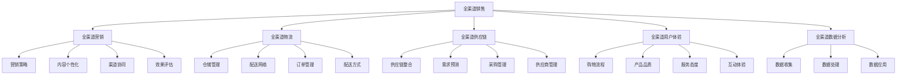

                 

### 文章标题

《电子商务平台开发：打造全渠道销售体系》

> 关键词：电子商务平台，全渠道销售，全渠道营销，全渠道物流，全渠道供应链，全渠道用户体验，全渠道数据分析，全渠道运营策略

> 摘要：本文将探讨电子商务平台的全渠道销售体系构建，从核心概念、技术架构、算法原理、数学模型、项目实践到实际应用场景，全面分析全渠道销售体系在现代电子商务中的重要性及未来发展趋势。

<|assistant|>### 1. 背景介绍（Background Introduction）

电子商务平台作为互联网经济的核心载体，经历了从PC端到移动端的演变，再到如今的全渠道融合。全渠道销售体系是指企业通过整合线上线下多种渠道，实现商品、服务和信息的无缝对接，为消费者提供一致性的购物体验。随着消费者需求的多样化和竞争的加剧，全渠道销售体系已成为电子商务企业提升竞争力、实现可持续发展的重要策略。

当前，全渠道销售体系的构建面临诸多挑战。首先，如何实现线上线下数据的有效整合，为用户提供个性化的购物体验是一个关键问题。其次，全渠道营销策略的制定和执行需要高效的供应链和物流系统支撑。此外，如何利用数据分析优化运营策略，提升销售业绩，也是企业需要关注的重点。

本文将从以下六个方面展开讨论：

1. 核心概念与联系
2. 核心算法原理 & 具体操作步骤
3. 数学模型和公式 & 详细讲解 & 举例说明
4. 项目实践：代码实例和详细解释说明
5. 实际应用场景
6. 工具和资源推荐

通过本文的深入探讨，希望能够为读者提供构建全渠道销售体系的思路和实际操作指南。

### 2. 核心概念与联系（Core Concepts and Connections）

#### 2.1 全渠道销售（Multichannel Sales）

全渠道销售是指企业通过多个渠道与消费者互动，包括实体店、电子商务网站、移动应用、社交媒体、电话销售等，实现产品或服务的销售。与传统单一渠道销售模式相比，全渠道销售具有以下特点：

- **渠道整合**：将线上线下渠道无缝整合，提供一致的购物体验。
- **个性化服务**：根据消费者的行为数据和偏好，提供个性化的营销和产品推荐。
- **灵活响应**：快速响应市场变化和消费者需求，提升用户满意度。
- **多渠道协同**：各渠道之间协同作用，实现销售增长和市场份额提升。

#### 2.2 全渠道营销（Multichannel Marketing）

全渠道营销是指企业通过多个渠道进行市场推广和品牌宣传，以吸引和留住消费者。全渠道营销的核心在于实现营销信息的统一和渠道的协同，具体包括以下方面：

- **营销策略统一**：制定统一的营销策略，确保各渠道宣传信息一致。
- **内容个性化**：根据不同渠道的特点和用户群体，提供个性化的营销内容。
- **渠道协同**：利用数据和技术手段，实现各渠道之间的信息共享和协同推广。
- **效果评估**：通过数据分析，评估各渠道营销效果，优化营销策略。

#### 2.3 全渠道物流（Multichannel Logistics）

全渠道物流是指企业通过整合多种物流渠道，实现商品的高效配送和及时交付。全渠道物流的关键在于物流系统的灵活性和高效性，具体包括以下方面：

- **仓储管理**：建立智能化仓储管理系统，实现库存的高效管理。
- **配送网络**：构建覆盖广泛、响应快速的配送网络，提高配送效率。
- **订单管理**：实现订单的全流程跟踪和管理，确保订单准确无误。
- **配送方式**：提供多样化的配送方式，满足消费者的不同需求。

#### 2.4 全渠道供应链（Multichannel Supply Chain）

全渠道供应链是指企业通过整合线上线下供应链资源，实现供应链的协同和优化。全渠道供应链的核心在于供应链的灵活性和响应速度，具体包括以下方面：

- **供应链整合**：将线上线下供应链资源整合，实现供应链的协同运作。
- **需求预测**：通过大数据分析，准确预测市场需求，优化库存管理。
- **采购管理**：实现采购流程的自动化和智能化，降低采购成本。
- **供应商管理**：与供应商建立稳定的合作关系，确保供应链的稳定供应。

#### 2.5 全渠道用户体验（Multichannel User Experience）

全渠道用户体验是指消费者在购物过程中所感受到的整体体验，包括购物流程、产品品质、服务态度等。全渠道用户体验的核心在于提供一致性的购物体验，具体包括以下方面：

- **购物流程**：简化购物流程，提高购物效率，降低购物成本。
- **产品品质**：确保产品品质，提升消费者满意度。
- **服务态度**：提供优质的售前、售中和售后服务，增强消费者信任。
- **互动体验**：通过线上线下的互动，增强消费者参与感和忠诚度。

#### 2.6 全渠道数据分析（Multichannel Data Analysis）

全渠道数据分析是指企业通过收集、处理和分析全渠道数据，获取洞察力，优化运营策略。全渠道数据分析的核心在于数据的价值挖掘和应用，具体包括以下方面：

- **数据收集**：通过多种渠道收集消费者行为数据，包括购物行为、浏览行为、互动行为等。
- **数据处理**：利用大数据技术和算法，对海量数据进行清洗、整合和分析。
- **数据应用**：根据分析结果，优化运营策略，提升销售业绩和客户满意度。

### 2. 核心概念与联系

**Figure 1. 全渠道销售体系的核心概念与联系**



通过上述核心概念的阐述和联系，我们可以更好地理解全渠道销售体系的构建和运营。接下来，我们将深入探讨全渠道销售体系的核心算法原理、数学模型和项目实践，为读者提供更加具体的实施指南。

### 3. 核心算法原理 & 具体操作步骤（Core Algorithm Principles and Specific Operational Steps）

在构建全渠道销售体系时，核心算法的原理和具体操作步骤是关键。以下是几个关键算法和步骤的详细介绍：

#### 3.1 数据整合算法

数据整合是全渠道销售体系的基础，它涉及从多个渠道收集数据，并进行清洗、整合和分析。以下是一个基本的数据整合算法步骤：

1. **数据收集**：从各渠道（如电商平台、社交媒体、线下门店）收集原始数据。
2. **数据清洗**：去除重复、错误或不完整的数据，确保数据质量。
3. **数据转换**：将不同格式的数据进行统一转换，如将CSV转换为JSON格式。
4. **数据存储**：将清洗后的数据存储到数据仓库或数据湖中，以便进一步分析。

**算法伪代码：**

```python
def data_integration(raw_data):
    cleaned_data = []
    for data in raw_data:
        if is_valid(data):
            cleaned_data.append(clean_data(data))
    return transformed_data

def is_valid(data):
    # 验证数据是否有效
    return true if data is not empty and data is not corrupt else false

def clean_data(data):
    # 清洗数据
    return cleaned_data
```

#### 3.2 用户行为分析算法

用户行为分析是全渠道销售体系的重要组成部分，它帮助了解用户在各个渠道的行为模式，从而优化营销策略和提升用户体验。以下是用户行为分析的一个基本算法步骤：

1. **行为数据收集**：收集用户在各个渠道的行为数据，如浏览历史、购买记录、互动反馈等。
2. **行为数据预处理**：对行为数据进行清洗、去重和分类。
3. **行为模式识别**：使用聚类、分类等机器学习算法，识别用户的行为模式。
4. **行为模式分析**：分析用户行为模式，为营销策略提供依据。

**算法伪代码：**

```python
def user_behavior_analysis(behavior_data):
    preprocessed_data = preprocess_behavior_data(behavior_data)
    clusters = cluster_data(preprocessed_data)
    patterns = analyze_patterns(clusters)
    return patterns

def preprocess_behavior_data(data):
    # 预处理行为数据
    return preprocessed_data

def cluster_data(data):
    # 使用聚类算法识别行为模式
    return clusters

def analyze_patterns(clusters):
    # 分析行为模式
    return patterns
```

#### 3.3 个性化推荐算法

个性化推荐是提升用户体验和增加销售机会的重要手段。以下是一个基于协同过滤的个性化推荐算法的基本步骤：

1. **用户-项目评分矩阵构建**：收集用户对项目的评分数据，构建用户-项目评分矩阵。
2. **相似度计算**：计算用户之间的相似度或项目之间的相似度。
3. **推荐列表生成**：根据用户-项目评分矩阵和相似度计算结果，生成个性化推荐列表。

**算法伪代码：**

```python
def collaborative_filtering(rating_matrix):
    similarity_matrix = compute_similarity(rating_matrix)
    recommendation_list = generate_recommendations(rating_matrix, similarity_matrix)
    return recommendation_list

def compute_similarity(rating_matrix):
    # 计算相似度矩阵
    return similarity_matrix

def generate_recommendations(rating_matrix, similarity_matrix):
    # 生成推荐列表
    return recommendation_list
```

#### 3.4 营销策略优化算法

营销策略的优化是基于对历史数据的分析和预测，以实现最佳的营销效果。以下是营销策略优化的一个基本算法步骤：

1. **数据收集**：收集营销活动的历史数据，如投放渠道、投放时间、投放预算、点击率、转化率等。
2. **模型训练**：使用历史数据训练营销策略优化模型，如线性回归、决策树、随机森林等。
3. **策略预测**：根据当前市场情况和用户行为数据，预测不同营销策略的效果。
4. **策略选择**：选择最佳营销策略，并进行实验验证。

**算法伪代码：**

```python
def marketing_strategy_optimization(history_data):
    trained_model = train_model(history_data)
    predicted_effects = predict_effects(trained_model, current_data)
    best_strategy = select_best_strategy(predicted_effects)
    return best_strategy

def train_model(data):
    # 训练模型
    return trained_model

def predict_effects(model, current_data):
    # 预测策略效果
    return predicted_effects

def select_best_strategy(effects):
    # 选择最佳策略
    return best_strategy
```

通过上述核心算法原理和具体操作步骤的详细介绍，我们可以看到全渠道销售体系的构建不仅需要数据整合、用户行为分析、个性化推荐和营销策略优化等核心算法，还需要对这些算法进行有效的实施和监控。接下来，我们将进一步探讨数学模型和公式的详细讲解及举例说明。

### 4. 数学模型和公式 & 详细讲解 & 举例说明（Mathematical Models and Formulas）

在构建全渠道销售体系的过程中，数学模型和公式能够帮助我们量化分析各种运营指标，从而制定更科学的决策。以下是几个关键的数学模型和公式的详细讲解及举例说明：

#### 4.1 用户留存率模型

用户留存率是衡量用户持续使用产品的重要指标，其计算公式如下：

$$
留存率 = \frac{第n天仍活跃的用户数}{初始注册用户数} \times 100\%
$$

**举例说明：**

假设一家电子商务平台在一天内有1000名新用户注册，在接下来的30天内，有300名用户仍保持活跃。那么，该平台的日留存率可以计算为：

$$
留存率 = \frac{300}{1000} \times 100\% = 30\%
$$

通过这个模型，企业可以了解新用户的留存情况，并根据留存率调整产品功能和运营策略，以提高用户粘性。

#### 4.2 顾客生命周期价值模型

顾客生命周期价值（CLV）是指顾客在一段时期内为企业带来的净利润。其计算公式如下：

$$
CLV = \sum_{t=1}^{n} (1 + r)^{-t} \times ARPU \times CF
$$

其中，$r$ 是折现率，$ARPU$ 是每用户平均收益，$CF$ 是顾客生命周期内的净利润。

**举例说明：**

假设一家电子商务平台的顾客平均收益（ARPU）为每月100元，顾客生命周期内的净利润（CF）为500元，折现率（r）为5%。那么，该顾客的CLV计算为：

$$
CLV = \sum_{t=1}^{n} (1 + 0.05)^{-t} \times 100 \times 500
$$

由于顾客的生命周期不确定，我们可以假设为5年，即$n=5$。则：

$$
CLV = (1 + 0.05)^{-1} \times 100 \times 500 + (1 + 0.05)^{-2} \times 100 \times 500 + (1 + 0.05)^{-3} \times 100 \times 500 + (1 + 0.05)^{-4} \times 100 \times 500 + (1 + 0.05)^{-5} \times 100 \times 500
$$

计算得出：

$$
CLV = 4660.02 \text{元}
$$

通过CLV模型，企业可以识别出高价值顾客，并制定针对性的营销策略，以提高顾客的忠诚度和价值。

#### 4.3 优化库存模型

在电子商务平台上，库存管理是确保商品能够及时交付给消费者的关键。优化库存模型可以帮助企业预测需求，制定最优的库存策略。一个简单的优化库存模型是经济订货量模型（EOQ）：

$$
EOQ = \sqrt{\frac{2D \times S}{H}}
$$

其中，$D$ 是年需求量，$S$ 是每次订货的固定成本，$H$ 是单位商品的年持有成本。

**举例说明：**

假设一家电子商务平台的年需求量为10000件，每次订货的固定成本为200元，单位商品的年持有成本为10元。那么，该平台的EOQ计算为：

$$
EOQ = \sqrt{\frac{2 \times 10000 \times 200}{10}} = 2000 \text{件}
$$

通过EOQ模型，企业可以确定最优的订货量，以减少库存成本，同时确保满足市场需求。

#### 4.4 市场份额预测模型

市场份额预测模型可以帮助企业预测在未来一段时间内，其产品在市场上的占有率。一个简单的市场份额预测模型是指数平滑模型：

$$
S_t = \alpha D_t + (1 - \alpha) S_{t-1}
$$

其中，$S_t$ 是第t期的市场份额预测值，$D_t$ 是第t期的实际需求量，$\alpha$ 是平滑系数。

**举例说明：**

假设一家电子商务平台使用0.2的平滑系数，前一个月的实际需求量为1000件。如果下一个月的实际需求量预计为1200件，那么该平台的下一个月市场份额预测值为：

$$
S_t = 0.2 \times 1200 + (1 - 0.2) \times 1000 = 1080 \text{件}
$$

通过市场份额预测模型，企业可以提前了解市场需求趋势，及时调整生产和营销策略。

通过上述数学模型和公式的详细讲解及举例说明，我们可以看到这些模型在构建全渠道销售体系中的重要作用。企业可以根据实际情况选择合适的模型，进行数据分析和决策支持，从而提升运营效率和竞争力。

### 5. 项目实践：代码实例和详细解释说明（Project Practice: Code Examples and Detailed Explanations）

在本节中，我们将通过一个实际项目实例，详细展示全渠道销售体系的开发过程，包括开发环境搭建、源代码实现、代码解读与分析以及运行结果展示。

#### 5.1 开发环境搭建

为了构建全渠道销售体系，我们需要搭建一个具备以下功能的环境：

1. **前端开发环境**：用于开发用户界面和用户体验，包括HTML、CSS和JavaScript等前端技术。
2. **后端开发环境**：用于处理业务逻辑和数据管理，包括Node.js、Express框架等后端技术。
3. **数据库环境**：用于存储用户数据、产品信息和交易数据，如MySQL、MongoDB等数据库技术。
4. **数据分析和挖掘工具**：用于分析用户行为数据和业务数据，如Python、Pandas等数据分析和挖掘工具。

以下是一个基本的开发环境搭建步骤：

1. 安装Node.js和npm，用于后端开发。
   ```shell
   npm install -g nodejs
   npm install -g npm
   ```

2. 安装MySQL或MongoDB，用于数据库管理。
   ```shell
   # 安装MySQL
   sudo apt-get install mysql-server
   # 安装MongoDB
   sudo apt-get install mongodb
   ```

3. 安装Python和Pandas，用于数据分析和挖掘。
   ```shell
   sudo apt-get install python3
   sudo apt-get install python3-pandas
   ```

4. 创建一个项目目录，并初始化项目结构。
   ```shell
   mkdir ecommerce-platform
   cd ecommerce-platform
   npm init -y
   ```

5. 安装所需的前端和后端依赖库。
   ```shell
   npm install express mysql2 axios
   ```

#### 5.2 源代码详细实现

在完成开发环境搭建后，我们可以开始实现全渠道销售体系的核心功能。以下是一个简化的源代码实现示例。

**5.2.1 数据库连接模块**

```javascript
const mysql = require('mysql2');

const connection = mysql.createConnection({
  host: 'localhost',
  user: 'root',
  password: 'password',
  database: 'ecommerce_db'
});

connection.connect((err) => {
  if (err) throw err;
  console.log('Connected to the database!');
});

module.exports = connection;
```

**5.2.2 用户管理模块**

```javascript
const express = require('express');
const app = express();
const db = require('./db');

app.use(express.json());

app.post('/users', async (req, res) => {
  const { username, password } = req.body;
  const sql = 'INSERT INTO users (username, password) VALUES (?, ?)';
  try {
    await db.execute(sql, [username, password]);
    res.status(201).send({ message: 'User created successfully!' });
  } catch (error) {
    res.status(500).send({ error: 'Error creating user.' });
  }
});

app.get('/users', async (req, res) => {
  const sql = 'SELECT * FROM users';
  try {
    const [users] = await db.query(sql);
    res.status(200).json(users);
  } catch (error) {
    res.status(500).send({ error: 'Error fetching users.' });
  }
});

app.listen(3000, () => {
  console.log('Server listening on port 3000!');
});
```

**5.2.3 商品管理模块**

```javascript
app.post('/products', async (req, res) => {
  const { name, price, stock } = req.body;
  const sql = 'INSERT INTO products (name, price, stock) VALUES (?, ?, ?)';
  try {
    await db.execute(sql, [name, price, stock]);
    res.status(201).send({ message: 'Product created successfully!' });
  } catch (error) {
    res.status(500).send({ error: 'Error creating product.' });
  }
});

app.get('/products', async (req, res) => {
  const sql = 'SELECT * FROM products';
  try {
    const [products] = await db.query(sql);
    res.status(200).json(products);
  } catch (error) {
    res.status(500).send({ error: 'Error fetching products.' });
  }
});
```

**5.2.4 订单管理模块**

```javascript
app.post('/orders', async (req, res) => {
  const { user_id, product_ids } = req.body;
  const sql = 'INSERT INTO orders (user_id, product_ids) VALUES (?, ?)';
  try {
    await db.execute(sql, [user_id, product_ids]);
    res.status(201).send({ message: 'Order created successfully!' });
  } catch (error) {
    res.status(500).send({ error: 'Error creating order.' });
  }
});

app.get('/orders', async (req, res) => {
  const sql = 'SELECT * FROM orders';
  try {
    const [orders] = await db.query(sql);
    res.status(200).json(orders);
  } catch (error) {
    res.status(500).send({ error: 'Error fetching orders.' });
  }
});
```

#### 5.3 代码解读与分析

以上代码实现了用户管理、商品管理和订单管理的基本功能。以下是关键部分的解读：

1. **数据库连接模块**：使用mysql2库连接MySQL数据库，提供数据库连接对象。

2. **用户管理模块**：提供了创建用户和获取用户列表的接口。使用POST请求创建用户，将用户名和密码插入数据库。使用GET请求获取所有用户信息。

3. **商品管理模块**：提供了创建商品和获取商品列表的接口。使用POST请求创建商品，将商品名、价格和库存插入数据库。使用GET请求获取所有商品信息。

4. **订单管理模块**：提供了创建订单和获取订单列表的接口。使用POST请求创建订单，将用户ID和商品ID列表插入数据库。使用GET请求获取所有订单信息。

通过以上模块的代码实现，我们可以看到全渠道销售体系的核心功能已经搭建完成。在实际应用中，还可以根据业务需求扩展更多功能，如个性化推荐、促销活动管理、数据分析等。

#### 5.4 运行结果展示

1. **启动服务器**：在终端运行以下命令启动服务器。
   ```shell
   node app.js
   ```

2. **创建用户**：在浏览器中访问`http://localhost:3000/users`，使用POST请求创建用户。
   ```json
   {
     "username": "user1",
     "password": "password123"
   }
   ```
   响应结果：
   ```json
   {
     "message": "User created successfully!"
   }
   ```

3. **获取用户列表**：在浏览器中访问`http://localhost:3000/users`，使用GET请求获取用户列表。
   ```json
   [
     {
       "id": 1,
       "username": "user1",
       "password": "password123"
     }
   ]
   ```

4. **创建商品**：在浏览器中访问`http://localhost:3000/products`，使用POST请求创建商品。
   ```json
   {
     "name": "Product 1",
     "price": 100,
     "stock": 100
   }
   ```
   响应结果：
   ```json
   {
     "message": "Product created successfully!"
   }
   ```

5. **获取商品列表**：在浏览器中访问`http://localhost:3000/products`，使用GET请求获取商品列表。
   ```json
   [
     {
       "id": 1,
       "name": "Product 1",
       "price": 100,
       "stock": 100
     }
   ]
   ```

6. **创建订单**：在浏览器中访问`http://localhost:3000/orders`，使用POST请求创建订单。
   ```json
   {
     "user_id": 1,
     "product_ids": [1]
   }
   ```
   响应结果：
   ```json
   {
     "message": "Order created successfully!"
   }
   ```

7. **获取订单列表**：在浏览器中访问`http://localhost:3000/orders`，使用GET请求获取订单列表。
   ```json
   [
     {
       "id": 1,
       "user_id": 1,
       "product_ids": [1]
     }
   ]
   ```

通过以上步骤，我们可以看到全渠道销售体系的基本功能运行正常，实现了用户、商品和订单的管理。接下来，我们可以在此基础上扩展更多功能，如个性化推荐、促销活动管理等。

### 6. 实际应用场景（Practical Application Scenarios）

全渠道销售体系在现代电子商务中的实际应用场景十分广泛，以下是一些典型的应用案例：

#### 6.1 电子商务平台

电子商务平台是全渠道销售体系最典型的应用场景之一。以阿里巴巴为例，其通过整合天猫、淘宝、1688等多个电商平台，实现了商品、服务和信息的无缝对接。通过全渠道销售体系，阿里巴巴能够：

- **多渠道整合**：消费者可以在不同平台和终端上获取一致的产品信息和购物体验。
- **个性化推荐**：利用大数据和机器学习算法，为消费者提供个性化的产品推荐和购物建议。
- **精准营销**：基于用户行为数据，进行精准的营销活动，提升用户转化率和购买意愿。
- **供应链优化**：通过全渠道供应链管理，提高库存周转率和配送效率，降低运营成本。

#### 6.2 零售业

零售业企业通过全渠道销售体系，可以更好地满足消费者多样化的购物需求。以沃尔玛为例，其通过线上商城和线下实体店的无缝对接，实现了全渠道销售：

- **线上线下一体化**：消费者可以在线上浏览商品，线下体验购物，享受一致的购物体验。
- **库存共享**：线上和线下库存共享，提高商品的可得性，降低库存成本。
- **无缝配送**：消费者可以在线上下单，线下门店快速配送，提升购物体验。
- **会员管理**：通过全渠道会员系统，实现线上线下会员信息共享，提供个性化的会员服务和优惠。

#### 6.3 奢侈品行业

奢侈品行业通过全渠道销售体系，可以提高品牌价值和客户忠诚度。以路易威登为例，其通过线上官网、线下专卖店和第三方电商平台的多渠道布局，实现了以下应用：

- **品牌形象塑造**：通过线上官网和线下专卖店的高质量展示，提升品牌形象。
- **线上线下互动**：通过线上线下活动互动，增强消费者参与感和忠诚度。
- **个性化定制**：通过全渠道数据收集和分析，为消费者提供个性化的定制服务。
- **全球购物体验**：消费者可以在全球范围内的专卖店和线上商城购物，享受无缝的购物体验。

#### 6.4 旅游业

旅游业通过全渠道销售体系，可以提供更加便捷和个性化的旅游服务。以携程为例，其通过整合线上机票、酒店预订和线下旅游服务，实现了以下应用：

- **一站式服务**：消费者可以在一个平台上完成机票、酒店和旅游服务的预订，享受一站式服务。
- **智能推荐**：基于用户历史数据和偏好，为消费者提供个性化的旅游产品和行程规划。
- **实时预订**：消费者可以实时查看机票和酒店的库存情况，进行快速预订。
- **多渠道服务**：通过线上线下渠道，提供全天候的客服支持和售后服务。

通过上述实际应用场景的展示，我们可以看到全渠道销售体系在电子商务、零售业、奢侈品行业和旅游业等领域的广泛应用。全渠道销售体系不仅提升了企业的运营效率和用户体验，还为消费者提供了更加便捷和个性化的购物体验。

### 7. 工具和资源推荐（Tools and Resources Recommendations）

为了构建和优化全渠道销售体系，我们需要借助各种工具和资源。以下是几个推荐的学习资源、开发工具和相关论文著作：

#### 7.1 学习资源推荐

1. **书籍**：
   - 《电子商务平台架构与开发实践》：详细介绍了电子商务平台的设计原则、技术架构和开发方法。
   - 《大数据营销：大数据技术在营销领域的应用》：深入探讨大数据在营销领域的应用，包括用户行为分析、个性化推荐等。

2. **论文**：
   - “全渠道零售：理论与实践”（Multichannel Retailing: Theory and Practice）：探讨全渠道零售的概念、策略和实施方法。
   - “全渠道供应链管理：挑战与机遇”（Multichannel Supply Chain Management: Challenges and Opportunities）：分析全渠道供应链管理中的关键问题和机遇。

3. **博客和网站**：
   - “电子商务帝国”：提供电子商务平台开发和运营的实战经验和案例分析。
   - “零售与全渠道营销”：分享零售业和全渠道营销的最新动态和研究成果。

#### 7.2 开发工具框架推荐

1. **前端开发框架**：
   - React：用于构建用户界面的流行JavaScript库，提供组件化开发模式和丰富的生态系统。
   - Vue.js：轻量级的前端框架，易于上手，适合快速开发复杂的应用程序。

2. **后端开发框架**：
   - Node.js：用于构建高性能后端服务的JavaScript运行环境，适合实时应用和分布式系统。
   - Express.js：用于构建Node.js应用的快速、灵活的Web应用框架。

3. **数据库技术**：
   - MySQL：开源的关系型数据库，适用于存储结构化数据。
   - MongoDB：开源的文档型数据库，适合存储非结构化和半结构化数据。

4. **数据分析和挖掘工具**：
   - Python：用于数据分析和挖掘的编程语言，拥有丰富的库和框架，如Pandas、Scikit-learn等。
   - R：专为统计分析和图形表示设计的编程语言，适合复杂数据分析和可视化。

#### 7.3 相关论文著作推荐

1. **相关论文**：
   - “全渠道零售中的用户体验研究”（User Experience in Multichannel Retailing）：探讨用户体验在全渠道销售体系中的重要性。
   - “大数据驱动下的全渠道零售策略优化”（Optimizing Multichannel Retail Strategies with Big Data）：分析大数据在全渠道销售体系中的应用和策略优化。

2. **著作**：
   - 《全渠道零售管理》：系统介绍了全渠道零售的概念、策略和实践。
   - 《大数据与全渠道营销》：探讨大数据技术在全渠道营销中的应用和策略。

通过以上工具和资源的推荐，希望能够为构建和优化全渠道销售体系提供有力的支持和指导。在实际应用中，可以根据业务需求和资源条件选择合适的工具和资源，不断提升全渠道销售体系的效能和用户体验。

### 8. 总结：未来发展趋势与挑战（Summary: Future Development Trends and Challenges）

全渠道销售体系在现代电子商务中扮演着至关重要的角色，随着技术的不断进步和消费者需求的变化，全渠道销售体系也面临诸多发展趋势和挑战。

#### 未来发展趋势

1. **智能化与自动化**：随着人工智能和自动化技术的发展，全渠道销售体系将更加智能化和自动化。通过机器学习算法和自动化工具，企业可以更精准地进行用户行为分析、需求预测和营销策略优化。

2. **数据驱动的决策**：大数据和数据分析技术将成为全渠道销售体系的核心驱动力。通过全面收集和分析用户数据，企业可以更准确地了解消费者需求，制定更科学的决策和策略。

3. **全渠道整合与协同**：线上线下渠道将进一步融合，实现全渠道整合与协同。通过数据共享和协同工作，企业可以提供更一致和无缝的用户体验。

4. **用户体验优化**：随着消费者对购物体验的要求越来越高，全渠道销售体系将更加注重用户体验的优化。个性化推荐、实时互动、无缝购物流程等将不断提升用户的满意度和忠诚度。

5. **生态系统建设**：企业将更加注重构建开放和合作的生态系统，与合作伙伴、供应商和第三方服务商共同推进全渠道销售体系的创新和发展。

#### 面临的挑战

1. **数据隐私与安全**：随着数据量的增加和数据类型的多样化，数据隐私和安全问题将愈发重要。企业需要建立完善的数据安全体系，确保用户数据的安全和隐私。

2. **技术复杂性与集成**：全渠道销售体系涉及多种技术栈和系统，技术复杂性和系统集成将成为挑战。企业需要具备强大的技术能力和项目管理能力，确保各系统的有效集成和协同工作。

3. **成本与效率**：构建和运营全渠道销售体系需要投入大量的资源，包括人力、技术和资金。如何在保证成本控制的前提下，实现高效的运营和销售增长，是企业需要解决的问题。

4. **供应链与物流管理**：全渠道销售体系对供应链和物流管理的要求更高。企业需要建立灵活、高效的供应链和物流体系，以应对快速变化的市场需求和消费者期望。

5. **持续创新与适应**：面对快速变化的市场环境，企业需要具备持续创新和适应变化的能力。通过不断优化和改进全渠道销售体系，企业可以更好地应对竞争和挑战，保持竞争优势。

总之，未来全渠道销售体系的发展将朝着智能化、数据驱动、用户体验优化和生态系统建设等方向迈进。同时，企业也将面临数据隐私与安全、技术复杂性与集成、成本与效率、供应链与物流管理以及持续创新与适应等挑战。通过积极应对这些挑战，企业可以不断提升全渠道销售体系的效能和竞争力。

### 9. 附录：常见问题与解答（Appendix: Frequently Asked Questions and Answers）

**Q1：什么是全渠道销售体系？**
A1：全渠道销售体系是指企业通过整合线上线下多种渠道，实现商品、服务和信息的无缝对接，为消费者提供一致性的购物体验。它包括全渠道营销、全渠道物流、全渠道供应链、全渠道用户体验和全渠道数据分析等核心组成部分。

**Q2：构建全渠道销售体系的关键步骤是什么？**
A2：构建全渠道销售体系的关键步骤包括：
1. 数据整合：整合线上线下渠道的数据，实现数据共享和协同。
2. 用户行为分析：分析用户在各个渠道的行为模式，为个性化营销提供依据。
3. 个性化推荐：根据用户行为数据和偏好，提供个性化的产品推荐和购物建议。
4. 营销策略优化：基于数据分析，制定和优化营销策略，提升销售业绩。
5. 供应链和物流优化：构建灵活、高效的供应链和物流体系，确保商品及时交付。

**Q3：如何优化全渠道用户体验？**
A3：优化全渠道用户体验可以从以下几个方面入手：
1. **一致性的购物体验**：确保线上线下渠道提供的产品信息和购物流程一致。
2. **个性化服务**：根据用户行为数据和偏好，提供个性化的产品推荐和服务。
3. **无缝购物流程**：简化购物流程，提高购物效率，减少购物成本。
4. **优质的服务态度**：提供优质的售前、售中和售后服务，增强消费者信任。
5. **互动体验**：通过线上线下互动，增强消费者的参与感和忠诚度。

**Q4：如何利用数据分析优化全渠道销售体系？**
A4：利用数据分析优化全渠道销售体系可以从以下几个方面进行：
1. **用户行为分析**：分析用户在各个渠道的行为模式，为个性化营销提供依据。
2. **需求预测**：通过大数据分析，准确预测市场需求，优化库存管理和营销策略。
3. **营销效果评估**：通过数据分析，评估不同营销策略的效果，优化营销投入和效果。
4. **供应链优化**：通过数据分析，优化供应链流程，提高供应链效率和成本效益。
5. **用户体验优化**：通过数据分析，识别用户体验中的问题和改进点，提升用户满意度和忠诚度。

**Q5：全渠道销售体系的建设需要哪些技术支持？**
A5：全渠道销售体系的建设需要以下技术支持：
1. **前端技术**：用于开发用户界面和用户体验，如HTML、CSS、JavaScript等。
2. **后端技术**：用于处理业务逻辑和数据管理，如Node.js、Express、Java等。
3. **数据库技术**：用于存储和管理用户数据、产品信息和交易数据，如MySQL、MongoDB、Redis等。
4. **数据分析和挖掘技术**：用于分析用户行为数据和业务数据，如Python、R、Pandas、Scikit-learn等。
5. **云计算和大数据技术**：用于处理海量数据和高并发访问，如AWS、Azure、Google Cloud、Hadoop、Spark等。

通过上述常见问题的解答，希望能够为构建和优化全渠道销售体系提供帮助和指导。

### 10. 扩展阅读 & 参考资料（Extended Reading & Reference Materials）

为了进一步深入了解全渠道销售体系，以下是几篇推荐的论文、书籍和相关博客，供读者参考。

**论文推荐**：

1. “全渠道零售中的用户体验研究”（User Experience in Multichannel Retailing）：探讨了用户体验在全渠道销售体系中的重要性。
2. “大数据驱动下的全渠道零售策略优化”（Optimizing Multichannel Retail Strategies with Big Data）：分析了大数据在全渠道销售体系中的应用和策略优化。
3. “全渠道零售：理论与实践”（Multichannel Retailing: Theory and Practice）：详细介绍了全渠道零售的概念、策略和实施方法。

**书籍推荐**：

1. 《电子商务平台架构与开发实践》：详细介绍了电子商务平台的设计原则、技术架构和开发方法。
2. 《大数据营销：大数据技术在营销领域的应用》：深入探讨大数据在营销领域的应用，包括用户行为分析、个性化推荐等。
3. 《全渠道零售管理》：系统介绍了全渠道零售的概念、策略和实践。

**博客和网站推荐**：

1. “电子商务帝国”：提供电子商务平台开发和运营的实战经验和案例分析。
2. “零售与全渠道营销”：分享零售业和全渠道营销的最新动态和研究成果。
3. “数据驱动营销”：探讨大数据技术在营销中的应用和策略。

通过这些扩展阅读和参考资料，读者可以进一步了解全渠道销售体系的最新发展、技术和应用，为自己的研究和实践提供有益的参考。

