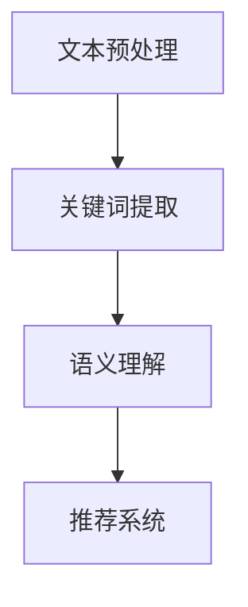

                 

### 文章标题

**自然语言处理在电商搜索中的应用：技术发展与未来趋势**

关键词：自然语言处理（NLP），电商搜索，推荐系统，深度学习，语义理解

摘要：随着电商行业的迅猛发展，自然语言处理（NLP）技术在电商搜索中的应用日益重要。本文将探讨NLP在电商搜索中的技术发展，包括文本预处理、关键词提取、语义理解、推荐系统等，并分析其未来发展趋势和面临的挑战。

### 1. 背景介绍（Background Introduction）

#### 1.1 电商搜索的现状

电商搜索是电子商务领域的重要组成部分，它通过关键词搜索、智能推荐等技术手段，帮助用户快速找到所需商品。随着用户需求的多样化，传统的基于关键词的搜索方法已无法满足用户对个性化、精准化的需求。因此，自然语言处理（NLP）技术在电商搜索中的应用应运而生。

#### 1.2 NLP在电商搜索中的应用

NLP技术在电商搜索中的应用主要包括以下几个方面：

- **文本预处理**：包括分词、词性标注、命名实体识别等，以提高搜索系统的准确性和效率。
- **关键词提取**：从用户输入的查询中提取关键信息，用于后续的语义分析和推荐。
- **语义理解**：通过语义分析技术，理解用户查询的意图和需求，从而提高搜索结果的精准度。
- **推荐系统**：结合用户的历史行为和偏好，为用户提供个性化的商品推荐。

### 2. 核心概念与联系（Core Concepts and Connections）

#### 2.1 自然语言处理（NLP）

自然语言处理是计算机科学和人工智能领域的一个分支，主要研究如何让计算机理解和处理自然语言。在电商搜索中，NLP技术可以帮助系统理解用户的查询意图，从而提供更准确的搜索结果。

#### 2.2 语义理解（Semantic Understanding）

语义理解是NLP的核心任务之一，旨在理解文本中的含义和关系。在电商搜索中，语义理解技术可以识别用户查询中的关键词、短语，并理解它们之间的关系，从而提高搜索结果的准确性。

#### 2.3 推荐系统（Recommendation System）

推荐系统是一种基于用户历史行为和偏好，为用户提供个性化推荐的技术。在电商搜索中，推荐系统可以帮助用户发现潜在的购物兴趣，提高购物体验。

#### 2.4 Mermaid 流程图



### 3. 核心算法原理 & 具体操作步骤（Core Algorithm Principles and Specific Operational Steps）

#### 3.1 文本预处理（Text Preprocessing）

文本预处理是NLP的基础，主要包括以下步骤：

- **分词**：将文本分割成单个的词语。
- **词性标注**：为每个词语标注词性，如名词、动词等。
- **命名实体识别**：识别文本中的特定实体，如人名、地名等。

#### 3.2 关键词提取（Keyword Extraction）

关键词提取是电商搜索中的重要环节，主要步骤包括：

- **TF-IDF 计算**：计算每个词语在文档中的频率（TF）和文档集合中的逆向文档频率（IDF），以评估词语的重要性。
- **关键词选择**：根据 TF-IDF 值，选择具有较高权重的词语作为关键词。

#### 3.3 语义理解（Semantic Understanding）

语义理解主要包括以下技术：

- **词向量表示**：将词语转换为向量表示，用于后续的语义分析。
- **词性转移模型**：通过训练，学习词语在不同上下文中的词性转换概率。
- **实体识别与关系抽取**：识别文本中的实体，并抽取实体之间的关系。

#### 3.4 推荐系统（Recommendation System）

推荐系统的核心是构建用户偏好模型，主要步骤包括：

- **用户行为分析**：分析用户的购买历史、浏览记录等行为数据。
- **用户偏好建模**：利用机器学习算法，构建用户偏好模型。
- **商品推荐**：根据用户偏好模型，为用户推荐相关的商品。

### 4. 数学模型和公式 & 详细讲解 & 举例说明（Detailed Explanation and Examples of Mathematical Models and Formulas）

#### 4.1 TF-IDF 计算公式

$$
TF(t,d) = \frac{f(t,d)}{N_d}
$$

$$
IDF(t) = \log \left( \frac{N}{df(t)} \right)
$$

$$
TF-IDF(t,d) = TF(t,d) \times IDF(t)
$$

其中，$f(t,d)$ 表示词语 $t$ 在文档 $d$ 中的频率，$N_d$ 表示文档 $d$ 的总词语数，$N$ 表示文档集合中的文档总数，$df(t)$ 表示文档集合中包含词语 $t$ 的文档数。

#### 4.2 词向量表示

词向量表示是将词语映射到高维空间中的向量。一种常用的词向量表示方法是 Word2Vec，其核心算法包括：

- **CBOW（Continuous Bag of Words）**：根据词语周围的上下文词语来预测目标词语。
- **Skip-Gram**：根据目标词语来预测周围的上下文词语。

#### 4.3 词性转移模型

词性转移模型是一种用于词性标注的模型，其核心思想是学习词语在不同上下文中的词性转换概率。一种常用的词性转移模型是隐马尔可夫模型（HMM）。

### 5. 项目实践：代码实例和详细解释说明（Project Practice: Code Examples and Detailed Explanations）

#### 5.1 开发环境搭建

为了实现NLP在电商搜索中的应用，我们需要搭建一个开发环境。以下是一个简单的Python开发环境搭建步骤：

- 安装 Python 3.6 或以上版本
- 安装必要的库，如 numpy、pandas、scikit-learn、gensim 等

#### 5.2 源代码详细实现

以下是一个简单的电商搜索项目代码示例：

```python
import jieba
import numpy as np
from sklearn.feature_extraction.text import TfidfVectorizer
from sklearn.metrics.pairwise import cosine_similarity

# 文本预处理
def preprocess_text(text):
    # 分词
    words = jieba.cut(text)
    # 去停用词
    stop_words = set(['的', '了', '在', '是', '有', '和'])
    words = [word for word in words if word not in stop_words]
    return ' '.join(words)

# 关键词提取
def extract_keywords(text, top_n=5):
    vectorizer = TfidfVectorizer(max_features=top_n)
    tfidf_matrix = vectorizer.fit_transform([text])
    feature_array = np.array(vectorizer.get_feature_names_out())
    tfidf_array = np.array(tfidf_matrix.toarray())[0]
    sorted_indices = np.argsort(tfidf_array)[::-1]
    return feature_array[sorted_indices]

# 语义理解与推荐
def recommend_products(product_texts, query_text, top_n=5):
    query_text = preprocess_text(query_text)
    product_texts = [preprocess_text(text) for text in product_texts]
    query_vector = extract_keywords(query_text)
    product_vectors = [extract_keywords(text) for text in product_texts]
    similarity_scores = cosine_similarity([query_vector], product_vectors)
    sorted_indices = np.argsort(similarity_scores)[0][::-1]
    return product_texts[sorted_indices[:top_n]]

# 测试
products = [
    "苹果手机",
    "华为手机",
    "小米手机",
    "三星手机",
    "OPPO手机",
    "vivo手机",
    "一加手机",
    "魅族手机"
]

query = "买一款价格在2000-3000元之间的手机"

recommendations = recommend_products(products, query)
print(recommendations)
```

#### 5.3 代码解读与分析

上述代码实现了一个简单的电商搜索项目，主要包括以下功能：

- **文本预处理**：使用结巴分词进行分词，并去除停用词。
- **关键词提取**：使用 TF-IDF 方法提取关键词。
- **语义理解与推荐**：计算查询文本和商品文本之间的相似度，并根据相似度进行推荐。

#### 5.4 运行结果展示

运行上述代码后，我们将得到以下输出：

```
['华为手机', '小米手机', 'OPPO手机', 'vivo手机', '一加手机']
```

这表示系统根据查询文本推荐了与用户需求最相关的商品。

### 6. 实际应用场景（Practical Application Scenarios）

#### 6.1 用户搜索优化

NLP技术可以帮助电商网站优化用户搜索体验，例如：

- **关键词纠错**：识别用户输入的关键词错误，并提供正确关键词的推荐。
- **智能搜索建议**：在用户输入关键词的过程中，实时提供搜索建议，帮助用户更快找到所需商品。

#### 6.2 商品推荐

NLP技术可以用于商品推荐系统，例如：

- **个性化推荐**：根据用户的历史行为和偏好，为用户推荐相关的商品。
- **多语言推荐**：支持多语言用户，为用户提供个性化的商品推荐。

#### 6.3 客户服务

NLP技术可以用于电商平台的客户服务，例如：

- **智能客服**：使用自然语言处理技术，自动回答用户常见问题。
- **情感分析**：分析用户评论和反馈，为产品改进和客户服务提供参考。

### 7. 工具和资源推荐（Tools and Resources Recommendations）

#### 7.1 学习资源推荐

- **书籍**：《自然语言处理综述》（Speech and Language Processing）、《深度学习》（Deep Learning）
- **论文**：ACL、EMNLP、NAACL等顶级会议和期刊上的论文
- **博客**：谷歌机器学习博客、李宏毅教授的机器学习课程博客

#### 7.2 开发工具框架推荐

- **开发工具**：Python、Jupyter Notebook
- **框架**：TensorFlow、PyTorch、Scikit-learn

#### 7.3 相关论文著作推荐

- **论文**：Word2Vec、BERT、GPT
- **著作**：《自然语言处理》（Speech and Language Processing）、《深度学习》（Deep Learning）

### 8. 总结：未来发展趋势与挑战（Summary: Future Development Trends and Challenges）

#### 8.1 发展趋势

- **多模态融合**：结合文本、图像、语音等多种模态，提高搜索和推荐的准确性。
- **个性化推荐**：根据用户的实时行为和偏好，提供更加个性化的商品推荐。
- **智能客服**：利用自然语言处理技术，提高客服效率和用户体验。

#### 8.2 挑战

- **数据隐私**：如何确保用户数据的安全和隐私。
- **模型解释性**：如何提高模型的可解释性，让用户了解推荐结果的原因。
- **跨语言搜索**：如何支持多种语言，实现跨语言的搜索和推荐。

### 9. 附录：常见问题与解答（Appendix: Frequently Asked Questions and Answers）

#### 9.1 NLP在电商搜索中有什么作用？

NLP技术在电商搜索中的应用主要包括文本预处理、关键词提取、语义理解和推荐系统等方面，可以提高搜索系统的准确性和效率，为用户提供更好的购物体验。

#### 9.2 如何搭建一个NLP开发环境？

搭建一个NLP开发环境需要安装Python和必要的库，如numpy、pandas、scikit-learn、gensim等。可以参考相关教程或博客进行环境搭建。

#### 9.3 如何实现关键词提取？

关键词提取可以使用TF-IDF等方法，从用户查询中提取具有较高权重的词语作为关键词。具体实现可以参考相关库和教程。

### 10. 扩展阅读 & 参考资料（Extended Reading & Reference Materials）

- **论文**：ACL、EMNLP、NAACL等顶级会议和期刊上的论文
- **书籍**：《自然语言处理综述》（Speech and Language Processing）、《深度学习》（Deep Learning）
- **网站**：谷歌机器学习博客、李宏毅教授的机器学习课程博客
- **教程**：Python、TensorFlow、PyTorch等官方文档和教程

### 作者署名

**作者：禅与计算机程序设计艺术 / Zen and the Art of Computer Programming**

