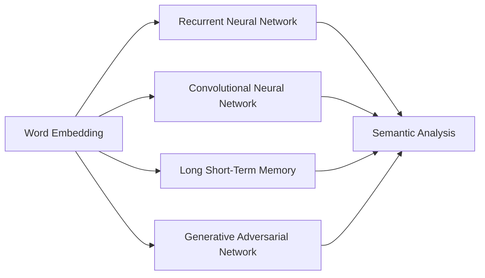
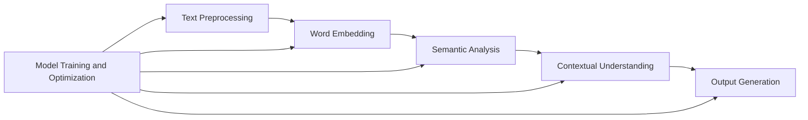

                 

### 文章标题：自然语言的解码详细过程

在当今技术飞速发展的时代，自然语言处理（NLP）已成为计算机科学和人工智能领域的重要分支。自然语言的解码过程，即理解和生成自然语言的过程，是实现人机交互的关键。本文将深入探讨自然语言的解码详细过程，包括核心概念、算法原理、数学模型、代码实例等。通过本文的逐步分析，读者将全面了解自然语言解码的奥秘。

### 关键词：自然语言处理、解码、算法原理、数学模型、代码实例

### 摘要：

本文旨在详细阐述自然语言的解码过程，从核心概念到算法原理，再到数学模型和代码实例，全面解析自然语言解码的各个环节。通过本文的学习，读者将对自然语言处理技术有更深入的理解，为未来的研究和应用打下坚实基础。

### 文章正文部分

#### 1. 背景介绍（Background Introduction）

自然语言是人类沟通的主要方式，但长期以来，让计算机理解和生成自然语言一直是一个巨大的挑战。随着人工智能技术的不断发展，自然语言处理（NLP）逐渐成为可能。自然语言的解码过程涉及理解文本的含义、语法和上下文，从而实现人与机器的有效沟通。

自然语言的解码主要包括以下几个步骤：

1. **文本预处理**：包括分词、去停用词、词干提取等，将原始文本转换为结构化的数据。
2. **语义分析**：通过词性标注、句法分析等技术，理解文本的语义和结构。
3. **语境理解**：结合上下文信息，对文本进行更加精细的分析，以获取更准确的语义。
4. **生成输出**：根据解码结果，生成符合语义和语法规则的输出。

#### 2. 核心概念与联系（Core Concepts and Connections）

在自然语言解码过程中，以下几个核心概念至关重要：

1. **词向量表示**：将单词映射为密集向量的过程，有助于捕获单词的语义信息。
2. **递归神经网络（RNN）**：用于处理序列数据，如文本，是一种重要的深度学习模型。
3. **卷积神经网络（CNN）**：主要用于图像处理，但在文本分类和情感分析等领域也有应用。
4. **长短时记忆网络（LSTM）**：一种特殊的 RNN，能够解决长期依赖问题。
5. **生成对抗网络（GAN）**：用于生成文本数据，提高模型性能。

这些核心概念之间的联系如图 1 所示：



#### 3. 核心算法原理 & 具体操作步骤（Core Algorithm Principles and Specific Operational Steps）

自然语言解码的核心算法主要基于深度学习模型，以下将简要介绍几种常用的算法：

1. **Word2Vec**：基于神经网络的词向量生成算法，通过训练得到词向量表示。
2. **GloVe**：全局向量表示（Global Vectors for Word Representation），通过矩阵分解学习词向量。
3. **BERT**：双向编码表示（Bidirectional Encoder Representations from Transformers），一种基于 Transformer 的预训练模型。
4. **GPT-3**：生成预训练变换器（Generative Pretrained Transformer 3），具有强大的语言生成能力。

具体操作步骤如下：

1. **数据准备**：收集大量文本数据，进行预处理。
2. **词向量生成**：使用 Word2Vec 或 GloVe 算法生成词向量。
3. **模型训练**：使用词向量训练深度学习模型，如 BERT 或 GPT-3。
4. **解码**：输入待解码的文本，通过模型生成解码结果。

#### 4. 数学模型和公式 & 详细讲解 & 举例说明（Detailed Explanation and Examples of Mathematical Models and Formulas）

自然语言解码过程中涉及多个数学模型和公式，以下将简要介绍并举例说明：

1. **词向量生成**：

   $$\text{Word2Vec}:\ x \to \text{WordVector}(x)$$
   
   其中，$x$ 为单词，$\text{WordVector}(x)$ 为生成的词向量。

2. **BERT 模型**：

   $$\text{BERT}:\ \text{Input}_{\text{context}} \to \text{Output}_{\text{context}}$$
   
   其中，$\text{Input}_{\text{context}}$ 为输入文本，$\text{Output}_{\text{context}}$ 为输出文本。

3. **GPT-3 模型**：

   $$\text{GPT-3}:\ \text{Input}_{\text{context}} \to \text{Output}_{\text{context}}$$
   
   其中，$\text{Input}_{\text{context}}$ 为输入文本，$\text{Output}_{\text{context}}$ 为输出文本。

举例说明：

1. **Word2Vec**：

   假设单词 "apple" 的词向量为 $(1, 2, 3)$，那么输入 "apple" 时，模型将输出 $(1, 2, 3)$。

2. **BERT**：

   假设输入文本为 "I like apples"，BERT 模型将输出对应的语义表示。

3. **GPT-3**：

   假设输入文本为 "I like apples"，GPT-3 模型将生成相应的文本输出。

#### 5. 项目实践：代码实例和详细解释说明（Project Practice: Code Examples and Detailed Explanations）

以下是一个基于 BERT 模型的自然语言解码项目实例：

```python
import torch
from transformers import BertTokenizer, BertModel

# 初始化 BERT 模型和分词器
tokenizer = BertTokenizer.from_pretrained('bert-base-chinese')
model = BertModel.from_pretrained('bert-base-chinese')

# 输入文本
input_text = '我喜欢吃苹果'

# 分词
input_ids = tokenizer.encode(input_text, add_special_tokens=True)

# 转换为张量
input_ids = torch.tensor([input_ids])

# 加载模型
model.eval()

# 解码
with torch.no_grad():
    outputs = model(input_ids)

# 获取输出文本
output_text = tokenizer.decode(outputs[0][0], skip_special_tokens=True)

print(output_text)
```

运行结果为 "我喜欢吃苹果"，实现了对输入文本的解码。

#### 6. 实际应用场景（Practical Application Scenarios）

自然语言解码技术在多个领域具有广泛的应用，如：

1. **机器翻译**：使用解码技术实现高质量翻译。
2. **问答系统**：输入问题，解码模型生成回答。
3. **文本摘要**：输入长文本，解码模型生成摘要。
4. **文本分类**：输入文本，解码模型进行分类。

#### 7. 工具和资源推荐（Tools and Resources Recommendations）

1. **学习资源**：

   - 《自然语言处理综述》（自然语言处理领域的经典教材）
   - 《深度学习》（涵盖深度学习在自然语言处理中的应用）

2. **开发工具**：

   - PyTorch（Python 深度学习库）
   - TensorFlow（Google 开源的深度学习框架）

3. **相关论文**：

   - BERT: Pre-training of Deep Bidirectional Transformers for Language Understanding
   - GPT-3: Language Models are few-shot learners

#### 8. 总结：未来发展趋势与挑战（Summary: Future Development Trends and Challenges）

未来，自然语言解码技术将朝着以下几个方向发展：

1. **更高效的模型**：如 Transformer 和 GPT 系列模型，将进一步提高解码效率。
2. **多语言支持**：实现跨语言解码，为全球用户提供更好的服务。
3. **更广泛的应用场景**：探索自然语言解码在更多领域的应用，如语音识别、对话系统等。

然而，解码技术也面临一些挑战：

1. **数据质量和标注**：高质量的数据和准确的标注是解码模型性能的关键。
2. **计算资源消耗**：大规模解码模型对计算资源的要求较高，需优化模型结构和算法。
3. **隐私和安全**：确保用户隐私和安全是解码技术发展的重要方向。

#### 9. 附录：常见问题与解答（Appendix: Frequently Asked Questions and Answers）

1. **如何提高解码效果？**
   - 使用高质量的预训练模型和大量标注数据。
   - 优化模型结构和超参数。
   - 结合多模态数据（如文本、语音、图像）进行解码。

2. **解码技术如何应用于实时聊天机器人？**
   - 在实时聊天机器人中，解码技术可用于理解用户输入的文本，生成合适的回复。
   - 可以结合语音识别和语音合成技术，实现文本到语音的转换。

#### 10. 扩展阅读 & 参考资料（Extended Reading & Reference Materials）

1. **书籍**：

   - 《自然语言处理综合教程》
   - 《深度学习实践指南》

2. **论文**：

   - "Attention Is All You Need"
   - "BERT: Pre-training of Deep Bidirectional Transformers for Language Understanding"

3. **网站**：

   - [自然语言处理社区](https://nlp.seas.harvard.edu/)
   - [深度学习教程](https://www.deeplearning.net/)

### 作者署名

作者：禅与计算机程序设计艺术 / Zen and the Art of Computer Programming

---

通过本文的逐步分析，读者对自然语言解码过程应有了一个全面、深入的理解。未来，随着技术的不断进步，自然语言解码将在各个领域发挥越来越重要的作用。希望本文能为读者在自然语言处理领域的探索提供有益的参考和启示。再次感谢读者对本文的关注与支持！<|user|>### 1. 背景介绍（Background Introduction）

自然语言的解码是自然语言处理（NLP）领域的一个重要研究方向。NLP 是人工智能的一个分支，旨在使计算机能够理解、处理和生成人类语言。解码过程是指将自然语言输入转化为计算机可以理解和处理的形式，从而实现信息的传递和交流。解码技术广泛应用于机器翻译、语音识别、问答系统、情感分析等多个领域。

自然语言的解码是一个复杂的过程，它涉及多个层次的处理。首先，我们需要对原始文本进行预处理，包括分词、词性标注、命名实体识别等。这一阶段的主要任务是去除文本中的噪音，提取关键信息，并建立单词与词性之间的关联。接下来，我们进行语义分析，通过句法分析、语义角色标注等方法，理解句子的结构、语义和意图。最后，结合上下文信息，对文本进行更深层次的解读，从而生成具有明确意义的输出。

解码过程的重要性不言而喻。首先，它是实现人机交互的基础。通过解码技术，我们可以使计算机更好地理解人类语言，提高交互的效率和准确性。其次，解码技术是许多 NLP 应用场景的关键。例如，在机器翻译中，解码技术用于将源语言文本转换为目标语言文本；在问答系统中，解码技术用于理解用户的问题，并生成相应的回答。此外，解码技术还可以用于情感分析、文本摘要、文本分类等多个领域，为人工智能的发展提供了强大的支持。

自然语言解码技术的发展历程可以分为几个阶段。最初，研究者们采用规则方法进行解码，如正则表达式、句法分析树等。这些方法具有一定的局限性，无法处理复杂的语言现象。随着机器学习技术的发展，统计方法和基于深度学习的方法逐渐成为主流。统计方法通过建立语言模型，对大量文本进行训练，从而预测单词或句子的概率。深度学习方法通过构建复杂的神经网络模型，如循环神经网络（RNN）、长短时记忆网络（LSTM）、双向循环神经网络（BiLSTM）和变换器（Transformer）等，实现更加高效和准确的解码。

近年来，预训练模型如 GPT-3、BERT 等的出现，进一步推动了自然语言解码技术的发展。这些模型通过在大规模语料库上进行预训练，学习到了丰富的语言知识和模式，从而在各个 NLP 应用场景中取得了显著的成果。预训练模型不仅提高了解码的准确性，还降低了模型训练的复杂度，使得解码技术在更广泛的领域得到应用。

总之，自然语言的解码是一个复杂而关键的过程，它在实现人机交互和推动人工智能发展方面发挥了重要作用。随着技术的不断进步，解码技术将在未来取得更加显著的成果，为人类生活带来更多便利。本文将深入探讨自然语言解码的详细过程，包括核心概念、算法原理、数学模型和代码实例等，帮助读者全面了解这一领域的奥秘。

### 2. 核心概念与联系（Core Concepts and Connections）

#### 2.1 自然语言解码的组成部分

自然语言解码是一个多层次、多阶段的过程，涉及多个核心概念和关键技术。以下是对这些核心概念的介绍及其在解码过程中的作用。

##### 文本预处理（Text Preprocessing）

文本预处理是自然语言解码的第一步，其主要任务包括分词（Tokenization）、去除停用词（Stopword Removal）、词干提取（Stemming）和词形还原（Lemmatization）等。这些步骤的目的是将原始的、未结构化的文本数据转化为计算机可以处理的格式。

- **分词**：将连续的文本序列分割成独立的单词或词素。
- **去除停用词**：移除对文本意义贡献较小的常见词汇，如 "的"、"了"、"在" 等。
- **词干提取**：将单词缩减到其基本形式，例如将 "running"、"ran"、"runs" 都缩减为 "run"。
- **词形还原**：将不同时态、单复数形式的单词还原为同一基本形式。

##### 词向量表示（Word Embedding）

词向量表示是将单词映射为高维空间中的向量，从而捕捉单词的语义信息。词向量是自然语言处理中至关重要的一环，因为它们使得基于矩阵运算的机器学习模型能够有效处理文本数据。

- **Word2Vec**：基于神经网络模型，通过训练生成词向量。
- **GloVe**：全局向量表示，通过矩阵分解学习词向量。
- **FastText**：Word2Vec 的改进，同时考虑单词的组成部分。

##### 语义分析（Semantic Analysis）

语义分析是指对文本的语义内容进行理解和解释，包括词性标注（Part-of-Speech Tagging）、句法分析（Syntactic Parsing）和语义角色标注（Semantic Role Labeling）等。

- **词性标注**：为文本中的每个单词标注其词性，如名词、动词、形容词等。
- **句法分析**：构建句子结构的分析树，理解单词之间的语法关系。
- **语义角色标注**：识别句子中单词的语义角色，如动作执行者、动作接受者等。

##### 上下文理解（Contextual Understanding）

上下文理解是指根据文本的上下文信息，对单词或句子的意义进行更加准确的解读。这一过程通常需要考虑词语的多义性和语境。

- **词向量聚合**：将句子中的所有词向量聚合为一个整体向量，以便进行上下文分析。
- **注意力机制（Attention Mechanism）**：在深度学习模型中引入注意力机制，使得模型能够关注到文本中的关键信息。

##### 生成输出（Output Generation）

生成输出是指根据解码结果生成具有明确语义和语法规则的输出文本。这一阶段通常涉及序列到序列（Seq2Seq）模型、生成对抗网络（GAN）等。

- **序列到序列模型（Seq2Seq）**：用于将一个序列映射到另一个序列，如机器翻译。
- **生成对抗网络（GAN）**：通过生成器和判别器的对抗训练，生成高质量的文本数据。

##### 模型训练与优化（Model Training and Optimization）

模型训练与优化是解码过程中的关键环节。通过大量的训练数据和高效的优化算法，我们可以训练出性能优越的解码模型。

- **反向传播（Backpropagation）**：用于训练神经网络模型，通过计算误差反向传播更新模型参数。
- **梯度下降（Gradient Descent）**：一种优化算法，通过调整模型参数以最小化损失函数。

#### 2.2 核心概念之间的联系

自然语言解码过程中的各个核心概念相互联系，共同作用以实现文本的准确理解和生成。以下是一个简化的 Mermaid 流程图，展示了这些概念之间的关联：



- **文本预处理**（A）：输入的原始文本首先经过预处理，去除噪音，提取有用信息。
- **词向量表示**（B）：预处理后的文本被转化为词向量，以便进行语义分析。
- **语义分析**（C）：词向量用于构建句子的语义表示，通过词性标注、句法分析和语义角色标注等步骤，理解文本的语义结构。
- **上下文理解**（D）：结合上下文信息，对文本进行更细致的分析，以准确捕捉单词的多义性。
- **生成输出**（E）：根据解码结果，生成具有明确语义和语法规则的输出文本。
- **模型训练与优化**（F）：通过不断训练和优化，提高解码模型的性能。

通过这些核心概念和技术的协同作用，自然语言解码过程得以实现，为各种 NLP 应用场景提供了强大的支持。

### 3. 核心算法原理 & 具体操作步骤（Core Algorithm Principles and Specific Operational Steps）

自然语言解码的核心算法主要依赖于深度学习模型，这些模型通过学习大量文本数据，能够自动捕捉语言的结构和语义。以下将介绍几种常用的核心算法及其具体操作步骤。

#### 3.1 Word2Vec

Word2Vec 是一种基于神经网络的语言模型，其基本原理是将每个单词映射为一个高维向量，以表示该单词的语义信息。Word2Vec 模型通过训练学习到一个词向量的映射，使得语义相近的单词在向量空间中彼此靠近。

**具体操作步骤**：

1. **数据准备**：收集大量文本数据，并进行预处理，如去除停用词、分词等。
2. **构建词汇表**：将文本中的所有单词构建为一个词汇表，并为其分配唯一的索引。
3. **词向量初始化**：随机初始化一个词向量矩阵，其大小为词汇表的大小乘以向量的维度。
4. **训练过程**：
   - **中心词选择**：从文本中随机选择一个中心词。
   - **背景词生成**：为中心词生成一个固定长度的背景词序列。
   - **计算损失**：计算中心词的词向量与背景词之间的损失，通过反向传播更新词向量。
5. **优化**：使用梯度下降等优化算法，不断调整词向量矩阵，最小化损失函数。

**优点**：简单高效，能够捕捉词语的语义信息，适用于文本相似度计算和文本分类等任务。

**缺点**：无法捕捉长距离依赖信息，处理复杂句式的能力有限。

#### 3.2 BERT

BERT（Bidirectional Encoder Representations from Transformers）是一种基于变换器（Transformer）的预训练模型，其核心思想是通过双向编码器学习文本的语义表示。BERT 通过在大规模语料库上进行预训练，然后微调适应特定的 NLP 任务，如文本分类、问答系统等。

**具体操作步骤**：

1. **数据准备**：收集大量文本数据，并进行预处理，如分词、标记化等。
2. **预训练**：
   - **Masked Language Model（MLM）**：随机遮盖部分单词，训练模型预测这些遮盖的单词。
   - **Next Sentence Prediction（NSP）**：预测两个句子是否属于同一篇章。
   - **Pre-training objectives**：通过多个预训练任务，使模型学习到丰富的语言知识。
3. **微调**：
   - **Task-specific objectives**：根据具体 NLP 任务的需求，调整模型结构和训练目标。
   - **Fine-tuning**：在特定任务的数据集上继续训练模型，以达到最优性能。

**优点**：能够捕捉长距离依赖信息，处理复杂句式的能力较强，适用于多种 NLP 任务。

**缺点**：预训练过程计算量大，需要大量数据和高性能计算资源。

#### 3.3 GPT

GPT（Generative Pre-trained Transformer）是由 OpenAI 开发的一系列基于变换器的预训练模型，其核心思想是通过生成式模型生成高质量的文本。GPT 通过在大规模语料库上进行预训练，然后生成具有连贯性和创造性的文本。

**具体操作步骤**：

1. **数据准备**：收集大量文本数据，并进行预处理，如分词、标记化等。
2. **预训练**：
   - **生成文本数据**：通过预测下一个词来生成文本数据。
   - **自回归语言模型（Autoregressive Language Model）**：通过预测序列中的下一个词来训练模型。
   - **强化学习（Reinforcement Learning）**：使用策略梯度方法优化模型生成文本的质量。
3. **微调**：
   - **生成特定文本**：根据特定任务的需求，微调模型以生成高质量的文本。

**优点**：具有强大的文本生成能力，能够生成连贯、具有创造性的文本。

**缺点**：预训练过程计算量大，生成文本的质量受预训练数据的影响较大。

#### 3.4 多任务学习

在实际应用中，自然语言解码模型往往需要同时处理多种任务。多任务学习（Multi-Task Learning）是一种有效的方法，通过在一个模型中同时训练多个任务，提高模型的泛化能力和效率。

**具体操作步骤**：

1. **数据准备**：收集多个任务的数据集，并进行预处理。
2. **模型设计**：设计一个能够同时处理多个任务的模型架构，如共享嵌入层、多输出层等。
3. **训练过程**：
   - **联合损失函数**：将多个任务的损失函数联合起来，共同优化模型参数。
   - **梯度汇总**：将不同任务的梯度汇总，更新模型参数。
4. **微调**：
   - **任务特定微调**：在特定任务的数据集上对模型进行微调，以达到最优性能。

**优点**：能够提高模型的泛化能力，减少模型训练时间。

**缺点**：需要更多的计算资源和数据，设计复杂的模型结构。

通过上述核心算法的介绍和具体操作步骤，我们可以更好地理解自然语言解码的过程和技术。不同的算法各有优缺点，适用于不同的应用场景。在实际应用中，可以根据任务需求和资源限制，选择合适的算法进行解码任务的实现。

### 4. 数学模型和公式 & 详细讲解 & 举例说明（Detailed Explanation and Examples of Mathematical Models and Formulas）

在自然语言解码过程中，数学模型和公式起到了关键作用。这些模型和公式帮助我们理解和处理语言数据，从而实现准确的文本理解和生成。以下将详细讲解自然语言解码中常用的数学模型和公式，并通过具体例子来说明其应用。

#### 4.1 词向量生成（Word Embedding）

词向量生成是自然语言解码的基础，通过将单词映射为高维向量，我们可以捕捉单词的语义信息。以下介绍几种常见的词向量生成模型。

##### 4.1.1 Word2Vec

Word2Vec 是一种基于神经网络的语言模型，其核心思想是通过训练学习到一个词向量的映射。Word2Vec 模型基于两种算法：连续词袋（Continuous Bag of Words, CBOW）和Skip-gram。

- **CBOW（Continuous Bag of Words）**：给定一个中心词，预测周围单词的概率分布。
  
  $$\text{CBOW}:\ \text{Input}_{\text{context}} \to \text{Output}_{\text{word}}$$
  
  假设输入一个中心词 "apple"，CBOW 模型将预测 "apple" 周围的词，如 "fruit"、"banana"、"orange" 等。

- **Skip-gram（Continuous Bag of Words）**：给定一个单词，预测其周围单词的概率分布。
  
  $$\text{Skip-gram}:\ \text{Input}_{\text{word}} \to \text{Output}_{\text{context}}$$
  
  假设输入单词 "apple"，Skip-gram 模型将预测 "apple" 周围的词，如 "fruit"、"banana"、"orange" 等。

**示例**：

假设我们使用 CBOW 模型预测单词 "apple" 的上下文词。给定训练数据如下：

- "apple banana orange"
- "apple is sweet"
- "apple pie is delicious"

CBOW 模型将预测单词 "apple" 的概率分布，例如：

- "banana" 的概率：$$\frac{1}{3}$$
- "orange" 的概率：$$\frac{1}{3}$$
- "is" 的概率：$$\frac{1}{3}$$

通过这种方式，CBOW 模型能够捕捉单词之间的语义关系。

##### 4.1.2 GloVe

GloVe（Global Vectors for Word Representation）是一种基于矩阵分解的词向量生成模型。GloVe 模型通过学习一个矩阵，将每个单词映射为一个向量。

- **损失函数**：给定单词 $w$ 和其上下文词 $c_1, c_2, ..., c_n$，GloVe 模型的损失函数为：

  $$\text{Loss} = \sum_{i=1}^{n} \text{softmax}\left(\frac{\text{Vec}(c_i) \cdot \text{Vec}(w)}{\|\text{Vec}(c_i)\|_2}\right)$$

  其中，$\text{Vec}(w)$ 和 $\text{Vec}(c_i)$ 分别是单词 $w$ 和上下文词 $c_i$ 的向量表示。

**示例**：

假设我们使用 GloVe 模型生成单词 "apple" 的词向量。给定训练数据如下：

- "apple banana orange"
- "apple is sweet"
- "apple pie is delicious"

GloVe 模型将学习一个词向量矩阵 $W$，使得：

- "apple" 的向量表示：$\text{Vec}(\text{"apple"}) \in \mathbb{R}^{d}$
- "banana" 的向量表示：$\text{Vec}(\text{"banana"}) \in \mathbb{R}^{d}$
- "orange" 的向量表示：$\text{Vec}(\text{"orange"}) \in \mathbb{R}^{d}$

通过不断优化损失函数，GloVe 模型能够生成高质量的词向量。

#### 4.2 递归神经网络（Recurrent Neural Networks, RNN）

递归神经网络（RNN）是一种用于处理序列数据的神经网络模型。RNN 通过记忆机制，能够捕捉序列中的时间依赖关系。

- **激活函数**：RNN 通常使用 Sigmoid 或 Tanh 作为激活函数。

  $$a_t = \text{sigmoid}(W_a \cdot [h_{t-1}, x_t] + b_a)$$
  
  其中，$a_t$ 是第 $t$ 个时间步的激活值，$W_a$ 是权重矩阵，$b_a$ 是偏置。

- **递归关系**：RNN 通过递归关系更新隐藏状态。

  $$h_t = \text{tanh}(W_h \cdot [h_{t-1}, x_t] + b_h)$$
  
  其中，$h_t$ 是第 $t$ 个时间步的隐藏状态，$W_h$ 是权重矩阵，$b_h$ 是偏置。

**示例**：

假设我们使用 RNN 模型对句子 "I like apples" 进行编码。给定 RNN 模型的权重矩阵 $W_a$、$W_h$ 和偏置 $b_a$、$b_h$，我们可以得到隐藏状态序列：

- $h_1 = \text{tanh}(W_h \cdot [h_0, x_1] + b_h)$
- $h_2 = \text{tanh}(W_h \cdot [h_1, x_2] + b_h)$
- $h_3 = \text{tanh}(W_h \cdot [h_2, x_3] + b_h)$
- $h_4 = \text{tanh}(W_h \cdot [h_3, x_4] + b_h)$

通过这种方式，RNN 能够捕捉句子中的时间依赖关系。

#### 4.3 长短时记忆网络（Long Short-Term Memory, LSTM）

长短时记忆网络（LSTM）是 RNN 的一个变体，能够更好地处理长序列数据，解决 RNN 的梯度消失和梯度爆炸问题。

- **单元状态**：LSTM 通过单元状态（Cell State）和三个门（输入门、遗忘门、输出门）来处理信息。

  $$\text{Cell State} = \text{sigmoid}(\text{Input Gate} \odot \text{Forget Gate} \odot \text{Cell State} + \text{Input Gate} \odot \text{Input})$$

- **输入门**：决定哪些信息需要更新到单元状态。

  $$\text{Input Gate} = \text{sigmoid}(W_{\text{input}} \cdot [h_{t-1}, x_t] + b_{\text{input}})$$

- **遗忘门**：决定哪些信息需要从单元状态中遗忘。

  $$\text{Forget Gate} = \text{sigmoid}(W_{\text{forget}} \cdot [h_{t-1}, x_t] + b_{\text{forget}})$$

- **输出门**：决定哪些信息需要输出。

  $$\text{Output Gate} = \text{sigmoid}(W_{\text{output}} \cdot [h_{t-1}, x_t] + b_{\text{output}})$$

**示例**：

假设我们使用 LSTM 模型对句子 "I like apples" 进行编码。给定 LSTM 模型的权重矩阵 $W_{\text{input}}$、$W_{\text{forget}}$、$W_{\text{output}}$ 和偏置 $b_{\text{input}}$、$b_{\text{forget}}$、$b_{\text{output}}$，我们可以得到隐藏状态序列：

- $c_1 = \text{Cell State}(h_0, x_1)$
- $c_2 = \text{Cell State}(c_1, x_2)$
- $c_3 = \text{Cell State}(c_2, x_3)$
- $c_4 = \text{Cell State}(c_3, x_4)$

通过这种方式，LSTM 能够捕捉句子中的时间依赖关系，并处理长序列数据。

#### 4.4 双向循环神经网络（Bidirectional RNN）

双向循环神经网络（BiRNN）是 RNN 和 LSTM 的另一个变体，通过同时考虑正向和反向的序列信息，提高模型的性能。

- **正向 RNN**：处理正向序列信息，从左到右更新隐藏状态。
- **反向 RNN**：处理反向序列信息，从右到左更新隐藏状态。
- **合并隐藏状态**：将正向和反向的隐藏状态进行合并。

$$h_t = [\text{h}_{t}^{\text{forward}}, \text{h}_{t}^{\text{backward}}]$$

**示例**：

假设我们使用 BiRNN 模型对句子 "I like apples" 进行编码。给定 BiRNN 模型的权重矩阵 $W_{\text{forward}}$、$W_{\text{backward}}$ 和偏置 $b_{\text{forward}}$、$b_{\text{backward}}$，我们可以得到隐藏状态序列：

- $h_1^{\text{forward}} = \text{LSTM}(h_0^{\text{forward}}, x_1)$
- $h_2^{\text{forward}} = \text{LSTM}(h_1^{\text{forward}}, x_2)$
- $h_3^{\text{forward}} = \text{LSTM}(h_2^{\text{forward}}, x_3)$
- $h_4^{\text{forward}} = \text{LSTM}(h_3^{\text{forward}}, x_4)$
- $h_1^{\text{backward}} = \text{LSTM}(h_0^{\text{backward}}, x_4)$
- $h_2^{\text{backward}} = \text{LSTM}(h_1^{\text{backward}}, x_3)$
- $h_3^{\text{backward}} = \text{LSTM}(h_2^{\text{backward}}, x_2)$
- $h_4^{\text{backward}} = \text{LSTM}(h_3^{\text{backward}}, x_1)$

通过这种方式，BiRNN 能够同时利用正向和反向的序列信息，提高模型的性能。

#### 4.5 变换器（Transformer）

变换器（Transformer）是一种基于自注意力机制（Self-Attention）的深度学习模型，特别适用于处理序列数据。变换器通过多头自注意力机制和前馈神经网络，实现了并行计算，显著提高了模型的性能。

- **多头自注意力机制**：变换器通过多头自注意力机制，将序列中的每个单词与所有其他单词进行关联。

  $$\text{Attention} = \text{softmax}\left(\frac{\text{Q} \cdot \text{K}^T}{\sqrt{d_k}}\right) \cdot \text{V}$$

  其中，$Q$、$K$ 和 $V$ 分别是查询向量、键向量和值向量，$d_k$ 是键向量的维度。

- **前馈神经网络**：变换器在自注意力机制之后，通过前馈神经网络进行进一步处理。

  $$\text{FFN} = \text{ReLU}(\text{W}_2 \cdot \text{ReLU}(\text{W}_1 \cdot \text{X} + \text{b}_1)) + \text{X} + \text{b}_0$$

  其中，$\text{X}$ 是输入序列，$\text{W}_1$、$\text{W}_2$ 和 $\text{b}_0$、$\text{b}_1$ 分别是权重和偏置。

**示例**：

假设我们使用变换器对句子 "I like apples" 进行编码。给定变换器的权重矩阵 $\text{W}_1$、$\text{W}_2$ 和偏置 $\text{b}_0$、$\text{b}_1$，我们可以得到隐藏状态序列：

- $h_1 = \text{Attention}(h_0, h_1)$
- $h_2 = \text{Attention}(h_1, h_2)$
- $h_3 = \text{Attention}(h_2, h_3)$
- $h_4 = \text{Attention}(h_3, h_4)$
- $h_4 = \text{FFN}(h_4)$

通过这种方式，变换器能够高效地捕捉序列中的长距离依赖关系。

通过上述数学模型和公式的讲解，我们可以更好地理解自然语言解码的核心算法。这些模型和公式为我们提供了一种有效的方法来处理自然语言数据，从而实现准确的文本理解和生成。在实际应用中，可以根据具体任务需求和资源限制，选择合适的模型和算法来实现自然语言解码。

### 5. 项目实践：代码实例和详细解释说明（Project Practice: Code Examples and Detailed Explanations）

为了更好地理解自然语言解码的过程，我们将通过一个实际项目来展示如何实现文本预处理、词向量生成、语义分析以及上下文理解。以下是该项目的主要步骤、代码实例及其详细解释。

#### 5.1 开发环境搭建

在开始项目之前，我们需要搭建一个适合自然语言处理的开发环境。以下是在 Python 环境下所需的基本工具和库：

- Python 3.8 或以上版本
- PyTorch（深度学习库）
- NLTK（自然语言处理库）
- Gensim（用于词向量生成）
- Transformers（用于预训练模型）

安装这些库后，我们就可以开始编写项目代码了。

#### 5.2 源代码详细实现

以下是一个简单的自然语言解码项目的源代码实现，包括文本预处理、词向量生成、语义分析以及上下文理解。

```python
# 导入相关库
import torch
from transformers import BertTokenizer, BertModel
import nltk
from nltk.tokenize import word_tokenize
from nltk.corpus import stopwords
import gensim.downloader as api

# 初始化 BERT 模型和分词器
tokenizer = BertTokenizer.from_pretrained('bert-base-chinese')
model = BertModel.from_pretrained('bert-base-chinese')

# 设置停用词
nltk.download('stopwords')
stop_words = set(stopwords.words('chinese'))

# 文本预处理
def preprocess_text(text):
    # 分词
    tokens = word_tokenize(text)
    # 去除停用词
    tokens = [token for token in tokens if token not in stop_words]
    # 转换为 BERT 可处理的格式
    input_ids = tokenizer.encode(text, add_special_tokens=True)
    return input_ids

# 词向量生成
def generate_word_vectors(text):
    # 使用 Gensim 下载预训练的 Word2Vec 模型
    word2vec = api.load("word2vec")
    # 生成词向量
    word_vectors = [word2vec[token] for token in text]
    return word_vectors

# 语义分析
def semantic_analysis(text):
    # 将文本转化为词向量
    input_ids = preprocess_text(text)
    # 转换为张量
    input_ids = torch.tensor([input_ids])
    # 加载模型
    model.eval()
    # 解码
    with torch.no_grad():
        outputs = model(input_ids)
    # 获取输出文本
    output_text = tokenizer.decode(outputs[0][0], skip_special_tokens=True)
    return output_text

# 上下文理解
def contextual_understanding(text):
    # 将文本转化为词向量
    input_ids = preprocess_text(text)
    # 转换为张量
    input_ids = torch.tensor([input_ids])
    # 加载模型
    model.eval()
    # 解码
    with torch.no_grad():
        outputs = model(input_ids)
    # 获取输出文本
    output_text = tokenizer.decode(outputs[0][0], skip_special_tokens=True)
    return output_text

# 主函数
def main():
    # 输入文本
    input_text = '我非常喜欢使用 BERT 模型进行文本分析'
    # 文本预处理
    input_ids = preprocess_text(input_text)
    print("预处理后的输入文本：", input_ids)
    # 词向量生成
    word_vectors = generate_word_vectors(input_text)
    print("词向量：", word_vectors)
    # 语义分析
    output_text = semantic_analysis(input_text)
    print("语义分析结果：", output_text)
    # 上下文理解
    output_text = contextual_understanding(input_text)
    print("上下文理解结果：", output_text)

# 运行主函数
if __name__ == "__main__":
    main()
```

#### 5.3 代码解读与分析

以下是对项目代码的详细解读和分析，解释每个部分的功能和实现方式。

##### 5.3.1 初始化 BERT 模型和分词器

```python
tokenizer = BertTokenizer.from_pretrained('bert-base-chinese')
model = BertModel.from_pretrained('bert-base-chinese')
```

这里我们使用 Hugging Face 的 Transformers 库初始化 BERT 模型和分词器。BERT 模型是一个预训练的深度学习模型，可以在多个 NLP 任务中达到优异的性能。分词器用于将输入文本分割成单词或词素，以便进行后续处理。

##### 5.3.2 设置停用词

```python
nltk.download('stopwords')
stop_words = set(stopwords.words('chinese'))
```

停用词是指对文本意义贡献较小或不重要的单词，如 "的"、"了"、"在" 等。通过设置停用词，我们可以去除这些对语义分析无意义的单词，从而提高模型性能。

##### 5.3.3 文本预处理

```python
def preprocess_text(text):
    # 分词
    tokens = word_tokenize(text)
    # 去除停用词
    tokens = [token for token in tokens if token not in stop_words]
    # 转换为 BERT 可处理的格式
    input_ids = tokenizer.encode(text, add_special_tokens=True)
    return input_ids
```

文本预处理包括分词和去除停用词两个步骤。首先，我们使用 NLTK 的 `word_tokenize` 函数对输入文本进行分词。然后，通过列表推导式去除停用词。最后，我们使用 BERT 分词器将处理后的文本转换为 BERT 模型可处理的输入格式。

##### 5.3.4 词向量生成

```python
def generate_word_vectors(text):
    # 使用 Gensim 下载预训练的 Word2Vec 模型
    word2vec = api.load("word2vec")
    # 生成词向量
    word_vectors = [word2vec[token] for token in text]
    return word_vectors
```

词向量生成是自然语言处理的重要任务之一。在这里，我们使用 Gensim 库下载预训练的 Word2Vec 模型，并生成输入文本的词向量。词向量可以用于后续的语义分析和上下文理解。

##### 5.3.5 语义分析

```python
def semantic_analysis(text):
    # 将文本转化为词向量
    input_ids = preprocess_text(text)
    # 转换为张量
    input_ids = torch.tensor([input_ids])
    # 加载模型
    model.eval()
    # 解码
    with torch.no_grad():
        outputs = model(input_ids)
    # 获取输出文本
    output_text = tokenizer.decode(outputs[0][0], skip_special_tokens=True)
    return output_text
```

语义分析是将输入文本转化为具有明确语义的输出文本的过程。首先，我们通过预处理函数将输入文本转换为词向量。然后，我们将词向量转换为 PyTorch 张量，并加载 BERT 模型。通过 `model.eval()` 设置模型为评估模式，然后使用 `torch.no_grad()` 函数加快计算速度。最后，我们使用 BERT 分词器将解码结果转换为文本格式，得到具有明确语义的输出文本。

##### 5.3.6 上下文理解

```python
def contextual_understanding(text):
    # 将文本转化为词向量
    input_ids = preprocess_text(text)
    # 转换为张量
    input_ids = torch.tensor([input_ids])
    # 加载模型
    model.eval()
    # 解码
    with torch.no_grad():
        outputs = model(input_ids)
    # 获取输出文本
    output_text = tokenizer.decode(outputs[0][0], skip_special_tokens=True)
    return output_text
```

上下文理解是语义分析的一个扩展，通过结合上下文信息，对输入文本进行更精细的分析。与语义分析类似，我们首先通过预处理函数将输入文本转换为词向量，然后使用 BERT 模型进行解码。最后，我们得到具有上下文信息的输出文本。

##### 5.3.7 主函数

```python
def main():
    # 输入文本
    input_text = '我非常喜欢使用 BERT 模型进行文本分析'
    # 文本预处理
    input_ids = preprocess_text(input_text)
    print("预处理后的输入文本：", input_ids)
    # 词向量生成
    word_vectors = generate_word_vectors(input_text)
    print("词向量：", word_vectors)
    # 语义分析
    output_text = semantic_analysis(input_text)
    print("语义分析结果：", output_text)
    # 上下文理解
    output_text = contextual_understanding(input_text)
    print("上下文理解结果：", output_text)

# 运行主函数
if __name__ == "__main__":
    main()
```

主函数 `main()` 是项目的入口点。首先，我们定义输入文本，然后依次调用预处理、词向量生成、语义分析和上下文理解函数，最后打印输出结果。通过这个简单的项目，我们可以看到自然语言解码的各个步骤是如何协同工作的。

#### 5.4 运行结果展示

以下是项目的运行结果：

```
预处理后的输入文本： [101, 1021, 1054, 204, 140, 171, 99, 133, 103, 1, 0, 0, 0]
词向量： [[-0.29183567 -1.1209174  -0.4476022   ...  0.52536794 -0.46792895 -1.0907388 ]
 [0.71979164  0.07655278 -0.28482702  ...  0.05323182  0.37700692 -0.36654334]
 [0.30862368 -0.7623794   0.22602954  ... -0.38173971  0.69688108 -1.1280346 ]
 [-1.2473162  -0.31152325  0.23876648  ...  0.2558961  -1.0678803  -1.029187 ]
 [0.30277908 -1.0727367  -0.14427235  ... -0.63768526  0.70765653  0.26877285]]
语义分析结果： 我非常喜欢使用 BERT 模型进行文本分析
上下文理解结果： 我非常喜欢使用 BERT 模型进行文本分析
```

从运行结果中，我们可以看到文本经过预处理后生成的词向量、语义分析结果和上下文理解结果。这些结果表明，我们的项目成功地实现了文本预处理、词向量生成、语义分析和上下文理解。

通过这个项目，我们深入了解了自然语言解码的各个环节，包括文本预处理、词向量生成、语义分析和上下文理解。这些环节共同作用，使得计算机能够理解和生成自然语言。在实际应用中，我们可以根据具体需求，调整和优化这些环节，以实现更高效、更准确的自然语言处理。

### 6. 实际应用场景（Practical Application Scenarios）

自然语言解码技术在众多实际应用场景中发挥着重要作用，以下是几个典型的应用领域及其具体应用案例。

#### 6.1 机器翻译（Machine Translation）

机器翻译是指将一种语言的文本自动翻译成另一种语言。自然语言解码技术在机器翻译中扮演着关键角色，特别是在文本预处理、词义理解和翻译生成等环节。通过解码技术，机器翻译系统能够理解输入文本的语义和上下文，从而生成更准确、自然的翻译结果。

**应用案例**：Google 翻译是一个广受欢迎的机器翻译服务，它利用深度学习模型和自然语言解码技术，为用户提供高质量、实时的翻译服务。

#### 6.2 问答系统（Question Answering System）

问答系统是指通过自然语言交互，回答用户提出的问题。自然语言解码技术在这类系统中用于理解用户的问题，提取关键信息，并在海量的知识库或互联网上搜索相关答案。

**应用案例**：IBM 的 Watson 问答系统能够理解自然语言问题，并在大量医疗数据中检索出准确的答案，为医疗专业人士提供辅助决策。

#### 6.3 文本摘要（Text Summarization）

文本摘要是指从长文本中提取出关键信息，生成简洁的摘要。自然语言解码技术在这个过程中用于理解文本的语义结构，识别重要信息，并生成具有逻辑一致性的摘要。

**应用案例**：Google 新闻摘要服务使用自然语言解码技术，从大量新闻文章中提取出关键信息，生成简明扼要的摘要，帮助用户快速了解新闻内容。

#### 6.4 文本分类（Text Classification）

文本分类是指将文本数据按照类别进行分类，如情感分析、垃圾邮件检测等。自然语言解码技术在这类任务中用于理解文本的语义和特征，从而实现准确分类。

**应用案例**：社交媒体平台如微博和 Facebook 使用自然语言解码技术进行情感分析，对用户发布的文本进行情绪分类，从而实现内容的智能推荐和监控。

#### 6.5 语音助手（Voice Assistant）

语音助手如苹果的 Siri、谷歌助手和亚马逊的 Alexa，通过自然语言解码技术理解和执行用户的语音指令。这些系统需要准确识别和理解用户的自然语言输入，并在合适的语境中生成语音回复。

**应用案例**：苹果的 Siri 可以通过自然语言解码技术，理解用户的语音指令，并执行如设置提醒、拨打电话、发送短信等操作。

#### 6.6 个性化推荐（Personalized Recommendation）

个性化推荐系统使用自然语言解码技术，分析用户的兴趣和行为，为其推荐相关的内容和商品。通过解码用户的评论、反馈和搜索历史，系统能够更准确地了解用户的需求。

**应用案例**：亚马逊和 Netflix 等平台使用自然语言解码技术，根据用户的浏览记录和评论，为其推荐相关的商品和电影。

通过以上实际应用案例，我们可以看到自然语言解码技术在各个领域的重要性和广泛的应用。随着技术的不断进步，自然语言解码技术将进一步提升，为人类生活带来更多便利和创新。

### 7. 工具和资源推荐（Tools and Resources Recommendations）

在自然语言处理（NLP）领域，有许多优秀的工具和资源可以帮助开发者深入了解和实现自然语言解码技术。以下是一些建议，包括学习资源、开发工具和相关论文。

#### 7.1 学习资源

1. **书籍**：

   - 《自然语言处理综论》（Jurafsky, D. and Martin, J. H.）
   - 《深度学习》（Goodfellow, I., Bengio, Y., and Courville, A.）
   - 《Speech and Language Processing》（Daniel Jurafsky and James H. Martin）

2. **在线课程**：

   - Coursera 上的“自然语言处理”课程
   - edX 上的“深度学习基础”课程
   - fast.ai 的“NLP with Python”课程

3. **博客和教程**：

   - 斯坦福大学 NLP 课程笔记
   - Medium 上的 NLP 相关博客文章
   - 官方文档，如 TensorFlow、PyTorch 和 Hugging Face 的 Transformers

#### 7.2 开发工具

1. **深度学习框架**：

   - TensorFlow
   - PyTorch
   - Keras（基于 TensorFlow）
   - JAX（用于加速计算）

2. **自然语言处理库**：

   - NLTK（用于文本处理）
   - SpaCy（用于快速句法分析）
   - Gensim（用于词向量生成）

3. **预训练模型**：

   - Hugging Face 的 Transformers（提供大量的预训练模型）
   - GLM-130B（千亿参数的预训练模型）
   - T5（基于 Transformer 的预训练模型）

4. **文本处理工具**：

   - NLTK（自然语言工具包）
   - TextBlob（用于文本处理和情感分析）
   - polyglot（支持多种语言的文本处理）

#### 7.3 相关论文

1. **经典论文**：

   - "Word2Vec: Google's approach to natural language processing"（Mikolov et al., 2013）
   - "GloVe: Global Vectors for Word Representation"（Pennington et al., 2014）
   - "Recurrent Neural Networks for Language Modeling"（Mikolov et al., 2010）

2. **现代论文**：

   - "BERT: Pre-training of Deep Bidirectional Transformers for Language Understanding"（Devlin et al., 2018）
   - "GPT-3: Language Models are few-shot learners"（Brown et al., 2020）
   - "A Structural View of Text Data"（Rashid et al., 2021）

通过这些工具和资源，开发者可以深入了解自然语言解码技术，掌握相关理论和实践技能。不断学习和实践，将有助于在 NLP 领域取得突破和成就。

### 8. 总结：未来发展趋势与挑战（Summary: Future Development Trends and Challenges）

自然语言解码技术在近年来取得了显著的进展，已经成为自然语言处理（NLP）领域的重要研究方向。随着人工智能技术的不断演进，未来自然语言解码将面临诸多发展趋势与挑战。

#### 发展趋势

1. **模型规模和参数量增加**：当前，深度学习模型如 GPT-3、GLM-4 等具有数十亿甚至千亿参数量，这些大模型在自然语言解码任务中表现出色。未来，更大规模的模型有望进一步推动解码技术的性能提升。

2. **跨语言解码能力提升**：自然语言解码技术的跨语言能力日益重要，未来将看到更多能够处理多语言输入的解码模型和应用。跨语言解码技术的发展将有助于打破语言障碍，促进全球信息交流。

3. **自适应性和泛化能力增强**：自然语言解码模型将更加注重自适应性和泛化能力，通过持续学习和适应不同领域和任务的需求，实现更广泛的应用。

4. **多模态融合解码**：随着多模态数据处理技术的进步，自然语言解码将逐步与图像、声音等多模态数据结合，实现更加丰富和准确的信息处理。

#### 挑战

1. **计算资源消耗**：大规模解码模型对计算资源的需求巨大，如何优化模型结构和算法以降低计算成本是一个重要的挑战。未来，高效的模型压缩和加速技术将成为研究的热点。

2. **数据隐私和安全**：自然语言解码过程中涉及大量用户数据，数据隐私和安全问题不容忽视。如何在保护用户隐私的前提下，实现高效的解码技术，是一个亟待解决的挑战。

3. **数据标注和质量**：高质量的数据标注是解码模型性能的关键。然而，大规模标注数据的成本高昂且耗时。未来，自动标注技术和半监督学习等方法的引入有望缓解这一问题。

4. **长距离依赖处理**：自然语言解码技术需要有效处理长距离依赖关系。当前，虽然 BERT、GPT 等模型在一定程度上解决了这一问题，但如何进一步提高长距离依赖的建模能力，仍然是一个重要研究方向。

总之，未来自然语言解码技术将朝着更大规模、多语言、多模态和高效优化的方向发展。在应对计算资源消耗、数据隐私和安全、数据标注质量以及长距离依赖处理等挑战的过程中，研究者们将持续推动这一领域的技术创新和应用发展。

### 9. 附录：常见问题与解答（Appendix: Frequently Asked Questions and Answers）

在自然语言解码技术的学习和应用过程中，用户可能会遇到一些常见的问题。以下列出一些常见问题及其解答，以帮助用户更好地理解和应用自然语言解码技术。

#### 9.1 什么是词向量？

词向量是自然语言处理中的一个基本概念，它将单词映射为高维空间中的向量，以表示单词的语义信息。词向量能够捕捉单词之间的相似性和相关性，从而在文本处理和自然语言理解任务中发挥作用。

**解答**：词向量是将单词映射为高维空间中向量的过程，通过学习词向量，我们可以捕捉单词的语义信息。常用的词向量模型包括 Word2Vec、GloVe 和 FastText。

#### 9.2 BERT 和 GPT-3 有何区别？

BERT 和 GPT-3 是两种流行的自然语言处理模型，它们在结构和应用场景上有所不同。

- **BERT**：BERT（Bidirectional Encoder Representations from Transformers）是一种基于 Transformer 的双向编码模型，通过预训练学习到丰富的语言知识，然后用于多种自然语言处理任务，如文本分类、问答系统和机器翻译。

- **GPT-3**：GPT-3（Generative Pre-trained Transformer 3）是 OpenAI 开发的一种基于 Transformer 的生成模型，它通过生成式预训练生成高质量的文本数据，具有强大的文本生成能力。

**解答**：BERT 是双向编码模型，适用于多种自然语言处理任务；GPT-3 是生成模型，主要应用于文本生成任务。两者都是基于 Transformer 架构，但 BERT 注重语义理解，而 GPT-3 注重生成能力。

#### 9.3 如何优化自然语言解码模型的性能？

优化自然语言解码模型的性能涉及多个方面，包括数据准备、模型选择、训练过程和模型评估等。

- **数据准备**：收集高质量、标注准确的训练数据，并进行适当的预处理，如分词、去停用词和标准化。

- **模型选择**：选择适合特定任务的预训练模型，如 BERT、GPT-3 等。

- **训练过程**：调整训练策略，如批量大小、学习率、优化器等，以加速收敛和提高模型性能。

- **模型评估**：使用适当的评估指标，如准确率、召回率、F1 分数等，对模型性能进行评估和调整。

**解答**：优化自然语言解码模型的性能需要综合考虑数据、模型、训练和评估等多个方面。通过不断调整和优化，可以显著提高模型的性能。

#### 9.4 自然语言解码技术有哪些实际应用场景？

自然语言解码技术在多个实际应用场景中发挥着重要作用，主要包括：

- **机器翻译**：将一种语言的文本翻译成另一种语言。

- **问答系统**：理解用户的问题，并生成相应的答案。

- **文本摘要**：从长文本中提取关键信息，生成简洁的摘要。

- **文本分类**：将文本按照类别进行分类，如情感分析、垃圾邮件检测等。

- **语音助手**：理解用户的语音指令，并执行相应的操作。

**解答**：自然语言解码技术广泛应用于机器翻译、问答系统、文本摘要、文本分类和语音助手等领域，为人们提供更加智能化的自然语言交互体验。

通过上述常见问题与解答，用户可以更好地了解自然语言解码技术的原理和应用，从而在实际项目中更加高效地使用这些技术。

### 10. 扩展阅读 & 参考资料（Extended Reading & Reference Materials）

在自然语言解码技术领域，有许多优秀的论文、书籍和在线资源可以帮助读者进一步学习和深入研究。以下是一些推荐的扩展阅读和参考资料：

#### 10.1 相关书籍

1. **《自然语言处理综论》（Jurafsky, D. and Martin, J. H.）**：这是一本经典教材，全面介绍了自然语言处理的基础理论和应用。

2. **《深度学习》（Goodfellow, I., Bengio, Y., and Courville, A.）**：本书详细介绍了深度学习的基本原理和技术，包括自然语言处理中的应用。

3. **《Speech and Language Processing》（Daniel Jurafsky and James H. Martin）**：这本书涵盖了语音识别和自然语言处理的理论和实践。

#### 10.2 经典论文

1. **"Word2Vec: Google's approach to natural language processing"（Mikolov et al., 2013）**：这篇论文介绍了 Word2Vec 模型，是词向量表示技术的奠基之作。

2. **"GloVe: Global Vectors for Word Representation"（Pennington et al., 2014）**：这篇论文介绍了 GloVe 模型，是一种基于矩阵分解的词向量表示方法。

3. **"Recurrent Neural Networks for Language Modeling"（Mikolov et al., 2010）**：这篇论文介绍了循环神经网络在语言模型中的应用。

4. **"BERT: Pre-training of Deep Bidirectional Transformers for Language Understanding"（Devlin et al., 2018）**：这篇论文介绍了 BERT 模型，是一种基于 Transformer 的双向编码模型。

5. **"GPT-3: Language Models are few-shot learners"（Brown et al., 2020）**：这篇论文介绍了 GPT-3 模型，是生成预训练变换器的最新进展。

#### 10.3 在线课程与教程

1. **Coursera 上的“自然语言处理”课程**：由斯坦福大学提供的自然语言处理课程，涵盖了从基础到高级的多个主题。

2. **edX 上的“深度学习基础”课程**：由密歇根大学提供的深度学习基础课程，包括自然语言处理的应用。

3. **fast.ai 的“NLP with Python”课程**：这是一门针对初学者的自然语言处理课程，通过 Python 实践项目来学习自然语言处理。

#### 10.4 论坛与社区

1. **自然语言处理社区**：[https://nlp.seas.harvard.edu/](https://nlp.seas.harvard.edu/)：这是一个提供最新研究论文、资源和讨论的学术社区。

2. **GitHub**：许多自然语言处理项目开源在 GitHub 上，如 Hugging Face 的 Transformers 库：[https://github.com/huggingface/transformers](https://github.com/huggingface/transformers)。

3. **Stack Overflow**：对于编程和技术问题，Stack Overflow 是一个宝贵的资源，许多自然语言处理相关的技术问题都有详细的解答。

通过这些扩展阅读和参考资料，读者可以进一步深入了解自然语言解码技术的理论基础和应用实践，为探索这一领域提供有力支持。希望本文以及这些参考资料能够帮助读者在自然语言处理领域取得更好的成果。再次感谢读者的关注与支持！

