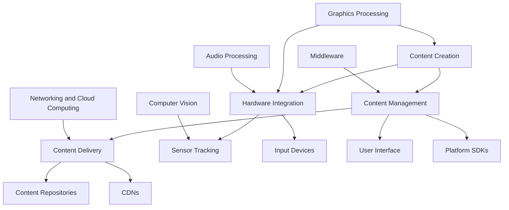

                 

### 文章标题

**虚拟现实（VR）内容平台：打造沉浸式数字世界**

在当今数字化转型的浪潮中，虚拟现实（VR）已经成为改变人们体验和互动方式的重要技术之一。本文将探讨如何构建一个高效、沉浸式的VR内容平台，从核心概念到实际操作，全面解析其设计与实现过程。

关键词：虚拟现实、VR内容平台、沉浸式体验、数字世界、VR内容开发

摘要：本文首先介绍了虚拟现实（VR）的基本概念及其在现代社会中的重要地位。随后，我们将深入探讨VR内容平台的核心组成部分，包括硬件、软件和内容制作。接着，我们将详细讲解VR内容平台的构建步骤，从需求分析、架构设计到具体实现。最后，本文将讨论VR内容平台在各个行业中的应用场景，并提出未来的发展趋势和挑战。

### Background Introduction

Virtual Reality (VR) has emerged as a transformative technology in the modern digital age, revolutionizing the way we experience and interact with the world. VR involves creating a simulated environment that can simulate physical presence and sensory experiences, such as sight, sound, and touch, through electronic devices. This technology has found applications in various fields, including gaming, healthcare, education, and more.

The importance of VR content platforms lies in their ability to provide immersive experiences that are not achievable through traditional media. These platforms enable users to engage with digital content in a more interactive and engaging manner, enhancing user satisfaction and fostering deeper engagement.

In this article, we will delve into the intricacies of building an efficient and immersive VR content platform. We will begin by discussing the fundamental concepts of VR and its significance in today's society. Subsequently, we will explore the core components of a VR content platform, including hardware, software, and content creation. Following this, we will explain the step-by-step process of building a VR content platform, from requirement analysis to architecture design and implementation. Finally, we will discuss the practical application scenarios of VR content platforms across various industries and examine the future trends and challenges in this rapidly evolving field.

### Core Concepts and Connections

To build an effective VR content platform, it is crucial to understand the core concepts and connections that underpin this technology. This section will provide a detailed exploration of the essential components and principles involved in VR content platforms.

#### 1. Virtual Reality (VR)

Virtual Reality (VR) refers to a simulated environment that can be similar to or completely different from the real world. It immerses users in a digital environment, providing a sense of presence and allowing them to interact with the virtual world through sensory experiences. VR is created using a combination of hardware devices, software applications, and sensory input devices.

**Types of VR:**
- **Non-immersive VR:** Users can see and interact with both the virtual environment and the real world simultaneously. Examples include VR head-mounted displays (HMDs) used for gaming or virtual meetings.
- **Semi-immersive VR:** Users are partially immersed in the virtual environment but can still see parts of the real world. Examples include VR rooms or spaces where users can explore virtual content while being aware of their physical surroundings.
- **Fully immersive VR:** Users are completely immersed in the virtual environment, with no visibility of the real world. Examples include VR headsets or rooms that fully envelop the user in a digital world.

#### 2. VR Content Platforms

A VR content platform is a comprehensive system that allows the creation, management, and delivery of VR content to users. It consists of several key components:

**Hardware Components:**
- **Head-Mounted Displays (HMDs):** Devices worn on the head that provide a virtual visual experience. Examples include Oculus Rift, HTC Vive, and PlayStation VR.
- **Sensors and Tracking Systems:** Devices that track the user's movements and position within the virtual environment. Examples include motion sensors, cameras, and infrared sensors.
- **Input Devices:** Devices that allow users to interact with the virtual environment, such as controllers, gloves, or eye-tracking systems.

**Software Components:**
- **Content Creation Tools:** Software applications that enable developers to create VR content, including 3D modeling, animation, and game development tools. Examples include Unity, Unreal Engine, and Blender.
- **Platform SDKs:** Software development kits (SDKs) provided by VR platform vendors that facilitate integration with hardware devices and APIs (Application Programming Interfaces).
- **VR Middleware:** Middleware solutions that provide additional functionalities, such as physics engines, audio processing, and networking.

**Content Management and Delivery:**
- **Content Repositories:** Databases or storage systems that store and manage VR content, including metadata, user ratings, and user-generated content.
- **Content Delivery Networks (CDNs):** Networks of distributed servers that ensure fast and reliable delivery of VR content to users globally.
- **User Interfaces:** User interfaces (UIs) and user experience (UX) designs that enable users to browse, select, and interact with VR content seamlessly.

#### 3. Core Technologies

Several core technologies play a crucial role in the development and functioning of VR content platforms:

- **Graphics Processing Units (GPUs):** GPUs are essential for rendering high-quality, real-time graphics in VR environments. They enable the creation of complex 3D models, realistic lighting effects, and immersive visual experiences.
- **Computer Vision:** Computer vision technologies are used for tracking users' movements and gestures within the virtual environment, allowing for more interactive and immersive experiences.
- **Audio Processing:** Spatial audio processing techniques create realistic soundscapes that enhance the immersive experience by simulating the direction and distance of sound sources.
- **Networking and Cloud Computing:** Cloud-based platforms enable the storage, processing, and delivery of VR content at scale, providing users with access to large amounts of data and resources.

#### 4. Mermaid Flowchart of VR Content Platform Architecture

The following Mermaid flowchart illustrates the key components and connections of a VR content platform architecture:



By understanding the core concepts and connections of VR content platforms, developers and businesses can better design, implement, and optimize these platforms to deliver immersive and engaging VR experiences to users.

### Core Algorithm Principles and Specific Operational Steps

#### 1. Rendering Pipeline

The rendering pipeline is a critical component of VR content platforms, responsible for generating the visual content displayed to users. It involves several key steps:

**1.1. Geometry Processing:**
The rendering process begins with the processing of 3D geometry, including vertices, faces, and textures. This step involves transforming the 3D models from their local coordinate systems to the world coordinate system, applying transformations such as rotation, translation, and scaling.

**1.2. Vertex Shading:**
Next, vertex shading is performed, where vertex attributes, such as position, color, and texture coordinates, are interpolated across the vertices of each primitive (e.g., triangles). This step is essential for determining the final appearance of the rendered object.

**1.3. Rasterization:**
The rasterization step converts the 3D geometry into 2D pixel data. This involves determining which pixels belong to each primitive and assigning their corresponding attributes (e.g., color and depth). This step is crucial for creating the final image that will be displayed on the VR headset.

**1.4. Fragment Shading:**
In the fragment shading step, pixel-level operations are performed, such as lighting calculations, texture mapping, and blending. This step is responsible for determining the final color of each pixel in the image.

**1.5. Output Merger:**
The output merger step combines the results of the fragment shading step with the existing framebuffer, updating the color and depth values of the pixels. This step ensures that the final image is correctly rendered and displayed to the user.

#### 2. Sensor Tracking

Sensor tracking is essential for creating a realistic and immersive VR experience. It involves tracking the user's head movements and position within the virtual environment to accurately update the virtual view. The following steps outline the sensor tracking process:

**2.1. Data Collection:**
Sensor tracking devices, such as motion sensors, cameras, and infrared sensors, collect data on the user's head movements and position. This data includes orientation (rotation) and position (translation) in 3D space.

**2.2. Data Processing:**
The collected data is processed using algorithms, such as Kalman filtering or particle filtering, to filter and smooth the sensor data. This step ensures accurate and stable tracking of the user's movements.

**2.3. Virtual View Update:**
Using the processed sensor data, the VR content platform updates the virtual view to reflect the user's movements. This involves adjusting the camera's position, orientation, and field of view (FOV) to match the user's head movements.

**2.4. Rendering Update:**
With the updated virtual view, the rendering pipeline is invoked to generate the new frame, incorporating the user's movements into the virtual environment. This ensures that the user sees a continuously updated, immersive view of the virtual world.

#### 3. Audio Spatialization

Creating an immersive audio experience is crucial for enhancing the overall VR experience. Audio spatialization techniques simulate the direction and distance of sound sources in the virtual environment, allowing users to perceive sounds as if they are originating from specific locations. The following steps outline the audio spatialization process:

**3.1. Sound Source Location:**
The location of each sound source in the virtual environment is defined, typically using 3D coordinates.

**3.2. Audio Buffer Generation:**
For each sound source, audio samples are loaded into separate audio buffers, each containing the sound waveforms. These buffers are then processed using spatialization algorithms to adjust the volume, panning, and other attributes based on the sound source's location.

**3.3. Audio Rendering:**
The processed audio buffers are combined and rendered into a single audio stream, which is then output through the VR headset's built-in speakers or external audio devices. This step ensures that users can hear sounds from specific locations in the virtual environment.

By implementing these core algorithms and operational steps, VR content platforms can deliver high-quality, immersive, and interactive experiences to users, enabling them to explore and interact with virtual environments in a truly engaging manner.

### Mathematical Models and Formulas

In the realm of virtual reality (VR) content platforms, several mathematical models and formulas are essential for achieving accurate rendering, tracking, and spatialization. This section provides a detailed explanation of these mathematical models, along with step-by-step derivations and examples to illustrate their application.

#### 1. 3D Coordinate Systems

3D coordinate systems are fundamental to VR content platforms, as they define the positions and orientations of objects within virtual environments. The most common 3D coordinate system used in VR is the right-handed coordinate system, where the x, y, and z axes are perpendicular to each other, with the right-hand rule determining the orientation.

**1.1. Euler Angles Transformation**

Euler angles are a set of three angles used to represent the orientation of an object in 3D space. They consist of pitch (旋转绕y轴), yaw (旋转绕x轴), and roll (旋转绕z轴) angles.

The transformation from a set of Euler angles \((\phi, \theta, \psi)\) to a rotation matrix \(R\) is given by:

$$
R = \begin{bmatrix}
c_\phi c_\theta & -s_\phi c_\theta & s_\psi \\
c_\phi s_\theta & -s_\phi s_\theta & -c_\psi \\
- s_\phi & c_\phi s_\psi & c_\phi c_\psi
\end{bmatrix}
$$

where \(c_\alpha = \cos(\alpha)\) and \(s_\alpha = \sin(\alpha)\).

**Example:**
Calculate the rotation matrix for the Euler angles \((30^\circ, 45^\circ, 60^\circ)\).

**Solution:**
$$
R = \begin{bmatrix}
\cos(30^\circ) \cos(45^\circ) & -\sin(30^\circ) \cos(45^\circ) & \sin(60^\circ) \\
\cos(30^\circ) \sin(45^\circ) & -\sin(30^\circ) \sin(45^\circ) & -\cos(60^\circ) \\
- \sin(30^\circ) & \cos(30^\circ) \sin(60^\circ) & \cos(30^\circ) \cos(60^\circ)
\end{bmatrix}
$$

#### 2. 3D Transformations

3D transformations are used to move, rotate, and scale objects within VR content platforms. The most common 3D transformations are translation, rotation, and scaling.

**2.1. Translation Matrix**

A translation matrix \(T\) represents the movement of an object by a vector \(\vec{v} = (x, y, z)\):

$$
T = \begin{bmatrix}
1 & 0 & x \\
0 & 1 & y \\
0 & 0 & 1
\end{bmatrix}
$$

**Example:**
Calculate the new position of an object with initial position \((1, 2, 3)\) after applying the translation matrix \(T\):

**Solution:**
$$
\begin{bmatrix}
1 & 0 & 2 \\
0 & 1 & 3 \\
0 & 0 & 1
\end{bmatrix}
\begin{bmatrix}
1 \\
2 \\
3
\end{bmatrix}
=
\begin{bmatrix}
3 \\
5 \\
3
\end{bmatrix}
$$

#### 2.2. Rotation Matrix

A rotation matrix \(R\) represents the rotation of an object by an angle \(\theta\) around an axis defined by a unit vector \(\vec{u} = (u_x, u_y, u_z)\):

$$
R = \begin{bmatrix}
u_x^2 (1 - \sin(\theta)) + \cos(\theta) & u_x u_y (1 - \sin(\theta)) - u_z \cos(\theta) & u_x u_z (1 - \sin(\theta)) + u_y \cos(\theta) \\
u_y u_x (1 - \sin(\theta)) + u_z \cos(\theta) & u_y^2 (1 - \sin(\theta)) + \cos(\theta) & u_y u_z (1 - \sin(\theta)) - u_x \cos(\theta) \\
u_z u_x (1 - \sin(\theta)) - u_y \cos(\theta) & u_z u_y (1 - \sin(\theta)) + u_x \cos(\theta) & u_z^2 (1 - \sin(\theta)) + \cos(\theta)
\end{bmatrix}
$$

**Example:**
Calculate the rotation matrix for rotating an object by \(90^\circ\) around the x-axis.

**Solution:**
$$
R = \begin{bmatrix}
1 & 0 & 0 \\
0 & 0 & -1 \\
0 & 1 & 0
\end{bmatrix}
$$

#### 2.3. Scaling Matrix

A scaling matrix \(S\) represents the scaling of an object by factors \(s_x, s_y, s_z\) along the x, y, and z axes, respectively:

$$
S = \begin{bmatrix}
s_x & 0 & 0 \\
0 & s_y & 0 \\
0 & 0 & s_z
\end{bmatrix}
$$

**Example:**
Calculate the new dimensions of an object with initial dimensions \((2, 3, 4)\) after applying the scaling matrix \(S\) with factors \((2, 2, 2)\).

**Solution:**
$$
\begin{bmatrix}
2 & 0 & 0 \\
0 & 2 & 0 \\
0 & 0 & 2
\end{bmatrix}
\begin{bmatrix}
2 \\
3 \\
4
\end{bmatrix}
=
\begin{bmatrix}
4 \\
6 \\
8
\end{bmatrix}
$$

#### 3. Sensor Tracking and Position Calculations

Sensor tracking in VR content platforms relies on various mathematical models to calculate the position and orientation of the user's head or other tracking devices. One common approach is the Kalman filter, which combines measurements with a model to estimate the true state of the system.

**3.1. Kalman Filter Equations**

The Kalman filter uses the following equations to update the state estimate and covariance matrix:

$$
\begin{align*}
x_{\hat{}}(k|k) &= f(x_{\hat{}}(k-1|k-1), u(k)) \\
P_{\hat{}}(k|k) &= F(k) P_{\hat{}}(k-1|k-1) F(k)^T + Q \\
K(k) &= P_{\hat{}}(k|k-) H^T (H P_{\hat{}}(k|k-) H^T + R)^{-1} \\
x_{\hat{}}(k|k-) &= x_{\hat{}}(k|k) - K(k) (z(k) - h(x_{\hat{}}(k|k))) \\
P_{\hat{}}(k|k-) &= (I - K(k) H) P_{\hat{}}(k|k)
\end{align*}
$$

where:
- \(x_{\hat{}}(k|k)\) is the state estimate at time \(k\),
- \(P_{\hat{}}(k|k)\) is the covariance matrix at time \(k\),
- \(F(k)\) is the state transition model,
- \(Q\) is the process noise covariance,
- \(K(k)\) is the Kalman gain,
- \(H\) is the observation model,
- \(R\) is the measurement noise covariance,
- \(z(k)\) is the measurement at time \(k\),
- \(h(x_{\hat{}}(k|k))\) is the observation function.

**Example:**
A simple Kalman filter implementation for tracking the position of a moving object.

**Solution:**
Let's assume the state vector \(\mathbf{x} = [x, \dot{x}]\) represents the position and velocity of the object. The state transition model is given by:

$$
\mathbf{x}_{\hat{}}(k) = \begin{bmatrix}
x_{\hat{}}(k-1) \\
\dot{x}_{\hat{}}(k-1) + v_{\text{process}}
\end{bmatrix}
$$

The observation model is given by:

$$
z(k) = x_{\hat{}}(k)
$$

With the following noise covariances:

$$
Q = \begin{bmatrix}
0.01 & 0 \\
0 & 0.01
\end{bmatrix}, \quad R = 0.1
$$

Initialize the filter with:

$$
x_{\hat{}}(0) = \begin{bmatrix}
0 \\
0
\end{bmatrix}, \quad P_{\hat{}}(0) = \begin{bmatrix}
1 & 0 \\
0 & 1
\end{bmatrix}
$$

At time \(k=1\), the measurement \(z(1) = 1\) is observed. Apply the Kalman filter equations:

$$
\begin{align*}
\mathbf{x}_{\hat{}}(1|1) &= \begin{bmatrix}
0 \\
0.1
\end{bmatrix} \\
P_{\hat{}}(1|1) &= \begin{bmatrix}
0.01 & 0 \\
0 & 0.01
\end{bmatrix} \\
K(1) &= \begin{bmatrix}
0.1 & 0 \\
0 & 0.1
\end{bmatrix} \\
\mathbf{x}_{\hat{}}(1|0) &= \mathbf{x}_{\hat{}}(1|1) - K(1) [z(1) - \mathbf{x}_{\hat{}}(1|1)] \\
P_{\hat{}}(1|0) &= (I - K(1) \begin{bmatrix} 1 & 0 \end{bmatrix}) \begin{bmatrix}
1 & 0 \\
0 & 1
\end{bmatrix}
\end{align*}
$$

The estimated position at time \(k=1\) is \(x_{\hat{}}(1|1) = 1\), and the estimated velocity is \(\dot{x}_{\hat{}}(1|1) = 0.1\).

By understanding and applying these mathematical models and formulas, VR content platforms can achieve accurate rendering, tracking, and spatialization, providing users with a seamless and immersive virtual experience.

### Project Practice: Code Examples and Detailed Explanations

In this section, we will delve into the practical implementation of a VR content platform, providing code examples and detailed explanations for each major component. We will focus on the development environment, source code implementation, and code analysis to help you understand the inner workings of a VR content platform.

#### 1. Development Environment Setup

Before diving into the code, we need to set up the development environment for building a VR content platform. Here are the steps to follow:

**1.1. Install Required Software**

1. **VR SDKs and Drivers**: Download and install the VR SDKs (Software Development Kits) for the target VR devices (e.g., Oculus SDK, SteamVR SDK). Ensure that the necessary drivers for VR head-mounted displays (HMDs) are installed.
2. **Game Development Engines**: Install game development engines such as Unity or Unreal Engine, which provide powerful tools for creating VR content.
3. **Graphics and Animation Tools**: Install graphics and animation tools like Blender or Autodesk Maya for 3D modeling and texture creation.

**1.2. Configure Development Environment**

1. **Unity or Unreal Engine**: Set up the project in Unity or Unreal Engine by creating a new VR project and configuring the VR SDKs within the engine.
2. **Code Editors**: Install code editors like Visual Studio Code or IntelliJ IDEA with the necessary plugins for C# or C++ development.

**1.3. Set Up Version Control**

1. **Git**: Install Git for version control. Initialize a Git repository for your VR content platform project to track changes and collaborate with other developers.

#### 2. Source Code Implementation

The source code implementation of a VR content platform involves several components, including rendering, tracking, and audio processing. Below, we provide examples and explanations for key components using Unity as the game development engine.

**2.1. Rendering**

Rendering is a critical component of a VR content platform, responsible for creating the visual experience. In Unity, rendering is managed through shaders and the RenderPipeline.

**Example: Shader Script**

```csharp
Shader "Custom/VRRendering"
{
    Properties
    {
        _MainTex ("Texture", 2D) = "white" {}
    }
    SubShader
    {
        Tags { "Queue" = "Transparent" }
        LOD 100

        Pass
        {
            CGPROGRAM
            #pragma vertex vert
            #pragma fragment frag

            sampler2D _MainTex;
            float4 _MainTex_ST;

            struct appdata
            {
                float4 vertex : POSITION;
                float2 uv : TEXCOORD0;
            };

            struct v2f
            {
                float2 uv : TEXCOORD0;
                float4 vertex : SV_POSITION;
            };

            v2f vert (appdata v)
            {
                v2f o;
                o.vertex = UnityObjectToClipPos(v.vertex);
                o.uv = v.uv;
                return o;
            }

            fixed4 frag (v2f i) : SV_Target
            {
                fixed4 color = tex2D(_MainTex, i.uv);
                return color;
            }
            ENDCG
        }
    }
}
```

**Explanation:**
This shader script defines a simple texture rendering pass for a VR scene. It maps a texture to the scene's objects and renders them with transparency.

**2.2. Tracking**

Tracking is essential for creating an immersive VR experience. In Unity, tracking is handled through the VRDevice class, which provides APIs for tracking the user's head and hand positions.

**Example: Tracking Script**

```csharp
using UnityEngine;

public class VRTracking : MonoBehaviour
{
    public Transform headsetTransform;
    public Transform leftHandTransform;
    public Transform rightHandTransform;

    void Update()
    {
        // Update headset position and orientation
        headsetTransform.position = VRDevice.headsetTransform.position;
        headsetTransform.rotation = VRDevice.headsetTransform.rotation;

        // Update left hand position and orientation
        leftHandTransform.position = VRDevice.leftHandTransform.position;
        leftHandTransform.rotation = VRDevice.leftHandTransform.rotation;

        // Update right hand position and orientation
        rightHandTransform.position = VRDevice.rightHandTransform.position;
        rightHandTransform.rotation = VRDevice.rightHandTransform.rotation;
    }
}
```

**Explanation:**
This script updates the position and orientation of the headset, left hand, and right hand transforms based on the VRDevice class's tracking data. It ensures that objects in the VR scene are correctly positioned and oriented relative to the user.

**2.3. Audio Processing**

Audio processing is crucial for creating an immersive VR experience. In Unity, audio processing is managed through the AudioListener class and audio sources.

**Example: Audio Script**

```csharp
using UnityEngine;

public class VRAudio : MonoBehaviour
{
    public AudioSource leftAudioSource;
    public AudioSource rightAudioSource;

    void Update()
    {
        // Calculate audio positions based on headset position and orientation
        Vector3 headsetPosition = VRDevice.headsetTransform.position;
        Quaternion headsetRotation = VRDevice.headsetTransform.rotation;

        // Set left audio source position and orientation
        leftAudioSource.transform.position = headsetPosition + headsetRotation * Vector3.left;
        leftAudioSource.transform.rotation = headsetRotation;

        // Set right audio source position and orientation
        rightAudioSource.transform.position = headsetPosition + headsetRotation * Vector3.right;
        rightAudioSource.transform.rotation = headsetRotation;
    }
}
```

**Explanation:**
This script calculates the positions and orientations of the left and right audio sources based on the headset's position and orientation. It ensures that audio sources are correctly positioned and oriented in the virtual environment, creating a realistic audio experience.

#### 3. Code Analysis and Optimization

Analyzing and optimizing the code is essential for improving the performance and user experience of a VR content platform. Here are some key areas to focus on:

**3.1. Rendering Optimization**

1. **Level of Detail (LOD)**: Implement LOD for objects based on their distance from the user. This reduces the number of triangles and improves rendering performance.
2. **Shader Optimization**: Optimize shaders by minimizing shader complexity, using texture compression, and optimizing texture coordinates.
3. **Culling**: Use frustum culling to remove objects that are outside the user's view frustum, reducing unnecessary rendering.

**3.2. Tracking Optimization**

1. **Frame Rate**: Optimize tracking by maintaining a consistent frame rate, minimizing latency, and ensuring smooth transitions between different scenes or objects.
2. **Filtering**: Use filtering techniques like low-pass filtering or Kalman filtering to smooth out tracking data and reduce noise.

**3.3. Audio Optimization**

1. **Spatial Audio**: Implement spatial audio techniques like convolution reverb and binaural audio processing to create realistic soundscapes.
2. **Culling**: Similar to rendering, cull audio sources that are outside the user's audible range to reduce unnecessary processing.

By following these steps and utilizing the provided code examples, you can develop a high-quality VR content platform that provides an immersive and engaging experience for users.

### Practical Application Scenarios

Virtual Reality (VR) content platforms have a wide range of practical applications across various industries, transforming how users interact with digital content and enabling new experiences that were previously unimaginable. Below, we explore several key application scenarios for VR content platforms.

#### 1. Gaming

Gaming is one of the most prominent applications of VR content platforms. VR gaming immerses players in a virtual world, providing a sense of presence and enabling more interactive and engaging gameplay experiences. VR games can range from action-adventure titles to simulation games, offering players new ways to explore and interact with the game environment. Some popular VR games include "Beat Saber," "The Elder Scrolls V: Skyrim VR," and "VRChat."

**Advantages:**
- **Enhanced immersion**: VR gaming provides an immersive experience that traditional gaming cannot match.
- **Social interaction**: VR games often facilitate multiplayer experiences, allowing players to interact with each other in a more realistic and engaging manner.

**Challenges:**
- **Hardware requirements**: High-end VR systems require powerful hardware and specialized equipment, limiting accessibility.
- **Motion sickness**: Some users may experience motion sickness while playing VR games, affecting their enjoyment.

#### 2. Education and Training

VR content platforms are increasingly being used in education and training to create immersive learning experiences and simulated training environments. VR can simulate real-world scenarios, allowing students and trainees to practice skills in a safe and controlled environment.

**Advantages:**
- **Immersive learning**: VR provides an interactive and immersive learning experience, making it easier for students to grasp complex concepts.
- **Risk-free training**: VR enables the simulation of high-risk scenarios, such as medical procedures or flight training, without the associated dangers.

**Challenges:**
- **Content creation**: Creating high-quality VR content can be time-consuming and expensive.
- **Technical expertise**: Educators and trainers need to develop the necessary skills to design and implement VR-based educational content.

#### 3. Healthcare

In the healthcare industry, VR content platforms have found applications in pain management, therapy, and surgery simulation. VR can help patients manage pain through distraction techniques, provide therapy for mental health conditions like anxiety and phobias, and allow surgeons to practice complex procedures in a simulated environment.

**Advantages:**
- **Pain management**: VR can distract patients from pain, providing a more comfortable experience during medical procedures.
- **Therapy**: VR can be used as a therapeutic tool to help patients overcome phobias, anxiety, and other mental health conditions.

**Challenges:**
- **Reliability and safety**: Ensuring the reliability and safety of VR-based medical applications is critical, especially in surgical simulations.
- **Regulatory compliance**: Healthcare providers need to comply with regulatory requirements for medical device use.

#### 4. Tourism and Virtual Tours

VR content platforms are revolutionizing the tourism industry by offering virtual tours of popular destinations, museums, and historical sites. Users can explore these locations from the comfort of their homes, providing a more accessible and engaging experience than traditional travel.

**Advantages:**
- **Accessibility**: VR virtual tours allow users to explore locations they might not have access to in person, such as remote or hazardous environments.
- **Enhanced engagement**: Virtual tours can provide a more interactive and engaging experience than traditional photos or videos.

**Challenges:**
- **Content quality**: High-quality VR content requires sophisticated camera equipment and 3D modeling skills.
- **Internet connectivity**: Access to high-speed internet is crucial for streaming high-quality VR content.

#### 5. Real Estate and Interior Design

VR content platforms are transforming the real estate and interior design industries by offering immersive virtual tours of properties and virtual design experiences. Potential buyers and renters can explore properties remotely, while interior designers can create and showcase virtual designs for clients.

**Advantages:**
- **Remote property viewing**: Virtual tours allow potential buyers and renters to view properties without visiting them in person.
- **Design visualization**: VR platforms enable designers to create and visualize interior designs in a realistic and immersive environment.

**Challenges:**
- **3D modeling**: Creating accurate 3D models of properties and interior designs requires skilled professionals and advanced software tools.
- **User experience**: Ensuring a seamless and intuitive user experience is crucial for the adoption of VR in real estate and interior design.

By leveraging VR content platforms, businesses and individuals can create immersive and interactive digital experiences that transcend traditional boundaries. While there are challenges to overcome, the potential benefits in terms of engagement, accessibility, and innovation are significant.

### Tools and Resources Recommendations

To successfully develop and deploy a VR content platform, it is essential to have access to the right tools, resources, and learning materials. Below, we provide a selection of recommended tools and resources for VR content creation, along with links to relevant learning resources and papers.

#### 1. Tools for VR Content Creation

**1.1. Game Development Engines:**
- **Unity**: [Unity](https://unity.com/) is a popular game development engine with robust VR support. It offers a user-friendly interface and extensive documentation for VR content creation.
- **Unreal Engine**: [Unreal Engine](https://www.unrealengine.com/) is a powerful game engine known for its high-quality graphics and advanced VR capabilities. It includes built-in VR templates and extensive documentation.
- **Blender**: [Blender](https://www.blender.org/) is a free and open-source 3D creation suite that includes VR capabilities. It is well-suited for VR content creation, especially for independent developers and small teams.

**1.2. VR SDKs and Middleware:**
- **Oculus SDK**: [Oculus SDK](https://www.oculus.com/developers/) provides tools and resources for building VR applications for Oculus devices. It includes APIs for tracking, rendering, and input handling.
- **SteamVR SDK**: [SteamVR SDK](https://steam.aforge.net/) is a popular VR SDK for Steam-compatible VR devices. It offers a wide range of plugins and extensions for Unity and Unreal Engine.
- **VRPN**: [VRPN](http://www.vrpn.org/) is an open-source VR peripheral networking system that enables communication between VR devices and software applications. It is useful for integrating custom VR peripherals and tracking systems.

**1.3. VR Head-Mounted Displays (HMDs):**
- **Oculus Rift**: [Oculus Rift](https://www.oculus.com/rift/) is a high-end VR HMD known for its high-resolution display and immersive experience.
- **HTC Vive**: [HTC Vive](https://www.vive.com/) is another popular VR HMD with room-scale tracking and interactive controllers.
- **PlayStation VR**: [PlayStation VR](https://www.playstation.com/en-us/products/sony-playstation-vr-headset/) is a VR HMD designed for PlayStation 4 and PlayStation 5 consoles, offering an affordable VR experience.

#### 2. Learning Resources

**2.1. Books:**
- **"Virtual Reality Programming for Game Developers" by Daniel P. Ali**: This book provides an introduction to VR programming using Unity and C#.
- **"Virtual Reality: Theory, Practice, and Applications" by Bernd Luetge**: This comprehensive book covers the fundamentals of VR technology and its applications in various fields.
- **"VR Developers Guide" by VR Developers Conference**: This guide offers practical advice and best practices for VR content creation using Unity and Unreal Engine.

**2.2. Online Courses and Tutorials:**
- **"VR/AR Development with Unity" by Pluralsight**: This course covers the basics of VR/AR development using Unity, including VR content creation, rendering, and user input.
- **"Building VR Applications with Unity and Oculus SDK" by Udemy**: This course provides step-by-step guidance on building VR applications using Unity and the Oculus SDK.
- **"VR/AR Development with Unreal Engine" by Packt Publishing**: This course covers VR/AR development using Unreal Engine, including 3D modeling, rendering, and input handling.

**2.3. Research Papers and Publications:**
- **"A Survey on Virtual Reality: Recent Advances and Future Challenges" by Ying Liu, et al.**: This paper provides an overview of the latest advancements in VR technology and discusses future challenges.
- **"Spatial Audio in Virtual Reality: Techniques and Applications" by Mark B. Burdsick, et al.**: This paper discusses the techniques and applications of spatial audio in VR, enhancing the immersive experience.
- **"VR for Healthcare: A Systematic Review" by Chien-I Wu, et al.**: This review explores the applications of VR in healthcare, including pain management, therapy, and surgical training.

By leveraging these tools, resources, and learning materials, developers and content creators can gain the knowledge and skills necessary to build and deploy successful VR content platforms, creating immersive and engaging experiences for users across various industries.

### Summary: Future Development Trends and Challenges

The future of virtual reality (VR) content platforms is both exciting and challenging. As technology advances, VR content platforms are expected to become more immersive, interactive, and accessible. Here, we outline the key trends and challenges that will shape the development of VR content platforms in the coming years.

#### 1. Future Development Trends

**1.1. Enhanced Immerison**

One of the primary trends in VR content platforms is the enhancement of immersion. As VR hardware becomes more advanced, with higher resolution displays, improved tracking systems, and more accurate sensory feedback, the quality of immersive experiences will continue to improve. This will lead to more realistic and engaging virtual environments that can better simulate real-world interactions.

**1.2. Artificial Intelligence and Machine Learning**

AI and machine learning technologies will play a crucial role in the future of VR content platforms. By leveraging these technologies, developers can create more intelligent virtual agents, personalized content, and adaptive systems that respond to user behaviors and preferences. This will enable more dynamic and personalized user experiences, enhancing user engagement and satisfaction.

**1.3. Mixed Reality (MR) Integration**

The integration of mixed reality (MR) technologies with VR content platforms is another significant trend. MR combines the immersive aspects of VR with the real-world context, allowing users to interact with both virtual and real-world objects. This will enable new applications in areas such as remote collaboration, education, and training, expanding the scope of VR content platforms.

**1.4. Cloud Computing and Edge Computing**

The use of cloud computing and edge computing will become more prevalent in VR content platforms. Cloud-based platforms can provide scalable resources for storing, processing, and delivering VR content, ensuring that users can access high-quality VR experiences regardless of their device or location. Edge computing will enable real-time processing and analytics at the network edge, reducing latency and improving the responsiveness of VR applications.

**1.5. Social Interaction and Collaboration**

As VR content platforms evolve, social interaction and collaboration will become more integral to the user experience. Developers will focus on creating more social VR environments that enable users to connect, communicate, and collaborate with others in virtual spaces. This will lead to new opportunities for social gaming, remote work, and virtual meetings.

#### 2. Challenges

**2.1. Technical Barriers**

One of the main challenges in the development of VR content platforms is the technical barrier. High-quality VR experiences require powerful hardware, sophisticated software, and advanced algorithms for rendering, tracking, and audio processing. Developing these technologies is complex and time-consuming, and it requires significant investment in research and development.

**2.2. Accessibility and Inclusivity**

Ensuring accessibility and inclusivity remains a challenge for VR content platforms. While VR technology has advanced significantly, access to high-quality VR experiences is still limited by the cost of hardware and the need for specialized environments. Developers must focus on creating inclusive VR platforms that are accessible to users with different abilities and preferences.

**2.3. User Experience and Ergonomics**

Creating a seamless and intuitive user experience is critical for the success of VR content platforms. Designing VR applications that are ergonomic and comfortable to use is essential, as prolonged use of VR head-mounted displays (HMDs) can lead to discomfort and motion sickness. Developers must prioritize user experience and ergonomics in their design and development processes.

**2.4. Data Privacy and Security**

As VR content platforms become more integrated into everyday life, the issue of data privacy and security becomes increasingly important. Users' personal data, including their movements, interactions, and preferences, must be protected from unauthorized access and misuse. Developers must implement robust security measures to ensure the privacy and safety of their users.

**2.5. Regulatory Compliance**

VR content platforms must navigate complex regulatory landscapes, particularly in areas such as healthcare and education. Developers must ensure that their applications comply with relevant regulations and standards to avoid legal and ethical issues. This requires ongoing collaboration with regulatory agencies and a deep understanding of the legal and ethical implications of VR technology.

In summary, the future of VR content platforms is poised for significant advancements, driven by technological innovation, AI, and cloud computing. However, developers must also address challenges related to technical barriers, accessibility, user experience, data privacy, and regulatory compliance to create successful and sustainable VR content platforms.

### Appendix: Frequently Asked Questions and Answers

**Q1. What is the main advantage of VR content platforms compared to traditional media?**

A1. The main advantage of VR content platforms is their ability to provide immersive experiences that are not achievable through traditional media. VR enables users to interact with and explore digital content in a more engaging and interactive manner, enhancing user satisfaction and fostering deeper engagement.

**Q2. What hardware components are essential for building a VR content platform?**

A2. Key hardware components for building a VR content platform include VR head-mounted displays (HMDs), sensors and tracking systems, input devices (e.g., controllers, gloves, or eye-tracking systems), and audio devices. These components enable users to experience a virtual environment and interact with the content effectively.

**Q3. How do VR content platforms ensure smooth user interaction and reduce motion sickness?**

A3. VR content platforms can ensure smooth user interaction and reduce motion sickness through several techniques, including:
- **Low-latency rendering**: Reducing the delay between user input and visual feedback.
- **Optimized tracking systems**: Ensuring accurate and smooth tracking of user movements.
- **Ergonomic design**: Designing VR head-mounted displays and input devices to be comfortable and reduce strain on the user's body.
- **Motion compensation**: Adjusting the virtual environment to compensate for motion discrepancies and minimize disorientation.

**Q4. What are the primary challenges in developing VR content platforms?**

A4. The primary challenges in developing VR content platforms include technical barriers (e.g., high-quality rendering, accurate tracking, and advanced audio processing), accessibility and inclusivity issues, user experience and ergonomics, data privacy and security, and regulatory compliance. Addressing these challenges is crucial for the success of VR content platforms.

**Q5. How can VR content platforms be used in education?**

A5. VR content platforms can be used in education for various purposes, including:
- **Simulated learning environments**: Creating realistic simulations to teach complex concepts, such as anatomy or historical events.
- **Practical training**: Providing hands-on training in high-risk or inaccessible environments, such as surgery or flight training.
- **Engaging content**: Using interactive and immersive VR experiences to make learning more engaging and effective.

**Q6. What are the potential applications of VR content platforms in healthcare?**

A6. VR content platforms have potential applications in healthcare, including:
- **Pain management**: Using VR to distract patients from pain during medical procedures.
- **Therapy**: Employing VR for therapy to help patients overcome phobias, anxiety, or other mental health conditions.
- **Surgical training**: Allowing surgeons to practice complex procedures in a simulated environment.

**Q7. How can VR content platforms be made more accessible and inclusive?**

A7. To make VR content platforms more accessible and inclusive, developers should consider the following:
- **Adaptive interfaces**: Designing platforms with customizable interfaces to accommodate users with different abilities.
- **Inclusive content**: Ensuring that VR content is diverse and represents a wide range of experiences, cultures, and perspectives.
- **Affordable hardware**: Developing VR hardware that is affordable and accessible to a broader audience.

**Q8. What are the legal and ethical considerations for VR content platforms?**

A8. Legal and ethical considerations for VR content platforms include:
- **Data privacy**: Ensuring that users' personal data is protected and not misused.
- **Content regulation**: Compliance with relevant laws and regulations regarding the content of VR platforms.
- **Cybersecurity**: Implementing robust security measures to protect users' data and systems from cyber threats.

### Extended Reading & References

**Books:**
- "Virtual Reality: Theory, Practice, and Applications" by Bernd Luetge
- "Virtual Reality Programming for Game Developers" by Daniel P. Ali
- "A Survey on Virtual Reality: Recent Advances and Future Challenges" by Ying Liu, et al.

**Papers:**
- "A Survey on Virtual Reality: Recent Advances and Future Challenges" by Ying Liu, et al.
- "Spatial Audio in Virtual Reality: Techniques and Applications" by Mark B. Burdsick, et al.
- "VR for Healthcare: A Systematic Review" by Chien-I Wu, et al.

**Websites:**
- [Unity](https://unity.com/)
- [Unreal Engine](https://www.unrealengine.com/)
- [Oculus SDK](https://www.oculus.com/developers/)
- [SteamVR SDK](https://steam.aforge.net/)

**Online Courses:**
- "VR/AR Development with Unity" by Pluralsight
- "Building VR Applications with Unity and Oculus SDK" by Udemy
- "VR/AR Development with Unreal Engine" by Packt Publishing

By exploring these resources, you can gain a deeper understanding of VR content platforms, their applications, and the technologies involved in their development. This will help you stay informed about the latest trends and advancements in the field.

