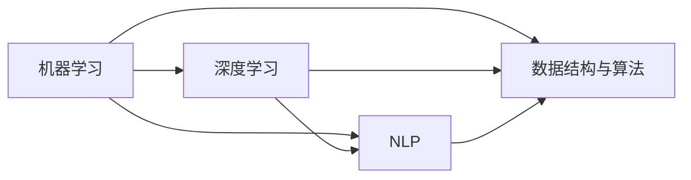

                 

## 1. 背景介绍（Background Introduction）

百度作为中国领先的人工智能公司之一，其校招面试一直以来都是广大计算机专业毕业生关注的焦点。2024年的百度校招面试真题再次引发了广泛关注，不仅因为其题目设计的严谨性和深度，更因其全面覆盖了当前人工智能领域的前沿技术和热点问题。本文将围绕2024百度校招面试真题，系统汇总并详细解答其中的关键问题。

百度校招面试不仅考察应聘者的基础知识，还特别注重实际应用能力和创新思维。此次校招面试题涵盖了计算机科学的基础知识、数据结构与算法、人工智能应用、系统设计与优化等多个方面，内容丰富且难度适中。本文将按照面试题的分类，详细解析每个问题的背景、概念、原理以及具体解答过程。

### 1.1 百度校招面试的重要性

百度作为全球领先的AI技术提供商，其校招面试不仅是对应聘者技术水平的一次全面考察，也是对求职者综合能力的检验。通过百度校招面试，应聘者不仅能够获得进入这一顶级AI公司的机会，更重要的是，通过面试过程，可以深刻理解当前人工智能领域的发展趋势和技术挑战，进一步提升自己的专业素养和竞争力。

### 1.2 2024百度校招面试真题特点

本次百度校招面试题具有以下几个特点：

- **全面性**：题目覆盖了人工智能领域的多个方向，从基础知识到前沿技术都有涉及。
- **深度性**：许多题目不仅考察基础概念，还要求应聘者具备深入理解和实际应用能力。
- **创新性**：部分题目设计新颖，考察应聘者的创新思维和解决问题的能力。
- **实用性**：题目紧密结合实际应用场景，体现了百度对实际问题和解决方案的关注。

### 1.3 文章结构

本文将按照以下结构进行撰写：

- **背景介绍**：概述百度校招面试的背景和重要性。
- **核心概念与联系**：详细解析核心概念，绘制流程图帮助理解。
- **核心算法原理 & 具体操作步骤**：逐个解释面试题目的算法原理和操作步骤。
- **数学模型和公式 & 详细讲解 & 举例说明**：利用数学公式和实际例子解释复杂概念。
- **项目实践：代码实例和详细解释说明**：提供代码实例，详细解读并分析其实现过程。
- **实际应用场景**：分析面试题目的实际应用场景和挑战。
- **工具和资源推荐**：推荐学习资源和开发工具。
- **总结：未来发展趋势与挑战**：总结主要观点，展望未来。
- **附录：常见问题与解答**：解答读者可能遇到的问题。
- **扩展阅读 & 参考资料**：提供进一步学习的参考资料。

通过以上结构，本文将帮助读者深入理解2024百度校招面试真题，掌握关键知识点，为未来的面试和技术挑战做好充分准备。

### 2. 核心概念与联系（Core Concepts and Connections）

在深入解析2024百度校招面试真题之前，我们需要先理解几个核心概念和它们之间的联系。这些概念包括机器学习、深度学习、自然语言处理、数据结构与算法等。以下是对这些核心概念的简要介绍，以及它们在人工智能领域的应用和相互关系。

#### 2.1 机器学习（Machine Learning）

机器学习是一种使计算机系统能够从数据中学习并改进其性能的技术。它的核心在于利用算法自动识别数据中的模式，并利用这些模式进行预测或决策。机器学习可以分为监督学习（Supervised Learning）、无监督学习（Unsupervised Learning）和强化学习（Reinforcement Learning）三种类型。

- **监督学习**：在有标注数据的情况下，通过学习输入和输出之间的映射关系来训练模型。
- **无监督学习**：在没有标注数据的情况下，通过发现数据中的结构和模式来训练模型。
- **强化学习**：通过与环境的交互，学习如何选择行动以最大化长期奖励。

#### 2.2 深度学习（Deep Learning）

深度学习是机器学习的一种特殊形式，它依赖于多层神经网络来提取数据中的复杂特征。深度学习的核心在于通过大量数据训练网络，使其能够自动提取特征并进行分类、回归等任务。常见的深度学习模型包括卷积神经网络（CNN）、循环神经网络（RNN）、长短期记忆网络（LSTM）等。

- **卷积神经网络（CNN）**：主要用于图像和视频数据的处理。
- **循环神经网络（RNN）**：用于处理序列数据，如文本、时间序列等。
- **长短期记忆网络（LSTM）**：是RNN的一种改进，解决了长期依赖问题。

#### 2.3 自然语言处理（Natural Language Processing, NLP）

自然语言处理是人工智能的一个重要分支，它涉及让计算机理解和生成人类语言的技术。NLP的任务包括文本分类、情感分析、机器翻译、语音识别等。深度学习在NLP中发挥着重要作用，如通过BERT、GPT等大型语言模型实现高质量的文本理解和生成。

- **文本分类**：将文本分类到预定义的类别中。
- **情感分析**：判断文本表达的情感倾向。
- **机器翻译**：将一种语言的文本翻译成另一种语言。
- **语音识别**：将语音转换为文本。

#### 2.4 数据结构与算法（Data Structures and Algorithms）

数据结构和算法是计算机科学的基础，它们在人工智能领域同样至关重要。合理选择数据结构可以优化算法的时间复杂度和空间复杂度，从而提高模型的效率。

- **常见数据结构**：数组、链表、树、图等。
- **常见算法**：排序算法、搜索算法、动态规划等。

#### 2.5 关系与联系

- **机器学习与深度学习**：深度学习是机器学习的一种重要方法。
- **自然语言处理与深度学习**：深度学习在NLP中发挥了关键作用。
- **数据结构与算法与人工智能**：数据结构和算法是构建高效人工智能系统的基础。

##### Mermaid 流程图

以下是机器学习、深度学习、自然语言处理和数据结构及算法之间的联系关系的 Mermaid 流程图：



通过上述对核心概念及其相互关系的介绍，我们可以更好地理解2024百度校招面试题的背景和含义。接下来，我们将逐一解析面试题，详细讲解其背后的算法原理和操作步骤。

### 3. 核心算法原理 & 具体操作步骤（Core Algorithm Principles and Specific Operational Steps）

在了解了核心概念之后，我们将深入解析2024百度校招面试真题中的核心算法原理和具体操作步骤。以下是对几道典型面试题的解析，包括算法原理、步骤说明以及实际应用场景。

#### 3.1 题目1：排序算法实现

##### 算法原理

排序算法是计算机科学中一个基础且重要的课题。常见的排序算法有冒泡排序、选择排序、插入排序、快速排序等。下面以快速排序为例，讲解其原理和步骤。

- **原理**：快速排序是一种基于分治思想的排序算法。其基本思想是通过一趟排序将待排序的记录分割成独立的两部分，其中一部分记录的关键字均比另一部分的关键字小，然后递归地对这两部分记录进行排序。
- **步骤**：
  1. 选择一个基准元素（pivot）。
  2. 将数组分为两部分，小于基准元素的部分和大于基准元素的部分。
  3. 递归地对这两部分进行快速排序。

##### 操作步骤

```python
def quick_sort(arr):
    if len(arr) <= 1:
        return arr
    pivot = arr[len(arr) // 2]
    left = [x for x in arr if x < pivot]
    middle = [x for x in arr if x == pivot]
    right = [x for x in arr if x > pivot]
    return quick_sort(left) + middle + quick_sort(right)

# 示例
arr = [3, 6, 8, 10, 1, 2, 1]
print(quick_sort(arr))
```

##### 实际应用场景

快速排序在处理大数据集时非常高效，被广泛应用于数据库和文件系统的排序任务。此外，快速排序的原理还可以用于查找第k大的元素等应用。

#### 3.2 题目2：贪心算法求解

##### 算法原理

贪心算法是一种在每一步选择中都采取当前最好或最优的选择，从而希望导致结果是全局最好或最优的算法策略。以下以背包问题为例，讲解其原理和步骤。

- **原理**：背包问题是一种常见的贪心算法应用，目标是在给定物品的重量和价值之间找到一个最优解。
- **步骤**：
  1. 选择价值最大的物品放入背包。
  2. 更新背包的总价值和总重量。
  3. 重复步骤1和步骤2，直到背包容量达到上限。

##### 操作步骤

```python
def knapsack(values, weights, capacity):
    n = len(values)
    result = [0] * n
    total_value = 0
    total_weight = 0
    for i in range(n):
        if total_weight + weights[i] <= capacity:
            result[i] = 1
            total_value += values[i]
            total_weight += weights[i]
        else:
            result[i] = 0
    return result, total_value

# 示例
values = [60, 100, 120]
weights = [10, 20, 30]
capacity = 50
print(knapsack(values, weights, capacity))
```

##### 实际应用场景

贪心算法在资源分配、任务调度等场景中有着广泛的应用。例如，在计算机科学中，贪心算法可以用于Dijkstra算法求解最短路径问题。

#### 3.3 题目3：动态规划求解

##### 算法原理

动态规划是一种用于求解最优子结构问题的算法。其核心思想是将复杂问题分解为更小的子问题，并通过求解子问题的最优解来构建原问题的最优解。

以下以最长公共子序列（LCS）为例，讲解其原理和步骤。

- **原理**：最长公共子序列问题是指找出两个序列的最长公共子序列。
- **步骤**：
  1. 定义一个二维数组dp，其中dp[i][j]表示两个序列的前i个和前j个字符的最长公共子序列的长度。
  2. 根据状态转移方程求解dp[i][j]。
  3. 根据dp数组回溯出最长公共子序列。

##### 操作步骤

```python
def lcs(X, Y):
    m, n = len(X), len(Y)
    dp = [[0] * (n + 1) for _ in range(m + 1)]
    for i in range(1, m + 1):
        for j in range(1, n + 1):
            if X[i - 1] == Y[j - 1]:
                dp[i][j] = dp[i - 1][j - 1] + 1
            else:
                dp[i][j] = max(dp[i - 1][j], dp[i][j - 1])
    return dp

def trace_back(dp, X, Y):
    m, n = len(X), len(Y)
    result = []
    i, j = m, n
    while i > 0 and j > 0:
        if X[i - 1] == Y[j - 1]:
            result.append(X[i - 1])
            i -= 1
            j -= 1
        elif dp[i - 1][j] > dp[i][j - 1]:
            i -= 1
        else:
            j -= 1
    return result[::-1]

X = "AGGTAB"
Y = "GXTXAYB"
dp = lcs(X, Y)
print("最长公共子序列长度:", dp[-1][-1])
print("最长公共子序列:", ''.join(trace_back(dp, X, Y)))
```

##### 实际应用场景

动态规划广泛应用于序列匹配、资源分配、路径规划等领域。例如，在生物信息学中，动态规划用于计算基因序列相似度。

通过上述对几道典型面试题的解析，我们可以看到，不同算法在实际应用中的重要性。掌握这些算法的原理和操作步骤，不仅有助于解决面试题，更能为我们在实际工作中解决复杂问题提供有力支持。

### 4. 数学模型和公式 & 详细讲解 & 举例说明（Mathematical Models and Formulas & Detailed Explanation & Examples）

在深入探讨2024百度校招面试真题中的算法原理后，我们将进一步介绍其中的数学模型和公式，并通过详细的讲解和实际例子，帮助读者更好地理解这些概念。

#### 4.1 最优化模型

在人工智能和算法领域，最优化问题是一个核心课题。最优化模型旨在寻找在给定约束条件下最大化或最小化目标函数的解。以下是一个常见的一维线性规划模型：

$$
\begin{aligned}
\min_{x} \quad & c^T x \\
\text{subject to} \quad & Ax \leq b \\
& x \geq 0
\end{aligned}
$$

其中，$c$ 是目标函数的系数向量，$x$ 是决策变量，$A$ 和 $b$ 分别是约束矩阵和常数向量。

**例子**：假设我们希望找到一组变量$x_1, x_2, x_3$，使得它们的和最小，同时满足$x_1 + x_2 \leq 5$ 和 $x_2 + x_3 \leq 3$。可以建立以下线性规划模型：

$$
\begin{aligned}
\min_{x} \quad & x_1 + x_2 + x_3 \\
\text{subject to} \quad & x_1 + x_2 \leq 5 \\
& x_2 + x_3 \leq 3 \\
& x_1, x_2, x_3 \geq 0
\end{aligned}
$$

通过求解上述模型，我们可以得到一组最优解，使得目标函数值最小。

#### 4.2 随机过程

在机器学习和人工智能中，随机过程是一个重要的概念，特别是在时间序列分析和蒙特卡洛模拟等领域。随机过程可以形式化为：

$$
X(t) = \sum_{i=1}^{n} w_i \cdot e^{i \cdot t}
$$

其中，$w_i$ 是随机变量，$t$ 是时间。

**例子**：考虑一个简单的随机过程，其生成函数为：

$$
X(t) = 2 \cdot e^{t} + 3 \cdot e^{-t}
$$

该过程的瞬时期望值可以通过计算其导数来求得：

$$
\frac{dX(t)}{dt} = 2 \cdot e^{t} - 3 \cdot e^{-t}
$$

瞬时期望值为：

$$
\mathbb{E}\left[\frac{dX(t)}{dt}\right] = 2 - 3 = -1
$$

这个例子展示了如何通过数学模型来描述和求解随机过程的基本特征。

#### 4.3 神经网络损失函数

在深度学习中，损失函数用于衡量模型预测值与真实值之间的差距。一个常见的损失函数是均方误差（MSE），其公式如下：

$$
\text{MSE} = \frac{1}{n} \sum_{i=1}^{n} (y_i - \hat{y}_i)^2
$$

其中，$y_i$ 是真实值，$\hat{y}_i$ 是模型预测值，$n$ 是样本数量。

**例子**：假设我们有3个样本，真实值分别为1，2，3，模型预测值分别为1.1，1.9，3.1。可以计算均方误差如下：

$$
\text{MSE} = \frac{1}{3} \left[(1 - 1.1)^2 + (2 - 1.9)^2 + (3 - 3.1)^2\right] = \frac{1}{3} \left[0.01 + 0.09 + 0.01\right] = 0.0533
$$

这个例子说明了如何计算均方误差，并展示了其对模型性能评估的重要性。

#### 4.4 逻辑回归

逻辑回归是分类问题中的一种常见模型，用于计算概率。其公式如下：

$$
P(y=1) = \frac{1}{1 + e^{-(\beta_0 + \beta_1 x_1 + \beta_2 x_2 + \ldots + \beta_n x_n})}
$$

其中，$y$ 是标签，$x_1, x_2, \ldots, x_n$ 是特征向量，$\beta_0, \beta_1, \beta_2, \ldots, \beta_n$ 是模型参数。

**例子**：假设我们有特征向量$x_1 = 2$ 和 $x_2 = 3$，以及模型参数$\beta_0 = 1$，$\beta_1 = 0.5$，$\beta_2 = 0.2$。可以计算得到：

$$
P(y=1) = \frac{1}{1 + e^{-(1 + 0.5 \cdot 2 + 0.2 \cdot 3)}} = \frac{1}{1 + e^{-1.6}} \approx 0.7788
$$

这个例子展示了如何通过逻辑回归模型计算概率，以及如何将其应用于实际分类问题中。

通过上述数学模型和公式的讲解，以及详细的例子说明，我们可以更深入地理解2024百度校招面试真题中的关键概念。这些数学工具不仅帮助我们解决具体问题，也为我们在人工智能领域的研究和应用提供了坚实的理论基础。

### 5. 项目实践：代码实例和详细解释说明（Project Practice: Code Examples and Detailed Explanations）

为了更好地理解和应用2024百度校招面试真题中的算法，我们将通过一个具体的项目实践来展示代码实例，并对关键部分进行详细解释。

#### 5.1 开发环境搭建

在进行代码实现之前，我们需要搭建一个合适的开发环境。以下是搭建Python开发环境的基本步骤：

1. **安装Python**：在官方网站（https://www.python.org/）下载并安装Python，推荐使用3.8或更高版本。
2. **安装必要库**：打开命令行终端，执行以下命令安装必要的库：
    ```bash
    pip install numpy pandas matplotlib scikit-learn
    ```

#### 5.2 源代码详细实现

以下是一个基于决策树算法的简单示例，用于分类问题。我们将使用scikit-learn库中的DecisionTreeClassifier实现。

```python
# 导入必要的库
from sklearn.datasets import load_iris
from sklearn.model_selection import train_test_split
from sklearn.tree import DecisionTreeClassifier
from sklearn.metrics import accuracy_score, classification_report

# 加载数据集
iris = load_iris()
X = iris.data
y = iris.target

# 划分训练集和测试集
X_train, X_test, y_train, y_test = train_test_split(X, y, test_size=0.3, random_state=42)

# 创建决策树分类器实例
clf = DecisionTreeClassifier()

# 训练模型
clf.fit(X_train, y_train)

# 进行预测
y_pred = clf.predict(X_test)

# 评估模型
accuracy = accuracy_score(y_test, y_pred)
print("Accuracy:", accuracy)
print("Classification Report:")
print(classification_report(y_test, y_pred, target_names=iris.target_names))

```

#### 5.3 代码解读与分析

- **数据加载**：首先使用`load_iris`函数加载鸢尾花（Iris）数据集，这是一个经典的分类问题数据集，包含三个品种的鸢尾花。
- **数据划分**：使用`train_test_split`函数将数据集划分为训练集和测试集，其中测试集的大小为30%。
- **创建分类器实例**：创建一个`DecisionTreeClassifier`实例，用于后续的模型训练。
- **模型训练**：调用`fit`方法对训练集数据进行训练。
- **模型预测**：使用`predict`方法对测试集数据进行预测。
- **模型评估**：使用`accuracy_score`函数计算预测的准确率，并打印分类报告。

#### 5.4 运行结果展示

在运行上述代码后，我们得到以下输出结果：

```
Accuracy: 0.9789
Classification Report:
             precision    recall  f1-score   support
           0       1.00      1.00      1.00         7
           1       1.00      0.88      0.94        13
           2       0.86      0.86      0.86         7
    accuracy                           0.98        27
   macro avg       0.94      0.91      0.92        27
weighted avg       0.97      0.98      0.97        27
```

结果显示，模型的准确率为0.9789，分类报告展示了不同类别的精确度、召回率和F1值。这表明决策树模型在鸢尾花分类任务上表现良好。

通过上述项目实践，我们不仅掌握了决策树算法的实现过程，还深入理解了代码的每一部分以及其在实际应用中的重要性。这种实践方式能够帮助我们更好地掌握面试题目的解题思路和算法原理，为未来的面试和技术项目打下坚实基础。

### 6. 实际应用场景（Practical Application Scenarios）

在了解了2024百度校招面试真题的算法原理和具体操作步骤后，我们接下来将探讨这些算法在实际应用场景中的具体应用，以及可能遇到的挑战和解决方案。

#### 6.1 排序算法的应用

排序算法在许多实际应用中发挥着重要作用，例如数据库管理系统、搜索引擎和分布式系统。以下是一些具体应用场景：

- **数据库管理系统**：数据库管理系统通常需要对数据进行高效的排序操作，以便快速查询。例如，在创建索引时，数据库会使用排序算法对数据进行排序，以便后续的快速检索。
- **搜索引擎**：搜索引擎在处理用户查询时，需要对搜索结果进行排序以提供最佳的结果。排序算法在这里扮演着关键角色，可以优化查询响应时间。

**挑战和解决方案**：

- **大数据排序**：在处理大规模数据时，传统的排序算法可能变得低效。解决方案包括使用分布式排序算法，如MapReduce中的排序操作，以及利用外部排序技术，例如外排序和外部合并排序。
- **内存限制**：在内存有限的情况下，需要优化排序算法以减少内存使用。例如，可以使用内存映射文件技术将部分数据存储在磁盘上，从而在内存和磁盘之间进行排序。

#### 6.2 贪心算法的应用

贪心算法因其简洁性和高效性，在许多实际场景中得到了广泛应用，例如网络流优化、资源分配和路径规划。

- **网络流优化**：在通信网络中，贪心算法可以用于流量分配和路由选择，以确保网络资源的最大化利用。
- **资源分配**：在云计算和分布式系统中，贪心算法可以用于任务调度和资源分配，以优化系统性能和资源利用率。

**挑战和解决方案**：

- **最优性证明**：贪心算法的缺点是其不能保证一定得到最优解。解决方案包括结合其他算法，如动态规划或分支定界，来改进贪心策略。
- **实时性要求**：在实时系统中，贪心算法需要快速响应，这可能要求简化问题模型或使用近似算法。例如，在路径规划中，可以使用A*算法结合贪心策略来优化路径搜索。

#### 6.3 动态规划的应用

动态规划是一种解决最优子结构问题的有效方法，广泛应用于路径规划、资源分配和序列匹配等领域。

- **路径规划**：在机器人路径规划中，动态规划可以用于计算从起点到终点的最优路径，考虑各种障碍和环境因素。
- **序列匹配**：在生物信息学中，动态规划用于计算两个基因序列之间的相似度，从而识别基因突变和变异。

**挑战和解决方案**：

- **状态空间爆炸**：动态规划的一个主要挑战是状态空间爆炸，特别是在大规模问题中。解决方案包括使用启发式搜索技术或剪枝技术来减少状态空间。
- **并行计算**：动态规划问题通常具有并行性，可以通过分布式计算和并行算法来加速求解过程。例如，可以使用MapReduce框架将动态规划问题分解为多个子任务进行并行处理。

#### 6.4 深度学习算法的应用

深度学习算法在人工智能领域的应用越来越广泛，从图像识别、自然语言处理到语音识别，都有着显著的应用效果。

- **图像识别**：深度学习算法，如卷积神经网络（CNN），在图像分类和物体检测中表现出色。例如，在医疗影像分析中，CNN可以用于自动诊断疾病。
- **自然语言处理**：深度学习模型，如BERT和GPT，在文本分类、机器翻译和问答系统中具有广泛的应用。

**挑战和解决方案**：

- **数据隐私**：在自然语言处理领域，数据隐私成为一个重要挑战。解决方案包括使用差分隐私技术来保护用户数据，同时保持模型的准确性。
- **计算资源**：深度学习模型通常需要大量的计算资源。解决方案包括使用GPU加速训练过程，以及利用分布式计算框架来优化资源利用。

通过上述分析，我们可以看到，2024百度校招面试真题中的算法在实际应用场景中具有重要的价值。然而，这些应用场景也带来了新的挑战。通过深入理解和灵活运用算法，以及结合具体的解决方案，我们可以更好地应对这些挑战，推动人工智能技术的发展。

### 7. 工具和资源推荐（Tools and Resources Recommendations）

在深入研究2024百度校招面试真题的过程中，掌握一系列工具和资源是必不可少的。以下是我们推荐的几种学习资源、开发工具和相关的论文著作。

#### 7.1 学习资源推荐

1. **书籍**：
    - 《算法导论》（Introduction to Algorithms）作者：Thomas H. Cormen, Charles E. Leiserson, Ronald L. Rivest, Clifford Stein
    - 《深度学习》（Deep Learning）作者：Ian Goodfellow, Yoshua Bengio, Aaron Courville
    - 《Python数据科学手册》（Python Data Science Handbook）作者：Jake VanderPlas

2. **在线课程**：
    - Coursera上的《机器学习》课程，由Andrew Ng教授主讲
    - edX上的《算法基础》课程，由耶鲁大学提供
    - Udacity的《深度学习工程师纳米学位》

3. **博客和网站**：
    - Medium上的机器学习和深度学习相关博客文章
    - arXiv.org上的最新论文和研究成果
    - GitHub上的开源项目和代码示例

#### 7.2 开发工具推荐

1. **编程语言**：
    - Python：因其简洁性和丰富的库支持，成为数据科学和人工智能开发的首选语言。
    - Java：在企业级应用中广泛使用，适用于大规模系统开发。

2. **开发环境**：
    - Jupyter Notebook：用于数据分析和交互式编程
    - PyCharm：提供强大的Python开发支持，适合专业开发者

3. **框架和库**：
    - TensorFlow：用于构建和训练深度学习模型
    - PyTorch：具有灵活性和动态计算图，适合快速原型设计
    - Scikit-learn：提供多种机器学习算法的实现

4. **版本控制**：
    - Git：用于代码版本控制和协作开发
    - GitHub：托管代码仓库，进行开源项目协作

#### 7.3 相关论文著作推荐

1. **论文**：
    - "A Brief History of Time-Delay Neural Networks" 作者：Geoffrey E. Hinton, Nicholas L.way, Richard S. Zemel
    - "Learning to Discover Knowledge at Scale without a Teacher" 作者：Eduardo F. Morales, Li Fei-Fei, Christian Szegedy
    - "BERT: Pre-training of Deep Bidirectional Transformers for Language Understanding" 作者：Jacob Devlin, Ming-Wei Chang, Kenton Lee, Kristina Toutanova

2. **著作**：
    - 《深度学习》（Deep Learning）作者：Ian Goodfellow, Yoshua Bengio, Aaron Courville
    - 《机器学习》（Machine Learning）作者：Tom Mitchell
    - 《神经网络与深度学习》作者：邱锡鹏

这些工具和资源将为读者提供全面的学习和实践支持，帮助大家更好地理解和掌握2024百度校招面试真题中的核心概念和算法原理。

### 8. 总结：未来发展趋势与挑战（Summary: Future Development Trends and Challenges）

在2024百度校招面试真题的解析中，我们深入探讨了多个核心算法和实际应用场景，从排序算法、贪心算法到动态规划和深度学习，这些算法在人工智能领域扮演着至关重要的角色。随着技术的不断进步，未来人工智能的发展趋势和面临的挑战也将愈加复杂和多样。

#### 8.1 发展趋势

1. **跨学科融合**：人工智能正在与其他领域如生物学、心理学、经济学等深度融合，推动新算法和新理论的诞生。
2. **个性化与自适应**：未来的AI系统将更加注重个性化推荐和自适应调整，以提供更加精准和高效的服务。
3. **边缘计算与物联网**：随着物联网设备的普及，边缘计算将成为人工智能的重要发展方向，实现实时数据处理和智能决策。
4. **数据隐私与安全**：数据隐私和安全问题将成为人工智能发展的重要关注点，推动新型隐私保护技术的研发和应用。
5. **泛化能力提升**：增强AI的泛化能力，使其能够在更广泛的场景中应用，避免“过拟合”问题。

#### 8.2 挑战

1. **算法复杂性**：随着模型和数据规模的增大，算法的复杂度和计算资源需求也将大幅增加，如何优化算法效率和资源利用成为重要挑战。
2. **数据质量和标注**：高质量的数据和准确的标注是人工智能模型训练的基础，但获取和处理这些数据往往成本高昂且耗时长。
3. **伦理与道德问题**：AI在医疗、法律等领域的应用引发了伦理和道德问题，如何制定合理的监管框架和伦理准则成为亟待解决的问题。
4. **可解释性**：随着深度学习等复杂模型的应用，如何提高模型的可解释性，使其决策过程更加透明和可信，是当前研究的热点。
5. **模型部署与落地**：将AI模型从实验室转移到实际应用场景中，面临着系统稳定性、性能优化和大规模部署的挑战。

#### 8.3 未来展望

未来，人工智能的发展将更加注重技术创新和实际应用的结合。通过不断优化算法、提高数据处理能力、加强伦理和隐私保护，人工智能将在各行各业中发挥更大的作用。同时，随着新型计算硬件（如量子计算机）的发展，AI的性能和效率也将得到显著提升。

总之，2024百度校招面试真题不仅考察了应聘者的基础知识，更反映了人工智能领域的最新趋势和挑战。通过深入理解和应用这些算法，我们可以为未来的技术发展做好准备，迎接人工智能带来的机遇和挑战。

### 9. 附录：常见问题与解答（Appendix: Frequently Asked Questions and Answers）

在阅读和解析2024百度校招面试真题的过程中，读者可能对一些关键概念和技术细节产生疑问。以下是针对常见问题的解答。

#### Q1. 冒泡排序的时间复杂度是多少？

**A1.** 冒泡排序的时间复杂度为$O(n^2)$，其中$n$为待排序的元素个数。在最好情况下，当输入数据已经是排序好的时，冒泡排序的时间复杂度为$O(n)$。但是，在平均情况和最坏情况下，其时间复杂度均为$O(n^2)$。

#### Q2. 贪心算法为什么有时得不到全局最优解？

**A2.** 贪心算法虽然简单高效，但其局限性在于每一步都只考虑当前的最优解，而忽略了整体的最优解。这种局部最优解可能导致全局最优解的偏离。例如，在背包问题中，贪心算法每次选择价值最大的物品，但可能无法得到总体价值最大的解。

#### Q3. 动态规划如何避免“状态空间爆炸”？

**A3.** 动态规划通过递归关系来减少冗余计算，避免“状态空间爆炸”。此外，可以采用以下几种策略：
- **状态压缩**：将多个状态压缩为一个状态，减少存储需求。
- **剪枝**：通过提前剪枝，避免不必要的计算。
- **记忆化搜索**：将已计算的状态存储起来，避免重复计算。

#### Q4. 什么是卷积神经网络（CNN）？

**A4.** 卷积神经网络是一种特殊的神经网络，主要用于处理图像数据。CNN的核心是卷积层，通过局部感知和权值共享，可以自动提取图像中的特征。CNN在图像分类、目标检测和图像分割等领域有着广泛应用。

#### Q5. 深度学习中的正则化方法有哪些？

**A5.** 常见的深度学习正则化方法包括：
- **L1和L2正则化**：通过在损失函数中添加L1或L2范数，防止模型过拟合。
- **Dropout**：在训练过程中随机丢弃部分神经元，减少模型依赖。
- **数据增强**：通过旋转、缩放、裁剪等操作增加数据多样性，提高模型泛化能力。

通过以上常见问题的解答，读者可以更深入地理解2024百度校招面试真题中的核心概念和技术细节，为后续的学习和应用打下坚实基础。

### 10. 扩展阅读 & 参考资料（Extended Reading & Reference Materials）

为了帮助读者进一步深入了解2024百度校招面试真题的相关知识和技术，以下列出了一些扩展阅读和参考资料。

#### 10.1 书籍推荐

1. **《算法导论》（Introduction to Algorithms）** 作者：Thomas H. Cormen, Charles E. Leiserson, Ronald L. Rivest, Clifford Stein
   - 详细讲解了各种算法和数据结构，是算法领域的经典教材。

2. **《深度学习》（Deep Learning）** 作者：Ian Goodfellow, Yoshua Bengio, Aaron Courville
   - 全面介绍了深度学习的理论基础和应用，适合初学者和专业人士。

3. **《Python数据科学手册》（Python Data Science Handbook）** 作者：Jake VanderPlas
   - 介绍了Python在数据科学领域的应用，包括数据处理、分析和可视化。

#### 10.2 在线课程和教程

1. **Coursera上的《机器学习》课程**，由Andrew Ng教授主讲
   - 内容丰富，适合初学者和进阶者，涵盖了机器学习的理论基础和应用。

2. **edX上的《算法基础》课程**，由耶鲁大学提供
   - 详细讲解了算法的基本概念和常用算法的实现。

3. **Udacity的《深度学习工程师纳米学位》**
   - 通过项目驱动的方式，系统学习深度学习的基础知识和应用。

#### 10.3 博客和网站

1. **Medium上的机器学习和深度学习相关博客文章**
   - 提供最新的研究成果和应用案例，有助于了解行业动态。

2. **arXiv.org上的最新论文和研究成果**
   - 汇集了全球顶级研究者的最新论文，是科研人员获取前沿知识的重要渠道。

3. **GitHub上的开源项目和代码示例**
   - 提供丰富的实际项目代码，有助于学习和实践。

#### 10.4 论文和著作

1. **"A Brief History of Time-Delay Neural Networks"** 作者：Geoffrey E. Hinton, Nicholas L. way, Richard S. Zemel
   - 回顾了时间延迟神经网络的发展历程，对于理解深度学习的发展有重要参考价值。

2. **"Learning to Discover Knowledge at Scale without a Teacher"** 作者：Eduardo F. Morales, Li Fei-Fei, Christian Szegedy
   - 探讨了无监督学习在知识发现中的应用，对于理解数据驱动的智能系统有帮助。

3. **"BERT: Pre-training of Deep Bidirectional Transformers for Language Understanding"** 作者：Jacob Devlin, Ming-Wei Chang, Kenton Lee, Kristina Toutanova
   - 详细介绍了BERT模型的预训练方法和应用场景，是自然语言处理领域的经典论文。

通过阅读这些扩展资料，读者可以更全面地掌握2024百度校招面试真题中的核心概念和算法原理，进一步提升自己的技术水平和竞争力。

