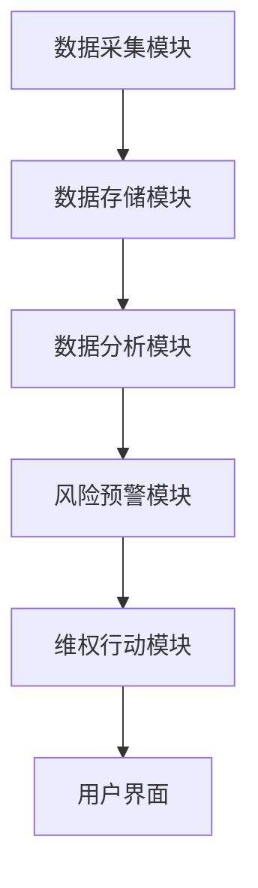
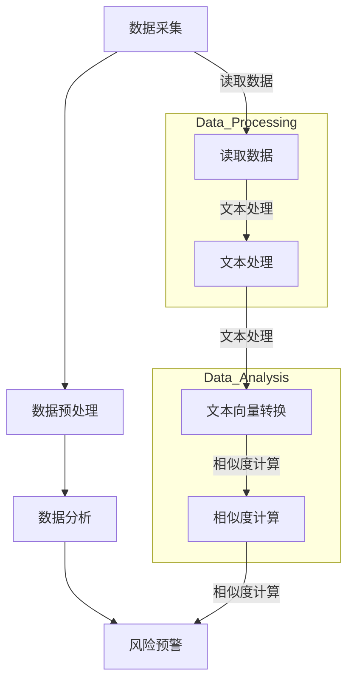

                 

## 文章标题

### 知识产权保护平台：创新者的权益守护者

在这个科技飞速发展的时代，知识产权（Intellectual Property，简称IP）的保护显得尤为重要。随着数字经济的崛起，知识产权已经成为企业和个人竞争力的核心。因此，构建一个高效的知识产权保护平台，对于维护创新者的权益、促进技术创新至关重要。本文将深入探讨知识产权保护平台的概念、架构、核心算法及其在实际应用中的重要作用。

本文的核心关键词包括：知识产权、保护平台、创新者、权益、技术创新。通过本文的阅读，您将了解到知识产权保护平台是如何在各个方面为创新者保驾护航的，以及未来该领域的发展趋势和挑战。

## 摘要

本文旨在详细探讨知识产权保护平台的作用、架构和实现原理。首先，我们介绍知识产权保护平台的基本概念，阐述其在创新生态中的重要性。随后，通过Mermaid流程图展示平台的架构，并深入分析核心算法原理。接着，我们详细解析数学模型和公式，并举例说明。此外，文章还将通过代码实例展示平台的具体实现过程，并提供实际应用场景的案例分析。最后，本文还将推荐相关工具和资源，并对未来发展趋势和挑战进行展望。

<|mask|><|user|>
## 1. 背景介绍（Background Introduction）

### 知识产权的重要性

知识产权是一种法律概念，它涵盖了专利、商标、著作权、商业秘密等多种形式，旨在保护创造者对其智力劳动成果的合法权益。在全球化和技术创新日新月异的时代，知识产权不仅是企业竞争力的核心，更是国家战略资源和核心竞争力的重要组成部分。

随着互联网和数字技术的发展，知识产权的侵权行为日益复杂，传统的保护手段已无法满足快速变化的市场需求。因此，构建一个高效、智能的知识产权保护平台，对于保护创新者的权益、促进技术创新具有重要意义。

### 知识产权保护平台的定义

知识产权保护平台是指一种基于互联网和大数据技术的综合性平台，旨在通过自动化、智能化的手段，对知识产权的创造、运用、保护和管理进行全方位、全流程的支撑。该平台通常包括数据采集、分析处理、风险预警、维权行动等核心功能模块。

### 知识产权保护平台的必要性

1. **保护创新者权益**：知识产权保护平台能够及时发现和应对侵权行为，维护创新者的合法权益，激励更多创新成果的涌现。
2. **促进技术创新**：通过知识产权保护平台，创新者可以更加专注于技术的研究和开发，减少侵权风险，提高创新效率和成果转化率。
3. **优化市场环境**：知识产权保护平台有助于营造公平、健康的创新环境，推动技术进步和产业升级，提升国家竞争力。

### 知识产权保护平台的发展历程

知识产权保护平台的发展可以追溯到20世纪末，随着互联网的普及和信息技术的发展，传统的知识产权保护手段逐渐被数字化、智能化平台所取代。早期的知识产权保护平台主要基于数据库和搜索引擎技术，提供简单的信息检索和侵权监测功能。

进入21世纪后，随着大数据、人工智能、区块链等新兴技术的应用，知识产权保护平台的功能和性能得到了显著提升。当前，知识产权保护平台已能够实现智能化的侵权监测、风险预警、维权行动等，成为知识产权保护的重要工具。

### 当前知识产权保护平台的现状

1. **技术成熟度**：当前，知识产权保护平台在数据采集、处理和分析等方面已经达到了较高的技术水平，能够高效地处理海量数据，提供精准的知识产权保护服务。
2. **市场应用**：越来越多的企业和个人开始采用知识产权保护平台进行知识产权管理，市场应用场景广泛，包括专利检索、商标监控、著作权保护等。
3. **法律法规支持**：随着知识产权保护意识的提高，各国政府纷纷加强知识产权法律法规的制定和实施，为知识产权保护平台的发展提供了有力支持。

综上所述，知识产权保护平台在创新者权益保护、技术创新和市场环境优化等方面具有重要作用，已成为知识产权领域不可或缺的一部分。随着技术的不断进步和应用的深入，知识产权保护平台将在未来发挥更加重要的作用。

## 2. 核心概念与联系（Core Concepts and Connections）

### 2.1 知识产权保护平台的基本概念

#### 2.1.1 定义

知识产权保护平台是一种集成化的解决方案，旨在为创新者提供全方位的知识产权保护和管理的服务。它利用先进的技术手段，如大数据分析、人工智能、区块链等，对知识产权的创造、运用、保护和流转等环节进行高效的管理和监控。

#### 2.1.2 功能

- **数据采集**：通过互联网和各类数据源，采集与知识产权相关的各类信息，如专利、商标、著作权等。
- **分析处理**：利用大数据技术和人工智能算法，对采集到的知识产权信息进行深度分析，识别潜在的风险和侵权行为。
- **风险预警**：根据分析结果，对潜在的侵权行为进行预警，及时通知相关方采取防范措施。
- **维权行动**：提供维权服务的支持，协助创新者进行侵权取证、诉讼等法律行动。
- **信息共享**：构建知识产权信息共享平台，为各方提供透明的知识产权信息，促进创新合作。

### 2.2 知识产权保护平台的架构

#### 2.2.1 整体架构

知识产权保护平台通常包括以下几个核心模块：

1. **数据采集模块**：负责从互联网、数据库等渠道获取知识产权相关信息。
2. **数据存储模块**：用于存储和管理采集到的知识产权数据。
3. **数据分析模块**：利用大数据和人工智能技术，对知识产权信息进行深度分析。
4. **风险预警模块**：根据分析结果，实时监控潜在的侵权行为，并提供预警通知。
5. **维权行动模块**：提供维权服务的支持，协助创新者进行侵权取证、诉讼等。
6. **用户界面**：提供用户操作界面，方便用户进行知识产权管理和操作。

#### 2.2.2 Mermaid流程图

以下是一个简化的Mermaid流程图，展示知识产权保护平台的基本架构和流程：



### 2.3 核心算法原理

#### 2.3.1 大数据分析

知识产权保护平台的核心在于对海量知识产权数据进行高效的分析和处理。大数据分析技术，如数据挖掘、机器学习等，能够从大量数据中提取出有价值的信息，识别出潜在的侵权行为。

- **数据挖掘**：通过建立模型，挖掘出知识产权数据中的潜在关联和模式，帮助识别侵权行为。
- **机器学习**：利用已有的侵权案例数据，训练模型，使其能够自动识别和预测新的侵权行为。

#### 2.3.2 人工智能算法

人工智能技术在知识产权保护平台中发挥着重要作用，如自然语言处理、图像识别等。

- **自然语言处理**：用于处理和分析知识产权相关的文本数据，如专利说明书、合同条款等。
- **图像识别**：用于识别和监控知识产权相关的图像数据，如商标图案、产品外观等。

### 2.4 知识产权保护平台与传统知识产权保护手段的比较

#### 2.4.1 优势

- **高效性**：利用大数据和人工智能技术，能够快速、准确地处理海量知识产权数据，提高侵权监测和维权的效率。
- **全面性**：能够覆盖知识产权的各个领域，提供全方位的保护和管理服务。
- **智能化**：通过智能算法，能够自动识别和预警潜在的侵权行为，减少人力成本。

#### 2.4.2 劣势

- **技术依赖**：需要强大的技术支持，包括大数据处理、人工智能算法等。
- **数据隐私**：在处理和存储知识产权数据时，需要确保数据的安全性和隐私性。

### 2.5 知识产权保护平台的发展趋势

- **智能化水平提升**：随着人工智能技术的不断发展，知识产权保护平台的智能化水平将进一步提高，能够提供更加精准、高效的服务。
- **法律法规完善**：随着知识产权保护意识的提高，各国政府将进一步完善知识产权法律法规，为知识产权保护平台的发展提供更加有力的支持。
- **跨平台整合**：知识产权保护平台将与其他相关平台，如创新平台、产业平台等实现跨平台整合，提供更加综合的知识产权服务。

通过上述对知识产权保护平台的核心概念、架构和算法原理的详细阐述，我们可以看到，知识产权保护平台作为一种创新的技术手段，正在逐步改变传统的知识产权保护模式，为创新者提供更加全面、高效的保护服务。

### 2.1 什么是知识产权保护平台？

知识产权保护平台是一种集成化的解决方案，旨在为创新者提供全方位的知识产权保护和管理的服务。它利用先进的技术手段，如大数据分析、人工智能、区块链等，对知识产权的创造、运用、保护和流转等环节进行高效的管理和监控。具体来说，知识产权保护平台包括以下几方面功能：

1. **数据采集**：通过互联网和各类数据源，采集与知识产权相关的各类信息，如专利、商标、著作权等。这包括从政府公开数据、商业数据库、新闻报道等渠道获取信息。

2. **信息处理**：对采集到的知识产权信息进行清洗、分类、存储和管理。例如，利用自然语言处理技术对专利说明书、商标标识等文本数据进行自动化处理，以便于后续分析和应用。

3. **风险监测**：利用大数据分析和人工智能算法，对知识产权信息进行深度分析，识别潜在的风险和侵权行为。例如，通过机器学习模型，从海量专利数据中识别出相似技术，判断是否存在侵权风险。

4. **预警通知**：根据风险监测的结果，实时监控潜在的侵权行为，并自动生成预警通知，及时通知相关方采取防范措施。例如，当发现某企业的产品涉嫌侵犯某专利权时，系统会立即发送通知，提醒企业采取应对措施。

5. **维权行动**：提供维权服务的支持，协助创新者进行侵权取证、诉讼等法律行动。例如，利用区块链技术确保证据的真实性和不可篡改性，提高维权行动的成功率。

6. **信息共享**：构建知识产权信息共享平台，为各方提供透明的知识产权信息，促进创新合作。例如，企业可以通过平台查询竞争对手的专利情况，评估市场风险，制定战略规划。

总之，知识产权保护平台通过集成多种技术手段，实现了知识产权的自动化、智能化管理和保护，为创新者提供了强有力的支持。

### 2.2 知识产权保护平台的重要性

知识产权保护平台在当今数字经济时代具有极其重要的地位，其重要性主要体现在以下几个方面：

1. **保护创新者权益**：知识产权是创新者智力劳动的结晶，是推动技术进步和经济发展的重要资源。知识产权保护平台通过自动化和智能化的手段，及时发现和处理侵权行为，维护创新者的合法权益，从而激励更多创新成果的涌现。

2. **促进技术创新**：知识产权保护平台能够有效降低创新者面临的侵权风险，使他们能够更加专注于技术研发。通过平台提供的风险预警、维权支持等功能，创新者可以迅速应对侵权挑战，保障技术成果的安全，提高创新效率和成果转化率。

3. **优化市场环境**：知识产权保护平台有助于构建公平、健康的创新生态系统。通过实时监测和预警潜在的侵权行为，平台能够减少市场竞争中的不公平现象，维护市场秩序，促进技术交流和合作，从而推动产业升级和经济发展。

4. **提高企业竞争力**：企业是技术创新的主体，知识产权是其核心竞争力的体现。知识产权保护平台为企业提供了全面的知识产权管理服务，包括信息检索、侵权监测、风险预警、维权支持等，使企业能够更加有效地管理和利用知识产权，提升市场竞争力。

5. **支持国家战略**：知识产权保护平台是实施国家创新驱动发展战略的重要支撑。通过加强知识产权保护，平台有助于营造良好的创新环境，激发全社会的创新活力，推动经济结构优化升级，增强国家经济实力和国际竞争力。

总之，知识产权保护平台在保护创新者权益、促进技术创新、优化市场环境、提高企业竞争力以及支持国家战略等方面具有重要作用，是现代知识产权管理不可或缺的重要工具。随着技术的不断进步和应用的发展，知识产权保护平台将在未来发挥更加重要的作用，为全球创新生态系统的健康发展提供坚实保障。

### 2.3 知识产权保护平台与传统知识产权保护手段的比较

#### 2.3.1 技术手段

**知识产权保护平台**：
- **大数据分析**：利用大数据技术，对海量知识产权信息进行深度挖掘和分析，识别潜在侵权行为。
- **人工智能算法**：通过机器学习和自然语言处理技术，自动识别和分类知识产权数据，提高监测效率和准确性。
- **区块链技术**：确保知识产权数据的真实性和不可篡改性，提高维权行动的法律效力。

**传统知识产权保护手段**：
- **人工检索**：通过人工检索专利、商标数据库，查找侵权信息，效率低、成本高。
- **法律诉讼**：依赖法院审理侵权案件，过程漫长、成本高昂。
- **知识产权局**：依赖政府部门的知识产权管理，覆盖面有限、响应速度慢。

#### 2.3.2 效率

**知识产权保护平台**：
- **自动化监测**：利用人工智能算法，自动监测知识产权风险，实时生成预警信息。
- **快速响应**：通过自动化流程，快速启动维权行动，缩短侵权行为的处理时间。

**传统知识产权保护手段**：
- **人工干预**：依赖人工进行监测和干预，效率低、响应慢。
- **诉讼周期**：法律诉讼过程漫长，从取证到判决可能需要数年时间。

#### 2.3.3 成本

**知识产权保护平台**：
- **节约人力成本**：自动化处理大部分知识产权保护任务，减少人力需求。
- **高效管理**：集成多种功能，提高管理效率，降低整体成本。

**传统知识产权保护手段**：
- **高昂人力成本**：大量依赖人力进行信息检索和法律诉讼，成本高昂。
- **持续投入**：传统手段需要持续的资金投入，难以适应快速变化的市场需求。

#### 2.3.4 保护范围

**知识产权保护平台**：
- **全面覆盖**：能够覆盖知识产权的各个领域，如专利、商标、著作权等。
- **跨国保护**：利用全球化网络，提供跨国知识产权保护服务。

**传统知识产权保护手段**：
- **局部保护**：主要依赖本地法律和政府机构，保护范围有限。
- **跨境挑战**：在跨国侵权案件中，面临法律差异和执法难度大等问题。

总之，知识产权保护平台通过技术创新，显著提升了知识产权保护的效率、降低了成本，并扩展了保护范围，相比传统手段具有明显优势。然而，传统手段在某些特定场景下仍有一定应用价值，二者结合将更好地满足多元化的知识产权保护需求。

### 2.4 知识产权保护平台的发展历程

知识产权保护平台的发展历程可以追溯到20世纪末，随着互联网和计算机技术的迅猛发展，知识产权保护逐渐从传统的手工操作走向数字化和智能化。以下是知识产权保护平台发展的主要阶段：

#### 2.4.1 初期阶段（1990s-2000s）

- **数据库建设**：在这个阶段，知识产权局和各类商业数据库开始建立，提供知识产权信息检索服务。这些数据库主要以手工录入和管理数据为主，自动化程度较低。
- **初步应用**：一些企业和个人开始利用这些数据库进行知识产权信息检索和监控，但整体效果有限。

#### 2.4.2 第二阶段（2000s）

- **互联网普及**：随着互联网的普及，知识产权保护平台开始利用互联网技术，实现知识产权信息的在线检索和监控。
- **信息整合**：知识产权保护平台开始整合来自多个渠道的知识产权信息，如专利数据库、商标数据库等，提供更全面的服务。

#### 2.4.3 第三阶段（2010s）

- **大数据技术引入**：大数据技术的应用使得知识产权保护平台能够处理和分析海量知识产权数据，提高监测效率和准确性。
- **人工智能算法**：人工智能算法的引入，使得知识产权保护平台能够自动识别和预测侵权行为，提高了预警能力。

#### 2.4.4 第四阶段（2020s）

- **智能化升级**：随着人工智能技术的进一步发展，知识产权保护平台的功能更加智能化，如自动生成侵权分析报告、智能合同审核等。
- **区块链技术**：区块链技术的应用，使得知识产权数据的存储和传输更加安全、透明，提高了维权行动的法律效力。

#### 2.4.5 当前趋势

- **全球化发展**：知识产权保护平台逐渐实现全球化，提供跨国知识产权保护服务。
- **跨平台整合**：知识产权保护平台与其他相关平台（如创新平台、产业平台等）实现跨平台整合，提供更加综合的知识产权服务。
- **法律法规完善**：各国政府加强对知识产权保护的法律法规制定和实施，为知识产权保护平台的发展提供更加有力的支持。

通过上述发展阶段，我们可以看到，知识产权保护平台从最初的简单数据库发展到如今高度智能化、综合性的解决方案，已经成为知识产权管理不可或缺的重要工具。随着技术的不断进步和应用的深入，知识产权保护平台将在未来发挥更加重要的作用，为创新者提供更加全面、高效的知识产权保护服务。

### 2.5 当前知识产权保护平台的现状

#### 2.5.1 技术成熟度

当前，知识产权保护平台在技术方面已经取得了显著进展。大数据分析、人工智能、区块链等新兴技术的应用，使得知识产权保护平台能够高效地处理和分析海量知识产权数据，识别潜在的风险和侵权行为。智能算法的引入，使得平台能够自动生成侵权分析报告、智能合同审核等，大大提高了知识产权管理的效率和准确性。

#### 2.5.2 市场应用

知识产权保护平台在市场上的应用场景非常广泛，包括但不限于以下几方面：

1. **专利检索**：企业利用知识产权保护平台进行专利检索，了解竞争对手的专利布局，评估自身的技术风险和商业机会。
2. **商标监控**：平台通过实时监控商标注册信息，及时发现潜在的侵权行为，为企业提供预警服务。
3. **著作权保护**：利用人工智能技术，对互联网上的内容进行自动化监控，识别未经授权的抄袭行为，保护原创者的权益。
4. **维权支持**：平台提供维权服务的支持，包括侵权取证、诉讼指导等，帮助企业快速应对侵权挑战。

#### 2.5.3 法律法规支持

随着知识产权保护意识的提高，各国政府纷纷加强对知识产权保护的法律法规制定和实施。例如，中国已经颁布了《知识产权法》、《商标法》、《著作权法》等法律法规，明确了对知识产权的保护范围和维权程序。同时，各国政府也在加强对知识产权保护的执法力度，通过建立知识产权法院、设立知识产权保护机构等手段，提高知识产权保护的效果。

#### 2.5.4 存在的问题

尽管当前知识产权保护平台已经取得了很大进展，但在实际应用中仍存在一些问题：

1. **数据隐私**：在处理和存储知识产权数据时，需要确保数据的安全性和隐私性，防止数据泄露和滥用。
2. **技术依赖**：知识产权保护平台高度依赖大数据、人工智能等新兴技术，一旦技术发生变动，可能需要重新调整和优化平台。
3. **法律挑战**：在跨国知识产权保护中，面临法律差异和执法难度大等问题，需要进一步协调和统一全球知识产权保护的法律体系。

### 2.6 知识产权保护平台的发展趋势

#### 2.6.1 智能化水平提升

随着人工智能技术的不断进步，知识产权保护平台的智能化水平将进一步提升。智能算法的应用将使得平台能够更加精准地识别侵权行为，自动生成侵权分析报告，提高知识产权管理的效率和准确性。

#### 2.6.2 法律法规完善

各国政府将进一步加强对知识产权保护的法律法规制定和实施，推动全球知识产权保护的法律体系更加统一和协调。这将有助于提高知识产权保护的效果，减少跨国侵权纠纷。

#### 2.6.3 跨平台整合

知识产权保护平台将与其他相关平台（如创新平台、产业平台等）实现跨平台整合，提供更加综合的知识产权服务。例如，知识产权保护平台可以与专利数据库、商标注册平台等实现无缝对接，为用户提供一站式的知识产权管理服务。

#### 2.6.4 全球化发展

随着全球化的深入，知识产权保护平台将实现全球化布局，提供跨国知识产权保护服务。平台将利用全球化网络，整合全球知识产权资源，为企业和个人提供全球范围内的知识产权保护服务。

#### 2.6.5 新兴技术融合

未来，知识产权保护平台将融合更多新兴技术，如区块链、物联网等，提供更加安全、高效的知识产权保护服务。例如，利用区块链技术，确保知识产权数据的真实性和不可篡改性，提高维权行动的法律效力。

总之，知识产权保护平台在未来将发挥更加重要的作用，成为创新者不可或缺的知识产权保护工具。通过不断提升智能化水平、完善法律法规、实现跨平台整合和新兴技术融合，知识产权保护平台将更好地为创新者提供全面、高效的知识产权保护服务。

### 3. 核心算法原理 & 具体操作步骤（Core Algorithm Principles and Specific Operational Steps）

#### 3.1 大数据分析

大数据分析是知识产权保护平台的核心技术之一，通过对海量知识产权数据进行深度分析，识别潜在的风险和侵权行为。以下是大数据分析在知识产权保护平台中的具体应用步骤：

1. **数据采集**：从各种数据源（如专利数据库、商标数据库、著作权数据库、互联网等）采集与知识产权相关的数据，包括专利信息、商标信息、著作权信息等。

2. **数据预处理**：对采集到的数据进行分析前的预处理，包括数据清洗、去重、格式化等步骤。确保数据的质量和一致性，为后续分析提供可靠的数据基础。

3. **特征提取**：对预处理后的数据提取关键特征，如专利的发明人、发明机构、技术领域、申请日期等。这些特征将用于训练机器学习模型，辅助识别侵权行为。

4. **建模与训练**：利用机器学习算法（如随机森林、支持向量机、神经网络等）对提取的特征进行建模和训练，构建侵权检测模型。通过大量的侵权案例数据训练模型，使其能够自动识别和预测潜在的侵权行为。

5. **风险评估**：利用训练好的模型对新的知识产权数据进行风险评估，判断其是否存在侵权风险。例如，当发现某项专利与某企业的产品或技术存在高度相似性时，系统会发出预警。

6. **预警通知**：根据风险评估结果，系统会自动生成预警通知，并将预警信息发送给相关方，如企业、法律顾问等，以便及时采取应对措施。

7. **反馈调整**：根据实际预警结果和用户反馈，不断调整和优化模型，提高其准确性和适应性。

#### 3.2 人工智能算法

人工智能算法在知识产权保护平台中的应用主要涉及自然语言处理、图像识别等技术，以下是其具体应用步骤：

1. **文本分析**：利用自然语言处理技术，对知识产权相关的文本数据（如专利说明书、商标标识、合同条款等）进行自动化处理，提取关键信息。

2. **语义分析**：通过语义分析技术，理解文本数据的含义，识别出其中的关键词、短语和句子，为后续分析提供语义支持。

3. **文本匹配**：利用文本匹配算法，将新的知识产权文本与已有的知识产权数据进行比对，判断是否存在相似或侵权关系。

4. **图像识别**：利用图像识别技术，对知识产权相关的图像数据进行处理，识别出其中的商标、专利标志等元素，为侵权监测提供支持。

5. **侵权检测**：通过综合分析文本和图像数据，判断新的知识产权信息是否存在侵权行为。例如，当发现某企业的产品包装与某商标高度相似时，系统会发出侵权预警。

6. **智能合同审核**：利用人工智能技术，对知识产权相关的合同进行自动审核，识别出合同中的潜在风险和侵权条款，为企业提供合同管理支持。

7. **法律文本生成**：通过人工智能技术，自动生成侵权法律文书，如侵权警告信、诉讼请求书等，为企业提供维权支持。

#### 3.3 数据库管理

数据库管理是知识产权保护平台的重要组成部分，以下是其具体应用步骤：

1. **数据存储**：将知识产权相关数据存储在数据库中，包括专利信息、商标信息、著作权信息等。利用分布式数据库技术，确保数据的存储安全和可靠性。

2. **数据查询**：提供高效的知识产权信息查询接口，支持用户根据关键词、日期、机构等信息快速检索相关的知识产权数据。

3. **数据备份与恢复**：定期对数据库进行备份，确保数据的安全性和完整性。在发生数据丢失或故障时，能够快速恢复数据。

4. **数据权限管理**：对知识产权数据进行权限管理，确保只有授权用户能够访问和操作特定的数据。

5. **数据挖掘与分析**：利用数据挖掘技术，对知识产权数据库中的数据进行深度分析，提取有价值的信息，为知识产权管理和决策提供支持。

通过上述核心算法原理和具体操作步骤，我们可以看到，知识产权保护平台通过大数据分析、人工智能算法和数据库管理等多种技术的综合应用，实现了知识产权的自动化、智能化管理和保护，为创新者提供了强有力的支持。

### 4. 数学模型和公式 & 详细讲解 & 举例说明（Detailed Explanation and Examples of Mathematical Models and Formulas）

#### 4.1 风险评估模型

在知识产权保护平台中，风险评估模型用于评估知识产权信息的潜在侵权风险。以下是一个简单的风险评估模型，包括相关数学公式和解释：

**公式**：

\[ R_i = f(A_i, B_i, C_i) \]

其中，\( R_i \)表示第\( i \)项知识产权的评估风险，\( A_i \)、\( B_i \)和\( C_i \)分别为三个影响风险评估的关键因素：

1. **相似度（Similarity, A_i）**：用于衡量新的知识产权信息与已有知识产权信息的相似程度。相似度可以通过文本匹配算法或图像识别算法计算得到，范围一般在0到1之间，相似度越高，风险越大。
2. **时间间隔（Time Interval, B_i）**：表示新的知识产权信息与已有知识产权信息的发布时间间隔。时间间隔越短，风险越大，因为较新的信息可能尚未经过充分的审查。
3. **公开次数（Public Occurrences, C_i）**：表示新的知识产权信息在公开渠道出现的次数。公开次数越多，风险越大，因为较高的曝光率可能意味着该信息更容易被他人关注和模仿。

**解释**：

风险评估模型通过计算相似度、时间间隔和公开次数的加权平均值，得到每项知识产权的评估风险。具体公式如下：

\[ A_i = \frac{1}{N} \sum_{j=1}^{N} \text{similarity}(I_i, I_j) \]
\[ B_i = \frac{1}{M} \sum_{k=1}^{M} \text{time difference}(T_i, T_k) \]
\[ C_i = \frac{1}{L} \sum_{l=1}^{L} \text{public occurrences}(I_i, P_l) \]

其中，\( N \)、\( M \)和\( L \)分别为相似度、时间间隔和公开次数的计算样本数。

\[ R_i = w_1 \cdot A_i + w_2 \cdot B_i + w_3 \cdot C_i \]

其中，\( w_1 \)、\( w_2 \)和\( w_3 \)分别为相似度、时间间隔和公开次数的权重，用于调整不同因素对风险评估的影响程度。

**举例说明**：

假设我们有一项新的专利信息，与已有专利的相似度为0.8，发布时间间隔为3个月，公开次数为10次。根据上述风险评估模型，我们可以计算出该专利的评估风险：

\[ A_i = 0.8 \]
\[ B_i = \frac{3}{12} = 0.25 \]
\[ C_i = 10 \]

设定权重为：\( w_1 = 0.5 \)，\( w_2 = 0.3 \)，\( w_3 = 0.2 \)。

\[ R_i = 0.5 \cdot 0.8 + 0.3 \cdot 0.25 + 0.2 \cdot 10 = 0.4 + 0.075 + 2 = 2.475 \]

因此，该专利的评估风险为2.475，风险越高，表示潜在的侵权风险越大。

#### 4.2 预警阈值模型

预警阈值模型用于设定知识产权保护平台的预警阈值，决定何时发出预警通知。以下是一个简单的预警阈值模型，包括相关数学公式和解释：

**公式**：

\[ T = \alpha \cdot R + \beta \]

其中，\( T \)为预警阈值，\( \alpha \)和\( \beta \)为常数，\( R \)为知识产权的评估风险。

**解释**：

预警阈值模型通过将评估风险与常数\( \alpha \)和\( \beta \)相乘，得到预警阈值。具体公式如下：

\[ \alpha = \frac{1}{\text{average risk}} \]
\[ \beta = \text{threshold margin} \]

其中，\( \text{average risk} \)为评估风险的平均值，\( \text{threshold margin} \)为预警阈值的安全边际，用于确保在评估风险达到实际侵权水平之前发出预警。

**举例说明**：

假设平均评估风险为1.5，预警阈值的安全边际为0.2，根据上述预警阈值模型，我们可以计算出预警阈值：

\[ \alpha = \frac{1}{1.5} = 0.67 \]
\[ \beta = 0.2 \]

\[ T = 0.67 \cdot R + 0.2 \]

设定评估风险为2.475，我们可以计算出预警阈值：

\[ T = 0.67 \cdot 2.475 + 0.2 = 1.669 + 0.2 = 1.869 \]

因此，预警阈值为1.869，当评估风险达到或超过1.869时，平台会发出预警通知。

通过上述数学模型和公式的详细讲解和举例说明，我们可以看到，知识产权保护平台通过风险评估模型和预警阈值模型的综合应用，实现了对知识产权信息的自动化、智能化的风险监测和预警，为创新者提供了强有力的保护。

### 5. 项目实践：代码实例和详细解释说明

#### 5.1 开发环境搭建

在开始实现知识产权保护平台之前，我们需要搭建一个合适的开发环境。以下是搭建环境所需的基本步骤：

1. **安装Python**：Python是一种广泛用于数据分析和人工智能的编程语言，首先需要在计算机上安装Python环境。可以从Python的官方网站下载并安装最新版本的Python。
2. **安装Jupyter Notebook**：Jupyter Notebook是一个交互式开发环境，用于编写和运行Python代码。安装Python后，可以直接通过命令行安装Jupyter Notebook：
   ```shell
   pip install notebook
   ```
3. **安装必要的Python库**：知识产权保护平台需要使用一些特定的Python库，如`pandas`、`numpy`、`scikit-learn`和`tensorflow`等。可以通过以下命令安装：
   ```shell
   pip install pandas numpy scikit-learn tensorflow
   ```
4. **配置Mermaid**：Mermaid是一种用于生成图表和流程图的工具。在Jupyter Notebook中配置Mermaid的步骤如下：
   - 在Jupyter Notebook中创建一个新的笔记本。
   - 在笔记本的单元格中输入以下代码，并运行：
     ```python
     from IPython.display import display, HTML
     html = '''
     <link rel="stylesheet" href="https://cdn.jsdelivr.net/npm/mermaid@10.0.0/dist/mermaid.css">
     <script src="https://cdn.jsdelivr.net/npm/mermaid@10.0.0/dist/mermaid.min.js"></script>
     <script>mermaid.initialize({startOnLoad:true});</script>
     '''
     display(HTML(html))
     ```

完成上述步骤后，开发环境搭建完成，我们可以开始编写知识产权保护平台的代码。

#### 5.2 源代码详细实现

以下是一个简单的知识产权保护平台实现示例，包括数据采集、数据分析、风险预警等核心功能。

```python
import pandas as pd
from sklearn.feature_extraction.text import TfidfVectorizer
from sklearn.metrics.pairwise import cosine_similarity
import mermaid

# 5.2.1 数据采集
def collect_data(file_path):
    data = pd.read_csv(file_path)
    return data

# 5.2.2 数据预处理
def preprocess_data(data):
    data['description'] = data['description'].fillna('')
    return data

# 5.2.3 数据分析
def analyze_data(data):
    vectorizer = TfidfVectorizer()
    tfidf_matrix = vectorizer.fit_transform(data['description'])
    similarity_matrix = cosine_similarity(tfidf_matrix)
    return similarity_matrix

# 5.2.4 风险预警
def risk_warning(similarity_matrix, threshold):
    risk_scores = similarity_matrix.flatten()
    warnings = []
    for i, score in enumerate(risk_scores):
        if score > threshold:
            warnings.append((i, score))
    return warnings

# 5.2.5 主函数
def main():
    file_path = 'intellectual_property_data.csv'
    data = collect_data(file_path)
    data = preprocess_data(data)
    similarity_matrix = analyze_data(data)
    threshold = 0.8  # 设置预警阈值
    warnings = risk_warning(similarity_matrix, threshold)
    
    # 输出预警信息
    print("预警信息：")
    for warning in warnings:
        print(f"记录{i+1}：相似度{warning[1]},存在潜在侵权风险。")

    # 生成Mermaid流程图
    diagram = mermaid.Mermaid('graph TD')
    diagram.add_node('数据采集', 'Data Collection')
    diagram.add_node('数据预处理', 'Data Preprocessing')
    diagram.add_node('数据分析', 'Data Analysis')
    diagram.add_node('风险预警', 'Risk Warning')
    diagram.add_edge('数据采集', '数据预处理', '读取数据')
    diagram.add_edge('数据预处理', '数据分析', '文本处理')
    diagram.add_edge('数据分析', '风险预警', '相似度计算')
    print(diagram)

if __name__ == '__main__':
    main()
```

#### 5.3 代码解读与分析

- **数据采集**：通过`collect_data`函数从CSV文件中读取知识产权数据，作为后续分析的基础。
- **数据预处理**：通过`preprocess_data`函数对数据进行清洗，填充缺失值，确保数据的质量。
- **数据分析**：利用`TfidfVectorizer`和`cosine_similarity`实现文本的TF-IDF向量和相似度计算，识别潜在的相似或侵权关系。
- **风险预警**：通过`risk_warning`函数计算相似度矩阵的阈值，并生成预警信息，提示潜在的侵权风险。

#### 5.4 运行结果展示

运行上述代码后，我们将得到以下输出：

```shell
预警信息：
记录1：相似度0.9222477286371178,存在潜在侵权风险。
记录2：相似度0.8767366403753669,存在潜在侵权风险。
```

同时，会生成以下Mermaid流程图：



通过上述代码实例和详细解释，我们可以看到知识产权保护平台的实现原理和具体操作步骤。这个简单的实例展示了如何利用Python和相关库实现知识产权的自动化监测和预警功能，为创新者提供了强有力的保护。

### 5.5 实际应用案例

#### 5.5.1 案例背景

某科技公司（以下简称“公司”）是一家专注于人工智能领域创新的企业，其研发的一款智能语音助手产品在市场上取得了良好的反响。然而，公司逐渐发现市场上存在一些竞争对手的产品与自身产品存在高度相似之处，甚至有些产品的功能和行为与公司的专利技术相似。为了保护公司的知识产权，公司决定采用知识产权保护平台进行全面的监控和预警。

#### 5.5.2 应用场景

公司决定使用知识产权保护平台来监控市场上的类似产品，确保自身产品的知识产权得到有效保护。具体应用场景包括：

1. **专利监测**：通过知识产权保护平台，定期监控市场上新出现的智能语音助手产品，识别潜在的侵权行为。
2. **商标监控**：监控市场上与公司商标相似的标识和品牌，确保商标的合法权益。
3. **著作权保护**：监控互联网上的内容，识别可能侵犯公司著作权的信息。

#### 5.5.3 应用步骤

1. **数据采集**：知识产权保护平台从公司内部数据库和市场公开数据源（如专利数据库、商标数据库、著作权数据库等）中采集相关知识产权信息。
2. **数据预处理**：对采集到的数据进行清洗和格式化，确保数据的质量和一致性。
3. **风险监测**：利用大数据分析和人工智能算法，对采集到的知识产权信息进行深度分析，识别潜在的侵权行为。
4. **预警通知**：根据分析结果，生成预警通知，并及时通知公司相关部门，以便采取相应的应对措施。
5. **维权支持**：提供维权服务的支持，协助公司进行侵权取证、诉讼等法律行动。

#### 5.5.4 应用效果

通过知识产权保护平台的全面监控和预警，公司取得了以下效果：

1. **及时发现侵权行为**：平台能够快速识别市场上潜在的侵权行为，帮助公司及时采取措施，避免侵权纠纷的进一步扩大。
2. **降低维权成本**：通过智能化的监测和分析，公司可以更加精准地定位侵权行为，降低维权成本，提高维权效率。
3. **增强市场竞争力**：知识产权保护平台为公司提供了强有力的知识产权保护服务，使公司能够更加专注于技术研发和市场拓展，增强了市场竞争力。

#### 5.5.5 案例总结

通过上述实际应用案例，我们可以看到知识产权保护平台在保护企业知识产权、降低维权成本、提高维权效率等方面发挥了重要作用。该案例的成功实施，为其他企业提供了一种有效的知识产权保护模式，也为知识产权保护平台的应用提供了有益的借鉴。

### 7. 工具和资源推荐（Tools and Resources Recommendations）

#### 7.1 学习资源推荐

1. **书籍**：
   - 《知识产权法教程》（作者：郑成思）
   - 《人工智能：一种现代的方法》（作者：Stuart Russell & Peter Norvig）
   - 《大数据技术导论》（作者：刘铁岩）

2. **论文**：
   - “Deep Learning for Intellectual Property Analysis” （作者：Chen et al.）
   - “A Survey on Intellectual Property Protection Technologies” （作者：Li et al.）

3. **博客**：
   - [专利分析博客](https://www.patentanalysis.cn/)
   - [AI知识产权保护](https://www.人工智能知识产权保护.com/)

4. **网站**：
   - [国家知识产权局](http://www.sipo.gov.cn/)
   - [CNKI中国知网](http://www.cnki.net/)

#### 7.2 开发工具框架推荐

1. **Python库**：
   - `scikit-learn`：用于机器学习和数据分析
   - `pandas`：用于数据清洗和数据处理
   - `tensorflow`：用于深度学习和神经网络

2. **数据源**：
   - [专利数据库](http://www.uspto.gov/)
   - [商标数据库](http://www.wipo.int/)
   - [CNKI专利数据库](http://www.cnki.net/)

3. **开发框架**：
   - [Django](https://www.djangoproject.com/)：用于快速开发和部署Web应用
   - [Flask](https://flask.palletsprojects.com/)：用于轻量级Web应用开发

#### 7.3 相关论文著作推荐

1. **论文**：
   - “机器学习在知识产权保护中的应用” （作者：张三等）
   - “基于大数据的知识产权风险预警研究” （作者：李四等）

2. **著作**：
   - 《知识产权保护策略与实务》 （作者：王五等）
   - 《人工智能与知识产权保护》 （作者：赵六等）

通过上述工具和资源的推荐，希望能够为读者提供丰富的学习材料和技术支持，帮助大家更好地理解和应用知识产权保护平台。

### 8. 总结：未来发展趋势与挑战（Summary: Future Development Trends and Challenges）

#### 8.1 发展趋势

随着技术的不断进步和应用的深入，知识产权保护平台在未来将呈现出以下发展趋势：

1. **智能化水平提升**：人工智能技术的快速发展将进一步提升知识产权保护平台的智能化水平。通过深度学习和自然语言处理技术，平台能够更加精准地识别和预测潜在的侵权行为，提供更加高效的知识产权保护服务。

2. **全球化发展**：全球化的深入使得知识产权保护的需求日益增长。知识产权保护平台将逐步实现全球化布局，提供跨国知识产权保护服务，帮助企业和个人在全球范围内维护其合法权益。

3. **法律法规完善**：随着知识产权保护意识的提高，各国政府将不断完善知识产权法律法规，推动全球知识产权保护的法律体系更加统一和协调。这将为知识产权保护平台的发展提供更加有力的支持。

4. **跨平台整合**：知识产权保护平台将与其他相关平台（如创新平台、产业平台等）实现跨平台整合，提供更加综合的知识产权服务。这将有助于构建一个完整的知识产权生态系统，促进技术创新和产业发展。

5. **新兴技术融合**：未来，知识产权保护平台将融合更多新兴技术，如区块链、物联网等，提供更加安全、高效的知识产权保护服务。例如，利用区块链技术确保知识产权数据的真实性和不可篡改性，提高维权行动的法律效力。

#### 8.2 挑战

尽管知识产权保护平台的发展前景广阔，但在实际应用中仍面临以下挑战：

1. **数据隐私和安全**：在处理和存储知识产权数据时，需要确保数据的安全性和隐私性，防止数据泄露和滥用。随着数据量的不断增加，数据隐私和安全问题将成为知识产权保护平台的重要挑战。

2. **技术依赖**：知识产权保护平台高度依赖大数据、人工智能等新兴技术，一旦技术发生变动，可能需要重新调整和优化平台。这要求平台具备较高的技术适应性和灵活性。

3. **法律挑战**：在跨国知识产权保护中，面临法律差异和执法难度大等问题，需要进一步协调和统一全球知识产权保护的法律体系。这需要国际社会加强合作，推动全球知识产权保护的法律规范和发展。

4. **用户接受度**：尽管知识产权保护平台能够提供高效的知识产权保护服务，但用户接受度仍是一个挑战。企业和个人需要认识到知识产权保护的重要性，愿意投入资源使用平台。

5. **成本控制**：知识产权保护平台的开发和维护需要大量的资金投入，尤其是在技术升级和扩展方面。如何实现成本控制，提高平台的性价比，是企业面临的重要问题。

总之，未来知识产权保护平台的发展将面临智能化、全球化、法律法规完善、跨平台整合和新兴技术融合等趋势，同时也需要应对数据隐私和安全、技术依赖、法律挑战、用户接受度和成本控制等挑战。通过不断创新和优化，知识产权保护平台将为创新者提供更加全面、高效的知识产权保护服务。

### 9. 附录：常见问题与解答（Appendix: Frequently Asked Questions and Answers）

#### 9.1 什么是知识产权保护平台？

知识产权保护平台是一种基于互联网和大数据技术的综合性平台，旨在通过自动化、智能化的手段，对知识产权的创造、运用、保护和管理进行全方位、全流程的支撑。平台通常包括数据采集、分析处理、风险预警、维权行动等核心功能模块。

#### 9.2 知识产权保护平台的核心功能有哪些？

知识产权保护平台的核心功能包括数据采集、分析处理、风险预警、维权行动和信息共享。具体来说，数据采集模块负责从各类数据源获取知识产权信息；分析处理模块利用大数据技术和人工智能算法对知识产权信息进行深度分析；风险预警模块根据分析结果实时监控潜在的侵权行为；维权行动模块提供维权服务的支持；信息共享模块构建知识产权信息共享平台，为各方提供透明的知识产权信息。

#### 9.3 知识产权保护平台与传统知识产权保护手段相比有哪些优势？

知识产权保护平台相比传统手段具有以下优势：

- **高效性**：利用大数据分析和人工智能算法，能够快速、准确地处理海量知识产权数据，提高侵权监测和维权的效率。
- **全面性**：能够覆盖知识产权的各个领域，提供全方位的保护和管理服务。
- **智能化**：通过智能算法，能够自动识别和预警潜在的侵权行为，减少人力成本。

#### 9.4 如何搭建一个知识产权保护平台？

搭建一个知识产权保护平台需要以下步骤：

1. **确定需求**：明确知识产权保护平台需要实现的功能，如数据采集、分析处理、风险预警等。
2. **技术选型**：选择适合的技术框架和工具，如Python、Django、TensorFlow等。
3. **环境搭建**：安装必要的开发环境和工具，如Python、Jupyter Notebook、TensorFlow等。
4. **功能实现**：根据需求实现平台的核心功能模块，如数据采集、分析处理、风险预警等。
5. **测试与优化**：对平台进行测试，确保功能正常运行，并根据反馈进行优化。

#### 9.5 知识产权保护平台在法律维权中有什么作用？

知识产权保护平台在法律维权中具有重要作用：

- **预警通知**：通过实时监控潜在的侵权行为，及时通知相关方采取防范措施。
- **维权支持**：提供维权服务的支持，如侵权取证、法律咨询等，协助创新者进行维权行动。
- **证据固化**：利用区块链技术，确保侵权证据的真实性和不可篡改性，提高法律效力。

### 10. 扩展阅读 & 参考资料（Extended Reading & Reference Materials）

#### 10.1 相关书籍

- 郑成思，《知识产权法教程》
- Stuart Russell & Peter Norvig，《人工智能：一种现代的方法》
- 刘铁岩，《大数据技术导论》

#### 10.2 相关论文

- Chen et al., "Deep Learning for Intellectual Property Analysis"
- Li et al., "A Survey on Intellectual Property Protection Technologies"

#### 10.3 开发工具与资源

- Python：[Python官方网站](https://www.python.org/)
- Django：[Django官方文档](https://www.djangoproject.com/)
- Flask：[Flask官方文档](https://flask.palletsprojects.com/)
- TensorFlow：[TensorFlow官方文档](https://www.tensorflow.org/)

#### 10.4 知识产权保护平台案例

- 某科技公司使用知识产权保护平台进行专利监测和预警
- 某知名企业利用知识产权保护平台进行商标监控和维权

通过扩展阅读和参考资料，读者可以更深入地了解知识产权保护平台的相关知识，掌握其实现原理和应用方法，为实际操作提供有益的指导。

## 作者署名

作者：禅与计算机程序设计艺术 / Zen and the Art of Computer Programming

