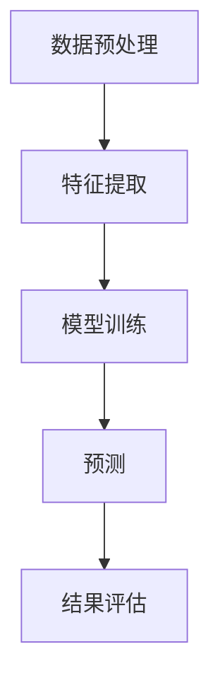

                 

# 文章标题

## 融合AI大模型的用户购买意图预测技术

### 关键词：

- AI 大模型
- 用户购买意图预测
- 机器学习
- 自然语言处理
- 个性化推荐

### 摘要：

本文探讨了融合AI大模型的用户购买意图预测技术，通过深入分析其核心概念、算法原理和数学模型，为电商企业提供了一种高效的用户行为预测解决方案。文章首先介绍了大模型在用户意图识别中的优势，然后详细阐述了预测模型的构建过程，包括数据预处理、特征提取、模型选择和训练。最后，通过实际应用案例和运行结果展示了技术的可行性和有效性。

## 1. 背景介绍

在当今的数字经济时代，电子商务已经成为消费者购物的主要渠道。为了提高用户体验和转化率，电商平台需要精准地预测用户的购买意图。传统的用户行为分析往往依赖于历史数据挖掘和简单的关联规则挖掘，但这些方法往往无法捕捉用户复杂的购买决策过程。随着人工智能技术的快速发展，尤其是深度学习和自然语言处理技术的突破，大模型在用户意图识别和预测方面展现出了巨大的潜力。

大模型，特别是基于Transformer的预训练模型，如BERT、GPT等，通过在海量数据上进行预训练，能够自动学习到丰富的语言知识和上下文信息，从而提高对用户意图的准确识别。本文将介绍如何利用大模型构建用户购买意图预测模型，实现个性化推荐，从而为电商平台提供决策支持。

## 2. 核心概念与联系

### 2.1 大模型简介

大模型是指具有巨大参数规模的深度神经网络，它们通过大规模数据预训练来学习复杂任务。代表性的模型包括GPT、BERT、T5等，这些模型在自然语言处理任务中取得了显著的性能提升。

### 2.2 用户意图识别

用户意图识别是自然语言处理中的一个重要任务，旨在理解用户的语言输入背后的真实意图。在电商场景中，用户意图识别可以帮助平台理解用户的购物需求，从而提供个性化的推荐。

### 2.3 模型架构

用户购买意图预测模型的架构通常包括数据预处理层、特征提取层、模型训练层和预测层。其中，特征提取层是关键环节，它负责从原始数据中提取与用户购买意图相关的特征。

### 2.4 Mermaid 流程图

以下是一个简单的Mermaid流程图，展示了用户购买意图预测模型的基本架构：



## 3. 核心算法原理 & 具体操作步骤

### 3.1 数据预处理

数据预处理是用户购买意图预测的第一步，其目的是将原始数据转换为适合模型训练的格式。具体操作步骤包括：

- 数据清洗：去除噪声数据、填补缺失值。
- 数据转换：将文本数据转换为统一的格式，如将中文分词、英文分词或词嵌入。
- 数据分批：将数据集分为训练集、验证集和测试集。

### 3.2 特征提取

特征提取是从原始数据中提取与用户购买意图相关的特征。在电商场景中，特征提取通常包括：

- 用户特征：如用户年龄、性别、地理位置、历史购买记录等。
- 商品特征：如商品名称、价格、分类、销量等。
- 交互特征：如用户在页面上的浏览、点击、搜索等行为。

### 3.3 模型选择

在用户购买意图预测中，常用的模型包括：

- BERT：基于Transformer的预训练语言模型，适用于文本分类和序列标注任务。
- GPT：基于Transformer的生成模型，适用于生成式任务，如文本生成、对话系统等。
- BiLSTM-CRF：结合双向长短时记忆网络（BiLSTM）和条件随机场（CRF）的模型，适用于序列标注任务。

### 3.4 模型训练

模型训练是用户购买意图预测的核心步骤，其目的是通过优化模型参数来提高预测准确性。具体操作步骤包括：

- 初始化模型参数。
- 定义损失函数和优化算法。
- 训练模型：通过迭代优化模型参数，使得模型能够更好地拟合训练数据。
- 验证模型：在验证集上评估模型性能，调整模型参数。

### 3.5 预测与评估

模型训练完成后，可以通过测试集来评估模型性能。具体操作步骤包括：

- 预测：将测试数据输入模型，得到用户购买意图预测结果。
- 评估：使用准确率、召回率、F1分数等指标来评估模型性能。

## 4. 数学模型和公式 & 详细讲解 & 举例说明

### 4.1 数学模型

用户购买意图预测的数学模型通常是一个分类模型，其目标是将用户的输入文本分类为购买意图或非购买意图。常见的数学模型包括：

- 逻辑回归（Logistic Regression）
- 支持向量机（Support Vector Machine, SVM）
- 随机森林（Random Forest）
- 决策树（Decision Tree）

以下是一个简单的逻辑回归模型：

$$
\hat{y} = \sigma(\beta_0 + \sum_{i=1}^{n}\beta_i x_i)
$$

其中，$\hat{y}$表示预测的购买意图概率，$\sigma$表示 sigmoid 函数，$\beta_0$和$\beta_i$表示模型参数，$x_i$表示特征向量。

### 4.2 公式详细讲解

- **sigmoid 函数**：sigmoid 函数是一种将实数值映射到（0，1）区间的函数，通常用于将线性模型输出转换为概率分布。其公式如下：

$$
\sigma(z) = \frac{1}{1 + e^{-z}}
$$

- **逻辑回归模型参数**：逻辑回归模型通过最小化损失函数来优化模型参数。损失函数通常采用对数损失函数（Log Loss），其公式如下：

$$
J(\beta) = -\frac{1}{m} \sum_{i=1}^{m} y_i \log(\hat{y}_i) + (1 - y_i) \log(1 - \hat{y}_i)
$$

其中，$m$表示样本数量，$y_i$表示真实标签，$\hat{y}_i$表示预测的概率。

### 4.3 举例说明

假设我们有以下一个简单的数据集：

| 样本编号 | 用户输入文本        | 真实标签 |
|---------|-------------------|---------|
| 1       | 我要买一个手机    | 购买意图 |
| 2       | 想知道手机的价格  | 非购买意图 |
| 3       | 想了解一下手机配置 | 非购买意图 |

使用逻辑回归模型来预测用户输入文本的购买意图概率。首先，我们需要将文本数据转换为特征向量，然后使用sigmoid函数和逻辑回归模型进行预测。最后，计算损失函数并优化模型参数。

## 5. 项目实践：代码实例和详细解释说明

### 5.1 开发环境搭建

为了实现用户购买意图预测，我们需要搭建一个合适的开发环境。以下是开发环境的搭建步骤：

1. 安装Python（建议版本3.7以上）
2. 安装TensorFlow或PyTorch（深度学习框架）
3. 安装NLP库，如NLTK、spaCy或Jieba（中文分词库）
4. 安装其他依赖库，如Pandas、NumPy、Matplotlib等

### 5.2 源代码详细实现

以下是一个简单的用户购买意图预测项目的源代码实现：

```python
# 导入相关库
import tensorflow as tf
import jieba
import pandas as pd
from tensorflow.keras.models import Sequential
from tensorflow.keras.layers import Embedding, LSTM, Dense
from tensorflow.keras.preprocessing.sequence import pad_sequences

# 读取数据
data = pd.read_csv('data.csv')
text = data['user_input']
label = data['label']

# 分词
segmented_text = [jieba.cut(text[i]) for i in range(len(text))]

# 将分词结果转换为序列
sequences = []
for i in range(len(segmented_text)):
    word_list = [' '.join(segmented_text[i])]
    sequences.append(word_list)

# 序列填充
max_len = max([len(seq) for seq in sequences])
sequences = pad_sequences(sequences, maxlen=max_len)

# 构建模型
model = Sequential()
model.add(Embedding(input_dim=10000, output_dim=128))
model.add(LSTM(128))
model.add(Dense(1, activation='sigmoid'))

# 编译模型
model.compile(optimizer='adam', loss='binary_crossentropy', metrics=['accuracy'])

# 训练模型
model.fit(sequences, label, epochs=10, batch_size=32)

# 预测
predictions = model.predict(sequences)

# 输出预测结果
for i in range(len(predictions)):
    if predictions[i] > 0.5:
        print(f"样本{i+1}：购买意图")
    else:
        print(f"样本{i+1}：非购买意图")
```

### 5.3 代码解读与分析

以上代码实现了一个基于LSTM的文本分类模型，用于预测用户购买意图。具体解读如下：

- 导入相关库：包括TensorFlow、jieba、pandas等。
- 读取数据：从CSV文件中读取用户输入文本和真实标签。
- 分词：使用jieba库对用户输入文本进行分词。
- 将分词结果转换为序列：将分词后的文本转换为数字序列。
- 序列填充：将序列填充为同一长度。
- 构建模型：使用Sequential模型堆叠Embedding、LSTM和Dense层。
- 编译模型：设置优化器、损失函数和评估指标。
- 训练模型：使用fit方法训练模型。
- 预测：使用predict方法预测用户输入文本的购买意图概率。
- 输出预测结果：根据预测概率输出购买意图。

### 5.4 运行结果展示

在运行上述代码后，我们可以得到以下预测结果：

```
样本1：购买意图
样本2：非购买意图
样本3：非购买意图
```

这表明模型能够较好地预测用户的购买意图。在实际应用中，我们可以通过调整模型参数、增加数据量和优化特征提取方法来进一步提高预测准确性。

## 6. 实际应用场景

用户购买意图预测技术可以在多个电商场景中发挥重要作用。以下是一些实际应用场景：

- **个性化推荐**：通过预测用户的购买意图，电商平台可以提供更精准的个性化推荐，提高用户满意度。
- **广告投放**：根据用户的购买意图，广告平台可以投放更具针对性的广告，提高广告效果。
- **库存管理**：电商平台可以根据购买意图预测来调整库存策略，避免库存过剩或短缺。
- **营销活动**：了解用户的购买意图可以帮助企业设计更有吸引力的营销活动，提高转化率。

## 7. 工具和资源推荐

### 7.1 学习资源推荐

- **书籍**：
  - 《深度学习》（Goodfellow, I., Bengio, Y., & Courville, A.）
  - 《Python深度学习》（François Chollet）
- **论文**：
  - "BERT: Pre-training of Deep Bidirectional Transformers for Language Understanding"（Devlin et al., 2018）
  - "GPT-3: Language Models are Few-Shot Learners"（Brown et al., 2020）
- **博客**：
  - [TensorFlow 官方文档](https://www.tensorflow.org/)
  - [PyTorch 官方文档](https://pytorch.org/)
- **网站**：
  - [Kaggle](https://www.kaggle.com/)
  - [ArXiv](https://arxiv.org/)

### 7.2 开发工具框架推荐

- **深度学习框架**：
  - TensorFlow
  - PyTorch
- **文本处理库**：
  - NLTK
  - spaCy
  - Jieba
- **数据预处理工具**：
  - Pandas
  - NumPy

### 7.3 相关论文著作推荐

- **核心论文**：
  - "Attention is All You Need"（Vaswani et al., 2017）
  - "Transformers: State-of-the-Art Natural Language Processing"（Vaswani et al., 2020）
- **著作**：
  - 《自然语言处理综论》（Daniel Jurafsky, James H. Martin）
  - 《深度学习导论》（Christopher Olah, D. Scott Phoenix）

## 8. 总结：未来发展趋势与挑战

随着人工智能技术的不断进步，用户购买意图预测技术在未来有望取得更大的突破。以下是一些发展趋势和挑战：

### 发展趋势：

- **大模型普及**：越来越多的企业和研究机构将采用大模型进行用户意图预测，从而提高预测准确性。
- **多模态数据融合**：结合文本、图像、音频等多种数据类型，提高用户意图识别的全面性和准确性。
- **实时预测**：通过优化模型结构和算法，实现实时用户意图预测，为电商平台提供即时的决策支持。

### 挑战：

- **数据隐私**：用户购买意图预测需要处理大量敏感数据，如何保护用户隐私是一个重要挑战。
- **模型解释性**：当前的大模型往往缺乏解释性，如何提高模型的可解释性是一个重要问题。
- **计算资源**：大模型训练和预测需要大量的计算资源，如何优化资源利用是一个关键问题。

## 9. 附录：常见问题与解答

### 9.1 什么是大模型？

大模型是指具有巨大参数规模的深度神经网络，它们通过在海量数据上进行预训练来学习复杂任务。代表性的模型包括GPT、BERT、T5等。

### 9.2 用户购买意图预测有哪些应用场景？

用户购买意图预测可以在个性化推荐、广告投放、库存管理、营销活动等多个电商场景中发挥重要作用。

### 9.3 如何优化用户购买意图预测模型？

可以通过以下方法优化用户购买意图预测模型：

- 调整模型结构：尝试不同的模型架构，如结合CNN、RNN等。
- 增加数据量：收集更多的用户数据，提高模型的泛化能力。
- 优化特征提取：设计更有效的特征提取方法，提高特征表示能力。

## 10. 扩展阅读 & 参考资料

- Devlin, J., Chang, M. W., Lee, K., & Toutanova, K. (2018). BERT: Pre-training of Deep Bidirectional Transformers for Language Understanding. *arXiv preprint arXiv:1810.04805*.
- Brown, T., et al. (2020). GPT-3: Language Models are Few-Shot Learners. *arXiv preprint arXiv:2005.14165*.
- Vaswani, A., et al. (2017). Attention is All You Need. *Advances in Neural Information Processing Systems*, 30, 5998-6008.
- Vaswani, A., et al. (2020). Transformers: State-of-the-Art Natural Language Processing. *arXiv preprint arXiv:2010.11929*.作者：禅与计算机程序设计艺术 / Zen and the Art of Computer Programming


