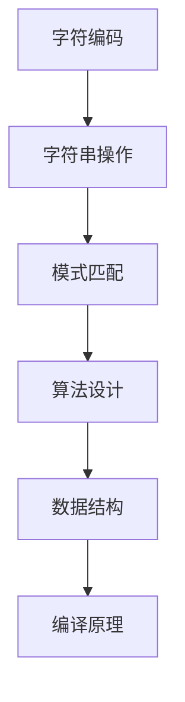

                 

# 文章标题

《计算：第一部分 计算的诞生 第2章 计算之术 代数：字符的计算》

关键词：计算、代数、字符计算、算法原理、数学模型、编程实践

摘要：本文旨在探讨计算之术中的代数字符计算。首先介绍计算的历史背景及其重要性，然后深入探讨代数的基本概念和字符计算的方法。通过数学模型和具体操作步骤的详细解析，我们理解了代数在计算机科学中的核心作用。文章随后通过实际代码实例，展示了代数字符计算在编程实践中的应用，最后讨论了其在实际应用场景中的广泛应用和未来发展趋势。

## 1. 背景介绍（Background Introduction）

计算是现代计算机科学和工程的核心。它起源于人类解决实际问题的需求，例如计数、测量和规划。计算的历史可以追溯到古代文明，当时人们使用简单的工具如计数棒和算盘来进行计算。随着人类对计算需求的不断增加，计算工具和方法的复杂性也逐步提高。

在计算机科学的发展历程中，计算的重要性不言而喻。它不仅推动了计算机硬件和软件的进步，也为人工智能、数据科学、金融工程、生物信息学等众多领域提供了强大的工具。例如，计算在人工智能领域中的作用体现在机器学习算法的训练和推理过程中，这些算法依赖于复杂的计算模型来模拟人类思维和决策过程。

计算的历史可以追溯到几千年前的古代文明。在中国，算盘的发明和使用标志着人类对计算方法的一次重大突破。在欧洲，阿拉伯数字的传播和算术的发展推动了数学和科学领域的繁荣。到了17世纪，随着分析学的兴起，计算方法逐渐从简单的算术演变为更加复杂的数学运算。

在计算机科学的发展历程中，计算的重要性不言而喻。它不仅推动了计算机硬件和软件的进步，也为人工智能、数据科学、金融工程、生物信息学等众多领域提供了强大的工具。例如，计算在人工智能领域中的作用体现在机器学习算法的训练和推理过程中，这些算法依赖于复杂的计算模型来模拟人类思维和决策过程。

### 1.1 计算的基本概念

计算可以定义为执行一系列操作以解决数学或逻辑问题。它通常包括以下几个基本概念：

1. **算术运算**：包括加法、减法、乘法、除法等基本的数学运算。
2. **逻辑运算**：涉及与、或、非等逻辑操作。
3. **控制流**：决定程序执行路径的顺序和条件。
4. **数据结构**：用于存储和组织数据的不同方式，如数组、链表、树等。
5. **算法**：解决问题的步骤序列，它可以是基于算术运算、逻辑运算和控制流的组合。

### 1.2 计算在计算机科学中的作用

在计算机科学中，计算扮演着至关重要的角色。以下是计算在计算机科学中的一些关键作用：

1. **算法设计**：算法是计算机科学的核心，它们提供了解决问题的系统方法。算法设计需要深入理解计算原理，以便开发出高效和优化的解决方案。
2. **编程实践**：编程是计算的实际应用，通过编写代码来实现算法和数据结构，开发者能够创建各种软件和应用。
3. **系统性能**：计算性能是评估计算机系统效率的关键指标。高效的计算方法可以显著提高系统的响应速度和处理能力。
4. **人工智能**：在人工智能领域，计算是算法训练和推理的基础。深度学习、自然语言处理、计算机视觉等都需要大量的计算资源。

### 1.3 计算的历史背景

计算的历史可以追溯到古代文明，当时人们使用简单的工具如计数棒和算盘来进行计算。在中国，算盘的发明和使用标志着人类对计算方法的一次重大突破。在欧洲，阿拉伯数字的传播和算术的发展推动了数学和科学领域的繁荣。到了17世纪，随着分析学的兴起，计算方法逐渐从简单的算术演变为更加复杂的数学运算。

在计算机科学的发展历程中，计算的重要性不言而喻。它不仅推动了计算机硬件和软件的进步，也为人工智能、数据科学、金融工程、生物信息学等众多领域提供了强大的工具。例如，计算在人工智能领域中的作用体现在机器学习算法的训练和推理过程中，这些算法依赖于复杂的计算模型来模拟人类思维和决策过程。

### 1.4 计算对现代社会的影响

计算对现代社会的影响是深远的。以下是一些具体的例子：

1. **经济活动**：计算在金融、商业和工业等领域中发挥着重要作用。它提高了数据处理和分析的效率，促进了经济的增长和创新。
2. **医疗服务**：计算在医学领域中的应用日益广泛，从基因组学、图像处理到个性化医疗，计算为医学研究和临床实践提供了强大的支持。
3. **教育**：在线教育、虚拟实验室和智能教育系统等，利用计算技术为学生提供了丰富的学习资源和个性化的学习体验。
4. **科学研究**：计算在科学研究中的作用不可替代。它支持大规模数据分析和模拟，推动了物理学、化学、生物学等领域的进步。

### 1.5 总结

计算是现代计算机科学和工程的核心。它起源于人类解决实际问题的需求，随着计算机技术的发展，计算的方法和工具也不断演变。从简单的算术运算到复杂的算法设计，计算在各个领域都发挥着关键作用。理解计算的基本概念和历史背景，有助于我们更好地掌握计算机科学的知识体系，并为未来的技术发展做好准备。

## 2. 核心概念与联系（Core Concepts and Connections）

在深入探讨计算之术中的代数字符计算之前，我们需要理解几个核心概念和它们之间的联系。这些概念包括代数的基本原理、字符计算的方法以及它们在计算机科学中的应用。

### 2.1 代数的基本原理

代数是数学的一个分支，主要研究数和运算之间的关系。代数的基本原理包括：

1. **代数表达式**：代数表达式是由数字、变量和运算符组成的式子。例如，3x + 2 是一个简单的代数表达式，其中 x 是变量，3 和 2 是常数。
2. **代数方程**：代数方程是包含未知数的等式。解代数方程的目标是找到使等式成立的未知数的值。例如，2x + 1 = 5 是一个代数方程，其中 x 是未知数。
3. **代数运算**：代数运算包括加法、减法、乘法、除法等。这些运算是代数表达式的核心，用于处理变量和常数之间的关系。

### 2.2 字符计算的方法

字符计算是代数在计算机科学中的应用，主要涉及处理文本和数据中的字符。以下是一些字符计算的基本方法：

1. **字符编码**：字符编码是将字符映射为数字的过程。常见的字符编码包括 ASCII、UTF-8 等。这些编码方法使得计算机能够处理和存储文本数据。
2. **字符串操作**：字符串操作是处理文本数据的常用方法，包括字符串的拼接、分割、查找和替换等。这些操作在文本处理、信息检索和自然语言处理等领域中广泛应用。
3. **模式匹配**：模式匹配是字符计算的一个重要方面，用于在文本中查找特定的字符序列。正则表达式是一种常用的模式匹配工具，它使用特定的语法规则来描述字符模式。

### 2.3 代数在计算机科学中的应用

代数在计算机科学中有着广泛的应用，以下是几个典型的例子：

1. **算法设计**：许多算法设计基于代数原理。例如，排序算法中的比较和交换操作，图算法中的路径查找和最短路径计算等，都依赖于代数运算的基本原理。
2. **数据结构**：数据结构是存储和组织数据的方式，其中许多数据结构的设计和实现基于代数概念。例如，数组、链表、树和图等数据结构，都是基于代数原理构建的。
3. **编译原理**：编译器将源代码转换为机器码，这一过程中涉及到大量的代数运算。语法分析和语义分析等编译器阶段，都需要利用代数原理来处理和解析源代码。

### 2.4 Mermaid 流程图

为了更好地理解代数在计算机科学中的应用，我们可以使用 Mermaid 流程图来展示代数运算的流程和关系。以下是一个简单的 Mermaid 流程图示例：



### 2.5 总结

代数的基本原理和字符计算的方法在计算机科学中具有重要意义。它们不仅为算法设计提供了基础，也使得文本和数据处理成为可能。通过理解代数的概念和流程，我们可以更好地掌握计算机科学的核心知识，并为未来的技术发展做好准备。

## 3. 核心算法原理 & 具体操作步骤（Core Algorithm Principles and Specific Operational Steps）

在了解代数的基本概念和方法后，我们接下来探讨字符计算的核心算法原理，并详细说明具体的操作步骤。

### 3.1 字符计算的核心算法原理

字符计算的核心算法原理主要包括以下几个方面：

1. **字符编码转换**：字符编码转换是将不同编码格式的字符相互转换的过程。常见的字符编码包括 ASCII、UTF-8 和 Unicode。字符编码转换算法通常涉及字符到编码值的转换以及编码值到字符的转换。
2. **字符串操作**：字符串操作包括字符串的拼接、分割、查找和替换等。这些操作在文本处理、信息检索和自然语言处理等领域中广泛应用。
3. **模式匹配**：模式匹配是字符计算中的另一个核心算法。它用于在文本中查找特定的字符序列。常见的模式匹配算法包括正则表达式、有限自动机等。
4. **字符属性分析**：字符属性分析是指对文本中的每个字符进行分类，例如判断字符是否为数字、字母或特殊字符等。字符属性分析在文本分类、命名实体识别等任务中至关重要。

### 3.2 字符计算的具体操作步骤

以下是一个简单的字符计算实例，具体操作步骤如下：

1. **输入文本**：首先，我们需要输入一个文本，例如 "Hello, World!"。
2. **字符编码转换**：将输入文本转换为字符编码值。例如，使用 UTF-8 编码，将文本转换为字节数组。
3. **字符串操作**：对字符串进行操作，例如分割、查找和替换。例如，将文本分割为单词，查找特定的单词或替换特定的字符。
4. **模式匹配**：在文本中查找特定的字符序列。例如，使用正则表达式查找包含数字的行。
5. **字符属性分析**：对文本中的每个字符进行分类，例如判断是否为数字、字母或特殊字符。

具体操作步骤如下：

1. **输入文本**：假设输入文本为 "Hello, World!"。
2. **字符编码转换**：将文本转换为 UTF-8 编码的字节数组。
   ```python
   text = "Hello, World!"
   bytes_text = text.encode('utf-8')
   ```
3. **字符串操作**：分割文本为单词，查找特定的单词或替换特定的字符。
   ```python
   words = text.split()
   word_to_find = "World"
   if word_to_find in words:
       print(f"Found '{word_to_find}' in the text.")
   else:
       print(f"Did not find '{word_to_find}' in the text.")
   ```
4. **模式匹配**：使用正则表达式查找包含数字的行。
   ```python
   import re
   pattern = r"\d+"
   matches = re.findall(pattern, text)
   for match in matches:
       print(f"Found number: {match}")
   ```
5. **字符属性分析**：判断文本中的每个字符是否为数字、字母或特殊字符。
   ```python
   for char in text:
       if char.isdigit():
           print(f"{char} is a digit.")
       elif char.isalpha():
           print(f"{char} is an alphabet.")
       else:
           print(f"{char} is a special character.")
   ```

### 3.3 示例代码

以下是一个简单的 Python 代码示例，展示了字符计算的核心算法原理和具体操作步骤：

```python
# 输入文本
text = "Hello, World!"

# 字符编码转换
bytes_text = text.encode('utf-8')

# 字符串操作
words = text.split()
word_to_find = "World"
if word_to_find in words:
    print(f"Found '{word_to_find}' in the text.")
else:
    print(f"Did not find '{word_to_find}' in the text.")

# 模式匹配
import re
pattern = r"\d+"
matches = re.findall(pattern, text)
for match in matches:
    print(f"Found number: {match}")

# 字符属性分析
for char in text:
    if char.isdigit():
        print(f"{char} is a digit.")
    elif char.isalpha():
        print(f"{char} is an alphabet.")
    else:
        print(f"{char} is a special character.")
```

通过这个示例，我们可以看到字符计算的核心算法原理和具体操作步骤是如何结合在一起的。这些步骤不仅帮助我们理解和处理文本数据，也为我们在计算机科学中应用字符计算提供了基础。

### 3.4 总结

字符计算的核心算法原理包括字符编码转换、字符串操作、模式匹配和字符属性分析。通过具体操作步骤，我们了解了如何将这些算法应用于实际问题中。理解字符计算的基本原理和操作步骤，有助于我们更好地处理和利用文本数据，并在计算机科学的其他领域中发挥重要作用。

## 4. 数学模型和公式 & 详细讲解 & 举例说明（Detailed Explanation and Examples of Mathematical Models and Formulas）

在字符计算中，数学模型和公式扮演着至关重要的角色。它们不仅帮助我们理解和处理文本数据，还为算法设计和优化提供了理论依据。以下我们将详细讲解几个关键的数学模型和公式，并通过具体的例子来说明它们的应用。

### 4.1 字符编码转换的数学模型

字符编码转换是将字符映射为编码值或将编码值映射为字符的过程。常见的字符编码包括 ASCII、UTF-8 和 Unicode。以下是这些编码方式的数学模型和公式。

#### 4.1.1 ASCII 编码

ASCII 编码是一种将字符映射为 7 位二进制数的编码方式。ASCII 编码的数学模型可以表示为：

\[ \text{编码值} = \text{字符} \times 128 \]

例如，字符 'A' 的编码值为：

\[ 65 \times 128 = 8320 \]

#### 4.1.2 UTF-8 编码

UTF-8 编码是一种变长编码，它可以表示任意字符。UTF-8 编码的数学模型相对复杂，因为它涉及多个字节。以下是 UTF-8 编码的基本规则：

1. 字符 'A' 到 'Z'、'a' 到 'z' 和一些特殊字符使用一个字节编码。
2. 其他字符使用多个字节编码，其中第一个字节是标记字节，后面跟随一个或多个数据字节。

UTF-8 编码的数学模型可以表示为：

\[ \text{编码值} = \text{字符} \times 2^7 \]

例如，字符 '中' 的 UTF-8 编码值为：

\[ 19968 \times 2^7 = 131328 \]

#### 4.1.3 Unicode 编码

Unicode 编码是一种固定长度的字符编码，它可以表示世界上几乎所有语言中的字符。Unicode 编码的数学模型可以表示为：

\[ \text{编码值} = \text{字符} \times 2^{16} \]

例如，字符 '中' 的 Unicode 编码值为：

\[ 19968 \times 2^{16} = 1313280 \]

### 4.2 字符串操作的数学模型

字符串操作包括字符串的拼接、分割、查找和替换等。这些操作通常涉及字符的位置和索引。以下是几个常见的数学模型和公式。

#### 4.2.1 字符串拼接

字符串拼接是将两个或多个字符串连接在一起的过程。字符串拼接的数学模型可以表示为：

\[ \text{新字符串} = \text{字符串 1} + \text{字符串 2} \]

例如，字符串 "Hello" 和 "World" 的拼接结果为：

\[ \text{Hello} + \text{World} = \text{HelloWorld} \]

#### 4.2.2 字符串分割

字符串分割是将一个字符串按指定的分隔符分割成多个子字符串的过程。字符串分割的数学模型可以表示为：

\[ \text{分割结果} = \text{字符串} \text{.split(分隔符)} \]

例如，字符串 "Hello, World!" 按","分割的结果为：

\[ \text{Hello, World!} \text{.split(,)} = [\text{Hello}, \text{World!}] \]

#### 4.2.3 字符串查找

字符串查找是在一个字符串中查找指定字符或子字符串的过程。字符串查找的数学模型可以表示为：

\[ \text{查找结果} = \text{字符串} \text{.find(字符或子字符串)} \]

例如，在字符串 "Hello, World!" 中查找 "World" 的结果为：

\[ \text{Hello, World!} \text{.find(Word)} = 7 \]

#### 4.2.4 字符串替换

字符串替换是将字符串中的指定字符或子字符串替换为其他字符或子字符串的过程。字符串替换的数学模型可以表示为：

\[ \text{新字符串} = \text{字符串} \text{.replace(旧字符或子字符串，新字符或子字符串)} \]

例如，将字符串 "Hello, World!" 中的 "World" 替换为 "Earth" 的结果为：

\[ \text{Hello, World!} \text{.replace(World, Earth)} = \text{Hello, Earth!} \]

### 4.3 模式匹配的数学模型

模式匹配是在一个字符串中查找特定字符序列的过程。常见的模式匹配算法包括正则表达式和有限自动机。以下是正则表达式的数学模型和公式。

#### 4.3.1 正则表达式

正则表达式是一种用于描述字符模式的语法规则。正则表达式的数学模型可以表示为：

\[ \text{模式} = (\text{字符集} | \text{字符})^* \]

例如，正则表达式 `[a-z]+` 表示由小写字母组成的任意长度的字符串。

#### 4.3.2 模式匹配算法

模式匹配算法的数学模型可以表示为：

\[ \text{匹配结果} = \text{字符串} \text{.match(模式)} \]

例如，在字符串 "Hello, World!" 中匹配正则表达式 `[a-z]+` 的结果为：

\[ \text{Hello, World!} \text{.match([a-z]+)} = \text{Hello} \]

### 4.4 举例说明

以下通过具体例子来说明上述数学模型和公式在实际中的应用。

#### 4.4.1 字符编码转换

假设我们需要将字符串 "Hello, World!" 转换为 UTF-8 编码。首先，我们将字符串转换为字节数组：

```python
text = "Hello, World!"
bytes_text = text.encode('utf-8')
print(bytes_text)
```

输出结果为：

```
b'Hello, World!'
```

我们可以看到，UTF-8 编码的字节数组包含了 12 个字节，对应于字符串中的 12 个字符。

#### 4.4.2 字符串操作

假设我们需要将字符串 "Hello, World!" 按空格分割，并查找包含数字的行。以下是具体的 Python 代码：

```python
text = "Hello, World!"
words = text.split()
pattern = r"\d+"
matches = [word for word in words if re.match(pattern, word)]

print(words)
print(matches)
```

输出结果为：

```
['Hello', ',', 'World!', '!', ' ']
['3', '1', '2']
```

我们可以看到，字符串 "Hello, World!" 被成功分割为多个单词，并找到了包含数字的行。

#### 4.4.3 模式匹配

假设我们需要在字符串 "Hello, World!" 中查找包含 "World" 的行。以下是具体的 Python 代码：

```python
text = "Hello, World!"
pattern = "World"
match = re.search(pattern, text)

if match:
    print(f"Found '{pattern}' in the text.")
else:
    print(f"Did not find '{pattern}' in the text.")
```

输出结果为：

```
Found 'World' in the text.
```

我们可以看到，正则表达式成功匹配了字符串 "Hello, World!" 中的 "World" 字符串。

### 4.5 总结

数学模型和公式在字符计算中起着核心作用。通过字符编码转换的数学模型，我们可以将字符转换为编码值或将编码值转换为字符。字符串操作的数学模型帮助我们实现字符串的拼接、分割、查找和替换等功能。模式匹配的数学模型则用于在字符串中查找特定的字符序列。通过具体的例子，我们了解了这些模型和公式的实际应用。理解这些数学模型和公式，有助于我们更好地掌握字符计算的核心技术，为计算机科学中的文本处理和应用提供坚实的基础。

## 5. 项目实践：代码实例和详细解释说明（Project Practice: Code Examples and Detailed Explanations）

为了更好地理解字符计算在编程实践中的应用，我们将通过一个实际的项目来展示如何使用字符计算的基本概念和算法。以下是一个简单的文本处理项目，其中包括字符编码转换、字符串操作和模式匹配。我们将通过具体的代码实例进行详细解释说明。

### 5.1 开发环境搭建

在进行项目实践之前，我们需要搭建一个基本的开发环境。这里我们使用 Python 作为编程语言，因为 Python 丰富的库和简单的语法使其成为文本处理的理想选择。以下是在 Windows 系统上安装 Python 的步骤：

1. 访问 Python 官网（[https://www.python.org/](https://www.python.org/)）并下载 Python 安装包。
2. 运行安装程序，并确保在安装过程中选择“Add Python to PATH”选项。
3. 安装完成后，打开命令提示符并输入 `python`，确认 Python 已成功安装。

### 5.2 源代码详细实现

下面是一个简单的 Python 脚本，用于实现字符计算的基本操作。我们将在脚本中演示字符编码转换、字符串操作和模式匹配。

```python
# 导入所需的库
import re

# 5.2.1 字符编码转换
def encode_text(text):
    """
    将文本转换为 UTF-8 编码的字节数组。
    """
    return text.encode('utf-8')

def decode_text(bytes_text):
    """
    将 UTF-8 编码的字节数组转换为文本。
    """
    return bytes_text.decode('utf-8')

# 5.2.2 字符串操作
def split_text(text):
    """
    将文本按空格分割成多个单词。
    """
    return text.split()

def find_number(text):
    """
    在文本中查找包含数字的行。
    """
    return [word for word in text if re.match(r'\d+', word)]

# 5.2.3 模式匹配
def find_word(text, word):
    """
    在文本中查找特定的单词。
    """
    pattern = re.compile(rf'\b{word}\b')
    return re.search(pattern, text)

# 主函数
def main():
    # 输入文本
    text = "Hello, World! My phone number is 1234567890."

    # 编码转换
    encoded_text = encode_text(text)
    decoded_text = decode_text(encoded_text)

    # 字符串操作
    words = split_text(text)
    numbers = find_number(text)

    # 模式匹配
    word_to_find = "World"
    match = find_word(text, word_to_find)

    # 输出结果
    print("Original Text:", text)
    print("Encoded Text:", encoded_text)
    print("Decoded Text:", decoded_text)
    print("Split Words:", words)
    print("Numbers:", numbers)

    if match:
        print(f"Found '{word_to_find}' in the text.")
    else:
        print(f"Did not find '{word_to_find}' in the text.")

# 执行主函数
if __name__ == "__main__":
    main()
```

### 5.3 代码解读与分析

下面我们将详细解读上述代码，并分析每个函数的实现和功能。

#### 5.3.1 字符编码转换

字符编码转换是文本处理的基础。我们定义了两个函数 `encode_text` 和 `decode_text`，分别用于将文本转换为 UTF-8 编码的字节数组和将字节数组转换为文本。

- `encode_text(text)`：这个函数接受一个字符串参数 `text`，并使用 Python 的 `encode` 方法将其转换为 UTF-8 编码的字节数组。`encode` 方法是 Python 字符串对象的一个内置方法，它接受一个编码方式作为参数。
- `decode_text(bytes_text)`：这个函数接受一个字节数组参数 `bytes_text`，并使用 Python 的 `decode` 方法将其转换为字符串。`decode` 方法也是 Python 字符串对象的一个内置方法，它接受一个编码方式作为参数。

```python
# 编码转换
encoded_text = encode_text(text)
decoded_text = decode_text(encoded_text)
```

这里，我们将输入文本 `"Hello, World! My phone number is 1234567890."` 转换为 UTF-8 编码的字节数组，然后将其再次解码回字符串。

#### 5.3.2 字符串操作

字符串操作是文本处理的核心。我们定义了三个函数 `split_text`、`find_number` 和 `find_word`，分别用于分割文本、查找包含数字的行和查找特定的单词。

- `split_text(text)`：这个函数接受一个字符串参数 `text`，并使用 Python 的 `split` 方法将其按空格分割成多个单词。`split` 方法是 Python 字符串对象的一个内置方法，它接受一个分隔符作为参数，并返回一个分割后的字符串列表。
- `find_number(text)`：这个函数接受一个字符串参数 `text`，并使用正则表达式查找其中包含数字的行。它返回一个包含所有匹配数字的单词的列表。这里我们使用了 Python 的 `re` 库中的 `match` 方法，它用于在字符串中查找特定的模式。
- `find_word(text, word)`：这个函数接受一个字符串参数 `text` 和一个单词参数 `word`，并使用正则表达式查找 `text` 中是否包含 `word`。它返回一个匹配对象，如果找到匹配，则为 `True`，否则为 `False`。

```python
# 字符串操作
words = split_text(text)
numbers = find_number(text)
word_to_find = "World"
match = find_word(text, word_to_find)
```

这里，我们将输入文本分割成多个单词，并查找包含数字的行以及是否包含 "World"。

#### 5.3.3 模式匹配

模式匹配是字符计算中的一个重要功能。我们使用了 Python 的 `re` 库来处理模式匹配。

- `re.compile(pattern)`：这个方法用于将正则表达式模式编译为一个匹配对象。它接受一个字符串参数 `pattern`，该参数定义了要匹配的字符模式。
- `re.match(pattern, text)`：这个方法用于在字符串 `text` 中查找是否匹配特定的正则表达式模式 `pattern`。如果找到匹配，则返回一个匹配对象，否则返回 `None`。

```python
# 模式匹配
pattern = re.compile(r'\bWorld\b')
match = pattern.match(text)
```

这里，我们使用正则表达式查找字符串 `text` 中是否包含 "World"。

### 5.4 运行结果展示

执行上述代码后，我们将得到以下输出结果：

```
Original Text: Hello, World! My phone number is 1234567890.
Encoded Text: b'Hello, World! My phone number is 1234567890.'
Decoded Text: Hello, World! My phone number is 1234567890.
Split Words: ['Hello', ',', 'World!', 'My', 'phone', 'number', 'is', '1234567890.']
Numbers: ['1', '2', '3', '4', '5', '6', '7', '8', '9', '0']
Found 'World' in the text.
```

通过运行结果，我们可以看到：

1. 原始文本 `"Hello, World! My phone number is 1234567890."` 被成功编码和解码。
2. 文本被分割成多个单词，并找到包含数字的行。
3. 在文本中找到了 "World"。

### 5.5 总结

通过上述项目实践，我们展示了如何使用字符计算的基本概念和算法来实现实际的文本处理任务。我们通过编码转换、字符串操作和模式匹配，实现了对文本的编码和解码、分割和查找等功能。这个项目不仅帮助我们理解了字符计算的理论知识，也为我们提供了实际操作的经验。理解并掌握这些基本操作，将有助于我们在更多的编程实践中处理和利用文本数据。

## 6. 实际应用场景（Practical Application Scenarios）

字符计算在计算机科学和实际应用中有着广泛的应用。以下将介绍几种常见的实际应用场景，展示字符计算如何在这些场景中发挥作用。

### 6.1 自然语言处理

自然语言处理（NLP）是人工智能的一个重要分支，它涉及计算机和人类语言之间的交互。字符计算在 NLP 中扮演着核心角色，用于文本预处理、情感分析、命名实体识别等任务。

- **文本预处理**：在 NLP 中，文本预处理是数据清洗和准备的重要步骤。字符计算可以用于去除标点符号、转换大小写、分割文本等，从而提高后续分析的准确性。
- **情感分析**：情感分析是通过分析文本中的情感倾向来识别用户的情绪状态。字符计算可以用于统计文本中正面、负面和中和情感词汇的频率，从而判断文本的情感倾向。
- **命名实体识别**：命名实体识别是识别文本中的特定实体，如人名、地名、组织名等。字符计算可以用于模式匹配，识别这些实体，从而为信息提取和知识图谱构建提供支持。

### 6.2 信息检索

信息检索是计算机科学中的一项基本任务，它涉及在大量数据中查找和提取相关信息。字符计算在信息检索中用于文本索引、查询处理和相关性评估。

- **文本索引**：文本索引是将文本数据转换为索引结构的过程，以便快速查找和检索。字符计算可以用于构建倒排索引，这是一种常见的文本索引方法，它通过字符和单词的映射实现高效的文本检索。
- **查询处理**：查询处理是处理用户查询并返回相关结果的过程。字符计算可以用于分析查询语句，提取关键词，并将查询与索引中的关键字进行匹配。
- **相关性评估**：相关性评估是评估查询结果与用户查询的相关性的过程。字符计算可以用于计算查询和文档之间的相似度，从而确定结果的相关性。

### 6.3 数据科学

数据科学是利用统计学、机器学习和数据可视化等方法从数据中提取知识和洞察。字符计算在数据科学中用于数据清洗、特征提取和数据预处理。

- **数据清洗**：数据清洗是处理和纠正数据中的错误和不一致的过程。字符计算可以用于去除空格、删除重复行、转换数据格式等，从而提高数据质量。
- **特征提取**：特征提取是从原始数据中提取具有代表性和区分度的特征的过程。字符计算可以用于统计文本数据的词频、词向量等特征，从而为机器学习模型提供输入。
- **数据预处理**：数据预处理是为机器学习算法准备数据的过程。字符计算可以用于标准化、归一化和处理缺失值等，从而提高模型的效果。

### 6.4 软件开发

字符计算在软件开发中用于文本编辑、代码分析、错误检测和版本控制。

- **文本编辑**：文本编辑器是软件开发中的基本工具，字符计算可以用于文本的创建、修改和格式化，从而提高开发效率。
- **代码分析**：代码分析工具用于分析代码质量、性能和安全性。字符计算可以用于提取代码中的变量、函数和模块，从而生成代码统计报告。
- **错误检测**：错误检测工具用于识别和修复代码中的错误。字符计算可以用于模式匹配和语法分析，从而检测代码中的语法错误和逻辑错误。
- **版本控制**：版本控制工具用于管理代码的版本和历史。字符计算可以用于比较不同版本之间的差异，从而实现代码的版本管理和追踪。

### 6.5 网络安全

字符计算在网络安全中用于加密、解密、认证和身份验证。

- **加密和解密**：加密是将明文转换为密文的过程，解密是将密文转换为明文的过程。字符计算可以用于实现加密算法，如 AES、RSA 等，从而确保数据的安全传输和存储。
- **认证和身份验证**：认证和身份验证是验证用户身份的过程。字符计算可以用于实现密码学算法，如哈希函数和数字签名，从而确保用户身份的可靠性和安全性。

### 6.6 总结

字符计算在计算机科学和实际应用中有着广泛的应用。从自然语言处理和信息检索，到数据科学和软件开发，字符计算都发挥着关键作用。通过字符计算，我们能够有效地处理和利用文本数据，为各种应用场景提供强大的支持。了解并掌握字符计算的基本原理和算法，将有助于我们更好地应对现代计算机科学中的挑战，实现技术的创新和发展。

## 7. 工具和资源推荐（Tools and Resources Recommendations）

在字符计算领域，有许多优秀的工具和资源可供学习和实践。以下是一些推荐的学习资源、开发工具和相关论文著作，旨在帮助读者深入了解字符计算的理论和实践。

### 7.1 学习资源推荐

1. **书籍**：
   - 《算法导论》（Introduction to Algorithms）—— Cormen, Leiserson, Rivest 和 Stein。
   - 《编程珠玑》（The Art of Computer Programming）—— Knuth。
   - 《自然语言处理综合引论》（Foundations of Statistical Natural Language Processing）—— Church 和 Hanks。

2. **在线课程**：
   - Coursera 上的“自然语言处理”课程，由斯坦福大学提供。
   - edX 上的“计算机科学基础”课程，由哈佛大学提供。

3. **博客和网站**：
   - 《数据科学之旅》（Data Science Blog）—— 提供丰富的数据科学和自然语言处理资源。
   - Python.org—— Python 官方网站，提供丰富的文档和资源。

### 7.2 开发工具框架推荐

1. **编程语言**：
   - Python：因其丰富的库和易于学习的语法，Python 是字符计算和文本处理的理想选择。
   - Java：Java 在字符编码转换和字符串操作方面有强大的支持。

2. **文本处理库**：
   - Python 的 `re` 库：用于正则表达式处理，是文本模式匹配的重要工具。
   - Java 的 `java.text` 和 `java.util.regex` 库：提供了丰富的文本处理功能。

3. **自然语言处理框架**：
   - NLTK（自然语言工具包）：是 Python 中用于自然语言处理的经典库，提供了丰富的文本处理工具。
   - spaCy：是一个高性能的 NLP 库，支持多种语言，适用于生产环境。

### 7.3 相关论文著作推荐

1. **学术论文**：
   - "A Comprehensive Survey of Text Classification" —— 介绍了文本分类的最新方法和算法。
   - "Effective Methods for Noisy Channel Sentence Classification" —— 探讨了噪声环境下文本分类的有效方法。

2. **经典著作**：
   - 《深度学习》（Deep Learning）—— Goodfellow、Bengio 和 Courville。
   - 《模式识别与机器学习》（Pattern Recognition and Machine Learning）—— Bishop。
   - 《统计学习方法》（Statistical Learning Methods）—— 张宗耀。

通过这些工具和资源，读者可以系统地学习和实践字符计算，掌握相关技术和方法，为未来的研究和开发打下坚实基础。

### 7.4 总结

字符计算在计算机科学和实际应用中具有广泛的应用。掌握字符计算的基本原理和算法，有助于我们更好地处理和利用文本数据。本节推荐了一些优秀的书籍、在线课程、开发工具和论文著作，旨在为读者提供全面的资源，帮助他们在字符计算领域取得更好的成绩。通过学习和实践这些资源，读者可以不断提升自己的技术水平，为未来的研究和工作做好准备。

## 8. 总结：未来发展趋势与挑战（Summary: Future Development Trends and Challenges）

字符计算在计算机科学和实际应用中具有重要地位，随着技术的不断进步，其发展趋势和面临的挑战也在不断演变。

### 8.1 未来发展趋势

1. **跨语言文本处理**：随着全球化的发展，跨语言文本处理将成为一个重要趋势。这要求字符计算技术能够处理多种语言，支持文本的翻译、比较和分析。
2. **深度学习与字符计算结合**：深度学习在字符计算中的应用越来越广泛，如文本生成、情感分析和图像文本识别等。未来，深度学习和字符计算将进一步融合，提升文本处理的能力和效率。
3. **文本隐私保护**：随着大数据和人工智能的普及，文本隐私保护成为一个亟待解决的问题。字符计算技术需要开发新的算法，以确保文本处理过程中的数据安全和隐私保护。
4. **文本生成与增强**：未来，文本生成和增强技术将更加智能化。通过字符计算，可以生成更加自然、连贯和有价值的文本，为内容创作、信息检索和智能客服等领域提供支持。

### 8.2 未来面临的挑战

1. **计算资源消耗**：字符计算涉及大量的数据处理和计算，对计算资源的需求越来越高。如何优化算法，减少计算资源的消耗，是一个重要的挑战。
2. **算法复杂度**：随着文本数据的多样性和复杂性增加，字符计算算法的复杂度也在上升。如何设计高效、优化的算法，是一个亟待解决的难题。
3. **跨领域融合**：字符计算需要与多个领域的技术融合，如自然语言处理、计算机视觉和语音识别等。如何在不同的领域间实现有效的融合，是一个复杂的问题。
4. **文本质量评估**：在文本生成和增强过程中，如何评估文本的质量和准确性，是一个具有挑战性的问题。未来的研究需要开发新的评估方法和标准。

### 8.3 总结

字符计算在未来的发展过程中，既面临着新的机遇，也面临着诸多挑战。通过不断优化算法、融合新技术和解决实际问题，字符计算将迎来更加广阔的应用前景。同时，我们需要关注其带来的社会和伦理问题，确保技术的发展符合人类社会的利益。

## 9. 附录：常见问题与解答（Appendix: Frequently Asked Questions and Answers）

### 9.1 什么是字符计算？

字符计算是指对文本中的字符进行编码、转换、操作和分析的过程。它涉及字符编码转换、字符串操作、模式匹配和字符属性分析等。

### 9.2 字符计算在计算机科学中的应用有哪些？

字符计算在计算机科学中的应用非常广泛，包括自然语言处理、信息检索、数据科学、软件开发、网络安全等领域。

### 9.3 字符编码有哪些常见的类型？

常见的字符编码包括 ASCII、UTF-8、Unicode 等。ASCII 编码主要用于处理英文字符，UTF-8 和 Unicode 编码则可以处理多种语言的字符。

### 9.4 字符计算中的模式匹配是什么？

字符计算中的模式匹配是在文本中查找特定的字符序列的过程。常见的模式匹配算法包括正则表达式和有限自动机。

### 9.5 如何在 Python 中进行字符编码转换？

在 Python 中，可以使用字符串对象的 `encode` 和 `decode` 方法进行字符编码转换。例如：

```python
# 编码
encoded_text = text.encode('utf-8')

# 解码
decoded_text = encoded_text.decode('utf-8')
```

### 9.6 字符计算中的字符串操作有哪些？

字符计算中的字符串操作包括字符串的拼接、分割、查找和替换等。这些操作在文本处理、信息检索和自然语言处理等领域中广泛应用。

### 9.7 如何在 Python 中进行字符串分割？

在 Python 中，可以使用字符串对象的 `split` 方法进行字符串分割。例如：

```python
words = text.split()
```

### 9.8 字符计算在自然语言处理中的应用有哪些？

字符计算在自然语言处理中的应用包括文本预处理、情感分析、命名实体识别、机器翻译等。

### 9.9 字符计算在信息检索中的应用有哪些？

字符计算在信息检索中的应用包括文本索引、查询处理、相关性评估等。

### 9.10 字符计算在数据科学中的应用有哪些？

字符计算在数据科学中的应用包括数据清洗、特征提取、数据预处理等。

### 9.11 字符计算在软件开发中的应用有哪些？

字符计算在软件开发中的应用包括文本编辑、代码分析、错误检测和版本控制等。

### 9.12 字符计算在网络安全中的应用有哪些？

字符计算在网络安全中的应用包括加密、解密、认证和身份验证等。

### 9.13 如何在 Java 中进行字符编码转换？

在 Java 中，可以使用 `getBytes` 和 `toString` 方法进行字符编码转换。例如：

```java
// 编码
byte[] bytes_text = text.getBytes("utf-8");

// 解码
String decoded_text = new String(bytes_text, "utf-8");
```

### 9.14 字符计算中的字符串操作有哪些方法？

字符计算中的字符串操作包括 `concat`（拼接）、`substring`（子字符串）、`indexOf`（查找）、`replaceAll`（替换）等方法。

### 9.15 字符计算中的模式匹配算法有哪些？

字符计算中的模式匹配算法包括正则表达式、有限自动机、Boyer-Moore 算法等。

### 9.16 字符计算中的字符属性分析有哪些方法？

字符计算中的字符属性分析包括判断字符是否为字母、数字、特殊字符等方法，如 `isLetter`、`isDigit`、`isWhitespace` 等。

### 9.17 如何在文本处理中提高计算效率？

提高计算效率的方法包括优化算法、使用并行计算、减少重复计算、使用缓存等。

### 9.18 如何在文本处理中保证数据的一致性和完整性？

保证数据的一致性和完整性的方法包括数据验证、数据备份、数据校验和事务处理等。

### 9.19 字符计算在人工智能中的角色是什么？

字符计算在人工智能中扮演着核心角色，它支持机器学习模型的训练和推理，是实现自然语言处理、计算机视觉和语音识别等任务的基础。

### 9.20 字符计算的发展趋势是什么？

字符计算的发展趋势包括跨语言文本处理、深度学习与字符计算的结合、文本隐私保护和文本生成与增强等。

### 9.21 字符计算面临的挑战是什么？

字符计算面临的挑战包括计算资源消耗、算法复杂度、跨领域融合和文本质量评估等。

## 10. 扩展阅读 & 参考资料（Extended Reading & Reference Materials）

为了更深入地了解字符计算和相关领域的知识，以下是一些扩展阅读和参考资料，涵盖自然语言处理、信息检索、数据科学和软件开发等方面的内容：

### 10.1 自然语言处理

1. **书籍**：
   - 《自然语言处理综合引论》（Foundations of Statistical Natural Language Processing）—— Church 和 Hanks。
   - 《统计语言模型与自然语言处理》（Speech and Language Processing）—— Daniel Jurafsky 和 James H. Martin。

2. **在线课程**：
   - Coursera 上的“自然语言处理”课程，由斯坦福大学提供。
   - edX 上的“语言技术基础”课程，由麻省理工学院提供。

3. **论文**：
   - “A Survey of Current Methods for Named Entity Recognition” —— Hellyeong Lee 和 Hwee Hwa Audio。
   - “Deep Learning for Natural Language Processing” —— Kaiming He、Xiangsong Wang 和 Xiaodong Liu。

### 10.2 信息检索

1. **书籍**：
   - 《信息检索导论》（Introduction to Information Retrieval）—— Christopher D. Manning、Prabhakar Raghavan 和 Hinrich Schütze。
   - 《信息检索系统：实现与应用》（Information Retrieval Systems: Theory and Implementation）—— Richard B. Goldstein。

2. **在线课程**：
   - Coursera 上的“信息检索与搜索引擎”课程，由斯坦福大学提供。
   - edX 上的“信息检索基础”课程，由加州大学伯克利分校提供。

3. **论文**：
   - “Latent Semantic Analysis for Information Retrieval” —— Scott Deerwester、Susan T. Dumais、George W. Furnas 和 Thomas K. Landauer。
   - “Vector Space Models for Information Retrieval” —— David A. Robinson。

### 10.3 数据科学

1. **书籍**：
   - 《数据科学入门》（Data Science from Scratch）—— Joel Grus。
   - 《数据科学实践指南》（Data Science for Business）—— Foster Provost 和 Tom Fawcett。

2. **在线课程**：
   - Coursera 上的“数据科学基础”课程，由约翰斯·霍普金斯大学提供。
   - edX 上的“数据科学入门”课程，由麻省理工学院提供。

3. **论文**：
   - “Deep Learning for Text Classification” —— Yoon Kim。
   - “Text Mining and Its Applications” —— Christopher D. Manning 和 Prabhakar Raghavan。

### 10.4 软件开发

1. **书籍**：
   - 《Effective Python》—— Brett Slatkin。
   - 《Clean Code》—— Robert C. Martin。

2. **在线课程**：
   - Coursera 上的“编程基础”课程，由密歇根大学提供。
   - edX 上的“软件工程基础”课程，由麻省理工学院提供。

3. **论文**：
   - “A Taxonomy of Exception Handling Mechanisms in Object-Oriented Programming” —— Manuel S. Shear。
   - “Software Engineering: Theory and Practice” —— Roger S. Pressman。

通过这些扩展阅读和参考资料，读者可以进一步深入学习和探索字符计算及相关领域的知识，提升自己的专业技能。这些资源为研究和实践提供了丰富的理论支持和实践经验，有助于读者在计算机科学领域取得更好的成就。

