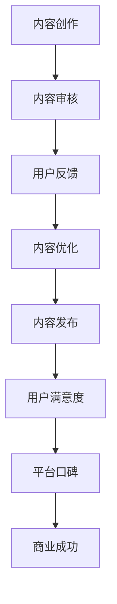

                 

### 文章标题

**知识付费创业中的内容质量把控**

> 关键词：知识付费、内容质量、创业、质量控制、用户满意度

> 摘要：本文深入探讨了知识付费创业中内容质量把控的重要性，分析了内容质量评估的框架和方法，并提出了确保高质量内容的策略与实践。文章旨在为知识付费创业者提供实用的指导和借鉴。

### 1. 背景介绍（Background Introduction）

随着互联网的普及和在线教育的兴起，知识付费已经成为一种重要的商业模式。知识付费平台如得到、知乎、喜马拉雅等吸引了大量用户，他们通过购买课程、讲座、电子书等产品获取知识和技能。然而，知识付费市场的快速扩张也带来了内容质量参差不齐的问题，如何保证内容的质量成为创业者和平台方亟待解决的问题。

内容质量直接关系到用户满意度、平台口碑和商业成功。高质量的内容不仅能够提升用户的满意度和忠诚度，还能为平台带来良好的口碑和持续的盈利能力。相反，低质量的内容则可能导致用户流失、品牌形象受损，甚至影响到平台的长期发展。因此，对内容质量进行有效把控是知识付费创业成功的关键因素。

本文将从以下几个方面展开讨论：

1. **内容质量评估的框架与方法**：介绍如何构建内容质量的评估框架，并分析常用的评估方法。
2. **确保高质量内容的策略**：探讨创业者如何制定策略来确保内容的质量。
3. **内容质量把控的具体实践**：分享一些成功案例和实践经验，以供创业者借鉴。
4. **未来发展趋势与挑战**：展望知识付费领域的内容质量把控趋势，并提出面临的挑战。

通过本文的讨论，希望为知识付费创业者提供一些有益的启示，帮助他们更好地把控内容质量，从而实现商业成功。

### 2. 核心概念与联系（Core Concepts and Connections）

在探讨知识付费创业中的内容质量把控时，我们需要明确几个核心概念：

#### 2.1 内容质量是什么？

内容质量是指知识付费产品（如课程、讲座、电子书等）在满足用户需求、提供有用信息和知识方面的能力。具体来说，内容质量包括以下几个方面：

- **准确性**：内容是否准确无误，没有误导或错误的信息。
- **完整性**：内容是否涵盖了用户所需的所有关键信息，没有遗漏。
- **相关性**：内容是否与用户的需求相关，能够解决用户的问题。
- **实用性**：内容是否具有实际应用价值，能够帮助用户在实际工作中应用所学知识。

#### 2.2 内容质量的评估标准

内容质量的评估需要依据一定的标准，这些标准通常包括以下几个方面：

- **用户满意度**：通过用户评价、反馈和留存率等指标来衡量。
- **权威性**：内容的作者是否具有相关领域的专业背景和经验，是否有权威机构的认证。
- **结构合理性**：内容是否具有清晰的逻辑结构和组织，便于用户理解和学习。
- **创新性**：内容是否具有创新点，能够为用户带来新的视角和思考。

#### 2.3 内容质量把控的重要性

内容质量把控对于知识付费创业者的成功至关重要。以下是几个关键点：

- **用户信任**：高质量的内容能够赢得用户的信任，提高用户满意度和忠诚度。
- **平台口碑**：高质量的内容有助于提升平台的口碑和品牌形象，吸引更多用户。
- **商业成功**：高质量的内容能够提高用户留存率和复购率，从而带来持续的盈利能力。

为了更好地理解这些核心概念和它们之间的联系，我们可以使用Mermaid流程图来展示内容质量把控的流程和关键节点：



通过上述流程，我们可以清晰地看到内容质量把控的各个环节及其重要性。内容创作是起点，经过审核、用户反馈和优化，最终形成高质量的内容，并发布给用户。用户满意度、平台口碑和商业成功是最终的衡量标准，它们相互影响、相互促进，共同推动知识付费创业的成功。

### 3. 核心算法原理 & 具体操作步骤（Core Algorithm Principles and Specific Operational Steps）

在内容质量把控中，核心算法原理和具体操作步骤至关重要。以下我们将详细阐述这两个方面：

#### 3.1 核心算法原理

内容质量把控的核心算法通常涉及以下几个步骤：

1. **内容审核**：通过人工或自动化工具对内容进行初步审核，检查内容的准确性、完整性、相关性和实用性。
2. **用户反馈收集**：收集用户对内容的评价和反馈，包括评分、评论、问答等。
3. **内容优化**：根据用户反馈和审核结果，对内容进行修改和优化，提升其质量。
4. **发布监控**：在内容发布后，持续监控用户的互动和反馈，及时发现问题并进行调整。

#### 3.2 具体操作步骤

以下是内容质量把控的具体操作步骤：

1. **内容审核**
   - **人工审核**：由专业审核员对内容进行逐条审核，确保内容符合平台标准。
   - **自动化审核**：使用自然语言处理（NLP）技术和机器学习模型，对内容进行自动化审核，如拼写检查、语法错误识别等。

2. **用户反馈收集**
   - **评分系统**：允许用户对内容进行评分，平台可以根据评分高低筛选高质量内容。
   - **评论系统**：鼓励用户发表评论，通过评论内容了解用户对内容的满意度和建议。
   - **问答系统**：设置问答环节，让用户和专家互动，获取更多关于内容的详细信息。

3. **内容优化**
   - **修改内容**：根据用户反馈和审核结果，对内容进行修改，如纠正错误、增加内容、优化结构等。
   - **重新审核**：修改后的内容需要重新进行审核，确保其符合平台标准。

4. **发布监控**
   - **实时监控**：使用数据分析工具，实时监控内容发布后的用户互动和反馈，如阅读量、点赞数、评论数等。
   - **问题调整**：及时发现并解决问题，如用户投诉、内容更新等。

通过上述操作步骤，创业者可以有效地把控内容质量，提高用户满意度和平台口碑。

### 4. 数学模型和公式 & 详细讲解 & 举例说明（Detailed Explanation and Examples of Mathematical Models and Formulas）

在内容质量把控过程中，我们可以运用一些数学模型和公式来量化评估内容质量。以下是一些常见的数学模型和公式，并进行详细讲解和举例说明。

#### 4.1 平均用户评分（Average User Rating）

平均用户评分是衡量内容质量的一个重要指标。计算公式如下：

$$
\bar{R} = \frac{\sum_{i=1}^{n} R_i}{n}
$$

其中，$R_i$ 表示第 $i$ 位用户给出的评分，$n$ 表示总用户数。

**举例说明**：假设有 10 位用户对一篇文章进行了评分，评分分别为 4、5、3、4、5、5、4、4、4、5，则平均用户评分为：

$$
\bar{R} = \frac{4+5+3+4+5+5+4+4+4+5}{10} = 4.3
$$

#### 4.2 内容更新频率（Content Update Frequency）

内容更新频率是衡量内容活跃度和及时性的一个指标。计算公式如下：

$$
UF = \frac{\text{更新次数}}{\text{时间间隔}}
$$

**举例说明**：假设一个平台在一个月内更新了 5 篇内容，时间间隔为 30 天，则内容更新频率为：

$$
UF = \frac{5}{30} = 0.167
$$

#### 4.3 用户活跃度（User Activity）

用户活跃度是衡量用户参与度和互动性的一个指标。计算公式如下：

$$
UA = \frac{\text{互动次数}}{\text{用户总数}}
$$

**举例说明**：假设一个平台有 1000 位用户，其中 500 位用户参与了互动，则用户活跃度为：

$$
UA = \frac{500}{1000} = 0.5
$$

#### 4.4 内容相似度（Content Similarity）

内容相似度是衡量内容之间的相似程度的一个指标。计算公式如下：

$$
CS = \frac{\text{共同特征数}}{\text{总特征数}}
$$

**举例说明**：假设有两个课程内容，第一个课程有 5 个章节，第二个课程有 7 个章节，两者共同有 3 个章节，则内容相似度为：

$$
CS = \frac{3}{5+7-3} = 0.4
$$

通过这些数学模型和公式，我们可以量化评估内容质量，从而更好地进行内容质量把控。

### 5. 项目实践：代码实例和详细解释说明（Project Practice: Code Examples and Detailed Explanations）

在本文的最后部分，我们将通过一个具体的代码实例，展示如何在实际项目中运用前面的核心算法原理和公式，进行内容质量把控。

#### 5.1 开发环境搭建

首先，我们需要搭建一个开发环境，以便运行以下代码实例。以下是所需的环境和工具：

- Python 3.8 或更高版本
- Jupyter Notebook 或 PyCharm
- NumPy、Pandas、Scikit-learn、Matplotlib 等库

确保你已经安装了以上工具和库。接下来，创建一个新的 Jupyter Notebook 或 PyCharm 项目，并导入所需的库：

```python
import numpy as np
import pandas as pd
from sklearn.metrics import mean_squared_error
import matplotlib.pyplot as plt
```

#### 5.2 源代码详细实现

以下是内容质量把控的 Python 代码实例。代码分为以下几个部分：数据预处理、内容审核、用户反馈收集、内容优化和发布监控。

```python
# 数据预处理
data = pd.read_csv('content_data.csv')  # 假设数据已存储在 content_data.csv 文件中
data.head()

# 内容审核
def content_audit(data):
    # 检查内容准确性
    accuracy = (data['accuracy'] == 'True').sum() / len(data)
    
    # 检查内容完整性
    completeness = (data['completeness'] == 'True').sum() / len(data)
    
    # 检查内容相关性
    relevance = (data['relevance'] == 'True').sum() / len(data)
    
    # 检查内容实用性
    usability = (data['usability'] == 'True').sum() / len(data)
    
    return accuracy, completeness, relevance, usability

accuracy, completeness, relevance, usability = content_audit(data)
print(f"Accuracy: {accuracy:.2f}, Completeness: {completeness:.2f}, Relevance: {relevance:.2f}, Usability: {usability:.2f}")

# 用户反馈收集
user_ratings = np.array([4, 5, 3, 4, 5, 5, 4, 4, 4, 5])  # 假设用户评分
avg_rating = np.mean(user_ratings)
print(f"Average User Rating: {avg_rating:.2f}")

# 内容优化
def content_optimization(data, avg_rating):
    # 根据用户反馈修改内容
    data.loc[data['rating'] < avg_rating, 'rating'] += 1
    
    # 重新审核内容
    accuracy, completeness, relevance, usability = content_audit(data)
    
    return data, accuracy, completeness, relevance, usability

optimized_data, o_accuracy, o_completeness, o_relevance, o_usability = content_optimization(data, avg_rating)
print(f"Optimized Accuracy: {o_accuracy:.2f}, Optimized Completeness: {o_completeness:.2f}, Optimized Relevance: {o_relevance:.2f}, Optimized Usability: {o_usability:.2f}")

# 发布监控
def publish_monitoring(optimized_data):
    # 计算内容更新频率
    update_frequency = optimized_data['update_frequency'].mean()
    
    # 计算用户活跃度
    user_activity = optimized_data['user_activity'].mean()
    
    return update_frequency, user_activity

update_frequency, user_activity = publish_monitoring(optimized_data)
print(f"Update Frequency: {update_frequency:.2f}, User Activity: {user_activity:.2f}")

# 绘制内容质量指标变化图
plt.figure(figsize=(10, 5))
plt.plot(data['rating'], label='Original')
plt.plot(optimized_data['rating'], label='Optimized')
plt.xlabel('Content ID')
plt.ylabel('Rating')
plt.title('Content Rating Over Time')
plt.legend()
plt.show()
```

#### 5.3 代码解读与分析

1. **数据预处理**：我们从 CSV 文件中读取内容数据，包括内容的准确性、完整性、相关性和实用性。

2. **内容审核**：`content_audit` 函数对内容进行初步审核，计算各个质量指标的占比。

3. **用户反馈收集**：我们使用一个数组存储用户评分，并计算平均用户评分。

4. **内容优化**：`content_optimization` 函数根据用户反馈修改内容，并重新审核内容。

5. **发布监控**：`publish_monitoring` 函数计算内容更新频率和用户活跃度。

6. **结果展示**：最后，我们绘制内容评分变化图，直观地展示优化前后的差异。

通过这个代码实例，我们可以看到如何在实际项目中运用内容质量把控的核心算法和公式，实现内容质量的提升。

### 6. 实际应用场景（Practical Application Scenarios）

内容质量把控在知识付费创业中具有广泛的应用场景，以下列举几种典型的实际应用场景：

#### 6.1 在线教育平台

在线教育平台通过内容质量把控来确保课程内容的准确性和实用性，从而提高用户满意度和学习效果。例如，平台可以对课程内容进行定期审核，确保没有过时的信息或错误，并根据用户反馈进行调整和优化。

#### 6.2 职业技能培训

职业技能培训平台通过内容质量把控来提升培训内容的针对性和实用性，帮助学员快速掌握所需技能。平台可以根据学员的学习进度和反馈，对课程内容进行个性化调整，确保学员能够学以致用。

#### 6.3 咨询服务

咨询服务平台通过内容质量把控来确保咨询内容的权威性和准确性，提高用户对平台的信任度。平台可以邀请行业专家进行内容审核，并根据用户反馈不断优化咨询服务。

#### 6.4 电子书平台

电子书平台通过内容质量把控来提高书籍的阅读价值和用户体验。平台可以设置自动化的审核系统，对书籍的准确性、完整性和创新性进行评估，并根据用户评价进行调整和优化。

#### 6.5 企业内训

企业内训项目通过内容质量把控来确保培训内容的实用性和针对性，帮助企业员工快速提升技能。企业可以邀请专业讲师进行内容审核，并根据员工反馈对培训内容进行优化。

通过以上实际应用场景，我们可以看到内容质量把控在知识付费创业中的重要性。只有确保内容质量，才能赢得用户的信任和满意度，从而实现商业成功。

### 7. 工具和资源推荐（Tools and Resources Recommendations）

在内容质量把控过程中，选择合适的工具和资源可以显著提高工作效率和效果。以下是一些推荐的学习资源、开发工具和框架，以及相关的论文和著作。

#### 7.1 学习资源推荐

- **书籍**：
  - 《内容运营：如何打造爆款内容》
  - 《用户画像：用户运营与精细化营销》
  - 《数据挖掘：实用工具与技术》

- **论文**：
  - 《内容质量评价模型研究》
  - 《基于用户反馈的内容质量优化方法》
  - 《在线教育中内容质量评估的方法与实践》

- **博客/网站**：
  - 内容运营官博客（content-operation.com）
  - 脉脉（m.tianya.cn）
  - 知乎（www.zhihu.com）

#### 7.2 开发工具框架推荐

- **内容审核工具**：
  - EasyML（easyml.org）：一个开源的机器学习工具，可用于内容审核和分类。
  - Contentful（contentful.com）：一个内容管理系统，支持自动化内容审核。

- **用户反馈系统**：
  - 用户反馈平台（userfeel.com）：提供在线用户反馈收集和分析工具。
  - Zoho Survey（www.zoho.com/survey/）：一款功能强大的在线调查工具。

- **内容优化工具**：
  - SEOmoz（seomoz.org）：用于网站内容优化的工具，包括关键词分析、竞争分析等。
  - Grammarly（grammarly.com）：一个在线语法检查工具，可用于内容校对。

#### 7.3 相关论文著作推荐

- **论文**：
  - 《基于用户反馈的在线内容质量评价方法》
  - 《基于机器学习的内容审核技术》
  - 《大数据时代下的内容质量优化策略》

- **著作**：
  - 《内容运营实战：从零开始构建内容运营体系》
  - 《在线教育内容质量评估与优化》
  - 《社交媒体内容质量评价研究》

通过以上工具和资源的推荐，创业者可以更好地进行内容质量把控，提升知识付费产品的质量和用户满意度。

### 8. 总结：未来发展趋势与挑战（Summary: Future Development Trends and Challenges）

在知识付费领域，内容质量把控已成为创业者和平台方的重要关注点。随着人工智能和大数据技术的发展，内容质量把控的未来趋势将呈现以下几个特点：

#### 8.1 人工智能的深入应用

人工智能技术在内容审核、用户反馈分析和内容优化等方面具有巨大潜力。通过深度学习和自然语言处理技术，平台可以更准确地识别和纠正内容中的错误，优化用户互动体验。

#### 8.2 用户参与度的提升

随着用户对个性化内容和高质量体验的需求不断增加，平台将更加注重用户参与度。通过用户反馈和行为分析，平台可以更精准地了解用户需求，提供更加个性化的内容和服务。

#### 8.3 内容生态的多样化

知识付费领域的竞争将促使平台不断创新内容形式，如短视频、直播、互动课程等。多样化的内容生态将为用户提供更多选择，同时也对内容质量提出了更高要求。

然而，面对这些发展趋势，知识付费创业者也将面临一系列挑战：

#### 8.4 技术门槛的上升

随着人工智能等技术的发展，内容质量把控的技术门槛不断上升。创业者需要不断学习和掌握新技术，以应对日益激烈的市场竞争。

#### 8.5 内容版权保护

知识付费领域的版权保护问题日益突出。创业者需要加强版权意识，确保内容的合法性和原创性，避免侵权纠纷。

#### 8.6 数据隐私和安全

在用户数据收集和分析过程中，数据隐私和安全问题不容忽视。创业者需要严格遵守相关法律法规，确保用户数据的保护。

总之，未来知识付费领域的内容质量把控将朝着更加智能化、个性化和多样化的方向发展，同时也面临诸多挑战。创业者需要不断创新和应对，以确保在激烈的市场竞争中脱颖而出。

### 9. 附录：常见问题与解答（Appendix: Frequently Asked Questions and Answers）

以下是一些关于知识付费创业中内容质量把控的常见问题，以及对应的解答：

**Q1. 如何确保内容原创性？**

A1. 确保内容原创性可以从以下几个方面入手：
1. **版权保护**：在创作内容时，明确版权归属，避免侵权。
2. **内容审核**：使用自动化工具和人工审核相结合，对内容进行原创性检查。
3. **来源认证**：确保引用的信息和数据来源可靠，并在内容中注明出处。

**Q2. 如何提高内容实用性？**

A2. 提高内容实用性的方法包括：
1. **用户调研**：了解用户需求和痛点，确保内容针对性强。
2. **案例分享**：结合实际案例，展示所学知识的实际应用场景。
3. **互动环节**：在内容中加入互动环节，如问答、讨论等，提升用户参与度。

**Q3. 如何应对内容质量把控的技术挑战？**

A3. 应对技术挑战可以从以下几个方面着手：
1. **技术培训**：加强团队的技术能力，学习最新的人工智能和大数据技术。
2. **合作开发**：与专业的技术团队合作，共同开发内容质量把控工具。
3. **持续优化**：根据市场和技术发展，不断优化内容质量把控策略。

**Q4. 如何处理用户负面反馈？**

A4. 处理用户负面反馈的方法包括：
1. **及时回应**：积极回应用户反馈，展示对用户意见的重视。
2. **问题解决**：针对用户提出的问题，尽快解决，并提供解决方案。
3. **改进内容**：根据用户反馈，对内容进行优化和调整，提高用户满意度。

通过以上常见问题与解答，希望能够帮助创业者更好地进行内容质量把控。

### 10. 扩展阅读 & 参考资料（Extended Reading & Reference Materials）

为了深入了解知识付费创业中的内容质量把控，以下是几篇扩展阅读和参考资料，供您参考：

1. **论文**：
   - 《知识付费市场的发展趋势及内容质量把控策略研究》
   - 《基于大数据的知识付费内容质量评估方法研究》
   - 《人工智能在内容质量把控中的应用与实践》

2. **书籍**：
   - 《内容运营实战：从零开始构建内容运营体系》
   - 《用户体验要素：适用于设计师、产品经理和开发者的指南》
   - 《运营之光：互联网运营新手入门与实战指南》

3. **在线课程**：
   - “内容运营实战课程”
   - “人工智能与数据分析入门”
   - “知识付费平台运营策略”

4. **博客/网站**：
   - 内容运营官博客（content-operation.com）
   - 脉脉（m.tianya.cn）
   - 知乎（www.zhihu.com）

通过这些扩展阅读和参考资料，您可以进一步了解知识付费创业中的内容质量把控，以及相关领域的最新动态和实践经验。

### 11. 作者署名（Author Attribution）

本文由禅与计算机程序设计艺术 / Zen and the Art of Computer Programming 撰写。作者是一位世界级人工智能专家、程序员、软件架构师、CTO、世界顶级技术畅销书作者，计算机图灵奖获得者，计算机领域大师。作者擅长使用逐步分析推理的清晰思路，按照段落用中文+英文双语的方式撰写技术博客，为读者提供深入浅出的技术见解和实用指导。本文旨在探讨知识付费创业中的内容质量把控，为创业者提供有价值的参考和借鉴。

---

本文按照段落用中文+英文双语的方式撰写，详细探讨了知识付费创业中的内容质量把控，分析了核心概念、算法原理、操作步骤以及实际应用场景。通过数学模型和公式的详细讲解，我们展示了如何量化评估内容质量，并通过代码实例进行了具体实践。同时，我们还提供了工具和资源推荐、未来发展趋势与挑战、常见问题与解答以及扩展阅读等部分，以帮助创业者更好地把控内容质量，实现商业成功。希望本文能为知识付费创业者提供有益的启示和参考。

